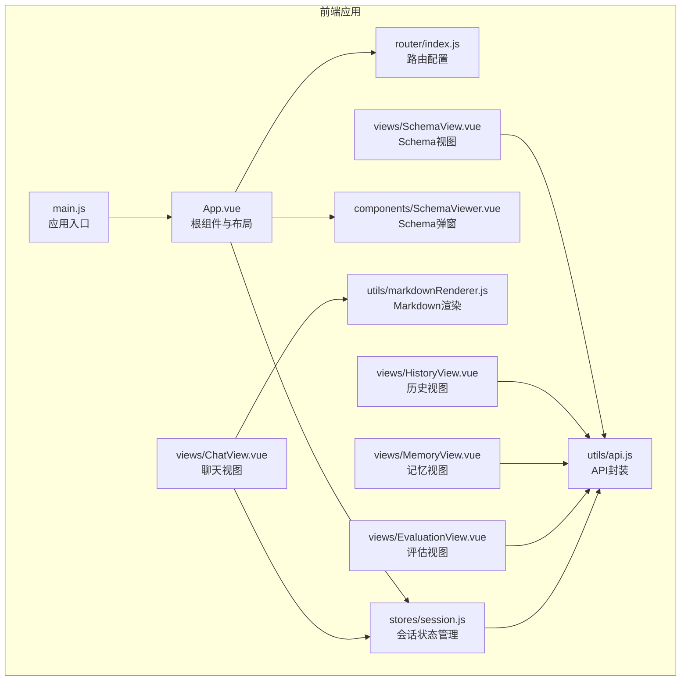
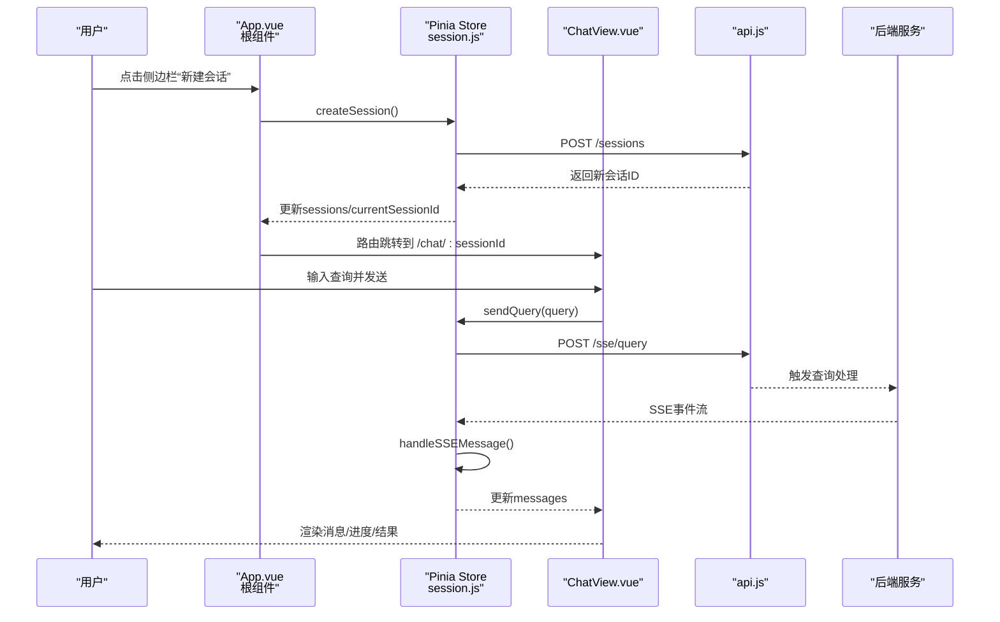
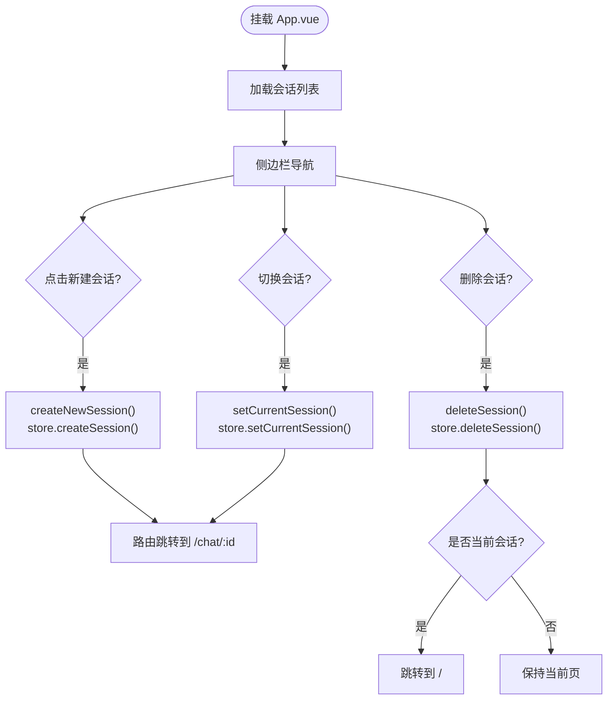
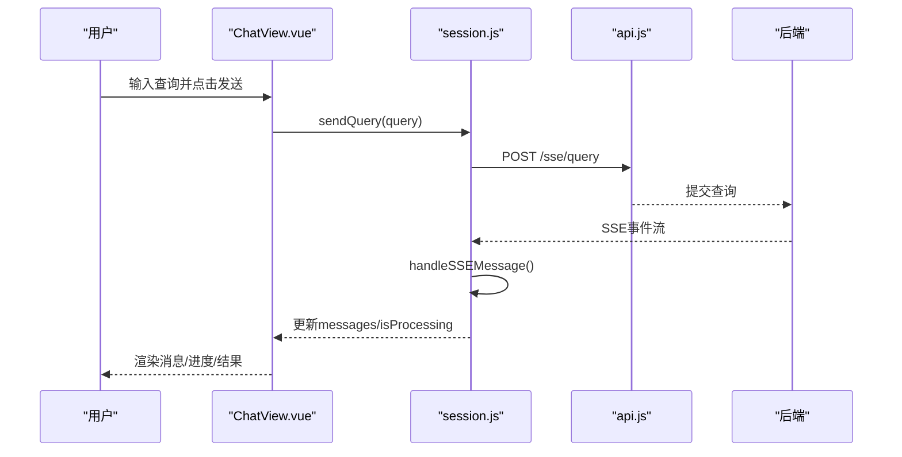
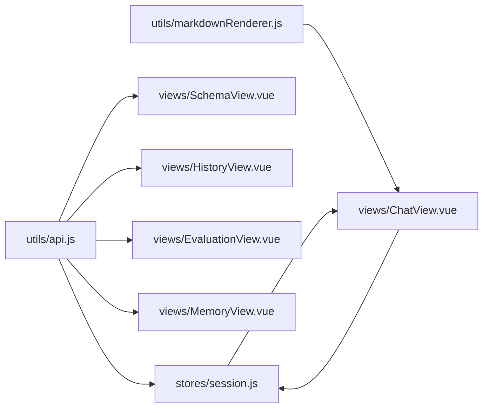

# 核心组件

<cite>
**本文档引用的文件**
- [App.vue](file://frontend/src/App.vue)
- [main.js](file://frontend/src/main.js)
- [router/index.js](file://frontend/src/router/index.js)
- [stores/session.js](file://frontend/src/stores/session.js)
- [views/ChatView.vue](file://frontend/src/views/ChatView.vue)
- [views/SchemaView.vue](file://frontend/src/views/SchemaView.vue)
- [views/HistoryView.vue](file://frontend/src/views/HistoryView.vue)
- [views/MemoryView.vue](file://frontend/src/views/MemoryView.vue)
- [views/EvaluationView.vue](file://frontend/src/views/EvaluationView.vue)
- [components/SchemaViewer.vue](file://frontend/src/components/SchemaViewer.vue)
- [utils/api.js](file://frontend/src/utils/api.js)
- [utils/markdownRenderer.js](file://frontend/src/utils/markdownRenderer.js)
- [package.json](file://frontend/package.json)
</cite>

## 目录
1. [简介](#简介)
2. [项目结构](#项目结构)
3. [核心组件](#核心组件)
4. [架构总览](#架构总览)
5. [详细组件分析](#详细组件分析)
6. [依赖分析](#依赖分析)
7. [性能考虑](#性能考虑)
8. [故障排查指南](#故障排查指南)
9. [结论](#结论)
10. [附录](#附录)

## 简介
本文件面向 NL2SQL 前端核心组件，围绕 Vue 3 Composition API 的组件架构进行系统化梳理，重点覆盖：
- 根组件 App.vue 的布局系统、侧边栏导航与主内容区管理
- 视图组件：ChatView（聊天界面与实时通信）、SchemaView（数据结构查看）、HistoryView（查询历史管理）、MemoryView（长期记忆展示）、EvaluationView（系统评估）
- 组件间通信机制、props 传递与事件处理
- 最佳实践、性能优化与可复用性设计原则

## 项目结构
前端采用模块化组织，核心目录与职责如下：
- src/
  - components/：可复用 UI 组件（如 SchemaViewer）
  - views/：页面级视图组件（ChatView、SchemaView、HistoryView、MemoryView、EvaluationView）
  - router/：路由配置与导航守卫
  - stores/：状态管理（Pinia）会话 Store
  - utils/：工具模块（API 封装、Markdown 渲染）
  - App.vue、main.js：应用入口与根组件
- package.json：依赖与构建脚本

**图表来源**
- [App.vue:1-384](file://frontend/src/App.vue#L1-L384)
- [main.js:1-89](file://frontend/src/main.js#L1-L89)
- [router/index.js:1-157](file://frontend/src/router/index.js#L1-L157)
- [stores/session.js:1-400](file://frontend/src/stores/session.js#L1-L400)
- [views/ChatView.vue:1-778](file://frontend/src/views/ChatView.vue#L1-L778)
- [views/SchemaView.vue:1-322](file://frontend/src/views/SchemaView.vue#L1-L322)
- [views/HistoryView.vue:1-441](file://frontend/src/views/HistoryView.vue#L1-L441)
- [views/MemoryView.vue:1-511](file://frontend/src/views/MemoryView.vue#L1-L511)
- [views/EvaluationView.vue:1-699](file://frontend/src/views/EvaluationView.vue#L1-L699)
- [components/SchemaViewer.vue:1-317](file://frontend/src/components/SchemaViewer.vue#L1-L317)
- [utils/api.js:1-303](file://frontend/src/utils/api.js#L1-L303)
- [utils/markdownRenderer.js:1-258](file://frontend/src/utils/markdownRenderer.js#L1-L258)

**章节来源**
- [main.js:1-89](file://frontend/src/main.js#L1-L89)
- [router/index.js:1-157](file://frontend/src/router/index.js#L1-L157)

## 核心组件
本节聚焦根组件与会话状态管理，它们是前端交互与数据流的核心枢纽。

- 根组件 App.vue
  - 布局：侧边栏 + 主内容区 + Schema 弹窗
  - 侧边栏功能：Logo、新建会话、会话列表、底部工具栏（Schema、记忆、评估、设置、折叠）
  - 主内容区：router-view 占位，承载各页面视图
  - 与会话状态管理集成：读取会话列表、当前会话 ID；创建/切换/删除会话；跳转路由
  - 与 SchemaViewer 组件联动：控制弹窗显隐

- 会话状态管理（Pinia）
  - 状态：sessions、currentSessionId、messages、sensitive（SSE 连接、处理状态、进度）
  - 计算属性：currentSession、messageCount
  - 动作：loadSessions、createSession、setCurrentSession、loadMessages、addMessage、connectSSE、sendQuery、disconnectSSE、deleteSession
  - SSE 处理：handleSSEMessage 统一处理“连接”“处理中”“进度”“结果/澄清/错误”等事件类型

**章节来源**
- [App.vue:1-384](file://frontend/src/App.vue#L1-L384)
- [stores/session.js:1-400](file://frontend/src/stores/session.js#L1-L400)

## 架构总览
前端采用“根组件 + 路由 + Pinia 状态 + 视图组件”的分层架构。根组件负责布局与导航，路由负责页面切换，Pinia 管理会话与 SSE，视图组件负责具体业务展示与交互。

**图表来源**
- [App.vue:172-186](file://frontend/src/App.vue#L172-L186)
- [stores/session.js:118-138](file://frontend/src/stores/session.js#L118-L138)
- [stores/session.js:297-330](file://frontend/src/stores/session.js#L297-L330)
- [utils/api.js:246-251](file://frontend/src/utils/api.js#L246-L251)
- [views/ChatView.vue:196-214](file://frontend/src/views/ChatView.vue#L196-L214)

## 详细组件分析

### 根组件 App.vue
- 布局与交互
  - 侧边栏：Logo、新建会话、会话列表（含删除）、底部工具栏（Schema、记忆、评估、设置、折叠）
  - 主内容区：router-view
  - Schema 弹窗：v-model 控制显隐
- 会话管理
  - 读取 sessions/currentSessionId（computed）
  - createNewSession：调用 store 创建会话并跳转到对应聊天页
  - switchSession：设置当前会话并跳转
  - handleDeleteSession：确认删除、调用 store 删除并清理当前会话
- 路由跳转
  - goToMemory/goToEvaluation：push 到 /memory 或 /evaluation
- 生命周期
  - onMounted：加载会话列表

**图表来源**
- [App.vue:172-228](file://frontend/src/App.vue#L172-L228)
- [stores/session.js:144-155](file://frontend/src/stores/session.js#L144-L155)

**章节来源**
- [App.vue:1-384](file://frontend/src/App.vue#L1-L384)

### 视图组件：ChatView（聊天界面与实时通信）
- 功能要点
  - 消息列表：用户消息、助手消息（含 Markdown 渲染、SQL 代码块、数据表格）
  - 处理状态：进度条、打字动画、状态文本
  - 输入区域：多行文本框、快捷键 Enter 发送、禁用态控制
  - 实时通信：通过 SSE 接收后端事件，更新消息列表与处理状态
- 关键实现
  - 与 Pinia 会话 Store 集成：messages、isProcessing、processingStatus、processingProgress
  - 初始化：onMounted 时根据路由参数设置当前会话并连接 SSE
  - 发送消息：sendMessage -> sessionStore.sendQuery
  - 监听：watch 路由参数变化、消息变化、处理状态变化，自动滚动到底部
  - Markdown 渲染：renderContent 使用 markdownRenderer；SQL 高亮：renderSQL 使用 Shiki
  - 复制 SQL：navigator.clipboard

**图表来源**
- [views/ChatView.vue:196-214](file://frontend/src/views/ChatView.vue#L196-L214)
- [stores/session.js:297-330](file://frontend/src/stores/session.js#L297-L330)
- [utils/api.js:246-251](file://frontend/src/utils/api.js#L246-L251)

**章节来源**
- [views/ChatView.vue:1-778](file://frontend/src/views/ChatView.vue#L1-L778)
- [utils/markdownRenderer.js:181-220](file://frontend/src/utils/markdownRenderer.js#L181-L220)

### 视图组件：SchemaView（数据结构查看）
- 功能要点
  - 页面标题、刷新按钮
  - 统计信息：表数量、指标数量、维度数量
  - 标签页：表结构、指标、维度、表关系
  - 表卡片：字段列表、主键标识、描述
- 关键实现
  - 加载 Schema：onMounted -> loadSchema -> api.getSchema
  - 列表渲染：Element Plus 表格组件
  - 响应式数据：schemaData（tables、relationships、metrics、dimensions）

**章节来源**
- [views/SchemaView.vue:1-322](file://frontend/src/views/SchemaView.vue#L1-L322)
- [utils/api.js:118-120](file://frontend/src/utils/api.js#L118-L120)

### 视图组件：HistoryView（查询历史管理）
- 功能要点
  - 搜索查询内容、筛选状态（成功/失败）、日期范围
  - 历史列表：查询内容、时间、状态、执行信息、操作（查看、复制）
  - 分页：每页条数、页码变更
  - 详情弹窗：展示查询内容、生成 SQL、状态、错误信息、执行时间、返回行数、查询时间
- 关键实现
  - 过滤：computed filteredHistory（查询内容、状态、日期范围）
  - 加载：loadHistory -> api.getQueryHistory（分页参数）
  - 复制：navigator.clipboard
  - 时间格式化：dayjs

**章节来源**
- [views/HistoryView.vue:1-441](file://frontend/src/views/HistoryView.vue#L1-L441)
- [utils/api.js:206-208](file://frontend/src/utils/api.js#L206-L208)

### 视图组件：MemoryView（长期记忆展示）
- 功能要点
  - 用户ID选择、加载数据
  - 统计卡片：总记录数、字段别名、查询模式、常用指标、常用维度
  - 类型筛选：字段别名、查询模式、常用指标、常用维度
  - 表格展示：不同类型的记忆项
  - 原始数据 JSON 查看
- 关键实现
  - 加载：axios.get(/api/preferences/:userId/raw)
  - 删除：axios.delete(/api/preferences/:id)
  - 格式化：Date.toLocaleString

**章节来源**
- [views/MemoryView.vue:1-511](file://frontend/src/views/MemoryView.vue#L1-L511)

### 视图组件：EvaluationView（系统评估界面）
- 功能要点
  - 配置状态提示（后端开关）
  - 统计概览：Schema 检索命中率、查询历史命中率、长期记忆命中率、刷新/重置
  - 详细统计：向量检索距离分布、记忆类型命中率
  - 质量评估：Schema 向量化质量、查询相似度评估（并行执行）
- 关键实现
  - 统计刷新：evaluationApi.getStats -> 更新 vectorStats/memoryStats/config
  - 重置：evaluationApi.resetStats
  - 评估：evaluationApi.evaluateSchemaQuality / evaluateQueryQuality（Promise.all 并行）
  - 标签颜色：根据命中率/分数动态配色

**章节来源**
- [views/EvaluationView.vue:1-699](file://frontend/src/views/EvaluationView.vue#L1-L699)
- [utils/api.js:260-302](file://frontend/src/utils/api.js#L260-L302)

### 可复用组件：SchemaViewer（Schema 弹窗）
- 功能要点
  - v-model 控制显隐
  - 搜索框：支持表名/字段/描述搜索
  - 折叠面板：表标题（中英文）、字段列表、关联关系
- 关键实现
  - props/modelValue + emit(update:modelValue) 实现双向绑定
  - watch(visible)：打开时懒加载 Schema
  - 过滤：computed filteredTables（大小写不敏感）

**章节来源**
- [components/SchemaViewer.vue:1-317](file://frontend/src/components/SchemaViewer.vue#L1-L317)
- [utils/api.js:118-120](file://frontend/src/utils/api.js#L118-L120)

## 依赖分析
- 核心依赖
  - Vue 3、Vue Router、Pinia、Element Plus
  - axios（API 封装）、uuid（会话 ID）、dayjs（时间处理）、markdown-it/shiki/mermaid/katex（富文本渲染）
- 组件耦合
  - App.vue 与 stores/session.js 强耦合（会话管理）
  - ChatView 与 stores/session.js 强耦合（SSE 与消息）
  - 各视图组件均依赖 utils/api.js 进行后端通信
  - ChatView 依赖 utils/markdownRenderer.js 进行内容渲染
- 外部接口
  - /api/sessions、/api/sessions/:id/messages、/api/sse/query、/api/schema、/api/queries/history、/api/evaluation/*

**图表来源**
- [utils/api.js:1-303](file://frontend/src/utils/api.js#L1-L303)
- [stores/session.js:1-400](file://frontend/src/stores/session.js#L1-L400)
- [views/ChatView.vue:1-778](file://frontend/src/views/ChatView.vue#L1-L778)
- [views/SchemaView.vue:1-322](file://frontend/src/views/SchemaView.vue#L1-L322)
- [views/HistoryView.vue:1-441](file://frontend/src/views/HistoryView.vue#L1-L441)
- [views/EvaluationView.vue:1-699](file://frontend/src/views/EvaluationView.vue#L1-L699)
- [views/MemoryView.vue:1-511](file://frontend/src/views/MemoryView.vue#L1-L511)
- [utils/markdownRenderer.js:1-258](file://frontend/src/utils/markdownRenderer.js#L1-L258)

**章节来源**
- [package.json:11-29](file://frontend/package.json#L11-L29)

## 性能考虑
- 渲染优化
  - ChatView：长消息折叠、消息列表虚拟滚动（建议）；仅在消息变化时滚动到底部
  - SchemaView/SchemaViewer：大表列表使用分页或懒加载（建议）
- 网络优化
  - API 封装统一错误处理与超时；SSE 连接复用与断线重连策略（建议）
- 资源加载
  - Markdown 渲染与代码高亮按需加载（当前已异步初始化 Shiki），避免阻塞首屏
- 状态管理
  - Pinia Store 使用 computed 缓存派生状态，减少重复计算
- 交互体验
  - 输入防抖/去抖（发送查询）；加载状态骨架屏（HistoryView、SchemaViewer）

[本节为通用指导，无需特定文件来源]

## 故障排查指南
- 会话相关
  - 创建/切换/删除失败：检查后端 /api/sessions 接口与权限；查看控制台错误与 Element Plus 消息提示
  - SSE 不工作：确认 /api/sse/stream 路径与 session_id 参数；检查浏览器控制台与 Network 面板
- 聊天界面
  - 消息不显示：确认 messages 是否更新；检查 SSE 事件类型与 handleSSEMessage 分支
  - Markdown/SQL 渲染异常：检查 markdownRenderer 初始化与 Shiki 加载
- 历史/记忆/评估
  - 加载失败：查看 API 返回的错误信息；确认后端 /api/queries/history、/api/preferences、/api/evaluation/* 是否可用
  - 评估未启用：后端需开启评估开关，前端会显示提示

**章节来源**
- [stores/session.js:185-221](file://frontend/src/stores/session.js#L185-L221)
- [utils/api.js:67-88](file://frontend/src/utils/api.js#L67-L88)
- [views/EvaluationView.vue:17-25](file://frontend/src/views/EvaluationView.vue#L17-L25)

## 结论
NL2SQL 前端以 App.vue 为布局核心，结合 Vue Router 与 Pinia，形成清晰的页面与状态管理分层。ChatView 通过 SSE 实现实时交互，SchemaView/MemoryView/EvaluationView 分别覆盖数据结构、长期记忆与系统评估场景。组件间通过 props 与事件、Pinia Store 以及统一 API 封装实现松耦合协作。建议后续在渲染性能、SSE 连接稳定性与资源按需加载方面持续优化。

[本节为总结，无需特定文件来源]

## 附录
- 组件开发最佳实践
  - 使用 Composition API 与 script setup，保持逻辑内聚
  - 明确 props 与 emits，遵循单向数据流
  - 将 UI 与业务逻辑分离，便于复用与测试
  - 统一错误处理与加载状态，提升用户体验
- 性能优化建议
  - 大列表虚拟滚动、图片懒加载、资源按需加载
  - Pinia 状态缓存与计算属性复用
  - SSE 连接池与断线重连策略
- 可复用性设计
  - 将通用 UI（如 SchemaViewer）抽象为独立组件，通过 v-model 控制显隐
  - API 封装集中化，统一拦截与错误处理

[本节为通用指导，无需特定文件来源]