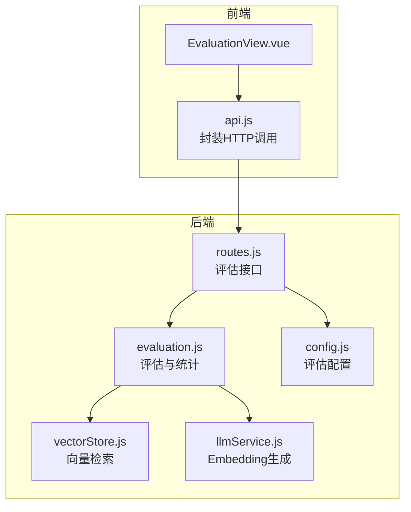
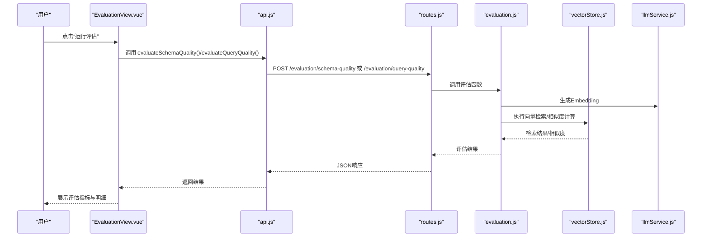
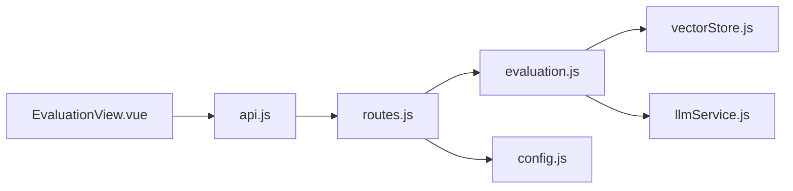

# 系统评估界面

<cite>
**本文引用的文件**
- [EvaluationView.vue](file://frontend/src/views/EvaluationView.vue)
- [evaluation.js](file://backend/src/utils/evaluation.js)
- [routes.js](file://backend/src/core/routes.js)
- [api.js](file://frontend/src/utils/api.js)
- [config.js](file://backend/src/core/config.js)
- [vectorStore.js](file://backend/src/memory/vectorStore.js)
- [llmService.js](file://backend/src/core/llmService.js)
</cite>

## 目录
1. [简介](#简介)
2. [项目结构](#项目结构)
3. [核心组件](#核心组件)
4. [架构总览](#架构总览)
5. [详细组件分析](#详细组件分析)
6. [依赖关系分析](#依赖关系分析)
7. [性能考量](#性能考量)
8. [故障排查指南](#故障排查指南)
9. [结论](#结论)
10. [附录](#附录)

## 简介
本文件面向 NL2SQL 系统评估界面组件，围绕 EvaluationView.vue 的实现架构展开，系统性阐述：
- 系统性能指标展示：向量检索命中率、记忆命中率、距离分布
- 查询质量评估：Schema 向量化质量与查询相似度评估
- 用户满意度统计与趋势分析：基于阈值与评分体系
- 评估数据收集机制、计算方法、可视化展示与报告生成
- 评估指标定义、权重与阈值设置
- 结果解读指南、改进建议与性能优化策略
- 实际评估案例与数据分析方法

## 项目结构
前端采用 Vue 3 + Element Plus，后端采用 Express + LanceDB/SQLite。评估界面位于前端 EvaluationView.vue，后端通过路由暴露评估接口，并在运行时统计与评估算法中实现非侵入式评估。

图表来源
- [EvaluationView.vue:1-699](file://frontend/src/views/EvaluationView.vue#L1-L699)
- [api.js:260-302](file://frontend/src/utils/api.js#L260-L302)
- [routes.js:722-856](file://backend/src/core/routes.js#L722-L856)
- [evaluation.js:1-488](file://backend/src/utils/evaluation.js#L1-L488)
- [vectorStore.js:378-420](file://backend/src/memory/vectorStore.js#L378-L420)
- [llmService.js:1-200](file://backend/src/core/llmService.js#L1-L200)
- [config.js:342-354](file://backend/src/core/config.js#L342-L354)

章节来源
- [EvaluationView.vue:1-699](file://frontend/src/views/EvaluationView.vue#L1-L699)
- [routes.js:722-856](file://backend/src/core/routes.js#L722-L856)

## 核心组件
- 前端评估视图 EvaluationView.vue
  - 展示运行时统计（向量检索命中率、记忆命中率、距离分布）
  - 执行评估（Schema 向量化质量、查询相似度评估）
  - 结果可视化（指标卡片、表格、进度条）
- 后端评估模块 evaluation.js
  - 运行时统计（内存中，非侵入式）
  - 评估算法（Schema 向量化质量、查询相似度评估）
  - 报告生成与阈值配置
- 后端路由 routes.js
  - 提供 /evaluation/* 接口，调用评估模块
- 前端 API 封装 api.js
  - 统一封装 /api/* 调用，包含评估相关接口

章节来源
- [EvaluationView.vue:28-299](file://frontend/src/views/EvaluationView.vue#L28-L299)
- [evaluation.js:19-407](file://backend/src/utils/evaluation.js#L19-L407)
- [routes.js:722-856](file://backend/src/core/routes.js#L722-L856)
- [api.js:260-302](file://frontend/src/utils/api.js#L260-L302)

## 架构总览
评估界面采用前后端分离架构：
- 前端负责交互与可视化
- 后端负责评估计算与统计
- 通过 REST API 通信，支持手动触发评估与实时统计

图表来源
- [EvaluationView.vue:466-491](file://frontend/src/views/EvaluationView.vue#L466-L491)
- [api.js:290-301](file://frontend/src/utils/api.js#L290-L301)
- [routes.js:771-841](file://backend/src/core/routes.js#L771-L841)
- [evaluation.js:158-334](file://backend/src/utils/evaluation.js#L158-L334)
- [vectorStore.js:378-420](file://backend/src/memory/vectorStore.js#L378-L420)
- [llmService.js:1-200](file://backend/src/core/llmService.js#L1-L200)

## 详细组件分析

### 前端组件：EvaluationView.vue
- 功能职责
  - 展示运行时统计概览与详细分布
  - 执行评估并展示结果
  - 提供刷新与重置统计的操作入口
- 关键状态与计算
  - 运行时统计：vectorStats、memoryStats、config
  - 计算属性：距离分布百分比
- 评估结果展示
  - Schema 向量化质量：准确率、平均精确率、平均召回率、平均 F1 分数、Top1 命中
  - 查询相似度评估：平均误差、高相似度对、测试对总数
- 交互流程
  - 刷新统计：调用 getStats
  - 重置统计：调用 resetStats
  - 运行评估：并行执行两个评估接口

章节来源
- [EvaluationView.vue:330-499](file://frontend/src/views/EvaluationView.vue#L330-L499)

### 后端模块：evaluation.js
- 评估配置
  - EVAL_CONFIG.enabled：是否启用评估
  - EVAL_CONFIG.trackStats：是否记录运行时统计
  - thresholds：相似度与质量阈值
- 运行时统计
  - vectorSearch：schema/query 搜索次数与命中次数，距离分布
  - longTermMemory：总体命中率与按类型命中统计
  - recordVectorSearch、recordMemoryHit：非侵入式记录
- 评估算法
  - evaluateSchemaVectorQuality：基于 Embedding 的表级检索评估，计算精确率、召回率、F1 分数
  - evaluateQueryVectorQuality：计算查询对的余弦相似度，统计误差与相似度分布
  - calculateCosineSimilarity：余弦相似度计算
- 报告与重置
  - getVectorSearchStats、getLongTermMemoryStats、getFullStatsReport
  - resetStats：重置统计

章节来源
- [evaluation.js:19-488](file://backend/src/utils/evaluation.js#L19-L488)

### 后端路由：routes.js
- 评估接口
  - GET /evaluation/stats：获取运行时统计报告
  - POST /evaluation/stats/reset：重置统计数据
  - POST /evaluation/schema-quality：执行 Schema 向量化质量评估
  - POST /evaluation/query-quality：执行查询相似度评估
  - GET /evaluation/config：获取评估配置
- 调用链
  - 评估接口 -> evaluation 模块 -> llmService/vectorStore

章节来源
- [routes.js:722-856](file://backend/src/core/routes.js#L722-L856)

### 前端 API 封装：api.js
- 评估相关接口
  - evaluationApi.getStats
  - evaluationApi.resetStats
  - evaluationApi.getConfig
  - evaluationApi.evaluateSchemaQuality
  - evaluationApi.evaluateQueryQuality
- 统一错误处理与拦截器

章节来源
- [api.js:260-302](file://frontend/src/utils/api.js#L260-L302)

### 向量检索与 Embedding：vectorStore.js 与 llmService.js
- vectorStore.searchSchemaSmart：智能搜索（带意图识别与重排序）
- llmService.getEmbedding：生成查询向量
- 评估中使用上述能力进行检索与相似度计算

章节来源
- [vectorStore.js:378-420](file://backend/src/memory/vectorStore.js#L378-L420)
- [llmService.js:1-200](file://backend/src/core/llmService.js#L1-L200)

### 评估指标定义与阈值
- 向量检索命中率
  - schema.hitRate = schema.hits / schema.searches × 100%
  - query.hitRate = query.hits / query.searches × 100%
- 距离分布
  - veryClose (<0.3)、close (0.3–0.5)、moderate (0.5–0.7)、far (>0.7)
- 记忆命中率
  - overall.hitRate = totalHits / totalQueries × 100%
  - byType.hitRate = hits / (hits + misses) × 100
- Schema 向量化质量
  - precision = TP / (TP + FP)，recall = TP / (TP + FN)，F1 = 2 × PR / (P + R)
  - 准确率：正确/全部（基于召回率阈值）
- 查询相似度评估
  - 余弦相似度，avgError = 平均绝对误差
  - 高/中/低相似度对统计

章节来源
- [evaluation.js:344-407](file://backend/src/utils/evaluation.js#L344-L407)
- [evaluation.js:158-334](file://backend/src/utils/evaluation.js#L158-L334)

### 评估数据收集机制与计算方法
- 运行时统计收集
  - recordVectorSearch：记录 schema/query 搜索与命中，更新距离分布
  - recordMemoryHit：记录总体与按类型命中
- 评估计算
  - evaluateSchemaVectorQuality：生成向量 -> 智能检索 -> 提取表名集合 -> 计算 PRF1
  - evaluateQueryVectorQuality：并行生成向量 -> 余弦相似度 -> 误差与分布统计
- 报告生成
  - getFullStatsReport：汇总统计与配置信息

章节来源
- [evaluation.js:71-122](file://backend/src/utils/evaluation.js#L71-L122)
- [evaluation.js:158-334](file://backend/src/utils/evaluation.js#L158-L334)
- [evaluation.js:397-407](file://backend/src/utils/evaluation.js#L397-L407)

### 可视化展示与交互
- 前端使用 Element Plus 组件：
  - 卡片与进度条展示命中率与分布
  - 标签颜色区分分数等级
  - 表格展示明细与误差
- 交互行为：
  - 刷新统计、重置统计、运行评估（并行）

章节来源
- [EvaluationView.vue:28-299](file://frontend/src/views/EvaluationView.vue#L28-L299)

### 报告生成与导出
- 后端提供完整统计报告（含生成时间与配置）
- 前端展示为卡片与表格，便于趋势分析与解读

章节来源
- [evaluation.js:397-407](file://backend/src/utils/evaluation.js#L397-L407)

## 依赖关系分析

图表来源
- [EvaluationView.vue](file://frontend/src/views/EvaluationView.vue#L324)
- [api.js:260-302](file://frontend/src/utils/api.js#L260-L302)
- [routes.js:722-856](file://backend/src/core/routes.js#L722-L856)
- [evaluation.js:1-488](file://backend/src/utils/evaluation.js#L1-L488)
- [vectorStore.js:1-200](file://backend/src/memory/vectorStore.js#L1-L200)
- [llmService.js:1-200](file://backend/src/core/llmService.js#L1-L200)
- [config.js:342-354](file://backend/src/core/config.js#L342-L354)

章节来源
- [routes.js:722-856](file://backend/src/core/routes.js#L722-L856)
- [evaluation.js:1-488](file://backend/src/utils/evaluation.js#L1-L488)

## 性能考量
- 评估接口并发执行
  - 前端并行调用两个评估接口，缩短等待时间
- 向量检索优化
  - 智能搜索（意图识别与重排序）提升检索质量
- 阈值与评分
  - 合理设置阈值，平衡精度与召回
- 统计记录非侵入式
  - 仅在开启 trackStats 时记录，避免影响主流程

章节来源
- [EvaluationView.vue:471-475](file://frontend/src/views/EvaluationView.vue#L471-L475)
- [evaluation.js:178-190](file://backend/src/utils/evaluation.js#L178-L190)
- [evaluation.js:21-31](file://backend/src/utils/evaluation.js#L21-L31)

## 故障排查指南
- 评估功能未启用
  - 现象：前端显示“评估功能未启用”提示
  - 原因：后端配置 EVALUATION_ENABLED=false
  - 处理：设置环境变量 EVALUATION_ENABLED=true
- 评估接口报错
  - 现象：403 禁止访问或错误响应
  - 原因：评估未启用或参数缺失
  - 处理：确认配置与请求体
- 统计数据为空
  - 现象：命中率为 0
  - 原因：未开启 trackStats 或无检索/记忆交互
  - 处理：开启 EVALUATION_TRACK_STATS=true 并进行检索/记忆交互
- 相似度计算异常
  - 现象：相似度为 NaN 或错误
  - 原因：Embedding 维度不一致或 API 调用失败
  - 处理：检查 Embedding 模型与 API 配置

章节来源
- [EvaluationView.vue:17-25](file://frontend/src/views/EvaluationView.vue#L17-L25)
- [routes.js:773-778](file://backend/src/core/routes.js#L773-L778)
- [evaluation.js:19-31](file://backend/src/utils/evaluation.js#L19-L31)
- [config.js:342-354](file://backend/src/core/config.js#L342-L354)

## 结论
EvaluationView.vue 与后端评估模块协同，提供了非侵入式的系统评估能力。通过运行时统计与手动评估相结合，能够全面衡量向量化质量与记忆命中效果，并以直观的可视化方式呈现结果。建议在生产环境中谨慎开启评估与统计功能，结合阈值与评分体系持续优化检索与记忆质量。

## 附录

### 评估指标与阈值对照表
- 命中率
  - schema.hitRate、query.hitRate、overall.hitRate
- 距离分布
  - veryClose、close、moderate、far
- 记忆类型命中
  - field_alias、query_pattern、metric_preference、dimension_preference
- Schema 向量化质量
  - precision、recall、f1Score、accuracy
- 查询相似度评估
  - avgError、highSimilarity、mediumSimilarity、lowSimilarity、total

章节来源
- [evaluation.js:344-407](file://backend/src/utils/evaluation.js#L344-L407)
- [evaluation.js:158-334](file://backend/src/utils/evaluation.js#L158-L334)

### 实际评估案例与数据分析方法
- 案例建议
  - 使用默认测试集进行快速评估，再引入业务场景自定义测试
  - 对比不同阈值下的命中率与误差，寻找最优平衡点
- 分析方法
  - 按类型统计命中率差异，定位薄弱环节
  - 分析距离分布，判断向量质量与检索策略有效性
  - 结合平均误差与高相似度对比例，评估语义一致性

章节来源
- [evaluation.js:439-459](file://backend/src/utils/evaluation.js#L439-L459)
- [evaluation.js:453-459](file://backend/src/utils/evaluation.js#L453-L459)