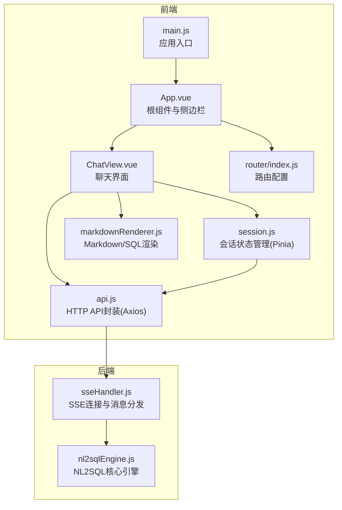
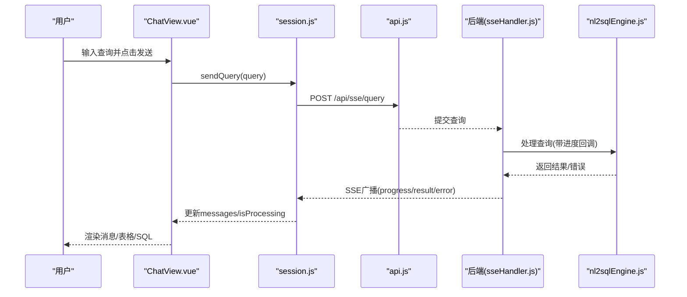
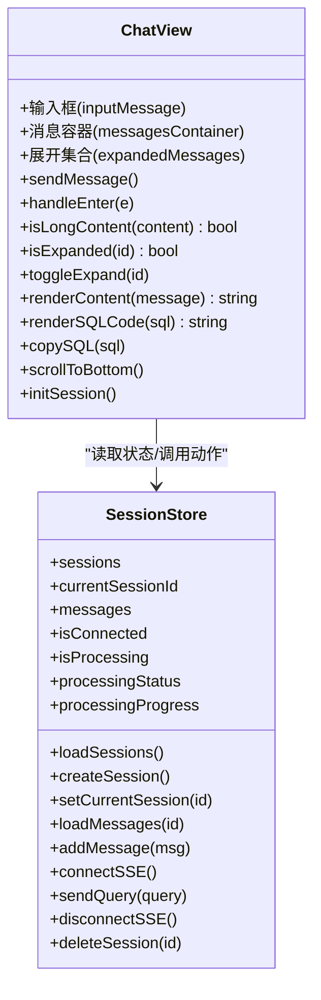
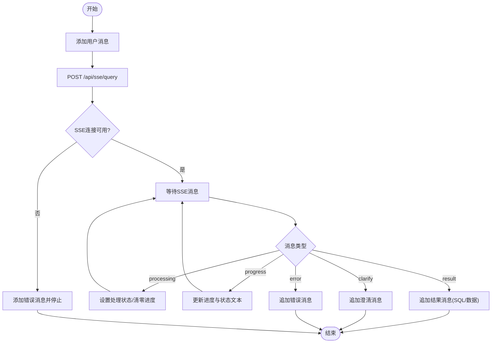
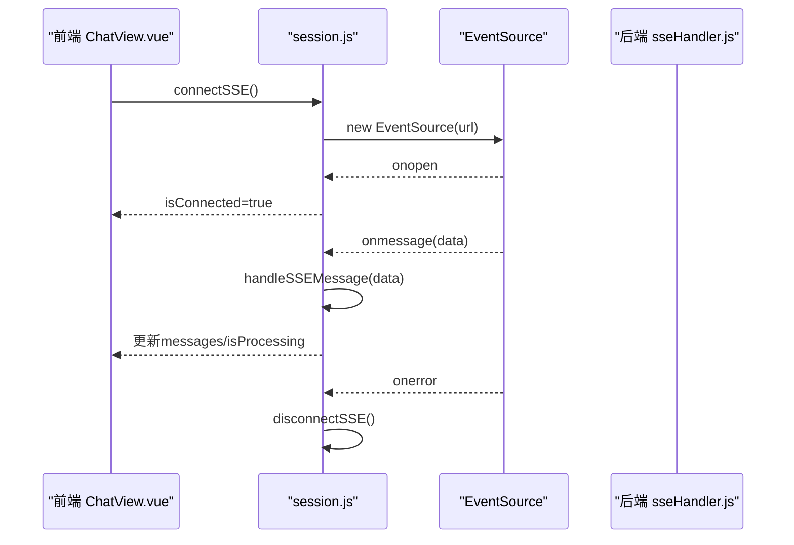
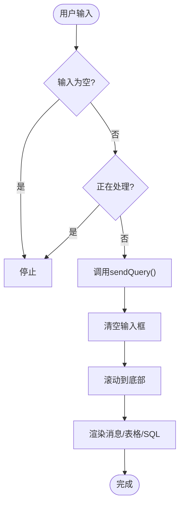
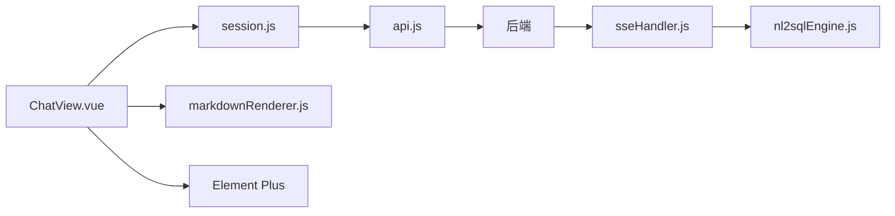

# 聊天界面组件

<cite>
**本文档引用的文件**
- [ChatView.vue](file://frontend/src/views/ChatView.vue)
- [session.js](file://frontend/src/stores/session.js)
- [api.js](file://frontend/src/utils/api.js)
- [markdownRenderer.js](file://frontend/src/utils/markdownRenderer.js)
- [App.vue](file://frontend/src/App.vue)
- [router/index.js](file://frontend/src/router/index.js)
- [main.js](file://frontend/src/main.js)
- [sseHandler.js](file://backend/src/core/sseHandler.js)
- [nl2sqlEngine.js](file://backend/src/core/nl2sqlEngine.js)
</cite>

## 目录
1. [简介](#简介)
2. [项目结构](#项目结构)
3. [核心组件](#核心组件)
4. [架构总览](#架构总览)
5. [详细组件分析](#详细组件分析)
6. [依赖关系分析](#依赖关系分析)
7. [性能考虑](#性能考虑)
8. [故障排除指南](#故障排除指南)
9. [结论](#结论)
10. [附录](#附录)

## 简介
本文件面向 NL2SQL 聊天界面组件 ChatView.vue 的实现架构，提供深入的技术文档，涵盖：
- 实时消息处理机制与 Server-Sent Events (SSE) 连接管理
- 用户输入处理与响应展示
- 组件状态管理、消息队列处理、错误处理机制与用户体验优化
- 与后端 API 的通信协议、数据流处理与实时更新机制
- 组件配置选项、自定义样式与扩展开发指南
- 实际代码示例与常见问题解决方案

## 项目结构
前端采用 Vue 3 Composition API + Pinia 状态管理 + Element Plus UI 组件库；后端基于 Node.js + Express，使用 SSE 推送流式结果。路由系统支持会话切换与懒加载页面。

**图表来源**
- [App.vue:1-384](file://frontend/src/App.vue#L1-L384)
- [ChatView.vue:1-778](file://frontend/src/views/ChatView.vue#L1-L778)
- [session.js:1-400](file://frontend/src/stores/session.js#L1-L400)
- [api.js:1-303](file://frontend/src/utils/api.js#L1-L303)
- [markdownRenderer.js:1-258](file://frontend/src/utils/markdownRenderer.js#L1-L258)
- [router/index.js:1-157](file://frontend/src/router/index.js#L1-L157)
- [main.js:1-89](file://frontend/src/main.js#L1-L89)
- [sseHandler.js:1-349](file://backend/src/core/sseHandler.js#L1-L349)
- [nl2sqlEngine.js:1-200](file://backend/src/core/nl2sqlEngine.js#L1-L200)

**章节来源**
- [main.js:1-89](file://frontend/src/main.js#L1-L89)
- [router/index.js:1-157](file://frontend/src/router/index.js#L1-L157)
- [App.vue:1-384](file://frontend/src/App.vue#L1-L384)

## 核心组件
- ChatView.vue：聊天界面视图，负责用户输入、消息渲染、SSE 连接与滚动控制。
- session.js：Pinia Store，管理会话列表、当前会话、消息队列、SSE 连接与处理状态。
- api.js：Axios 封装，提供 REST API 与 SSE 查询提交接口。
- markdownRenderer.js：Markdown/SQL 渲染工具，支持 Mermaid/KaTeX/代码高亮。
- sseHandler.js：后端 SSE 处理器，维护连接池、广播消息、进度回调。
- nl2sqlEngine.js：NL2SQL 引擎，负责意图识别、SQL 生成、验证与结果格式化。

**章节来源**
- [ChatView.vue:132-383](file://frontend/src/views/ChatView.vue#L132-L383)
- [session.js:33-399](file://frontend/src/stores/session.js#L33-L399)
- [api.js:246-251](file://frontend/src/utils/api.js#L246-L251)
- [markdownRenderer.js:181-220](file://frontend/src/utils/markdownRenderer.js#L181-L220)
- [sseHandler.js:43-112](file://backend/src/core/sseHandler.js#L43-L112)
- [nl2sqlEngine.js:145-200](file://backend/src/core/nl2sqlEngine.js#L145-L200)

## 架构总览
整体架构采用前后端分离设计：前端通过 HTTP POST 触发查询，后端通过 SSE 流式推送处理进度与最终结果。组件通过 Pinia 管理状态，Element Plus 提供 UI 交互，Markdown 渲染增强消息展示。

**图表来源**
- [ChatView.vue:196-214](file://frontend/src/views/ChatView.vue#L196-L214)
- [session.js:301-330](file://frontend/src/stores/session.js#L301-L330)
- [api.js:246-251](file://frontend/src/utils/api.js#L246-L251)
- [sseHandler.js:218-280](file://backend/src/core/sseHandler.js#L218-L280)
- [nl2sqlEngine.js:145-200](file://backend/src/core/nl2sqlEngine.js#L145-L200)

## 详细组件分析

### ChatView.vue 组件架构
- 响应式状态：输入框、消息容器 DOM 引用、展开状态集合、内容折叠阈值。
- 状态绑定：通过 computed 从 Pinia Store 获取 messages、isProcessing、processingStatus、processingProgress。
- 交互逻辑：发送消息、键盘事件处理(Enter/Shift+Enter)、长内容折叠/展开、滚动到底部。
- 渲染逻辑：Markdown 渲染、SQL 代码高亮、复制 SQL、数据表格展示、打字动画与进度条。
- 生命周期：挂载时初始化会话并连接 SSE，卸载时断开 SSE；监听路由参数变化与消息变化自动滚动。

**图表来源**
- [ChatView.vue:158-383](file://frontend/src/views/ChatView.vue#L158-L383)
- [session.js:42-399](file://frontend/src/stores/session.js#L42-L399)

**章节来源**
- [ChatView.vue:132-383](file://frontend/src/views/ChatView.vue#L132-L383)

### 状态管理与消息队列
- Pinia Store 管理：
  - sessions：会话列表
  - currentSessionId：当前会话
  - messages：消息数组
  - isConnected：SSE 连接状态
  - isProcessing、processingStatus、processingProgress：处理状态与进度
- 消息类型：
  - user：用户输入
  - assistant：助手回复，支持普通文本、澄清提示、错误消息、SQL 与数据表格
- 消息队列处理：
  - 用户消息：立即添加到队列
  - SSE 消息：根据 type 分发到相应分支，更新处理状态与进度，最终追加结果消息

**图表来源**
- [session.js:227-295](file://frontend/src/stores/session.js#L227-L295)
- [session.js:301-330](file://frontend/src/stores/session.js#L301-L330)

**章节来源**
- [session.js:33-399](file://frontend/src/stores/session.js#L33-L399)

### SSE 连接管理与实时更新
- 前端：
  - connectSSE：构造 URL /api/sse/stream?session_id=...，创建 EventSource，监听 open/message/error，保存连接实例。
  - handleSSEMessage：根据 data.type 分发消息，更新处理状态与进度，追加消息，刷新会话列表。
  - disconnectSSE：关闭连接并重置状态。
- 后端：
  - handleConnection：校验 session_id，设置 SSE 响应头，记录连接信息，发送 connected 消息，监听 close/error。
  - handleQuery：广播 processing -> progress -> result 或 error，清理 isProcessing 标志。
  - broadcastToSession：向同一会话的所有连接广播消息。

**图表来源**
- [session.js:185-221](file://frontend/src/stores/session.js#L185-L221)
- [session.js:227-295](file://frontend/src/stores/session.js#L227-L295)
- [sseHandler.js:43-112](file://backend/src/core/sseHandler.js#L43-L112)
- [sseHandler.js:218-280](file://backend/src/core/sseHandler.js#L218-L280)

**章节来源**
- [session.js:185-221](file://frontend/src/stores/session.js#L185-L221)
- [sseHandler.js:43-112](file://backend/src/core/sseHandler.js#L43-L112)

### 用户输入处理与响应展示
- 输入处理：
  - sendMessage：去空白、防重复提交、调用 sessionStore.sendQuery，清空输入并滚动到底部。
  - handleEnter：Enter 发送，Shift+Enter 换行。
- 展示优化：
  - 长内容折叠：超过阈值显示折叠按钮，点击切换展开/收起。
  - Markdown 渲染：renderContent 使用 markdown-it，支持 Mermaid/KaTeX。
  - SQL 高亮：renderSQL 使用 Shiki，支持复制到剪贴板。
  - 数据表格：assistant 消息中的数据以 Element Plus 表格展示。
  - 处理状态：打字动画与进度条，状态文本来自后端。

**图表来源**
- [ChatView.vue:196-214](file://frontend/src/views/ChatView.vue#L196-L214)
- [ChatView.vue:236-292](file://frontend/src/views/ChatView.vue#L236-L292)
- [markdownRenderer.js:181-220](file://frontend/src/utils/markdownRenderer.js#L181-L220)

**章节来源**
- [ChatView.vue:196-292](file://frontend/src/views/ChatView.vue#L196-L292)
- [markdownRenderer.js:181-220](file://frontend/src/utils/markdownRenderer.js#L181-L220)

### 与后端 API 的通信协议
- 健康检查与 Schema：/api/health、/api/health/detail、/api/schema、/api/schema/tables/{table}、/api/schema/search
- 会话管理：GET/POST/DELETE /api/users/anonymous/sessions、/api/sessions/{id}、/api/sessions/{id}/messages
- 查询历史与统计：/api/queries/history、/api/stats、/api/config
- SSE 查询：POST /api/sse/query，携带 session_id 与 query；SSE 流地址 /api/sse/stream?session_id={id}

**章节来源**
- [api.js:98-108](file://frontend/src/utils/api.js#L98-L108)
- [api.js:118-141](file://frontend/src/utils/api.js#L118-L141)
- [api.js:151-195](file://frontend/src/utils/api.js#L151-L195)
- [api.js:206-220](file://frontend/src/utils/api.js#L206-L220)
- [api.js:218-232](file://frontend/src/utils/api.js#L218-L232)
- [api.js:246-251](file://frontend/src/utils/api.js#L246-L251)

### 数据流处理与实时更新机制
- 前端数据流：
  - 用户输入 → sessionStore.sendQuery → HTTP POST → 后端处理 → SSE 广播 → sessionStore.handleSSEMessage → ChatView 渲染
- 后端数据流：
  - sseHandler.handleConnection → sseHandler.handleQuery → nl2sqlEngine.processQuery → 广播 progress/result/error
- 进度回调：
  - 后端在处理过程中通过回调函数周期性广播 progress，前端更新 processingStatus 与 processingProgress。

**章节来源**
- [session.js:227-295](file://frontend/src/stores/session.js#L227-L295)
- [sseHandler.js:248-279](file://backend/src/core/sseHandler.js#L248-L279)
- [nl2sqlEngine.js:145-200](file://backend/src/core/nl2sqlEngine.js#L145-L200)

### 组件配置选项、自定义样式与扩展开发
- 配置选项（前端）：
  - 折叠阈值：COLLAPSE_THRESHOLD 控制长内容折叠触发长度
  - 输入行为：Enter 发送，Shift+Enter 换行
  - 处理状态：processingStatus、processingProgress 由后端驱动
- 自定义样式：
  - 用户消息气泡、助手消息体、SQL 代码块、数据表格、打字动画与进度条样式均在组件内定义
  - Markdown 样式覆盖 Element Plus 的 :deep(...) 选择器
- 扩展开发建议：
  - 新增消息类型：在 sessionStore.handleSSEMessage 中新增 case，并在 ChatView.vue 中渲染
  - 自定义渲染器：在 markdownRenderer.js 中扩展 highlight/mermaid/katex 处理
  - SSE 类型扩展：在后端 sseHandler.js 中扩展消息类型与广播逻辑

**章节来源**
- [ChatView.vue:165](file://frontend/src/views/ChatView.vue#L165)
- [ChatView.vue:385-777](file://frontend/src/views/ChatView.vue#L385-L777)
- [markdownRenderer.js:74-100](file://frontend/src/utils/markdownRenderer.js#L74-L100)

## 依赖关系分析
- ChatView.vue 依赖：
  - session.js（Pinia Store）
  - api.js（HTTP/SSE）
  - markdownRenderer.js（渲染）
  - Element Plus（UI 组件与图标）
- session.js 依赖：
  - api.js（REST API）
  - EventSource（SSE）
- 后端依赖：
  - sseHandler.js 依赖 nl2sqlEngine.js 与数据库/日志模块

**图表来源**
- [ChatView.vue:142-152](file://frontend/src/views/ChatView.vue#L142-L152)
- [session.js:22-22](file://frontend/src/stores/session.js#L22-L22)
- [api.js:15-15](file://frontend/src/utils/api.js#L15-L15)
- [sseHandler.js:16-33](file://backend/src/core/sseHandler.js#L16-L33)
- [nl2sqlEngine.js:17-33](file://backend/src/core/nl2sqlEngine.js#L17-L33)

**章节来源**
- [ChatView.vue:142-152](file://frontend/src/views/ChatView.vue#L142-L152)
- [session.js:22-22](file://frontend/src/stores/session.js#L22-L22)
- [api.js:15-15](file://frontend/src/utils/api.js#L15-L15)
- [sseHandler.js:16-33](file://backend/src/core/sseHandler.js#L16-L33)
- [nl2sqlEngine.js:17-33](file://backend/src/core/nl2sqlEngine.js#L17-L33)

## 性能考虑
- DOM 操作优化：
  - 使用 nextTick 确保 DOM 更新后再滚动，避免闪烁
  - 消息列表使用虚拟滚动或分页策略可进一步优化长历史
- 渲染优化：
  - Markdown 渲染与 SQL 高亮为异步/延迟处理，减少主线程阻塞
  - Mermaid 渲染在下一 tick 执行，避免阻塞
- SSE 连接：
  - 单会话多连接支持，断线重连与错误处理完善
  - 进度回调频率适中，避免过多消息导致 UI 卡顿

[本节为通用性能建议，无需特定文件来源]

## 故障排除指南
- 无法连接 SSE：
  - 检查 session_id 是否有效，后端会话是否存在
  - 查看浏览器 Network 面板 SSE 连接状态与后端日志
- 查询无响应：
  - 确认 isProcessing 为 true 且 processingStatus 有更新
  - 检查后端进度回调是否正常广播
- 渲染异常：
  - Markdown/SQL 渲染失败时回退到纯文本
  - Mermaid 渲染失败会在容器内显示错误提示
- 复制 SQL 失败：
  - 检查浏览器 Clipboard API 权限与 HTTPS 环境

**章节来源**
- [session.js:185-221](file://frontend/src/stores/session.js#L185-L221)
- [session.js:227-295](file://frontend/src/stores/session.js#L227-L295)
- [markdownRenderer.js:156-170](file://frontend/src/utils/markdownRenderer.js#L156-L170)
- [ChatView.vue:285-292](file://frontend/src/views/ChatView.vue#L285-L292)

## 结论
ChatView.vue 通过 Pinia 管理状态、Axios 封装 API、SSE 实现实时流式响应，结合 Markdown/SQL 渲染与 UI 交互，提供了完整的 NL2SQL 聊天体验。其架构清晰、扩展性强，适合在现有基础上继续增强消息类型、渲染能力与性能优化。

[本节为总结性内容，无需特定文件来源]

## 附录
- 路由与会话：
  - 路由支持 /chat/:sessionId，进入页面时自动初始化会话并连接 SSE
  - 侧边栏支持新建/切换/删除会话，删除当前会话时跳转首页
- 应用入口：
  - main.js 安装路由、Pinia、Element Plus，注册全局图标，挂载应用

**章节来源**
- [router/index.js:51-58](file://frontend/src/router/index.js#L51-L58)
- [App.vue:176-228](file://frontend/src/App.vue#L176-L228)
- [main.js:55-89](file://frontend/src/main.js#L55-L89)