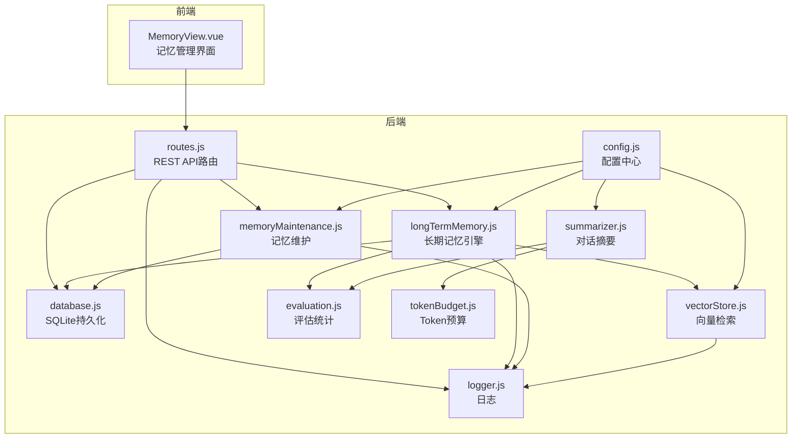
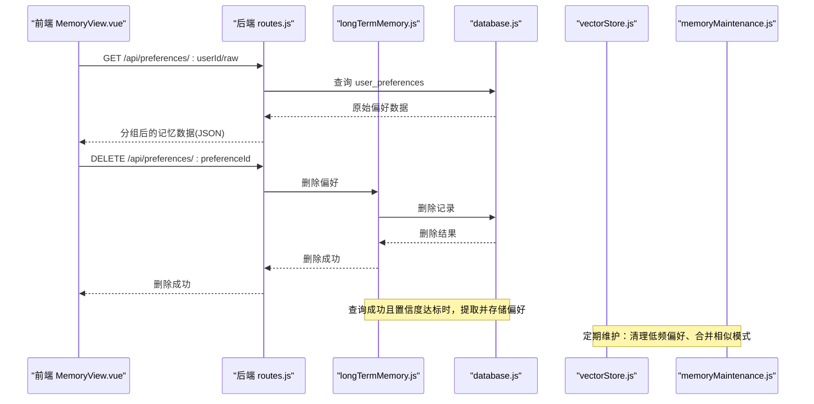
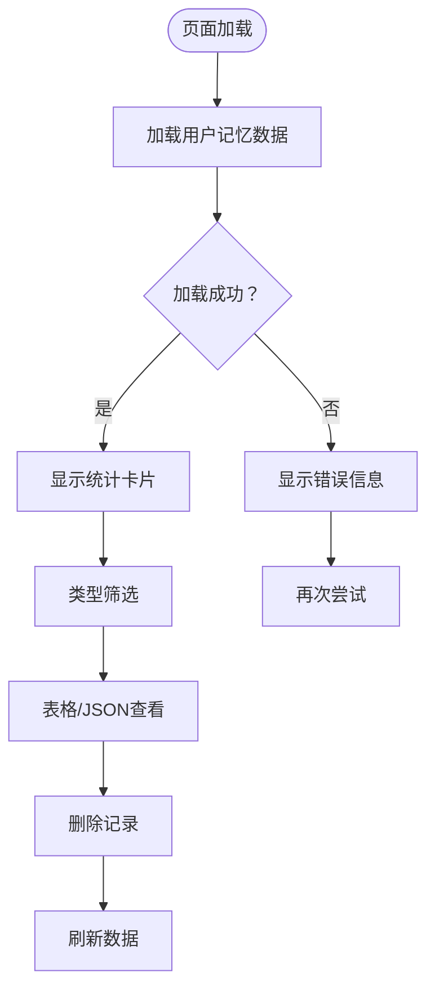
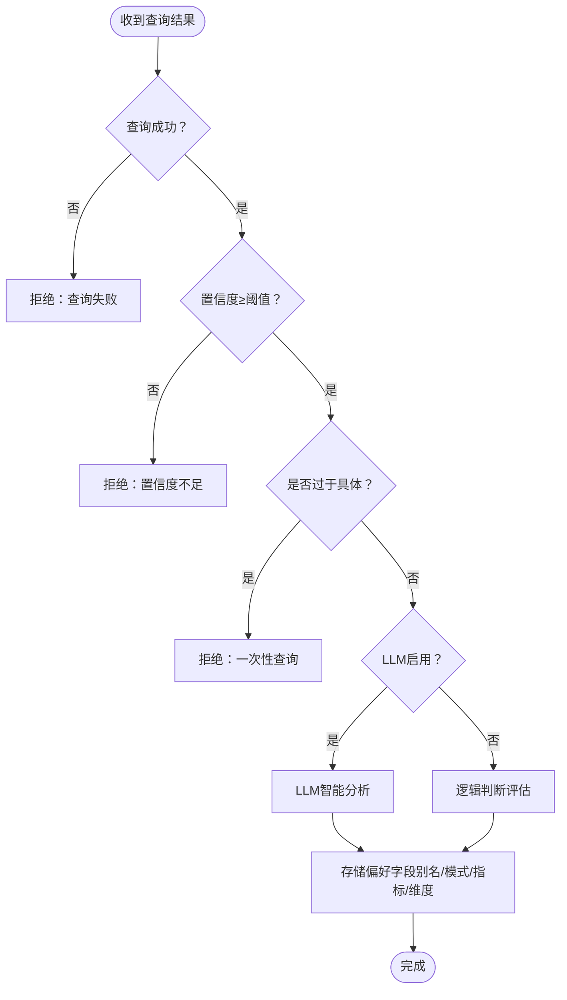
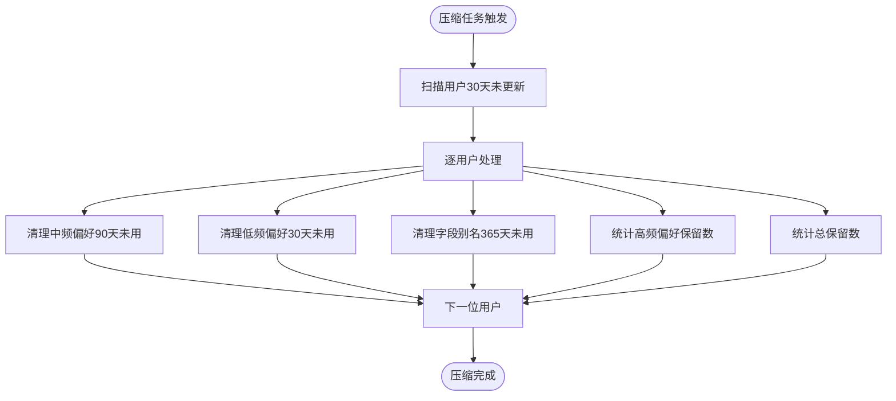
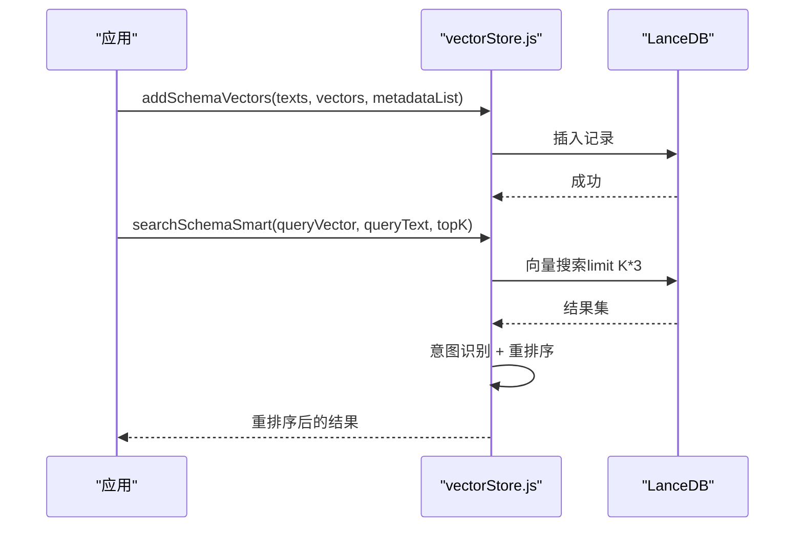
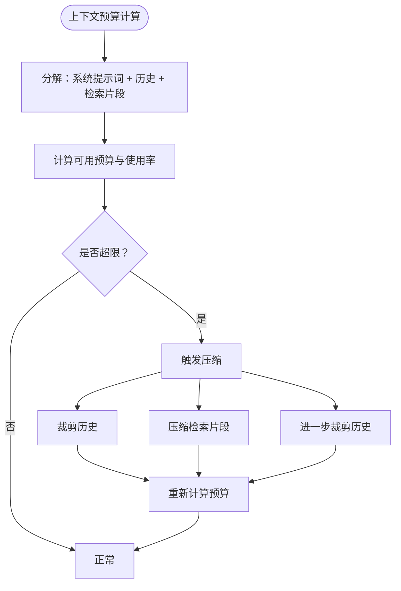
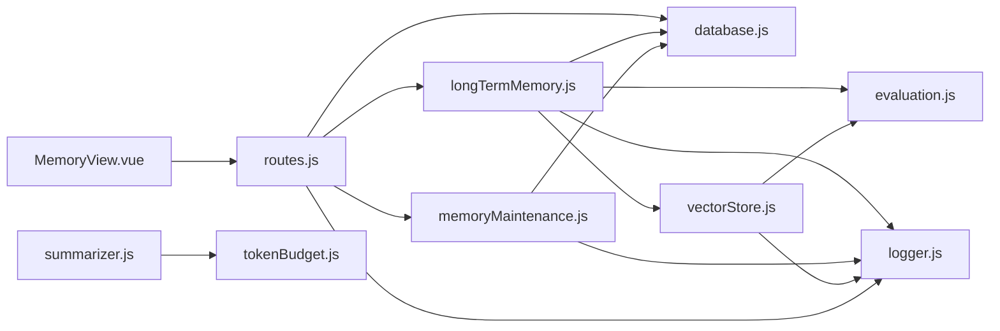

# 长期记忆管理

<cite>
**本文引用的文件**
- [MemoryView.vue](file://frontend/src/views/MemoryView.vue)
- [longTermMemory.js](file://backend/src/memory/longTermMemory.js)
- [vectorStore.js](file://backend/src/memory/vectorStore.js)
- [memoryMaintenance.js](file://backend/src/memory/memoryMaintenance.js)
- [summarizer.js](file://backend/src/memory/summarizer.js)
- [database.js](file://backend/src/core/database.js)
- [routes.js](file://backend/src/core/routes.js)
- [config.js](file://backend/src/core/config.js)
- [logger.js](file://backend/src/utils/logger.js)
- [evaluation.js](file://backend/src/utils/evaluation.js)
- [tokenBudget.js](file://backend/src/utils/tokenBudget.js)
</cite>

## 目录
1. [简介](#简介)
2. [项目结构](#项目结构)
3. [核心组件](#核心组件)
4. [架构概览](#架构概览)
5. [详细组件分析](#详细组件分析)
6. [依赖关系分析](#依赖关系分析)
7. [性能考量](#性能考量)
8. [故障排查指南](#故障排查指南)
9. [结论](#结论)
10. [附录](#附录)

## 简介
本文件面向 NL2SQL 系统的长期记忆管理组件，围绕前端 MemoryView.vue 与后端记忆子系统展开，系统性阐述用户偏好学习、记忆模式识别与智能推荐机制，以及与后端记忆系统的交互方式、数据同步与一致性保障。文档还涵盖记忆数据的存储结构、检索机制、更新策略、个性化配置、调试工具与性能监控，并提供实际应用场景与最佳实践指导。

## 项目结构
NL2SQL 的长期记忆管理由前后端协同实现：
- 前端：MemoryView.vue 提供记忆数据的可视化与管理界面，支持按类型筛选、删除记录、原始数据查看等功能。
- 后端：长期记忆模块负责偏好提取与存储、记忆维护与压缩、向量检索与语义搜索、对话摘要与上下文压缩等。

图表来源
- [MemoryView.vue:1-511](file://frontend/src/views/MemoryView.vue#L1-L511)
- [routes.js:453-716](file://backend/src/core/routes.js#L453-L716)
- [longTermMemory.js:1-800](file://backend/src/memory/longTermMemory.js#L1-L800)
- [memoryMaintenance.js:1-415](file://backend/src/memory/memoryMaintenance.js#L1-L415)
- [vectorStore.js:1-759](file://backend/src/memory/vectorStore.js#L1-L759)
- [summarizer.js:1-518](file://backend/src/memory/summarizer.js#L1-L518)
- [database.js:1-850](file://backend/src/core/database.js#L1-L850)
- [config.js:252-293](file://backend/src/core/config.js#L252-L293)
- [logger.js:1-442](file://backend/src/utils/logger.js#L1-L442)
- [evaluation.js:1-488](file://backend/src/utils/evaluation.js#L1-L488)
- [tokenBudget.js:1-435](file://backend/src/utils/tokenBudget.js#L1-L435)

章节来源
- [MemoryView.vue:1-511](file://frontend/src/views/MemoryView.vue#L1-L511)
- [routes.js:453-716](file://backend/src/core/routes.js#L453-L716)

## 核心组件
- MemoryView.vue：提供记忆数据的可视化界面，支持按类型筛选、删除记录、原始数据查看等。
- 长期记忆引擎（longTermMemory.js）：负责用户偏好提取、存储筛选、LLM智能提炼、查询模式与字段别名学习。
- 记忆维护（memoryMaintenance.js）：实现分级保留策略、相似模式合并、记忆统计与健康报告。
- 向量检索（vectorStore.js）：基于 LanceDB 的 Schema 与查询历史向量存储与语义检索，支持智能搜索与重排序。
- 对话摘要（summarizer.js）：长对话历史的自动摘要与压缩，结合 Token 预算控制。
- 数据库（database.js）：SQLite 用户偏好表的 CRUD、使用统计更新、查找已存在偏好等。
- 配置（config.js）：长期记忆、向量检索、上下文管理等配置项。
- 日志（logger.js）：统一日志记录，支持追踪与性能监控。
- 评估（evaluation.js）：向量化质量与记忆命中率统计，支持手动评估接口。
- Token 预算（tokenBudget.js）：上下文 Token 估算、预算控制与压缩策略。

章节来源
- [MemoryView.vue:191-254](file://frontend/src/views/MemoryView.vue#L191-L254)
- [longTermMemory.js:1-800](file://backend/src/memory/longTermMemory.js#L1-L800)
- [memoryMaintenance.js:1-415](file://backend/src/memory/memoryMaintenance.js#L1-L415)
- [vectorStore.js:1-759](file://backend/src/memory/vectorStore.js#L1-L759)
- [summarizer.js:1-518](file://backend/src/memory/summarizer.js#L1-L518)
- [database.js:599-850](file://backend/src/core/database.js#L599-L850)
- [config.js:252-293](file://backend/src/core/config.js#L252-L293)
- [logger.js:1-442](file://backend/src/utils/logger.js#L1-L442)
- [evaluation.js:1-488](file://backend/src/utils/evaluation.js#L1-L488)
- [tokenBudget.js:1-435](file://backend/src/utils/tokenBudget.js#L1-L435)

## 架构概览
长期记忆管理采用“前端展示 + 后端引擎”的分层架构：
- 前端通过 REST API 与后端交互，获取用户偏好、原始数据、统计信息，并支持删除偏好。
- 后端长期记忆引擎在查询成功且置信度达标时，进行偏好提取与存储；同时支持 LLM 智能提炼与逻辑判断两种策略。
- 记忆维护模块定期清理低频与过期偏好，合并相似模式，维持系统健康。
- 向量检索模块提供 Schema 与查询历史的语义检索，支持智能搜索与重排序。
- 对话摘要与 Token 预算模块保障长上下文的稳定性与性能。

图表来源
- [routes.js:453-716](file://backend/src/core/routes.js#L453-L716)
- [longTermMemory.js:312-485](file://backend/src/memory/longTermMemory.js#L312-L485)
- [database.js:599-850](file://backend/src/core/database.js#L599-L850)
- [vectorStore.js:1-759](file://backend/src/memory/vectorStore.js#L1-L759)
- [memoryMaintenance.js:1-415](file://backend/src/memory/memoryMaintenance.js#L1-L415)

## 详细组件分析

### MemoryView.vue：记忆管理界面
- 功能要点
  - 用户选择器：输入用户ID，加载该用户的记忆数据。
  - 加载状态与错误处理：统一的 loading 与错误提示。
  - 统计卡片：显示总记录数、字段别名、查询模式、常用指标、常用维度数量。
  - 类型筛选：支持按字段别名、查询模式、常用指标、常用维度切换查看。
  - 表格展示：分别展示字段别名映射、查询模式、常用指标、常用维度的列表。
  - 原始数据查看：以 JSON 形式展示原始数据，便于调试。
  - 删除功能：确认后调用后端删除接口，刷新数据。
  - 时间格式化：本地化时间显示。
- 交互流程
  - 页面加载时自动触发加载数据。
  - 点击“加载数据”按钮触发加载。
  - 点击“删除”按钮触发删除并刷新。

图表来源
- [MemoryView.vue:191-254](file://frontend/src/views/MemoryView.vue#L191-L254)

章节来源
- [MemoryView.vue:1-511](file://frontend/src/views/MemoryView.vue#L1-L511)

### 长期记忆引擎（longTermMemory.js）
- 用户偏好学习与存储
  - 前置筛选：查询必须成功且置信度≥阈值；排除过于具体的一次性查询。
  - LLM 智能提炼：通过系统提示词判断查询是否值得存入长期记忆，区分个人偏好与通用知识。
  - 逻辑判断：高价值模板（维度≥2且指标≥1）、高频模式（7天内≥2次）、简单查询需更高频率。
  - 偏好类型：查询模式、字段别名、常用指标、常用维度。
  - 存储策略：若已存在相同内容则更新使用次数，否则新增记录。
- 字段别名学习
  - 支持伪字段（如 database_identifier）的直接映射与值映射。
  - 映射冲突时记录警告并更新使用次数。
- 查询模式生成
  - 基于维度、指标、时间范围生成模式名称，避免重复并更新使用次数。
- 指标与维度偏好
  - 逐条存储并更新使用次数，便于后续推荐。

图表来源
- [longTermMemory.js:312-485](file://backend/src/memory/longTermMemory.js#L312-L485)

章节来源
- [longTermMemory.js:1-800](file://backend/src/memory/longTermMemory.js#L1-L800)
- [database.js:599-850](file://backend/src/core/database.js#L599-L850)

### 记忆维护（memoryMaintenance.js）
- 分级保留策略
  - 高频（≥10次）：永久保留。
  - 中频（3-9次）：90天未用清理。
  - 低频（<3次）：30天未用清理。
  - 字段别名：365天未用清理。
- 相似模式合并
  - 基于维度与指标重合度（>70%）与时间范围类型相同进行合并。
  - 合并后更新使用次数并记录来源。
- 统计与报告
  - 用户记忆统计：按类型统计数量、平均使用次数、最大使用次数、最久使用时间。
  - 系统健康报告：总体偏好数量、用户数量、平均使用次数、预估清理数量。

图表来源
- [memoryMaintenance.js:69-189](file://backend/src/memory/memoryMaintenance.js#L69-L189)

章节来源
- [memoryMaintenance.js:1-415](file://backend/src/memory/memoryMaintenance.js#L1-L415)

### 向量检索（vectorStore.js）
- Schema 向量
  - 添加 Schema 向量：文本、向量、元数据（含 scope、data_type 等）。
  - 搜索 Schema：支持过滤（scope、data_type、exclude_data_type），应用后过滤。
  - 智能搜索：基于查询文本识别意图（如提及具体游戏），进行优先级重排序（游戏表优先、平台表次之、原始日志表优先、报表降权）。
- 查询历史向量
  - 添加查询向量：记录查询ID、文本、向量、元数据。
  - 搜索相似查询：基于向量相似度返回 Top-K 结果。
- 通用操作
  - 删除向量（LanceDB 不支持直接删除，记录日志）。
  - 统计信息：Schema/查询向量数量。
  - 元数据增强：重要性评分、查询类型分类、复杂度统计、执行信息等。

图表来源
- [vectorStore.js:336-535](file://backend/src/memory/vectorStore.js#L336-L535)

章节来源
- [vectorStore.js:1-759](file://backend/src/memory/vectorStore.js#L1-L759)

### 对话摘要与上下文压缩（summarizer.js + tokenBudget.js）
- 对话摘要
  - 分割历史：保留最近若干轮，其余用于摘要。
  - 生成摘要：使用 LLM 将历史压缩为关键信息摘要。
  - 增量更新：将新对话合并到现有摘要。
  - 缓存管理：按会话ID缓存摘要，避免重复生成。
- Token 预算
  - 估算：基于字符数估算 Token 数（保守 3.5 字符/Token）。
  - 预算计算：系统提示词、历史、检索片段三部分组成，预留输出空间。
  - 压缩策略：裁剪历史、压缩检索片段、进一步裁剪历史。
  - 快捷检查：上下文是否安全、状态摘要。

图表来源
- [tokenBudget.js:115-372](file://backend/src/utils/tokenBudget.js#L115-L372)

章节来源
- [summarizer.js:1-518](file://backend/src/memory/summarizer.js#L1-L518)
- [tokenBudget.js:1-435](file://backend/src/utils/tokenBudget.js#L1-L435)

### 数据存储与检索（database.js）
- 用户偏好表（user_preferences）
  - 字段：id、user_id、preference_type、content（JSON）、usage_count、last_used_at、created_at、updated_at。
  - 索引：user_id、preference_type、复合索引（user_id, preference_type）。
  - 操作：新增偏好、获取偏好列表、更新使用统计、获取常用查询模板、获取字段别名映射、查找已存在偏好、删除偏好、获取近期相似查询次数。
- 事务与迁移
  - 事务封装：BEGIN/COMMIT/ROLLBACK。
  - 迁移：修复 user_preferences 表的 UNIQUE 约束问题，重建表并重新创建索引。

章节来源
- [database.js:137-850](file://backend/src/core/database.js#L137-L850)

### 配置与日志（config.js + logger.js）
- 长期记忆配置
  - enabled：是否启用长期记忆。
  - useLLMForExtraction：是否使用 LLM 进行智能提炼。
  - thresholds：最小置信度、高价值模板维度/指标阈值、频率判断天数、简单查询最小频率。
  - retention：分级保留策略（天数）。
- 日志配置
  - 级别、文件路径、控制台/文件输出、轮转策略、追踪上下文。
  - TRACE/DEBUG/INFO/WARN/ERROR 级别，支持结构化日志与事件通知。

章节来源
- [config.js:252-293](file://backend/src/core/config.js#L252-L293)
- [logger.js:1-442](file://backend/src/utils/logger.js#L1-L442)

### 评估与监控（evaluation.js）
- 向量化质量评估
  - Schema 向量化：计算精度、召回、F1，记录命中率与距离分布。
  - 查询历史向量化：计算余弦相似度，统计高/中/低相似度数量。
- 长期记忆命中率
  - 记录总查询数、命中数、按类型命中率。
- 运行时统计
  - 可选开启，记录向量检索与记忆命中统计，支持重置与完整报告。

章节来源
- [evaluation.js:1-488](file://backend/src/utils/evaluation.js#L1-L488)

## 依赖关系分析
- 前端 MemoryView.vue 依赖后端 REST API，通过 axios 发起请求。
- 后端 routes.js 定义记忆相关接口，调用 longTermMemory.js、memoryMaintenance.js、database.js 等模块。
- longTermMemory.js 依赖 database.js、logger.js、config.js、evaluation.js、llmService 等。
- memoryMaintenance.js 依赖 database.js、config.js、logger.js。
- vectorStore.js 依赖 config.js、logger.js、evaluation.js、llmService。
- summarizer.js 依赖 llmService、logger.js、tokenBudget.js。
- tokenBudget.js 依赖 config.js、logger.js。
- evaluation.js 依赖 logger.js、config.js。

图表来源
- [MemoryView.vue:191-254](file://frontend/src/views/MemoryView.vue#L191-L254)
- [routes.js:453-716](file://backend/src/core/routes.js#L453-L716)
- [longTermMemory.js:1-800](file://backend/src/memory/longTermMemory.js#L1-L800)
- [memoryMaintenance.js:1-415](file://backend/src/memory/memoryMaintenance.js#L1-L415)
- [vectorStore.js:1-759](file://backend/src/memory/vectorStore.js#L1-L759)
- [summarizer.js:1-518](file://backend/src/memory/summarizer.js#L1-L518)
- [database.js:1-850](file://backend/src/core/database.js#L1-L850)
- [evaluation.js:1-488](file://backend/src/utils/evaluation.js#L1-L488)
- [tokenBudget.js:1-435](file://backend/src/utils/tokenBudget.js#L1-L435)
- [logger.js:1-442](file://backend/src/utils/logger.js#L1-L442)

章节来源
- [routes.js:453-716](file://backend/src/core/routes.js#L453-L716)

## 性能考量
- 向量检索性能
  - 使用 LanceDB 存储向量，支持高效相似度搜索。
  - 智能搜索通过意图识别与重排序提升相关性，减少无效检索。
  - 评估模块记录距离分布与命中率，便于优化阈值与模型。
- 记忆维护
  - 分级清理降低存储压力，相似模式合并减少冗余。
  - 定期扫描（30天未更新）避免全量扫描带来的开销。
- 上下文管理
  - Token 预算估算与压缩策略防止上下文溢出。
  - 对话摘要缓存减少重复生成成本。
- 数据库优化
  - user_preferences 表建立复合索引，加速按用户与类型的查询。
  - 事务封装保证批量操作一致性。

[本节为通用性能讨论，不直接分析具体文件]

## 故障排查指南
- 前端加载失败
  - 检查网络请求与后端接口状态，确认用户ID正确。
  - 查看控制台错误与后端日志。
- 记忆数据为空
  - 确认查询成功且置信度达标，LLM 提炼开关配置。
  - 检查数据库中是否存在偏好记录。
- 删除失败
  - 确认 preferenceId 存在，后端日志中是否有异常。
- 向量检索异常
  - 检查向量数据库初始化状态与表是否存在。
  - 查看评估统计与日志中的错误信息。
- 记忆维护未生效
  - 检查清理规则与保留策略配置。
  - 确认定时任务或手动触发是否执行。

章节来源
- [MemoryView.vue:212-243](file://frontend/src/views/MemoryView.vue#L212-L243)
- [routes.js:453-716](file://backend/src/core/routes.js#L453-L716)
- [logger.js:1-442](file://backend/src/utils/logger.js#L1-L442)
- [evaluation.js:1-488](file://backend/src/utils/evaluation.js#L1-L488)

## 结论
NL2SQL 的长期记忆管理通过前端界面与后端引擎的协同，实现了用户偏好学习、记忆模式识别与智能推荐。系统采用分级保留策略与相似模式合并，结合向量检索与对话摘要，兼顾了准确性与性能。通过完善的日志与评估体系，能够持续监控与优化记忆质量与系统表现。

[本节为总结性内容，不直接分析具体文件]

## 附录

### 配置选项
- 长期记忆配置（config.js）
  - enabled：启用/禁用长期记忆。
  - useLLMForExtraction：启用/禁用 LLM 智能提炼。
  - thresholds：minConfidence、minDimensionsForTemplate、minMetricsForTemplate、recentDaysForFrequency、minFrequencyForSimple。
  - retention：highUsage、mediumUsage、lowUsage、fieldAlias（天数）。
- 向量检索配置
  - vectorDb.path：LanceDB 存储路径。
  - embedding.dimension：向量维度。
- 上下文管理配置
  - enableTokenBudget、enableSummarizer、tokenBudget、summarizer。

章节来源
- [config.js:252-333](file://backend/src/core/config.js#L252-L333)

### API 定义（与记忆相关）
- 获取用户长期记忆原始数据
  - 方法：GET
  - 路径：/api/preferences/:userId/raw
  - 查询参数：type（可选）
  - 返回：success、user_id、total_count、data（all、grouped）
- 获取用户记忆统计
  - 方法：GET
  - 路径：/api/preferences/:userId/stats
  - 返回：success、user_id、data（byType、total）
- 获取用户偏好列表
  - 方法：GET
  - 路径：/api/preferences/:userId
  - 查询参数：type（可选）、limit（可选）
  - 返回：success、user_id、data（按类型分组）
- 删除用户偏好
  - 方法：DELETE
  - 路径：/api/preferences/:preferenceId
  - 返回：success、message 或错误信息
- 手动学习字段别名
  - 方法：POST
  - 路径：/api/preferences/:userId/learn-alias
  - 请求体：user_term、schema_field、field_type
  - 返回：success、message、data 或错误信息

章节来源
- [routes.js:453-716](file://backend/src/core/routes.js#L453-L716)

### 调试与监控
- 评估接口
  - 获取评估统计：GET /api/evaluation/stats
  - 重置统计：POST /api/evaluation/stats/reset
  - Schema 向量化质量评估：POST /api/evaluation/schema-quality
  - 查询历史向量化质量评估：POST /api/evaluation/query-quality
- 日志追踪
  - startTrace/endTrace：追踪会话生命周期。
  - traceStep：记录步骤状态（start/success/error）。
- 性能监控
  - 评估模块记录向量检索命中率、记忆命中率与距离分布。
  - Token 预算模块提供上下文状态摘要与压缩建议。

章节来源
- [routes.js:721-856](file://backend/src/core/routes.js#L721-L856)
- [logger.js:312-408](file://backend/src/utils/logger.js#L312-L408)
- [evaluation.js:397-429](file://backend/src/utils/evaluation.js#L397-L429)