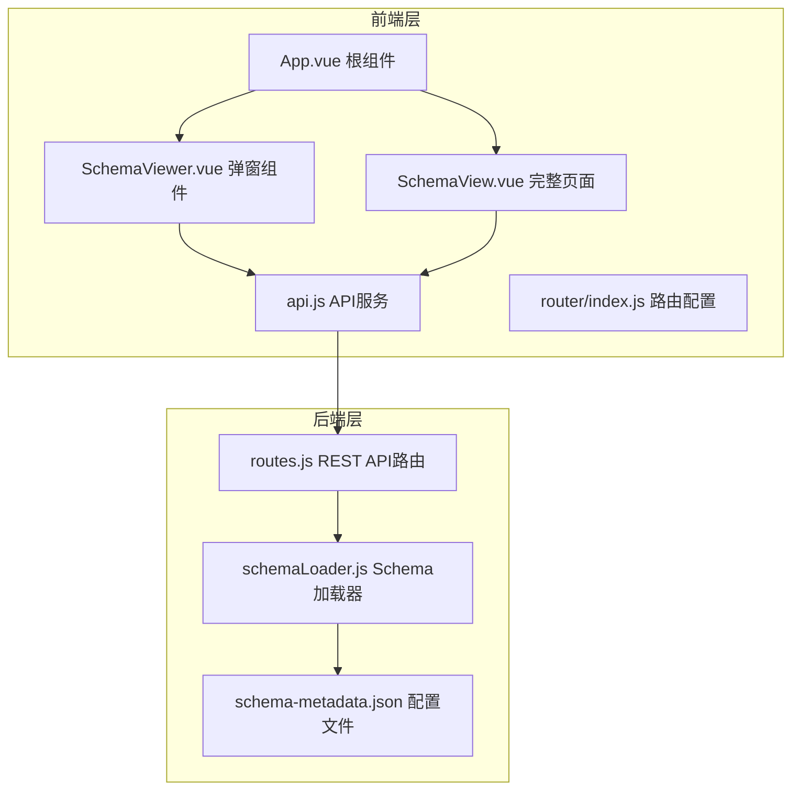
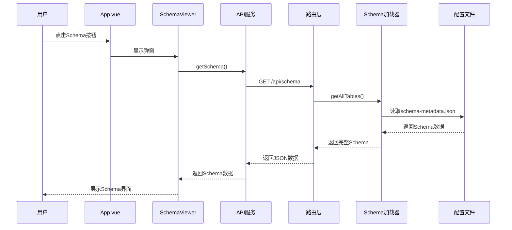
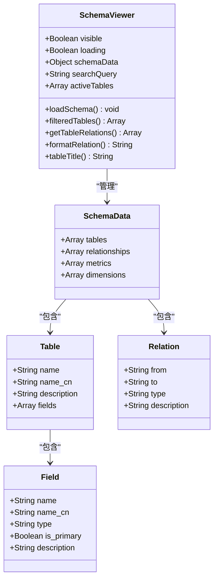
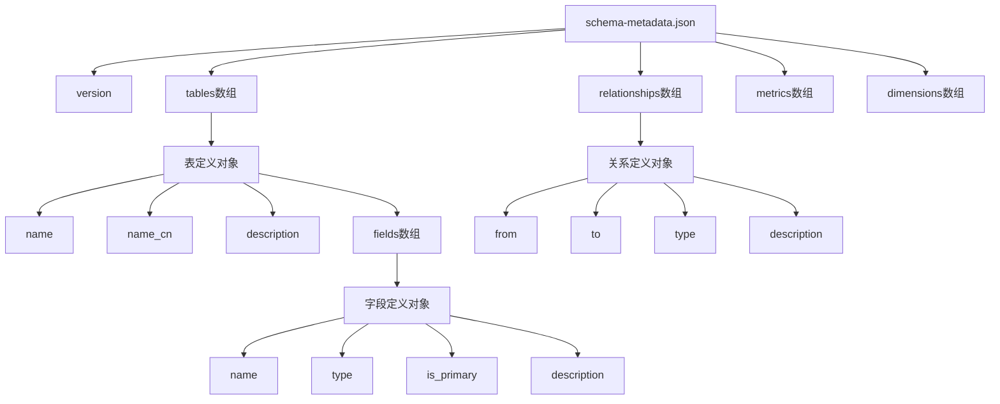
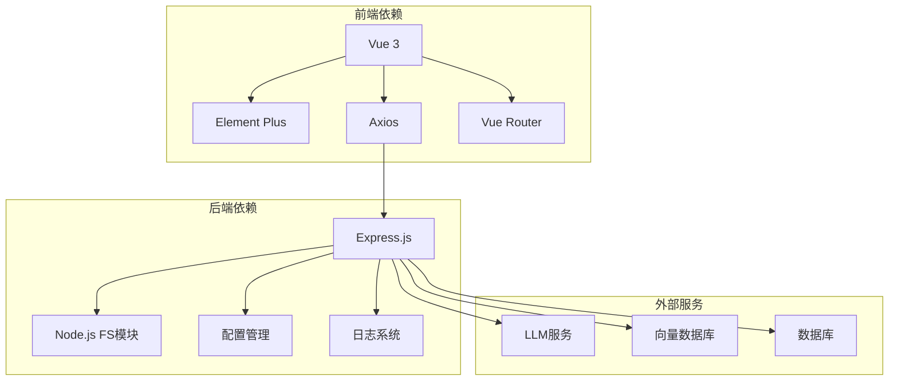

# Schema查看

<cite>
**本文档引用的文件**
- [SchemaViewer.vue](file://frontend/src/components/SchemaViewer.vue)
- [SchemaView.vue](file://frontend/src/views/SchemaView.vue)
- [api.js](file://frontend/src/utils/api.js)
- [routes.js](file://backend/src/core/routes.js)
- [schemaLoader.js](file://backend/src/core/schemaLoader.js)
- [schema-metadata.json](file://backend/config/schema-metadata.json)
- [schema-metadata.example.json](file://backend/config/schema-metadata.example.json)
- [App.vue](file://frontend/src/App.vue)
- [router/index.js](file://frontend/src/router/index.js)
</cite>

## 目录
1. [简介](#简介)
2. [项目结构](#项目结构)
3. [核心组件](#核心组件)
4. [架构概览](#架构概览)
5. [详细组件分析](#详细组件分析)
6. [依赖关系分析](#依赖关系分析)
7. [性能考虑](#性能考虑)
8. [故障排除指南](#故障排除指南)
9. [结论](#结论)

## 简介

NL2SQL系统的Schema查看功能提供了数据库Schema结构的可视化展示能力。该功能允许用户以直观的方式浏览和理解数据库的表结构、字段信息以及表之间的关系映射。系统提供了两种展示模式：弹窗式的SchemaViewer组件和完整的SchemaView页面，分别满足不同场景下的Schema查看需求。

Schema查看功能的核心价值在于：
- **可视化展示**：将复杂的数据库Schema转换为易于理解的界面
- **交互式导航**：支持搜索过滤、展开折叠等交互操作
- **多维度信息**：同时展示表结构、字段详情、关系映射和业务指标
- **实时数据**：动态加载最新的Schema信息，支持增量更新

## 项目结构

NL2SQL项目采用前后端分离的架构设计，Schema查看功能分布在前端和后端两个层面：

**图表来源**
- [App.vue:77-79](file://frontend/src/App.vue#L77-L79)
- [SchemaViewer.vue:6-86](file://frontend/src/components/SchemaViewer.vue#L6-L86)
- [SchemaView.vue:1-146](file://frontend/src/views/SchemaView.vue#L1-L146)
- [routes.js:148-184](file://backend/src/core/routes.js#L148-L184)

**章节来源**
- [App.vue:1-373](file://frontend/src/App.vue#L1-L373)
- [router/index.js:34-99](file://frontend/src/router/index.js#L34-L99)

## 核心组件

### SchemaViewer 弹窗组件

SchemaViewer是一个基于Element Plus Dialog的弹窗组件，提供轻量级的Schema查看功能：

- **响应式状态管理**：使用Vue 3 Composition API管理组件状态
- **懒加载机制**：仅在弹窗打开时才加载Schema数据
- **搜索过滤**：支持按表名、字段名、描述进行实时搜索
- **折叠面板**：使用El-Collapse实现表的展开/折叠
- **关系展示**：以标签形式展示表之间的关联关系

### SchemaView 完整页面

SchemaView提供全面的Schema展示界面，包含多个标签页：

- **表结构标签页**：以卡片形式展示所有表及其字段
- **指标标签页**：展示预定义的业务指标定义
- **维度标签页**：展示维度字段和粒度信息
- **关系标签页**：专门展示表之间的关系映射

### API服务层

API服务封装了所有后端通信逻辑：

- **Axios集成**：基于Axios的HTTP客户端
- **统一错误处理**：集中处理网络错误和服务器错误
- **请求拦截器**：可扩展的请求预处理机制
- **响应拦截器**：统一的响应数据提取

**章节来源**
- [SchemaViewer.vue:89-257](file://frontend/src/components/SchemaViewer.vue#L89-L257)
- [SchemaView.vue:148-201](file://frontend/src/views/SchemaView.vue#L148-L201)
- [api.js:25-88](file://frontend/src/utils/api.js#L25-L88)

## 架构概览

Schema查看功能的完整架构包括前端展示层、API网关层和后端数据层：

**图表来源**
- [App.vue:54-56](file://frontend/src/App.vue#L54-L56)
- [SchemaViewer.vue:191-208](file://frontend/src/components/SchemaViewer.vue#L191-L208)
- [api.js:118-120](file://frontend/src/utils/api.js#L118-L120)
- [routes.js:148-184](file://backend/src/core/routes.js#L148-L184)
- [schemaLoader.js:69-122](file://backend/src/core/schemaLoader.js#L69-L122)

### 数据流分析

Schema数据的流转过程体现了清晰的分层架构：

1. **前端触发**：用户通过界面操作触发Schema加载
2. **API调用**：前端通过API服务发起HTTP请求
3. **路由处理**：后端路由层接收请求并调用相应处理器
4. **数据加载**：Schema加载器从配置文件读取数据
5. **数据返回**：经过处理的数据通过API返回给前端
6. **界面渲染**：前端组件接收数据并更新UI

**章节来源**
- [routes.js:148-184](file://backend/src/core/routes.js#L148-L184)
- [schemaLoader.js:69-122](file://backend/src/core/schemaLoader.js#L69-L122)

## 详细组件分析

### SchemaViewer 组件深度分析

SchemaViewer组件实现了完整的Schema查看功能，具有以下特点：

#### 数据模型解析

组件维护着完整的Schema数据结构：
- **tables数组**：包含所有表的定义
- **relationships数组**：表之间的关系映射
- **metrics数组**：预定义的业务指标
- **dimensions数组**：维度定义信息

#### 树形结构渲染

使用Element Plus的Collapse组件实现层次化展示：
- **表级展开**：每个表作为一个折叠面板
- **字段表格**：表内字段以表格形式展示
- **关系标签**：表间关系以标签形式显示

#### 交互式导航功能

- **搜索过滤**：实时搜索表名、字段名、描述信息
- **展开控制**：支持单个表展开和全部展开
- **高亮显示**：搜索结果自动定位到相关表

**图表来源**
- [SchemaViewer.vue:137-143](file://frontend/src/components/SchemaViewer.vue#L137-L143)
- [SchemaViewer.vue:215-242](file://frontend/src/components/SchemaViewer.vue#L215-L242)

**章节来源**
- [SchemaViewer.vue:89-257](file://frontend/src/components/SchemaViewer.vue#L89-L257)

### SchemaView 页面深度分析

SchemaView页面提供了更全面的Schema展示能力：

#### 多标签页设计

页面采用Element Plus的Tabs组件实现：
- **表结构标签页**：以卡片网格形式展示所有表
- **指标标签页**：展示业务指标的定义和说明
- **维度标签页**：展示维度字段和粒度信息
- **关系标签页**：专门展示表间关系映射

#### 响应式布局

使用CSS Grid实现自适应布局：
- **自动列宽**：根据屏幕宽度自动调整表卡片数量
- **滚动容器**：每个标签页内容区域支持独立滚动
- **高度适配**：整体布局适配不同屏幕尺寸

#### 统计信息展示

页面顶部显示Schema统计信息：
- **表数量**：当前数据库中的表总数
- **指标数量**：预定义业务指标数量
- **维度数量**：维度定义数量

**章节来源**
- [SchemaView.vue:148-322](file://frontend/src/views/SchemaView.vue#L148-L322)

### 后端数据加载机制

后端的Schema加载器实现了完整的数据管理功能：

#### Schema配置文件结构

Schema配置文件采用JSON格式，包含以下核心元素：

**图表来源**
- [schema-metadata.json:4-127](file://backend/config/schema-metadata.json#L4-L127)
- [schema-metadata.example.json:4-252](file://backend/config/schema-metadata.example.json#L4-L252)

#### 缓存管理策略

后端实现了智能的缓存管理机制：
- **内存缓存**：Schema数据存储在内存中提高访问速度
- **缓存过期**：支持配置缓存过期时间
- **重新加载**：提供强制重新加载功能
- **向量化支持**：可选的向量存储集成

#### 搜索和匹配功能

后端提供了多种Schema搜索能力：
- **关键词匹配**：基于表名、字段名的简单匹配
- **语义搜索**：基于向量相似度的智能匹配
- **上下文感知**：支持根据游戏ID、数据源等上下文信息进行匹配
- **结果排序**：根据相关性进行结果排序

**章节来源**
- [schemaLoader.js:69-122](file://backend/src/core/schemaLoader.js#L69-L122)
- [schemaLoader.js:420-507](file://backend/src/core/schemaLoader.js#L420-L507)

## 依赖关系分析

Schema查看功能涉及多个层次的依赖关系：

**图表来源**
- [SchemaViewer.vue:99-103](file://frontend/src/components/SchemaViewer.vue#L99-L103)
- [api.js:15](file://frontend/src/utils/api.js#L15)
- [routes.js:17](file://backend/src/core/routes.js#L17)
- [schemaLoader.js:16-26](file://backend/src/core/schemaLoader.js#L16-L26)

### 组件耦合度分析

Schema查看功能的组件耦合度设计合理：
- **前端组件解耦**：SchemaViewer和SchemaView相互独立，可单独使用
- **API服务抽象**：通过统一的API服务层屏蔽HTTP细节
- **后端模块化**：SchemaLoader独立于路由层，便于测试和维护
- **配置文件独立**：Schema配置与业务逻辑分离

### 外部依赖管理

系统对外部依赖的管理策略：
- **版本锁定**：通过package.json锁定依赖版本
- **安全更新**：定期检查和更新依赖包
- **性能优化**：选择轻量级的第三方库
- **兼容性保证**：确保依赖版本的兼容性

**章节来源**
- [SchemaViewer.vue:99-103](file://frontend/src/components/SchemaViewer.vue#L99-L103)
- [api.js:15](file://frontend/src/utils/api.js#L15)
- [routes.js:17](file://backend/src/core/routes.js#L17)

## 性能考虑

Schema查看功能在性能方面采用了多项优化策略：

### 前端性能优化

- **懒加载机制**：Schema数据仅在需要时加载，减少初始加载时间
- **虚拟滚动**：对于大量数据的表格使用虚拟滚动技术
- **响应式更新**：使用Vue 3的响应式系统优化更新性能
- **缓存策略**：前端本地缓存Schema数据，避免重复请求

### 后端性能优化

- **内存缓存**：Schema数据存储在内存中，避免频繁文件I/O
- **索引映射**：构建表名和字段名的快速查找映射
- **批量处理**：向量计算采用批量处理提高效率
- **异步加载**：非阻塞的异步数据加载机制

### 网络性能优化

- **HTTP缓存**：利用浏览器和服务器的HTTP缓存机制
- **请求合并**：减少不必要的API调用次数
- **数据压缩**：传输过程中使用适当的压缩策略
- **连接复用**：复用HTTP连接提高效率

## 故障排除指南

### 常见问题及解决方案

#### Schema数据加载失败

**问题现象**：Schema弹窗无法显示数据或显示为空

**可能原因**：
- 后端Schema配置文件不存在
- Schema配置文件格式不正确
- 后端服务启动失败

**解决步骤**：
1. 检查后端配置文件是否存在
2. 验证JSON格式的正确性
3. 查看后端日志获取详细错误信息
4. 重启后端服务

#### API请求超时

**问题现象**：页面加载缓慢或出现超时错误

**可能原因**：
- 网络连接不稳定
- 后端处理时间过长
- 浏览器代理设置问题

**解决步骤**：
1. 检查网络连接状态
2. 增加API超时时间配置
3. 检查防火墙设置
4. 清理浏览器缓存

#### 搜索功能异常

**问题现象**：搜索框无法过滤数据或过滤结果不准确

**可能原因**：
- 搜索算法实现问题
- 数据索引损坏
- 搜索关键词格式不正确

**解决步骤**：
1. 验证搜索关键词格式
2. 重新加载Schema数据
3. 检查搜索算法实现
4. 清理搜索缓存

### 调试技巧

#### 前端调试

- 使用浏览器开发者工具检查网络请求
- 查看Vue DevTools了解组件状态
- 监控API调用的响应时间
- 检查控制台错误信息

#### 后端调试

- 查看后端日志文件获取详细信息
- 使用Postman测试API端点
- 检查Schema配置文件的完整性
- 监控内存使用情况

**章节来源**
- [api.js:72-87](file://frontend/src/utils/api.js#L72-L87)
- [schemaLoader.js:118-121](file://backend/src/core/schemaLoader.js#L118-L121)

## 结论

NL2SQL的Schema查看功能通过精心设计的架构和实现，为用户提供了一个强大而易用的数据库Schema可视化工具。该功能的主要优势包括：

### 技术优势

- **模块化设计**：前后端分离，职责清晰，便于维护和扩展
- **性能优化**：多层缓存和异步处理机制确保良好的用户体验
- **交互友好**：丰富的交互功能和直观的界面设计
- **可扩展性**：灵活的架构支持未来功能扩展

### 功能特色

- **双模式展示**：弹窗模式适合快速查看，完整页面适合深度分析
- **智能搜索**：支持关键词和语义搜索，提高查找效率
- **关系可视化**：直观展示表间关系，帮助理解数据结构
- **多维度信息**：同时展示表结构、指标、维度等多类信息

### 应用价值

Schema查看功能不仅是一个技术工具，更是连接业务人员和技术人员的桥梁。它帮助业务人员更好地理解数据结构，为后续的自然语言查询和数据分析奠定基础。

随着NL2SQL系统的不断发展，Schema查看功能将继续演进，为用户提供更加智能化和个性化的Schema理解体验。