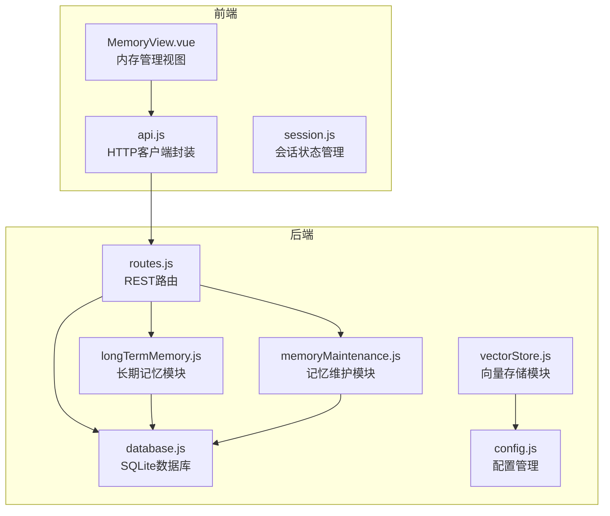
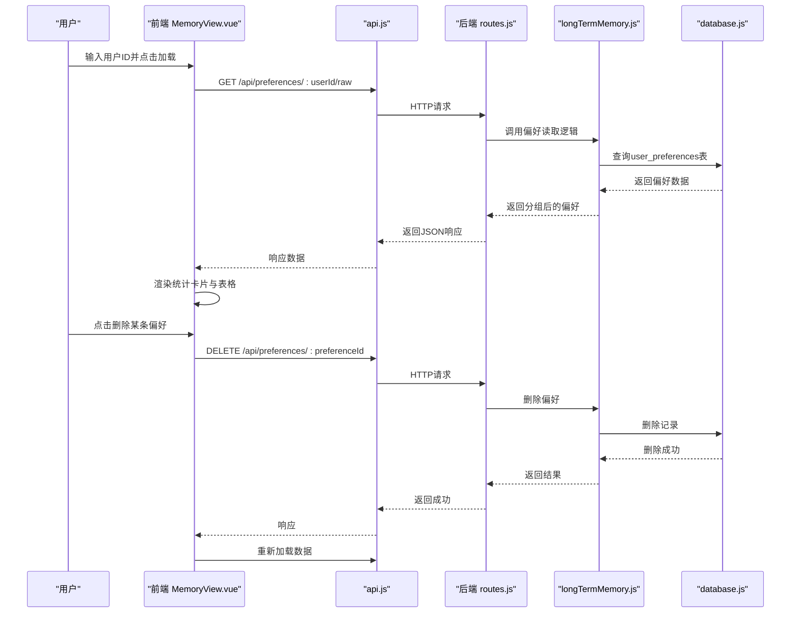
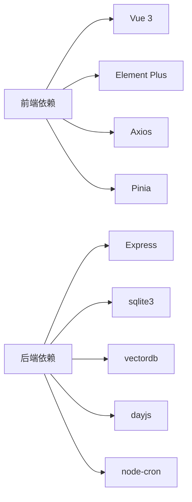

# 内存管理

<cite>
**本文引用的文件**
- [MemoryView.vue](file://frontend/src/views/MemoryView.vue)
- [longTermMemory.js](file://backend/src/memory/longTermMemory.js)
- [memoryMaintenance.js](file://backend/src/memory/memoryMaintenance.js)
- [vectorStore.js](file://backend/src/memory/vectorStore.js)
- [routes.js](file://backend/src/core/routes.js)
- [database.js](file://backend/src/core/database.js)
- [config.js](file://backend/src/core/config.js)
- [api.js](file://frontend/src/utils/api.js)
- [session.js](file://frontend/src/stores/session.js)
</cite>

## 目录
1. [简介](#简介)
2. [项目结构](#项目结构)
3. [核心组件](#核心组件)
4. [架构概览](#架构概览)
5. [详细组件分析](#详细组件分析)
6. [依赖分析](#依赖分析)
7. [性能考虑](#性能考虑)
8. [故障排查指南](#故障排查指南)
9. [结论](#结论)
10. [附录](#附录)

## 简介
本文件面向NL2SQL项目的“内存管理”功能，聚焦于用户偏好设置与管理、长期记忆的读取与编辑、以及与后端服务的交互机制。文档涵盖：
- 用户偏好配置：字段别名、查询模式、指标偏好、维度偏好
- 内存数据的读取、编辑与保存流程（含表单验证、数据同步、错误处理）
- 用户记忆系统的界面设计：分类展示、实时预览、批量修改
- 后端交互：偏好数据持久化与跨会话同步
- 使用指南与配置建议

## 项目结构
NL2SQL采用前后端分离架构：
- 前端：Vue 3 + Element Plus，负责用户界面与交互
- 后端：Node.js + Express，负责业务逻辑、数据库与向量存储

图表来源
- [MemoryView.vue:1-511](file://frontend/src/views/MemoryView.vue#L1-L511)
- [api.js:1-252](file://frontend/src/utils/api.js#L1-L252)
- [routes.js:1-895](file://backend/src/core/routes.js#L1-L895)
- [longTermMemory.js:1-1134](file://backend/src/memory/longTermMemory.js#L1-L1134)
- [memoryMaintenance.js:1-415](file://backend/src/memory/memoryMaintenance.js#L1-L415)
- [vectorStore.js:1-621](file://backend/src/memory/vectorStore.js#L1-L621)
- [database.js:1-850](file://backend/src/core/database.js#L1-L850)
- [config.js:1-372](file://backend/src/core/config.js#L1-L372)

章节来源
- [MemoryView.vue:1-511](file://frontend/src/views/MemoryView.vue#L1-L511)
- [routes.js:450-714](file://backend/src/core/routes.js#L450-L714)

## 核心组件
- 前端内存管理视图：提供用户ID输入、偏好数据加载、类型筛选、表格展示与删除操作
- 后端长期记忆模块：负责偏好提取、存储、筛选与LLM智能分析
- 后端记忆维护模块：负责偏好压缩、清理、相似模式合并与统计
- 后端向量存储模块：基于LanceDB的Schema与查询历史向量存储与检索
- 后端数据库：SQLite持久化存储用户偏好、会话、消息与查询历史
- 后端路由：暴露偏好读取、删除、模板添加等API

章节来源
- [MemoryView.vue:191-254](file://frontend/src/views/MemoryView.vue#L191-L254)
- [longTermMemory.js:1-1134](file://backend/src/memory/longTermMemory.js#L1-L1134)
- [memoryMaintenance.js:1-415](file://backend/src/memory/memoryMaintenance.js#L1-L415)
- [vectorStore.js:1-621](file://backend/src/memory/vectorStore.js#L1-L621)
- [database.js:137-781](file://backend/src/core/database.js#L137-L781)
- [routes.js:450-714](file://backend/src/core/routes.js#L450-L714)

## 架构概览
内存管理的端到端流程如下：
- 前端用户在内存管理页输入用户ID并加载偏好数据
- 前端通过HTTP请求调用后端路由，获取用户偏好原始数据
- 后端根据配置与策略对偏好进行筛选、存储与维护
- 前端展示统计卡片、类型筛选与表格，并支持删除操作
- 后端提供删除接口，删除后前端重新加载数据

图表来源
- [MemoryView.vue:212-243](file://frontend/src/views/MemoryView.vue#L212-L243)
- [api.js:1-252](file://frontend/src/utils/api.js#L1-L252)
- [routes.js:450-714](file://backend/src/core/routes.js#L450-L714)
- [longTermMemory.js:1-1134](file://backend/src/memory/longTermMemory.js#L1-L1134)
- [database.js:619-763](file://backend/src/core/database.js#L619-L763)

## 详细组件分析

### 前端内存管理视图（MemoryView.vue）
- 功能要点
  - 用户ID输入与加载按钮
  - 加载状态、错误提示与JSON原始数据查看
  - 统计卡片：总记录数、字段别名、查询模式、常用指标、常用维度
  - 类型筛选：字段别名、查询模式、常用指标、常用维度
  - 表格展示：字段别名、查询模式、常用指标、常用维度
  - 删除操作：确认提示后调用删除接口并刷新数据

- 数据流
  - 加载数据：调用后端 /api/preferences/:userId/raw
  - 删除偏好：调用后端 /api/preferences/:preferenceId
  - 格式化显示：日期格式化、高亮字段、类型徽章

- 错误处理
  - 请求失败时显示错误信息
  - 删除失败时弹出提示并阻止UI状态变更

章节来源
- [MemoryView.vue:1-511](file://frontend/src/views/MemoryView.vue#L1-L511)
- [api.js:1-252](file://frontend/src/utils/api.js#L1-L252)

### 后端长期记忆模块（longTermMemory.js）
- 功能要点
  - 偏好提取与存储：字段别名、查询模式、指标偏好、维度偏好
  - 智能筛选：置信度阈值、高频模式、高价值模板
  - LLM智能分析：区分个人偏好与通用知识，提取字段映射、维度习惯、过滤逻辑等
  - 存储策略：去重、使用次数更新、时间戳维护

- 核心算法
  - 前置过滤：查询成功、置信度阈值、排除一次性查询
  - 价值评估：高价值模板、近期频率、简单查询的进一步观察
  - 字段别名学习：用户术语到Schema字段的映射，支持值映射

- 错误处理
  - LLM分析失败时回退到逻辑判断
  - 存储过程中的异常捕获与日志记录

章节来源
- [longTermMemory.js:1-1134](file://backend/src/memory/longTermMemory.js#L1-L1134)

### 后端记忆维护模块（memoryMaintenance.js）
- 功能要点
  - 记忆压缩与清理：按使用频率分级保留与清理
  - 相似模式合并：维度/指标重合度高的模式合并
  - 统计与报告：用户记忆统计、系统健康报告

- 清理策略
  - 高频（≥10次）：永久保留
  - 中频（3-9次）：90天未用清理
  - 低频（<3次）：30天未用清理
  - 字段别名：365天未用清理

- 合并策略
  - 维度重合度 > 70%、指标重合度 > 70%、时间范围类型相同

章节来源
- [memoryMaintenance.js:1-415](file://backend/src/memory/memoryMaintenance.js#L1-L415)

### 后端向量存储模块（vectorStore.js）
- 功能要点
  - Schema向量与查询历史向量的增删查改
  - 元数据增强：重要性评分、查询类型分类、复杂度统计
  - 初始化与状态检查：LanceDB连接、表创建、统计信息

- 元数据增强工具
  - 重要性评分：基于维度/指标/筛选器数量与置信度
  - 查询类型分类：定义/解释、对比、趋势、澄清、跟进、新话题
  - 复杂度统计：维度、指标、筛选器总数

章节来源
- [vectorStore.js:1-621](file://backend/src/memory/vectorStore.js#L1-L621)

### 后端数据库（database.js）
- 功能要点
  - 表结构：sessions、messages、query_history、user_preferences
  - 用户偏好操作：新增、查询、使用次数更新、删除
  - 辅助查询：常用查询模板、字段别名映射、近期模式计数

- 索引与迁移
  - 为user_preferences创建复合索引，提升查询效率
  - 迁移过程中移除UNIQUE约束，允许多条同类型偏好

章节来源
- [database.js:137-781](file://backend/src/core/database.js#L137-L781)

### 后端路由（routes.js）
- 功能要点
  - 偏好接口：原始数据获取、统计、模板添加、字段别名学习、删除
  - 会话与查询历史接口：会话管理、消息历史、查询历史
  - 健康检查与配置接口：服务状态、组件状态、公开配置

- 关键路由
  - GET /api/preferences/:userId/raw：获取用户偏好原始数据
  - GET /api/preferences/:userId/stats：获取用户记忆统计
  - POST /api/preferences/:userId/templates：手动添加查询模板
  - POST /api/preferences/:userId/learn-alias：手动学习字段别名
  - DELETE /api/preferences/:preferenceId：删除用户偏好

章节来源
- [routes.js:450-714](file://backend/src/core/routes.js#L450-L714)

### 前端API封装（api.js）
- 功能要点
  - axios实例封装：基础URL、超时、请求/响应拦截
  - 健康检查、Schema、会话、查询历史、统计、配置等API
  - SSE相关：发送查询请求（通过HTTP POST）

章节来源
- [api.js:1-252](file://frontend/src/utils/api.js#L1-L252)

### 前端会话状态（session.js）
- 功能要点
  - 会话列表、当前会话、消息历史
  - SSE连接与消息处理：连接状态、进度、结果、澄清、错误
  - 发送查询、删除会话、断开连接

章节来源
- [session.js:1-398](file://frontend/src/stores/session.js#L1-L398)

## 依赖分析
- 前端依赖
  - Vue 3：组件化与响应式数据
  - Element Plus：UI组件库
  - Axios：HTTP客户端
  - Pinia：状态管理

- 后端依赖
  - Express：Web框架
  - sqlite3：SQLite数据库驱动
  - vectordb：LanceDB向量数据库客户端
  - dayjs：时间处理
  - node-cron：定时任务

图表来源
- [frontend/package.json:11-29](file://frontend/package.json#L11-L29)
- [backend/package.json:10-20](file://backend/package.json#L10-L20)

章节来源
- [frontend/package.json:1-36](file://frontend/package.json#L1-L36)
- [backend/package.json:1-28](file://backend/package.json#L1-L28)

## 性能考虑
- 前端
  - 表格滚动与虚拟化：MemoryView中表格容器支持横向滚动，避免布局抖动
  - 按需加载：首次进入时加载数据，减少首屏压力
  - 错误快速反馈：请求失败与删除失败即时提示，避免无效重试

- 后端
  - SQLite索引：user_preferences表建立复合索引，提升偏好查询与排序性能
  - 迁移优化：移除UNIQUE约束，避免重复插入导致的约束冲突
  - 向量存储：LanceDB表按需创建，初始化失败不影响主流程，记录警告日志
  - 记忆维护：按使用频率分级清理，降低存储与查询成本

[本节为通用指导，不直接分析具体文件]

## 故障排查指南
- 前端常见问题
  - 加载失败：检查网络连接与后端健康状态
  - 删除失败：确认偏好ID有效，查看后端错误日志
  - 数据未刷新：删除后主动触发重新加载

- 后端常见问题
  - 数据库初始化失败：检查DB_PATH与权限
  - 向量数据库未初始化：检查VECTOR_DB_PATH与LanceDB可用性
  - 偏好删除失败：确认记录存在且未被其他事务锁定

章节来源
- [MemoryView.vue:212-243](file://frontend/src/views/MemoryView.vue#L212-L243)
- [routes.js:637-662](file://backend/src/core/routes.js#L637-L662)
- [database.js:200-261](file://backend/src/core/database.js#L200-L261)
- [vectorStore.js:229-259](file://backend/src/memory/vectorStore.js#L229-L259)

## 结论
NL2SQL的内存管理功能通过前后端协作实现了用户偏好的个性化定制与长期记忆的高效管理。前端提供直观的界面与实时反馈，后端通过长期记忆与记忆维护模块确保数据质量与性能。结合向量存储与配置管理，系统具备良好的扩展性与稳定性。

[本节为总结性内容，不直接分析具体文件]

## 附录

### 使用指南与配置建议
- 用户偏好设置
  - 字段别名：通过“手动学习字段别名”接口或LLM智能分析自动提取
  - 查询模式：高价值模板与高频模式自动存储，支持手动模板添加
  - 指标偏好与维度偏好：基于查询意图自动提取，支持使用次数统计

- 内存数据读取与编辑
  - 前端通过“加载数据”按钮获取原始偏好数据，支持按类型筛选
  - 删除偏好前需确认，删除后自动刷新数据

- 后端配置
  - 长期记忆开关与阈值：通过配置项控制是否启用LLM分析、置信度阈值、模板最小维度/指标数等
  - 记忆保留策略：高频、中频、低频与字段别名的保留天数可配置

- 与后端服务交互
  - 偏好数据持久化：user_preferences表存储用户偏好，支持新增、查询、使用次数更新与删除
  - 跨会话同步：通过用户ID关联偏好，实现跨会话的偏好复用

章节来源
- [config.js:248-288](file://backend/src/core/config.js#L248-L288)
- [routes.js:592-714](file://backend/src/core/routes.js#L592-L714)
- [database.js:609-763](file://backend/src/core/database.js#L609-L763)
- [MemoryView.vue:191-254](file://frontend/src/views/MemoryView.vue#L191-L254)