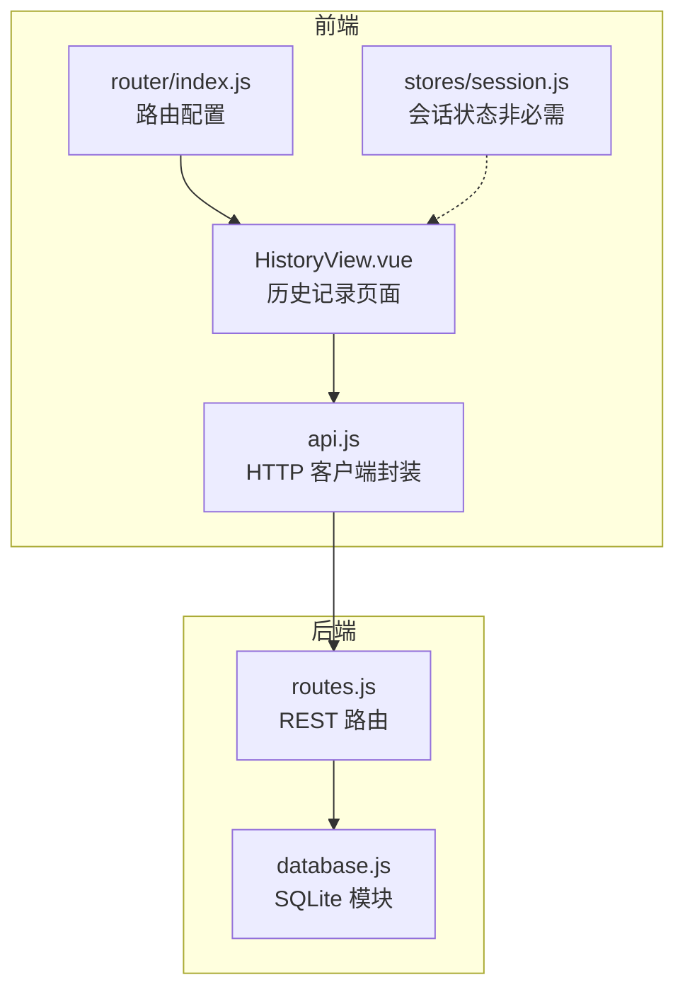
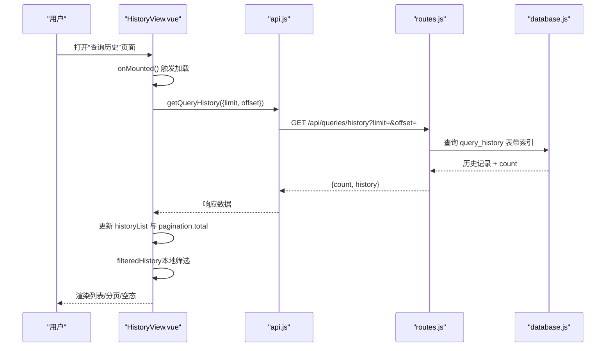
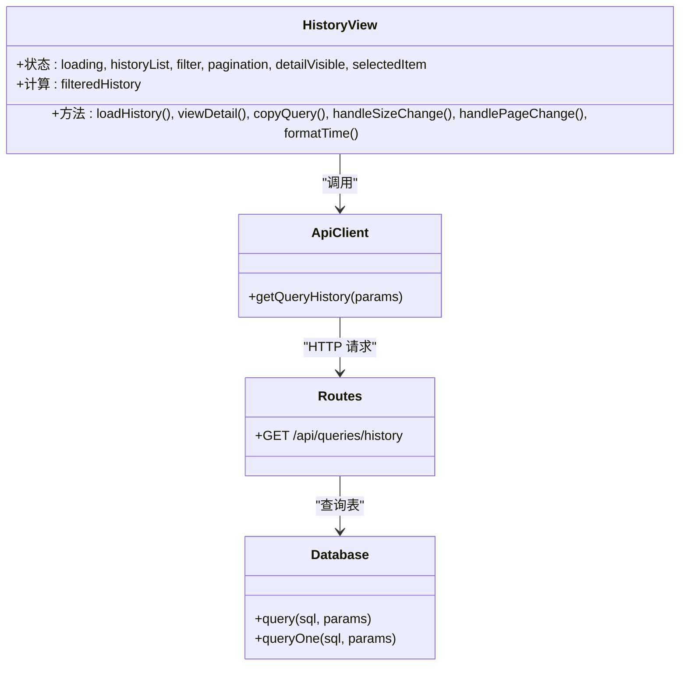

# 历史记录

<cite>
**本文引用的文件**
- [HistoryView.vue](file://frontend/src/views/HistoryView.vue)
- [api.js](file://frontend/src/utils/api.js)
- [routes.js](file://backend/src/core/routes.js)
- [database.js](file://backend/src/core/database.js)
- [index.js](file://frontend/src/router/index.js)
- [session.js](file://frontend/src/stores/session.js)
</cite>

## 目录
1. [简介](#简介)
2. [项目结构](#项目结构)
3. [核心组件](#核心组件)
4. [架构总览](#架构总览)
5. [详细组件分析](#详细组件分析)
6. [依赖关系分析](#依赖关系分析)
7. [性能考量](#性能考量)
8. [故障排查指南](#故障排查指南)
9. [结论](#结论)

## 简介
本文件面向 NL2SQL 历史记录页面，系统性阐述历史查询记录的获取、筛选、分页与展示机制，以及与后端 API 的交互流程。重点覆盖：
- 前端如何加载与渲染历史记录列表
- 多维筛选（关键词、状态、时间范围）的实现
- 分页加载策略与数据格式化
- 与后端 REST 接口的对接细节
- 用户交互体验（查看详情、复制查询等）

## 项目结构
历史记录页面位于前端工程的视图层，采用 Vue 3 Composition API 编写；后端提供 REST 接口，数据持久化于 SQLite。路由配置支持懒加载，便于按需加载历史页面。

图表来源
- [HistoryView.vue:1-441](file://frontend/src/views/HistoryView.vue#L1-L441)
- [api.js:1-252](file://frontend/src/utils/api.js#L1-L252)
- [routes.js:1-895](file://backend/src/core/routes.js#L1-L895)
- [database.js:1-850](file://backend/src/core/database.js#L1-L850)
- [index.js:1-147](file://frontend/src/router/index.js#L1-L147)
- [session.js:1-398](file://frontend/src/stores/session.js#L1-L398)

章节来源
- [HistoryView.vue:1-441](file://frontend/src/views/HistoryView.vue#L1-L441)
- [api.js:1-252](file://frontend/src/utils/api.js#L1-L252)
- [routes.js:1-895](file://backend/src/core/routes.js#L1-L895)
- [database.js:1-850](file://backend/src/core/database.js#L1-L850)
- [index.js:1-147](file://frontend/src/router/index.js#L1-L147)
- [session.js:1-398](file://frontend/src/stores/session.js#L1-L398)

## 核心组件
- 历史记录页面组件：负责渲染列表、筛选、分页与详情弹窗。
- API 客户端：封装 axios，统一请求/响应拦截与错误处理。
- 后端路由：提供查询历史接口，支持 limit/offset 分页与简单条件过滤。
- 数据库模块：定义 query_history 表结构与索引，支撑查询历史的存储与检索。

章节来源
- [HistoryView.vue:138-298](file://frontend/src/views/HistoryView.vue#L138-L298)
- [api.js:197-208](file://frontend/src/utils/api.js#L197-L208)
- [routes.js:401-448](file://backend/src/core/routes.js#L401-L448)
- [database.js:94-135](file://backend/src/core/database.js#L94-L135)

## 架构总览
历史记录页面的前后端交互遵循标准 REST 流程：前端发起 GET 请求到 /api/queries/history，携带分页参数；后端根据 limit/offset 查询 SQLite 表，返回历史记录与总数；前端在本地进行二次筛选与展示。

图表来源
- [HistoryView.vue:226-243](file://frontend/src/views/HistoryView.vue#L226-L243)
- [api.js:206-208](file://frontend/src/utils/api.js#L206-L208)
- [routes.js:411-448](file://backend/src/core/routes.js#L411-L448)
- [database.js:361-400](file://backend/src/core/database.js#L361-L400)

## 详细组件分析

### 前端页面：HistoryView.vue
- 状态与响应式数据
  - 加载状态、历史列表、筛选条件、分页信息、详情弹窗与选中项。
- 计算属性：filteredHistory
  - 支持三类本地筛选：关键词（自然语言查询）、状态（success/failed）、日期范围（起止日期）。
  - 日期范围使用 dayjs 进行边界处理，确保跨天匹配正确。
- 分页与加载
  - 通过 pagination.page 与 pagination.pageSize 控制分页。
  - 分页参数转换为 limit/offset 传递给后端。
  - 加载历史时设置 loading，并在 finally 中恢复。
- 用户交互
  - 列表项点击进入详情弹窗；“查看”按钮触发详情；“复制”按钮复制自然语言查询。
  - 刷新按钮触发重新加载。
- 样式与空态
  - 加载时显示骨架屏；无数据时显示空态组件；详情弹窗展示 SQL、状态、耗时、行数、时间等字段。

章节来源
- [HistoryView.vue:162-181](file://frontend/src/views/HistoryView.vue#L162-L181)
- [HistoryView.vue:190-217](file://frontend/src/views/HistoryView.vue#L190-L217)
- [HistoryView.vue:226-243](file://frontend/src/views/HistoryView.vue#L226-L243)
- [HistoryView.vue:258-271](file://frontend/src/views/HistoryView.vue#L258-L271)
- [HistoryView.vue:277-289](file://frontend/src/views/HistoryView.vue#L277-L289)
- [HistoryView.vue:295-297](file://frontend/src/views/HistoryView.vue#L295-L297)

### API 客户端：api.js
- axios 实例
  - 基础 URL 为 /api，统一超时与请求头。
  - 请求拦截器：可扩展鉴权（当前注释）。
  - 响应拦截器：统一错误处理，区分服务端错误、网络错误与请求配置错误。
- 查询历史接口
  - getQueryHistory(params)：GET /api/queries/history，参数透传 limit/offset。

章节来源
- [api.js:25-34](file://frontend/src/utils/api.js#L25-L34)
- [api.js:67-88](file://frontend/src/utils/api.js#L67-L88)
- [api.js:206-208](file://frontend/src/utils/api.js#L206-L208)

### 后端路由：routes.js
- 查询历史接口
  - GET /api/queries/history
  - 支持查询参数：user_id、session_id、limit（默认 20）。
  - SQL 构造：动态拼接 WHERE 条件，最终按 created_at 降序并限制数量。
  - 返回结构：{ count, history }。
- 数据库访问
  - 通过 database.query 执行 SQL 并返回结果。

章节来源
- [routes.js:411-448](file://backend/src/core/routes.js#L411-L448)
- [database.js:361-400](file://backend/src/core/database.js#L361-L400)

### 数据库模型：database.js
- 表结构：query_history
  - 主键 id，外键 session_id，用户 user_id，自然语言查询 natural_query，生成 SQL generated_sql，状态 status，结果 result，错误信息 error_message，执行耗时 execution_time，返回行数 row_count，创建/执行时间 created_at/executed_at。
  - 索引：user_id、session_id、created_at、status，用于高效查询与排序。
- 查询历史接口的 SQL 与索引配合，满足分页与排序需求。

章节来源
- [database.js:94-135](file://backend/src/core/database.js#L94-L135)

### 路由与页面入口：router/index.js
- 历史记录路由：/history，懒加载 HistoryView.vue，meta 标题为“查询历史”。

章节来源
- [index.js:60-69](file://frontend/src/router/index.js#L60-L69)

### 会话状态（补充说明）
- 历史记录页面本身不依赖会话状态；会话 Store 提供会话管理能力，与历史记录页面解耦。

章节来源
- [session.js:1-398](file://frontend/src/stores/session.js#L1-L398)

## 依赖关系分析

图表来源
- [HistoryView.vue:138-298](file://frontend/src/views/HistoryView.vue#L138-L298)
- [api.js:197-208](file://frontend/src/utils/api.js#L197-L208)
- [routes.js:411-448](file://backend/src/core/routes.js#L411-L448)
- [database.js:361-400](file://backend/src/core/database.js#L361-L400)

## 性能考量
- 前端本地筛选
  - filteredHistory 在内存中对完整列表进行过滤，适合中小规模数据；若历史记录量大，建议后端增加 user_id、status、时间范围等条件过滤，减少传输与前端处理压力。
- 分页与排序
  - 前端分页参数 limit/offset 传给后端，后端按 created_at 降序返回；SQLite 索引 created_at 有助于排序与 limit。
- 网络与错误处理
  - axios 超时 30 秒，响应拦截器统一错误提示；建议在 UI 层增加重试与加载状态反馈。
- 渲染优化
  - 列表项使用 v-for + key，避免不必要的重渲染；详情弹窗按需打开，减少 DOM 占用。

章节来源
- [HistoryView.vue:190-217](file://frontend/src/views/HistoryView.vue#L190-L217)
- [HistoryView.vue:226-243](file://frontend/src/views/HistoryView.vue#L226-L243)
- [api.js:25-34](file://frontend/src/utils/api.js#L25-L34)
- [database.js:131-132](file://backend/src/core/database.js#L131-L132)

## 故障排查指南
- 加载失败
  - 检查 /api/queries/history 是否可达；确认后端数据库初始化与索引创建是否成功。
  - 前端响应拦截器会输出错误信息，注意区分网络错误与服务端错误。
- 筛选无效
  - 确认筛选条件是否正确绑定到 filter 对象；日期范围需为长度为 2 的数组。
- 分页异常
  - 确认 limit/offset 计算是否正确；后端 limit 默认 20，过大可能导致性能问题。
- 详情弹窗空白
  - 检查 selected item 是否正确赋值；确认后端返回字段是否包含 SQL、状态、耗时、行数等。

章节来源
- [api.js:72-88](file://frontend/src/utils/api.js#L72-L88)
- [HistoryView.vue:258-261](file://frontend/src/views/HistoryView.vue#L258-L261)
- [routes.js:411-448](file://backend/src/core/routes.js#L411-L448)

## 结论
历史记录页面通过清晰的前后端职责划分，实现了稳定的历史查询记录展示与筛选。前端负责本地筛选与分页 UI，后端提供 REST 接口与 SQLite 存储。建议后续增强：
- 后端增加 user_id、status、时间范围等过滤参数，减轻前端负担；
- 对大数据量场景引入服务端分页与排序优化；
- 增强错误提示与重试机制，提升用户体验。