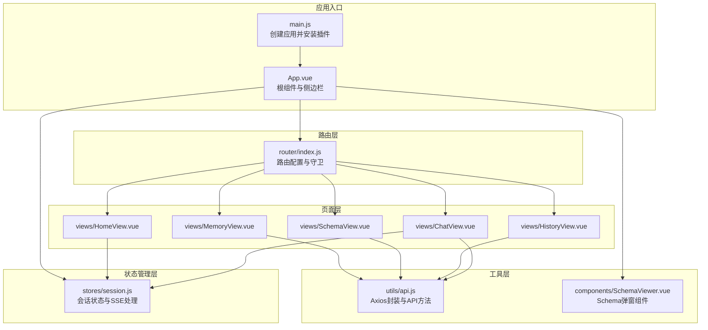
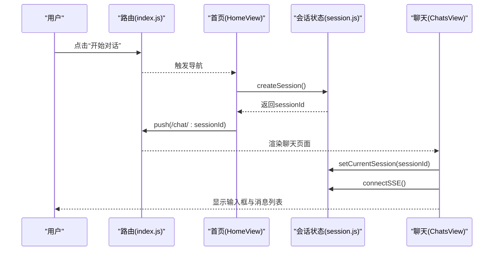
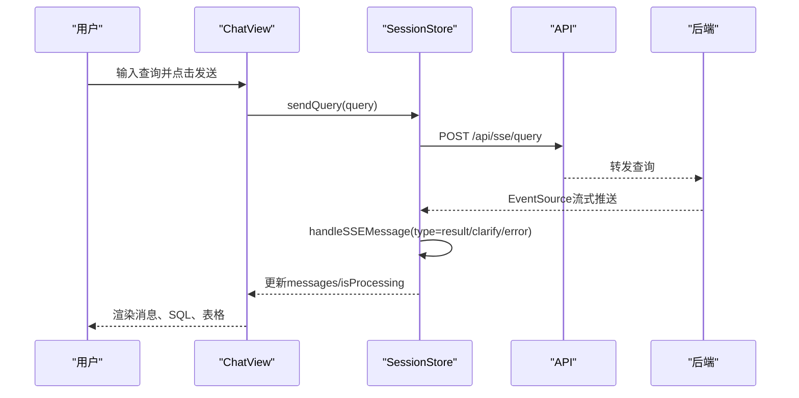
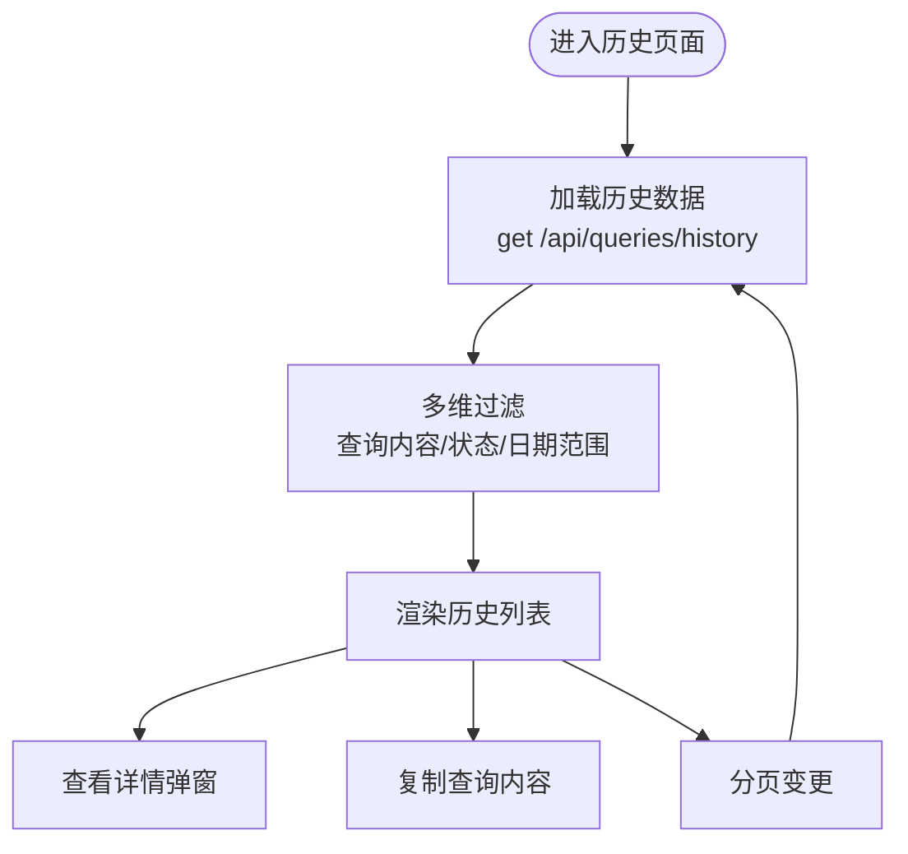
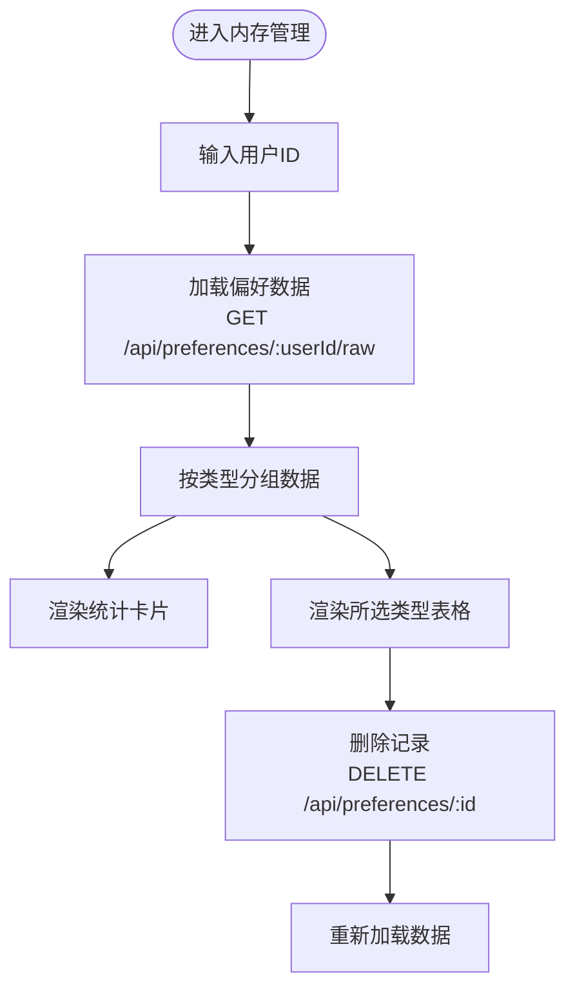
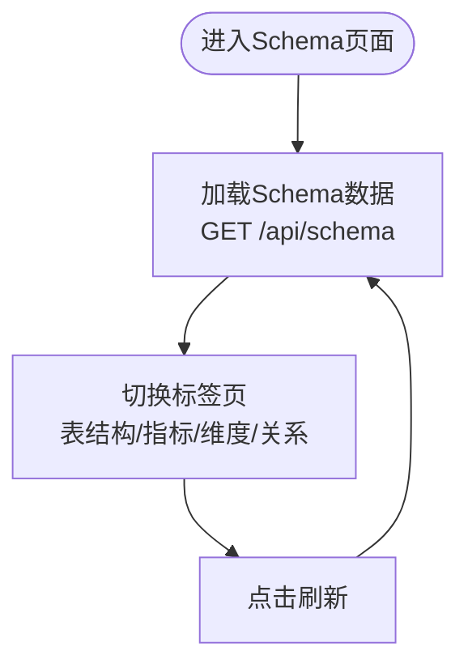
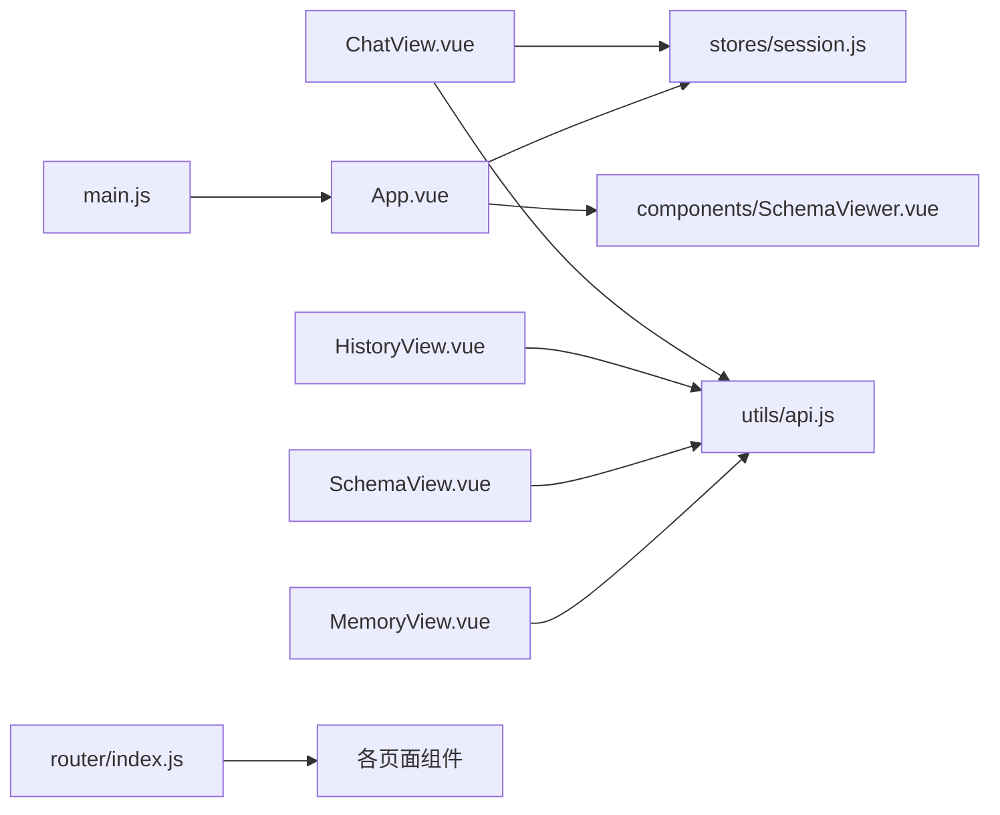

# 核心页面

<cite>
**本文档引用的文件**
- [ChatView.vue](file://frontend/src/views/ChatView.vue)
- [HistoryView.vue](file://frontend/src/views/HistoryView.vue)
- [MemoryView.vue](file://frontend/src/views/MemoryView.vue)
- [SchemaView.vue](file://frontend/src/views/SchemaView.vue)
- [HomeView.vue](file://frontend/src/views/HomeView.vue)
- [session.js](file://frontend/src/stores/session.js)
- [index.js](file://frontend/src/router/index.js)
- [api.js](file://frontend/src/utils/api.js)
- [App.vue](file://frontend/src/App.vue)
- [SchemaViewer.vue](file://frontend/src/components/SchemaViewer.vue)
- [main.js](file://frontend/src/main.js)
- [package.json](file://frontend/package.json)
</cite>

## 目录
1. [简介](#简介)
2. [项目结构](#项目结构)
3. [核心组件](#核心组件)
4. [架构总览](#架构总览)
5. [详细组件分析](#详细组件分析)
6. [依赖分析](#依赖分析)
7. [性能考虑](#性能考虑)
8. [故障排查指南](#故障排查指南)
9. [结论](#结论)
10. [附录](#附录)

## 简介
本文件面向NL2SQL核心页面组件，系统性梳理聊天界面、历史记录、内存管理、Schema查看四大页面的功能实现与用户交互逻辑。重点覆盖：
- 聊天界面的实时对话、Markdown渲染、SQL复制、数据表格展示与SSE处理
- 历史记录的查询、筛选、分页与详情查看
- 内存管理的用户偏好设置查看与删除
- Schema查看的数据结构展示与搜索过滤
同时阐述组件结构、数据绑定、事件处理、生命周期管理、页面间导航与数据传递、响应式设计与体验优化策略，并提供开发最佳实践与排障建议。

## 项目结构
前端采用Vue 3 + Vite + Pinia + Element Plus技术栈，页面通过Vue Router进行路由管理，状态通过Pinia集中管理，API封装在独立模块中，组件按功能拆分。

**图表来源**
- [main.js:55-89](file://frontend/src/main.js#L55-L89)
- [App.vue:11-79](file://frontend/src/App.vue#L11-L79)
- [index.js:34-99](file://frontend/src/router/index.js#L34-L99)
- [session.js:33-397](file://frontend/src/stores/session.js#L33-L397)
- [api.js:25-34](file://frontend/src/utils/api.js#L25-L34)

**章节来源**
- [main.js:55-89](file://frontend/src/main.js#L55-L89)
- [App.vue:11-79](file://frontend/src/App.vue#L11-L79)
- [index.js:34-99](file://frontend/src/router/index.js#L34-L99)

## 核心组件
- 聊天页面：支持自然语言查询、SSE流式处理、Markdown渲染、SQL复制、数据表格展示、长消息折叠与展开、打字动画与进度条
- 历史记录页面：支持查询内容搜索、状态筛选、日期范围筛选、分页加载、详情弹窗
- 内存管理页面：支持用户ID选择、统计数据卡片、类型筛选、多类偏好数据表格、删除操作、原始JSON查看
- Schema查看页面：支持表结构、指标、维度、关系四标签页，统计信息展示，响应式布局
- 首页：欢迎信息、功能特性、使用示例、快速开始入口
- 根组件：侧边栏会话列表、新建会话、Schema弹窗、路由视图

**章节来源**
- [ChatView.vue:1-130](file://frontend/src/views/ChatView.vue#L1-L130)
- [HistoryView.vue:1-136](file://frontend/src/views/HistoryView.vue#L1-L136)
- [MemoryView.vue:1-189](file://frontend/src/views/MemoryView.vue#L1-L189)
- [SchemaView.vue:1-146](file://frontend/src/views/SchemaView.vue#L1-L146)
- [HomeView.vue:1-93](file://frontend/src/views/HomeView.vue#L1-L93)
- [App.vue:11-79](file://frontend/src/App.vue#L11-L79)

## 架构总览
页面间导航基于Vue Router，状态通过Pinia集中管理，API通过Axios封装统一处理。聊天页面通过SSE与后端流式通信，历史与Schema页面通过REST API获取静态数据。

**图表来源**
- [HomeView.vue:153-163](file://frontend/src/views/HomeView.vue#L153-L163)
- [session.js:118-138](file://frontend/src/stores/session.js#L118-L138)
- [index.js:51-58](file://frontend/src/router/index.js#L51-L58)

## 详细组件分析

### 聊天页面（ChatView）
- 组件职责
  - 实时对话：接收用户输入，通过SSE流式接收后端处理结果
  - 消息渲染：Markdown渲染、SQL代码高亮、数据表格展示
  - 用户交互：长消息折叠/展开、复制SQL、键盘快捷键（Enter发送、Shift+Enter换行）
  - 状态反馈：处理中状态、进度条、打字动画
- 数据绑定与状态
  - 响应式状态：输入框、消息列表、处理状态、进度、展开状态集合
  - 计算属性：messages、isProcessing、processingStatus、processingProgress
  - 会话状态：useSessionStore提供消息、SSE连接、发送查询等能力
- 事件处理
  - 输入事件：handleEnter、sendMessage
  - 展开/折叠：toggleExpand、isExpanded
  - 渲染：renderContent、renderSQLCode、copySQL
- 生命周期
  - onMounted：initSession、scrollToBottom
  - onUnmounted：disconnectSSE
  - watch：监听路由参数变化、消息变化、处理状态变化
- SSE流程
  - connectSSE建立连接，handleSSEMessage根据消息类型更新状态与消息列表
  - sendQuery触发后端查询，返回result/clarify/error等类型消息

**图表来源**
- [ChatView.vue:196-214](file://frontend/src/views/ChatView.vue#L196-L214)
- [session.js:299-328](file://frontend/src/stores/session.js#L299-L328)
- [api.js:246-251](file://frontend/src/utils/api.js#L246-L251)

**章节来源**
- [ChatView.vue:132-381](file://frontend/src/views/ChatView.vue#L132-L381)
- [session.js:33-397](file://frontend/src/stores/session.js#L33-L397)
- [api.js:246-251](file://frontend/src/utils/api.js#L246-L251)

### 历史记录页面（HistoryView）
- 组件职责
  - 展示查询历史，支持搜索、状态筛选、日期范围筛选、分页
  - 查看详情：SQL、状态、错误信息、执行时间、返回行数、查询时间
  - 复制查询内容
- 数据绑定与状态
  - 响应式状态：loading、historyList、filter、pagination、detailVisible、selectedItem
  - 计算属性：filteredHistory（多维过滤）
- 事件处理
  - 加载：loadHistory（分页参数参与）
  - 详情：viewDetail
  - 复制：copyQuery
  - 分页：handleSizeChange、handlePageChange
- 生命周期
  - onMounted：loadHistory

**图表来源**
- [HistoryView.vue:226-243](file://frontend/src/views/HistoryView.vue#L226-L243)
- [HistoryView.vue:190-217](file://frontend/src/views/HistoryView.vue#L190-L217)

**章节来源**
- [HistoryView.vue:138-298](file://frontend/src/views/HistoryView.vue#L138-L298)
- [api.js:206-208](file://frontend/src/utils/api.js#L206-L208)

### 内存管理页面（MemoryView）
- 组件职责
  - 用户偏好设置查看：字段别名、查询模式、常用指标、常用维度
  - 统计卡片：总记录数、各类别数量
  - 删除操作：确认后调用后端删除接口
  - 原始数据查看：JSON格式展示
- 数据绑定与状态
  - 响应式状态：userId、loading、error、memoryData、selectedType
  - 计算属性：groupedData（按类型分组）
- 事件处理
  - 加载：loadMemoryData（GET /api/preferences/:userId/raw）
  - 删除：deleteItem（DELETE /api/preferences/:id）
  - 格式化：formatDate
- 生命周期
  - onMounted：loadMemoryData

**图表来源**
- [MemoryView.vue:212-228](file://frontend/src/views/MemoryView.vue#L212-L228)
- [MemoryView.vue:230-243](file://frontend/src/views/MemoryView.vue#L230-L243)

**章节来源**
- [MemoryView.vue:191-254](file://frontend/src/views/MemoryView.vue#L191-L254)
- [api.js:217-232](file://frontend/src/utils/api.js#L217-L232)

### Schema查看页面（SchemaView）
- 组件职责
  - 四标签页：表结构、指标、维度、表关系
  - 统计信息：表数量、指标数量、维度数量
  - 刷新：重新加载Schema数据
- 数据绑定与状态
  - 响应式状态：activeTab、schemaData（tables/relationships/metrics/dimensions）
- 事件处理
  - 加载：loadSchema（GET /api/schema）
- 生命周期
  - onMounted：loadSchema

**图表来源**
- [SchemaView.vue:185-192](file://frontend/src/views/SchemaView.vue#L185-L192)

**章节来源**
- [SchemaView.vue:148-201](file://frontend/src/views/SchemaView.vue#L148-L201)
- [api.js:118-120](file://frontend/src/utils/api.js#L118-L120)

### 首页（HomeView）
- 组件职责
  - 欢迎信息与功能特性展示
  - 使用示例：点击示例可创建新会话并跳转
- 事件处理
  - 开始对话：createSession -> 跳转到聊天页面
  - 查看Schema：跳转到Schema页面
  - 使用示例：创建新会话并跳转

**章节来源**
- [HomeView.vue:95-188](file://frontend/src/views/HomeView.vue#L95-L188)
- [session.js:118-138](file://frontend/src/stores/session.js#L118-L138)

### 根组件（App.vue）与侧边栏
- 组件职责
  - 侧边栏：Logo、新建会话、历史会话列表、Schema弹窗、长期记忆、设置、折叠开关
  - 会话管理：创建、切换、删除会话
  - Schema弹窗：SchemaViewer组件
- 事件处理
  - toggleSidebar、createNewSession、switchSession、handleDeleteSession、goToMemory
- 生命周期
  - onMounted：loadSessions

**章节来源**
- [App.vue:82-230](file://frontend/src/App.vue#L82-L230)
- [SchemaViewer.vue:89-257](file://frontend/src/components/SchemaViewer.vue#L89-L257)

## 依赖分析
- 技术栈
  - Vue 3 Composition API、Pinia、Vue Router、Element Plus
  - Axios封装API、UUID生成、Markdown渲染、代码高亮、数学公式、Mermaid图
- 组件耦合
  - ChatView与SessionStore强耦合（SSE、消息管理）
  - HistoryView、SchemaView、MemoryView均依赖API模块
  - App.vue作为根组件协调导航、状态与弹窗
- 外部依赖
  - 后端API：/api/sessions、/api/schema、/api/queries/history、/api/preferences等
  - SSE：/api/sse/stream

**图表来源**
- [ChatView.vue:142-152](file://frontend/src/views/ChatView.vue#L142-L152)
- [session.js:33-397](file://frontend/src/stores/session.js#L33-L397)
- [api.js:25-34](file://frontend/src/utils/api.js#L25-L34)
- [index.js:34-99](file://frontend/src/router/index.js#L34-L99)
- [main.js:55-89](file://frontend/src/main.js#L55-L89)

**章节来源**
- [package.json:11-29](file://frontend/package.json#L11-L29)
- [main.js:55-89](file://frontend/src/main.js#L55-L89)
- [api.js:25-34](file://frontend/src/utils/api.js#L25-L34)

## 性能考虑
- 聊天页面
  - 长消息折叠：避免大文本一次性渲染，提升滚动性能
  - 深度监听：watch(messages, { deep: true })仅在必要时触发滚动
  - SSE断开：组件卸载时断开连接，避免内存泄漏
- 历史记录页面
  - 分页加载：limit/offset减少单次数据量
  - 过滤在前端进行，注意大数据量时的性能影响
- Schema页面
  - 标签页内容容器使用滚动条，避免整体重绘
- 内存管理页面
  - 分类型渲染，避免一次性渲染大量表格
- 通用优化
  - Element Plus按需引入（当前已全局引入），可按需裁剪
  - 图片与资源懒加载（当前页面主要为文本与表格）

[本节为通用指导，不涉及具体文件分析]

## 故障排查指南
- 聊天页面
  - SSE未连接：检查connectSSE是否被调用，后端SSE地址是否正确
  - 处理状态异常：确认后端SSE消息类型（processing/progress/result/error）
  - 复制失败：检查浏览器Clipboard API权限与HTTPS环境
- 历史记录页面
  - 加载失败：检查API返回结构与分页参数
  - 过滤无效：确认filter对象与日期范围格式
- 内存管理页面
  - 删除失败：确认后端删除接口返回success字段
  - 数据为空：检查用户ID与后端偏好存储
- Schema页面
  - 加载失败：确认后端Schema接口可用
- 根组件
  - 会话列表为空：确认loadSessions调用与后端sessions接口

**章节来源**
- [ChatView.vue:322-325](file://frontend/src/views/ChatView.vue#L322-L325)
- [session.js:185-221](file://frontend/src/stores/session.js#L185-L221)
- [HistoryView.vue:226-243](file://frontend/src/views/HistoryView.vue#L226-L243)
- [MemoryView.vue:230-243](file://frontend/src/views/MemoryView.vue#L230-L243)
- [SchemaView.vue:185-192](file://frontend/src/views/SchemaView.vue#L185-L192)

## 结论
NL2SQL核心页面围绕“会话状态”“实时流式通信”“数据展示”三大主题构建，通过Pinia集中管理状态、Axios统一封装API、Element Plus提供丰富的UI组件，形成清晰的职责分离与良好的扩展性。聊天页面的SSE实现提供了流畅的交互体验；历史记录、内存管理、Schema查看分别满足不同场景下的数据查询与管理需求。建议后续在性能与可维护性方面持续优化，如引入虚拟滚动、缓存策略与更细粒度的模块拆分。

[本节为总结性内容，不涉及具体文件分析]

## 附录
- 页面开发最佳实践
  - 组件内聚：单一职责，避免跨组件过度耦合
  - 状态集中：复杂状态放入Pinia，保持组件简洁
  - 错误处理：统一的错误拦截与用户提示
  - 性能优化：长列表分页/虚拟滚动、图片懒加载、SSE连接管理
  - 可访问性：语义化标签、键盘导航、屏幕阅读器友好
- 代码示例路径（不展示具体代码）
  - 聊天发送与SSE处理：[ChatView.vue:196-214](file://frontend/src/views/ChatView.vue#L196-L214)、[session.js:299-328](file://frontend/src/stores/session.js#L299-L328)
  - 历史记录加载与分页：[HistoryView.vue:226-243](file://frontend/src/views/HistoryView.vue#L226-L243)、[api.js:206-208](file://frontend/src/utils/api.js#L206-L208)
  - 内存数据加载与删除：[MemoryView.vue:212-228](file://frontend/src/views/MemoryView.vue#L212-L228)、[MemoryView.vue:230-243](file://frontend/src/views/MemoryView.vue#L230-L243)
  - Schema加载与渲染：[SchemaView.vue:185-192](file://frontend/src/views/SchemaView.vue#L185-L192)、[api.js:118-120](file://frontend/src/utils/api.js#L118-L120)
  - 路由与导航：[index.js:34-99](file://frontend/src/router/index.js#L34-L99)、[HomeView.vue:153-163](file://frontend/src/views/HomeView.vue#L153-L163)

[本节为补充说明，不涉及具体文件分析]