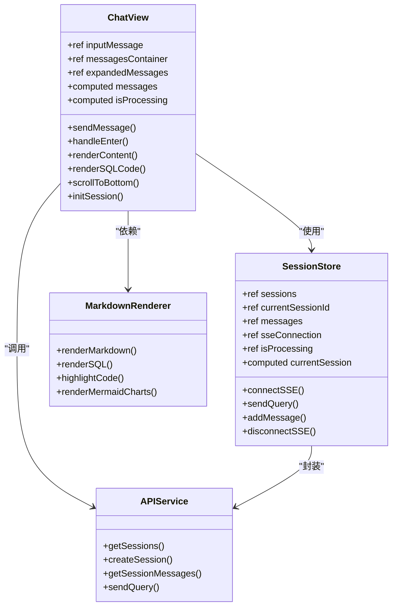
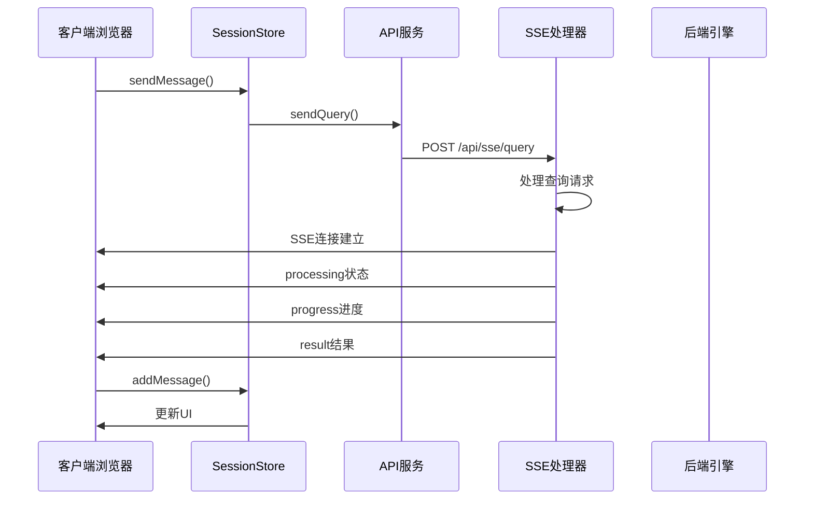
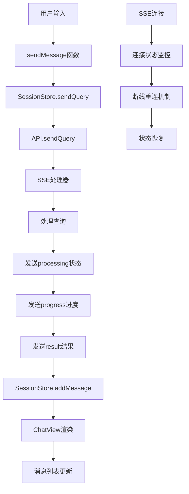
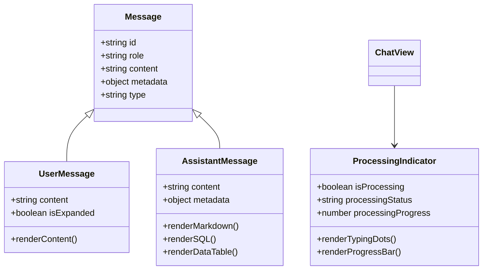
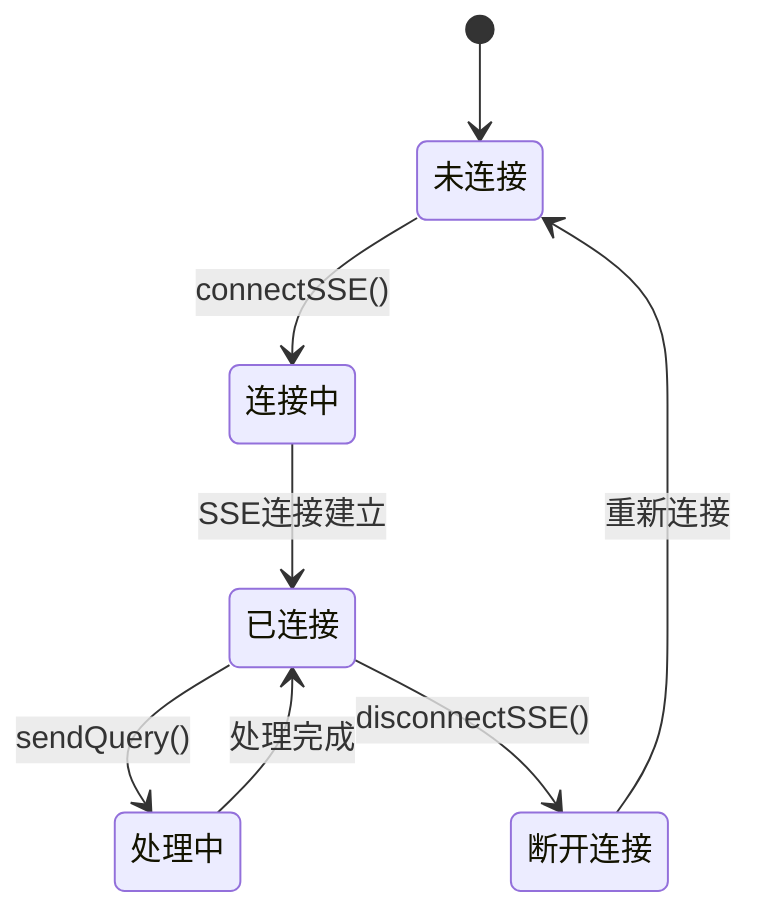
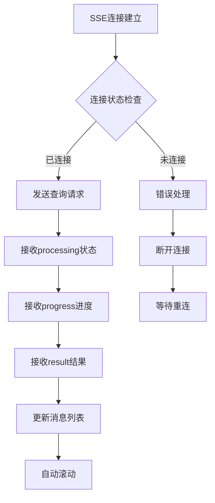
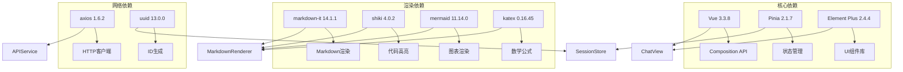

# 聊天界面

<cite>
**本文档引用的文件**
- [ChatView.vue](file://frontend/src/views/ChatView.vue)
- [session.js](file://frontend/src/stores/session.js)
- [markdownRenderer.js](file://frontend/src/utils/markdownRenderer.js)
- [api.js](file://frontend/src/utils/api.js)
- [App.vue](file://frontend/src/App.vue)
- [main.js](file://frontend/src/main.js)
- [sseHandler.js](file://backend/src/core/sseHandler.js)
- [package.json](file://frontend/package.json)
</cite>

## 目录
1. [简介](#简介)
2. [项目结构](#项目结构)
3. [核心组件](#核心组件)
4. [架构概览](#架构概览)
5. [详细组件分析](#详细组件分析)
6. [依赖关系分析](#依赖关系分析)
7. [性能考虑](#性能考虑)
8. [故障排除指南](#故障排除指南)
9. [结论](#结论)

## 简介

NL2SQL聊天界面是一个基于Vue 3构建的实时对话系统，专门用于将自然语言转换为SQL查询。该组件实现了完整的SSE（Server-Sent Events）实时通信机制，支持消息列表渲染、用户输入处理、Markdown内容渲染、SQL代码高亮显示、数据表格展示等功能特性。

该聊天界面采用现代化的设计理念，具备响应式布局、自动滚动机制、消息折叠展开功能，并与会话状态管理store深度集成，提供了完整的用户体验。

## 项目结构

NL2SQL项目采用前后端分离架构，前端使用Vue 3 + Vite构建，后端使用Node.js + Express提供REST API和SSE服务。

```mermaid
graph TB
subgraph "前端架构"
A[App.vue 根组件] --> B[ChatView.vue 聊天界面]
A --> C[SchemaViewer.vue Schema查看]
D[main.js 应用入口] --> A
E[session.js Pinia Store] --> B
F[api.js API服务] --> B
G[markdownRenderer.js Markdown渲染] --> B
end
subgraph "后端架构"
H[SSE处理器] --> I[NL2SQL引擎]
H --> J[数据库模块]
K[路由配置] --> H
end
B < --> H
E < --> F
```

**图表来源**
- [App.vue:1-373](file://frontend/src/App.vue#L1-L373)
- [ChatView.vue:1-776](file://frontend/src/views/ChatView.vue#L1-L776)
- [session.js:1-398](file://frontend/src/stores/session.js#L1-L398)

**章节来源**
- [main.js:1-89](file://frontend/src/main.js#L1-L89)
- [package.json:1-36](file://frontend/package.json#L1-L36)

## 核心组件

### 聊天界面组件架构

聊天界面组件是整个NL2SQL系统的核心，采用了以下关键设计模式：



**图表来源**
- [ChatView.vue:132-381](file://frontend/src/views/ChatView.vue#L132-L381)
- [session.js:33-397](file://frontend/src/stores/session.js#L33-L397)
- [markdownRenderer.js:15-257](file://frontend/src/utils/markdownRenderer.js#L15-L257)

### 状态管理模式

组件采用Pinia状态管理，实现了集中式的状态控制：

- **响应式状态**：使用Vue 3的ref和computed实现响应式数据绑定
- **会话管理**：支持多会话并存，每个会话独立的状态管理
- **SSE连接**：维护实时通信连接，支持断线重连
- **处理状态**：跟踪查询处理进度和状态

**章节来源**
- [ChatView.vue:158-181](file://frontend/src/views/ChatView.vue#L158-L181)
- [session.js:37-78](file://frontend/src/stores/session.js#L37-L78)

## 架构概览

### 实时通信架构

聊天界面实现了完整的SSE实时通信架构，确保用户能够获得即时的反馈：



**图表来源**
- [ChatView.vue:196-214](file://frontend/src/views/ChatView.vue#L196-L214)
- [session.js:299-328](file://frontend/src/stores/session.js#L299-L328)
- [api.js:246-251](file://frontend/src/utils/api.js#L246-L251)

### 数据流架构



**图表来源**
- [ChatView.vue:196-325](file://frontend/src/views/ChatView.vue#L196-L325)
- [session.js:185-293](file://frontend/src/stores/session.js#L185-L293)

## 详细组件分析

### 聊天界面组件实现

#### 消息渲染系统

聊天界面实现了多层次的消息渲染系统，支持不同类型的消息内容：



**图表来源**
- [ChatView.vue:17-78](file://frontend/src/views/ChatView.vue#L17-L78)
- [ChatView.vue:263-278](file://frontend/src/views/ChatView.vue#L263-L278)

#### Markdown渲染引擎

组件集成了强大的Markdown渲染能力，支持多种格式：

- **基础Markdown**：标题、段落、列表、链接等
- **代码高亮**：支持多种编程语言的语法高亮
- **数学公式**：KaTeX渲染支持
- **图表绘制**：Mermaid图表支持
- **表格渲染**：复杂表格的优雅展示

**章节来源**
- [markdownRenderer.js:74-100](file://frontend/src/utils/markdownRenderer.js#L74-L100)
- [ChatView.vue:41-57](file://frontend/src/views/ChatView.vue#L41-L57)

### 状态管理系统

#### 会话状态管理

SessionStore实现了完整的会话状态管理：



**图表来源**
- [session.js:185-221](file://frontend/src/stores/session.js#L185-L221)
- [session.js:299-328](file://frontend/src/stores/session.js#L299-L328)

#### 响应式数据绑定

组件使用Vue 3的响应式系统实现数据绑定：

- **消息列表**：使用computed保持与store同步
- **处理状态**：实时反映查询进度
- **输入状态**：动态禁用发送按钮
- **滚动位置**：自动滚动到最新消息

**章节来源**
- [ChatView.vue:173-181](file://frontend/src/views/ChatView.vue#L173-L181)
- [ChatView.vue:368-380](file://frontend/src/views/ChatView.vue#L368-L380)

### 实时通信机制

#### SSE连接管理

组件实现了健壮的SSE连接管理：



**图表来源**
- [session.js:185-221](file://frontend/src/stores/session.js#L185-L221)
- [session.js:227-293](file://frontend/src/stores/session.js#L227-L293)

#### 键盘交互处理

组件支持灵活的键盘交互：

- **Enter发送**：默认行为发送消息
- **Shift+Enter换行**：在输入框内换行
- **自动焦点管理**：发送后自动聚焦输入框
- **输入验证**：防止空消息发送

**章节来源**
- [ChatView.vue:220-227](file://frontend/src/views/ChatView.vue#L220-L227)
- [ChatView.vue:196-214](file://frontend/src/views/ChatView.vue#L196-L214)

### 用户界面特性

#### 响应式设计

聊天界面采用响应式设计，适配不同屏幕尺寸：

- **弹性布局**：使用Flexbox实现自适应布局
- **最大宽度限制**：消息内容有适当的宽度限制
- **移动端优化**：触摸友好的交互设计
- **字体缩放**：支持系统字体大小调整

#### 自动滚动机制

组件实现了智能的自动滚动功能：

- **消息新增时滚动**：新消息到达时自动滚动到底部
- **处理状态滚动**：处理完成时滚动到底部
- **防抖处理**：避免频繁滚动影响性能
- **位置记忆**：用户手动滚动时保持当前位置

**章节来源**
- [ChatView.vue:295-302](file://frontend/src/views/ChatView.vue#L295-L302)
- [ChatView.vue:368-370](file://frontend/src/views/ChatView.vue#L368-L370)

#### 消息折叠功能

对于长内容消息，组件提供了折叠展开功能：

- **长度阈值**：超过200字符的消息自动折叠
- **展开按钮**：清晰的展开/收起指示器
- **渐变遮罩**：折叠时的视觉效果
- **状态持久化**：展开状态随消息ID存储

**章节来源**
- [ChatView.vue:234-257](file://frontend/src/views/ChatView.vue#L234-L257)
- [ChatView.vue:454-468](file://frontend/src/views/ChatView.vue#L454-L468)

## 依赖关系分析

### 前端依赖架构



**图表来源**
- [package.json:11-29](file://frontend/package.json#L11-L29)
- [ChatView.vue:142-152](file://frontend/src/views/ChatView.vue#L142-L152)

### 后端集成

组件与后端服务的集成关系：

- **SSE连接**：通过`/api/sse/stream`建立实时连接
- **查询提交**：通过`/api/sse/query`提交查询请求
- **会话管理**：通过REST API管理会话状态
- **Schema查询**：通过`/api/schema`获取数据结构信息

**章节来源**
- [session.js:192](file://frontend/src/stores/session.js#L192)
- [api.js:246-251](file://frontend/src/utils/api.js#L246-L251)

## 性能考虑

### 渲染优化

组件实现了多项性能优化策略：

- **虚拟滚动**：对于大量消息的场景，可考虑实现虚拟滚动
- **懒加载**：Markdown渲染和代码高亮采用异步加载
- **防抖处理**：输入验证和滚动操作使用防抖
- **内存管理**：及时清理SSE连接和事件监听器

### 网络优化

- **连接复用**：同一会话复用SSE连接
- **错误重试**：实现智能的连接重试机制
- **超时处理**：合理的请求超时和错误处理
- **缓存策略**：合理利用浏览器缓存

### 内存管理

- **组件卸载**：确保SSE连接在组件卸载时正确关闭
- **事件清理**：移除所有事件监听器
- **定时器清理**：清理可能存在的定时器
- **引用清理**：避免循环引用导致的内存泄漏

## 故障排除指南

### 常见问题及解决方案

#### SSE连接问题

**症状**：无法建立SSE连接或连接频繁断开

**诊断步骤**：
1. 检查网络连接状态
2. 验证后端服务是否正常运行
3. 查看浏览器开发者工具的Network面板
4. 检查CORS配置

**解决方案**：
- 确保后端SSE端点可用
- 检查防火墙和代理设置
- 实现自动重连机制
- 添加连接状态指示器

#### 消息渲染异常

**症状**：Markdown内容或SQL代码显示异常

**诊断步骤**：
1. 检查Markdown渲染库版本兼容性
2. 验证代码高亮主题配置
3. 查看浏览器控制台错误信息
4. 确认依赖库正确加载

**解决方案**：
- 更新相关依赖库版本
- 检查CSS样式冲突
- 实现降级渲染方案
- 添加错误边界处理

#### 性能问题

**症状**：消息列表滚动卡顿或渲染缓慢

**诊断步骤**：
1. 使用浏览器性能分析工具
2. 检查消息数量和复杂度
3. 分析DOM节点数量
4. 监控内存使用情况

**解决方案**：
- 实现虚拟滚动
- 优化CSS渲染
- 减少不必要的重渲染
- 实施消息分页加载

**章节来源**
- [ChatView.vue:322-325](file://frontend/src/views/ChatView.vue#L322-L325)
- [session.js:214-217](file://frontend/src/stores/session.js#L214-L217)

## 结论

NL2SQL聊天界面组件是一个功能完整、架构清晰的实时对话系统。它成功地结合了现代前端技术栈，实现了以下核心特性：

### 技术亮点

- **实时通信**：基于SSE的高效实时通信机制
- **富文本渲染**：完整的Markdown渲染生态系统
- **响应式设计**：适配多设备的现代化界面
- **状态管理**：基于Pinia的集中式状态控制
- **性能优化**：多项性能优化策略确保流畅体验

### 架构优势

- **模块化设计**：清晰的组件职责划分
- **依赖解耦**：良好的依赖注入和接口抽象
- **扩展性强**：易于添加新功能和特性的架构
- **可维护性**：规范的代码组织和文档

### 未来发展方向

1. **虚拟滚动**：实现大数据量消息的高性能渲染
2. **离线支持**：添加离线消息缓存和同步机制
3. **多语言支持**：国际化和本地化功能
4. **主题系统**：可定制的主题和外观选项
5. **语音交互**：集成语音识别和合成功能

该组件为NL2SQL系统提供了坚实的基础，通过其优秀的架构设计和实现质量，为用户提供了流畅、直观的自然语言查询体验。