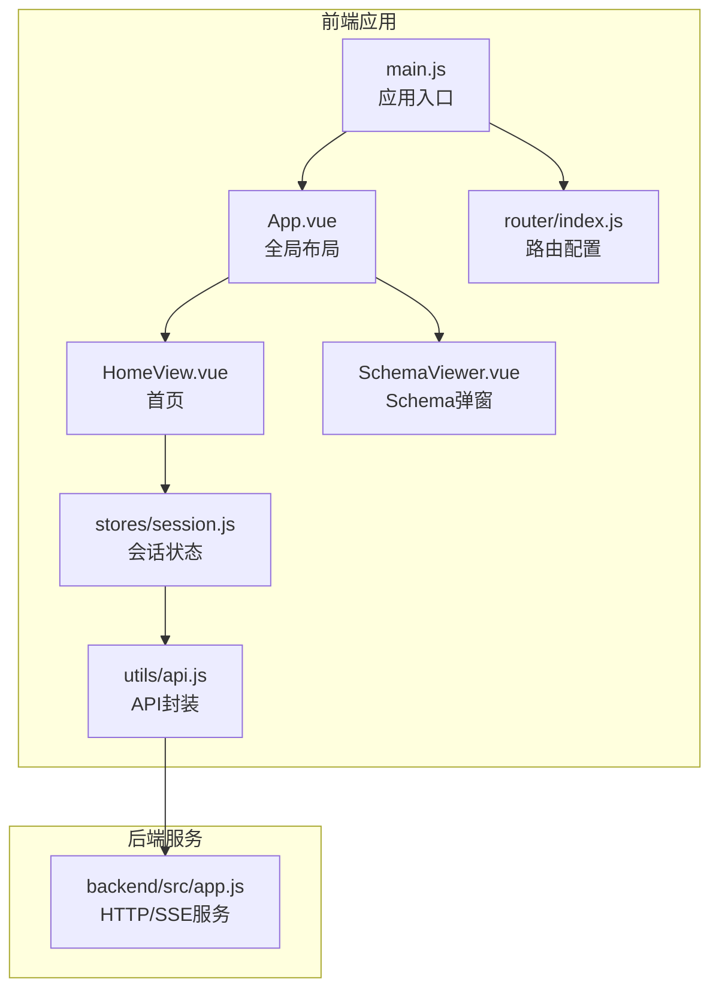
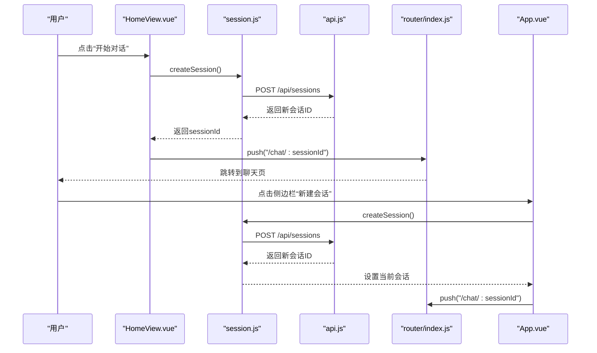
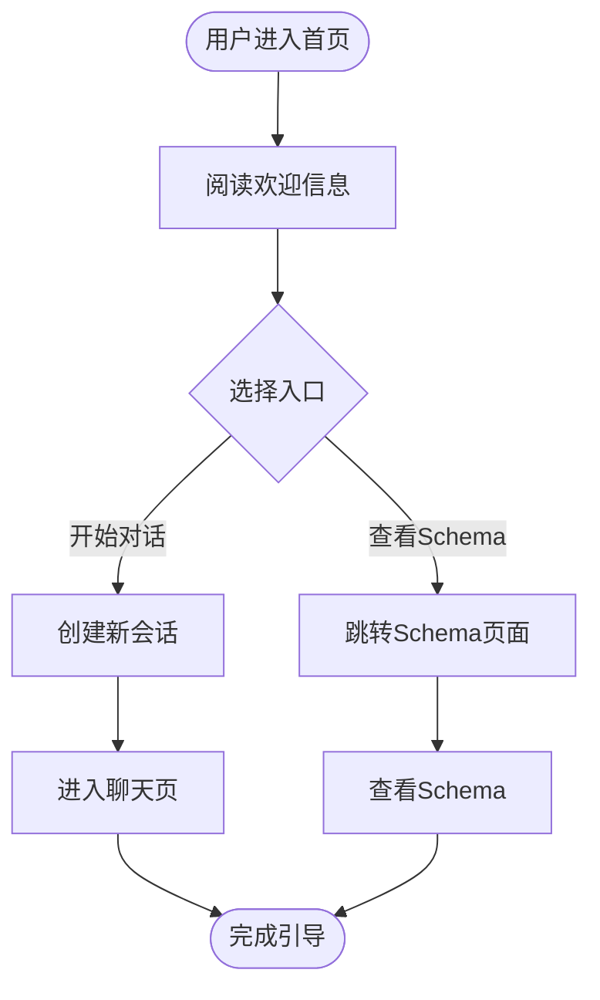
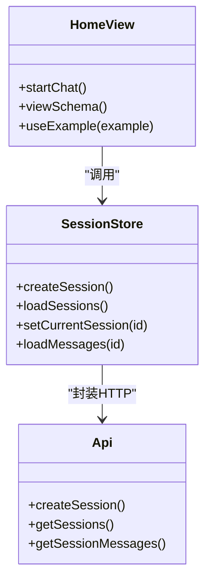
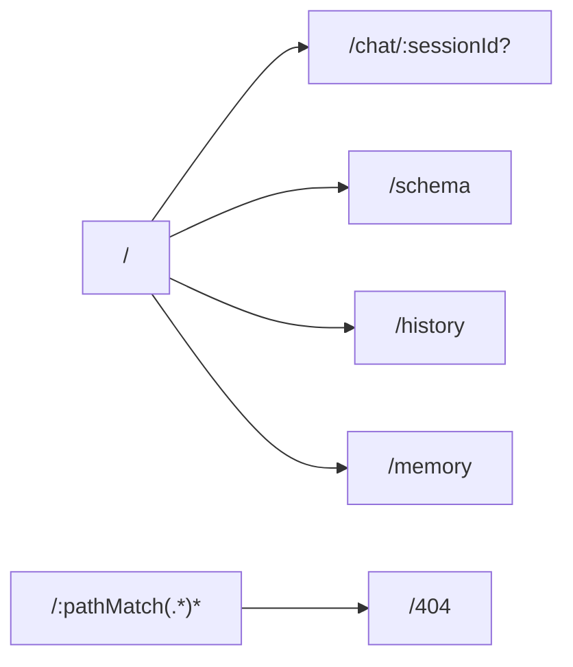
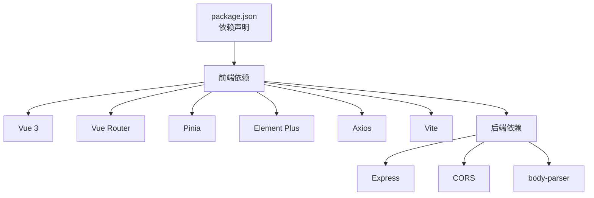

# 首页

<cite>
**本文引用的文件**
- [HomeView.vue](file://frontend/src/views/HomeView.vue)
- [App.vue](file://frontend/src/App.vue)
- [main.js](file://frontend/src/main.js)
- [router/index.js](file://frontend/src/router/index.js)
- [stores/session.js](file://frontend/src/stores/session.js)
- [utils/api.js](file://frontend/src/utils/api.js)
- [components/SchemaViewer.vue](file://frontend/src/components/SchemaViewer.vue)
- [styles/global.css](file://frontend/src/styles/global.css)
- [package.json](file://frontend/package.json)
- [vite.config.js](file://frontend/vite.config.js)
- [index.html](file://frontend/index.html)
- [backend/src/app.js](file://backend/src/app.js)
</cite>

## 目录
1. [简介](#简介)
2. [项目结构](#项目结构)
3. [核心组件](#核心组件)
4. [架构总览](#架构总览)
5. [详细组件分析](#详细组件分析)
6. [依赖分析](#依赖分析)
7. [性能考虑](#性能考虑)
8. [故障排查指南](#故障排查指南)
9. [结论](#结论)
10. [附录](#附录)

## 简介
本文件面向NL2SQL首页（HomeView）的使用者与开发者，系统性梳理首页的功能边界、布局设计、用户引导流程、会话管理集成方式、响应式与无障碍支持，以及最佳实践与引导策略。首页作为应用的“主入口”，承担以下职责：
- 欢迎信息与产品定位展示
- 快速开始入口（开始对话、查看Schema）
- 功能特性与使用示例的引导
- 与会话管理（Session Store）的集成，支持新会话创建与跳转
- 与全局布局（App.vue）及路由（router）的协同

## 项目结构
前端采用Vue 3 + Vite + Pinia + Element Plus技术栈，首页位于views层，配合全局布局、路由与状态管理共同构成完整的SPA体验。首页与全局布局、路由、状态管理的关系如下：

**图表来源**
- [main.js:1-89](file://frontend/src/main.js#L1-L89)
- [App.vue:1-373](file://frontend/src/App.vue#L1-L373)
- [HomeView.vue:1-318](file://frontend/src/views/HomeView.vue#L1-L318)
- [router/index.js:1-147](file://frontend/src/router/index.js#L1-L147)
- [stores/session.js:1-398](file://frontend/src/stores/session.js#L1-L398)
- [utils/api.js:1-252](file://frontend/src/utils/api.js#L1-L252)
- [components/SchemaViewer.vue:1-317](file://frontend/src/components/SchemaViewer.vue#L1-L317)
- [backend/src/app.js:1-200](file://backend/src/app.js#L1-L200)

**章节来源**
- [main.js:1-89](file://frontend/src/main.js#L1-L89)
- [router/index.js:1-147](file://frontend/src/router/index.js#L1-L147)
- [App.vue:1-373](file://frontend/src/App.vue#L1-L373)
- [HomeView.vue:1-318](file://frontend/src/views/HomeView.vue#L1-L318)
- [stores/session.js:1-398](file://frontend/src/stores/session.js#L1-L398)
- [utils/api.js:1-252](file://frontend/src/utils/api.js#L1-L252)
- [components/SchemaViewer.vue:1-317](file://frontend/src/components/SchemaViewer.vue#L1-L317)
- [backend/src/app.js:1-200](file://backend/src/app.js#L1-L200)

## 核心组件
- 首页组件（HomeView.vue）：负责欢迎信息、快速开始按钮、功能特性卡片、使用示例列表等UI与交互。
- 全局布局（App.vue）：提供侧边栏导航、会话列表、Schema弹窗等，承载首页与聊天页等页面的统一布局。
- 路由（router/index.js）：定义首页、聊天、Schema、历史、记忆等页面的路由规则与元信息。
- 会话状态（stores/session.js）：封装会话的创建、切换、消息加载、SSE连接等能力，首页通过该Store创建新会话并跳转。
- API封装（utils/api.js）：统一HTTP请求与SSE查询提交，首页通过该模块调用后端接口。
- Schema查看组件（components/SchemaViewer.vue）：在App.vue中被复用，用于查看数据Schema。

**章节来源**
- [HomeView.vue:95-188](file://frontend/src/views/HomeView.vue#L95-L188)
- [App.vue:82-229](file://frontend/src/App.vue#L82-L229)
- [router/index.js:34-99](file://frontend/src/router/index.js#L34-L99)
- [stores/session.js:103-138](file://frontend/src/stores/session.js#L103-L138)
- [utils/api.js:151-165](file://frontend/src/utils/api.js#L151-L165)
- [components/SchemaViewer.vue:1-87](file://frontend/src/components/SchemaViewer.vue#L1-L87)

## 架构总览
首页的用户引导与会话创建流程如下：

**图表来源**
- [HomeView.vue:153-163](file://frontend/src/views/HomeView.vue#L153-L163)
- [stores/session.js:118-138](file://frontend/src/stores/session.js#L118-L138)
- [utils/api.js:160-165](file://frontend/src/utils/api.js#L160-L165)
- [router/index.js:51-58](file://frontend/src/router/index.js#L51-L58)
- [App.vue:165-175](file://frontend/src/App.vue#L165-L175)

## 详细组件分析

### 首页布局与用户引导
- 欢迎区域：展示品牌图标、标题与副标题，营造专业、易用的第一印象。
- 快速开始：提供“开始对话”和“查看数据Schema”两个主要入口，分别引导用户进入聊天与Schema浏览。
- 功能特性网格：以卡片形式呈现自然语言查询、智能澄清、安全可靠、可视化展示等能力，帮助用户理解产品价值。
- 使用示例：提供可点击的示例文本，用户点击后自动创建新会话并跳转至聊天页，便于快速体验。

**图表来源**
- [HomeView.vue:6-92](file://frontend/src/views/HomeView.vue#L6-L92)
- [HomeView.vue:153-187](file://frontend/src/views/HomeView.vue#L153-L187)

**章节来源**
- [HomeView.vue:6-92](file://frontend/src/views/HomeView.vue#L6-L92)
- [HomeView.vue:153-187](file://frontend/src/views/HomeView.vue#L153-L187)

### 会话管理集成
- 新会话创建：首页通过会话Store创建新会话，获得会话ID后跳转至聊天页；同时支持点击示例文本触发相同流程。
- 现有会话访问：全局布局侧边栏展示历史会话列表，用户可直接切换会话并跳转至对应聊天页。
- 会话状态检查：会话Store提供当前会话ID、消息列表、SSE连接状态等，首页通过Store间接感知会话可用性。

**图表来源**
- [HomeView.vue:153-187](file://frontend/src/views/HomeView.vue#L153-L187)
- [stores/session.js:103-138](file://frontend/src/stores/session.js#L103-L138)
- [utils/api.js:151-186](file://frontend/src/utils/api.js#L151-L186)

**章节来源**
- [HomeView.vue:153-187](file://frontend/src/views/HomeView.vue#L153-L187)
- [stores/session.js:103-138](file://frontend/src/stores/session.js#L103-L138)
- [utils/api.js:151-186](file://frontend/src/utils/api.js#L151-L186)

### 导航与路由
- 首页路由：路径“/”，元信息包含标题“首页”与requiresSession=false，适合首次访问。
- 聊天路由：路径“/chat/:sessionId?”，元信息包含标题“对话”与requiresSession=true，用于会话上下文。
- 其他页面：历史、Schema、记忆、404等页面路由，均在路由配置中定义。

**图表来源**
- [router/index.js:34-99](file://frontend/src/router/index.js#L34-L99)

**章节来源**
- [router/index.js:34-99](file://frontend/src/router/index.js#L34-L99)

### 响应式设计与无障碍支持
- 响应式布局：全局样式在移动端场景下对侧边栏进行适配，保证在窄屏设备上的可用性。
- 无障碍基础：页面具备语义化的标题层级与可点击元素，结合Element Plus组件库的默认可访问性能力，满足基础无障碍需求。

**章节来源**
- [styles/global.css:304-317](file://frontend/src/styles/global.css#L304-L317)
- [index.html:6-33](file://frontend/index.html#L6-L33)

### 最佳实践与用户引导策略
- 引导策略
  - 首次访问：突出“开始对话”按钮，降低认知负担；“查看Schema”作为辅助入口，帮助用户了解数据结构。
  - 示例驱动：使用示例文本直接触发会话创建，减少用户思考成本。
- 交互优化
  - 成功/失败反馈：创建会话失败时统一提示错误信息，避免用户困惑。
  - 会话一致性：首页与侧边栏共享同一会话Store，确保会话状态一致。
- 性能与稳定性
  - 首页仅负责引导与会话创建，不进行重型计算，保证首屏加载速度。
  - 会话相关操作通过Store与API封装，集中处理错误与状态，提升健壮性。

**章节来源**
- [HomeView.vue:153-163](file://frontend/src/views/HomeView.vue#L153-L163)
- [App.vue:165-175](file://frontend/src/App.vue#L165-L175)
- [stores/session.js:103-138](file://frontend/src/stores/session.js#L103-L138)

## 依赖分析
- 技术栈
  - 前端：Vue 3、Vue Router、Pinia、Element Plus、Axios、Vite
  - 后端：Express、CORS、body-parser、HTTP服务器、SSE
- 关键依赖关系
  - 首页依赖会话Store与API封装，后者通过Axios与后端交互。
  - 全局布局依赖会话Store与Schema弹窗组件，形成统一的导航与会话管理体验。
  - 路由配置决定页面跳转与标题元信息，影响用户感知。

**图表来源**
- [package.json:11-29](file://frontend/package.json#L11-L29)
- [backend/src/app.js:22-34](file://backend/src/app.js#L22-L34)

**章节来源**
- [package.json:11-29](file://frontend/package.json#L11-L29)
- [backend/src/app.js:22-34](file://backend/src/app.js#L22-L34)

## 性能考虑
- 首页轻量化：首页仅包含静态展示与少量交互，避免在首屏加载重型资源。
- 会话Store懒加载：聊天页按需加载，减少首页初始负载。
- 构建优化：Vite配置对第三方库进行分包，提升缓存命中率与加载效率。
- 网络优化：API封装统一处理超时与错误，避免重复请求与阻塞。

**章节来源**
- [vite.config.js:72-91](file://frontend/vite.config.js#L72-L91)
- [utils/api.js:25-34](file://frontend/src/utils/api.js#L25-L34)

## 故障排查指南
- 会话创建失败
  - 现象：点击“开始对话”或“使用示例”后提示错误。
  - 排查：检查后端服务是否启动、/api/sessions接口是否可达、网络代理配置是否正确。
  - 参考：首页与会话Store的错误处理逻辑。
- Schema查看异常
  - 现象：点击“查看数据Schema”弹窗无法显示或空白。
  - 排查：确认后端Schema接口可用、前端SchemaViewer组件加载逻辑正常。
- 路由跳转异常
  - 现象：点击按钮后未跳转或跳转到错误页面。
  - 排查：核对路由配置与元信息、检查会话ID是否有效。

**章节来源**
- [HomeView.vue:153-163](file://frontend/src/views/HomeView.vue#L153-L163)
- [stores/session.js:103-138](file://frontend/src/stores/session.js#L103-L138)
- [utils/api.js:151-165](file://frontend/src/utils/api.js#L151-L165)
- [components/SchemaViewer.vue:191-208](file://frontend/src/components/SchemaViewer.vue#L191-L208)

## 结论
首页作为NL2SQL的“触点”，通过简洁的欢迎信息、清晰的快速入口与示例驱动的交互，有效降低了用户的学习与使用门槛。其与会话Store、路由与全局布局的紧密协作，确保了从首页到聊天页的顺畅流转。配合响应式设计与基础无障碍支持，首页在多终端场景下均能提供一致、友好的用户体验。建议持续关注会话状态一致性、错误提示的友好性与Schema数据的实时性，以进一步提升用户满意度。

## 附录
- 开发与运行
  - 前端：使用Vite开发服务器，端口5173，代理至后端3000端口。
  - 后端：Express服务，监听3000端口，提供REST与SSE接口。
- 入口文件
  - HTML入口：index.html，挂载点为#app。
  - JS入口：main.js，安装路由、状态管理与UI库，挂载应用。

**章节来源**
- [vite.config.js:18-35](file://frontend/vite.config.js#L18-L35)
- [backend/src/app.js:147-158](file://backend/src/app.js#L147-L158)
- [index.html:24](file://frontend/index.html#L24)