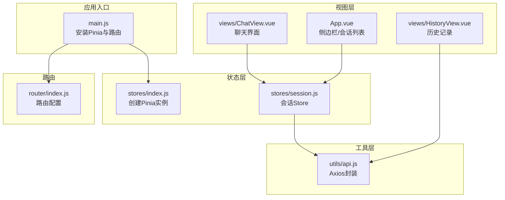
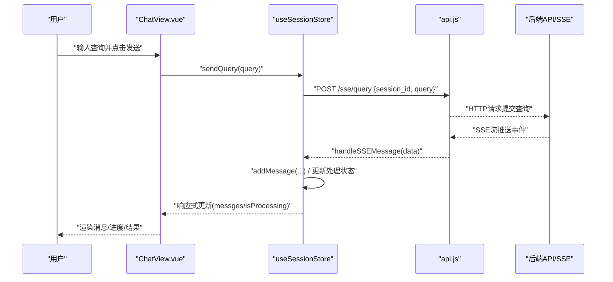
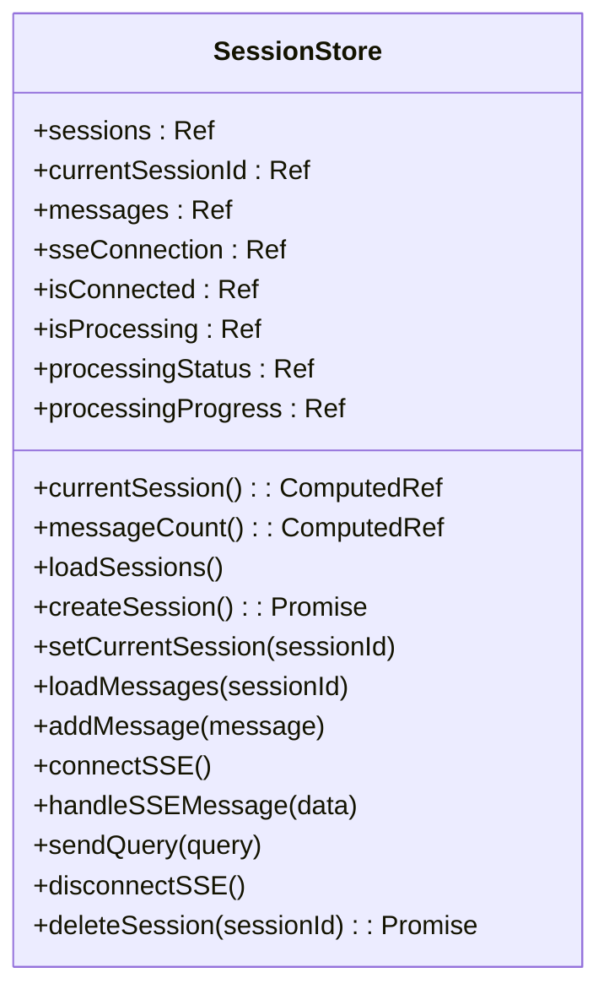
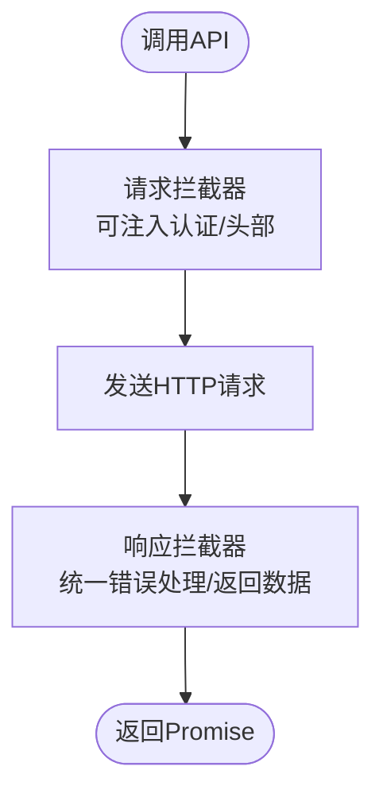
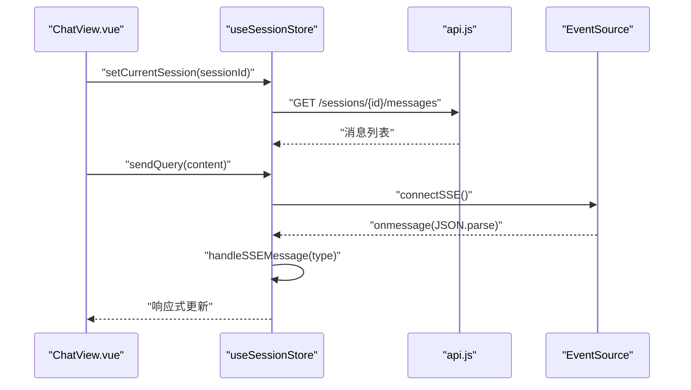
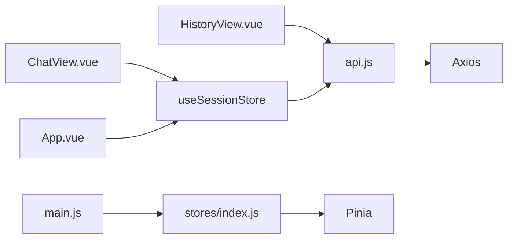

# 状态管理

<cite>
**本文引用的文件**
- [frontend/src/stores/index.js](file://frontend/src/stores/index.js)
- [frontend/src/stores/session.js](file://frontend/src/stores/session.js)
- [frontend/src/main.js](file://frontend/src/main.js)
- [frontend/src/utils/api.js](file://frontend/src/utils/api.js)
- [frontend/src/views/ChatView.vue](file://frontend/src/views/ChatView.vue)
- [frontend/src/views/HistoryView.vue](file://frontend/src/views/HistoryView.vue)
- [frontend/src/App.vue](file://frontend/src/App.vue)
- [frontend/src/router/index.js](file://frontend/src/router/index.js)
- [frontend/package.json](file://frontend/package.json)
</cite>

## 目录
1. [简介](#简介)
2. [项目结构](#项目结构)
3. [核心组件](#核心组件)
4. [架构总览](#架构总览)
5. [详细组件分析](#详细组件分析)
6. [依赖关系分析](#依赖关系分析)
7. [性能考量](#性能考量)
8. [故障排查指南](#故障排查指南)
9. [结论](#结论)
10. [附录](#附录)

## 简介
本文件面向NL2SQL前端的状态管理系统，系统基于Pinia实现，围绕“会话”这一核心业务域构建状态模型，覆盖会话创建、维护、销毁以及与后端SSE流的同步机制。文档将从架构设计、模块化组织、响应式更新、持久化策略、最佳实践、调试与性能优化、与后端API的同步等方面进行深入说明，并辅以可视化图示帮助读者快速理解。

## 项目结构
前端采用Vue 3 + Vite + Pinia的现代前端技术栈，状态管理集中于stores目录，会话状态由单个store统一管理；视图层通过Composition API与store交互，路由负责页面级导航与元信息。

图表来源
- [frontend/src/main.js:1-89](file://frontend/src/main.js#L1-L89)
- [frontend/src/stores/index.js:1-30](file://frontend/src/stores/index.js#L1-L30)
- [frontend/src/stores/session.js:1-398](file://frontend/src/stores/session.js#L1-L398)
- [frontend/src/views/ChatView.vue:1-776](file://frontend/src/views/ChatView.vue#L1-L776)
- [frontend/src/views/HistoryView.vue:1-441](file://frontend/src/views/HistoryView.vue#L1-L441)
- [frontend/src/router/index.js:1-147](file://frontend/src/router/index.js#L1-L147)
- [frontend/src/utils/api.js:1-252](file://frontend/src/utils/api.js#L1-L252)

章节来源
- [frontend/src/main.js:1-89](file://frontend/src/main.js#L1-L89)
- [frontend/src/stores/index.js:1-30](file://frontend/src/stores/index.js#L1-L30)
- [frontend/src/router/index.js:1-147](file://frontend/src/router/index.js#L1-L147)

## 核心组件
- Pinia实例与安装：在入口文件中创建并安装Pinia，使应用具备全局状态能力。
- 会话Store：集中管理会话列表、当前会话、消息历史、SSE连接、处理状态等。
- API服务：统一封装Axios，提供REST接口与SSE查询提交。
- 视图组件：通过useSessionStore与store交互，驱动UI响应式更新。

章节来源
- [frontend/src/stores/index.js:1-30](file://frontend/src/stores/index.js#L1-L30)
- [frontend/src/stores/session.js:1-398](file://frontend/src/stores/session.js#L1-L398)
- [frontend/src/utils/api.js:1-252](file://frontend/src/utils/api.js#L1-L252)
- [frontend/src/views/ChatView.vue:1-776](file://frontend/src/views/ChatView.vue#L1-L776)
- [frontend/src/App.vue:1-373](file://frontend/src/App.vue#L1-L373)

## 架构总览
下图展示Pinia Store与视图组件、路由、API之间的交互关系，以及SSE事件流如何回填到store中，形成完整的前后端状态同步闭环。

图表来源
- [frontend/src/views/ChatView.vue:196-214](file://frontend/src/views/ChatView.vue#L196-L214)
- [frontend/src/stores/session.js:299-328](file://frontend/src/stores/session.js#L299-L328)
- [frontend/src/stores/session.js:227-293](file://frontend/src/stores/session.js#L227-L293)
- [frontend/src/utils/api.js:246-251](file://frontend/src/utils/api.js#L246-L251)

## 详细组件分析

### Pinia实例与安装
- 在入口文件中创建Pinia实例并安装到Vue应用，确保全局可访问。
- 通过路由与组件中按需引入store，避免重复创建实例。

章节来源
- [frontend/src/main.js:30-66](file://frontend/src/main.js#L30-L66)
- [frontend/src/stores/index.js:19-29](file://frontend/src/stores/index.js#L19-L29)

### 会话Store（session.js）
- 状态（State）：会话列表、当前会话ID、消息列表、SSE连接、连接状态、处理状态与进度。
- 计算属性（Getters）：当前会话、消息数量。
- Action：
  - 会话管理：加载会话列表、创建会话、设置当前会话、删除会话。
  - 消息管理：加载消息、追加消息。
  - SSE：建立连接、断开连接、处理SSE消息类型（连接、处理中、进度、结果、澄清、错误）。
  - 查询：发送查询请求（通过HTTP POST），并在SSE流中接收结果。

图表来源
- [frontend/src/stores/session.js:33-397](file://frontend/src/stores/session.js#L33-L397)

章节来源
- [frontend/src/stores/session.js:33-397](file://frontend/src/stores/session.js#L33-L397)

### API服务（api.js）
- Axios实例：统一基础URL、超时、请求/响应拦截器。
- 会话相关接口：获取会话列表、创建会话、获取会话消息、删除会话。
- 查询相关接口：提交查询（POST /sse/query），后端通过SSE推送事件。
- 健康检查、Schema、历史、统计、配置等接口预留。

图表来源
- [frontend/src/utils/api.js:25-88](file://frontend/src/utils/api.js#L25-L88)

章节来源
- [frontend/src/utils/api.js:147-195](file://frontend/src/utils/api.js#L147-L195)
- [frontend/src/utils/api.js:246-251](file://frontend/src/utils/api.js#L246-L251)

### 视图组件与状态交互

#### ChatView.vue
- 通过useSessionStore读取响应式状态（messages、isProcessing、processingStatus、processingProgress）。
- 发送消息时调用store的sendQuery，内部通过SSE接收后端事件并更新store。
- 生命周期内初始化会话并连接SSE；组件卸载时断开SSE。

图表来源
- [frontend/src/views/ChatView.vue:331-343](file://frontend/src/views/ChatView.vue#L331-L343)
- [frontend/src/views/ChatView.vue:196-214](file://frontend/src/views/ChatView.vue#L196-L214)
- [frontend/src/stores/session.js:144-155](file://frontend/src/stores/session.js#L144-L155)
- [frontend/src/stores/session.js:161-171](file://frontend/src/stores/session.js#L161-L171)
- [frontend/src/stores/session.js:299-328](file://frontend/src/stores/session.js#L299-L328)
- [frontend/src/stores/session.js:185-221](file://frontend/src/stores/session.js#L185-L221)

章节来源
- [frontend/src/views/ChatView.vue:172-181](file://frontend/src/views/ChatView.vue#L172-L181)
- [frontend/src/views/ChatView.vue:331-343](file://frontend/src/views/ChatView.vue#L331-L343)
- [frontend/src/stores/session.js:144-155](file://frontend/src/stores/session.js#L144-L155)
- [frontend/src/stores/session.js:161-171](file://frontend/src/stores/session.js#L161-L171)
- [frontend/src/stores/session.js:299-328](file://frontend/src/stores/session.js#L299-L328)

#### App.vue（侧边栏与会话列表）
- 通过useSessionStore读取sessions与currentSessionId，实现会话列表渲染与切换。
- 创建新会话后跳转到对应聊天页；删除会话时同步更新store并处理路由跳转。

章节来源
- [frontend/src/App.vue:129-134](file://frontend/src/App.vue#L129-L134)
- [frontend/src/App.vue:165-175](file://frontend/src/App.vue#L165-L175)
- [frontend/src/App.vue:181-189](file://frontend/src/App.vue#L181-L189)
- [frontend/src/App.vue:195-217](file://frontend/src/App.vue#L195-L217)

#### HistoryView.vue（历史记录）
- 通过api.js获取历史记录，不直接依赖会话store，体现store职责边界清晰。

章节来源
- [frontend/src/views/HistoryView.vue:226-243](file://frontend/src/views/HistoryView.vue#L226-L243)

### 路由与会话
- 路由配置包含会话相关页面（聊天页带sessionId参数）。
- 全局前置守卫设置页面标题，保证用户体验一致性。

章节来源
- [frontend/src/router/index.js:34-99](file://frontend/src/router/index.js#L34-L99)
- [frontend/src/router/index.js:132-140](file://frontend/src/router/index.js#L132-L140)

## 依赖关系分析
- 组件依赖：ChatView与App均依赖useSessionStore；HistoryView依赖api.js。
- Store依赖：session.js依赖api.js与EventSource；main.js依赖stores/index.js。
- 外部依赖：Vue 3、Pinia、Element Plus、Axios、UUID、Vue Router等。

图表来源
- [frontend/src/views/ChatView.vue:149-152](file://frontend/src/views/ChatView.vue#L149-L152)
- [frontend/src/App.vue:112-114](file://frontend/src/App.vue#L112-L114)
- [frontend/src/views/HistoryView.vue:156](file://frontend/src/views/HistoryView.vue#L156)
- [frontend/src/stores/session.js:22](file://frontend/src/stores/session.js#L22)
- [frontend/src/stores/index.js:13](file://frontend/src/stores/index.js#L13)
- [frontend/src/utils/api.js:15](file://frontend/src/utils/api.js#L15)
- [frontend/package.json:23](file://frontend/package.json#L23)

章节来源
- [frontend/package.json:11-28](file://frontend/package.json#L11-L28)

## 性能考量
- 响应式更新：store中的ref/computed仅在变更时触发视图更新，避免不必要的重渲染。
- SSE事件处理：在handleSSEMessage中按类型分支处理，减少冗余逻辑；及时清理isProcessing与进度状态。
- 消息列表：使用浅层watch监听messages，配合nextTick滚动到底部，避免深度遍历带来的开销。
- API调用：统一拦截器减少重复代码；合理设置超时与错误处理，降低异常对UI的影响。
- 组件懒加载：路由中对部分页面采用动态导入，降低首屏体积。

章节来源
- [frontend/src/views/ChatView.vue:368-380](file://frontend/src/views/ChatView.vue#L368-L380)
- [frontend/src/stores/session.js:227-293](file://frontend/src/stores/session.js#L227-L293)
- [frontend/src/router/index.js:63-64](file://frontend/src/router/index.js#L63-L64)

## 故障排查指南
- SSE连接问题
  - 症状：无法接收后端事件或连接频繁断开。
  - 排查：检查connectSSE是否正确构造URL并传入currentSessionId；确认后端SSE端点可用；观察handleSSEMessage对不同type的处理是否正确。
- 查询发送失败
  - 症状：前端显示错误消息，后端无日志。
  - 排查：确认sendQuery前SSE已连接；检查API拦截器返回的数据结构；核对后端接口签名与参数。
- 会话切换异常
  - 症状：切换会话后消息未更新或路由未跳转。
  - 排查：确认setCurrentSession已调用loadMessages；检查路由参数变化监听是否生效；确认store中currentSessionId与messages同步更新。
- 错误处理
  - 症状：错误未被捕获或提示不明确。
  - 排查：检查API响应拦截器的错误分支；在store action中捕获并抛出错误；在组件中使用ElMessage反馈用户。

章节来源
- [frontend/src/stores/session.js:185-221](file://frontend/src/stores/session.js#L185-L221)
- [frontend/src/stores/session.js:299-328](file://frontend/src/stores/session.js#L299-L328)
- [frontend/src/stores/session.js:345-368](file://frontend/src/stores/session.js#L345-L368)
- [frontend/src/utils/api.js:67-88](file://frontend/src/utils/api.js#L67-L88)

## 结论
NL2SQL前端采用Pinia进行模块化的状态管理，围绕会话域构建了清晰的Store与Action，结合Axios与SSE实现了前后端状态同步。通过响应式更新与路由联动，组件能够高效地反映状态变化。建议在后续迭代中进一步完善错误恢复、持久化策略与调试工具链，以提升稳定性与可观测性。

## 附录

### 状态管理最佳实践
- 状态设计原则
  - 单一职责：每个store聚焦一个业务域（如会话）。
  - 最小化状态：仅存储UI与业务必需的数据。
  - 明确边界：与后端API交互集中在API服务层。
- Action组织
  - 将异步流程拆分为多个Action，便于复用与测试。
  - 在Action中统一错误处理与状态标记（如isProcessing）。
- 响应式与commit
  - 使用ref/computed暴露状态与派生数据，避免手动commit。
  - 通过store返回值直接暴露方法，保持API简洁。
- 调试与性能
  - 使用浏览器开发者工具的Vue DevTools观察store状态变化。
  - 对高频更新的列表使用浅层watch与必要的防抖/节流。
- 与后端API同步
  - SSE事件类型明确区分，避免状态污染。
  - HTTP与SSE双通道协同：HTTP用于提交请求，SSE用于实时结果推送。

章节来源
- [frontend/src/stores/session.js:374-397](file://frontend/src/stores/session.js#L374-L397)
- [frontend/src/utils/api.js:25-88](file://frontend/src/utils/api.js#L25-L88)