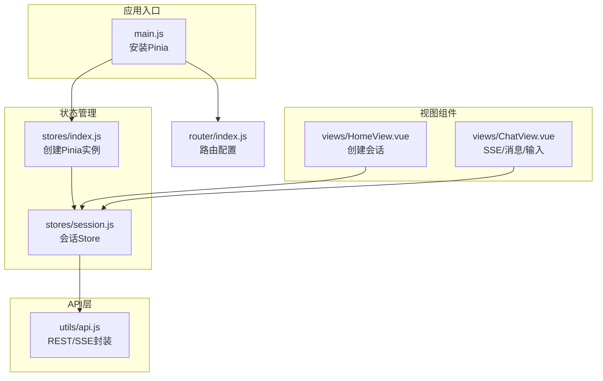
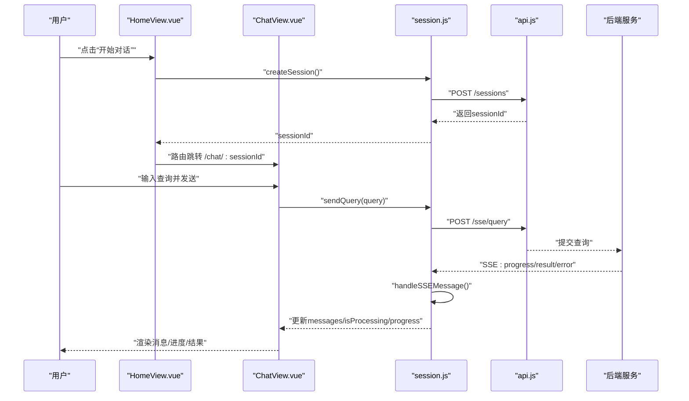
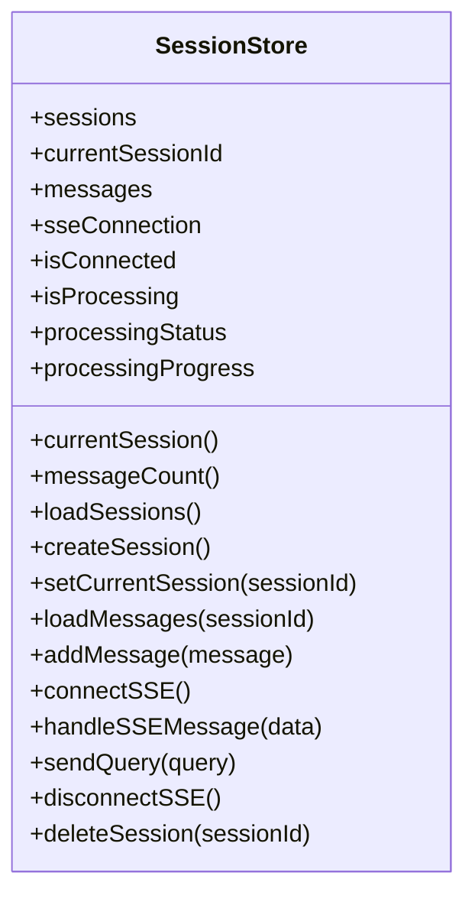
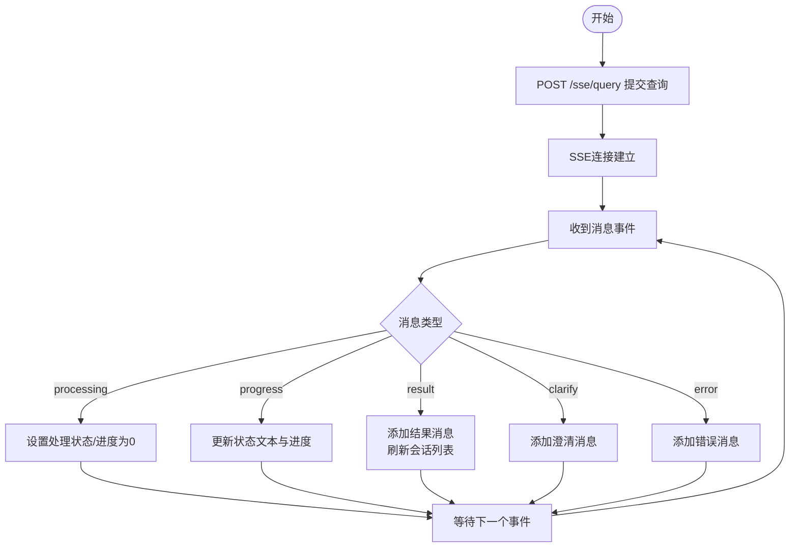
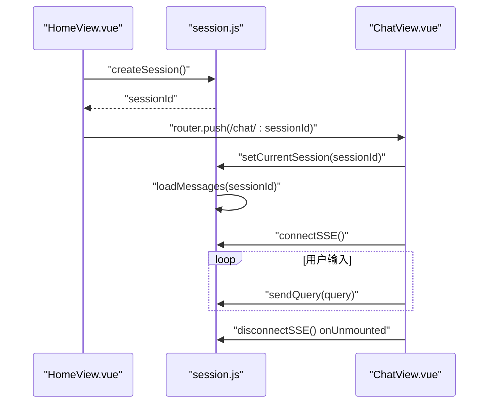
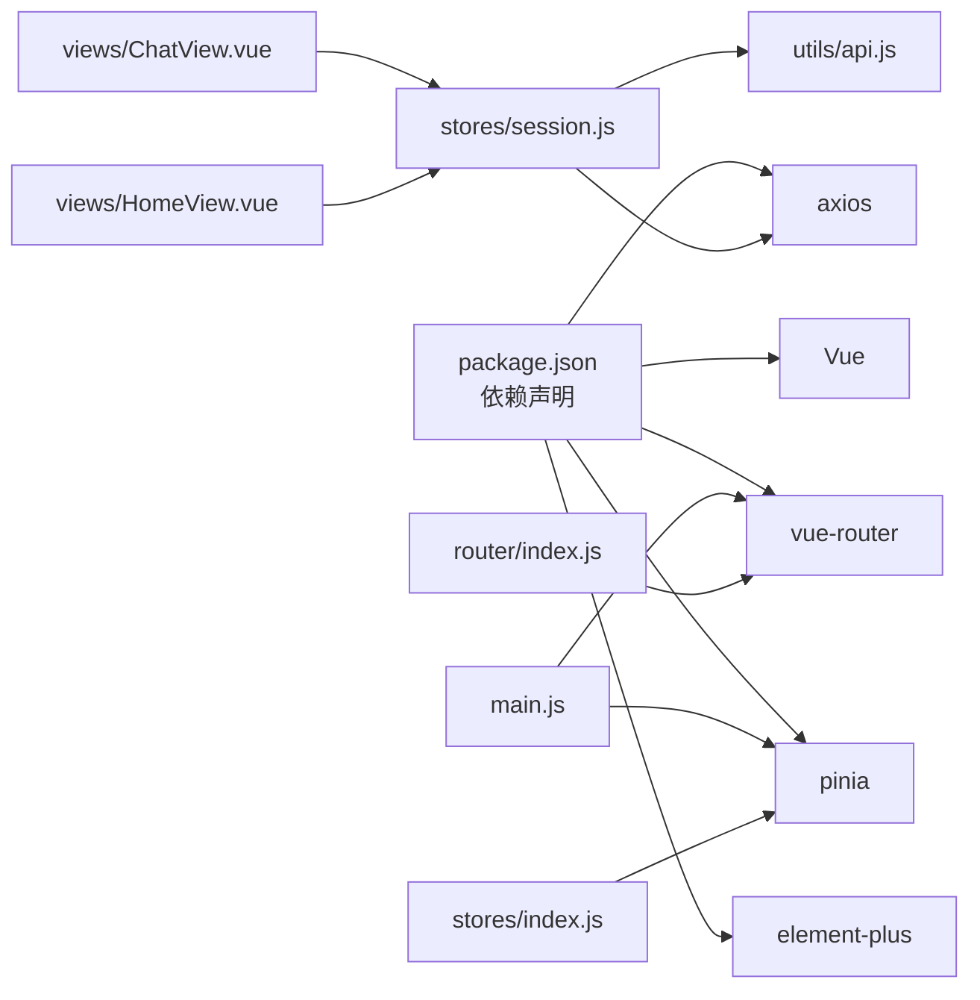

# 状态管理

<cite>
**本文引用的文件**
- [session.js](file://frontend/src/stores/session.js)
- [index.js](file://frontend/src/stores/index.js)
- [main.js](file://frontend/src/main.js)
- [api.js](file://frontend/src/utils/api.js)
- [ChatView.vue](file://frontend/src/views/ChatView.vue)
- [HomeView.vue](file://frontend/src/views/HomeView.vue)
- [router/index.js](file://frontend/src/router/index.js)
- [package.json](file://frontend/package.json)
</cite>

## 目录
1. [简介](#简介)
2. [项目结构](#项目结构)
3. [核心组件](#核心组件)
4. [架构总览](#架构总览)
5. [详细组件分析](#详细组件分析)
6. [依赖关系分析](#依赖关系分析)
7. [性能考量](#性能考量)
8. [故障排查指南](#故障排查指南)
9. [结论](#结论)
10. [附录](#附录)

## 简介
本文件面向 NL2SQL 前端的状态管理系统，围绕基于 Pinia 的会话状态 Store（session store）进行深入解析。重点涵盖：
- 会话状态的数据结构与响应式管理
- 计算属性与动作方法的使用方式
- 与后端 API 的交互流程与 SSE 推送机制
- 状态持久化策略与数据同步机制
- 错误处理与调试建议
- 最佳实践与性能优化
- 与其他组件的状态交互模式与数据流管理

## 项目结构
前端采用 Composition API + Pinia 的组织方式，状态管理集中在 stores 目录，会话 Store 位于 session.js；应用入口 main.js 安装 Pinia 并注入全局；API 服务封装在 utils/api.js 中；视图组件通过 useSessionStore 与状态交互。

**图表来源**
- [main.js:1-89](file://frontend/src/main.js#L1-L89)
- [index.js:1-30](file://frontend/src/stores/index.js#L1-L30)
- [session.js:1-400](file://frontend/src/stores/session.js#L1-L400)
- [api.js:1-303](file://frontend/src/utils/api.js#L1-L303)
- [router/index.js:1-157](file://frontend/src/router/index.js#L1-L157)

**章节来源**
- [main.js:1-89](file://frontend/src/main.js#L1-L89)
- [index.js:1-30](file://frontend/src/stores/index.js#L1-L30)
- [session.js:1-400](file://frontend/src/stores/session.js#L1-L400)
- [api.js:1-303](file://frontend/src/utils/api.js#L1-L303)
- [router/index.js:1-157](file://frontend/src/router/index.js#L1-L157)

## 核心组件
- Pinia 实例创建与注入：在 stores/index.js 中创建 Pinia 实例，并在 main.js 中安装到应用。
- 会话 Store（session store）：集中管理会话列表、当前会话、消息历史、SSE 连接、处理状态等。
- API 服务：封装 axios，统一请求/响应拦截，暴露 REST 与 SSE 相关接口。
- 视图组件：HomeView 用于创建会话并导航；ChatView 用于消息展示、输入、SSE 推送与状态监听。

**章节来源**
- [index.js:19-30](file://frontend/src/stores/index.js#L19-L30)
- [main.js:62-69](file://frontend/src/main.js#L62-L69)
- [session.js:33-399](file://frontend/src/stores/session.js#L33-L399)
- [api.js:25-88](file://frontend/src/utils/api.js#L25-L88)
- [HomeView.vue:149-187](file://frontend/src/views/HomeView.vue#L149-L187)
- [ChatView.vue:132-383](file://frontend/src/views/ChatView.vue#L132-L383)

## 架构总览
下图展示了从用户输入到后端处理再到前端状态更新的完整链路，包括 REST 请求与 SSE 推送。

**图表来源**
- [HomeView.vue:153-163](file://frontend/src/views/HomeView.vue#L153-L163)
- [ChatView.vue:196-214](file://frontend/src/views/ChatView.vue#L196-L214)
- [session.js:301-330](file://frontend/src/stores/session.js#L301-L330)
- [session.js:227-295](file://frontend/src/stores/session.js#L227-L295)
- [api.js:246-251](file://frontend/src/utils/api.js#L246-L251)

## 详细组件分析

### 会话 Store 设计与实现
- 状态字段
  - sessions：会话列表
  - currentSessionId：当前会话标识
  - messages：当前会话消息历史
  - sseConnection：SSE 连接实例
  - isConnected：SSE 连接状态
  - isProcessing：是否正在处理
  - processingStatus：处理状态文本
  - processingProgress：处理进度百分比
- 计算属性
  - currentSession：根据 currentSessionId 返回当前会话
  - messageCount：消息数量
- 动作方法
  - loadSessions：拉取会话列表
  - createSession：创建新会话并设置为当前会话
  - setCurrentSession：切换当前会话并加载消息
  - loadMessages：加载指定会话的历史消息
  - addMessage：向当前会话追加消息
  - connectSSE：建立 SSE 连接并订阅事件
  - handleSSEMessage：解析并分发 SSE 类型消息
  - sendQuery：通过 HTTP 提交查询，配合 SSE 推送结果
  - disconnectSSE：断开 SSE 连接
  - deleteSession：删除会话并清理当前状态

**图表来源**
- [session.js:33-399](file://frontend/src/stores/session.js#L33-L399)

**章节来源**
- [session.js:38-78](file://frontend/src/stores/session.js#L38-L78)
- [session.js:86-94](file://frontend/src/stores/session.js#L86-L94)
- [session.js:103-138](file://frontend/src/stores/session.js#L103-L138)
- [session.js:144-171](file://frontend/src/stores/session.js#L144-L171)
- [session.js:177-179](file://frontend/src/stores/session.js#L177-L179)
- [session.js:185-221](file://frontend/src/stores/session.js#L185-L221)
- [session.js:227-295](file://frontend/src/stores/session.js#L227-L295)
- [session.js:301-330](file://frontend/src/stores/session.js#L301-L330)
- [session.js:335-341](file://frontend/src/stores/session.js#L335-L341)
- [session.js:347-370](file://frontend/src/stores/session.js#L347-L370)

### API 服务与 SSE 流程
- axios 实例配置：baseURL、timeout、请求/响应拦截器
- REST API：会话列表、创建、查询、删除、Schema、健康检查等
- SSE API：sendQuery 通过 HTTP 提交查询，后端以 SSE 推送进度与结果
- 错误处理：统一捕获网络错误与服务端错误，返回标准化错误对象

**图表来源**
- [api.js:246-251](file://frontend/src/utils/api.js#L246-L251)
- [session.js:227-295](file://frontend/src/stores/session.js#L227-L295)

**章节来源**
- [api.js:25-88](file://frontend/src/utils/api.js#L25-L88)
- [api.js:151-195](file://frontend/src/utils/api.js#L151-L195)
- [api.js:246-251](file://frontend/src/utils/api.js#L246-L251)
- [session.js:185-221](file://frontend/src/stores/session.js#L185-L221)
- [session.js:227-295](file://frontend/src/stores/session.js#L227-L295)

### 视图组件与状态交互
- HomeView：通过 useSessionStore.createSession 创建会话，然后路由跳转至 ChatView
- ChatView：通过 useSessionStore 订阅 messages、isProcessing、processingStatus、processingProgress 等响应式状态；监听路由参数变化以切换会话；监听消息变化自动滚动；在组件卸载时断开 SSE

**图表来源**
- [HomeView.vue:153-163](file://frontend/src/views/HomeView.vue#L153-L163)
- [ChatView.vue:333-345](file://frontend/src/views/ChatView.vue#L333-L345)
- [ChatView.vue:354-361](file://frontend/src/views/ChatView.vue#L354-L361)
- [ChatView.vue:370-382](file://frontend/src/views/ChatView.vue#L370-L382)
- [ChatView.vue:324-327](file://frontend/src/views/ChatView.vue#L324-L327)

**章节来源**
- [HomeView.vue:149-187](file://frontend/src/views/HomeView.vue#L149-L187)
- [ChatView.vue:171-181](file://frontend/src/views/ChatView.vue#L171-L181)
- [ChatView.vue:313-345](file://frontend/src/views/ChatView.vue#L313-L345)
- [ChatView.vue:354-361](file://frontend/src/views/ChatView.vue#L354-L361)
- [ChatView.vue:370-382](file://frontend/src/views/ChatView.vue#L370-L382)
- [ChatView.vue:324-327](file://frontend/src/views/ChatView.vue#L324-L327)

## 依赖关系分析
- 应用入口 main.js 安装 Pinia，并在应用中注册路由与 UI 组件库
- stores/index.js 创建 Pinia 实例并导出
- session.js 使用 defineStore 定义会话 Store，并依赖 api.js 进行后端通信
- ChatView 与 HomeView 通过 useSessionStore 与 Store 交互
- router/index.js 定义路由与导航守卫

**图表来源**
- [package.json:11-28](file://frontend/package.json#L11-L28)
- [main.js:14-42](file://frontend/src/main.js#L14-L42)
- [index.js:12-23](file://frontend/src/stores/index.js#L12-L23)
- [session.js:16-22](file://frontend/src/stores/session.js#L16-L22)
- [api.js:14-15](file://frontend/src/utils/api.js#L14-L15)
- [ChatView.vue:149-152](file://frontend/src/views/ChatView.vue#L149-L152)
- [HomeView.vue:119-120](file://frontend/src/views/HomeView.vue#L119-L120)
- [router/index.js:15-156](file://frontend/src/router/index.js#L15-L156)

**章节来源**
- [package.json:11-28](file://frontend/package.json#L11-L28)
- [main.js:14-42](file://frontend/src/main.js#L14-L42)
- [index.js:12-23](file://frontend/src/stores/index.js#L12-L23)
- [session.js:16-22](file://frontend/src/stores/session.js#L16-L22)
- [api.js:14-15](file://frontend/src/utils/api.js#L14-L15)
- [ChatView.vue:149-152](file://frontend/src/views/ChatView.vue#L149-L152)
- [HomeView.vue:119-120](file://frontend/src/views/HomeView.vue#L119-L120)
- [router/index.js:15-156](file://frontend/src/router/index.js#L15-L156)

## 性能考量
- 响应式粒度：将 messages、isProcessing、processingStatus、processingProgress 等作为独立响应式状态，避免不必要的重渲染
- 深度监听：在 ChatView 中对 messages 使用深监听以支持表格数据变更后的自动滚动，注意在大数据量时可能带来性能压力
- SSE 连接复用：connectSSE 会在新建连接前关闭旧连接，避免重复订阅导致的内存泄漏
- 消息追加：addMessage 采用 push 方式，复杂度 O(1)，适合增量更新
- 路由切换：ChatView 在路由参数变化时断开旧 SSE 并重新初始化，保证会话隔离

**章节来源**
- [ChatView.vue:370-372](file://frontend/src/views/ChatView.vue#L370-L372)
- [session.js:185-221](file://frontend/src/stores/session.js#L185-L221)
- [session.js:177-179](file://frontend/src/stores/session.js#L177-L179)
- [ChatView.vue:354-361](file://frontend/src/views/ChatView.vue#L354-L361)

## 故障排查指南
- SSE 连接失败
  - 现象：isConnected 为 false 或 handleSSEMessage 未触发
  - 排查：确认 currentSessionId 已设置；检查后端 SSE 端点；查看浏览器网络面板
- 查询发送失败
  - 现象：sendQuery 抛错或提示“发送查询失败”
  - 排查：检查 API 返回的错误信息；确认 sessionId 有效；查看后端日志
- 消息未更新
  - 现象：messages 不随 SSE 推送而更新
  - 排查：确认 ChatView 订阅了 sessionStore.messages；检查 handleSSEMessage 的类型分支
- 进度不更新
  - 现象：processingStatus/processingProgress 未变化
  - 排查：确认 SSE 推送了 progress 类型消息；检查后端进度上报逻辑
- 资源泄漏
  - 现象：多次切换会话后内存占用上升
  - 排查：确保每次切换前调用 disconnectSSE；确认 onUnmounted 中断开连接

**章节来源**
- [session.js:185-221](file://frontend/src/stores/session.js#L185-L221)
- [session.js:227-295](file://frontend/src/stores/session.js#L227-L295)
- [session.js:301-330](file://frontend/src/stores/session.js#L301-L330)
- [ChatView.vue:324-327](file://frontend/src/views/ChatView.vue#L324-L327)

## 结论
本项目采用 Pinia + Composition API 的现代前端状态管理模式，session store 将会话、消息、SSE 状态与处理状态统一管理，配合 API 服务与视图组件形成清晰的数据流闭环。通过计算属性与动作方法的合理划分，实现了高内聚低耦合的状态管理；通过 SSE 与 REST 的结合，提供了流畅的实时交互体验。建议在后续迭代中进一步完善持久化策略与错误恢复机制，持续优化大数据量场景下的渲染性能。

## 附录

### 状态持久化策略
- 当前实现：session store 仅维护内存状态，未做持久化
- 建议方案：
  - 使用浏览器存储（localStorage/sessionStorage）缓存 sessions/currentSessionId
  - 在应用启动时优先从存储恢复状态，再异步拉取后端最新数据
  - 注意敏感信息不要持久化

### 数据同步机制
- 会话列表与消息：通过 REST API 同步；SSE 仅用于实时进度与结果推送
- 一致性：SSE result 后刷新会话列表以保持标题与元信息一致

### 最佳实践
- 状态设计原则
  - 单一职责：每个 Store 管理一组相关状态
  - 响应式优先：使用 computed/computed getter 提供派生状态
  - 动作聚合：将复杂业务封装为 action，便于测试与复用
- 性能优化
  - 避免在模板中直接访问深层嵌套数据
  - 对大列表使用虚拟滚动或分页
  - 合理使用 watch 与深监听
- 调试技巧
  - 使用浏览器 Vue DevTools 观察 Store 状态变化
  - 在 action 中打印关键路径日志
  - 对 SSE 事件进行类型校验与异常捕获