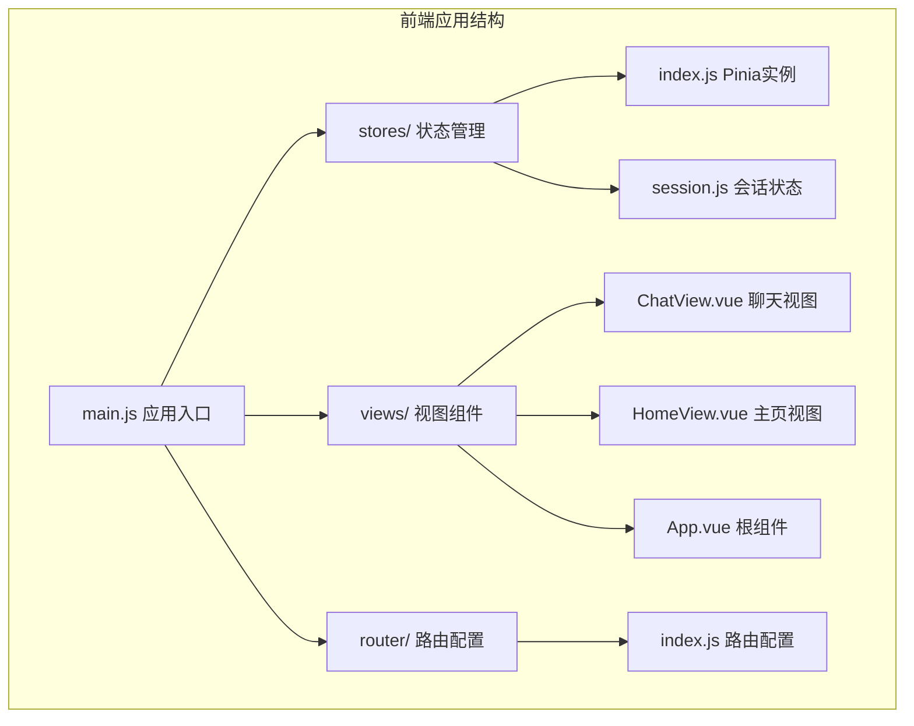
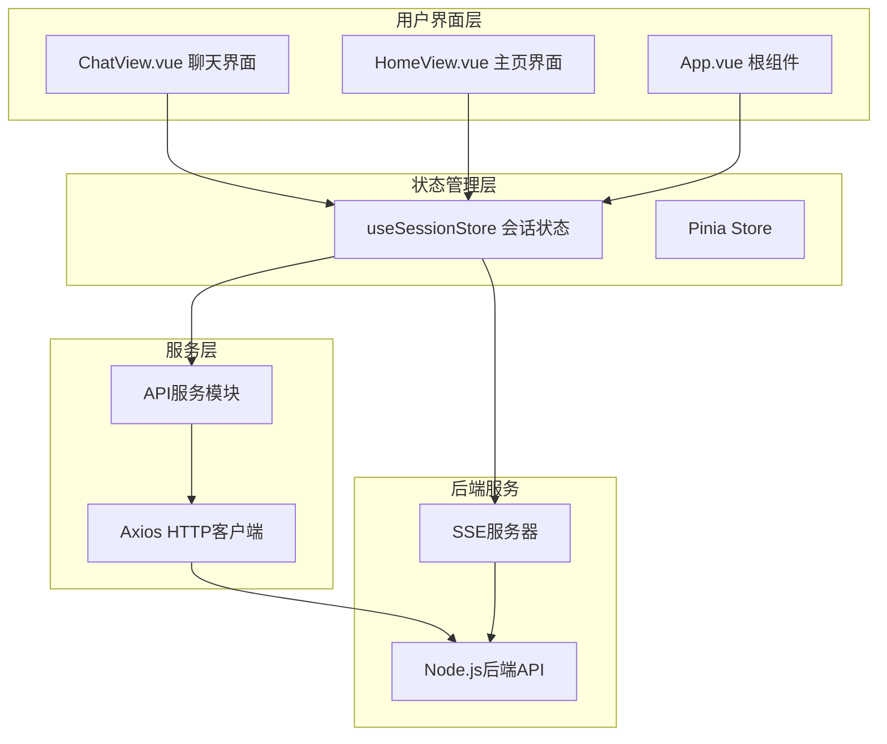
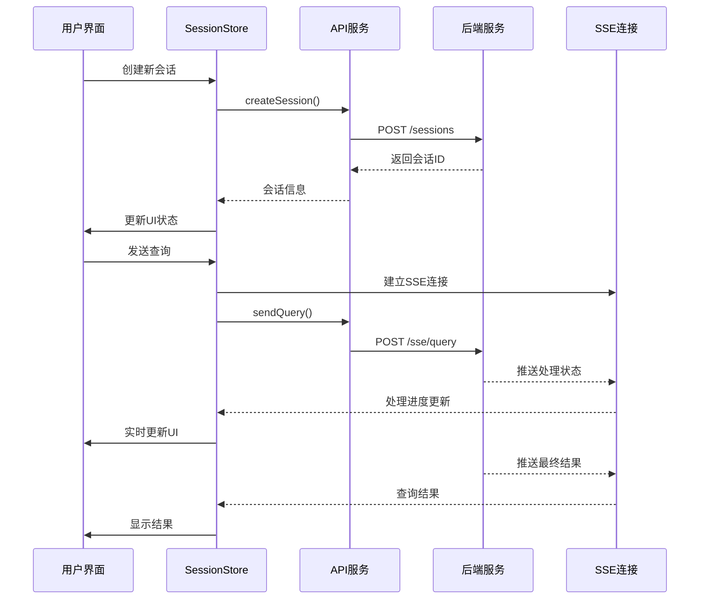
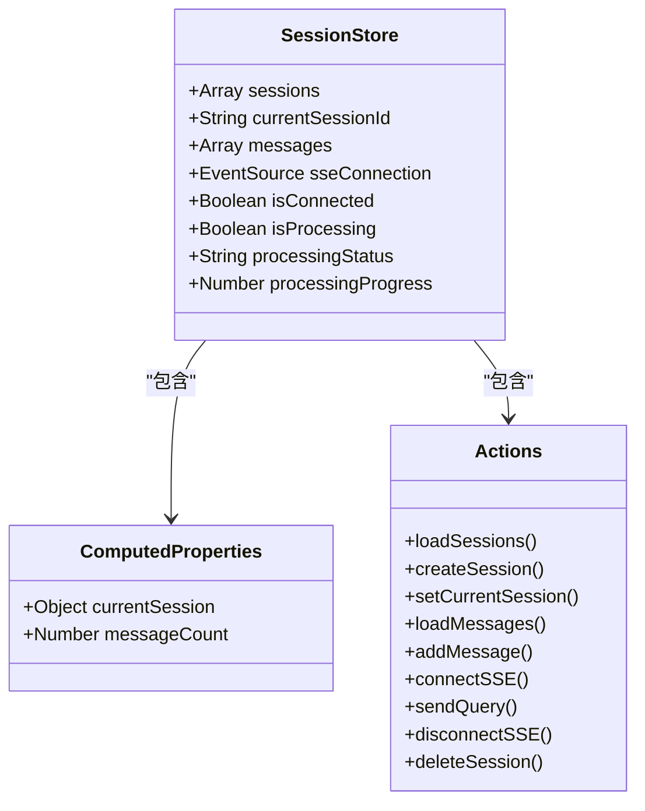
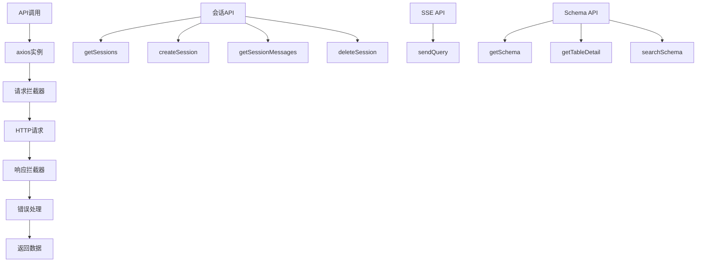
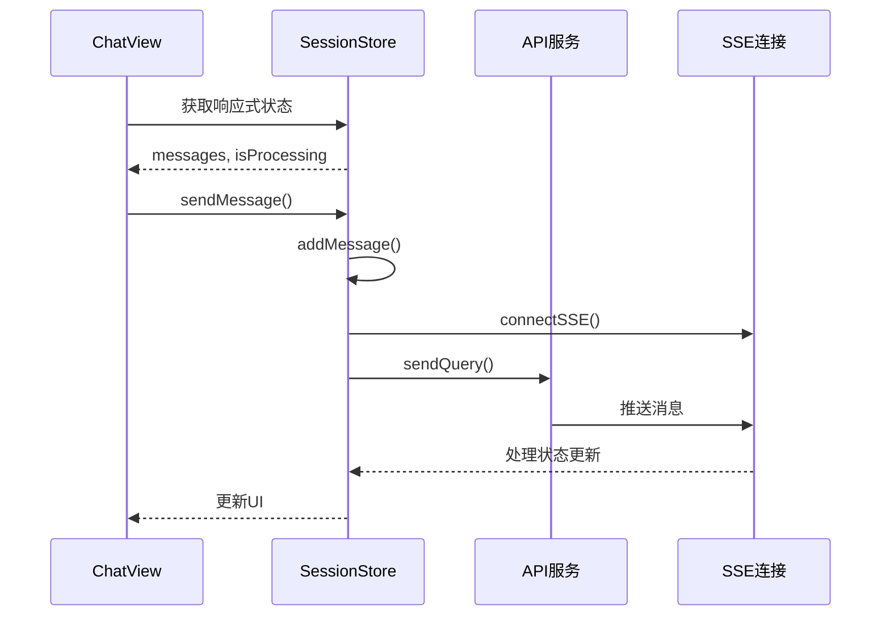
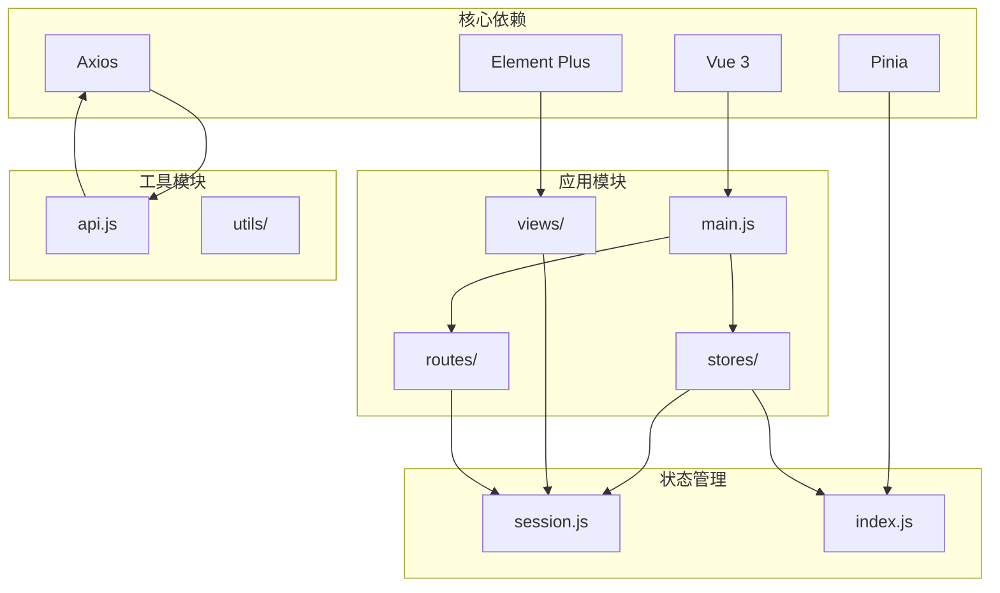

# 状态管理系统

<cite>
**本文档引用的文件**
- [frontend/src/stores/index.js](file://frontend/src/stores/index.js)
- [frontend/src/stores/session.js](file://frontend/src/stores/session.js)
- [frontend/src/main.js](file://frontend/src/main.js)
- [frontend/src/utils/api.js](file://frontend/src/utils/api.js)
- [frontend/src/views/ChatView.vue](file://frontend/src/views/ChatView.vue)
- [frontend/src/views/HomeView.vue](file://frontend/src/views/HomeView.vue)
- [frontend/src/App.vue](file://frontend/src/App.vue)
- [frontend/src/router/index.js](file://frontend/src/router/index.js)
- [frontend/package.json](file://frontend/package.json)
- [frontend/vite.config.js](file://frontend/vite.config.js)
</cite>

## 目录
1. [简介](#简介)
2. [项目结构](#项目结构)
3. [核心组件](#核心组件)
4. [架构概览](#架构概览)
5. [详细组件分析](#详细组件分析)
6. [依赖关系分析](#依赖关系分析)
7. [性能考虑](#性能考虑)
8. [故障排除指南](#故障排除指南)
9. [结论](#结论)

## 简介

NL2SQL前端状态管理系统基于Vue 3的Pinia状态管理库构建，专门用于管理自然语言到SQL转换应用中的会话状态。该系统实现了完整的会话生命周期管理，包括会话创建、消息历史管理、Server-Sent Events (SSE) 实时通信以及与后端API的同步机制。

系统采用现代化的前端架构，使用Composition API和响应式数据绑定，确保状态变更能够实时反映在用户界面中。通过Pinia的模块化设计，状态管理被组织成独立的store，便于维护和扩展。

## 项目结构

NL2SQL前端项目采用清晰的分层架构，状态管理位于专门的stores目录中：

**图表来源**
- [frontend/src/main.js:1-89](file://frontend/src/main.js#L1-L89)
- [frontend/src/stores/index.js:1-30](file://frontend/src/stores/index.js#L1-L30)
- [frontend/src/stores/session.js:1-400](file://frontend/src/stores/session.js#L1-L400)

**章节来源**
- [frontend/src/main.js:1-89](file://frontend/src/main.js#L1-L89)
- [frontend/src/stores/index.js:1-30](file://frontend/src/stores/index.js#L1-L30)
- [frontend/src/stores/session.js:1-400](file://frontend/src/stores/session.js#L1-L400)

## 核心组件

### Pinia状态管理入口

应用的状态管理通过Pinia提供，这是一个轻量级的状态管理库，专门为Vue 3设计，提供了更好的TypeScript支持和更直观的API。

### 会话状态Store

会话状态Store是整个应用的核心，负责管理用户会话的完整生命周期。它包含了以下关键功能：

- **会话管理**：创建、加载、删除用户会话
- **消息历史**：维护用户与AI助手之间的对话历史
- **实时通信**：通过SSE连接实现实时消息传输
- **处理状态**：跟踪查询处理进度和状态

**章节来源**
- [frontend/src/stores/index.js:1-30](file://frontend/src/stores/index.js#L1-L30)
- [frontend/src/stores/session.js:1-400](file://frontend/src/stores/session.js#L1-L400)

## 架构概览

NL2SQL状态管理系统采用分层架构设计，确保了良好的关注点分离和可维护性：

**图表来源**
- [frontend/src/views/ChatView.vue:132-383](file://frontend/src/views/ChatView.vue#L132-L383)
- [frontend/src/views/HomeView.vue:119-187](file://frontend/src/views/HomeView.vue#L119-L187)
- [frontend/src/App.vue:115-240](file://frontend/src/App.vue#L115-L240)
- [frontend/src/stores/session.js:33-399](file://frontend/src/stores/session.js#L33-L399)

系统的核心交互流程如下：

**图表来源**
- [frontend/src/stores/session.js:118-330](file://frontend/src/stores/session.js#L118-L330)
- [frontend/src/utils/api.js:160-251](file://frontend/src/utils/api.js#L160-L251)

## 详细组件分析

### Pinia实例配置

Pinia作为Vue 3的官方状态管理库，在NL2SQL项目中提供了简洁而强大的状态管理能力。其主要特点包括：

- **类型安全**：提供完整的TypeScript支持
- **模块化**：每个store都是独立的模块
- **热重载**：开发时支持热重载
- **Devtools集成**：与Vue Devtools深度集成

### 会话状态Store设计

会话状态Store采用了现代的Composition API风格，提供了清晰的状态、计算属性和动作的分离：

#### 状态定义

**图表来源**
- [frontend/src/stores/session.js:33-399](file://frontend/src/stores/session.js#L33-L399)

#### 计算属性设计

系统使用了多个计算属性来提供派生状态：

- **currentSession**：基于currentSessionId动态查找当前会话
- **messageCount**：实时计算消息数量

这些计算属性确保了状态的响应式更新，当底层数据发生变化时，计算属性会自动重新计算。

#### 动作方法分析

会话状态Store提供了丰富的动作方法来处理各种业务场景：

**会话管理动作**：
- `loadSessions()`：从后端加载会话列表
- `createSession()`：创建新的会话并设置为当前会话
- `deleteSession()`：删除指定会话

**消息管理动作**：
- `loadMessages()`：加载会话的历史消息
- `addMessage()`：向消息列表添加新消息

**实时通信动作**：
- `connectSSE()`：建立SSE连接
- `sendQuery()`：发送查询请求
- `disconnectSSE()`：断开SSE连接

**章节来源**
- [frontend/src/stores/session.js:99-370](file://frontend/src/stores/session.js#L99-L370)

### API服务层

API服务层封装了所有与后端的通信逻辑，提供了统一的接口：

**图表来源**
- [frontend/src/utils/api.js:25-88](file://frontend/src/utils/api.js#L25-L88)
- [frontend/src/utils/api.js:147-195](file://frontend/src/utils/api.js#L147-L195)
- [frontend/src/utils/api.js:246-251](file://frontend/src/utils/api.js#L246-L251)

**章节来源**
- [frontend/src/utils/api.js:1-303](file://frontend/src/utils/api.js#L1-L303)

### 视图组件集成

多个视图组件集成了会话状态管理，实现了状态的响应式绑定：

#### ChatView组件

ChatView是会话状态的主要消费者，展示了完整的聊天界面：

**图表来源**
- [frontend/src/views/ChatView.vue:171-214](file://frontend/src/views/ChatView.vue#L171-L214)
- [frontend/src/stores/session.js:297-330](file://frontend/src/stores/session.js#L297-L330)

**章节来源**
- [frontend/src/views/ChatView.vue:132-383](file://frontend/src/views/ChatView.vue#L132-L383)

#### App根组件

App组件提供了全局的会话管理和导航功能：

**章节来源**
- [frontend/src/App.vue:115-240](file://frontend/src/App.vue#L115-L240)

## 依赖关系分析

NL2SQL状态管理系统的依赖关系清晰明确，遵循了模块化设计原则：

**图表来源**
- [frontend/package.json:11-28](file://frontend/package.json#L11-L28)
- [frontend/src/main.js:14-31](file://frontend/src/main.js#L14-L31)

### 外部依赖

系统使用了以下关键外部依赖：

- **Vue 3**：提供响应式数据绑定和组件系统
- **Pinia**：提供状态管理功能
- **Axios**：处理HTTP请求
- **Element Plus**：提供UI组件库

**章节来源**
- [frontend/package.json:11-28](file://frontend/package.json#L11-L28)

## 性能考虑

NL2SQL状态管理系统在设计时充分考虑了性能优化：

### 响应式优化

- **计算属性缓存**：使用Vue的计算属性缓存机制避免重复计算
- **浅层响应式**：对于不需要深度监听的对象使用浅层响应式
- **条件渲染**：根据状态变化进行条件渲染，减少不必要的DOM更新

### 网络优化

- **请求去重**：避免重复发送相同的请求
- **连接复用**：SSE连接在组件间共享，避免重复建立连接
- **批量更新**：将多个状态更新合并为一次更新

### 内存管理

- **及时清理**：组件卸载时自动清理SSE连接和定时器
- **状态清理**：删除会话时清理相关状态和事件监听器

## 故障排除指南

### 常见问题及解决方案

#### SSE连接问题

**问题**：SSE连接无法建立或频繁断开

**诊断步骤**：
1. 检查后端服务是否正常运行
2. 验证会话ID的有效性
3. 检查网络连接状态

**解决方案**：
- 实现自动重连机制
- 添加连接状态监控
- 提供手动重连功能

#### 状态不同步问题

**问题**：UI状态与后端状态不一致

**诊断步骤**：
1. 检查API响应是否正确
2. 验证状态更新逻辑
3. 确认响应式绑定是否正常工作

**解决方案**：
- 实现状态回滚机制
- 添加冲突检测
- 提供手动同步功能

#### 性能问题

**问题**：大量消息导致界面卡顿

**诊断步骤**：
1. 分析消息列表长度
2. 检查DOM节点数量
3. 监控内存使用情况

**解决方案**：
- 实现消息分页加载
- 优化虚拟滚动
- 添加消息清理机制

**章节来源**
- [frontend/src/stores/session.js:185-221](file://frontend/src/stores/session.js#L185-L221)
- [frontend/src/views/ChatView.vue:324-327](file://frontend/src/views/ChatView.vue#L324-L327)

## 结论

NL2SQL前端状态管理系统展现了现代Vue 3应用的最佳实践。通过合理使用Pinia状态管理库，系统实现了清晰的状态分离、高效的响应式更新和良好的用户体验。

系统的主要优势包括：

1. **架构清晰**：采用模块化设计，职责分离明确
2. **性能优秀**：合理的响应式优化和网络优化策略
3. **可维护性强**：代码结构清晰，易于理解和扩展
4. **用户体验好**：实时通信和流畅的状态更新

未来可以考虑的改进方向：

1. **状态持久化**：实现本地存储机制，支持状态恢复
2. **错误边界**：增强错误处理和用户反馈
3. **性能监控**：添加状态管理的性能监控和分析工具
4. **测试覆盖**：增加状态管理相关的单元测试和集成测试

该系统为类似的自然语言处理应用提供了优秀的参考实现，展示了如何在Vue 3生态中构建复杂的状态管理解决方案。