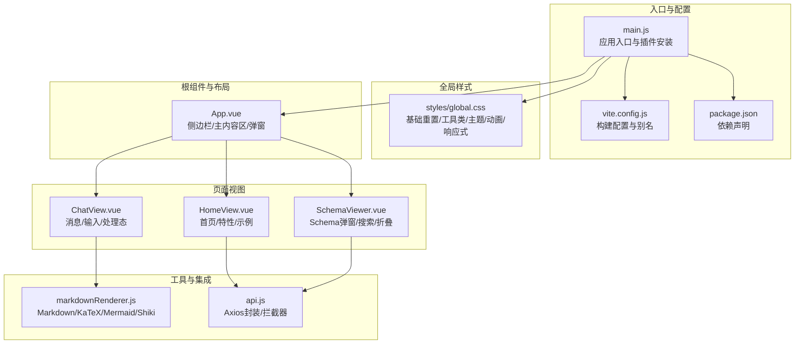
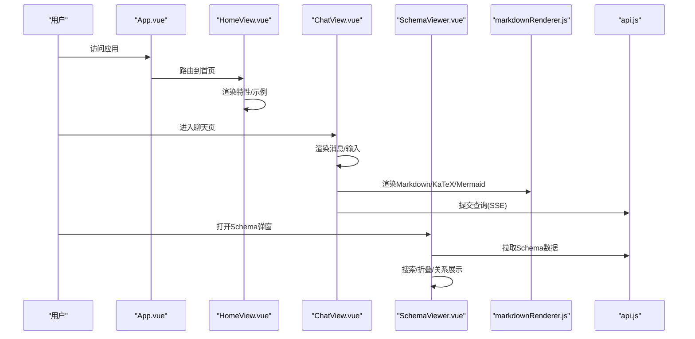
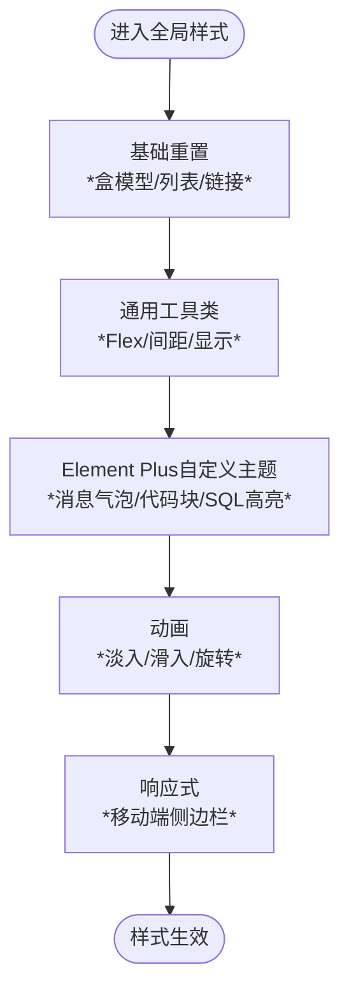
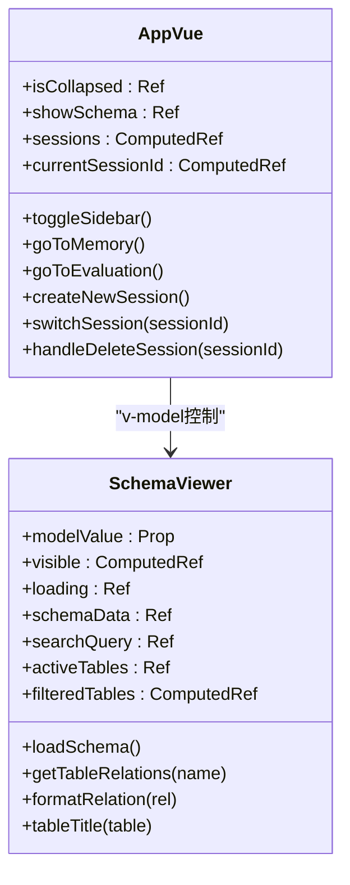
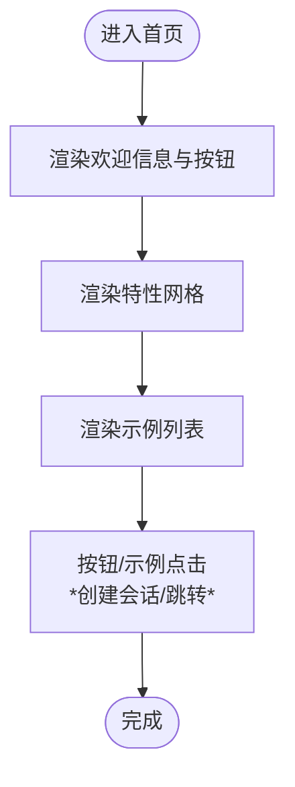
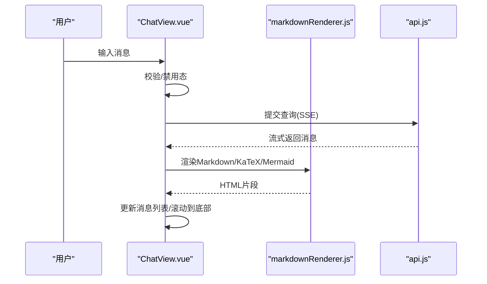
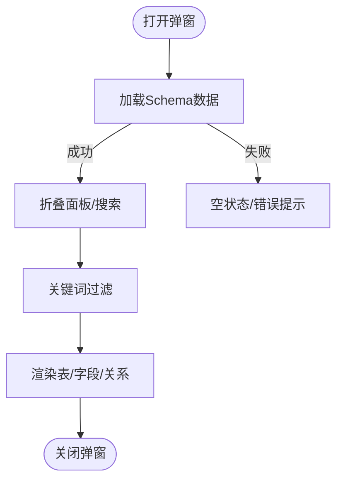
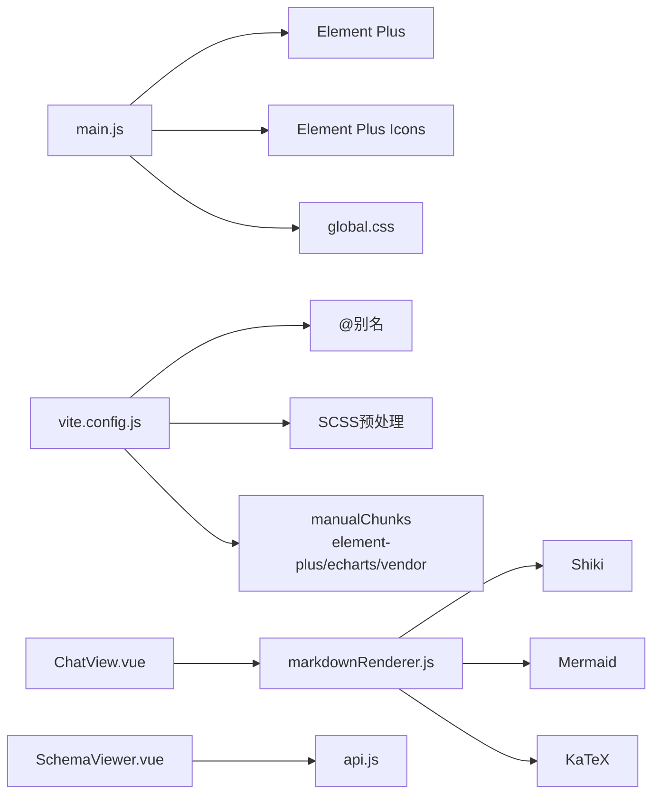

# 界面与样式

<cite>
**本文档引用的文件**
- [frontend/src/styles/global.css](file://frontend/src/styles/global.css)
- [frontend/src/main.js](file://frontend/src/main.js)
- [frontend/package.json](file://frontend/package.json)
- [frontend/vite.config.js](file://frontend/vite.config.js)
- [frontend/src/App.vue](file://frontend/src/App.vue)
- [frontend/src/views/HomeView.vue](file://frontend/src/views/HomeView.vue)
- [frontend/src/views/ChatView.vue](file://frontend/src/views/ChatView.vue)
- [frontend/src/components/SchemaViewer.vue](file://frontend/src/components/SchemaViewer.vue)
- [frontend/src/utils/markdownRenderer.js](file://frontend/src/utils/markdownRenderer.js)
- [frontend/src/utils/api.js](file://frontend/src/utils/api.js)
</cite>

## 目录
1. [简介](#简介)
2. [项目结构](#项目结构)
3. [核心组件](#核心组件)
4. [架构总览](#架构总览)
5. [详细组件分析](#详细组件分析)
6. [依赖分析](#依赖分析)
7. [性能考量](#性能考量)
8. [故障排查指南](#故障排查指南)
9. [结论](#结论)
10. [附录](#附录)

## 简介
本文件面向 NL2SQL 前端界面与样式系统，围绕基于 Element Plus 的 UI 组件库使用与自定义样式设计展开，系统阐述全局样式组织、CSS 变量与主题定制、响应式布局与移动端适配、组件样式封装与 scoped CSS、以及与第三方库（如 Markdown、KaTeX、Mermaid、Shiki）的集成实践。文档同时提供主题定制指南、浏览器兼容性处理、性能优化与可访问性建议。

## 项目结构
前端采用 Vue 3 + Vite 架构，样式体系以全局样式为主，结合各页面与组件的 scoped 样式实现局部隔离；Element Plus 作为主要 UI 组件库，配合 Vite 的 SCSS 预处理能力与手动分包策略，实现主题变量注入与体积优化。

**图表来源**
- [frontend/src/main.js:1-89](file://frontend/src/main.js#L1-L89)
- [frontend/vite.config.js:1-93](file://frontend/vite.config.js#L1-L93)
- [frontend/src/styles/global.css:1-317](file://frontend/src/styles/global.css#L1-L317)
- [frontend/src/App.vue:1-384](file://frontend/src/App.vue#L1-L384)
- [frontend/src/views/HomeView.vue:1-318](file://frontend/src/views/HomeView.vue#L1-L318)
- [frontend/src/views/ChatView.vue:1-778](file://frontend/src/views/ChatView.vue#L1-L778)
- [frontend/src/components/SchemaViewer.vue:1-317](file://frontend/src/components/SchemaViewer.vue#L1-L317)
- [frontend/src/utils/markdownRenderer.js:1-258](file://frontend/src/utils/markdownRenderer.js#L1-L258)
- [frontend/src/utils/api.js:1-303](file://frontend/src/utils/api.js#L1-L303)

**章节来源**
- [frontend/src/main.js:1-89](file://frontend/src/main.js#L1-L89)
- [frontend/vite.config.js:1-93](file://frontend/vite.config.js#L1-L93)
- [frontend/src/styles/global.css:1-317](file://frontend/src/styles/global.css#L1-L317)

## 核心组件
- 全局样式与主题
  - 基础重置与通用工具类（文本对齐、Flex、间距、显示、光标）
  - Element Plus 自定义主题（消息气泡、代码块、SQL 高亮）
  - 动画（淡入、滑入、旋转）
  - 响应式（移动端侧边栏抽屉）
- 应用根组件与布局
  - 侧边栏（Logo、新建会话、历史会话列表、底部工具栏）
  - 主内容区（路由视图）
  - Schema 查看弹窗
- 页面与组件样式
  - 首页：特性卡片网格、示例列表交互
  - 聊天页：消息气泡、Markdown 渲染、SQL 代码块、数据表格、处理态指示器
  - Schema 查看：搜索、骨架屏、折叠面板、表关系标签
- 工具与集成
  - Markdown 渲染（markdown-it）、KaTeX 数学公式、Mermaid 图表、Shiki 代码高亮
  - Axios 封装与拦截器、SSE 查询提交

**章节来源**
- [frontend/src/styles/global.css:1-317](file://frontend/src/styles/global.css#L1-L317)
- [frontend/src/App.vue:1-384](file://frontend/src/App.vue#L1-L384)
- [frontend/src/views/HomeView.vue:1-318](file://frontend/src/views/HomeView.vue#L1-L318)
- [frontend/src/views/ChatView.vue:1-778](file://frontend/src/views/ChatView.vue#L1-L778)
- [frontend/src/components/SchemaViewer.vue:1-317](file://frontend/src/components/SchemaViewer.vue#L1-L317)
- [frontend/src/utils/markdownRenderer.js:1-258](file://frontend/src/utils/markdownRenderer.js#L1-L258)
- [frontend/src/utils/api.js:1-303](file://frontend/src/utils/api.js#L1-L303)

## 架构总览
样式与组件的协作关系如下：

**图表来源**
- [frontend/src/App.vue:1-384](file://frontend/src/App.vue#L1-L384)
- [frontend/src/views/HomeView.vue:1-318](file://frontend/src/views/HomeView.vue#L1-L318)
- [frontend/src/views/ChatView.vue:1-778](file://frontend/src/views/ChatView.vue#L1-L778)
- [frontend/src/components/SchemaViewer.vue:1-317](file://frontend/src/components/SchemaViewer.vue#L1-L317)
- [frontend/src/utils/markdownRenderer.js:1-258](file://frontend/src/utils/markdownRenderer.js#L1-L258)
- [frontend/src/utils/api.js:1-303](file://frontend/src/utils/api.js#L1-L303)

## 详细组件分析

### 全局样式与主题定制
- 基础重置与通用工具类
  - 盒模型统一为 border-box，移除默认 margin/padding，统一 HTML/BODY 字体、字号、行高、文字与背景色
  - 列表去样式、链接基础样式
  - Flex 工具类、间距工具类、显示与光标工具类
- Element Plus 自定义主题
  - 消息气泡：用户消息与助手消息不同背景与圆角策略
  - 代码块：背景、边框、圆角、字体与溢出处理
  - SQL 高亮：关键字、字符串、数字、注释的颜色区分
- 动画
  - 淡入、滑入、旋转（加载态）
- 响应式
  - 移动端侧边栏抽屉：fixed 定位 + transform 切换 open 状态

**图表来源**
- [frontend/src/styles/global.css:1-317](file://frontend/src/styles/global.css#L1-L317)

**章节来源**
- [frontend/src/styles/global.css:1-317](file://frontend/src/styles/global.css#L1-L317)

### 应用根组件与布局（App.vue）
- 布局容器：flex 布局，侧边栏宽度 260px，主内容区自适应
- 侧边栏：Logo、新建会话、历史会话列表、底部工具栏
- 响应式：collapsed 状态下宽度收缩至 64px
- 弹窗：Schema 查看组件 v-model 控制

**图表来源**
- [frontend/src/App.vue:1-384](file://frontend/src/App.vue#L1-L384)
- [frontend/src/components/SchemaViewer.vue:1-317](file://frontend/src/components/SchemaViewer.vue#L1-L317)

**章节来源**
- [frontend/src/App.vue:1-384](file://frontend/src/App.vue#L1-L384)

### 首页视图（HomeView.vue）
- 布局：欢迎区域、功能特性网格、使用示例列表
- 交互：快速开始按钮、查看 Schema、示例点击创建新会话
- 样式：卡片悬停阴影、图标颜色、网格自适应

**图表来源**
- [frontend/src/views/HomeView.vue:1-318](file://frontend/src/views/HomeView.vue#L1-L318)

**章节来源**
- [frontend/src/views/HomeView.vue:1-318](file://frontend/src/views/HomeView.vue#L1-L318)

### 聊天视图（ChatView.vue）
- 消息渲染：用户/助手消息气泡、长内容折叠与展开
- Markdown 渲染：标题、段落、代码、列表、引用、表格、链接、Mermaid、KaTeX
- SQL 高亮：Shiki 主题与代码块样式
- 数据表格：Element Plus 表格组件
- 处理态：打字动画、进度条、旋转加载
- 输入区域：Textarea + 发送按钮，Enter 发送、Shift+Enter 换行

**图表来源**
- [frontend/src/views/ChatView.vue:1-778](file://frontend/src/views/ChatView.vue#L1-L778)
- [frontend/src/utils/markdownRenderer.js:1-258](file://frontend/src/utils/markdownRenderer.js#L1-L258)
- [frontend/src/utils/api.js:1-303](file://frontend/src/utils/api.js#L1-L303)

**章节来源**
- [frontend/src/views/ChatView.vue:1-778](file://frontend/src/views/ChatView.vue#L1-L778)
- [frontend/src/utils/markdownRenderer.js:1-258](file://frontend/src/utils/markdownRenderer.js#L1-L258)
- [frontend/src/utils/api.js:1-303](file://frontend/src/utils/api.js#L1-L303)

### Schema 查看组件（SchemaViewer.vue）
- 弹窗：宽度 800px，v-model 控制
- 搜索：实时过滤表/字段/描述
- 内容：骨架屏加载、空状态、折叠面板、字段表、关系标签
- 数据：API 拉取，首次打开时加载

**图表来源**
- [frontend/src/components/SchemaViewer.vue:1-317](file://frontend/src/components/SchemaViewer.vue#L1-L317)
- [frontend/src/utils/api.js:1-303](file://frontend/src/utils/api.js#L1-L303)

**章节来源**
- [frontend/src/components/SchemaViewer.vue:1-317](file://frontend/src/components/SchemaViewer.vue#L1-L317)
- [frontend/src/utils/api.js:1-303](file://frontend/src/utils/api.js#L1-L303)

## 依赖分析
- Element Plus
  - 组件库与 CSS：在入口中引入 Element Plus 并注册全局图标
  - 主题变量：通过 SCSS 自动导入 Element Plus 变量，便于覆盖
- 第三方渲染库
  - markdown-it、Shiki、Mermaid、KaTeX：在聊天页与 Markdown 渲染工具中使用
- 构建与分包
  - Vite 路径别名、插件、SCSS 预处理
  - 代码分割：Element Plus、ECharts、第三方库独立 chunk

**图表来源**
- [frontend/src/main.js:1-89](file://frontend/src/main.js#L1-L89)
- [frontend/vite.config.js:1-93](file://frontend/vite.config.js#L1-L93)
- [frontend/src/views/ChatView.vue:1-778](file://frontend/src/views/ChatView.vue#L1-L778)
- [frontend/src/utils/markdownRenderer.js:1-258](file://frontend/src/utils/markdownRenderer.js#L1-L258)
- [frontend/src/components/SchemaViewer.vue:1-317](file://frontend/src/components/SchemaViewer.vue#L1-L317)
- [frontend/src/utils/api.js:1-303](file://frontend/src/utils/api.js#L1-L303)

**章节来源**
- [frontend/src/main.js:1-89](file://frontend/src/main.js#L1-L89)
- [frontend/package.json:1-36](file://frontend/package.json#L1-L36)
- [frontend/vite.config.js:1-93](file://frontend/vite.config.js#L1-L93)

## 性能考量
- 代码分割
  - 将 Element Plus、ECharts、Vue 生态库拆分为独立 chunk，减少首屏体积
- 懒加载与异步初始化
  - Shiki 高亮器按需初始化，避免阻塞首屏
- 渲染优化
  - 聊天页消息列表使用虚拟滚动思想（容器滚动到底部），避免大列表重排
  - Markdown 渲染后延时触发 Mermaid 渲染，降低主线程压力
- 样式体积
  - 全局样式集中管理，避免重复定义；Element Plus CSS 按需引入（入口已引入）

**章节来源**
- [frontend/vite.config.js:70-91](file://frontend/vite.config.js#L70-L91)
- [frontend/src/utils/markdownRenderer.js:46-68](file://frontend/src/utils/markdownRenderer.js#L46-L68)
- [frontend/src/views/ChatView.vue:190-210](file://frontend/src/views/ChatView.vue#L190-L210)

## 故障排查指南
- 样式未生效
  - 确认全局样式已在入口正确引入
  - scoped 样式优先级高于全局，必要时使用深度选择器或 !important（谨慎）
- Element Plus 主题变量不生效
  - 检查 SCSS 预处理配置是否正确注入变量
- Markdown/代码高亮异常
  - Shiki 初始化失败时回退到简单高亮；检查主题与语言注册
  - Mermaid 渲染失败时记录错误并降级显示
- API 请求失败
  - Axios 拦截器统一处理错误，检查网络与后端接口状态
- 移动端侧边栏无法打开
  - 检查移动端媒体查询与 open 类名切换逻辑

**章节来源**
- [frontend/src/main.js:37-50](file://frontend/src/main.js#L37-L50)
- [frontend/vite.config.js:60-69](file://frontend/vite.config.js#L60-L69)
- [frontend/src/utils/markdownRenderer.js:156-170](file://frontend/src/utils/markdownRenderer.js#L156-L170)
- [frontend/src/utils/api.js:67-88](file://frontend/src/utils/api.js#L67-L88)
- [frontend/src/styles/global.css:304-316](file://frontend/src/styles/global.css#L304-L316)

## 结论
NL2SQL 前端样式系统以 Element Plus 为核心，结合全局样式与组件 scoped 样式实现清晰的层次化设计；通过 Vite 的 SCSS 预处理与手动分包策略，在保证主题一致性的同时兼顾性能。Markdown、KaTeX、Mermaid、Shiki 的集成为内容呈现提供了丰富能力。建议在后续迭代中进一步完善暗色主题变量、可访问性标签与键盘导航，并持续监控第三方库的体积与兼容性。

## 附录

### 主题定制指南（颜色、字体、间距）
- 颜色系统
  - 基础主色：蓝色系（用于按钮、高亮、图标）
  - 文案色：深灰（正文）、浅灰（辅助）、浅红（危险）
  - 背景色：白色（内容区）、浅灰（侧边栏/卡片）
- 字体规范
  - 基础字体族：系统字体栈，保证跨平台一致性
  - 字号：标题层级与正文字号保持递进关系
- 间距标准
  - 间距步进：4/8/12/16/24 等像素步进，统一使用工具类
- 动画与过渡
  - 统一使用缓动曲线，避免过长动画影响性能

**章节来源**
- [frontend/src/styles/global.css:35-50](file://frontend/src/styles/global.css#L35-L50)
- [frontend/src/styles/global.css:145-169](file://frontend/src/styles/global.css#L145-L169)
- [frontend/src/App.vue:250-271](file://frontend/src/App.vue#L250-L271)

### 响应式与移动端适配
- 移动端策略
  - 侧边栏改为抽屉式，使用 fixed 定位与 transform 切换
  - 触摸友好的按钮尺寸与间距
- 断点与布局
  - 基于 768px 的媒体查询，侧边栏在窄屏下隐藏并可抽屉打开
  - 页面网格与列表在窄屏下自适应列数与间距

**章节来源**
- [frontend/src/styles/global.css:304-316](file://frontend/src/styles/global.css#L304-L316)
- [frontend/src/views/HomeView.vue:249-254](file://frontend/src/views/HomeView.vue#L249-L254)

### 浏览器兼容性与可访问性
- 浏览器兼容性
  - 使用 Webkit 滚动条样式，针对现代浏览器；可扩展至更广泛的滚动条样式
  - 代码高亮与图表渲染依赖现代浏览器特性，注意降级提示
- 可访问性
  - 为交互元素提供焦点可见性与键盘可达性
  - 为图片与图标提供替代文本或标题属性
  - 为表单控件提供清晰的标签与错误提示

**章节来源**
- [frontend/src/styles/global.css:79-96](file://frontend/src/styles/global.css#L79-L96)
- [frontend/src/views/ChatView.vue:106-124](file://frontend/src/views/ChatView.vue#L106-L124)