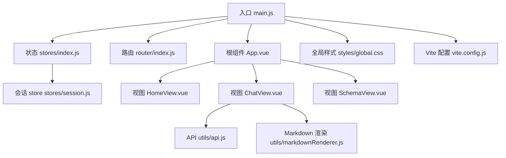
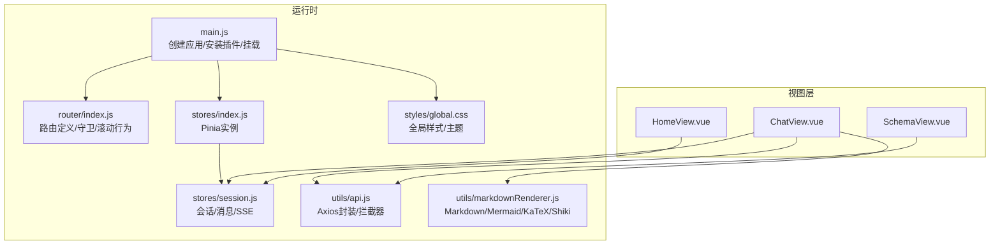
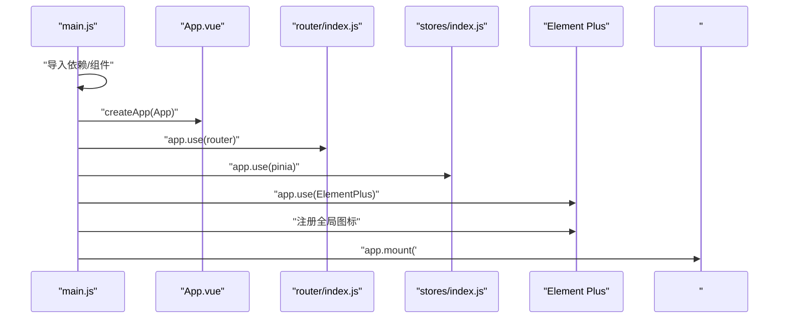
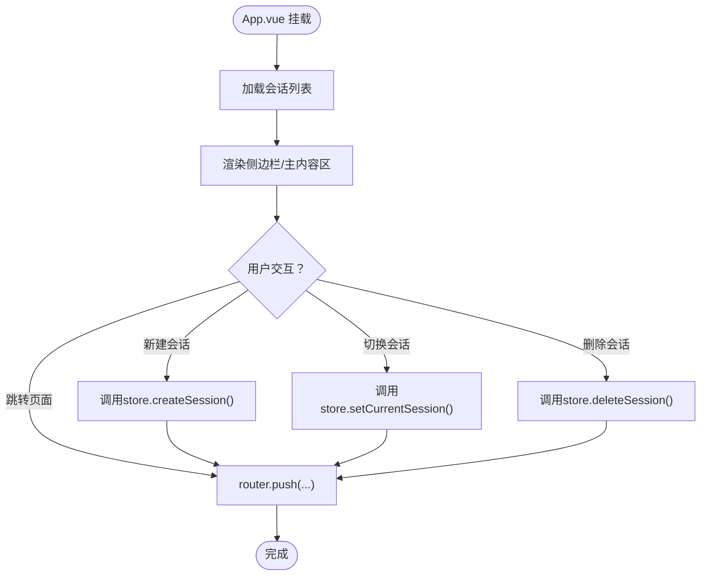
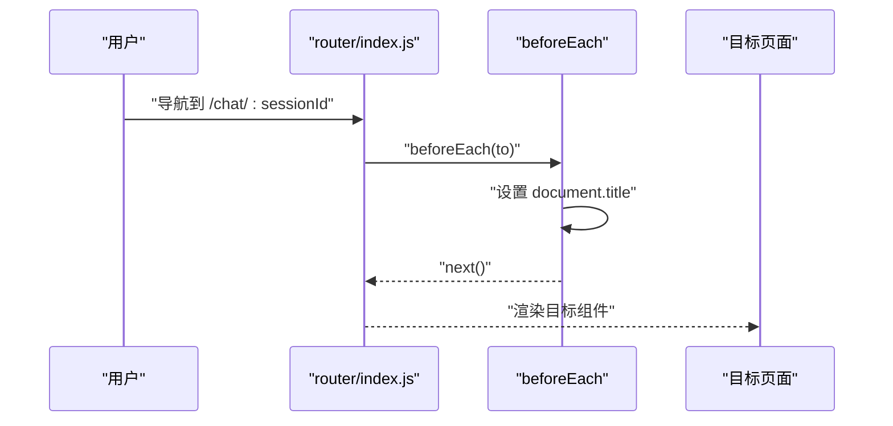
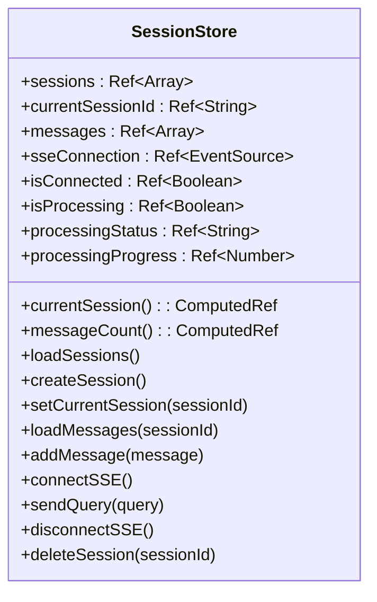
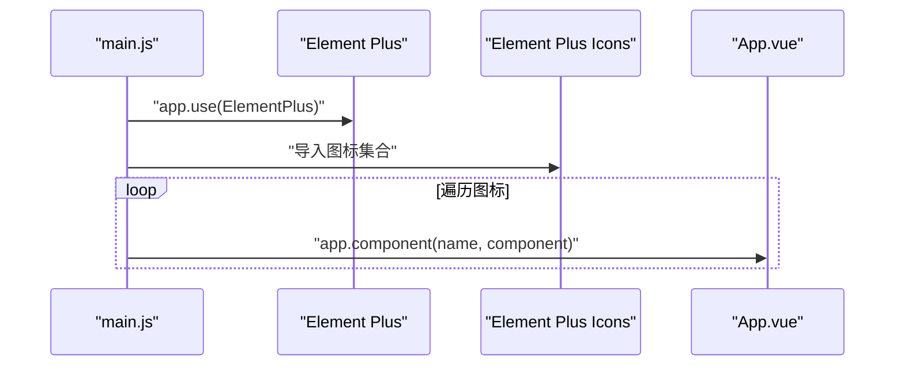
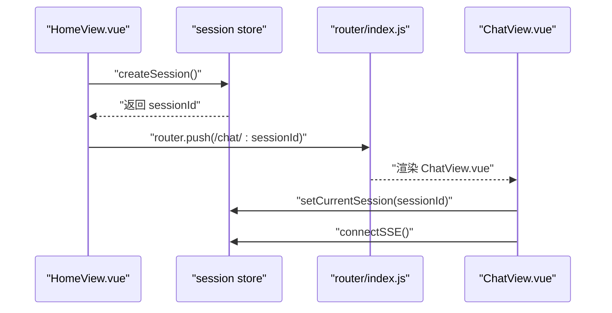
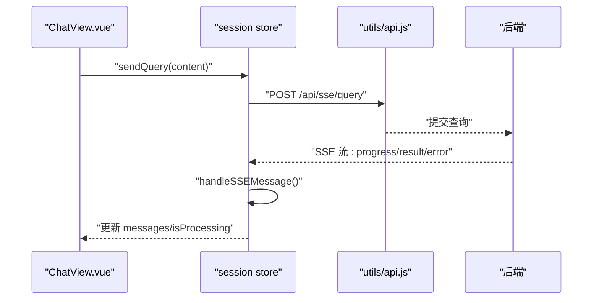
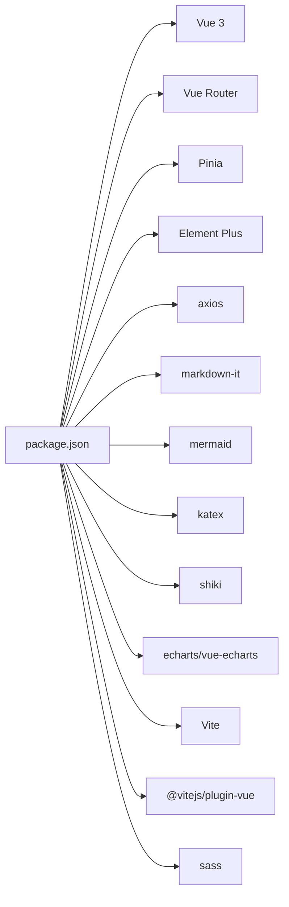

# 组件架构

<cite>
**本文引用的文件**
- [main.js](file://frontend/src/main.js)
- [App.vue](file://frontend/src/App.vue)
- [router/index.js](file://frontend/src/router/index.js)
- [stores/index.js](file://frontend/src/stores/index.js)
- [stores/session.js](file://frontend/src/stores/session.js)
- [utils/api.js](file://frontend/src/utils/api.js)
- [views/HomeView.vue](file://frontend/src/views/HomeView.vue)
- [views/ChatView.vue](file://frontend/src/views/ChatView.vue)
- [views/SchemaView.vue](file://frontend/src/views/SchemaView.vue)
- [utils/markdownRenderer.js](file://frontend/src/utils/markdownRenderer.js)
- [styles/global.css](file://frontend/src/styles/global.css)
- [vite.config.js](file://frontend/vite.config.js)
- [package.json](file://frontend/package.json)
</cite>

## 目录
1. [简介](#简介)
2. [项目结构](#项目结构)
3. [核心组件](#核心组件)
4. [架构总览](#架构总览)
5. [详细组件分析](#详细组件分析)
6. [依赖分析](#依赖分析)
7. [性能考虑](#性能考虑)
8. [故障排查指南](#故障排查指南)
9. [结论](#结论)
10. [附录](#附录)

## 简介
本文件面向NL2SQL前端组件架构，系统化梳理Vue 3应用的入口初始化、根组件结构、路由体系、状态管理、插件与UI集成、全局组件注册与图标系统、以及组件开发最佳实践。文档同时给出关键流程的时序与类图，帮助不同技术背景的读者快速理解并高效维护系统。

## 项目结构
前端采用基于功能分层的目录组织：
- 入口与根组件：main.js、App.vue
- 路由：router/index.js
- 状态管理：stores/index.js、stores/session.js
- 视图页面：views 下的各页面组件
- 工具与渲染：utils 下的API封装与Markdown渲染
- 样式：styles/global.css
- 构建与开发：vite.config.js、package.json

**图表来源**
- [main.js:1-89](file://frontend/src/main.js#L1-L89)
- [App.vue:1-373](file://frontend/src/App.vue#L1-L373)
- [router/index.js:1-147](file://frontend/src/router/index.js#L1-L147)
- [stores/index.js:1-30](file://frontend/src/stores/index.js#L1-L30)
- [stores/session.js:1-398](file://frontend/src/stores/session.js#L1-L398)
- [utils/api.js:1-252](file://frontend/src/utils/api.js#L1-L252)
- [utils/markdownRenderer.js:1-258](file://frontend/src/utils/markdownRenderer.js#L1-L258)
- [styles/global.css:1-317](file://frontend/src/styles/global.css#L1-L317)
- [vite.config.js:1-93](file://frontend/vite.config.js#L1-L93)

**章节来源**
- [main.js:1-89](file://frontend/src/main.js#L1-L89)
- [vite.config.js:1-93](file://frontend/vite.config.js#L1-L93)
- [package.json:1-36](file://frontend/package.json#L1-L36)

## 核心组件
- 应用入口与初始化：负责创建Vue实例、安装路由、状态管理、UI库、注册全局组件与挂载DOM。
- 根组件：提供侧边栏导航、会话管理、主内容区与Schema弹窗。
- 路由系统：定义页面路由、懒加载、滚动行为与全局前置守卫。
- 状态管理：基于Pinia的会话store，集中管理会话列表、消息、SSE连接与处理状态。
- 插件与UI：Element Plus集成、图标全局注册、全局样式与主题。
- 工具链：axios封装API、Markdown渲染（含Mermaid/KaTeX/Shiki）。

**章节来源**
- [main.js:1-89](file://frontend/src/main.js#L1-L89)
- [App.vue:1-373](file://frontend/src/App.vue#L1-L373)
- [router/index.js:1-147](file://frontend/src/router/index.js#L1-L147)
- [stores/index.js:1-30](file://frontend/src/stores/index.js#L1-L30)
- [stores/session.js:1-398](file://frontend/src/stores/session.js#L1-L398)
- [utils/api.js:1-252](file://frontend/src/utils/api.js#L1-L252)
- [utils/markdownRenderer.js:1-258](file://frontend/src/utils/markdownRenderer.js#L1-L258)
- [styles/global.css:1-317](file://frontend/src/styles/global.css#L1-L317)

## 架构总览
应用采用“入口 -> 根组件 -> 路由 -> 视图 -> 状态/工具”的分层架构。根组件承载侧边栏与主内容区，通过路由视图切换页面；状态管理集中于Pinia，视图通过store与API交互；UI采用Element Plus，图标通过全局注册可用；Markdown渲染支持多格式与图表。

**图表来源**
- [main.js:1-89](file://frontend/src/main.js#L1-L89)
- [router/index.js:1-147](file://frontend/src/router/index.js#L1-L147)
- [stores/index.js:1-30](file://frontend/src/stores/index.js#L1-L30)
- [stores/session.js:1-398](file://frontend/src/stores/session.js#L1-L398)
- [utils/api.js:1-252](file://frontend/src/utils/api.js#L1-L252)
- [utils/markdownRenderer.js:1-258](file://frontend/src/utils/markdownRenderer.js#L1-L258)
- [styles/global.css:1-317](file://frontend/src/styles/global.css#L1-L317)

## 详细组件分析

### 应用入口与初始化（main.js）
- 创建Vue应用实例并引入根组件App.vue。
- 安装插件：路由、状态管理、UI库（Element Plus）。
- 注册全局组件：遍历Element Plus图标并注册为全局组件，便于在任意组件中直接使用。
- 引入全局样式与挂载DOM。

**图表来源**
- [main.js:1-89](file://frontend/src/main.js#L1-L89)

**章节来源**
- [main.js:1-89](file://frontend/src/main.js#L1-L89)

### 根组件（App.vue）
- 结构：侧边栏（Logo、新建会话、历史会话列表、底部工具）、主内容区（router-view）、Schema查看弹窗。
- 状态：侧边栏展开/收起、Schema弹窗开关。
- 会话管理：通过Pinia的会话store获取会话列表与当前会话ID，提供创建、切换、删除会话的交互。
- 导航：点击侧边栏项或按钮跳转至相应页面（如长期记忆、Schema、聊天）。
- 生命周期：组件挂载时加载会话列表。

**图表来源**
- [App.vue:1-373](file://frontend/src/App.vue#L1-L373)
- [stores/session.js:1-398](file://frontend/src/stores/session.js#L1-L398)

**章节来源**
- [App.vue:1-373](file://frontend/src/App.vue#L1-L373)

### 路由系统（router/index.js）
- 路由定义：首页、聊天（带动态参数sessionId）、历史、Schema、内存、404。
- 懒加载：历史、Schema、内存页面按需加载，优化首屏体积。
- 滚动行为：返回顶部或恢复滚动位置。
- 全局前置守卫：设置页面标题（根据路由meta.title）。

**图表来源**
- [router/index.js:1-147](file://frontend/src/router/index.js#L1-L147)

**章节来源**
- [router/index.js:1-147](file://frontend/src/router/index.js#L1-L147)

### 状态管理（Pinia）
- Pinia实例：stores/index.js创建并导出。
- 会话store：stores/session.js定义，包含：
  - State：会话列表、当前会话ID、消息列表、SSE连接、连接状态、处理状态与进度。
  - Getters：当前会话、消息数量。
  - Actions：加载会话/消息、创建/切换/删除会话、连接SSE、发送查询、断开SSE、处理SSE消息。
- 与视图交互：ChatView通过store发送查询并接收SSE消息；App.vue通过store管理会话列表与当前会话。

**图表来源**
- [stores/session.js:1-398](file://frontend/src/stores/session.js#L1-L398)

**章节来源**
- [stores/index.js:1-30](file://frontend/src/stores/index.js#L1-L30)
- [stores/session.js:1-398](file://frontend/src/stores/session.js#L1-L398)

### 插件系统与UI集成（Element Plus）
- 安装：在main.js中安装Element Plus插件。
- 图标：导入Element Plus图标并在main.js中遍历注册为全局组件，可在任意模板中直接使用。
- 样式：引入Element Plus CSS与全局样式，配合Vite的SCSS额外导入实现主题变量复用。

**图表来源**
- [main.js:1-89](file://frontend/src/main.js#L1-L89)

**章节来源**
- [main.js:1-89](file://frontend/src/main.js#L1-L89)
- [styles/global.css:1-317](file://frontend/src/styles/global.css#L1-L317)
- [vite.config.js:1-93](file://frontend/vite.config.js#L1-L93)

### 全局组件注册与图标系统
- 全局组件：在main.js中遍历Element Plus图标并注册为全局组件，模板中可直接使用<el-icon-xxx>。
- 图标使用：根组件与各页面组件均通过@element-plus/icons-vue导入所需图标并使用。

**章节来源**
- [main.js:1-89](file://frontend/src/main.js#L1-L89)
- [App.vue:1-373](file://frontend/src/App.vue#L1-L373)

### 视图组件与页面导航
- 首页（HomeView.vue）：欢迎信息、功能特性、使用示例；提供“开始对话”和“查看Schema”入口，内部调用会话store创建会话并跳转聊天页。
- 聊天（ChatView.vue）：消息列表、输入区、处理状态与进度；通过store连接SSE并发送查询；监听路由参数变化以切换会话。
- Schema（SchemaView.vue）：展示表结构、指标、维度、表关系；提供刷新按钮与统计信息。

**图表来源**
- [views/HomeView.vue:1-318](file://frontend/src/views/HomeView.vue#L1-L318)
- [stores/session.js:1-398](file://frontend/src/stores/session.js#L1-L398)
- [router/index.js:1-147](file://frontend/src/router/index.js#L1-L147)
- [views/ChatView.vue:1-776](file://frontend/src/views/ChatView.vue#L1-L776)

**章节来源**
- [views/HomeView.vue:1-318](file://frontend/src/views/HomeView.vue#L1-L318)
- [views/ChatView.vue:1-776](file://frontend/src/views/ChatView.vue#L1-L776)
- [views/SchemaView.vue:1-322](file://frontend/src/views/SchemaView.vue#L1-L322)

### API封装与SSE集成（utils/api.js）
- Axios实例：baseURL为/api，统一超时与请求头。
- 拦截器：请求拦截（预留token注入）、响应拦截（统一错误处理）。
- 接口：健康检查、Schema、会话、查询历史、统计、配置、SSE查询提交。
- SSE：ChatView通过store调用sendQuery触发后端SSE流，store内部解析SSE消息并更新消息列表与处理状态。

**图表来源**
- [utils/api.js:1-252](file://frontend/src/utils/api.js#L1-L252)
- [stores/session.js:1-398](file://frontend/src/stores/session.js#L1-L398)
- [views/ChatView.vue:1-776](file://frontend/src/views/ChatView.vue#L1-L776)

**章节来源**
- [utils/api.js:1-252](file://frontend/src/utils/api.js#L1-L252)
- [stores/session.js:1-398](file://frontend/src/stores/session.js#L1-L398)

### Markdown渲染与富文本展示（utils/markdownRenderer.js）
- 集成：markdown-it、Mermaid、KaTeX、Shiki。
- 功能：渲染Markdown、数学公式（行内/块级）、Mermaid图表、SQL与其他代码高亮。
- ChatView通过renderMarkdown与renderSQL将消息内容与SQL代码渲染为HTML。

**章节来源**
- [utils/markdownRenderer.js:1-258](file://frontend/src/utils/markdownRenderer.js#L1-L258)
- [views/ChatView.vue:1-776](file://frontend/src/views/ChatView.vue#L1-L776)

## 依赖分析
- 运行时依赖：Vue 3、Vue Router、Pinia、Element Plus、axios、uuid、markdown-it、mermaid、katex、shiki、echarts、vue-echarts。
- 开发依赖：Vite、@vitejs/plugin-vue、sass。
- 构建策略：Vite配置路径别名、代理、CSS预处理、第三方库手动分包（element-plus、echarts、vendor）。

**图表来源**
- [package.json:1-36](file://frontend/package.json#L1-L36)
- [vite.config.js:1-93](file://frontend/vite.config.js#L1-L93)

**章节来源**
- [package.json:1-36](file://frontend/package.json#L1-L36)
- [vite.config.js:1-93](file://frontend/vite.config.js#L1-L93)

## 性能考虑
- 代码分割：Vite配置manualChunks将element-plus、echarts、vendor独立打包，减少首屏体积与重复依赖。
- 懒加载路由：历史、Schema、内存页面按需加载，降低初始加载压力。
- SSE长连接：store中统一管理EventSource，避免重复连接与资源泄漏。
- 渲染优化：ChatView使用虚拟滚动与自动滚动至底部，结合computed与watch减少不必要的重渲染。

[本节为通用指导，不直接分析具体文件]

## 故障排查指南
- 路由标题异常：检查router/index.js的beforeEach守卫是否正确设置meta.title。
- 会话无法切换：确认App.vue中调用setCurrentSession与router.push的顺序与sessionId有效性。
- SSE连接失败：检查store中connectSSE的URL与后端SSE端点，关注onerror回调与isConnected状态。
- Markdown渲染失败：确认utils/markdownRenderer.js中Mermaid初始化与Shiki高亮器加载状态。
- API错误：查看utils/api.js的响应拦截器，定位后端返回的错误信息并统一处理。

**章节来源**
- [router/index.js:1-147](file://frontend/src/router/index.js#L1-L147)
- [stores/session.js:1-398](file://frontend/src/stores/session.js#L1-L398)
- [utils/markdownRenderer.js:1-258](file://frontend/src/utils/markdownRenderer.js#L1-L258)
- [utils/api.js:1-252](file://frontend/src/utils/api.js#L1-L252)

## 结论
NL2SQL前端采用清晰的分层架构：入口负责初始化与插件安装，根组件承担导航与会话管理，路由系统提供页面导航与守卫，Pinia集中管理状态并与API/SSE深度集成，Element Plus提供丰富的UI能力与图标生态，Markdown渲染增强内容表达力。整体架构具备良好的扩展性与可维护性，适合持续演进。

[本节为总结性内容，不直接分析具体文件]

## 附录
- 最佳实践建议：
  - 组件开发遵循单一职责，尽量将UI与业务逻辑分离。
  - 使用Pinia的组合式store，利用computed与watch提升响应性能。
  - 路由懒加载与代码分割相结合，优化首屏加载。
  - 统一错误处理与日志记录，便于问题定位。
  - 图标与样式尽量通过全局注册与主题变量管理，保证一致性。

[本节为通用建议，不直接分析具体文件]