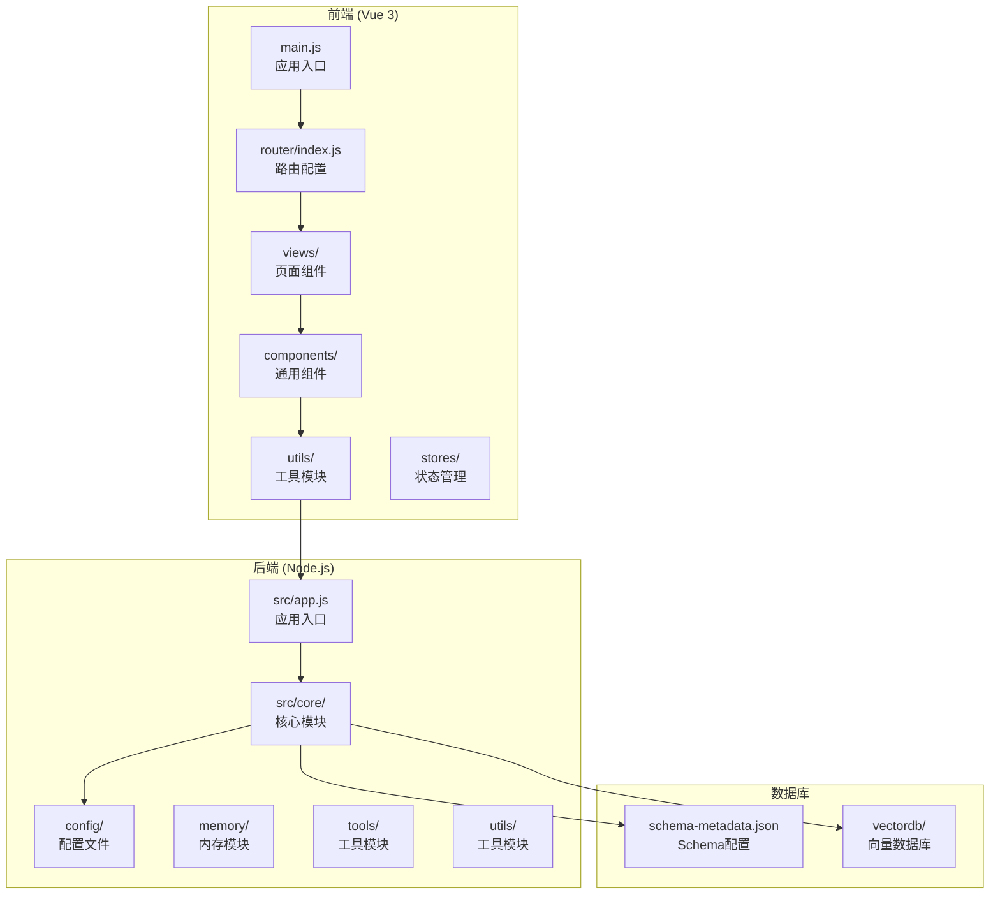
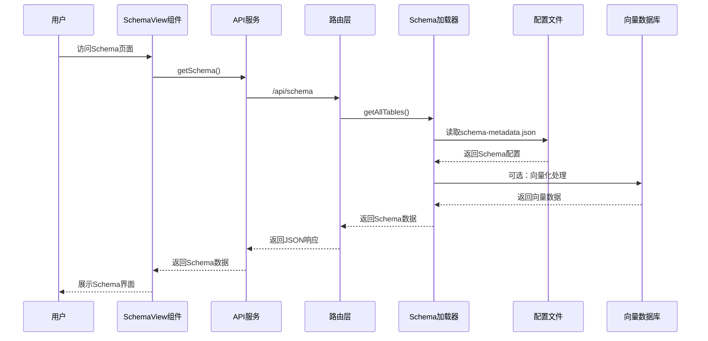
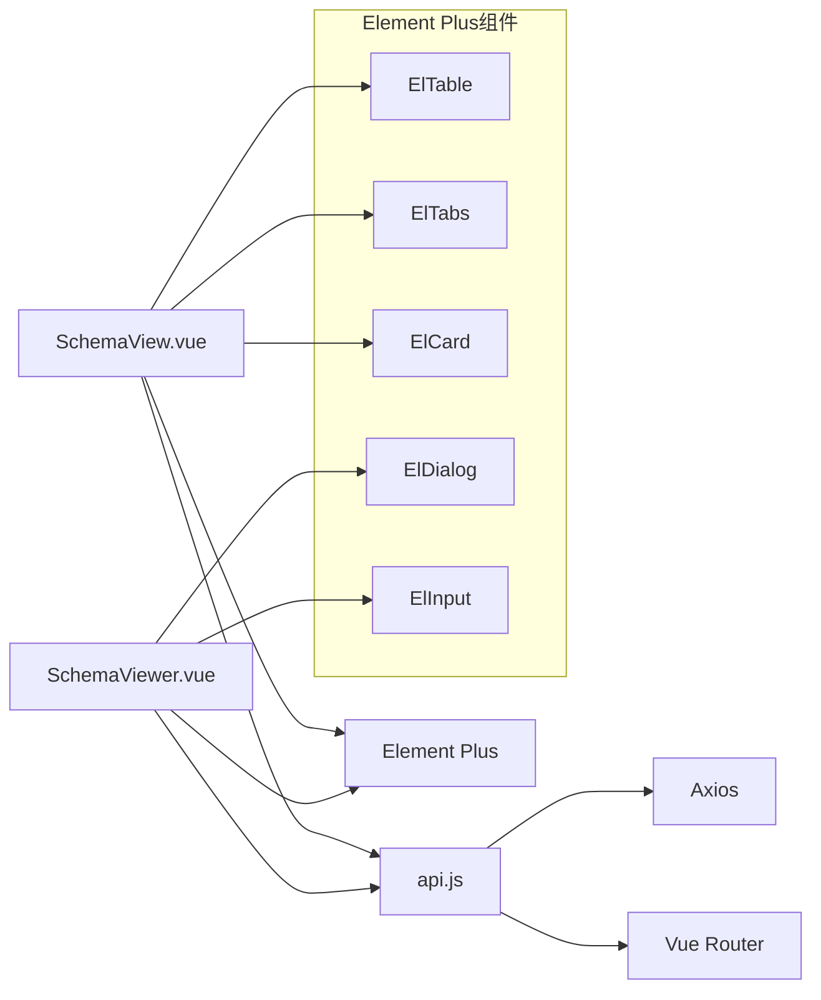
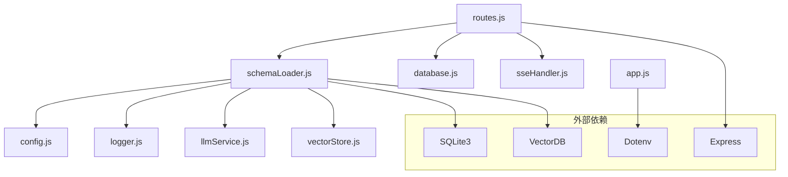

# Schema查看视图组件

<cite>
**本文档引用的文件**
- [SchemaView.vue](file://frontend/src/views/SchemaView.vue)
- [SchemaViewer.vue](file://frontend/src/components/SchemaViewer.vue)
- [api.js](file://frontend/src/utils/api.js)
- [routes.js](file://backend/src/core/routes.js)
- [schemaLoader.js](file://backend/src/core/schemaLoader.js)
- [schemaTools.js](file://backend/src/core/schemaTools.js)
- [schema-metadata.json](file://backend/config/schema-metadata.json)
- [config.js](file://backend/src/core/config.js)
- [app.js](file://backend/src/app.js)
- [main.js](file://frontend/src/main.js)
- [index.js](file://frontend/src/router/index.js)
</cite>

## 目录
1. [简介](#简介)
2. [项目结构](#项目结构)
3. [核心组件](#核心组件)
4. [架构概览](#架构概览)
5. [详细组件分析](#详细组件分析)
6. [依赖分析](#依赖分析)
7. [性能考虑](#性能考虑)
8. [故障排除指南](#故障排除指南)
9. [结论](#结论)
10. [附录](#附录)

## 简介

Schema查看视图组件是NL2SQL项目中的核心数据字典展示模块，负责以直观的方式呈现数据库Schema结构信息。该组件提供了两种展示形式：完整的Schema页面和弹窗式的Schema查看器，支持表结构可视化、字段信息展示、关系图谱绘制等功能。

该项目采用前后端分离架构，前端使用Vue 3 + Element Plus构建用户界面，后端基于Node.js + Express提供RESTful API服务。Schema数据来源于配置文件，经过向量化处理后支持语义搜索和智能推荐。

## 项目结构

NL2SQL项目采用标准的前后端分离架构，主要目录结构如下：



**图表来源**
- [main.js:1-89](file://frontend/src/main.js#L1-L89)
- [app.js:1-260](file://backend/src/app.js#L1-L260)

**章节来源**
- [main.js:1-89](file://frontend/src/main.js#L1-L89)
- [app.js:1-260](file://backend/src/app.js#L1-L260)

## 核心组件

### SchemaView组件（完整页面）

SchemaView组件提供完整的Schema数据展示页面，包含以下核心功能：

- **多标签页布局**：表结构、指标、维度、关系四个标签页
- **响应式表格**：使用Element Plus的表格组件展示数据
- **实时统计**：显示表数量、指标数量、维度数量
- **刷新机制**：支持手动刷新Schema数据

### SchemaViewer组件（弹窗组件）

SchemaViewer组件以弹窗形式提供Schema查看功能：

- **搜索功能**：支持按表名、字段名、描述搜索
- **折叠面板**：按表展开/折叠展示字段详情
- **关联关系**：显示表之间的关联关系
- **懒加载**：弹窗打开时才加载Schema数据

**章节来源**
- [SchemaView.vue:1-322](file://frontend/src/views/SchemaView.vue#L1-L322)
- [SchemaViewer.vue:1-317](file://frontend/src/components/SchemaViewer.vue#L1-L317)

## 架构概览

Schema查看视图组件的整体架构采用分层设计，从前端到后端的数据流向清晰：



**图表来源**
- [routes.js:140-186](file://backend/src/core/routes.js#L140-L186)
- [schemaLoader.js:69-122](file://backend/src/core/schemaLoader.js#L69-L122)
- [api.js:118-120](file://frontend/src/utils/api.js#L118-L120)

**章节来源**
- [routes.js:140-186](file://backend/src/core/routes.js#L140-L186)
- [schemaLoader.js:69-122](file://backend/src/core/schemaLoader.js#L69-L122)

## 详细组件分析

### SchemaView组件详细分析

SchemaView组件是一个完整的Schema展示页面，具有以下特点：

#### 数据结构设计

组件使用响应式数据结构存储Schema信息：

```javascript
const schemaData = ref({
  tables: [],
  relationships: [],
  metrics: [],
  dimensions: []
})
```

#### 标签页功能

组件包含四个主要标签页：

1. **表结构标签页**：展示所有表的详细字段信息
2. **指标标签页**：展示业务指标定义
3. **维度标签页**：展示维度字段和粒度信息
4. **关系标签页**：展示表之间的关系图谱

#### 表格渲染策略

每个标签页使用不同的渲染策略：

- **表结构**：使用Element Plus卡片和表格组件
- **指标**：展示指标定义和描述
- **维度**：展示字段集合和粒度标签
- **关系**：展示表间关系和类型

**章节来源**
- [SchemaView.vue:148-201](file://frontend/src/views/SchemaView.vue#L148-L201)

### SchemaViewer组件详细分析

SchemaViewer组件是一个可复用的弹窗组件，提供更丰富的交互功能：

#### 搜索功能实现

组件实现了智能搜索功能：

```javascript
const filteredTables = computed(() => {
  if (!searchQuery.value.trim()) {
    return schemaData.value.tables
  }
  
  const query = searchQuery.value.toLowerCase()
  
  return schemaData.value.tables.filter(table => {
    // 搜索表名、中文名、描述
    // 搜索字段名、中文名
  })
})
```

#### 关联关系展示

组件能够智能展示表之间的关联关系：

```javascript
function getTableRelations(tableName) {
  return schemaData.value.relationships.filter(rel =>
    rel.from.startsWith(tableName) || rel.to.startsWith(tableName)
  )
}
```

#### 动态渲染策略

组件采用懒加载策略，只有在弹窗打开时才加载Schema数据：

```javascript
watch(visible, (newVal) => {
  if (newVal && schemaData.value.tables.length === 0) {
    loadSchema()
  }
})
```

**章节来源**
- [SchemaViewer.vue:89-257](file://frontend/src/components/SchemaViewer.vue#L89-L257)

### 后端API设计

后端提供完整的Schema查询API：

#### RESTful API端点

```javascript
// 获取完整Schema
router.get('/schema', (req, res) => {
  // 返回tables、metrics、dimensions
})

// 获取指定表详情
router.get('/schema/tables/:tableName', (req, res) => {
  // 返回表定义和关联表
})

// 搜索Schema
router.get('/schema/search', async (req, res) => {
  // 支持语义搜索和关键词匹配
})
```

#### Schema数据模型

后端Schema数据采用标准化的JSON格式：

```json
{
  "version": "1.0.0",
  "tables": [
    {
      "name": "tzpingtai_tz_sdk_log_pf_reg",
      "name_cn": "平台注册表",
      "description": "平台注册表...",
      "fields": [
        {
          "name": "sf_id",
          "name_cn": "唯一ID",
          "type": "BIGINT",
          "description": "雪花ID，全局唯一"
        }
      ]
    }
  ]
}
```

**章节来源**
- [routes.js:140-250](file://backend/src/core/routes.js#L140-L250)
- [schema-metadata.json:1-800](file://backend/config/schema-metadata.json#L1-L800)

### 数据库元数据管理

#### Schema加载流程

Schema数据加载采用多阶段处理：

1. **文件读取**：从schema-metadata.json读取配置
2. **数据验证**：验证Schema格式和完整性
3. **映射构建**：构建表名和字段名的快速查找映射
4. **向量化处理**：可选的向量数据库处理

#### 缓存策略

后端实现了多层次的缓存机制：

- **Schema缓存**：内存中的Schema数据缓存
- **向量缓存**：向量数据库中的向量缓存
- **索引缓存**：Level 1索引的缓存

#### 实时更新机制

Schema数据支持热更新：

```javascript
// 检查配置文件修改时间
// 如果文件被修改，重新加载Schema
// 支持增量更新，避免全量重新加载
```

**章节来源**
- [schemaLoader.js:69-122](file://backend/src/core/schemaLoader.js#L69-L122)
- [schemaTools.js:136-173](file://backend/src/core/schemaTools.js#L136-L173)

## 依赖分析

### 前端依赖关系



**图表来源**
- [SchemaView.vue:160-162](file://frontend/src/views/SchemaView.vue#L160-L162)
- [SchemaViewer.vue:100-103](file://frontend/src/components/SchemaViewer.vue#L100-L103)

### 后端依赖关系



**图表来源**
- [routes.js:16-30](file://backend/src/core/routes.js#L16-L30)
- [app.js:22-50](file://backend/src/app.js#L22-L50)

**章节来源**
- [SchemaView.vue:157-162](file://frontend/src/views/SchemaView.vue#L157-L162)
- [SchemaViewer.vue:98-103](file://frontend/src/components/SchemaViewer.vue#L98-L103)

## 性能考虑

### 前端性能优化

1. **虚拟滚动**：对于大量表的情况，可以考虑实现虚拟滚动
2. **懒加载**：组件已经实现了懒加载策略
3. **缓存机制**：利用浏览器缓存减少重复请求
4. **响应式设计**：适配不同屏幕尺寸

### 后端性能优化

1. **索引优化**：构建表名和字段名的快速查找映射
2. **向量化搜索**：使用向量数据库实现高效的语义搜索
3. **缓存策略**：多层缓存减少重复计算
4. **连接池管理**：合理配置数据库连接池

### 缓存策略

```javascript
// Schema缓存配置
const schemaCache = {
  enableCache: true,
  cacheExpireTime: 60 * 60 * 1000, // 1小时
  revectorize: false
}

// Level 1索引缓存
let level1IndexCache = null;
let level1IndexTimestamp = 0;
```

**章节来源**
- [config.js:240-250](file://backend/src/core/config.js#L240-L250)
- [schemaTools.js:154-173](file://backend/src/core/schemaTools.js#L154-L173)

## 故障排除指南

### 常见问题及解决方案

#### Schema数据加载失败

**问题症状**：
- 页面显示空白或错误提示
- 控制台出现加载错误

**排查步骤**：
1. 检查schema-metadata.json文件是否存在
2. 验证JSON格式是否正确
3. 检查文件权限设置
4. 查看后端日志获取详细错误信息

**解决方案**：
```javascript
// 前端错误处理
async function loadSchema() {
  try {
    const data = await api.getSchema()
    schemaData.value = data
  } catch (error) {
    console.error('加载Schema失败:', error)
    // 显示错误提示
  }
}
```

#### API请求超时

**问题症状**：
- 页面加载缓慢
- 请求超时错误

**解决方案**：
1. 检查网络连接
2. 增加请求超时时间
3. 优化后端性能
4. 实现重试机制

#### 向量搜索失败

**问题症状**：
- 语义搜索功能不可用
- 搜索结果不准确

**排查步骤**：
1. 检查向量数据库连接
2. 验证Embedding模型配置
3. 检查向量数据完整性
4. 查看向量存储状态

**章节来源**
- [api.js:72-87](file://frontend/src/utils/api.js#L72-L87)
- [schemaLoader.js:201-276](file://backend/src/core/schemaLoader.js#L201-L276)

## 结论

Schema查看视图组件是NL2SQL项目中重要的数据字典展示模块，具有以下特点：

1. **功能完整**：提供多种展示形式和交互功能
2. **性能优化**：采用缓存、懒加载等优化策略
3. **扩展性强**：模块化设计便于功能扩展
4. **用户体验良好**：响应式设计和直观的界面

该组件为NL2SQL项目提供了强大的Schema管理和数据字典功能，支持自然语言到SQL的转换过程，是整个系统的重要基础设施。

## 附录

### 开发指南

#### Schema管理最佳实践

1. **数据字典维护**
   - 定期更新schema-metadata.json文件
   - 保持字段描述的准确性
   - 统一命名规范

2. **权限控制**
   - 配置ALLOWED_TABLES白名单
   - 实施数据访问控制
   - 定期审计访问日志

3. **性能监控**
   - 监控Schema加载时间
   - 跟踪API响应性能
   - 监控向量数据库状态

#### 配置选项参考

| 配置项 | 默认值 | 说明 |
|--------|--------|------|
| SCHEMA_CONFIG_PATH | ./config/schema-metadata.json | Schema配置文件路径 |
| SCHEMA_REVECTORIZE | false | 是否强制重新向量化 |
| CACHE_EXPIRE_TIME | 3600000 | 缓存过期时间(毫秒) |
| MAX_QUERY_ROWS | 1000 | 查询结果最大行数 |