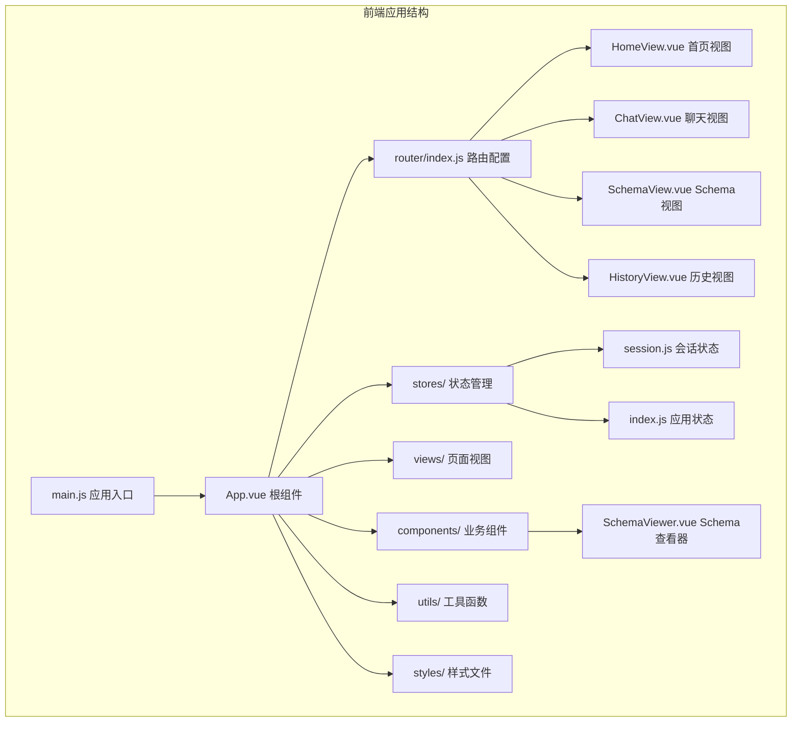
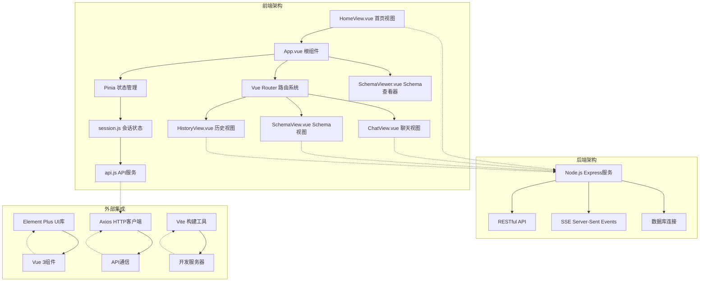
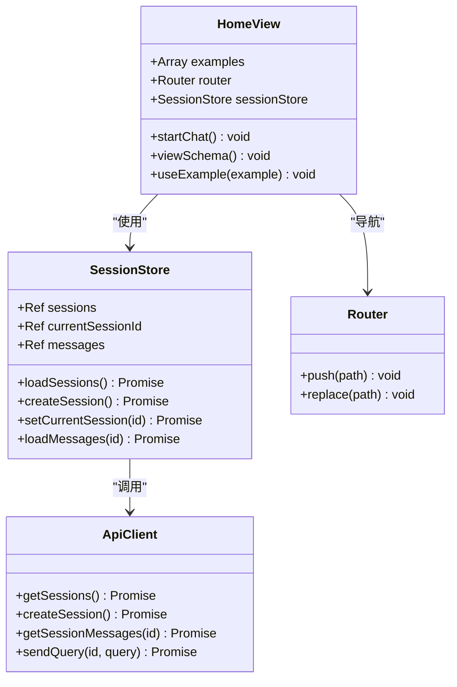
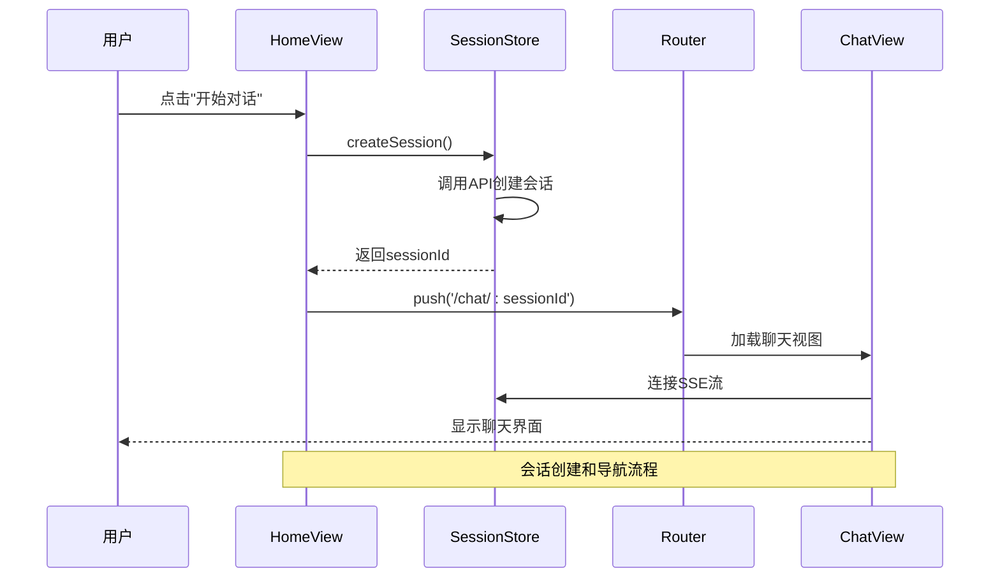
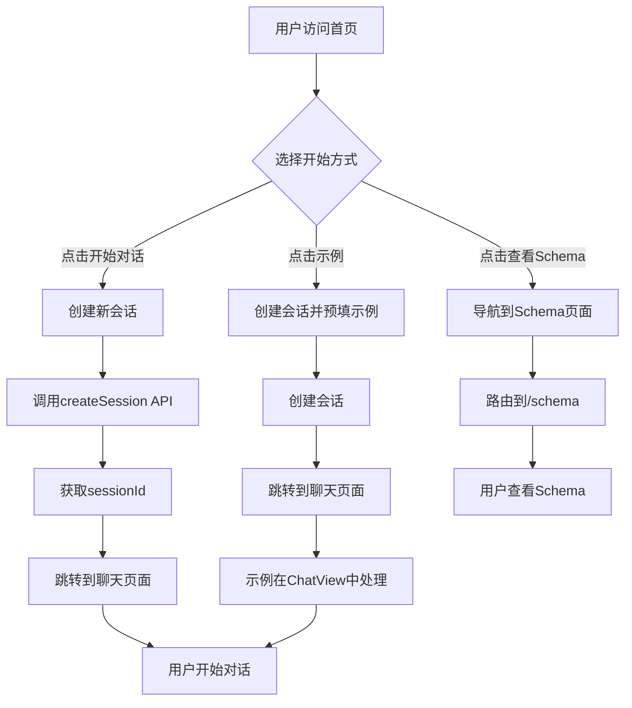

# 主页视图组件

<cite>
**本文档引用的文件**
- [HomeView.vue](file://frontend/src/views/HomeView.vue)
- [App.vue](file://frontend/src/App.vue)
- [main.js](file://frontend/src/main.js)
- [router/index.js](file://frontend/src/router/index.js)
- [stores/session.js](file://frontend/src/stores/session.js)
- [styles/global.css](file://frontend/src/styles/global.css)
- [utils/api.js](file://frontend/src/utils/api.js)
- [vite.config.js](file://frontend/vite.config.js)
- [package.json](file://frontend/package.json)
- [ChatView.vue](file://frontend/src/views/ChatView.vue)
- [SchemaViewer.vue](file://frontend/src/components/SchemaViewer.vue)
</cite>

## 目录
1. [简介](#简介)
2. [项目结构](#项目结构)
3. [核心组件](#核心组件)
4. [架构概览](#架构概览)
5. [详细组件分析](#详细组件分析)
6. [依赖分析](#依赖分析)
7. [性能考虑](#性能考虑)
8. [故障排除指南](#故障排除指南)
9. [结论](#结论)
10. [附录](#附录)

## 简介
NL2SQL主页视图组件是应用的入口页面，采用现代化的单页应用架构设计。该组件实现了完整的用户引导流程，包括欢迎信息展示、功能特性介绍、快速开始入口和使用示例引导。通过响应式布局设计和Element Plus UI组件库，为主用户提供直观易用的交互体验。

## 项目结构
前端项目采用Vue 3 Composition API + Pinia状态管理 + Element Plus UI组件库的现代技术栈。项目结构清晰，采用按功能模块划分的方式组织代码。



**图表来源**
- [main.js:1-89](file://frontend/src/main.js#L1-L89)
- [App.vue:1-384](file://frontend/src/App.vue#L1-L384)
- [router/index.js:1-157](file://frontend/src/router/index.js#L1-L157)

**章节来源**
- [main.js:1-89](file://frontend/src/main.js#L1-L89)
- [package.json:1-36](file://frontend/package.json#L1-L36)

## 核心组件
HomeView作为应用的入口页面，承担着用户引导和功能导航的核心职责。该组件通过精心设计的信息架构，帮助用户快速了解NL2SQL的功能价值并开始使用。

### 设计理念
- **简洁直观**：采用极简设计风格，突出核心功能
- **用户导向**：以用户需求为中心，提供清晰的操作路径
- **响应式优先**：确保在各种设备上的良好体验
- **渐进式引导**：通过功能特性介绍和示例引导用户

### 功能布局
组件采用垂直分层的信息架构，从上到下依次为欢迎区域、功能特性展示、使用示例三个主要部分。

**章节来源**
- [HomeView.vue:1-318](file://frontend/src/views/HomeView.vue#L1-L318)

## 架构概览
NL2SQL采用前后端分离的架构设计，前端使用Vue 3构建单页应用，后端提供RESTful API和Server-Sent Events实时通信。



**图表来源**
- [HomeView.vue:95-188](file://frontend/src/views/HomeView.vue#L95-L188)
- [App.vue:85-241](file://frontend/src/App.vue#L85-L241)
- [router/index.js:34-109](file://frontend/src/router/index.js#L34-L109)

## 详细组件分析

### HomeView组件架构
HomeView采用Vue 3的Composition API设计，结合Element Plus图标系统和响应式布局，实现了功能完善的主页视图。



**图表来源**
- [HomeView.vue:95-188](file://frontend/src/views/HomeView.vue#L95-L188)
- [stores/session.js:33-399](file://frontend/src/stores/session.js#L33-L399)

### 响应式布局实现
组件采用CSS Grid和Flexbox相结合的布局方案，确保在不同屏幕尺寸下的最佳显示效果。

```mermaid
flowchart TD
A[容器初始化] --> B{屏幕宽度检测}
B --> |>= 768px| C[桌面端布局]
B --> |< 768px| D[移动端布局]
C --> E[Grid布局<br/>auto-fit, minmax(240px, 1fr)]
D --> F[Flexbox垂直布局<br/>居中对齐]
E --> G[特性卡片网格]
F --> H[单列堆叠布局]
G --> I[最大宽度1000px]
H --> J[100%宽度]
I --> K[响应式间距调整]
J --> K
```

**图表来源**
- [HomeView.vue:248-254](file://frontend/src/views/HomeView.vue#L248-L254)
- [styles/global.css:304-316](file://frontend/src/styles/global.css#L304-L316)

### 导航菜单设计
主页集成了完整的应用导航体系，通过根组件App.vue实现侧边栏导航和主内容区的协调工作。



**图表来源**
- [HomeView.vue:153-163](file://frontend/src/views/HomeView.vue#L153-L163)
- [stores/session.js:118-138](file://frontend/src/stores/session.js#L118-L138)
- [router/index.js:51-58](file://frontend/src/router/index.js#L51-L58)

**章节来源**
- [HomeView.vue:153-187](file://frontend/src/views/HomeView.vue#L153-L187)
- [App.vue:176-228](file://frontend/src/App.vue#L176-L228)

### 快速开始引导功能
组件提供了三种快速开始方式：直接开始对话、查看数据Schema、使用示例模板。



**图表来源**
- [HomeView.vue:153-187](file://frontend/src/views/HomeView.vue#L153-L187)
- [router/index.js:72-79](file://frontend/src/router/index.js#L72-L79)

**章节来源**
- [HomeView.vue:129-134](file://frontend/src/views/HomeView.vue#L129-L134)
- [HomeView.vue:176-187](file://frontend/src/views/HomeView.vue#L176-L187)

### 样式设计原则
组件遵循统一的设计规范，采用Element Plus的主题色系和设计语言。

**章节来源**
- [HomeView.vue:190-317](file://frontend/src/views/HomeView.vue#L190-L317)
- [styles/global.css:184-295](file://frontend/src/styles/global.css#L184-L295)

## 依赖分析
前端应用的依赖关系清晰明确，各模块职责分离，耦合度低。

```mermaid
graph LR
subgraph "核心依赖"
A[Vue 3.3.8] --> B[Composition API]
C[Element Plus 2.4.4] --> D[UI组件库]
E[Vue Router 4.2.5] --> F[路由管理]
G[Pinia 2.1.7] --> H[状态管理]
end
subgraph "工具库"
I[Axios 1.6.2] --> J[HTTP客户端]
K[UUID 13.0.0] --> L[唯一标识符]
M[Day.js 1.11.10] --> N[日期处理]
end
subgraph "开发工具"
O[Vite 5.0.8] --> P[构建工具]
Q[@vitejs/plugin-vue] --> R[Vue支持]
S[Sass 1.69.5] --> T[CSS预处理器]
end
subgraph "业务相关"
U[Vue ECharts 6.6.1] --> V[图表展示]
W[Mermaid 11.14.0] --> X[流程图]
Y[Markdown-it 14.1.1] --> Z[Markdown渲染]
end
A --> E
A --> G
C --> D
I --> J
O --> P
```

**图表来源**
- [package.json:11-28](file://frontend/package.json#L11-L28)
- [vite.config.js:54-57](file://frontend/vite.config.js#L54-L57)

**章节来源**
- [package.json:1-36](file://frontend/package.json#L1-L36)
- [vite.config.js:1-93](file://frontend/vite.config.js#L1-L93)

## 性能考虑
基于当前实现，以下是一些性能优化建议：

### 代码分割和懒加载
- 路由级别的懒加载已在路由配置中实现
- 可进一步优化大型组件的动态导入

### 缓存策略
- 会话列表和Schema数据可添加缓存机制
- 图标组件已全局注册，避免重复导入

### 构建优化
- 第三方库已配置手动分块，减少重复依赖
- 生产环境关闭source map提升构建速度

**章节来源**
- [router/index.js:63-69](file://frontend/src/router/index.js#L63-L69)
- [vite.config.js:78-89](file://frontend/vite.config.js#L78-L89)

## 故障排除指南
常见问题及解决方案：

### 会话创建失败
- 检查后端API服务状态
- 验证网络连接和代理配置
- 查看浏览器控制台错误信息

### 路由导航异常
- 确认路由配置正确性
- 检查路由守卫逻辑
- 验证会话状态管理

### 样式显示问题
- 检查Element Plus样式导入
- 验证CSS作用域隔离
- 确认响应式媒体查询

**章节来源**
- [HomeView.vue:159-162](file://frontend/src/views/HomeView.vue#L159-L162)
- [App.vue:206-227](file://frontend/src/App.vue#L206-L227)
- [utils/api.js:72-87](file://frontend/src/utils/api.js#L72-L87)

## 结论
NL2SQL主页视图组件展现了现代前端开发的最佳实践，通过清晰的架构设计、合理的组件拆分和完善的用户体验设计，为用户提供了直观易用的入口页面。组件不仅实现了基本的功能需求，还为后续的功能扩展和性能优化奠定了良好的基础。

## 附录

### 开发示例
以下是一些实际的开发示例和最佳实践：

#### 自定义使用示例
```javascript
// 在HomeView中添加新的示例
const examples = [
  '查一下上个月的销售额',
  '各地区的订单数量对比',
  'VIP用户的平均消费金额',
  '最近7天的销售趋势',
  '新增示例：产品库存分析' // 自定义示例
]
```

#### 功能模块配置
```javascript
// 在router中添加新路由
{
  path: '/custom-page',
  name: 'custom',
  component: () => import('../views/CustomView.vue'),
  meta: {
    title: '自定义页面',
    requiresSession: false
  }
}
```

#### 主题切换扩展
```css
/* 在global.css中添加主题变量 */
:root {
  --primary-color: #409eff;
  --secondary-color: #67c23a;
  --background-color: #ffffff;
  --text-color: #303133;
}

[data-theme="dark"] {
  --primary-color: #64b5f6;
  --secondary-color: #81c784;
  --background-color: #1a1a1a;
  --text-color: #e0e0e0;
}
```

**章节来源**
- [HomeView.vue:129-134](file://frontend/src/views/HomeView.vue#L129-L134)
- [router/index.js:100-108](file://frontend/src/router/index.js#L100-L108)
- [styles/global.css:184-295](file://frontend/src/styles/global.css#L184-L295)