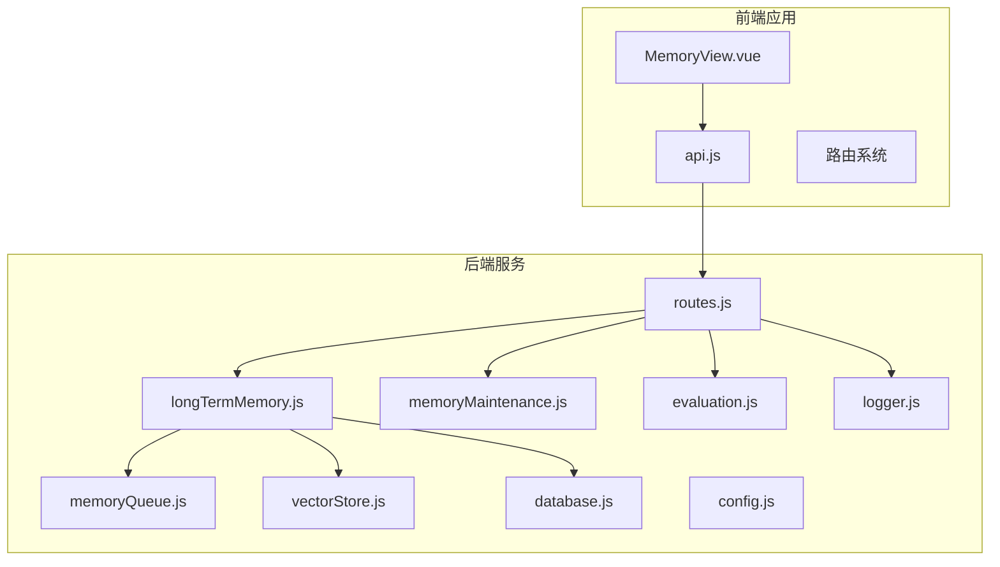
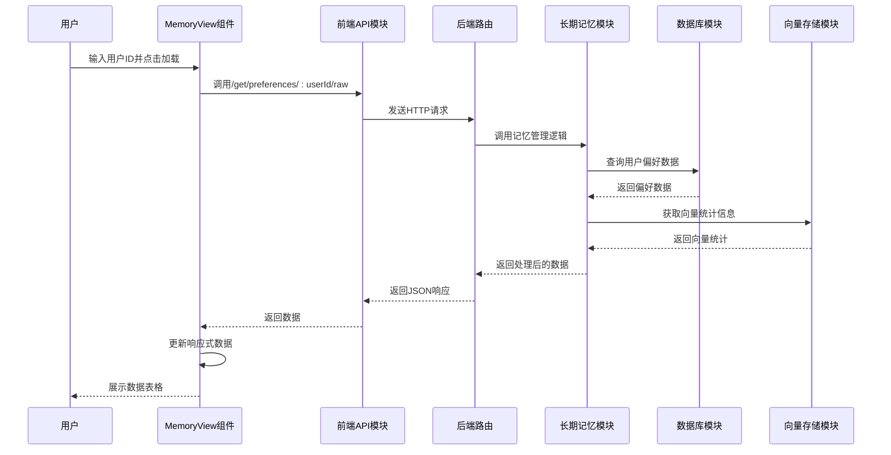
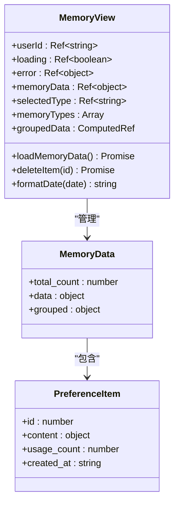
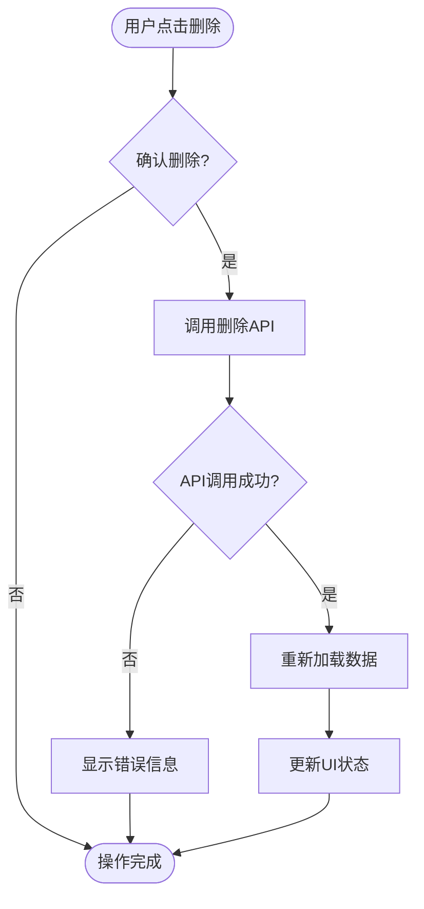
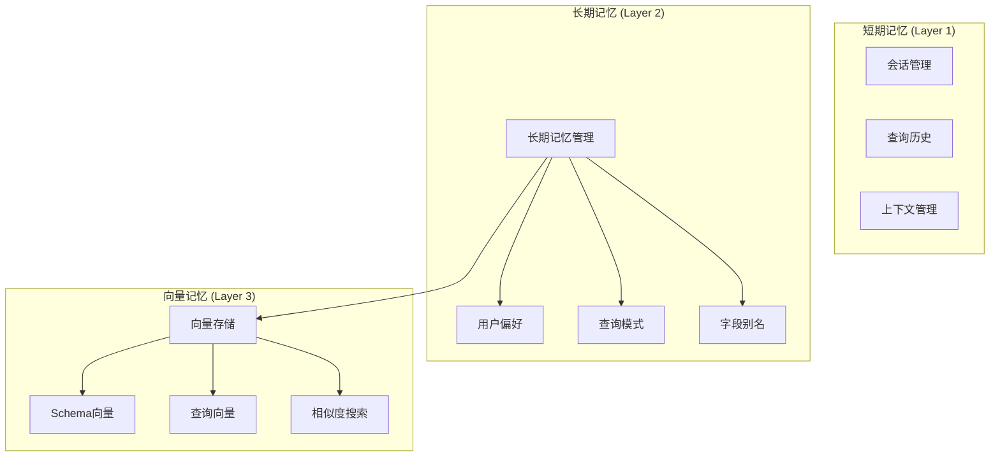
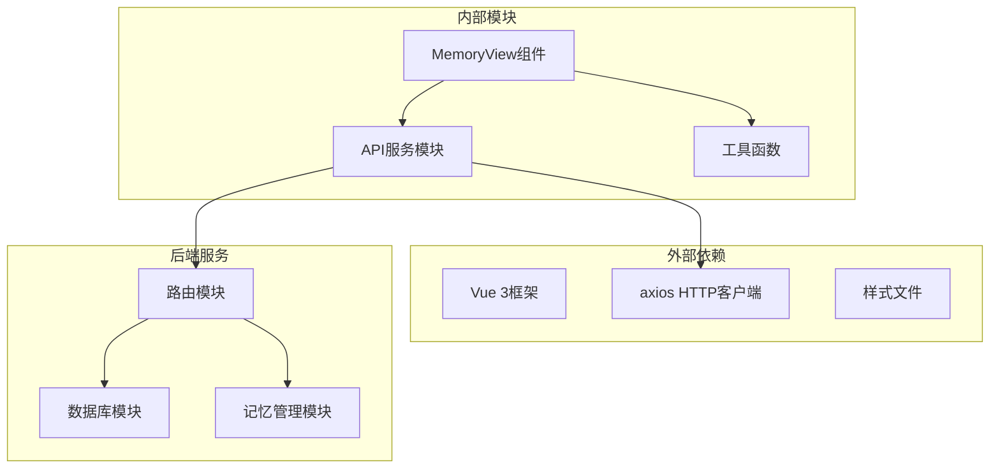

# 内存管理视图组件

<cite>
**本文档引用的文件**
- [MemoryView.vue](file://frontend/src/views/MemoryView.vue)
- [routes.js](file://backend/src/core/routes.js)
- [longTermMemory.js](file://backend/src/memory/longTermMemory.js)
- [memoryQueue.js](file://backend/src/memory/memoryQueue.js)
- [memoryMaintenance.js](file://backend/src/memory/memoryMaintenance.js)
- [vectorStore.js](file://backend/src/memory/vectorStore.js)
- [database.js](file://backend/src/core/database.js)
- [config.js](file://backend/src/core/config.js)
- [logger.js](file://backend/src/utils/logger.js)
- [evaluation.js](file://backend/src/utils/evaluation.js)
- [api.js](file://frontend/src/utils/api.js)
</cite>

## 目录
1. [简介](#简介)
2. [项目结构](#项目结构)
3. [核心组件](#核心组件)
4. [架构概览](#架构概览)
5. [详细组件分析](#详细组件分析)
6. [依赖关系分析](#依赖关系分析)
7. [性能考虑](#性能考虑)
8. [故障排查指南](#故障排查指南)
9. [结论](#结论)
10. [附录](#附录)

## 简介

MemoryView是NL2SQL项目中的内存管理视图组件，负责展示和管理三层记忆系统的可视化界面。该组件实现了长期记忆（Layer 2）的完整管理功能，包括：

- **短期记忆管理**：通过会话管理和查询历史接口实现
- **长期记忆管理**：通过用户偏好和查询模式管理实现  
- **向量记忆管理**：通过Schema向量和查询向量的可视化展示

MemoryView提供了直观的UI界面，支持用户偏好数据的实时查看、筛选、删除等操作，同时展示了记忆系统的统计信息和状态监控。

## 项目结构

NL2SQL项目采用前后端分离架构，MemoryView组件位于前端Vue应用中，后端提供RESTful API接口支持。

**图表来源**
- [MemoryView.vue:1-511](file://frontend/src/views/MemoryView.vue#L1-L511)
- [routes.js:1-1037](file://backend/src/core/routes.js#L1-L1037)

**章节来源**
- [MemoryView.vue:1-511](file://frontend/src/views/MemoryView.vue#L1-L511)
- [routes.js:1-1037](file://backend/src/core/routes.js#L1-L1037)

## 核心组件

MemoryView组件实现了完整的记忆管理系统UI，具有以下核心功能：

### 数据展示功能
- **统计卡片**：显示总记录数、字段别名、查询模式、常用指标、常用维度等关键指标
- **类型筛选**：支持按不同记忆类型进行数据筛选和展示
- **表格展示**：提供结构化的数据表格，支持字段别名映射、查询模式、指标偏好、维度偏好的可视化展示

### 用户交互功能
- **用户ID选择**：支持通过用户ID筛选和查看特定用户的记忆数据
- **实时加载**：支持动态加载和刷新记忆数据
- **删除操作**：提供安全的删除确认机制，支持单条记录删除

### 数据处理功能
- **分组展示**：将原始数据按类型进行智能分组
- **格式化显示**：提供日期格式化、类型标签美化等显示优化
- **JSON查看器**：提供原始JSON数据的查看功能

**章节来源**
- [MemoryView.vue:21-187](file://frontend/src/views/MemoryView.vue#L21-L187)
- [MemoryView.vue:191-254](file://frontend/src/views/MemoryView.vue#L191-L254)

## 架构概览

MemoryView组件采用MVVM架构模式，结合Vue 3的Composition API实现响应式数据绑定和组件化开发。

**图表来源**
- [MemoryView.vue:212-228](file://frontend/src/views/MemoryView.vue#L212-L228)
- [routes.js:456-517](file://backend/src/core/routes.js#L456-L517)
- [longTermMemory.js:313-471](file://backend/src/memory/longTermMemory.js#L313-L471)

## 详细组件分析

### MemoryView组件架构

**图表来源**
- [MemoryView.vue:191-254](file://frontend/src/views/MemoryView.vue#L191-L254)

#### 数据流分析

MemoryView组件的数据流遵循单向数据流原则：

1. **初始化阶段**：组件挂载时自动加载记忆数据
2. **用户交互**：用户通过输入框选择用户ID，点击加载按钮触发数据获取
3. **数据获取**：通过axios发起HTTP请求获取后端API数据
4. **数据处理**：后端返回的原始数据经过分组和格式化处理
5. **渲染展示**：处理后的数据通过Vue模板进行渲染展示

#### 删除操作流程

**图表来源**
- [MemoryView.vue:230-243](file://frontend/src/views/MemoryView.vue#L230-L243)

**章节来源**
- [MemoryView.vue:1-511](file://frontend/src/views/MemoryView.vue#L1-L511)

### 后端API集成

MemoryView组件通过RESTful API与后端服务进行数据交互，主要接口包括：

#### 用户偏好数据接口
- **GET /api/preferences/:userId/raw**：获取用户长期记忆原始数据
- **GET /api/preferences/:userId/stats**：获取用户记忆统计信息
- **DELETE /api/preferences/:preferenceId**：删除用户偏好记录

#### 记忆管理接口
- **GET /api/preferences/:userId**：获取用户偏好列表
- **POST /api/preferences/:userId/templates**：手动添加查询模板
- **POST /api/preferences/:userId/learn-alias**：手动学习字段别名

**章节来源**
- [routes.js:456-716](file://backend/src/core/routes.js#L456-L716)

### 记忆系统架构

NL2SQL项目实现了三层记忆系统，MemoryView主要关注长期记忆（Layer 2）的管理：

**图表来源**
- [longTermMemory.js:1-1127](file://backend/src/memory/longTermMemory.js#L1-L1127)
- [vectorStore.js:1-881](file://backend/src/memory/vectorStore.js#L1-L881)

**章节来源**
- [longTermMemory.js:1-1127](file://backend/src/memory/longTermMemory.js#L1-L1127)
- [vectorStore.js:1-881](file://backend/src/memory/vectorStore.js#L1-L881)

## 依赖关系分析

MemoryView组件的依赖关系清晰明确，遵循模块化设计原则：

**图表来源**
- [MemoryView.vue:191-194](file://frontend/src/views/MemoryView.vue#L191-L194)
- [api.js:1-303](file://frontend/src/utils/api.js#L1-L303)

### 前端依赖分析

MemoryView组件的主要前端依赖包括：

- **Vue 3 Composition API**：提供响应式数据绑定和生命周期管理
- **axios**：HTTP客户端库，用于与后端API通信
- **CSS样式**：提供组件的视觉样式和布局

### 后端依赖分析

后端服务的依赖关系更加复杂，涉及多个模块间的协作：

- **路由模块**：处理HTTP请求和响应
- **数据库模块**：提供数据持久化存储
- **记忆管理模块**：实现长期记忆的提取、存储和检索
- **向量存储模块**：提供语义搜索和相似度计算
- **评估模块**：提供系统性能评估和监控

**章节来源**
- [MemoryView.vue:191-194](file://frontend/src/views/MemoryView.vue#L191-L194)
- [api.js:1-303](file://frontend/src/utils/api.js#L1-L303)

## 性能考虑

MemoryView组件在设计时充分考虑了性能优化，主要体现在以下几个方面：

### 异步数据加载
- 使用Promise和async/await模式处理异步数据请求
- 实现加载状态指示，提升用户体验
- 错误处理机制，确保系统稳定性

### 内存管理
- Vue 3的响应式系统提供高效的内存管理
- 组件卸载时自动清理事件监听器和定时器
- 避免内存泄漏的最佳实践

### 网络优化
- axios拦截器提供统一的请求/响应处理
- 超时机制防止长时间等待
- 错误重试机制提升可靠性

**章节来源**
- [MemoryView.vue:195-254](file://frontend/src/views/MemoryView.vue#L195-L254)
- [api.js:25-88](file://frontend/src/utils/api.js#L25-L88)

## 故障排查指南

### 常见问题及解决方案

#### 数据加载失败
**症状**：MemoryView显示加载失败或空白页面
**可能原因**：
- 后端服务未启动或不可访问
- 网络连接问题
- 用户ID格式不正确

**解决步骤**：
1. 检查后端服务状态：`GET /api/health`
2. 验证网络连接：确保前端能够访问后端API
3. 确认用户ID格式：检查用户ID是否符合要求

#### 数据显示异常
**症状**：数据显示不完整或格式错误
**可能原因**：
- 数据库连接问题
- 记忆数据格式异常
- 前端渲染错误

**解决步骤**：
1. 检查数据库连接状态
2. 验证记忆数据格式
3. 查看浏览器控制台错误信息

#### 删除操作失败
**症状**：删除偏好记录时出现错误
**可能原因**：
- 权限不足
- 记录不存在
- 数据库事务失败

**解决步骤**：
1. 检查用户权限
2. 验证记录ID有效性
3. 查看后端日志获取详细错误信息

### 调试工具和技巧

#### 前端调试
- 使用Vue DevTools检查组件状态
- 浏览器开发者工具查看网络请求
- 控制台输出调试信息

#### 后端调试
- 检查日志文件获取详细错误信息
- 使用健康检查接口验证服务状态
- 分析数据库查询性能

**章节来源**
- [logger.js:1-442](file://backend/src/utils/logger.js#L1-L442)
- [routes.js:72-137](file://backend/src/core/routes.js#L72-L137)

## 结论

MemoryView组件作为NL2SQL项目的重要组成部分，成功实现了三层记忆系统的可视化管理功能。该组件具有以下特点：

### 技术优势
- **模块化设计**：清晰的组件结构和依赖关系
- **响应式更新**：基于Vue 3的高效数据绑定
- **异步处理**：完善的异步数据加载和错误处理机制
- **用户友好**：直观的界面设计和交互体验

### 功能完整性
- 支持多种记忆类型的可视化展示
- 提供完整的数据管理功能（查看、筛选、删除）
- 实现实时状态监控和统计信息展示
- 集成后端API实现数据同步

### 扩展性考虑
- 模块化架构便于功能扩展
- 清晰的接口设计支持二次开发
- 性能优化措施确保系统稳定性
- 完善的错误处理机制提升可靠性

MemoryView组件为NL2SQL项目的记忆管理提供了强大的前端支持，为用户提供了直观、高效的记忆数据管理界面。

## 附录

### 配置选项

MemoryView组件支持以下配置选项：

| 配置项 | 类型 | 默认值 | 描述 |
|--------|------|--------|------|
| userId | string | 'anonymous' | 用户ID，用于筛选记忆数据 |
| loading | boolean | false | 加载状态指示器 |
| error | object | null | 错误信息存储 |
| memoryData | object | null | 记忆数据存储 |
| selectedType | string | 'field_alias' | 当前选中的数据类型 |

### API接口规范

MemoryView组件使用的后端API接口规范：

| 接口 | 方法 | 路径 | 功能描述 |
|------|------|------|----------|
| 获取原始数据 | GET | `/api/preferences/:userId/raw` | 获取用户长期记忆原始数据 |
| 获取用户统计 | GET | `/api/preferences/:userId/stats` | 获取用户记忆统计信息 |
| 删除偏好记录 | DELETE | `/api/preferences/:preferenceId` | 删除指定的用户偏好记录 |

### 最佳实践建议

1. **性能优化**：合理使用虚拟滚动处理大量数据
2. **错误处理**：完善错误边界处理提升用户体验
3. **数据缓存**：实现本地数据缓存减少重复请求
4. **安全考虑**：验证用户输入防止XSS攻击
5. **可访问性**：确保组件符合WCAG可访问性标准