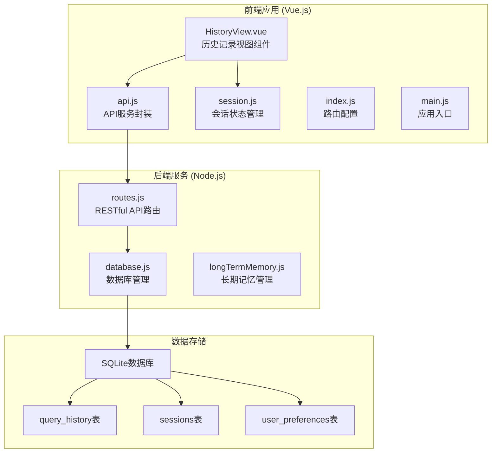
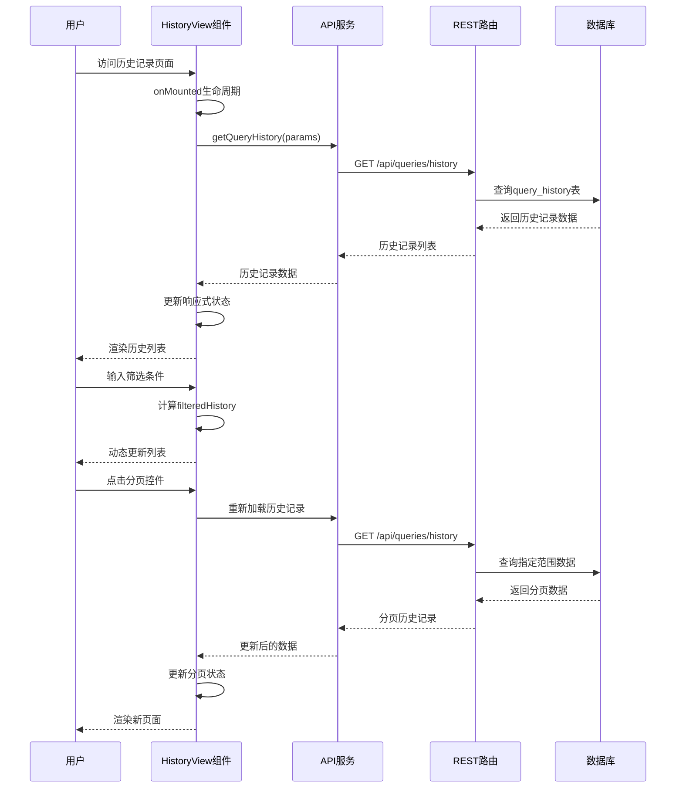
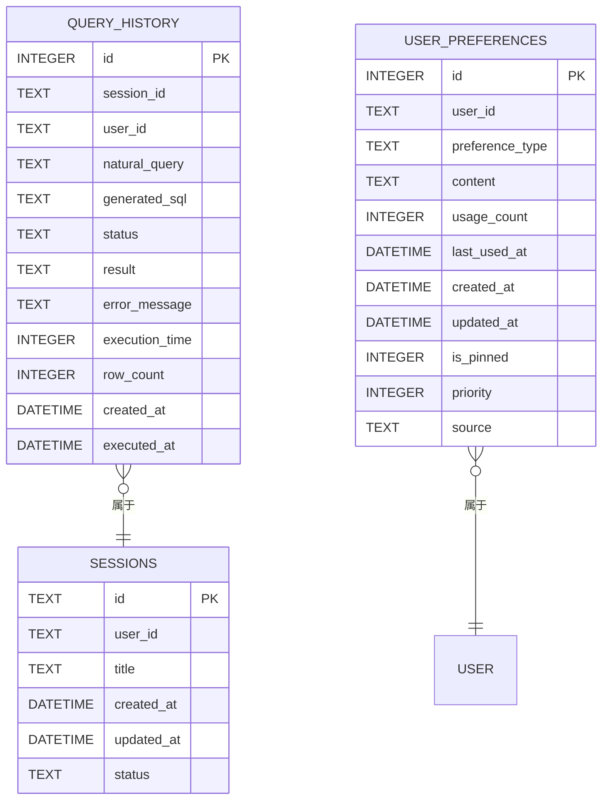
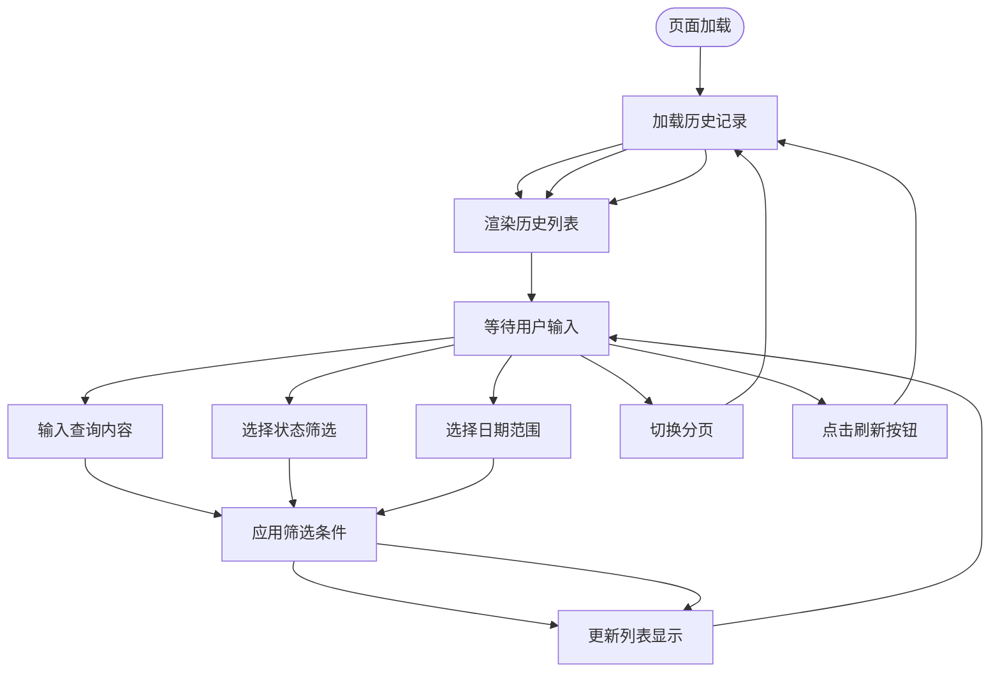
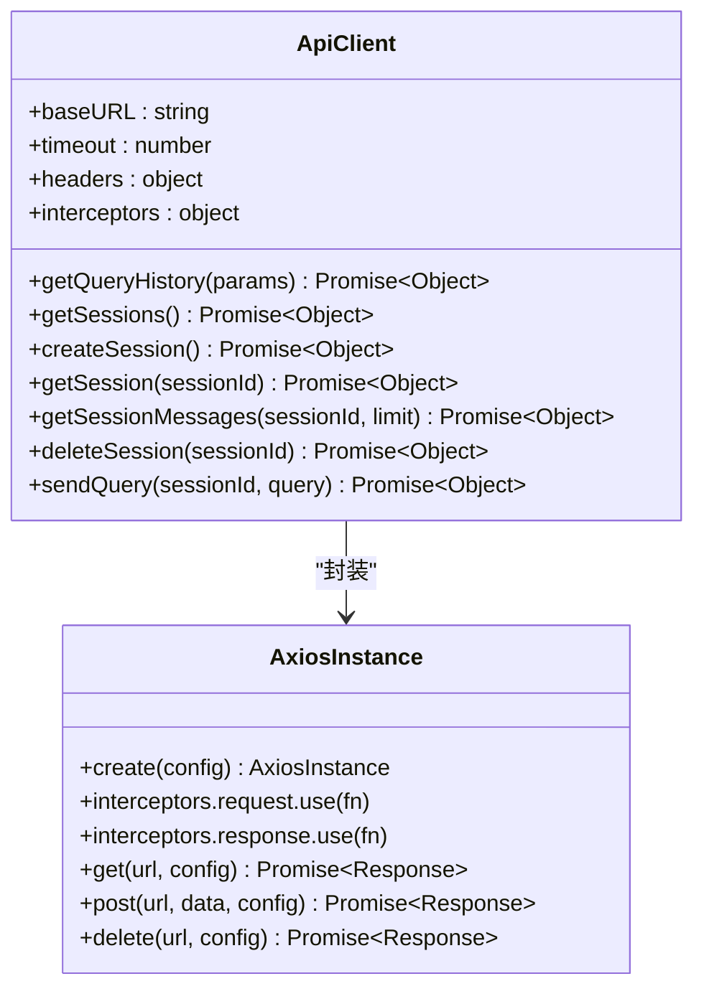
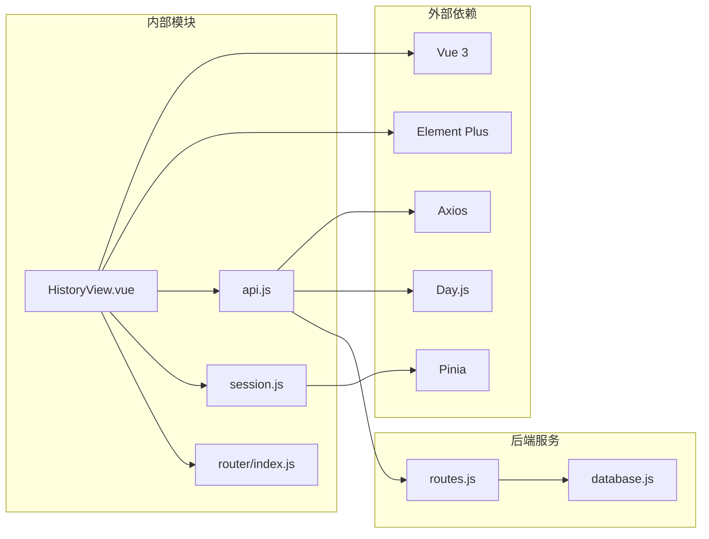

# 历史记录视图组件

<cite>
**本文档引用的文件**
- [HistoryView.vue](file://frontend/src/views/HistoryView.vue)
- [api.js](file://frontend/src/utils/api.js)
- [routes.js](file://backend/src/core/routes.js)
- [database.js](file://backend/src/core/database.js)
- [session.js](file://frontend/src/stores/session.js)
- [index.js](file://frontend/src/router/index.js)
- [main.js](file://frontend/src/main.js)
</cite>

## 目录
1. [简介](#简介)
2. [项目结构](#项目结构)
3. [核心组件](#核心组件)
4. [架构概览](#架构概览)
5. [详细组件分析](#详细组件分析)
6. [依赖分析](#依赖分析)
7. [性能考虑](#性能考虑)
8. [故障排除指南](#故障排除指南)
9. [结论](#结论)

## 简介

历史记录视图组件是NL2SQL系统中的关键功能模块，负责展示用户的查询历史记录。该组件提供了完整的查询历史管理功能，包括查询历史展示、会话列表管理、历史记录筛选、分页加载、搜索过滤、批量操作等核心特性。

该组件采用前后端分离架构，前端使用Vue.js + Element Plus构建用户界面，后端使用Node.js + Express提供RESTful API服务。系统通过SQLite数据库存储查询历史数据，支持实时数据同步和高效的数据检索。

## 项目结构

NL2SQL项目采用清晰的分层架构设计，历史记录视图组件位于前端应用的views目录中，与后端API服务形成完整的数据流。

**图表来源**
- [HistoryView.vue:1-441](file://frontend/src/views/HistoryView.vue#L1-L441)
- [api.js:1-303](file://frontend/src/utils/api.js#L1-L303)
- [routes.js:1-1037](file://backend/src/core/routes.js#L1-L1037)
- [database.js:1-859](file://backend/src/core/database.js#L1-L859)

**章节来源**
- [HistoryView.vue:1-441](file://frontend/src/views/HistoryView.vue#L1-L441)
- [api.js:1-303](file://frontend/src/utils/api.js#L1-L303)
- [routes.js:1-1037](file://backend/src/core/routes.js#L1-L1037)
- [database.js:1-859](file://backend/src/core/database.js#L1-L859)

## 核心组件

历史记录视图组件是一个独立的Vue单文件组件，实现了完整的查询历史管理功能。组件包含以下核心功能模块：

### 数据模型与状态管理

组件使用Vue 3的Composition API，通过响应式状态管理历史记录数据：

- **历史记录列表**：存储查询历史数据
- **筛选条件**：支持查询内容、状态、日期范围筛选
- **分页信息**：管理分页状态和数据加载
- **详情弹窗**：显示查询详情和SQL语句

### 用户界面组件

组件集成了Element Plus UI库，提供了丰富的用户交互体验：

- **筛选栏**：包含输入框、下拉选择器、日期选择器
- **历史列表**：展示查询记录的卡片式布局
- **分页控件**：支持页码切换和每页数量调整
- **详情对话框**：显示查询的详细信息

**章节来源**
- [HistoryView.vue:138-298](file://frontend/src/views/HistoryView.vue#L138-L298)

## 架构概览

历史记录视图组件采用MVVM架构模式，通过API层与后端服务进行数据交互。

**图表来源**
- [HistoryView.vue:226-243](file://frontend/src/views/HistoryView.vue#L226-L243)
- [api.js:206-208](file://frontend/src/utils/api.js#L206-L208)
- [routes.js:413-450](file://backend/src/core/routes.js#L413-L450)
- [database.js:98-135](file://backend/src/core/database.js#L98-L135)

## 详细组件分析

### 历史记录数据模型

系统使用SQLite数据库存储查询历史，数据表结构设计合理，支持高效的查询和筛选操作。

**图表来源**
- [database.js:98-163](file://backend/src/core/database.js#L98-L163)

### 前端组件实现

历史记录视图组件采用现代化的Vue 3 Composition API实现，提供了完整的功能特性。

#### 核心功能实现

1. **数据获取机制**：通过API服务调用后端REST接口获取历史记录
2. **筛选功能**：支持多条件筛选，包括查询内容、状态、日期范围
3. **分页加载**：实现高效的分页加载机制
4. **实时更新**：支持手动刷新和自动数据同步

#### 用户交互流程

**图表来源**
- [HistoryView.vue:190-217](file://frontend/src/views/HistoryView.vue#L190-L217)
- [HistoryView.vue:277-289](file://frontend/src/views/HistoryView.vue#L277-L289)

### 后端API集成

历史记录视图组件通过统一的API服务层与后端进行数据交互。

#### API服务封装

**图表来源**
- [api.js:25-34](file://frontend/src/utils/api.js#L25-L34)
- [api.js:206-208](file://frontend/src/utils/api.js#L206-L208)

#### 后端路由实现

后端使用Express框架提供RESTful API，历史记录功能通过专门的路由处理。

**章节来源**
- [HistoryView.vue:138-298](file://frontend/src/views/HistoryView.vue#L138-L298)
- [api.js:1-303](file://frontend/src/utils/api.js#L1-L303)
- [routes.js:404-450](file://backend/src/core/routes.js#L404-L450)

## 依赖分析

历史记录视图组件的依赖关系清晰，遵循单一职责原则，便于维护和扩展。

**图表来源**
- [HistoryView.vue:148-156](file://frontend/src/views/HistoryView.vue#L148-L156)
- [api.js:14-15](file://frontend/src/utils/api.js#L14-L15)
- [session.js:16-22](file://frontend/src/stores/session.js#L16-L22)
- [index.js:15-24](file://frontend/src/router/index.js#L15-L24)

### 组件耦合度分析

历史记录视图组件与其他模块的耦合度适中，主要通过API服务层进行解耦：

- **与API层耦合**：通过统一的API接口访问后端服务
- **与状态管理耦合**：与会话状态管理模块保持松散耦合
- **与UI库耦合**：使用Element Plus组件库，便于UI一致性

**章节来源**
- [HistoryView.vue:148-156](file://frontend/src/views/HistoryView.vue#L148-L156)
- [session.js:33-399](file://frontend/src/stores/session.js#L33-L399)

## 性能考虑

历史记录视图组件在设计时充分考虑了性能优化，采用了多种技术手段提升用户体验。

### 数据加载优化

1. **懒加载机制**：组件按需加载，减少初始加载时间
2. **分页加载**：避免一次性加载大量历史记录
3. **响应式更新**：使用Vue响应式系统实现高效的数据更新

### 缓存策略

系统采用多层次的缓存策略：

- **前端缓存**：Vue响应式状态缓存最近加载的历史记录
- **API缓存**：Axios拦截器提供统一的错误处理和缓存机制
- **数据库索引**：SQLite数据库为查询历史表建立了多个索引

### 性能优化建议

1. **虚拟滚动**：对于大量历史记录，可考虑实现虚拟滚动
2. **防抖处理**：对搜索输入进行防抖处理，减少API调用频率
3. **预加载机制**：实现智能预加载，提升用户体验

## 故障排除指南

历史记录视图组件在运行过程中可能遇到各种问题，以下是常见问题的诊断和解决方案。

### 常见问题及解决方案

#### 数据加载失败

**问题现象**：历史记录列表为空，控制台显示错误信息

**可能原因**：
- 后端服务不可用
- 网络连接问题
- API接口异常

**解决步骤**：
1. 检查后端服务状态
2. 验证网络连接
3. 查看API响应状态码
4. 检查数据库连接状态

#### 筛选功能异常

**问题现象**：筛选条件无法正确应用到历史记录

**可能原因**：
- 筛选逻辑错误
- 数据格式不匹配
- 日期格式转换问题

**解决步骤**：
1. 验证筛选条件的数据类型
2. 检查日期范围的边界条件
3. 确认状态值的有效性

#### 分页功能失效

**问题现象**：分页控件无法正常工作

**可能原因**：
- 分页参数传递错误
- 后端分页逻辑异常
- 前端状态管理问题

**解决步骤**：
1. 检查分页参数的传递
2. 验证后端分页查询逻辑
3. 确认前端分页状态更新

**章节来源**
- [HistoryView.vue:226-243](file://frontend/src/views/HistoryView.vue#L226-L243)
- [api.js:67-88](file://frontend/src/utils/api.js#L67-L88)

## 结论

历史记录视图组件是NL2SQL系统中重要的数据管理功能，通过精心设计的架构和实现，提供了完整的查询历史管理能力。组件具有以下特点：

### 技术优势

1. **架构清晰**：采用MVVM架构，职责分离明确
2. **用户体验优秀**：提供直观的界面和流畅的交互体验
3. **性能优化到位**：通过分页、缓存等技术提升性能
4. **可扩展性强**：模块化设计便于功能扩展和维护

### 功能完整性

组件实现了查询历史管理的核心功能，包括数据展示、筛选、分页、详情查看等，满足了用户对历史记录管理的各种需求。

### 改进建议

1. **增强搜索功能**：可考虑实现全文搜索和高级筛选
2. **添加批量操作**：支持批量删除、导出等功能
3. **优化移动端体验**：针对移动设备进行界面适配
4. **增加数据导出**：支持将历史记录导出为CSV等格式

历史记录视图组件为NL2SQL系统提供了坚实的数据管理基础，为后续的功能扩展和性能优化奠定了良好的技术基础。