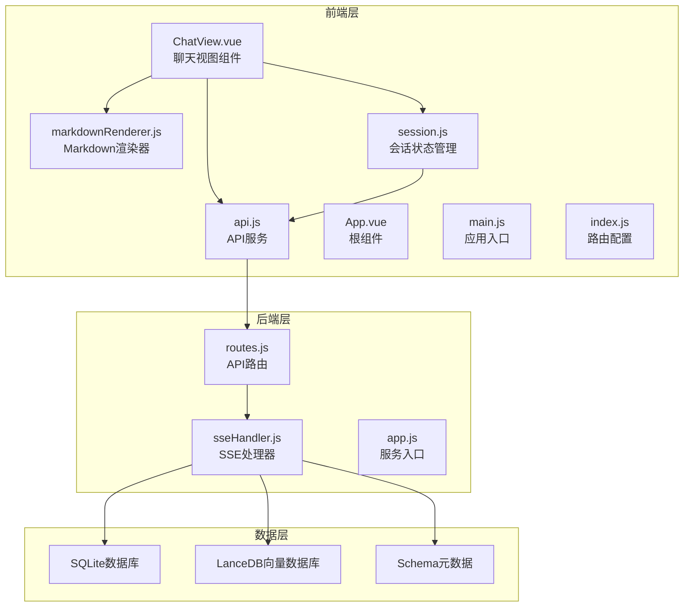
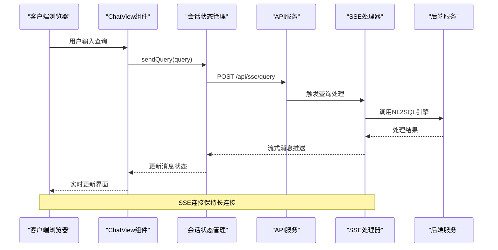
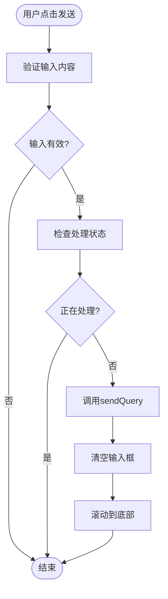
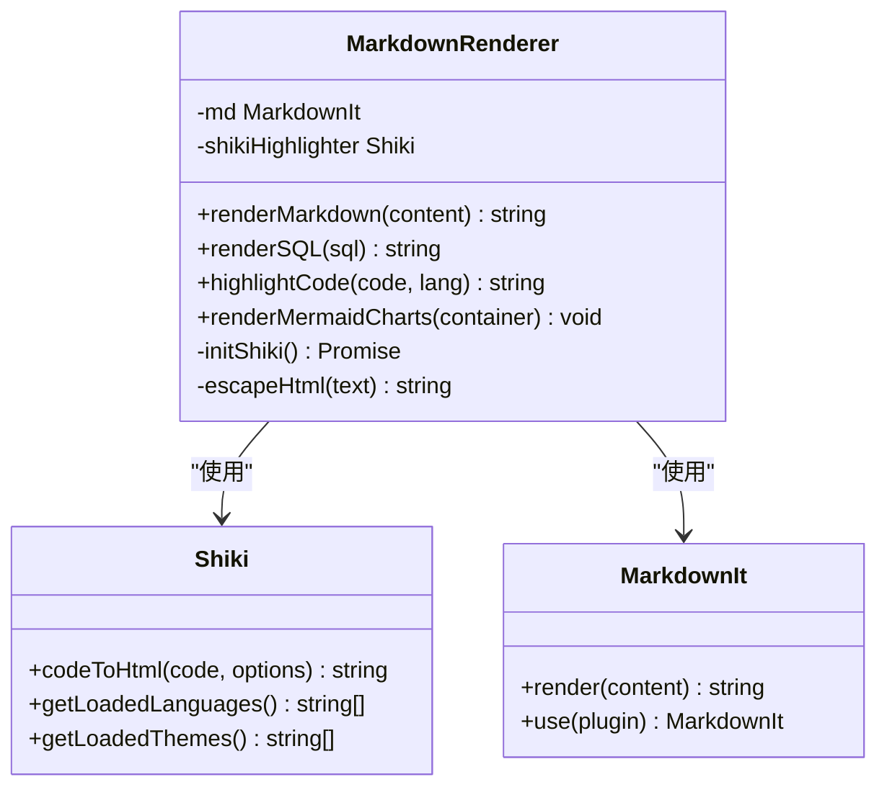
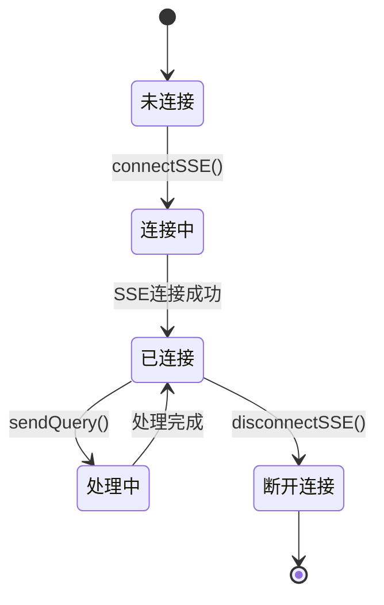
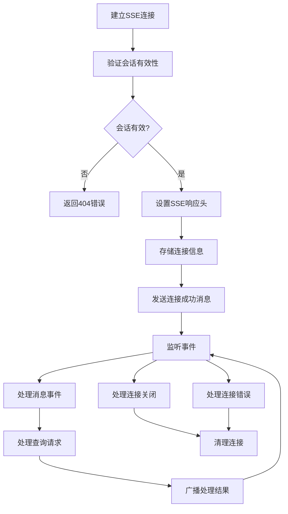
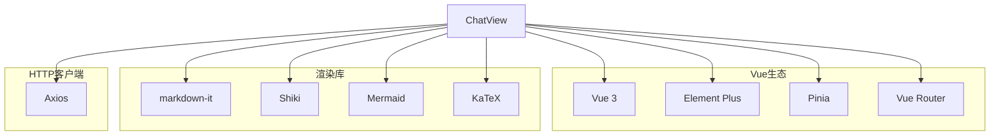
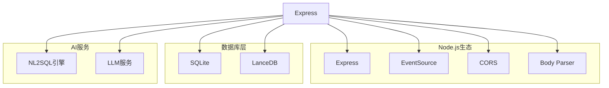

# 聊天视图组件

<cite>
**本文档引用的文件**
- [ChatView.vue](file://frontend/src/views/ChatView.vue)
- [markdownRenderer.js](file://frontend/src/utils/markdownRenderer.js)
- [session.js](file://frontend/src/stores/session.js)
- [api.js](file://frontend/src/utils/api.js)
- [sseHandler.js](file://backend/src/core/sseHandler.js)
- [routes.js](file://backend/src/core/routes.js)
- [App.vue](file://frontend/src/App.vue)
- [main.js](file://frontend/src/main.js)
- [app.js](file://backend/src/app.js)
- [index.js](file://frontend/src/router/index.js)
</cite>

## 目录
1. [简介](#简介)
2. [项目结构](#项目结构)
3. [核心组件](#核心组件)
4. [架构概览](#架构概览)
5. [详细组件分析](#详细组件分析)
6. [依赖关系分析](#依赖关系分析)
7. [性能考虑](#性能考虑)
8. [故障排除指南](#故障排除指南)
9. [结论](#结论)

## 简介

NL2SQL聊天视图组件是一个基于Vue 3和Element Plus构建的实时对话界面，专门用于自然语言数据查询。该组件实现了完整的SSE（Server-Sent Events）流式通信机制，支持实时消息展示、Markdown渲染、SQL代码高亮、数据表格展示等功能。组件采用现代化的前端架构，结合后端的流式处理能力，为用户提供流畅的对话式数据分析体验。

## 项目结构

NL2SQL项目采用前后端分离架构，主要分为以下层次：

**图表来源**
- [ChatView.vue:1-778](file://frontend/src/views/ChatView.vue#L1-L778)
- [session.js:1-400](file://frontend/src/stores/session.js#L1-L400)
- [sseHandler.js:1-349](file://backend/src/core/sseHandler.js#L1-L349)

**章节来源**
- [main.js:1-89](file://frontend/src/main.js#L1-L89)
- [app.js:1-260](file://backend/src/app.js#L1-L260)

## 核心组件

### ChatView组件架构

ChatView是整个聊天功能的核心组件，采用了Vue 3的Composition API和<script setup>语法，实现了以下关键功能：

#### 响应式状态管理
- **输入状态**: `inputMessage` - 用户输入的查询内容
- **消息容器**: `messagesContainer` - DOM引用，用于自动滚动
- **展开状态**: `expandedMessages` - Set集合，跟踪已展开的消息ID
- **处理状态**: `isProcessing` - 标识当前是否正在处理查询

#### 核心功能模块

1. **实时消息展示**: 支持用户消息和助手消息的差异化展示
2. **Markdown渲染**: 集成markdown-it实现丰富的文本格式化
3. **SQL代码高亮**: 使用Shiki实现专业的SQL语法高亮
4. **数据表格展示**: 基于Element Plus的表格组件展示查询结果
5. **SSE流式通信**: 实现与后端的实时双向通信

**章节来源**
- [ChatView.vue:132-383](file://frontend/src/views/ChatView.vue#L132-L383)

## 架构概览

NL2SQL聊天视图组件采用分层架构设计，实现了清晰的关注点分离：

**图表来源**
- [ChatView.vue:196-214](file://frontend/src/views/ChatView.vue#L196-L214)
- [session.js:301-330](file://frontend/src/stores/session.js#L301-L330)
- [sseHandler.js:218-280](file://backend/src/core/sseHandler.js#L218-L280)

## 详细组件分析

### ChatView组件详细分析

#### 模板结构分析

ChatView的模板结构清晰地分离了三个主要区域：

1. **消息列表区域** (`messages-area`)
   - 欢迎消息展示
   - 用户消息渲染
   - 助手消息渲染（包含Markdown、SQL、数据表格）

2. **处理状态指示器** (`processing-indicator`)
   - 进度状态显示
   - 打字动画效果
   - 进度条展示

3. **输入区域** (`input-area`)
   - 文本输入框
   - 快捷键支持
   - 发送按钮控制

#### 核心方法实现

##### 消息发送机制

**图表来源**
- [ChatView.vue:196-214](file://frontend/src/views/ChatView.vue#L196-L214)

##### 长内容折叠机制
组件实现了智能的内容折叠功能，当消息内容超过阈值（默认200字符）时自动启用折叠：

- **折叠状态管理**: 使用Set集合跟踪已展开的消息ID
- **折叠阈值**: `COLLAPSE_THRESHOLD = 200` 字符
- **视觉反馈**: 提供展开/折叠的箭头图标
- **渐进式展开**: 使用CSS渐变遮罩实现平滑的展开效果

##### Markdown渲染系统
组件集成了强大的Markdown渲染功能：

- **基础Markdown**: 使用markdown-it解析标准Markdown语法
- **Mermaid图表**: 支持流程图、序列图等复杂图表
- **KaTeX数学公式**: 支持行内和块级数学公式
- **代码高亮**: 集成Shiki实现多语言语法高亮

**章节来源**
- [ChatView.vue:236-292](file://frontend/src/views/ChatView.vue#L236-L292)
- [markdownRenderer.js:181-196](file://frontend/src/utils/markdownRenderer.js#L181-L196)

### Markdown渲染器详细分析

#### Shiki高亮器集成

Markdown渲染器的核心是Shiki代码高亮器，提供了专业的SQL语法高亮功能：

**图表来源**
- [markdownRenderer.js:46-68](file://frontend/src/utils/markdownRenderer.js#L46-L68)
- [markdownRenderer.js:74-100](file://frontend/src/utils/markdownRenderer.js#L74-L100)

#### Mermaid图表渲染

组件支持Mermaid图表的动态渲染，实现了复杂的可视化功能：

- **异步渲染**: 使用setTimeout确保DOM更新后再渲染图表
- **错误处理**: 提供图表渲染失败的降级处理
- **主题支持**: 支持多种图表类型的配置

**章节来源**
- [markdownRenderer.js:156-170](file://frontend/src/utils/markdownRenderer.js#L156-L170)

### 会话状态管理分析

#### Pinia Store设计

会话状态管理使用Pinia实现了响应式的状态管理：

**图表来源**
- [session.js:185-221](file://frontend/src/stores/session.js#L185-L221)

#### SSE消息处理流程

会话状态管理实现了完整的SSE消息处理机制：

1. **连接建立**: 建立EventSource连接并处理连接状态
2. **消息分发**: 根据消息类型分发到相应的处理函数
3. **状态更新**: 更新处理状态、进度和消息列表
4. **错误处理**: 统一处理SSE连接和消息处理错误

**章节来源**
- [session.js:227-295](file://frontend/src/stores/session.js#L227-L295)

### API服务层分析

#### HTTP客户端配置

API服务层基于Axios实现了统一的HTTP通信：

- **基础配置**: 设置baseURL为'/api'，超时时间为30秒
- **拦截器**: 实现请求和响应拦截器
- **错误处理**: 统一处理各种HTTP错误场景

#### SSE查询接口

API服务提供了专门的SSE查询接口：

- **POST /api/sse/query**: 发送查询请求
- **请求参数**: 包含session_id和query内容
- **响应处理**: 通过SSE流式接收处理结果

**章节来源**
- [api.js:25-34](file://frontend/src/utils/api.js#L25-L34)
- [api.js:246-251](file://frontend/src/utils/api.js#L246-L251)

### 后端SSE处理器分析

#### SSE连接管理

后端SSE处理器实现了健壮的连接管理机制：

**图表来源**
- [sseHandler.js:43-112](file://backend/src/core/sseHandler.js#L43-L112)
- [sseHandler.js:218-280](file://backend/src/core/sseHandler.js#L218-L280)

#### 查询处理流程

后端实现了完整的查询处理流程，支持进度回调和错误处理：

- **进度回调**: 支持多阶段的进度通知
- **错误恢复**: 统一的错误处理和恢复机制
- **并发控制**: 支持多标签页的并发连接

**章节来源**
- [sseHandler.js:249-279](file://backend/src/core/sseHandler.js#L249-L279)

## 依赖关系分析

### 前端依赖关系

**图表来源**
- [main.js:15-42](file://frontend/src/main.js#L15-L42)
- [ChatView.vue:142-152](file://frontend/src/views/ChatView.vue#L142-L152)

### 后端依赖关系

**图表来源**
- [app.js:23-33](file://backend/src/app.js#L23-L33)
- [routes.js:17-30](file://backend/src/core/routes.js#L17-L30)

**章节来源**
- [main.js:55-89](file://frontend/src/main.js#L55-L89)
- [app.js:56-87](file://backend/src/app.js#L56-L87)

## 性能考虑

### 前端性能优化

1. **虚拟滚动**: 对于大量消息的场景，建议实现虚拟滚动以提升性能
2. **懒加载**: 图表和复杂组件采用懒加载策略
3. **防抖处理**: 输入框的实时预览功能需要适当的防抖处理
4. **内存管理**: 及时清理不再使用的DOM节点和事件监听器

### 后端性能优化

1. **连接池管理**: SSE连接的生命周期管理
2. **缓存策略**: 频繁查询结果的缓存机制
3. **并发控制**: 多用户并发查询的资源分配
4. **数据库优化**: SQLite和LanceDB的查询优化

## 故障排除指南

### 常见问题及解决方案

#### SSE连接问题
- **症状**: 消息无法实时更新
- **原因**: 网络中断、服务器重启、浏览器限制
- **解决方案**: 实现自动重连机制，检查CORS配置

#### Markdown渲染问题
- **症状**: 特殊符号显示异常
- **原因**: HTML转义处理不当
- **解决方案**: 使用escapeHtml函数进行安全转义

#### SQL高亮失效
- **症状**: SQL代码显示为普通文本
- **原因**: Shiki初始化失败
- **解决方案**: 提供降级方案，使用简单高亮

#### 性能问题
- **症状**: 页面卡顿、渲染缓慢
- **原因**: 大量DOM操作、频繁重绘
- **解决方案**: 实施虚拟滚动、优化渲染策略

**章节来源**
- [markdownRenderer.js:109-118](file://frontend/src/utils/markdownRenderer.js#L109-L118)
- [session.js:335-341](file://frontend/src/stores/session.js#L335-L341)

## 结论

NL2SQL聊天视图组件是一个功能完整、架构清晰的实时对话系统。通过前后端的紧密协作，实现了流畅的用户体验和强大的数据查询能力。

### 技术亮点

1. **现代化架构**: 采用Vue 3 Composition API和Pinia状态管理
2. **实时通信**: 基于SSE的流式通信机制
3. **丰富渲染**: 支持Markdown、SQL高亮、图表等多种内容格式
4. **用户体验**: 智能折叠、进度指示、自动滚动等优化功能

### 未来改进方向

1. **移动端适配**: 增强移动设备的交互体验
2. **离线支持**: 实现部分功能的离线可用性
3. **国际化**: 支持多语言界面
4. **扩展性**: 提供插件化的功能扩展机制

该组件为自然语言数据查询提供了一个优秀的前端实现范例，具有良好的可维护性和扩展性。