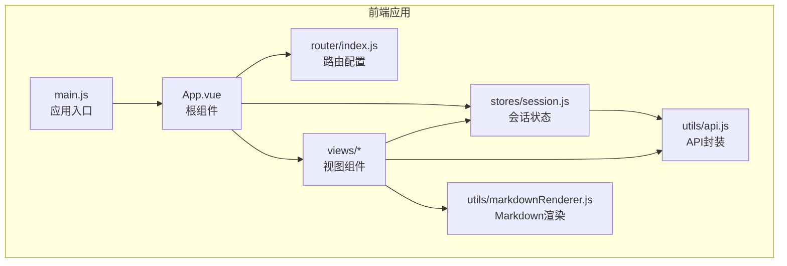
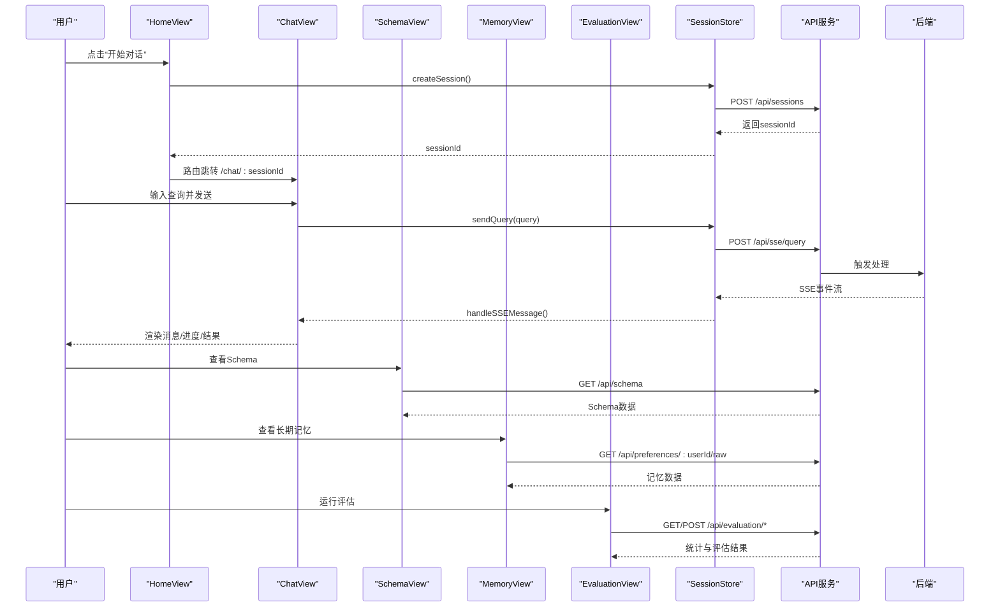
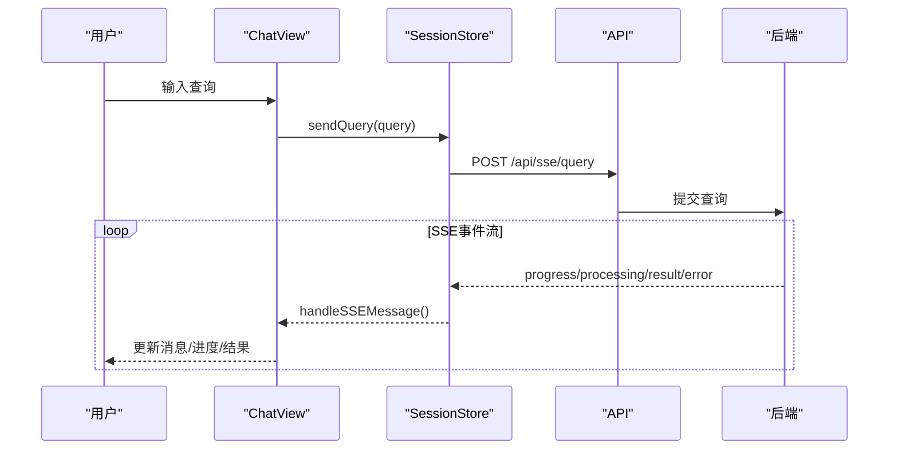
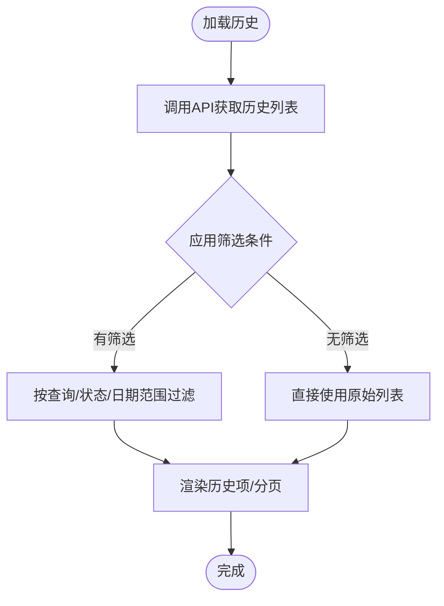
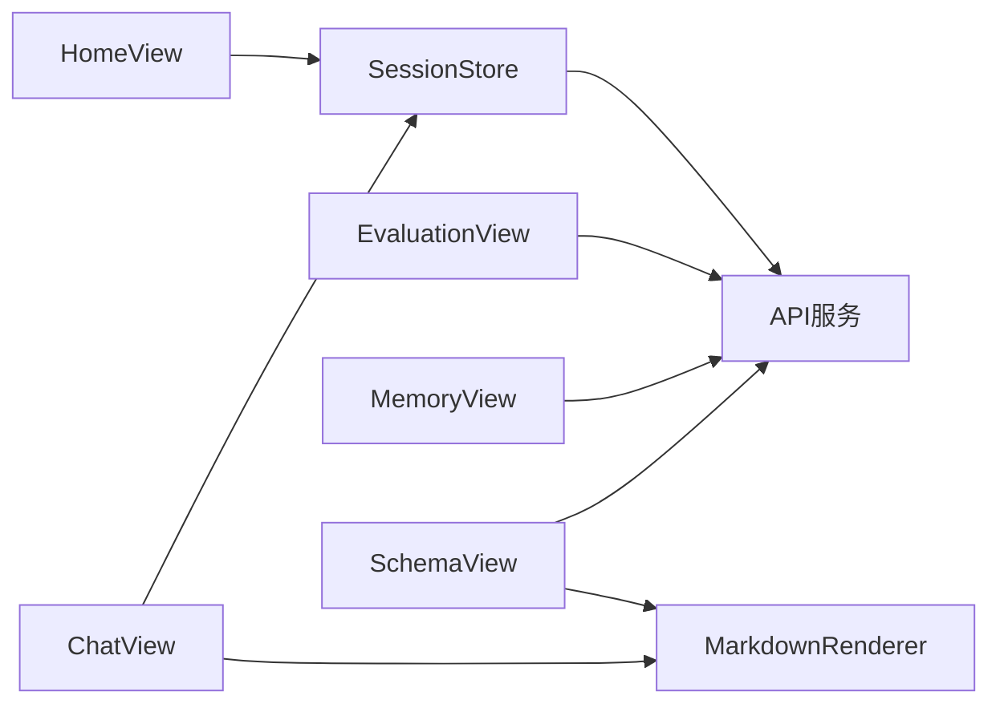

# 视图组件系统

<cite>
**本文引用的文件**
- [ChatView.vue](file://frontend/src/views/ChatView.vue)
- [HomeView.vue](file://frontend/src/views/HomeView.vue)
- [HistoryView.vue](file://frontend/src/views/HistoryView.vue)
- [MemoryView.vue](file://frontend/src/views/MemoryView.vue)
- [SchemaView.vue](file://frontend/src/views/SchemaView.vue)
- [EvaluationView.vue](file://frontend/src/views/EvaluationView.vue)
- [api.js](file://frontend/src/utils/api.js)
- [session.js](file://frontend/src/stores/session.js)
- [index.js（路由）](file://frontend/src/router/index.js)
- [markdownRenderer.js](file://frontend/src/utils/markdownRenderer.js)
- [App.vue](file://frontend/src/App.vue)
- [main.js](file://frontend/src/main.js)
</cite>

## 目录
1. [简介](#简介)
2. [项目结构](#项目结构)
3. [核心组件](#核心组件)
4. [架构总览](#架构总览)
5. [详细组件分析](#详细组件分析)
6. [依赖分析](#依赖分析)
7. [性能考虑](#性能考虑)
8. [故障排查指南](#故障排查指南)
9. [结论](#结论)
10. [附录](#附录)

## 简介
本技术文档面向前端开发者，系统梳理NL2SQL视图组件系统，覆盖聊天界面、主页、历史记录、内存管理、Schema查看、评估界面等核心视图组件。重点阐述：
- 各组件的功能定位与实现要点
- 聊天界面的交互设计与SSE实时通信机制
- 主页的信息展示与导航功能
- 历史记录的数据管理与查询能力
- 内存管理的可视化展示与操作界面
- Schema查看的数据库结构展示与交互方式
- 评估界面的功能特性与使用场景
- 组件间的通信模式与数据流向
- 前端开发与维护的最佳实践

## 项目结构
前端采用Vue 3 + Vite + Element Plus + Pinia + Vue Router的现代前端栈。视图组件位于frontend/src/views目录，状态管理位于stores，路由配置位于router，通用工具位于utils，根组件与入口在App.vue与main.js中。

图表来源
- [main.js:1-89](file://frontend/src/main.js#L1-L89)
- [App.vue:1-384](file://frontend/src/App.vue#L1-L384)
- [index.js（路由）:1-157](file://frontend/src/router/index.js#L1-L157)
- [session.js:1-400](file://frontend/src/stores/session.js#L1-L400)
- [api.js:1-303](file://frontend/src/utils/api.js#L1-L303)
- [markdownRenderer.js:1-258](file://frontend/src/utils/markdownRenderer.js#L1-L258)

章节来源
- [main.js:1-89](file://frontend/src/main.js#L1-L89)
- [App.vue:1-384](file://frontend/src/App.vue#L1-L384)
- [index.js（路由）:1-157](file://frontend/src/router/index.js#L1-L157)

## 核心组件
- ChatView：自然语言到SQL的对话式查询界面，支持SSE流式输出、Markdown渲染、SQL复制、长文本折叠等。
- HomeView：首页，提供快速开始、功能特性介绍、使用示例，以及进入Schema查看的入口。
- HistoryView：查询历史列表，支持筛选、分页、查看详情、复制查询。
- MemoryView：长期记忆数据的可视化与管理，支持按类型筛选、删除、原始JSON查看。
- SchemaView：数据库Schema的多标签页展示，包含表结构、指标、维度、表关系。
- EvaluationView：系统评估界面，展示向量化质量评估与记忆命中率统计，支持运行评估与重置统计。

章节来源
- [ChatView.vue:1-778](file://frontend/src/views/ChatView.vue#L1-L778)
- [HomeView.vue:1-318](file://frontend/src/views/HomeView.vue#L1-L318)
- [HistoryView.vue:1-441](file://frontend/src/views/HistoryView.vue#L1-L441)
- [MemoryView.vue:1-511](file://frontend/src/views/MemoryView.vue#L1-L511)
- [SchemaView.vue:1-322](file://frontend/src/views/SchemaView.vue#L1-L322)
- [EvaluationView.vue:1-699](file://frontend/src/views/EvaluationView.vue#L1-L699)

## 架构总览
组件间通信与数据流概览如下：

图表来源
- [HomeView.vue:153-163](file://frontend/src/views/HomeView.vue#L153-L163)
- [ChatView.vue:196-214](file://frontend/src/views/ChatView.vue#L196-L214)
- [session.js:297-330](file://frontend/src/stores/session.js#L297-L330)
- [api.js:158-165](file://frontend/src/utils/api.js#L158-L165)
- [SchemaView.vue:185-192](file://frontend/src/views/SchemaView.vue#L185-L192)
- [MemoryView.vue:212-228](file://frontend/src/views/MemoryView.vue#L212-L228)
- [EvaluationView.vue:466-491](file://frontend/src/views/EvaluationView.vue#L466-L491)

## 详细组件分析

### 聊天界面 ChatView
- 功能定位
  - 对话式自然语言查询入口，支持长文本折叠、Markdown渲染、SQL高亮、结果表格展示、SSE流式处理。
- 交互设计
  - 输入框支持Enter发送、Shift+Enter换行；消息列表自动滚动；处理状态显示打字动画与进度条。
- 实时通信机制
  - 通过SSE连接后端事件流，接收“processing/progress/result/error”等事件，动态更新UI状态与消息列表。
- 数据管理
  - 借助会话状态管理store维护消息、处理状态、进度与连接状态；路由参数驱动会话切换。
- 性能与可用性
  - 长消息折叠避免DOM膨胀；滚动到底部使用nextTick保证DOM更新；SSE断开时清理资源。

图表来源
- [ChatView.vue:196-214](file://frontend/src/views/ChatView.vue#L196-L214)
- [session.js:297-330](file://frontend/src/stores/session.js#L297-L330)
- [api.js:246-251](file://frontend/src/utils/api.js#L246-L251)

章节来源
- [ChatView.vue:1-778](file://frontend/src/views/ChatView.vue#L1-L778)
- [session.js:1-400](file://frontend/src/stores/session.js#L1-L400)
- [markdownRenderer.js:1-258](file://frontend/src/utils/markdownRenderer.js#L1-L258)

### 主页 HomeView
- 功能定位
  - 首页欢迎信息、功能特性展示、使用示例列表，提供快速进入聊天与Schema查看的入口。
- 导航功能
  - “开始对话”创建新会话并跳转到聊天页面；“查看数据Schema”跳转到Schema页面。
- 示例使用
  - 点击示例文本可创建新会话并跳转，实际发送示例可在ChatView中处理。

章节来源
- [HomeView.vue:1-318](file://frontend/src/views/HomeView.vue#L1-L318)
- [index.js（路由）:34-58](file://frontend/src/router/index.js#L34-L58)

### 历史记录 HistoryView
- 功能定位
  - 展示查询历史，支持按查询内容、状态、日期范围筛选，分页加载，查看详情与复制查询。
- 数据管理
  - 通过API获取历史列表与总数，使用dayjs格式化时间；过滤逻辑基于查询条件组合。
- 查询功能
  - 支持搜索框、状态下拉、日期范围选择；分页组件控制页码与每页数量。

图表来源
- [HistoryView.vue:226-243](file://frontend/src/views/HistoryView.vue#L226-L243)
- [HistoryView.vue:190-217](file://frontend/src/views/HistoryView.vue#L190-L217)

章节来源
- [HistoryView.vue:1-441](file://frontend/src/views/HistoryView.vue#L1-L441)
- [api.js:206-208](file://frontend/src/utils/api.js#L206-L208)

### 内存管理 MemoryView
- 功能定位
  - 长期记忆数据的可视化与管理，支持按类型筛选（字段别名、查询模式、常用指标、常用维度），删除单条记录，原始JSON查看。
- 可视化展示
  - 统计卡片展示总记录数与各类别数量；类型筛选按钮切换表格；表格列包含关键字段与操作按钮。
- 操作界面
  - 加载数据按钮触发API请求；删除确认对话框；格式化时间显示。

章节来源
- [MemoryView.vue:1-511](file://frontend/src/views/MemoryView.vue#L1-L511)
- [api.js:217-228](file://frontend/src/utils/api.js#L217-L228)

### Schema查看 SchemaView
- 功能定位
  - 数据库Schema的多标签页展示：表结构、指标、维度、表关系；支持刷新。
- 交互方式
  - 统计信息展示表数量、指标数量、维度数量；标签页切换不同视图；表格展示字段、定义、粒度等。
- 数据来源
  - 通过API获取Schema数据并渲染。

章节来源
- [SchemaView.vue:1-322](file://frontend/src/views/SchemaView.vue#L1-L322)
- [api.js:118-120](file://frontend/src/utils/api.js#L118-L120)

### 评估界面 EvaluationView
- 功能特性
  - 展示向量化质量评估与长期记忆命中率统计；支持刷新统计、重置数据、运行评估。
- 使用场景
  - 系统上线后用于监控向量检索命中率、记忆命中率与质量指标，辅助模型与向量库优化。
- 数据流向
  - 通过evaluationApi访问后端评估接口，获取统计与评估结果，渲染到概览卡片、分布图与详细表格。

章节来源
- [EvaluationView.vue:1-699](file://frontend/src/views/EvaluationView.vue#L1-L699)
- [api.js:260-302](file://frontend/src/utils/api.js#L260-L302)

## 依赖分析
- 组件耦合
  - ChatView与SessionStore高度耦合，负责SSE连接、消息处理与状态更新。
  - 各视图组件通过API服务与后端交互，保持较低耦合。
- 状态管理
  - SessionStore集中管理会话、消息、SSE连接与处理状态，被多个视图共享。
- 工具链
  - markdownRenderer集成markdown-it、Shiki、Mermaid、KaTeX，提供富文本渲染能力。

图表来源
- [ChatView.vue:1-778](file://frontend/src/views/ChatView.vue#L1-L778)
- [session.js:1-400](file://frontend/src/stores/session.js#L1-L400)
- [api.js:1-303](file://frontend/src/utils/api.js#L1-L303)
- [markdownRenderer.js:1-258](file://frontend/src/utils/markdownRenderer.js#L1-L258)

章节来源
- [session.js:1-400](file://frontend/src/stores/session.js#L1-L400)
- [api.js:1-303](file://frontend/src/utils/api.js#L1-L303)

## 性能考虑
- DOM渲染优化
  - ChatView对长文本消息提供折叠与展开，避免大文本一次性渲染导致的性能问题。
  - HistoryView使用骨架屏与空态组件提升加载体验。
- 异步渲染
  - Markdown渲染与Mermaid图表渲染采用异步与延迟策略，避免阻塞主线程。
- SSE连接管理
  - ChatView在组件卸载时断开SSE连接，防止内存泄漏与后台连接占用。
- 分页与懒加载
  - HistoryView与SchemaView均采用分页或懒加载策略，减少初始渲染压力。

## 故障排查指南
- SSE连接失败
  - 现象：无法接收流式消息。
  - 排查：检查后端SSE端点、网络连通性、浏览器EventSource支持；确认SessionStore中connectSSE与handleSSEMessage逻辑。
- API请求错误
  - 现象：历史、Schema、评估等接口报错。
  - 排查：查看API拦截器错误处理与响应拦截器，确认后端返回结构与状态码。
- Markdown/代码高亮异常
  - 现象：Markdown渲染或SQL高亮失败。
  - 排查：确认Shiki初始化与主题加载；检查渲染函数调用与容器存在性。
- 会话切换异常
  - 现象：切换会话后消息未更新或SSE未连接。
  - 排查：确认setCurrentSession与connectSSE调用顺序，监听路由参数变化的watch逻辑。

章节来源
- [session.js:185-221](file://frontend/src/stores/session.js#L185-L221)
- [api.js:67-88](file://frontend/src/utils/api.js#L67-L88)
- [markdownRenderer.js:51-68](file://frontend/src/utils/markdownRenderer.js#L51-L68)
- [ChatView.vue:324-327](file://frontend/src/views/ChatView.vue#L324-L327)

## 结论
NL2SQL视图组件系统围绕“对话式查询”这一核心目标，通过清晰的组件职责划分、统一的状态管理与API封装，实现了从主页导航、聊天交互、Schema浏览、历史查询、长期记忆管理到系统评估的完整闭环。SSE机制确保了实时反馈，Markdown渲染提升了结果可读性。建议在后续迭代中进一步完善错误恢复与日志上报、增强可访问性与国际化支持，并持续优化渲染性能与用户体验。

## 附录
- 组件开发与维护指南
  - 统一使用Composition API与<script setup>语法，保持组件简洁。
  - 通过Pinia集中管理跨组件共享状态，避免props逐层传递。
  - API封装遵循统一的请求/响应拦截与错误处理规范。
  - 为复杂渲染逻辑（如Markdown、Mermaid）提供独立工具模块，便于测试与复用。
  - 为每个视图组件提供最小可运行示例与单元测试，确保变更可控。