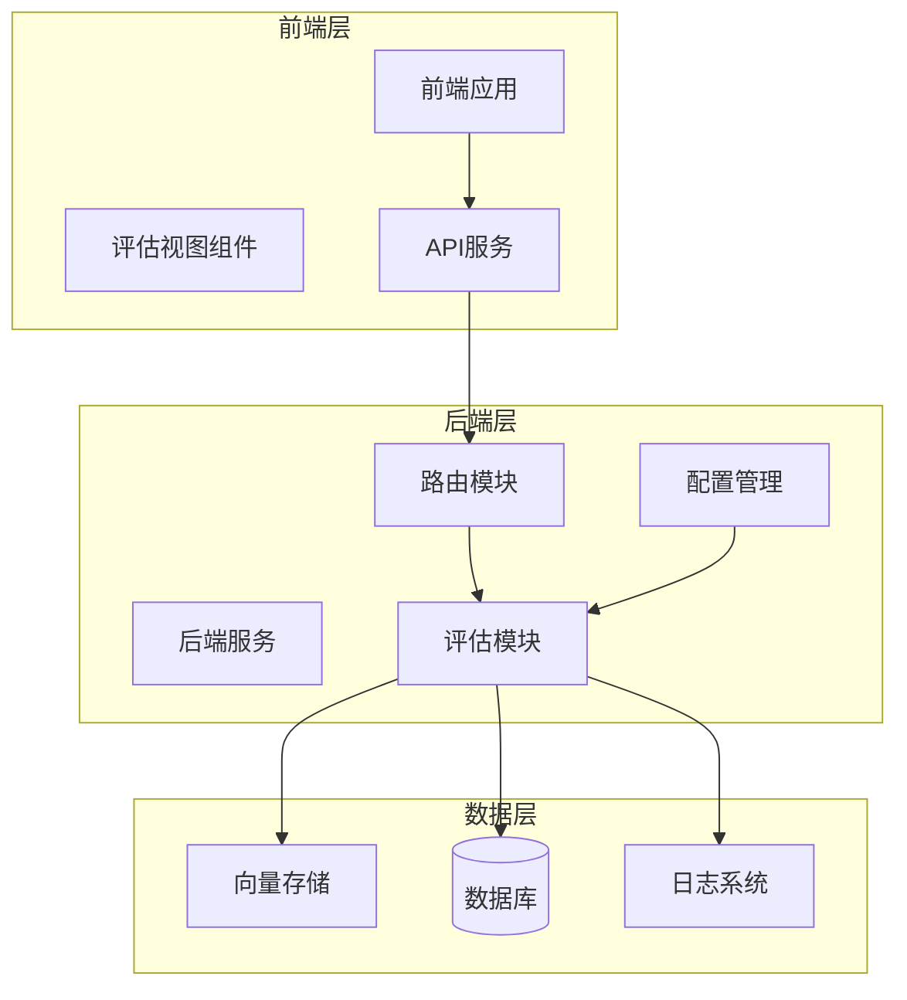
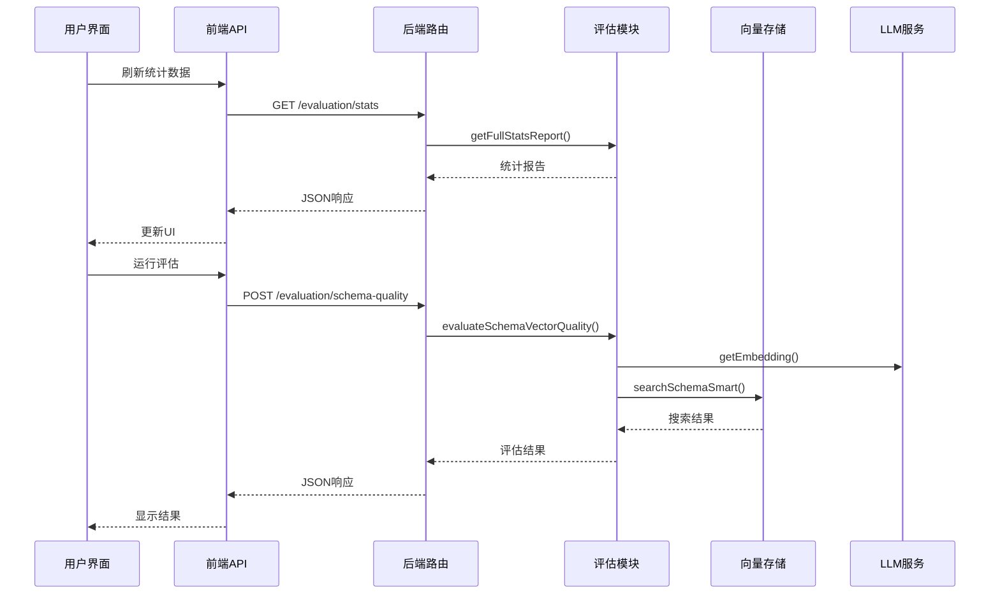
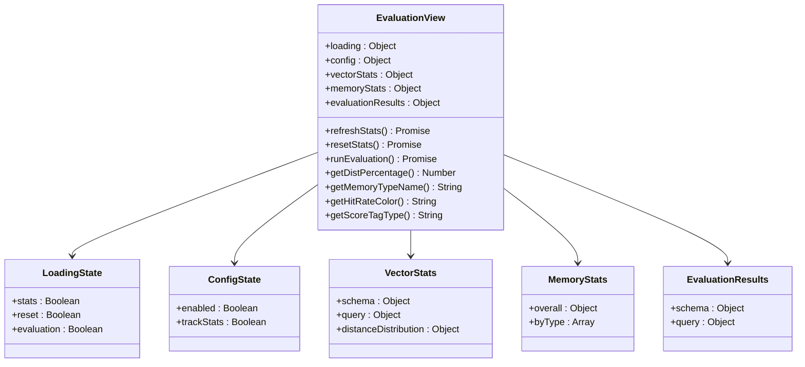
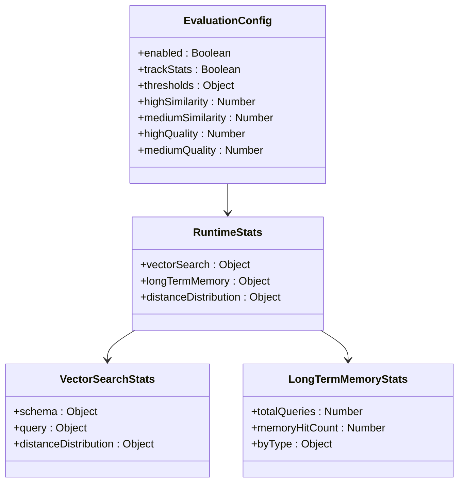
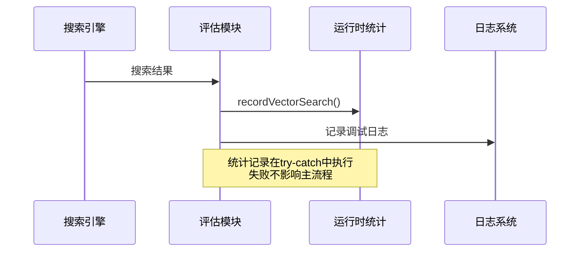
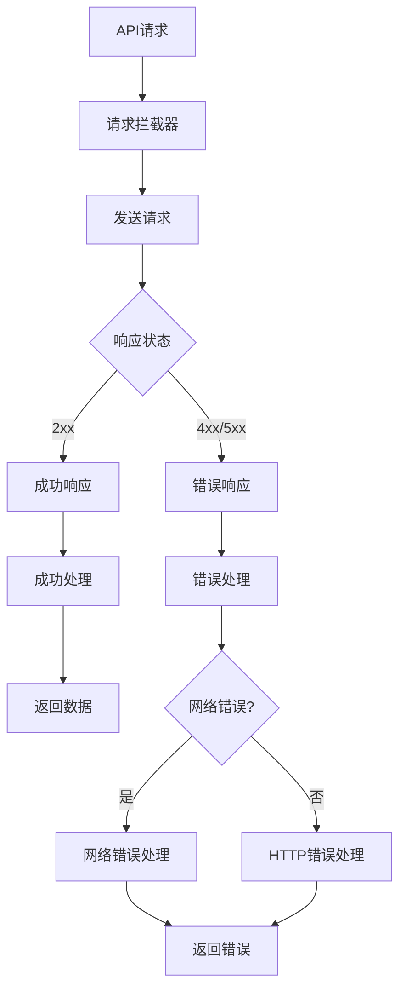
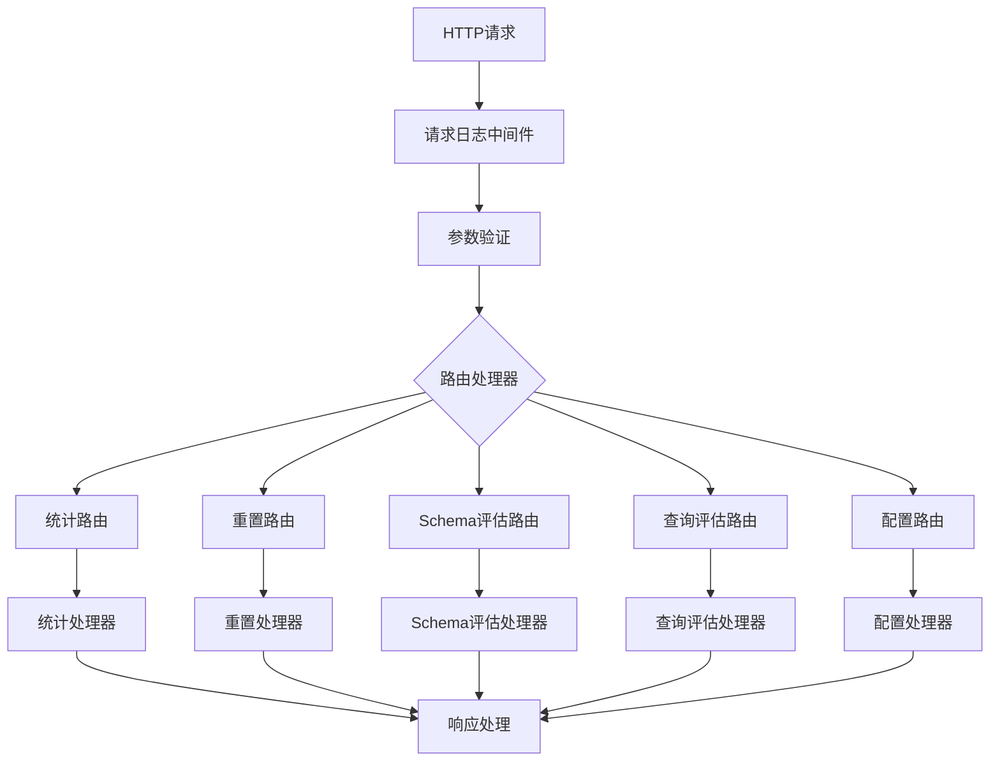
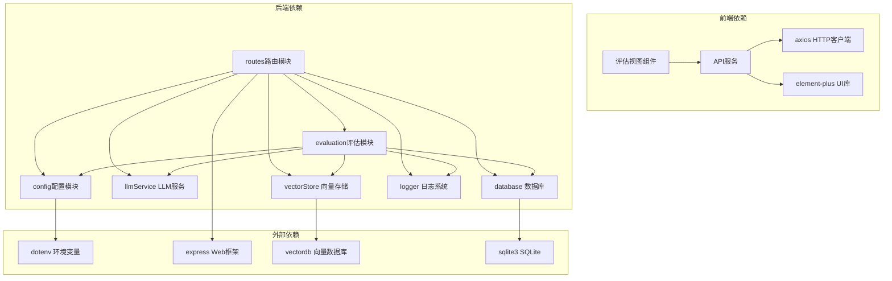

# 评估视图组件

<cite>
**本文档引用的文件**
- [EvaluationView.vue](file://frontend/src/views/EvaluationView.vue)
- [evaluation.js](file://backend/src/utils/evaluation.js)
- [routes.js](file://backend/src/core/routes.js)
- [api.js](file://frontend/src/utils/api.js)
- [config.js](file://backend/src/core/config.js)
- [schema-metadata.json](file://backend/config/schema-metadata.json)
- [business-semantic-layer.json](file://backend/config/business-semantic-layer.json)
</cite>

## 目录
1. [简介](#简介)
2. [项目结构](#项目结构)
3. [核心组件](#核心组件)
4. [架构概览](#架构概览)
5. [详细组件分析](#详细组件分析)
6. [依赖关系分析](#依赖关系分析)
7. [性能考虑](#性能考虑)
8. [故障排除指南](#故障排除指南)
9. [结论](#结论)

## 简介

评估视图组件是NL2SQL系统中的重要质量保证模块，负责监控和评估系统的向量化质量、记忆系统性能以及整体查询效果。该组件提供了全面的评估指标监控、实时统计展示、质量评估执行和历史数据分析功能。

系统采用前后端分离架构，前端使用Vue 3构建用户界面，后端基于Node.js和Express提供RESTful API服务。评估功能通过专门的评估模块实现，支持向量化质量评估、记忆命中率统计和查询相似度分析。

## 项目结构

NL2SQL项目采用清晰的分层架构，主要包含以下核心模块：



**图表来源**
- [EvaluationView.vue:1-699](file://frontend/src/views/EvaluationView.vue#L1-L699)
- [routes.js:1-1037](file://backend/src/core/routes.js#L1-L1037)
- [evaluation.js:1-488](file://backend/src/utils/evaluation.js#L1-L488)

**章节来源**
- [EvaluationView.vue:1-699](file://frontend/src/views/EvaluationView.vue#L1-L699)
- [routes.js:1-1037](file://backend/src/core/routes.js#L1-L1037)
- [evaluation.js:1-488](file://backend/src/utils/evaluation.js#L1-L488)

## 核心组件

评估视图组件包含以下核心功能模块：

### 1. 实时统计监控
- 向量检索命中率统计
- 长期记忆命中率分析
- 查询历史相似度监控
- 距离分布统计

### 2. 质量评估引擎
- Schema向量化质量评估
- 查询相似度质量评估
- 精确率、召回率、F1分数计算
- 余弦相似度分析

### 3. 数据可视化展示
- 概览卡片统计
- 详细统计图表
- 评估结果表格
- 实时更新机制

**章节来源**
- [EvaluationView.vue:28-156](file://frontend/src/views/EvaluationView.vue#L28-L156)
- [evaluation.js:158-334](file://backend/src/utils/evaluation.js#L158-L334)

## 架构概览

评估系统采用分层架构设计，确保功能模块的独立性和可维护性：



**图表来源**
- [routes.js:726-841](file://backend/src/core/routes.js#L726-L841)
- [api.js:260-302](file://frontend/src/utils/api.js#L260-L302)
- [evaluation.js:158-266](file://backend/src/utils/evaluation.js#L158-L266)

## 详细组件分析

### 评估视图组件 (EvaluationView.vue)

评估视图组件是用户交互的核心界面，提供了完整的评估功能入口：

#### 状态管理架构
组件采用Vue 3的Composition API模式，实现了清晰的状态管理和响应式更新：



**图表来源**
- [EvaluationView.vue:330-361](file://frontend/src/views/EvaluationView.vue#L330-L361)

#### 实时统计功能
组件实现了多维度的实时统计监控：

| 统计类别 | 指标 | 计算公式 | 展示方式 |
|---------|------|----------|----------|
| Schema检索 | 命中率 | hits/searches × 100% | 百分比卡片 |
| 查询历史 | 命中率 | hits/searches × 100% | 百分比卡片 |
| 长期记忆 | 总命中率 | totalHits/totalQueries × 100% | 百分比卡片 |
| 距离分布 | 四象限分布 | 各区间计数/总数 × 100% | 进度条分布 |

#### 评估执行流程
组件支持并行执行两种评估任务：

```mermaid
flowchart TD
Start([用户点击"运行评估"]) --> CheckConfig{评估功能启用?}
CheckConfig --> |否| ShowAlert[显示启用提示]
CheckConfig --> |是| ParallelExec[并行执行评估]
ParallelExec --> SchemaEval[Schema向量化评估]
ParallelExec --> QueryEval[查询相似度评估]
SchemaEval --> SchemaSuccess{评估成功?}
QueryEval --> QuerySuccess{评估成功?}
SchemaSuccess --> |是| StoreSchema[存储Schema结果]
SchemaSuccess --> |否| HandleSchemaError[处理错误]
QuerySuccess --> |是| StoreQuery[存储查询结果]
QuerySuccess --> |否| HandleQueryError[处理错误]
StoreSchema --> UpdateUI[更新界面显示]
StoreQuery --> UpdateUI
HandleSchemaError --> UpdateUI
HandleQueryError --> UpdateUI
ShowAlert --> End([结束])
UpdateUI --> End
```

**图表来源**
- [EvaluationView.vue:466-491](file://frontend/src/views/EvaluationView.vue#L466-L491)

**章节来源**
- [EvaluationView.vue:303-500](file://frontend/src/views/EvaluationView.vue#L303-L500)

### 后端评估模块 (evaluation.js)

后端评估模块是系统的核心评估引擎，提供了完整的评估算法和数据处理能力：

#### 评估配置管理
评估模块支持灵活的配置管理，包括功能开关和阈值设置：



**图表来源**
- [evaluation.js:19-60](file://backend/src/utils/evaluation.js#L19-L60)

#### 向量化质量评估算法
评估模块实现了多种评估算法，确保评估结果的准确性和可靠性：

**Schema向量化质量评估流程：**
1. 生成查询向量
2. 执行智能搜索
3. 提取表名
4. 计算精确率、召回率、F1分数
5. 生成详细评估报告

**查询相似度评估算法：**
1. 生成查询对向量
2. 计算余弦相似度
3. 评估相似度阈值
4. 计算平均误差

#### 统计记录机制
评估模块实现了非侵入式的统计记录机制：



**图表来源**
- [evaluation.js:66-122](file://backend/src/utils/evaluation.js#L66-L122)

**章节来源**
- [evaluation.js:1-488](file://backend/src/utils/evaluation.js#L1-L488)

### API接口设计 (api.js)

前端API模块封装了所有后端接口调用，提供了统一的接口访问方式：

#### 接口分类
API模块按照功能域对接口进行了分类管理：

| 接口类别 | 方法名 | 描述 |
|---------|--------|------|
| 统计接口 | getStats() | 获取运行时统计报告 |
| 配置接口 | getConfig() | 获取评估配置信息 |
| 评估接口 | evaluateSchemaQuality() | 执行Schema质量评估 |
| 评估接口 | evaluateQueryQuality() | 执行查询质量评估 |
| 重置接口 | resetStats() | 重置统计数据 |

#### 错误处理机制
API模块实现了完善的错误处理机制：



**图表来源**
- [api.js:67-88](file://frontend/src/utils/api.js#L67-L88)

**章节来源**
- [api.js:1-303](file://frontend/src/utils/api.js#L1-L303)

### 路由配置 (routes.js)

后端路由模块定义了完整的评估相关API端点：

#### 评估接口端点
路由模块提供了以下评估相关接口：

| HTTP方法 | 路径 | 功能 | 请求体 | 响应 |
|---------|------|------|--------|------|
| GET | /api/evaluation/stats | 获取运行时统计报告 | 无 | 统计报告 |
| POST | /api/evaluation/stats/reset | 重置统计数据 | 无 | 操作结果 |
| POST | /api/evaluation/schema-quality | 执行Schema质量评估 | 测试查询数组 | 评估结果 |
| POST | /api/evaluation/query-quality | 执行查询质量评估 | 测试对数组 | 评估结果 |
| GET | /api/evaluation/config | 获取评估配置 | 无 | 配置信息 |

#### 中间件机制
路由模块实现了统一的中间件处理：



**图表来源**
- [routes.js:726-856](file://backend/src/core/routes.js#L726-L856)

**章节来源**
- [routes.js:719-856](file://backend/src/core/routes.js#L719-L856)

## 依赖关系分析

评估系统涉及多个模块间的复杂依赖关系：



**图表来源**
- [EvaluationView.vue:313-324](file://frontend/src/views/EvaluationView.vue#L313-L324)
- [routes.js:16-29](file://backend/src/core/routes.js#L16-L29)
- [evaluation.js:12-14](file://backend/src/utils/evaluation.js#L12-L14)

### 关键依赖关系

1. **前端到后端的依赖链**：评估视图组件 → API服务 → 路由模块 → 评估模块
2. **后端内部依赖**：路由模块依赖评估模块，评估模块依赖配置模块和外部服务
3. **配置驱动的依赖**：所有评估功能都受配置模块控制，支持动态启用/禁用

**章节来源**
- [config.js:342-354](file://backend/src/core/config.js#L342-L354)
- [routes.js:28-29](file://backend/src/core/routes.js#L28-L29)

## 性能考虑

评估系统在设计时充分考虑了性能优化和资源管理：

### 1. 异步处理优化
- 评估任务采用异步并发执行，提升响应速度
- 统计数据采用内存缓存，减少数据库访问
- 向量计算使用批量处理，优化LLM API调用

### 2. 资源管理策略
- 评估功能默认关闭，避免影响生产环境性能
- 统计记录采用非阻塞设计，失败不影响主流程
- 向量搜索结果缓存，减少重复计算

### 3. 内存使用优化
- 运行时统计仅存储在内存中，避免持久化开销
- 评估结果按需生成，不长期驻留内存
- 向量存储使用高效的索引结构

## 故障排除指南

### 常见问题及解决方案

#### 1. 评估功能未启用
**症状**：评估视图显示"评估功能未启用"
**原因**：EVALUATION_ENABLED环境变量未设置为true
**解决方案**：
```bash
# 设置环境变量
export EVALUATION_ENABLED=true
export EVALUATION_TRACK_STATS=true
```

#### 2. API调用失败
**症状**：前端无法获取统计数据或执行评估
**原因**：后端服务未启动或网络连接问题
**解决方案**：
- 检查后端服务状态：`curl http://localhost:3000/api/health`
- 验证网络连接：`ping localhost:3000`
- 查看后端日志：`tail -f logs/app.log`

#### 3. 评估结果异常
**症状**：评估结果显示错误或异常值
**原因**：LLM API配置错误或向量存储问题
**解决方案**：
- 验证LLM API密钥配置
- 检查向量存储连接状态
- 查看评估日志中的详细错误信息

#### 4. 性能问题
**症状**：评估执行缓慢或内存占用过高
**原因**：评估数据量过大或配置不当
**解决方案**：
- 减少评估测试数据量
- 调整评估阈值设置
- 优化向量存储性能

**章节来源**
- [EvaluationView.vue:17-25](file://frontend/src/views/EvaluationView.vue#L17-L25)
- [routes.js:773-778](file://backend/src/core/routes.js#L773-L778)

## 结论

评估视图组件为NL2SQL系统提供了全面的质量保障机制。通过前后端协同设计，实现了从数据采集、算法计算到结果展示的完整评估流程。

### 主要优势

1. **模块化设计**：清晰的功能分离和依赖管理
2. **实时监控**：提供运行时统计和历史数据分析
3. **灵活配置**：支持动态启用/禁用和阈值调整
4. **性能优化**：异步处理和资源管理策略
5. **错误处理**：完善的异常捕获和恢复机制

### 技术特色

- **非侵入式评估**：不影响主业务流程的正常运行
- **多维度评估**：涵盖向量化质量、记忆系统和查询效果
- **可视化展示**：直观的统计图表和评估结果
- **历史对比**：支持趋势分析和性能对比

该组件为NL2SQL系统的持续改进和质量保证提供了坚实的技术基础，通过定期的评估和分析，能够有效提升系统的整体性能和用户体验。