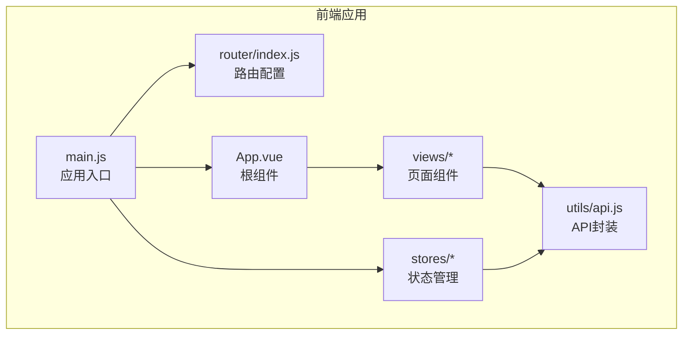
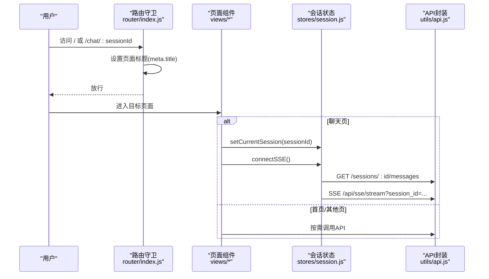
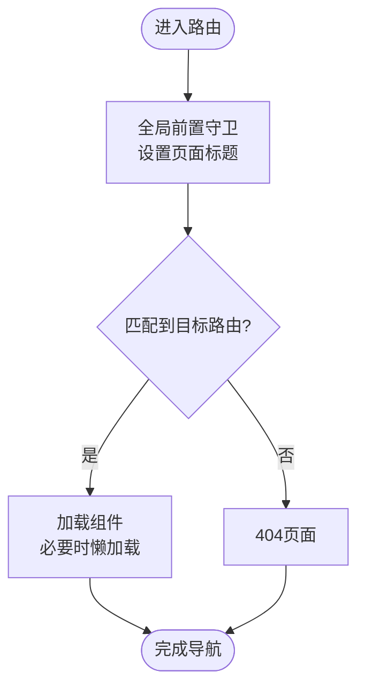
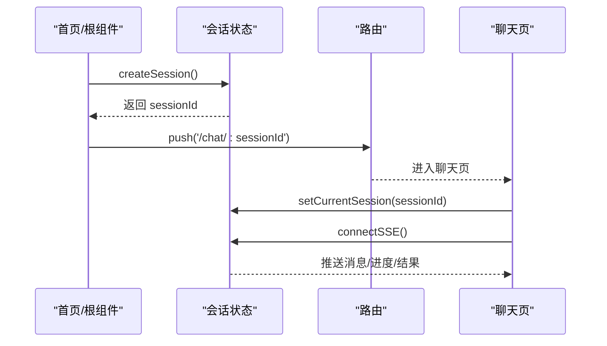
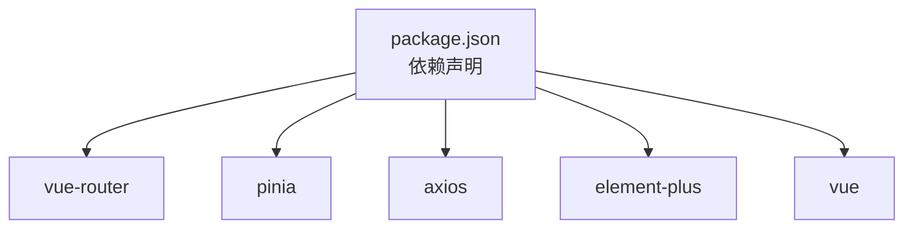

# 路由与导航

<cite>
**本文引用的文件**
- [frontend/src/router/index.js](file://frontend/src/router/index.js)
- [frontend/src/main.js](file://frontend/src/main.js)
- [frontend/src/App.vue](file://frontend/src/App.vue)
- [frontend/src/views/ChatView.vue](file://frontend/src/views/ChatView.vue)
- [frontend/src/views/HomeView.vue](file://frontend/src/views/HomeView.vue)
- [frontend/src/views/HistoryView.vue](file://frontend/src/views/HistoryView.vue)
- [frontend/src/views/SchemaView.vue](file://frontend/src/views/SchemaView.vue)
- [frontend/src/stores/session.js](file://frontend/src/stores/session.js)
- [frontend/src/utils/api.js](file://frontend/src/utils/api.js)
- [frontend/vite.config.js](file://frontend/vite.config.js)
- [frontend/package.json](file://frontend/package.json)
</cite>

## 目录
1. [简介](#简介)
2. [项目结构](#项目结构)
3. [核心组件](#核心组件)
4. [架构总览](#架构总览)
5. [详细组件分析](#详细组件分析)
6. [依赖分析](#依赖分析)
7. [性能考量](#性能考量)
8. [故障排查指南](#故障排查指南)
9. [结论](#结论)
10. [附录](#附录)

## 简介
本文件面向 NL2SQL 前端路由系统，系统性阐述 Vue Router 的配置与使用，包括：
- 路由定义与命名
- 导航守卫与页面元信息
- 动态路由参数处理（会话 ID）
- 路由懒加载与滚动行为
- 权限控制与导航状态管理
- 路由开发实践（参数传递、查询字符串、元信息）
- 导航优化与用户体验

## 项目结构
前端采用 Vite + Vue3 + Vue Router + Pinia + Element Plus 的技术栈，路由集中在 router/index.js 中集中定义，页面组件位于 views 目录，状态管理位于 stores 目录，API 服务封装在 utils/api.js 中。



**图表来源**
- [frontend/src/main.js:1-89](file://frontend/src/main.js#L1-L89)
- [frontend/src/router/index.js:1-157](file://frontend/src/router/index.js#L1-L157)
- [frontend/src/App.vue:1-384](file://frontend/src/App.vue#L1-L384)

**章节来源**
- [frontend/src/main.js:1-89](file://frontend/src/main.js#L1-L89)
- [frontend/src/router/index.js:1-157](file://frontend/src/router/index.js#L1-L157)
- [frontend/package.json:1-36](file://frontend/package.json#L1-L36)

## 核心组件
- 路由配置与守卫：集中于 router/index.js，定义路由表、历史模式、滚动行为与全局前置守卫。
- 根组件与导航：App.vue 提供侧边栏导航、会话列表与路由视图出口；通过编程式导航实现页面跳转。
- 页面组件：HomeView、ChatView、HistoryView、SchemaView 等，分别承担不同业务场景。
- 会话状态管理：session.js 管理会话列表、当前会话、消息、SSE 连接等，驱动路由参数变更与页面初始化。
- API 封装：api.js 统一封装 axios，提供会话、Schema、查询历史、SSE 等接口。

**章节来源**
- [frontend/src/router/index.js:34-157](file://frontend/src/router/index.js#L34-L157)
- [frontend/src/App.vue:115-240](file://frontend/src/App.vue#L115-L240)
- [frontend/src/stores/session.js:33-400](file://frontend/src/stores/session.js#L33-L400)
- [frontend/src/utils/api.js:25-303](file://frontend/src/utils/api.js#L25-L303)

## 架构总览
下图展示了路由、组件与状态管理之间的交互关系，以及导航流程。



**图表来源**
- [frontend/src/router/index.js:142-150](file://frontend/src/router/index.js#L142-L150)
- [frontend/src/views/ChatView.vue:333-345](file://frontend/src/views/ChatView.vue#L333-L345)
- [frontend/src/stores/session.js:144-171](file://frontend/src/stores/session.js#L144-L171)
- [frontend/src/utils/api.js:160-251](file://frontend/src/utils/api.js#L160-L251)

## 详细组件分析

### 路由配置与导航守卫
- 路由表：包含首页、聊天、历史、Schema、内存、评估、404 等页面；聊天路由支持可选的会话参数。
- 历史模式：使用 HTML5 History 模式，URL 更加美观。
- 滚动行为：支持恢复滚动位置或回到顶部。
- 全局前置守卫：根据路由元信息设置页面标题，保证一致性体验。



**图表来源**
- [frontend/src/router/index.js:34-157](file://frontend/src/router/index.js#L34-L157)

**章节来源**
- [frontend/src/router/index.js:34-157](file://frontend/src/router/index.js#L34-L157)

### 动态路由参数与会话导航
- 聊天路由：/chat/:sessionId? 支持可选会话参数。
- 会话创建与跳转：首页与根组件均通过状态管理创建会话并跳转到 /chat/:sessionId。
- 路由参数监听：聊天页监听路由参数变化，切换会话时断开旧 SSE 并重新初始化。
- 会话状态：状态管理负责加载会话列表、设置当前会话、加载消息、建立 SSE 连接。



**图表来源**
- [frontend/src/views/HomeView.vue:153-163](file://frontend/src/views/HomeView.vue#L153-L163)
- [frontend/src/App.vue:176-200](file://frontend/src/App.vue#L176-L200)
- [frontend/src/views/ChatView.vue:333-345](file://frontend/src/views/ChatView.vue#L333-L345)
- [frontend/src/stores/session.js:118-155](file://frontend/src/stores/session.js#L118-L155)

**章节来源**
- [frontend/src/views/HomeView.vue:153-163](file://frontend/src/views/HomeView.vue#L153-L163)
- [frontend/src/App.vue:176-200](file://frontend/src/App.vue#L176-L200)
- [frontend/src/views/ChatView.vue:333-361](file://frontend/src/views/ChatView.vue#L333-L361)
- [frontend/src/stores/session.js:118-155](file://frontend/src/stores/session.js#L118-L155)

### 页面组件与导航结构
- 首页：提供“开始对话”“查看Schema”等入口，触发会话创建与路由跳转。
- 聊天页：展示消息、处理状态、输入框；监听路由参数变化，动态切换会话。
- 历史页：展示查询历史，支持筛选、分页与查看详情。
- Schema 页：展示表结构、指标、维度与表关系。

```mermaid
graph LR
Home["首页"] --> |push('/chat/:sessionId')| Chat["聊天页"]
Root["根组件侧边栏"] --> |push('/memory')| Memory["内存页"]
Root --> |push('/evaluation')| Eval["评估页"]
Root --> |push('/schema')| Schema["Schema页"]
Root --> |push('/history')| History["历史页"]
```

**图表来源**
- [frontend/src/views/HomeView.vue:153-170](file://frontend/src/views/HomeView.vue#L153-L170)
- [frontend/src/App.vue:161-170](file://frontend/src/App.vue#L161-L170)
- [frontend/src/router/index.js:60-99](file://frontend/src/router/index.js#L60-L99)

**章节来源**
- [frontend/src/views/HomeView.vue:153-170](file://frontend/src/views/HomeView.vue#L153-L170)
- [frontend/src/App.vue:161-170](file://frontend/src/App.vue#L161-L170)
- [frontend/src/router/index.js:60-99](file://frontend/src/router/index.js#L60-L99)

### 路由懒加载与滚动行为
- 懒加载：历史、Schema、内存、评估等页面采用动态 import 按需加载，减少首屏体积。
- 滚动行为：支持恢复滚动位置或回到顶部，提升用户体验。

**章节来源**
- [frontend/src/router/index.js:64, 84, 74, 94, 124-131:64-94](file://frontend/src/router/index.js#L64-L94)

### 权限控制与导航状态管理
- 元信息控制：路由元信息包含页面标题与是否需要会话等标记，便于统一处理。
- 会话状态：通过 Pinia 管理会话列表、当前会话、消息与 SSE 连接，驱动页面初始化与数据流。
- API 封装：统一的 axios 实例与拦截器，便于扩展认证与错误处理。

**章节来源**
- [frontend/src/router/index.js:43-48, 54-57, 65-68, 85-88, 95-98, 105-107:43-107](file://frontend/src/router/index.js#L43-L107)
- [frontend/src/stores/session.js:33-399](file://frontend/src/stores/session.js#L33-L399)
- [frontend/src/utils/api.js:25-88](file://frontend/src/utils/api.js#L25-L88)

### 路由开发指南
- 路由参数传递
  - 使用命名路由与参数对象进行跳转，如 push({ name: 'chat', params: { sessionId } })。
  - 在组件内通过 useRoute 获取参数，如 route.params.sessionId。
- 查询字符串处理
  - 使用 query 对象传递查询参数，如 push({ path: '/history', query: { page: 1 } })。
  - 在组件内通过 route.query 获取查询参数。
- 路由元信息使用
  - 在路由定义中设置 meta.title 与自定义字段，全局守卫中读取并设置页面标题。
- 导航优化策略
  - 使用懒加载减少首屏资源。
  - 通过滚动行为恢复滚动位置，避免频繁刷新导致的重复滚动。
  - 在聊天页监听路由参数变化，及时断开旧连接并建立新连接，保证数据一致性。
- 用户体验考虑
  - 404 页面友好提示，引导返回首页。
  - 聊天页自动滚动到底部，确保用户看到最新消息。
  - 处理状态与进度条，增强反馈。

**章节来源**
- [frontend/src/router/index.js:34-157](file://frontend/src/router/index.js#L34-L157)
- [frontend/src/views/ChatView.vue:354-361](file://frontend/src/views/ChatView.vue#L354-L361)
- [frontend/src/views/HistoryView.vue:16-34](file://frontend/src/views/HistoryView.vue#L16-L34)

## 依赖分析
- 路由与状态管理：Vue Router 与 Pinia 作为核心依赖，分别负责导航与状态。
- UI 组件库：Element Plus 提供丰富的 UI 组件与图标。
- HTTP 客户端：Axios 封装 API 调用，统一拦截器处理错误。
- 构建与代理：Vite 提供开发服务器与代理，解决前后端分离的跨域问题。



**图表来源**
- [frontend/package.json:11-28](file://frontend/package.json#L11-L28)

**章节来源**
- [frontend/package.json:11-28](file://frontend/package.json#L11-L28)
- [frontend/vite.config.js:24-35](file://frontend/vite.config.js#L24-L35)

## 性能考量
- 代码分割：通过手动分块将第三方库拆分，减少初始包体。
- 懒加载：非关键页面采用动态 import，降低首屏压力。
- 构建优化：关闭 source map，减少生产环境体积与调试成本。

**章节来源**
- [frontend/vite.config.js:72-91](file://frontend/vite.config.js#L72-L91)

## 故障排查指南
- 跨域问题
  - 开发环境通过 Vite 代理 /api 到后端服务，确保代理配置正确。
- 路由标题异常
  - 检查路由元信息中的 title 字段是否设置，全局守卫是否生效。
- 聊天页无消息
  - 确认会话 ID 正确传递，setCurrentSession 与 connectSSE 是否被调用。
  - 检查 SSE URL 与后端连接状态。
- 404 页面频繁出现
  - 检查路由表与路径拼写，确保通配符路由放在最后。
- API 错误处理
  - 查看响应拦截器的错误分支，定位网络或服务端错误。

**章节来源**
- [frontend/vite.config.js:24-35](file://frontend/vite.config.js#L24-L35)
- [frontend/src/router/index.js:142-150](file://frontend/src/router/index.js#L142-L150)
- [frontend/src/views/ChatView.vue:333-345](file://frontend/src/views/ChatView.vue#L333-L345)
- [frontend/src/utils/api.js:67-88](file://frontend/src/utils/api.js#L67-L88)

## 结论
NL2SQL 前端路由系统以 Vue Router 为核心，结合 Pinia 状态管理与 Element Plus UI 库，实现了清晰的导航结构与良好的用户体验。通过动态路由参数、懒加载与滚动行为优化，系统在功能与性能之间取得平衡。未来可在权限守卫、路由缓存与错误边界等方面进一步增强。

## 附录
- 路由表概览
  - 首页：/，meta.title='首页'
  - 聊天：/chat/:sessionId?，meta.title='对话'
  - 历史：/history，meta.title='查询历史'
  - Schema：/schema，meta.title='数据Schema'
  - 内存：/memory，meta.title='长期记忆管理'
  - 评估：/evaluation，meta.title='系统评估'
  - 404：/:pathMatch(.*)*，meta.title='页面不存在'

**章节来源**
- [frontend/src/router/index.js:34-109](file://frontend/src/router/index.js#L34-L109)