# 路由系统

<cite>
**本文档引用的文件**
- [frontend/src/router/index.js](file://frontend/src/router/index.js)
- [frontend/src/main.js](file://frontend/src/main.js)
- [frontend/vite.config.js](file://frontend/vite.config.js)
- [frontend/src/App.vue](file://frontend/src/App.vue)
- [frontend/src/stores/session.js](file://frontend/src/stores/session.js)
- [frontend/src/views/ChatView.vue](file://frontend/src/views/ChatView.vue)
- [frontend/src/views/HomeView.vue](file://frontend/src/views/HomeView.vue)
- [frontend/src/utils/api.js](file://frontend/src/utils/api.js)
- [frontend/src/views/HistoryView.vue](file://frontend/src/views/HistoryView.vue)
- [frontend/src/views/SchemaView.vue](file://frontend/src/views/SchemaView.vue)
- [frontend/src/views/MemoryView.vue](file://frontend/src/views/MemoryView.vue)
- [frontend/src/views/EvaluationView.vue](file://frontend/src/views/EvaluationView.vue)
</cite>

## 目录
1. [简介](#简介)
2. [项目结构](#项目结构)
3. [核心组件](#核心组件)
4. [架构概览](#架构概览)
5. [详细组件分析](#详细组件分析)
6. [依赖分析](#依赖分析)
7. [性能考虑](#性能考虑)
8. [故障排除指南](#故障排除指南)
9. [结论](#结论)

## 简介

NL2SQL前端路由系统基于Vue Router实现了完整的单页面应用导航架构。该系统采用HTML5 History模式，提供了动态路由参数处理、路由守卫策略、懒加载优化和状态管理集成等功能。系统支持会话驱动的聊天界面、数据Schema查看、查询历史管理和系统评估等多个核心功能模块。

## 项目结构

NL2SQL前端路由系统的核心文件组织如下：

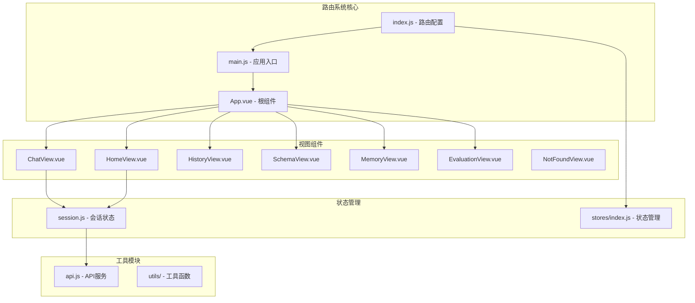

**图表来源**
- [frontend/src/router/index.js:1-157](file://frontend/src/router/index.js#L1-L157)
- [frontend/src/main.js:1-89](file://frontend/src/main.js#L1-L89)

**章节来源**
- [frontend/src/router/index.js:1-157](file://frontend/src/router/index.js#L1-L157)
- [frontend/src/main.js:1-89](file://frontend/src/main.js#L1-L89)

## 核心组件

### 路由配置系统

NL2SQL路由系统采用集中式路由配置，定义了完整的页面导航结构：

| 路由路径 | 组件名称 | 功能描述 | 会话要求 |
|---------|----------|----------|----------|
| `/` | HomeView | 首页欢迎页面 | ❌ |
| `/chat/:sessionId?` | ChatView | 聊天对话界面 | ✅ |
| `/history` | HistoryView | 查询历史记录 | ❌ |
| `/schema` | SchemaView | 数据Schema查看 | ❌ |
| `/memory` | MemoryView | 长期记忆管理 | ❌ |
| `/evaluation` | EvaluationView | 系统评估页面 | ❌ |
| `/:pathMatch(.*)*` | NotFoundView | 404页面 | - |

### 路由元信息设计

每个路由都配置了详细的元信息，用于页面标题管理和权限控制：

```javascript
meta: {
  title: '页面标题',
  requiresSession: false // 是否需要有效会话
}
```

**章节来源**
- [frontend/src/router/index.js:34-109](file://frontend/src/router/index.js#L34-L109)

## 架构概览

NL2SQL路由系统采用模块化架构设计，实现了清晰的关注点分离：

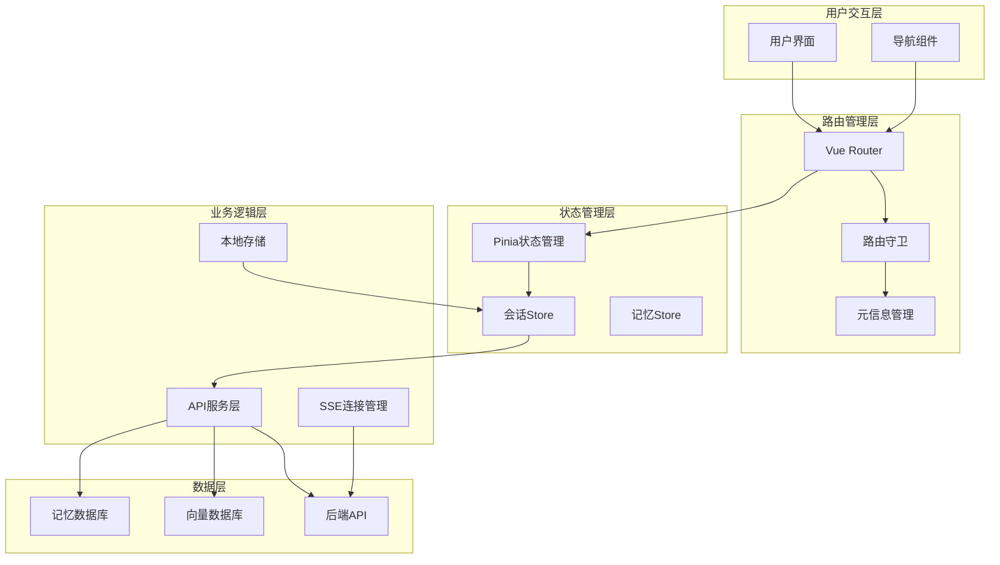

**图表来源**
- [frontend/src/router/index.js:142-150](file://frontend/src/router/index.js#L142-L150)
- [frontend/src/stores/session.js:33-399](file://frontend/src/stores/session.js#L33-L399)

## 详细组件分析

### 路由守卫系统

NL2SQL实现了全局前置路由守卫，用于统一的页面标题管理和导航控制：

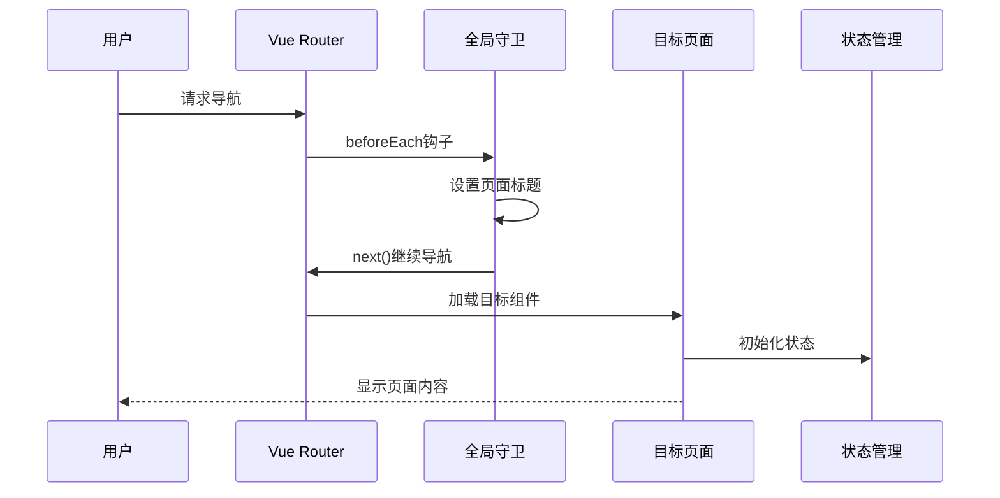

**图表来源**
- [frontend/src/router/index.js:142-150](file://frontend/src/router/index.js#L142-L150)

### 动态路由参数处理

系统支持动态路由参数，特别是会话ID的处理机制：

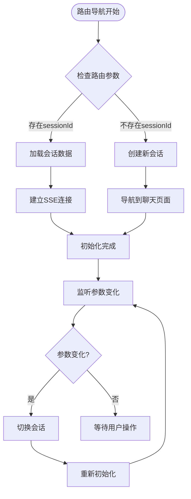

**图表来源**
- [frontend/src/views/ChatView.vue:333-361](file://frontend/src/views/ChatView.vue#L333-L361)

### 懒加载和代码分割

系统采用动态导入实现组件懒加载，优化首屏加载性能：

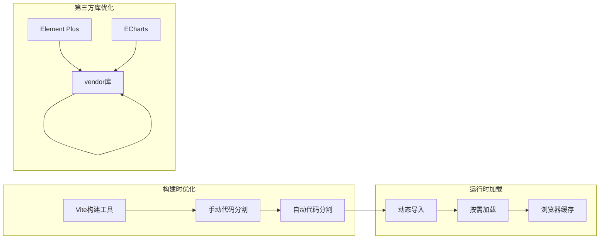

**图表来源**
- [frontend/vite.config.js:78-89](file://frontend/vite.config.js#L78-L89)

**章节来源**
- [frontend/src/router/index.js:63-89](file://frontend/src/router/index.js#L63-L89)
- [frontend/vite.config.js:78-89](file://frontend/vite.config.js#L78-L89)

### 状态管理集成

路由系统与Pinia状态管理深度集成，特别是会话状态的管理：

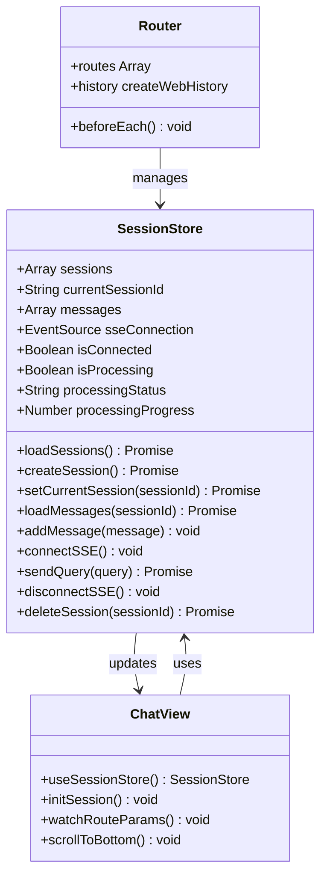

**图表来源**
- [frontend/src/stores/session.js:33-399](file://frontend/src/stores/session.js#L33-L399)
- [frontend/src/views/ChatView.vue:171-345](file://frontend/src/views/ChatView.vue#L171-L345)

**章节来源**
- [frontend/src/stores/session.js:33-399](file://frontend/src/stores/session.js#L33-L399)
- [frontend/src/views/ChatView.vue:171-345](file://frontend/src/views/ChatView.vue#L171-L345)

### API服务集成

路由系统通过API服务层实现与后端的通信：

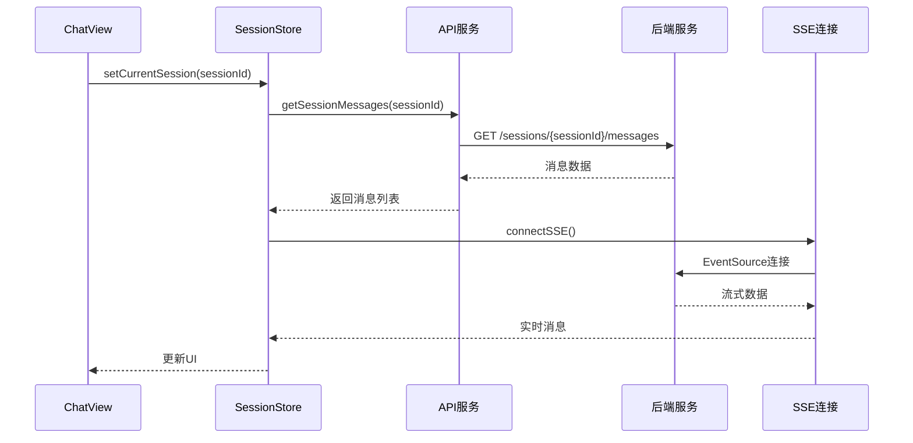

**图表来源**
- [frontend/src/stores/session.js:144-221](file://frontend/src/stores/session.js#L144-L221)
- [frontend/src/utils/api.js:246-251](file://frontend/src/utils/api.js#L246-L251)

**章节来源**
- [frontend/src/utils/api.js:246-251](file://frontend/src/utils/api.js#L246-L251)

## 依赖分析

### 外部依赖关系

NL2SQL路由系统的关键外部依赖包括：

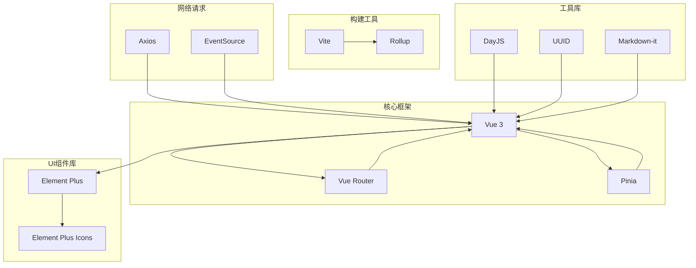

**图表来源**
- [frontend/package.json](file://frontend/package.json)

### 内部模块依赖

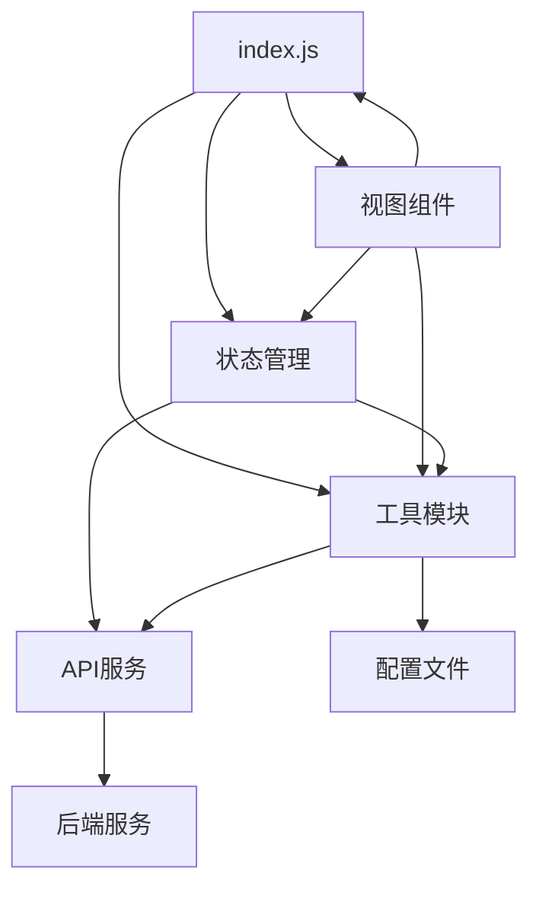

**图表来源**
- [frontend/src/router/index.js:14-25](file://frontend/src/router/index.js#L14-L25)

**章节来源**
- [frontend/src/router/index.js:14-25](file://frontend/src/router/index.js#L14-L25)

## 性能考虑

### 代码分割策略

系统采用了多层次的代码分割优化：

1. **手动代码分割**：将第三方库独立打包
2. **自动代码分割**：按需加载路由组件
3. **懒加载组件**：延迟加载重型组件

### 缓存策略

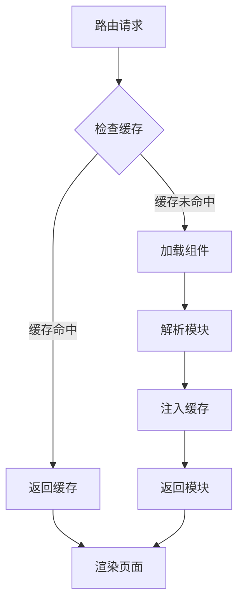

### 性能监控

系统建议的性能监控指标：
- 首次内容绘制(FCP)
- 最大内容绘制(LCP)
- 首次输入延迟(FID)
- 累积布局偏移(CLS)

## 故障排除指南

### 常见路由问题

| 问题类型 | 症状 | 解决方案 |
|---------|------|----------|
| 路由不生效 | 页面空白或404 | 检查路由配置和路径匹配 |
| 参数丢失 | 动态参数为空 | 验证路由参数传递和接收 |
| 导航异常 | 无限循环或卡死 | 检查路由守卫逻辑 |
| 懒加载失败 | 组件加载错误 | 确认动态导入路径正确 |

### 调试技巧

1. **启用Vue DevTools**：监控路由状态和组件树
2. **使用浏览器开发者工具**：检查网络请求和JavaScript错误
3. **日志记录**：在关键路由钩子中添加console.log
4. **路由调试**：使用`router.resolve()`检查路由解析

### 性能诊断

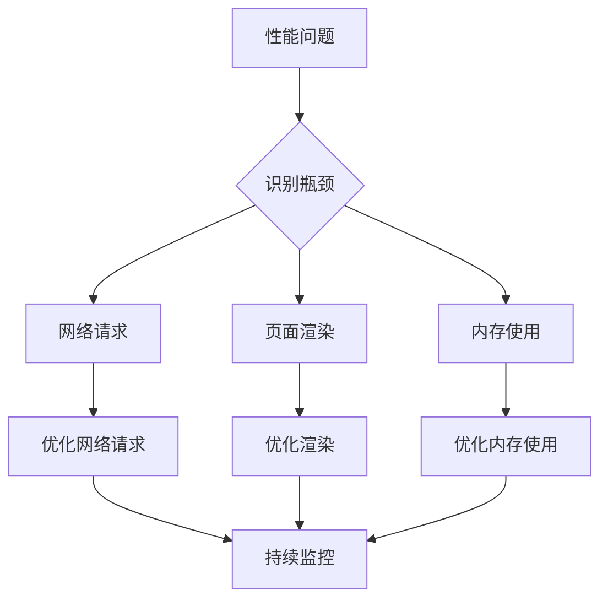

**章节来源**
- [frontend/src/router/index.js:124-132](file://frontend/src/router/index.js#L124-L132)

## 结论

NL2SQL前端路由系统展现了现代Vue.js应用的最佳实践，实现了：

1. **清晰的架构设计**：模块化路由配置和状态管理
2. **优秀的用户体验**：动态路由参数、懒加载和滚动行为
3. **完善的性能优化**：代码分割、缓存策略和资源管理
4. **可维护的代码结构**：关注点分离和依赖管理

该系统为NL2SQL项目提供了稳定可靠的前端导航基础设施，支持复杂的会话驱动工作流和多页面应用场景。通过合理的路由设计和状态管理，系统能够高效地处理自然语言到SQL的转换流程，为用户提供流畅的交互体验。