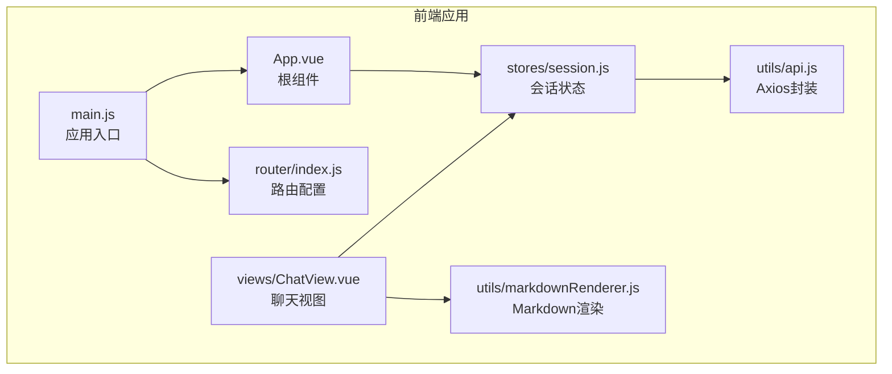
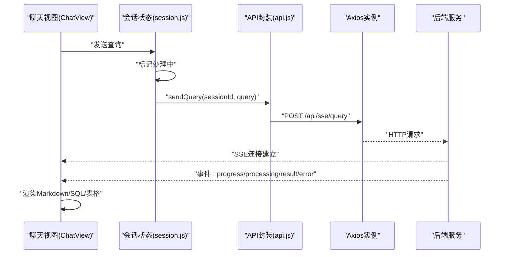
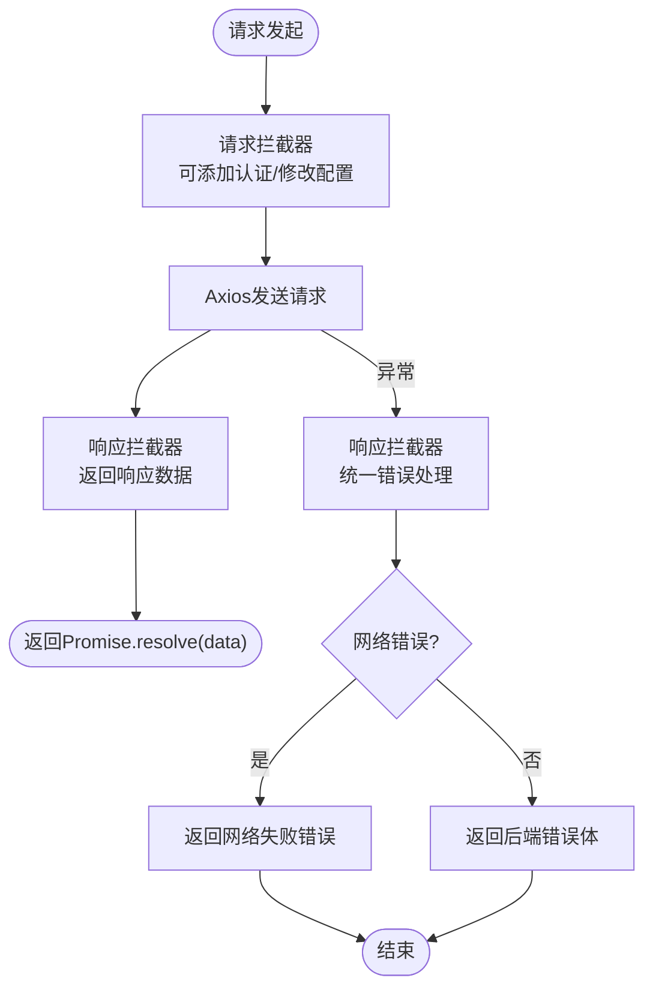
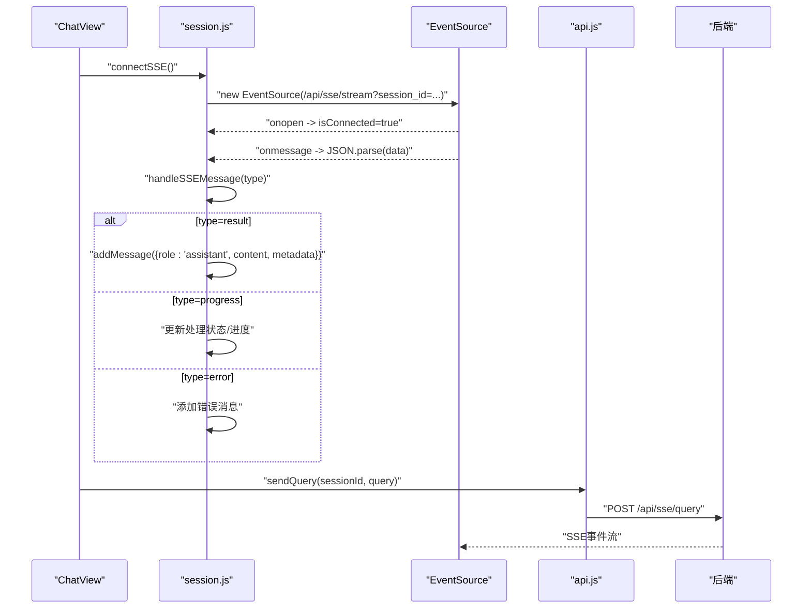
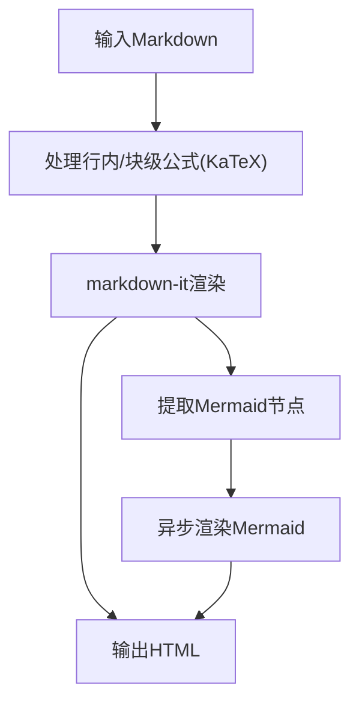
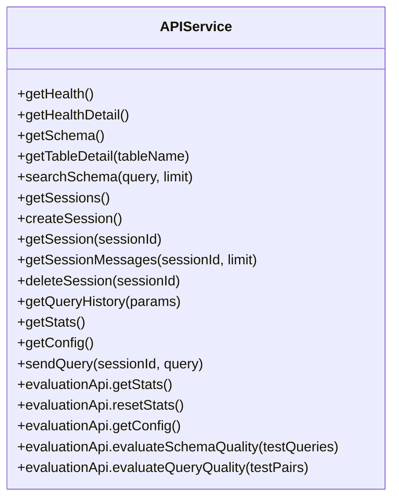
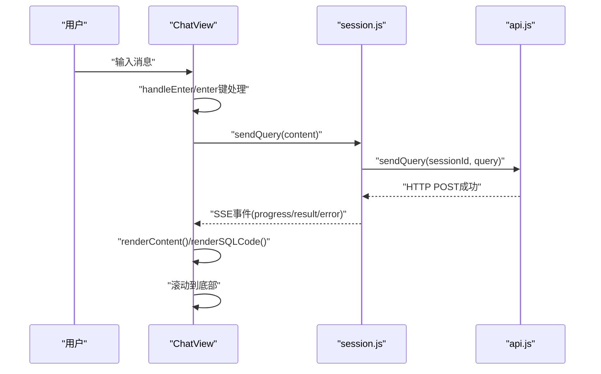
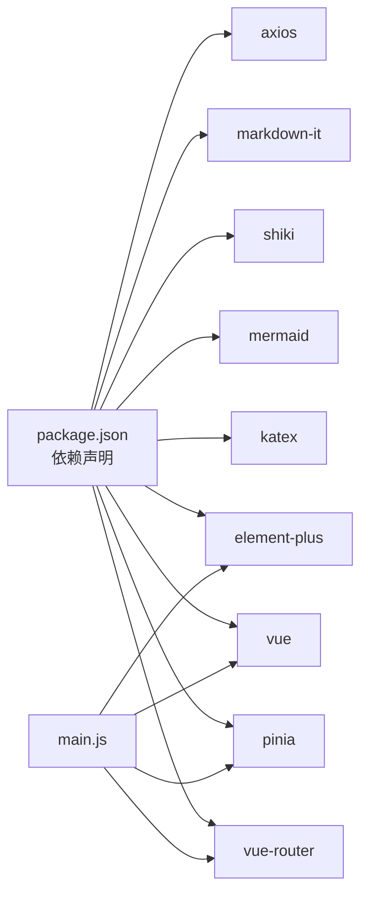

# API客户端

<cite>
**本文档引用的文件**
- [api.js](file://frontend/src/utils/api.js)
- [markdownRenderer.js](file://frontend/src/utils/markdownRenderer.js)
- [ChatView.vue](file://frontend/src/views/ChatView.vue)
- [session.js](file://frontend/src/stores/session.js)
- [main.js](file://frontend/src/main.js)
- [App.vue](file://frontend/src/App.vue)
- [index.js](file://frontend/src/router/index.js)
- [package.json](file://frontend/package.json)
</cite>

## 目录
1. [简介](#简介)
2. [项目结构](#项目结构)
3. [核心组件](#核心组件)
4. [架构总览](#架构总览)
5. [详细组件分析](#详细组件分析)
6. [依赖关系分析](#依赖关系分析)
7. [性能考量](#性能考量)
8. [故障排查指南](#故障排查指南)
9. [结论](#结论)
10. [附录](#附录)

## 简介
本文件面向NL2SQL前端API客户端，系统性梳理以下能力：
- Axios封装设计：请求/响应拦截器、错误处理机制
- SSE流式通信：Server-Sent Events连接管理、事件监听与数据解析
- Markdown渲染器集成：语法高亮、实时预览、Mermaid/KaTeX支持
- API调用模式：RESTful接口调用、参数传递与响应处理
- 扩展指南与调试技巧

目标是帮助开发者快速理解并扩展API客户端，同时为非技术读者提供清晰的概览。

## 项目结构
前端采用Vue 3 + Vite工程，核心目录与职责如下：
- utils：通用工具模块（API封装、Markdown渲染）
- views：页面视图（聊天、历史、Schema、评估等）
- stores：状态管理（会话、消息、SSE连接）
- router：路由配置
- main.js：应用入口，安装插件与挂载

**图表来源**
- [main.js:1-89](file://frontend/src/main.js#L1-L89)
- [App.vue:1-384](file://frontend/src/App.vue#L1-L384)
- [index.js:1-157](file://frontend/src/router/index.js#L1-L157)
- [session.js:1-400](file://frontend/src/stores/session.js#L1-L400)
- [api.js:1-303](file://frontend/src/utils/api.js#L1-L303)
- [markdownRenderer.js:1-258](file://frontend/src/utils/markdownRenderer.js#L1-L258)
- [ChatView.vue:1-778](file://frontend/src/views/ChatView.vue#L1-L778)

**章节来源**
- [main.js:1-89](file://frontend/src/main.js#L1-L89)
- [App.vue:1-384](file://frontend/src/App.vue#L1-L384)
- [index.js:1-157](file://frontend/src/router/index.js#L1-L157)

## 核心组件
- Axios封装模块：统一HTTP请求、拦截器与错误处理
- 会话状态模块：管理会话、消息、SSE连接与处理状态
- Markdown渲染模块：Markdown解析、代码高亮、Mermaid/KaTeX渲染
- 聊天视图：用户交互、消息渲染、SSE事件处理

**章节来源**
- [api.js:1-303](file://frontend/src/utils/api.js#L1-L303)
- [session.js:1-400](file://frontend/src/stores/session.js#L1-L400)
- [markdownRenderer.js:1-258](file://frontend/src/utils/markdownRenderer.js#L1-L258)
- [ChatView.vue:1-778](file://frontend/src/views/ChatView.vue#L1-L778)

## 架构总览
前端通过Axios封装与后端REST API通信；聊天视图通过会话状态模块发起SSE连接，接收后端流式事件并渲染Markdown与SQL高亮。

**图表来源**
- [ChatView.vue:196-214](file://frontend/src/views/ChatView.vue#L196-L214)
- [session.js:297-330](file://frontend/src/stores/session.js#L297-L330)
- [api.js:246-251](file://frontend/src/utils/api.js#L246-L251)

## 详细组件分析

### Axios封装设计
- 基础配置：baseURL、超时、Content-Type
- 请求拦截器：可注入认证信息（示例预留）
- 响应拦截器：统一返回响应数据，统一错误处理
- API导出：健康检查、Schema、会话、查询历史、统计、配置、SSE查询、评估接口

**图表来源**
- [api.js:25-34](file://frontend/src/utils/api.js#L25-L34)
- [api.js:44-57](file://frontend/src/utils/api.js#L44-L57)
- [api.js:67-88](file://frontend/src/utils/api.js#L67-L88)

**章节来源**
- [api.js:1-303](file://frontend/src/utils/api.js#L1-L303)

### SSE流式通信实现
- 连接管理：EventSource连接、断开、状态标志
- 事件监听：onopen/onmessage/onerror
- 数据解析：JSON.parse事件数据，分发到handleSSEMessage
- 事件类型：connected/processing/progress/result/clarify/error
- 查询提交：sendQuery通过HTTP POST触发后端流式输出

**图表来源**
- [session.js:185-221](file://frontend/src/stores/session.js#L185-L221)
- [session.js:227-295](file://frontend/src/stores/session.js#L227-L295)
- [session.js:297-330](file://frontend/src/stores/session.js#L297-L330)
- [ChatView.vue:324-327](file://frontend/src/views/ChatView.vue#L324-L327)

**章节来源**
- [session.js:1-400](file://frontend/src/stores/session.js#L1-L400)
- [ChatView.vue:1-778](file://frontend/src/views/ChatView.vue#L1-L778)

### Markdown渲染器集成
- 渲染引擎：markdown-it + Shiki（代码高亮）+ Mermaid（图表）+ KaTeX（公式）
- 初始化：Mermaid配置、Shiki异步初始化
- 渲染流程：先处理数学公式，再渲染Markdown，最后异步渲染Mermaid
- SQL高亮：renderSQL使用Shiki，降级回简单高亮
- 导出：renderMarkdown/renderSQL/highlightCode/renderMermaidCharts

**图表来源**
- [markdownRenderer.js:74-100](file://frontend/src/utils/markdownRenderer.js#L74-L100)
- [markdownRenderer.js:124-150](file://frontend/src/utils/markdownRenderer.js#L124-L150)
- [markdownRenderer.js:181-196](file://frontend/src/utils/markdownRenderer.js#L181-L196)
- [markdownRenderer.js:156-170](file://frontend/src/utils/markdownRenderer.js#L156-L170)

**章节来源**
- [markdownRenderer.js:1-258](file://frontend/src/utils/markdownRenderer.js#L1-L258)

### API调用模式
- RESTful接口：get/post/delete等方法封装，统一返回response.data
- 参数传递：params/JSON body，支持limit、q等查询参数
- 响应处理：统一错误处理，网络错误/请求错误/服务器错误分类
- SSE查询：sendQuery通过HTTP POST触发后端流式输出

**图表来源**
- [api.js:98-108](file://frontend/src/utils/api.js#L98-L108)
- [api.js:118-141](file://frontend/src/utils/api.js#L118-L141)
- [api.js:151-195](file://frontend/src/utils/api.js#L151-L195)
- [api.js:206-208](file://frontend/src/utils/api.js#L206-L208)
- [api.js:218-220](file://frontend/src/utils/api.js#L218-L220)
- [api.js:230-232](file://frontend/src/utils/api.js#L230-L232)
- [api.js:246-251](file://frontend/src/utils/api.js#L246-L251)
- [api.js:260-302](file://frontend/src/utils/api.js#L260-L302)

**章节来源**
- [api.js:1-303](file://frontend/src/utils/api.js#L1-L303)

### 聊天视图与状态联动
- 用户输入：回车发送，Shift+Enter换行
- 消息渲染：Markdown渲染、SQL高亮、数据表格展示
- SSE生命周期：组件挂载时初始化会话并连接SSE，卸载时断开
- 处理状态：进度条、打字动画、状态文本

**图表来源**
- [ChatView.vue:220-229](file://frontend/src/views/ChatView.vue#L220-L229)
- [ChatView.vue:265-280](file://frontend/src/views/ChatView.vue#L265-L280)
- [ChatView.vue:313-345](file://frontend/src/views/ChatView.vue#L313-L345)
- [session.js:297-330](file://frontend/src/stores/session.js#L297-L330)

**章节来源**
- [ChatView.vue:1-778](file://frontend/src/views/ChatView.vue#L1-L778)
- [session.js:1-400](file://frontend/src/stores/session.js#L1-L400)

## 依赖关系分析
- 依赖项：axios、markdown-it、shiki、mermaid、katex、element-plus、vue、pinia、vue-router
- 插件安装：main.js中安装router、pinia、Element Plus并注册图标
- 路由：index.js定义多页面路由，支持懒加载与滚动行为

**图表来源**
- [package.json:11-28](file://frontend/package.json#L11-L28)
- [main.js:28-69](file://frontend/src/main.js#L28-L69)

**章节来源**
- [package.json:1-36](file://frontend/package.json#L1-L36)
- [main.js:1-89](file://frontend/src/main.js#L1-L89)
- [index.js:1-157](file://frontend/src/router/index.js#L1-L157)

## 性能考量
- Axios拦截器链路短、同步开销低，建议仅做必要处理（如鉴权）
- SSE事件解析在主线程，建议后端控制事件粒度，避免过密事件导致UI卡顿
- Markdown渲染与Mermaid异步渲染，避免阻塞主线程
- Shiki高亮异步初始化，首次渲染可能延迟，建议预热或缓存主题/语言集

[本节为通用指导，无需特定文件来源]

## 故障排查指南
- Axios错误分类
  - 网络错误：请求发送但无响应，统一返回“网络连接失败”
  - 请求错误：请求配置问题，返回message
  - 服务器错误：返回后端错误体
- SSE连接问题
  - onerror：记录错误并置断开状态
  - onmessage：JSON解析失败时记录日志
  - 未连接：sendQuery前检查readyState
- Markdown渲染问题
  - KaTeX渲染失败：捕获异常并降级为错误占位
  - Mermaid渲染失败：捕获异常并降级为错误提示

**章节来源**
- [api.js:72-87](file://frontend/src/utils/api.js#L72-L87)
- [session.js:213-217](file://frontend/src/stores/session.js#L213-L217)
- [session.js:204-211](file://frontend/src/stores/session.js#L204-L211)
- [session.js:302-306](file://frontend/src/stores/session.js#L302-L306)
- [markdownRenderer.js:164-169](file://frontend/src/utils/markdownRenderer.js#L164-L169)
- [markdownRenderer.js:87-94](file://frontend/src/utils/markdownRenderer.js#L87-L94)

## 结论
本API客户端以Axios为核心，结合SSE实现流式交互，配合Markdown渲染器提供丰富的可视化体验。通过会话状态模块统一管理连接与消息，聊天视图负责用户交互与渲染。整体架构清晰、职责分离，便于扩展与维护。

[本节为总结，无需特定文件来源]

## 附录

### API客户端扩展指南
- 新增REST接口
  - 在api.js中新增方法，遵循现有命名与参数风格
  - 如需鉴权，在请求拦截器中注入token
- 新增SSE事件类型
  - 在session.js的handleSSEMessage中新增分支处理
  - 在ChatView中补充UI反馈（状态/进度/提示）
- Markdown增强
  - 在markdownRenderer.js中扩展高亮语言或主题
  - 增加自定义渲染规则（如表格/链接处理）

**章节来源**
- [api.js:1-303](file://frontend/src/utils/api.js#L1-L303)
- [session.js:1-400](file://frontend/src/stores/session.js#L1-L400)
- [markdownRenderer.js:1-258](file://frontend/src/utils/markdownRenderer.js#L1-L258)

### 调试技巧
- 浏览器控制台
  - 查看Axios拦截器日志与错误堆栈
  - 观察SSE连接状态与事件流
- Vue DevTools
  - 检查Pinia状态（sessions/messages/isConnected等）
  - 监听组件渲染与props变化
- 网络面板
  - 过滤XHR/Fetch，观察请求/响应头与体
  - 查看SSE连接的EventStream

[本节为通用指导，无需特定文件来源]