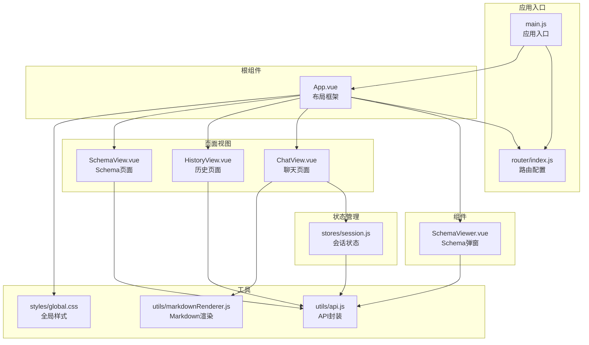
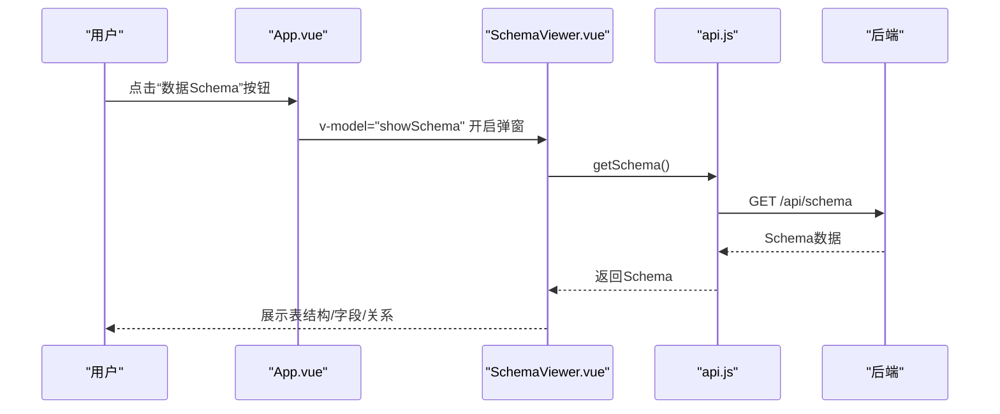
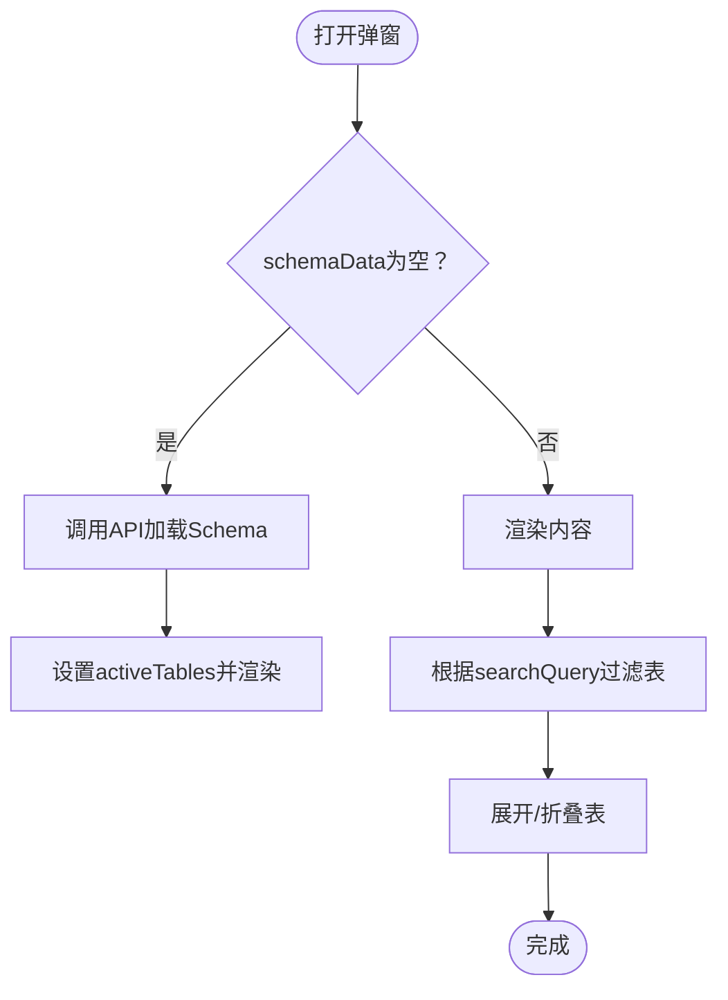
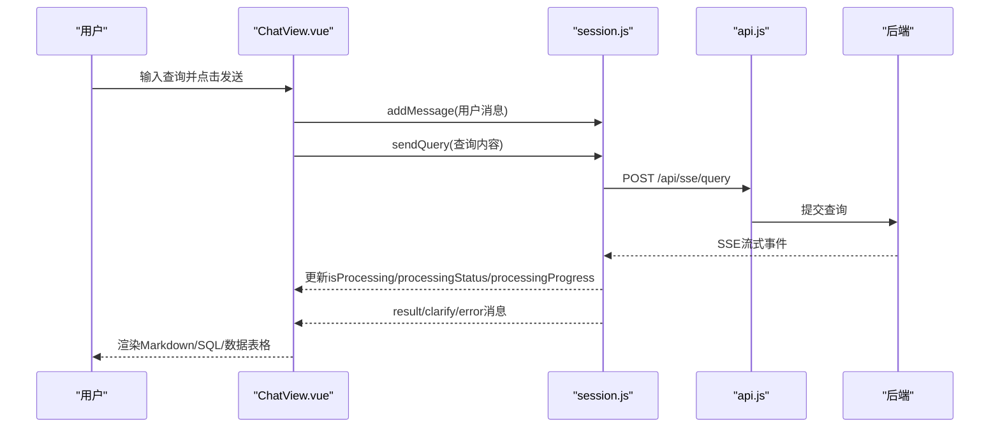
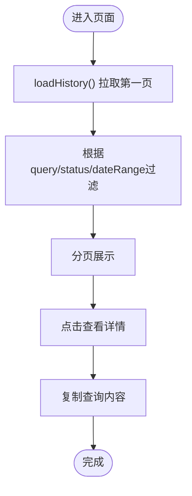
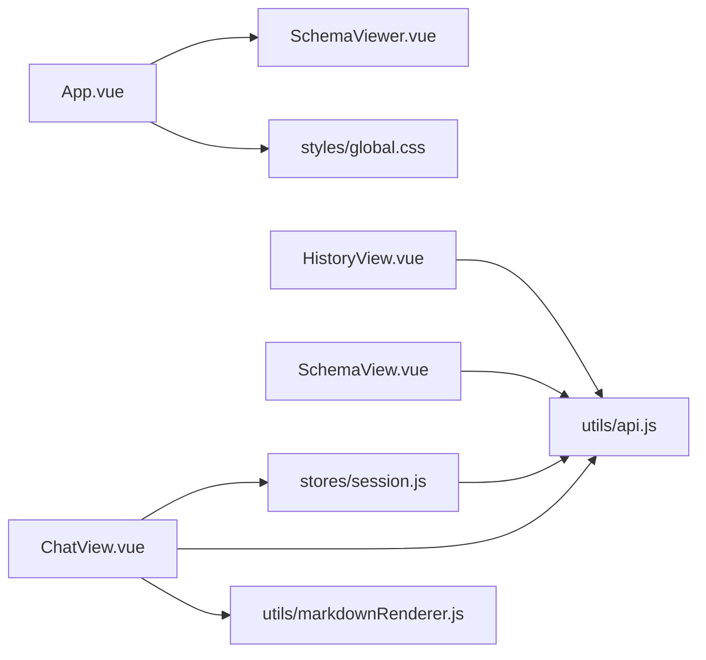

# UI组件

<cite>
**本文档引用的文件**
- [SchemaViewer.vue](file://frontend/src/components/SchemaViewer.vue)
- [ChatView.vue](file://frontend/src/views/ChatView.vue)
- [HistoryView.vue](file://frontend/src/views/HistoryView.vue)
- [SchemaView.vue](file://frontend/src/views/SchemaView.vue)
- [App.vue](file://frontend/src/App.vue)
- [session.js](file://frontend/src/stores/session.js)
- [api.js](file://frontend/src/utils/api.js)
- [router/index.js](file://frontend/src/router/index.js)
- [main.js](file://frontend/src/main.js)
- [global.css](file://frontend/src/styles/global.css)
- [markdownRenderer.js](file://frontend/src/utils/markdownRenderer.js)
</cite>

## 目录
1. [简介](#简介)
2. [项目结构](#项目结构)
3. [核心组件](#核心组件)
4. [架构总览](#架构总览)
5. [详细组件分析](#详细组件分析)
6. [依赖分析](#依赖分析)
7. [性能考虑](#性能考虑)
8. [故障排查指南](#故障排查指南)
9. [结论](#结论)
10. [附录](#附录)

## 简介
本设计文档聚焦NL2SQL前端UI组件，围绕核心界面组件SchemaViewer、ChatView、HistoryView展开，系统阐述其设计理念、实现方式、组件属性与事件、插槽使用、组件间通信模式、响应式设计与样式定制策略。文档旨在帮助开发者快速理解并高效扩展这些组件。

## 项目结构
前端采用Vue 3 + Vite + Pinia + Element Plus技术栈，采用单页应用架构，路由驱动页面切换，状态集中管理，组件职责清晰。

**图表来源**
- [main.js:1-89](file://frontend/src/main.js#L1-L89)
- [router/index.js:1-157](file://frontend/src/router/index.js#L1-L157)
- [App.vue:1-384](file://frontend/src/App.vue#L1-L384)
- [ChatView.vue:1-778](file://frontend/src/views/ChatView.vue#L1-L778)
- [HistoryView.vue:1-441](file://frontend/src/views/HistoryView.vue#L1-L441)
- [SchemaView.vue:1-322](file://frontend/src/views/SchemaView.vue#L1-L322)
- [SchemaViewer.vue:1-317](file://frontend/src/components/SchemaViewer.vue#L1-L317)
- [session.js:1-400](file://frontend/src/stores/session.js#L1-L400)
- [api.js:1-303](file://frontend/src/utils/api.js#L1-L303)
- [markdownRenderer.js:1-258](file://frontend/src/utils/markdownRenderer.js#L1-L258)
- [global.css:1-317](file://frontend/src/styles/global.css#L1-L317)

**章节来源**
- [main.js:1-89](file://frontend/src/main.js#L1-L89)
- [router/index.js:1-157](file://frontend/src/router/index.js#L1-L157)
- [App.vue:1-384](file://frontend/src/App.vue#L1-L384)

## 核心组件
- SchemaViewer：以弹窗形式展示数据Schema，支持搜索、折叠展开、字段高亮、主键标识、关联关系展示。
- ChatView：对话式查询界面，支持Markdown渲染、SQL代码高亮、数据表格展示、SSE流式处理、消息折叠/展开、复制SQL。
- HistoryView：查询历史列表，支持筛选（关键词、状态、日期范围）、分页、查看详情弹窗、复制查询。
- SchemaView：Schema完整展示页面，包含表结构、指标、维度、关系四个标签页，适合深度浏览。

**章节来源**
- [SchemaViewer.vue:1-317](file://frontend/src/components/SchemaViewer.vue#L1-L317)
- [ChatView.vue:1-778](file://frontend/src/views/ChatView.vue#L1-L778)
- [HistoryView.vue:1-441](file://frontend/src/views/HistoryView.vue#L1-L441)
- [SchemaView.vue:1-322](file://frontend/src/views/SchemaView.vue#L1-L322)

## 架构总览
组件间通信采用“根组件桥接 + Pinia状态 + 路由驱动”的模式：
- 根组件App.vue作为布局与事件中枢，控制SchemaViewer弹窗开关，协调会话列表与路由跳转。
- ChatView通过Pinia会话store与后端SSE交互，实时接收处理状态、进度与结果。
- HistoryView与SchemaView分别通过API模块访问后端REST接口，独立维护自身状态。
- 全局样式与渲染工具贯穿各组件，保证一致的视觉与交互体验。

**图表来源**
- [App.vue:80-82](file://frontend/src/App.vue#L80-L82)
- [SchemaViewer.vue:6-86](file://frontend/src/components/SchemaViewer.vue#L6-L86)
- [api.js:118-120](file://frontend/src/utils/api.js#L118-L120)

**章节来源**
- [App.vue:1-384](file://frontend/src/App.vue#L1-L384)
- [SchemaViewer.vue:1-317](file://frontend/src/components/SchemaViewer.vue#L1-L317)
- [api.js:1-303](file://frontend/src/utils/api.js#L1-L303)

## 详细组件分析

### SchemaViewer 组件
- 设计理念：以弹窗承载Schema浏览，避免页面跳转，提供搜索与折叠能力，提升大Schema下的可读性。
- 关键属性与事件
  - 属性：modelValue（Boolean）控制显示/隐藏，基于computed实现v-model双向绑定。
  - 事件：update:modelValue（内部触发），用于父组件同步显示状态。
- 数据与状态
  - 响应式状态：loading、schemaData（tables/relationships/metrics/dimensions）、searchQuery、activeTables。
  - 计算属性：filteredTables（关键词过滤）。
  - 方法：loadSchema（懒加载）、getTableRelations/formatRelation（关系展示）、tableTitle（标题格式化）。
- 插槽与作用域插槽：未使用具名/作用域插槽，采用默认插槽与模板插槽满足内容渲染。
- 交互优化：骨架屏、空状态、折叠面板、主键标签、关系标签、代码高亮。

**图表来源**
- [SchemaViewer.vue:252-256](file://frontend/src/components/SchemaViewer.vue#L252-L256)
- [SchemaViewer.vue:191-208](file://frontend/src/components/SchemaViewer.vue#L191-L208)
- [SchemaViewer.vue:157-182](file://frontend/src/components/SchemaViewer.vue#L157-L182)

**章节来源**
- [SchemaViewer.vue:1-317](file://frontend/src/components/SchemaViewer.vue#L1-L317)

### ChatView 组件
- 设计理念：提供自然语言到SQL的对话式体验，支持Markdown/SQL渲染、数据表格、SSE流式反馈、消息折叠与复制。
- 关键属性与事件：未定义props；通过Pinia store暴露的messages/isProcessing等响应式状态驱动视图。
- 数据与状态
  - 响应式状态：inputMessage、messages（来自store）、isProcessing/processingStatus/processingProgress（来自store）、expandedMessages（本地展开状态）。
  - 计算属性：computed包装store状态，确保视图响应式更新。
  - 方法：sendMessage（发送查询）、handleEnter（回车/换行处理）、isLongContent/toggleExpand（长消息折叠）、renderContent/renderSQLCode（渲染Markdown/SQL）、copySQL（复制）、scrollToBottom（自动滚动）。
- 生命周期：onMounted初始化会话并连接SSE；onUnmounted断开SSE；watch监听路由参数与消息变化自动滚动。
- 交互优化：打字动画、进度条、欢迎消息、消息气泡样式、Markdown样式覆盖、SQL代码块复制。

**图表来源**
- [ChatView.vue:196-214](file://frontend/src/views/ChatView.vue#L196-L214)
- [session.js:301-330](file://frontend/src/stores/session.js#L301-L330)
- [api.js:246-251](file://frontend/src/utils/api.js#L246-L251)

**章节来源**
- [ChatView.vue:1-778](file://frontend/src/views/ChatView.vue#L1-L778)
- [session.js:1-400](file://frontend/src/stores/session.js#L1-L400)
- [api.js:1-303](file://frontend/src/utils/api.js#L1-L303)

### HistoryView 组件
- 设计理念：集中展示查询历史，支持多维筛选、分页、详情弹窗与复制操作。
- 关键属性与事件：未定义props；通过本地状态管理历史列表与筛选条件。
- 数据与状态
  - 响应式状态：loading、historyList、filter（query/status/dateRange）、pagination（page/pageSize/total）、detailVisible、selectedItem。
  - 计算属性：filteredHistory（三条件组合过滤）。
  - 方法：loadHistory（分页拉取）、formatTime（时间格式化）、viewDetail/copyQuery（详情与复制）、handleSizeChange/handlePageChange（分页回调）。
- 交互优化：骨架屏、空状态、Hover态、分页布局、详情弹窗。

**图表来源**
- [HistoryView.vue:226-243](file://frontend/src/views/HistoryView.vue#L226-L243)
- [HistoryView.vue:190-217](file://frontend/src/views/HistoryView.vue#L190-L217)
- [HistoryView.vue:258-271](file://frontend/src/views/HistoryView.vue#L258-L271)

**章节来源**
- [HistoryView.vue:1-441](file://frontend/src/views/HistoryView.vue#L1-L441)

### SchemaView 组件
- 设计理念：完整Schema页面，四标签页（表结构/指标/维度/关系），适合深度浏览与对比。
- 关键属性与事件：未定义props；通过本地状态管理schemaData与activeTab。
- 数据与状态
  - 响应式状态：activeTab、schemaData（tables/relationships/metrics/dimensions）。
  - 方法：loadSchema（一次性加载）。
- 交互优化：网格布局、卡片样式、标签页滚动容器、代码高亮。

**章节来源**
- [SchemaView.vue:1-322](file://frontend/src/views/SchemaView.vue#L1-L322)

## 依赖分析
- 组件依赖
  - App.vue依赖SchemaViewer组件并通过v-model控制显示。
  - ChatView依赖Pinia会话store与API模块，通过SSE与后端交互。
  - HistoryView与SchemaView依赖API模块进行REST调用。
- 状态依赖
  - ChatView通过computed读取store状态，避免直接修改store。
  - HistoryView与SchemaView维护本地状态，减少全局耦合。
- 外部依赖
  - Element Plus提供UI组件与图标。
  - markdown-it、Shiki、KaTeX、Mermaid用于内容渲染。
  - Day.js用于日期格式化。
  - Axios用于HTTP请求封装。

**图表来源**
- [App.vue:118-118](file://frontend/src/App.vue#L118-L118)
- [ChatView.vue:150-152](file://frontend/src/views/ChatView.vue#L150-L152)
- [session.js:1-400](file://frontend/src/stores/session.js#L1-L400)
- [api.js:1-303](file://frontend/src/utils/api.js#L1-L303)
- [markdownRenderer.js:1-258](file://frontend/src/utils/markdownRenderer.js#L1-L258)
- [global.css:1-317](file://frontend/src/styles/global.css#L1-L317)

**章节来源**
- [App.vue:1-384](file://frontend/src/App.vue#L1-L384)
- [ChatView.vue:1-778](file://frontend/src/views/ChatView.vue#L1-L778)
- [HistoryView.vue:1-441](file://frontend/src/views/HistoryView.vue#L1-L441)
- [SchemaView.vue:1-322](file://frontend/src/views/SchemaView.vue#L1-L322)
- [session.js:1-400](file://frontend/src/stores/session.js#L1-L400)
- [api.js:1-303](file://frontend/src/utils/api.js#L1-L303)
- [markdownRenderer.js:1-258](file://frontend/src/utils/markdownRenderer.js#L1-L258)
- [global.css:1-317](file://frontend/src/styles/global.css#L1-L317)

## 性能考虑
- 渲染优化
  - ChatView对长消息采用折叠与渐隐遮罩，减少DOM节点数量与重排成本。
  - SchemaViewer与SchemaView使用骨架屏与空状态，改善首屏体验。
- 状态管理
  - ChatView通过computed包装store状态，避免不必要的重渲染。
  - HistoryView仅在分页/筛选变更时触发API请求。
- 网络与流式
  - ChatView使用SSE流式接收，逐步更新处理状态与进度，避免一次性大量数据传输。
- 渲染工具
  - Markdown渲染与SQL高亮采用异步初始化与延迟渲染，降低首屏阻塞风险。

[本节为通用性能建议，无需特定文件引用]

## 故障排查指南
- ChatView无法接收SSE
  - 检查store中connectSSE是否正确建立EventSource，以及sendQuery是否在连接状态下调用。
  - 确认路由参数sessionId与当前会话匹配。
- SchemaViewer不显示数据
  - 确认visible计算属性与modelValue绑定正常，watch在打开时触发loadSchema。
  - 检查API.getSchema返回的数据结构是否符合schemaData预期。
- HistoryView分页异常
  - 确认handleSizeChange与handlePageChange正确更新pagination并重新拉取数据。
  - 检查API.getQueryHistory返回的count与history字段。
- 复制功能失败
  - 检查浏览器Clipboard API权限与兼容性，捕获错误并提示用户。

**章节来源**
- [session.js:185-221](file://frontend/src/stores/session.js#L185-L221)
- [session.js:301-330](file://frontend/src/stores/session.js#L301-L330)
- [SchemaViewer.vue:252-256](file://frontend/src/components/SchemaViewer.vue#L252-L256)
- [HistoryView.vue:277-289](file://frontend/src/views/HistoryView.vue#L277-L289)

## 结论
NL2SQL UI组件以清晰的职责划分与稳定的通信机制实现了良好的用户体验：SchemaViewer提供轻量弹窗浏览，ChatView实现流畅的对话式查询，HistoryView与SchemaView分别承担历史与完整Schema的展示。通过Pinia集中状态、Element Plus统一UI、markdownRenderer增强内容表达，整体具备良好的可维护性与扩展性。

[本节为总结性内容，无需特定文件引用]

## 附录

### 组件属性、事件与插槽使用清单
- SchemaViewer
  - 属性：modelValue（Boolean）
  - 事件：update:modelValue
  - 插槽：默认插槽（模板插槽用于字段列）
- ChatView
  - 属性：无
  - 事件：无
  - 插槽：无
- HistoryView
  - 属性：无
  - 事件：无
  - 插槽：无
- SchemaView
  - 属性：无
  - 事件：无
  - 插槽：无

**章节来源**
- [SchemaViewer.vue:112-123](file://frontend/src/components/SchemaViewer.vue#L112-L123)
- [ChatView.vue:1-778](file://frontend/src/views/ChatView.vue#L1-L778)
- [HistoryView.vue:1-441](file://frontend/src/views/HistoryView.vue#L1-L441)
- [SchemaView.vue:1-322](file://frontend/src/views/SchemaView.vue#L1-L322)

### 组件间通信模式
- 父子通信
  - App.vue与SchemaViewer：通过v-model双向绑定控制弹窗显示。
- 兄弟组件通信
  - 通过路由与Pinia共享状态（如会话ID、消息列表）。
- 跨层级通信
  - ChatView通过Pinia store与后端SSE解耦，避免层层透传。

**章节来源**
- [App.vue:80-82](file://frontend/src/App.vue#L80-L82)
- [ChatView.vue:172-180](file://frontend/src/views/ChatView.vue#L172-L180)

### 响应式设计与布局适配
- 全局样式
  - 基础重置、Flex工具类、滚动条样式、动画效果。
- 移动端适配
  - 侧边栏在移动端可折叠/滑出，配合全局媒体查询。
- 组件内适配
  - ChatView消息区域自适应高度，输入区域绝对定位，避免布局抖动。
  - SchemaView标签页内容滚动，Grid布局自适应列数。

**章节来源**
- [global.css:1-317](file://frontend/src/styles/global.css#L1-L317)
- [ChatView.vue:390-777](file://frontend/src/views/ChatView.vue#L390-L777)
- [SchemaView.vue:209-321](file://frontend/src/views/SchemaView.vue#L209-L321)

### 组件复用策略与样式定制指南
- 复用策略
  - 将公共UI元素（如Avatar、Tag、Button）抽象为可复用片段，避免重复代码。
  - 将渲染逻辑（Markdown/SQL）抽离为工具函数，便于在多个组件中复用。
- 样式定制
  - 使用Element Plus主题变量与全局CSS变量统一风格。
  - 通过scoped样式与深度选择器(:deep)控制组件内部样式，避免污染。
  - 为关键交互（如消息气泡、代码块）定义通用类名，便于一致性维护。

**章节来源**
- [global.css:184-317](file://frontend/src/styles/global.css#L184-L317)
- [ChatView.vue:489-742](file://frontend/src/views/ChatView.vue#L489-L742)
- [SchemaViewer.vue:259-316](file://frontend/src/components/SchemaViewer.vue#L259-L316)