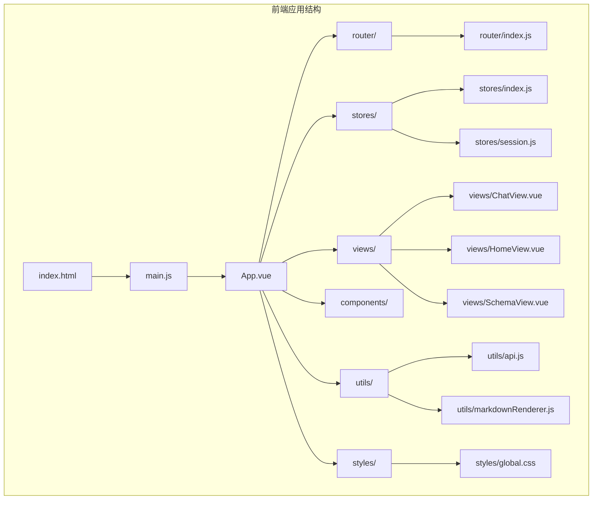
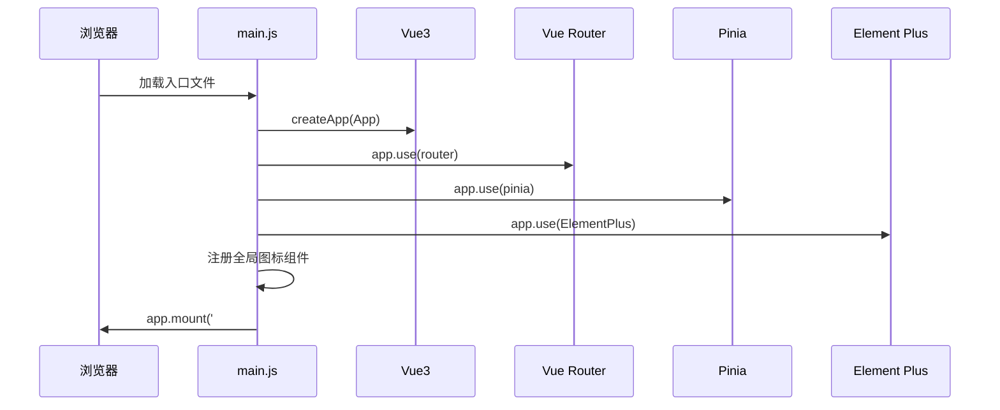
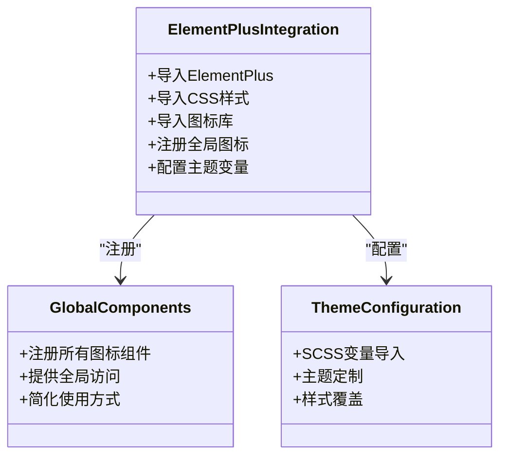
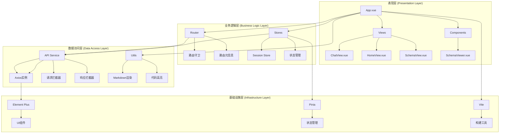
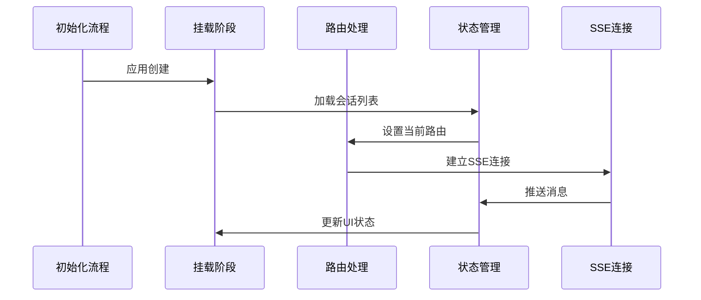
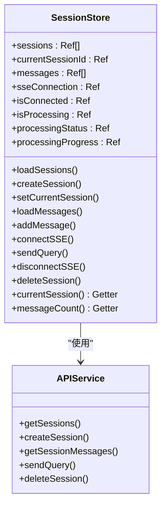
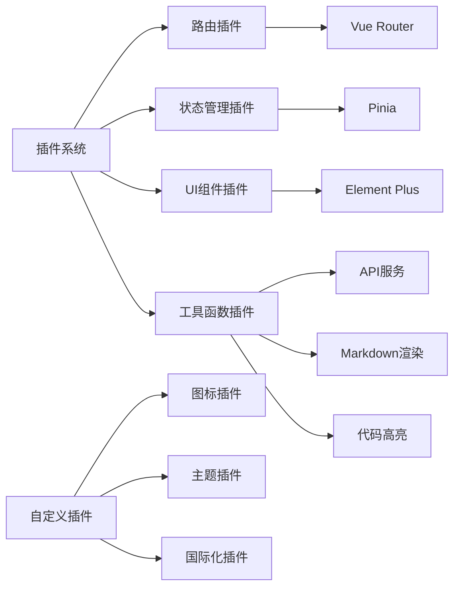

# Vue3应用架构

<cite>
**本文档引用的文件**
- [main.js](file://frontend/src/main.js)
- [vite.config.js](file://frontend/vite.config.js)
- [package.json](file://frontend/package.json)
- [App.vue](file://frontend/src/App.vue)
- [router/index.js](file://frontend/src/router/index.js)
- [stores/index.js](file://frontend/src/stores/index.js)
- [stores/session.js](file://frontend/src/stores/session.js)
- [styles/global.css](file://frontend/src/styles/global.css)
- [utils/api.js](file://frontend/src/utils/api.js)
- [utils/markdownRenderer.js](file://frontend/src/utils/markdownRenderer.js)
- [views/ChatView.vue](file://frontend/src/views/ChatView.vue)
- [views/HomeView.vue](file://frontend/src/views/HomeView.vue)
- [index.html](file://frontend/index.html)
</cite>

## 目录
1. [简介](#简介)
2. [项目结构](#项目结构)
3. [核心组件](#核心组件)
4. [架构概览](#架构概览)
5. [详细组件分析](#详细组件分析)
6. [依赖关系分析](#依赖关系分析)
7. [性能考虑](#性能考虑)
8. [故障排除指南](#故障排除指南)
9. [结论](#结论)

## 简介

NL2SQL Vue3应用是一个基于Vue3技术栈构建的自然语言数据查询系统。该应用通过自然语言描述自动生成SQL查询，为用户提供智能化的数据洞察服务。应用采用现代化的前端架构，集成了Element Plus UI组件库、Pinia状态管理和Vite构建工具，提供了完整的开发和部署体验。

## 项目结构

NL2SQL项目采用清晰的分层架构设计，主要分为前端和后端两个独立的应用程序。前端应用位于`frontend`目录下，采用Vue3 Composition API和单文件组件（SFC）模式。



**图表来源**
- [main.js:1-89](file://frontend/src/main.js#L1-L89)
- [App.vue:1-384](file://frontend/src/App.vue#L1-L384)

**章节来源**
- [main.js:1-89](file://frontend/src/main.js#L1-L89)
- [index.html:1-33](file://frontend/index.html#L1-L33)

## 核心组件

### 应用入口点设计

应用入口点位于`frontend/src/main.js`，采用标准的Vue3应用创建和插件安装流程：



**图表来源**
- [main.js:55-88](file://frontend/src/main.js#L55-L88)

应用入口点的核心职责包括：
1. **Vue应用实例创建**：使用`createApp`函数创建Vue3应用实例
2. **插件安装顺序**：按照路由 → 状态管理 → UI组件库的顺序安装插件
3. **全局组件注册**：注册Element Plus图标为全局组件
4. **应用挂载**：将应用挂载到DOM元素上

**章节来源**
- [main.js:14-88](file://frontend/src/main.js#L14-L88)

### Element Plus UI组件库集成

应用深度集成了Element Plus UI组件库，实现了完整的UI组件生态系统：



**图表来源**
- [main.js:37-80](file://frontend/src/main.js#L37-L80)
- [vite.config.js:62-68](file://frontend/vite.config.js#L62-L68)

集成特点：
1. **图标注册**：遍历Element Plus图标库，注册为全局组件
2. **主题配置**：通过SCSS变量导入实现主题定制
3. **全局样式管理**：集中管理应用样式和主题变量

**章节来源**
- [main.js:37-80](file://frontend/src/main.js#L37-L80)
- [vite.config.js:60-68](file://frontend/vite.config.js#L60-L68)

### Vite构建工具配置

Vite作为构建工具提供了现代化的开发体验：

```mermaid
flowchart TD
A[Vite配置] --> B[开发服务器]
A --> C[路径别名]
A --> D[插件系统]
A --> E[CSS配置]
A --> F[构建优化]
B --> B1[端口配置: 5173]
B --> B2[自动打开浏览器]
B --> B3[代理配置]
C --> C1[@指向src目录]
C --> C2[@components指向components]
C --> C3[@views指向views]
D --> D1[Vue插件]
E --> E1[SCSS预处理器]
E --> E2[变量导入]
F --> F1[代码分割]
F --> F2[手动分块]
F --> F3[第三方库分离]
```

**图表来源**
- [vite.config.js:17-92](file://frontend/vite.config.js#L17-L92)

**章节来源**
- [vite.config.js:17-92](file://frontend/vite.config.js#L17-L92)

## 架构概览

NL2SQL应用采用MVVM架构模式，结合现代前端开发的最佳实践：



**图表来源**
- [App.vue:1-384](file://frontend/src/App.vue#L1-L384)
- [router/index.js:1-157](file://frontend/src/router/index.js#L1-L157)
- [stores/session.js:1-400](file://frontend/src/stores/session.js#L1-L400)
- [utils/api.js:1-303](file://frontend/src/utils/api.js#L1-L303)

## 详细组件分析

### 应用生命周期管理

应用采用标准的Vue3生命周期钩子实现完整的初始化流程：



**图表来源**
- [App.vue:237-240](file://frontend/src/App.vue#L237-L240)
- [ChatView.vue:313-345](file://frontend/src/views/ChatView.vue#L313-L345)

生命周期管理特点：
1. **初始化流程**：应用挂载时自动加载会话列表
2. **错误边界处理**：全局异常捕获和错误提示
3. **性能监控**：SSE连接状态监控和进度跟踪

**章节来源**
- [App.vue:85-241](file://frontend/src/App.vue#L85-L241)
- [ChatView.vue:313-383](file://frontend/src/views/ChatView.vue#L313-L383)

### 路由系统设计

应用采用Vue Router实现多页面SPA架构：

```mermaid
flowchart TD
A[路由配置] --> B[首页路由]
A --> C[聊天路由]
A --> D[历史路由]
A --> E[Schema路由]
A --> F[内存路由]
A --> G[评估路由]
A --> H[404路由]
B --> B1[path: '/']
B --> B2[name: 'home']
B --> B3[HomeView组件]
C --> C1[path: '/chat/:sessionId?']
C --> C2[name: 'chat']
C --> C3[ChatView组件]
C --> C4[requiresSession: true]
D --> D1[path: '/history']
D --> D2[lazy loading]
H --> H1[path: '/:pathMatch(.*)*']
H --> H2[NotFoundView组件]
```

**图表来源**
- [router/index.js:34-109](file://frontend/src/router/index.js#L34-L109)

路由守卫实现：
1. **全局前置守卫**：动态设置页面标题
2. **会话验证**：保护需要会话的路由
3. **懒加载优化**：按需加载大型组件

**章节来源**
- [router/index.js:118-157](file://frontend/src/router/index.js#L118-L157)

### 状态管理系统

应用采用Pinia实现现代化的状态管理：



**图表来源**
- [stores/session.js:33-399](file://frontend/src/stores/session.js#L33-L399)
- [utils/api.js:98-302](file://frontend/src/utils/api.js#L98-L302)

状态管理特点：
1. **响应式状态**：使用Vue3响应式API
2. **SSE集成**：实时消息推送和处理
3. **错误处理**：完善的异常捕获和恢复机制

**章节来源**
- [stores/session.js:1-400](file://frontend/src/stores/session.js#L1-L400)

### 插件扩展指南

应用提供了完善的插件扩展机制：



**图表来源**
- [main.js:28-69](file://frontend/src/main.js#L28-L69)

最佳实践建议：
1. **插件安装顺序**：遵循路由 → 状态管理 → UI组件的安装顺序
2. **全局组件注册**：统一管理全局组件和指令
3. **配置分离**：将不同类型的配置分离到独立文件
4. **错误处理**：为每个插件提供统一的错误处理机制

**章节来源**
- [main.js:28-80](file://frontend/src/main.js#L28-L80)

## 依赖关系分析

应用的依赖关系体现了清晰的分层架构：

```mermaid
graph TB
subgraph "核心依赖"
A[vue@^3.3.8]
B[vue-router@^4.2.5]
C[pinia@^2.1.7]
D[element-plus@^2.4.4]
end
subgraph "开发依赖"
E[@vitejs/plugin-vue@^4.5.2]
F[vite@^5.0.8]
G[sass@^1.69.5]
end
subgraph "运行时依赖"
H[axios@^1.6.2]
I[markdown-it@^14.1.1]
J[shiki@^4.0.2]
K[mermaid@^11.14.0]
L[katex@^0.16.45]
end
A --> B
A --> C
A --> D
D --> H
C --> A
B --> A
```

**图表来源**
- [package.json:11-28](file://frontend/package.json#L11-L28)
- [package.json:30-34](file://frontend/package.json#L30-L34)

**章节来源**
- [package.json:1-36](file://frontend/package.json#L1-L36)

## 性能考虑

应用在多个层面进行了性能优化：

1. **代码分割**：通过Vite的manualChunks配置实现第三方库分离
2. **懒加载**：路由级别的组件懒加载减少初始包体积
3. **响应式优化**：使用computed和watch优化响应式更新
4. **SSE连接管理**：智能的SSE连接生命周期管理
5. **样式优化**：全局样式集中管理，避免重复样式

## 故障排除指南

### 常见问题及解决方案

1. **开发服务器无法启动**
   - 检查端口占用情况
   - 确认代理配置正确
   - 验证Node.js版本兼容性

2. **路由跳转失效**
   - 检查路由配置是否正确
   - 验证路由守卫逻辑
   - 确认路由参数传递

3. **SSE连接失败**
   - 检查后端服务状态
   - 验证CORS配置
   - 确认会话ID有效性

4. **样式加载问题**
   - 检查CSS导入顺序
   - 验证SCSS变量配置
   - 确认Element Plus主题文件存在

**章节来源**
- [utils/api.js:67-88](file://frontend/src/utils/api.js#L67-L88)
- [stores/session.js:185-221](file://frontend/src/stores/session.js#L185-L221)

## 结论

NL2SQL Vue3应用展现了现代前端开发的最佳实践，通过合理的架构设计和组件化开发，实现了功能完整、性能优良的自然语言数据查询系统。应用的主要优势包括：

1. **清晰的架构层次**：分层设计使得代码结构清晰，易于维护和扩展
2. **现代化的技术栈**：Vue3、Element Plus、Pinia等技术的合理组合
3. **完善的开发体验**：Vite提供的热重载、代理等功能提升了开发效率
4. **良好的性能表现**：通过代码分割、懒加载等优化手段保证了应用性能
5. **可扩展的插件系统**：为未来的功能扩展提供了良好的基础

该应用为类似的数据查询类应用提供了优秀的参考实现，其架构设计和实现细节值得在类似的项目中借鉴和学习。