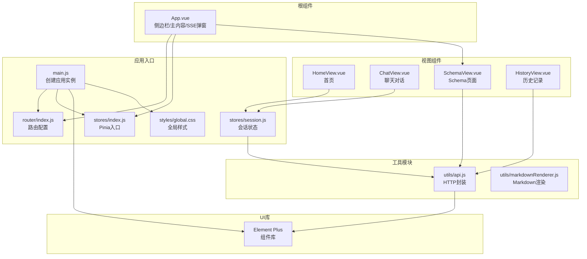
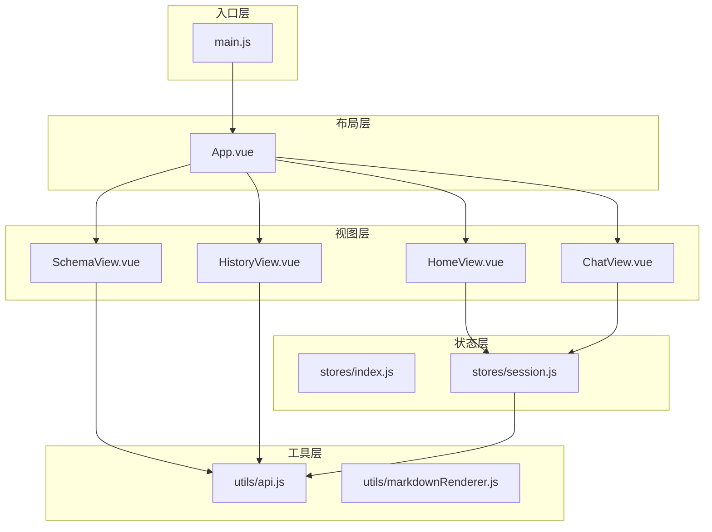
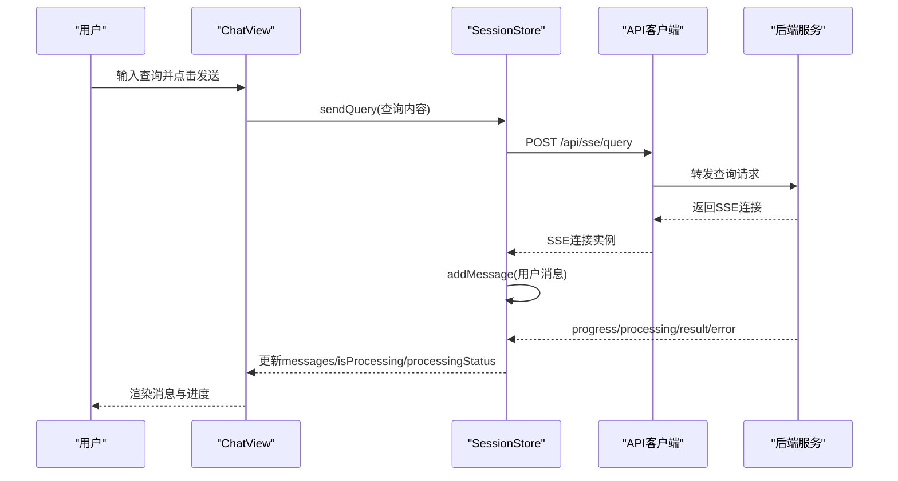
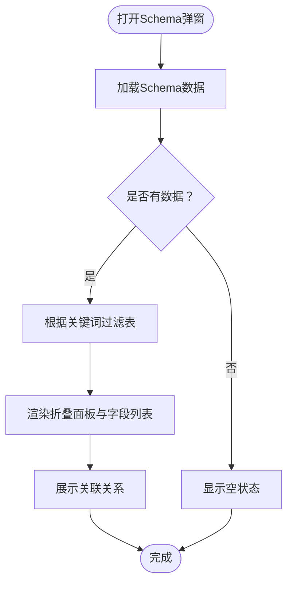
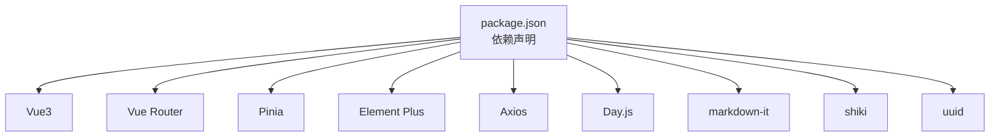

# 前端用户界面

<cite>
**本文档引用的文件**
- [main.js](file://frontend/src/main.js)
- [App.vue](file://frontend/src/App.vue)
- [router/index.js](file://frontend/src/router/index.js)
- [stores/index.js](file://frontend/src/stores/index.js)
- [stores/session.js](file://frontend/src/stores/session.js)
- [utils/api.js](file://frontend/src/utils/api.js)
- [views/ChatView.vue](file://frontend/src/views/ChatView.vue)
- [views/HistoryView.vue](file://frontend/src/views/HistoryView.vue)
- [views/SchemaView.vue](file://frontend/src/views/SchemaView.vue)
- [views/HomeView.vue](file://frontend/src/views/HomeView.vue)
- [components/SchemaViewer.vue](file://frontend/src/components/SchemaViewer.vue)
- [styles/global.css](file://frontend/src/styles/global.css)
- [package.json](file://frontend/package.json)
- [vite.config.js](file://frontend/vite.config.js)
</cite>

## 目录
1. [简介](#简介)
2. [项目结构](#项目结构)
3. [核心组件](#核心组件)
4. [架构总览](#架构总览)
5. [详细组件分析](#详细组件分析)
6. [依赖分析](#依赖分析)
7. [性能考虑](#性能考虑)
8. [故障排查指南](#故障排查指南)
9. [结论](#结论)
10. [附录](#附录)

## 简介
本项目是一个基于Vue3的自然语言到SQL查询前端界面，采用组件化开发、Pinia状态管理和Element Plus UI库，提供聊天对话、Schema查看、历史记录管理等功能。系统通过Axios封装API客户端，结合Server-Sent Events实现与后端的实时数据同步，支持多页面路由与响应式布局。

## 项目结构
前端项目采用典型的Vue3单页应用结构：
- 根入口与插件安装：main.js负责创建应用实例、安装路由、状态管理与UI库
- 根组件与布局：App.vue提供侧边栏导航、主内容区与Schema弹窗
- 路由配置：router/index.js定义页面路由与导航守卫
- 状态管理：stores目录包含Pinia入口与会话状态管理
- 视图组件：views目录包含聊天、历史、Schema、首页等页面
- 工具模块：utils目录包含API封装与Markdown渲染
- 样式：styles目录包含全局样式与主题定制
- 构建配置：vite.config.js配置开发服务器、代理、路径别名与代码分割

**图表来源**
- [main.js:1-89](file://frontend/src/main.js#L1-L89)
- [router/index.js:1-157](file://frontend/src/router/index.js#L1-L157)
- [stores/index.js:1-30](file://frontend/src/stores/index.js#L1-L30)
- [stores/session.js:1-400](file://frontend/src/stores/session.js#L1-L400)
- [App.vue:1-384](file://frontend/src/App.vue#L1-L384)
- [views/ChatView.vue:1-778](file://frontend/src/views/ChatView.vue#L1-L778)
- [views/SchemaView.vue:1-322](file://frontend/src/views/SchemaView.vue#L1-L322)
- [views/HistoryView.vue:1-441](file://frontend/src/views/HistoryView.vue#L1-L441)
- [views/HomeView.vue:1-318](file://frontend/src/views/HomeView.vue#L1-L318)
- [utils/api.js:1-303](file://frontend/src/utils/api.js#L1-L303)
- [styles/global.css:1-317](file://frontend/src/styles/global.css#L1-L317)

**章节来源**
- [main.js:1-89](file://frontend/src/main.js#L1-L89)
- [router/index.js:1-157](file://frontend/src/router/index.js#L1-L157)
- [stores/index.js:1-30](file://frontend/src/stores/index.js#L1-L30)
- [stores/session.js:1-400](file://frontend/src/stores/session.js#L1-L400)
- [App.vue:1-384](file://frontend/src/App.vue#L1-L384)
- [utils/api.js:1-303](file://frontend/src/utils/api.js#L1-L303)
- [styles/global.css:1-317](file://frontend/src/styles/global.css#L1-L317)
- [vite.config.js:1-93](file://frontend/vite.config.js#L1-L93)

## 核心组件
- 应用入口与插件安装：创建Vue应用实例，安装路由、Pinia与Element Plus，注册全局图标组件，挂载应用
- 根组件布局：提供侧边栏导航（历史会话、工具按钮）、主内容区（router-view）与Schema查看弹窗
- 路由系统：定义首页、聊天、历史、Schema、内存、评估等页面，配置滚动行为与页面标题
- 状态管理：使用Pinia定义会话store，管理会话列表、当前会话、消息、SSE连接与处理状态
- API客户端：封装Axios，统一请求/响应拦截与错误处理，提供Schema、会话、查询历史、评估等接口
- 视图组件：首页、聊天对话、Schema页面、历史记录页面等，均采用Composition API与响应式状态
- 工具模块：Markdown渲染、SQL高亮、日期格式化等

**章节来源**
- [main.js:1-89](file://frontend/src/main.js#L1-L89)
- [App.vue:1-384](file://frontend/src/App.vue#L1-L384)
- [router/index.js:1-157](file://frontend/src/router/index.js#L1-L157)
- [stores/session.js:1-400](file://frontend/src/stores/session.js#L1-L400)
- [utils/api.js:1-303](file://frontend/src/utils/api.js#L1-L303)

## 架构总览
前端采用“入口-布局-视图-状态-工具”的分层架构：
- 入口层：main.js负责应用初始化与插件安装
- 布局层：App.vue提供全局布局与导航
- 视图层：各页面组件负责具体业务展示与交互
- 状态层：Pinia store集中管理全局与局部状态
- 工具层：API封装、渲染工具、样式等

**图表来源**
- [main.js:1-89](file://frontend/src/main.js#L1-L89)
- [App.vue:1-384](file://frontend/src/App.vue#L1-L384)
- [stores/session.js:1-400](file://frontend/src/stores/session.js#L1-L400)
- [utils/api.js:1-303](file://frontend/src/utils/api.js#L1-L303)

## 详细组件分析

### 聊天界面（ChatView）
- 功能概述：实现自然语言到SQL的对话式查询，支持消息列表、Markdown渲染、SQL代码高亮、数据表格展示、SSE实时反馈与处理状态指示
- 关键特性：
  - 消息渲染：用户消息与助手消息区分，支持长文本折叠/展开
  - Markdown与SQL渲染：使用markdown-it与Shiki进行内容渲染
  - SSE集成：建立与后端的Server-Sent Events连接，接收实时处理状态与结果
  - 输入交互：支持Enter发送、Shift+Enter换行，禁用重复提交
  - 自动滚动：消息新增与处理完成时自动滚动到底部
- 状态管理：通过useSessionStore管理消息、处理状态、进度与SSE连接
- 错误处理：捕获SSE连接异常与API调用错误，显示友好提示

**图表来源**
- [views/ChatView.vue:196-214](file://frontend/src/views/ChatView.vue#L196-L214)
- [stores/session.js:297-330](file://frontend/src/stores/session.js#L297-L330)
- [utils/api.js:246-251](file://frontend/src/utils/api.js#L246-L251)

**章节来源**
- [views/ChatView.vue:1-778](file://frontend/src/views/ChatView.vue#L1-L778)
- [stores/session.js:1-400](file://frontend/src/stores/session.js#L1-L400)
- [utils/api.js:1-303](file://frontend/src/utils/api.js#L1-L303)

### Schema查看器（SchemaViewer）
- 功能概述：以弹窗形式展示数据Schema，支持搜索、折叠展开、表描述、字段详情、关联关系展示
- 关键特性：
  - 搜索过滤：支持表名、中文名、描述、字段名/中文名的模糊搜索
  - 折叠面板：逐表展开，支持默认展开第一张表
  - 关联关系：展示表之间的关联关系并格式化显示
  - 加载状态：骨架屏与空状态提示
- 数据来源：通过API获取Schema数据，首次打开时自动加载

**图表来源**
- [components/SchemaViewer.vue:191-208](file://frontend/src/components/SchemaViewer.vue#L191-L208)
- [components/SchemaViewer.vue:157-182](file://frontend/src/components/SchemaViewer.vue#L157-L182)
- [components/SchemaViewer.vue:215-230](file://frontend/src/components/SchemaViewer.vue#L215-L230)

**章节来源**
- [components/SchemaViewer.vue:1-317](file://frontend/src/components/SchemaViewer.vue#L1-L317)
- [utils/api.js:118-120](file://frontend/src/utils/api.js#L118-L120)

### 历史记录管理（HistoryView）
- 功能概述：展示用户的查询历史，支持筛选（关键词、状态、日期范围）、分页、查看详情、复制查询
- 关键特性：
  - 多维筛选：查询内容、状态（成功/失败）、日期范围
  - 分页加载：支持每页数量与页码变更
  - 详情弹窗：展示SQL、状态、执行时间、返回行数、错误信息等
  - 加载状态：骨架屏与空状态提示
- 数据来源：通过API获取历史记录与总数

**章节来源**
- [views/HistoryView.vue:1-441](file://frontend/src/views/HistoryView.vue#L1-L441)
- [utils/api.js:206-208](file://frontend/src/utils/api.js#L206-L208)

### 根组件与侧边栏（App.vue）
- 功能概述：提供全局布局、侧边栏导航、历史会话列表、工具按钮（Schema、内存、评估、设置）、侧边栏折叠与Schema弹窗
- 关键特性：
  - 会话管理：创建新会话、切换会话、删除会话
  - 路由跳转：跳转到内存、评估页面
  - 响应式布局：侧边栏可折叠，图标与文字随状态切换
- 状态管理：使用useSessionStore管理会话列表与当前会话

**章节来源**
- [App.vue:1-384](file://frontend/src/App.vue#L1-L384)
- [stores/session.js:1-400](file://frontend/src/stores/session.js#L1-L400)

### 首页（HomeView）
- 功能概述：展示欢迎信息、快速开始按钮、功能特性介绍与使用示例
- 关键特性：
  - 快速开始：创建新会话并跳转到聊天页面
  - 使用示例：点击示例文本可创建会话并跳转
  - 响应式网格：功能特性卡片自适应布局

**章节来源**
- [views/HomeView.vue:1-318](file://frontend/src/views/HomeView.vue#L1-L318)
- [stores/session.js:118-138](file://frontend/src/stores/session.js#L118-L138)

### Schema页面（SchemaView）
- 功能概述：完整的Schema页面，包含表结构、指标、维度、表关系四个标签页
- 关键特性：
  - 标签页切换：表结构、指标、维度、表关系
  - 表卡片：网格布局展示表，支持描述与字段列表
  - 统计信息：展示表数量、指标数量、维度数量

**章节来源**
- [views/SchemaView.vue:1-322](file://frontend/src/views/SchemaView.vue#L1-L322)
- [utils/api.js:118-120](file://frontend/src/utils/api.js#L118-L120)

## 依赖分析
- 核心依赖：Vue3、Vue Router、Pinia、Element Plus、Axios、Day.js、markdown-it、shiki、uuid
- 开发依赖：Vite、@vitejs/plugin-vue、sass
- 构建优化：手动分包（element-plus、echarts、vendor），关闭source map，代理配置解决跨域

**图表来源**
- [package.json:11-29](file://frontend/package.json#L11-L29)

**章节来源**
- [package.json:1-36](file://frontend/package.json#L1-L36)
- [vite.config.js:72-91](file://frontend/vite.config.js#L72-L91)

## 性能考虑
- 代码分割：通过manualChunks将第三方库独立打包，减少首屏体积
- 资源懒加载：历史与评估页面采用动态导入，按需加载
- 响应式渲染：使用computed与watch优化渲染性能，避免不必要的重渲染
- SSE连接管理：在组件卸载时断开连接，防止内存泄漏
- 图标与样式：全局注册Element Plus图标，统一引入全局样式，减少重复加载

**章节来源**
- [vite.config.js:72-91](file://frontend/vite.config.js#L72-L91)
- [views/HistoryView.vue:64-69](file://frontend/src/views/HistoryView.vue#L64-L69)
- [views/ChatView.vue:324-327](file://frontend/src/views/ChatView.vue#L324-L327)
- [main.js:75-80](file://frontend/src/main.js#L75-L80)
- [styles/global.css:1-317](file://frontend/src/styles/global.css#L1-L317)

## 故障排查指南
- API请求失败：
  - 检查代理配置是否正确指向后端服务
  - 查看响应拦截器中的错误处理逻辑，确认错误信息
- SSE连接异常：
  - 确认后端SSE端点可用，检查连接状态与消息类型
  - 在组件卸载时确保断开连接
- 路由跳转问题：
  - 检查路由守卫与meta配置，确认页面标题与导航逻辑
- 样式冲突：
  - 检查全局样式与组件scoped样式，避免覆盖Element Plus默认样式

**章节来源**
- [vite.config.js:24-35](file://frontend/vite.config.js#L24-L35)
- [utils/api.js:67-88](file://frontend/src/utils/api.js#L67-L88)
- [stores/session.js:185-221](file://frontend/src/stores/session.js#L185-L221)
- [router/index.js:142-150](file://frontend/src/router/index.js#L142-L150)

## 结论
本前端界面采用现代化的Vue3技术栈，结合Pinia状态管理与Element Plus UI库，实现了自然语言到SQL的对话式查询体验。通过清晰的组件划分、完善的路由与状态管理、以及合理的性能优化策略，系统具备良好的可维护性与扩展性。后续可在用户体验优化、国际化支持、权限控制等方面进一步完善。

## 附录

### 组件使用示例
- 在任意组件中使用会话状态：
  - 导入：import { useSessionStore } from '@/stores/session'
  - 获取：const sessionStore = useSessionStore()
  - 使用：sessionStore.createSession() / sessionStore.sendQuery()
- 在页面中使用API：
  - 导入：import * as api from '@/utils/api'
  - 使用：api.getSchema() / api.getQueryHistory()

**章节来源**
- [stores/session.js:33-399](file://frontend/src/stores/session.js#L33-L399)
- [utils/api.js:118-120](file://frontend/src/utils/api.js#L118-L120)

### 样式定制指南
- 全局样式：在global.css中定义基础样式、工具类与动画
- 组件样式：使用scoped样式隔离组件样式，避免全局污染
- Element Plus主题：通过SCSS变量与额外导入实现主题定制

**章节来源**
- [styles/global.css:1-317](file://frontend/src/styles/global.css#L1-L317)
- [vite.config.js:60-69](file://frontend/vite.config.js#L60-L69)

### 响应式设计实现
- 移动端适配：在global.css中针对768px以下屏幕提供侧边栏滑出等适配
- 网格布局：使用CSS Grid与Flex布局实现自适应卡片与表格
- 组件内样式：各视图组件内部使用相对单位与flex布局提升可读性

**章节来源**
- [styles/global.css:304-317](file://frontend/src/styles/global.css#L304-L317)
- [views/SchemaView.vue:267-270](file://frontend/src/views/SchemaView.vue#L267-L270)
- [views/HomeView.vue:249-254](file://frontend/src/views/HomeView.vue#L249-L254)