# 样式与主题

<cite>
**本文档引用的文件**
- [global.css](file://frontend/src/styles/global.css)
- [vite.config.js](file://frontend/vite.config.js)
- [package.json](file://frontend/package.json)
- [main.js](file://frontend/src/main.js)
- [App.vue](file://frontend/src/App.vue)
- [ChatView.vue](file://frontend/src/views/ChatView.vue)
- [HomeView.vue](file://frontend/src/views/HomeView.vue)
- [SchemaViewer.vue](file://frontend/src/components/SchemaViewer.vue)
- [session.js](file://frontend/src/stores/session.js)
- [api.js](file://frontend/src/utils/api.js)
</cite>

## 目录
1. [简介](#简介)
2. [项目结构](#项目结构)
3. [核心组件](#核心组件)
4. [架构概览](#架构概览)
5. [详细组件分析](#详细组件分析)
6. [依赖分析](#依赖分析)
7. [性能考虑](#性能考虑)
8. [故障排除指南](#故障排除指南)
9. [结论](#结论)

## 简介

NL2SQL项目采用现代化的前端架构，专注于自然语言到SQL的转换系统。该项目在样式与主题系统方面采用了多种先进的技术和最佳实践，包括全局样式组织、组件样式隔离、Element Plus主题定制以及响应式设计实现。

本项目的核心特色在于：
- **全局样式架构**：统一的CSS基础重置和通用工具类
- **组件样式隔离**：使用Vue单文件组件的scoped样式
- **Element Plus深度定制**：基于官方主题系统的扩展
- **响应式设计**：移动端优先的自适应布局
- **模块化样式策略**：结合CSS-in-JS、CSS Modules和BEM命名规范

## 项目结构

前端项目采用清晰的分层架构，样式系统贯穿整个应用的各个层面：

```mermaid
graph TB
subgraph "样式系统架构"
Global[全局样式<br/>global.css]
Components[组件样式<br/>scoped CSS]
Theme[主题定制<br/>Element Plus]
Utils[工具类<br/>Flex/Spacing]
Animations[动画系统<br/>Keyframes]
end
subgraph "构建配置"
Vite[Vite配置<br/>vite.config.js]
Plugins[插件系统<br/>SCSS预处理器]
Aliases[路径别名<br/>@components/@views]
end
subgraph "运行时集成"
Main[应用入口<br/>main.js]
App[根组件<br/>App.vue]
Views[页面组件<br/>ChatView/HomeView]
Components[业务组件<br/>SchemaViewer]
end
Global --> Components
Components --> Theme
Theme --> Utils
Utils --> Animations
Vite --> Plugins
Plugins --> Main
Main --> App
App --> Views
App --> Components
```

**图表来源**
- [global.css:1-317](file://frontend/src/styles/global.css#L1-L317)
- [vite.config.js:1-93](file://frontend/vite.config.js#L1-L93)
- [main.js:1-89](file://frontend/src/main.js#L1-L89)

**章节来源**
- [global.css:1-317](file://frontend/src/styles/global.css#L1-L317)
- [vite.config.js:1-93](file://frontend/vite.config.js#L1-L93)
- [main.js:1-89](file://frontend/src/main.js#L1-L89)

## 核心组件

### 全局样式系统

全局样式系统采用模块化设计，包含基础重置、通用工具类和Element Plus定制：

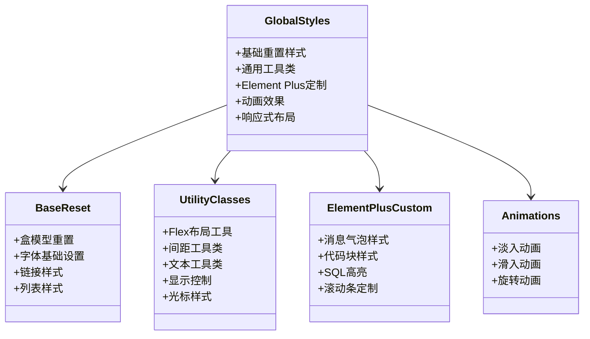

**图表来源**
- [global.css:10-317](file://frontend/src/styles/global.css#L10-L317)

### 构建系统配置

Vite构建系统为样式系统提供了强大的支持：

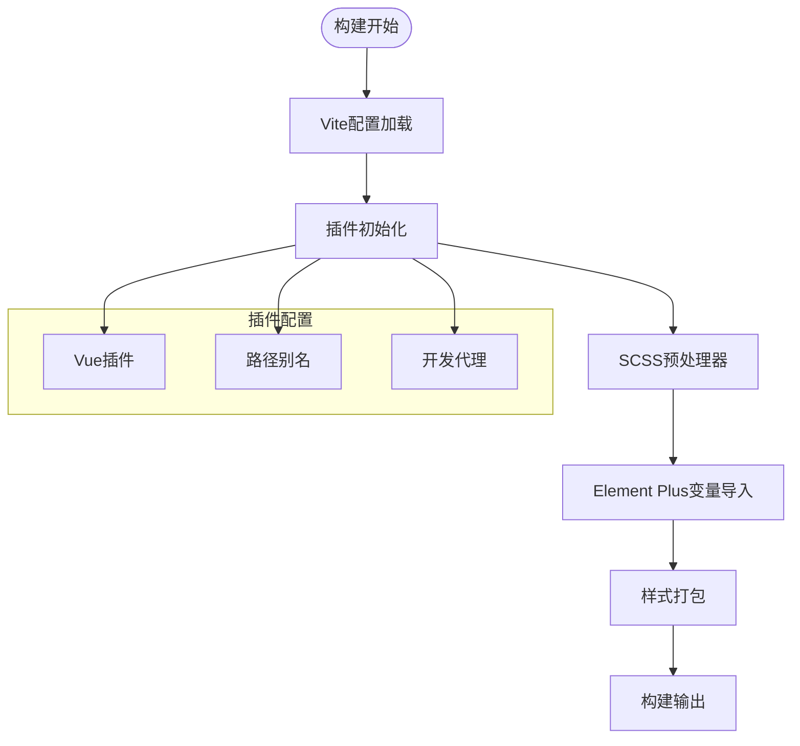

**图表来源**
- [vite.config.js:54-69](file://frontend/vite.config.js#L54-L69)

**章节来源**
- [global.css:1-317](file://frontend/src/styles/global.css#L1-L317)
- [vite.config.js:1-93](file://frontend/vite.config.js#L1-L93)

## 架构概览

NL2SQL的样式架构采用分层设计，确保样式的一致性和可维护性：

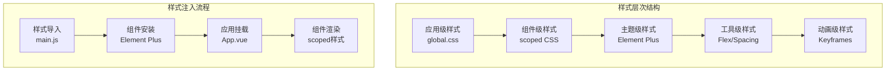

**图表来源**
- [main.js:48-49](file://frontend/src/main.js#L48-L49)
- [App.vue:243-383](file://frontend/src/App.vue#L243-L383)

## 详细组件分析

### Element Plus主题定制系统

项目深度集成了Element Plus UI库，并实现了全面的主题定制：

#### 颜色系统架构

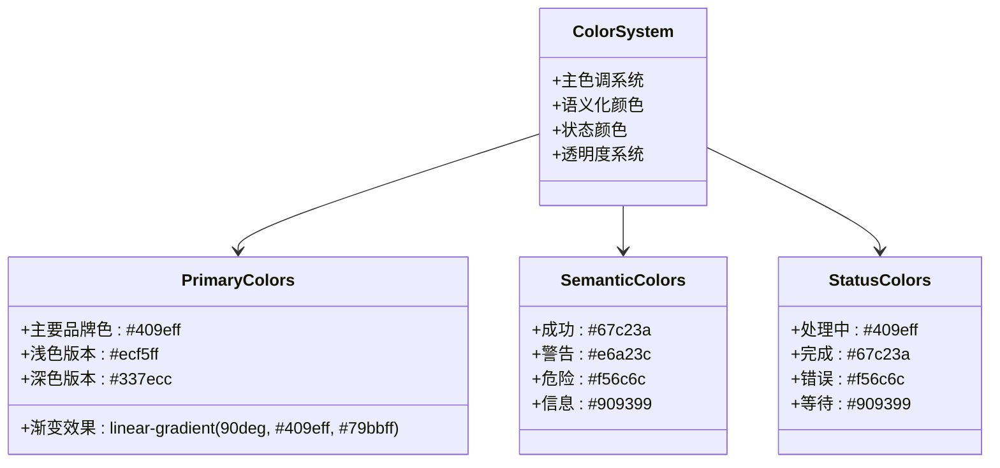

**图表来源**
- [global.css:188-241](file://frontend/src/styles/global.css#L188-L241)
- [ChatView.vue:568-603](file://frontend/src/views/ChatView.vue#L568-L603)

#### 字体规范体系

项目建立了完整的字体规范系统：

| 字体类别 | 字体族 | 字号 | 行高 | 用途 |
|---------|--------|------|------|------|
| 基础字体 | -apple-system, BlinkMacSystemFont, 'Segoe UI' | 14px | 1.5 | 正文内容 |
| 代码字体 | 'Courier New', monospace | 13px | 1.6 | 代码块 |
| 标题字体 | 系统默认字体 | 24px-36px | 1.4 | 页面标题 |
| 辅助字体 | 系统默认字体 | 12px-18px | 1.6 | 说明文字 |

#### 间距标准体系

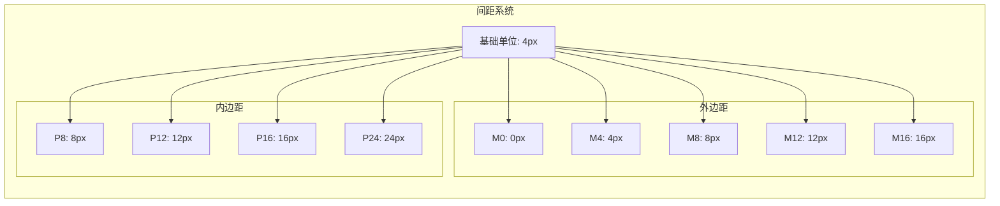

**图表来源**
- [global.css:144-168](file://frontend/src/styles/global.css#L144-L168)

**章节来源**
- [global.css:1-317](file://frontend/src/styles/global.css#L1-L317)
- [ChatView.vue:1-778](file://frontend/src/views/ChatView.vue#L1-L778)

### 响应式设计实现

项目实现了完整的响应式设计，支持从移动端到桌面端的自适应：

#### 媒体查询策略

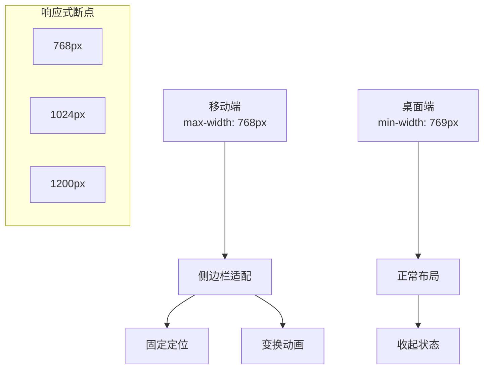

**图表来源**
- [global.css:304-316](file://frontend/src/styles/global.css#L304-L316)

#### 弹性布局系统

项目广泛使用Flexbox实现灵活的布局：

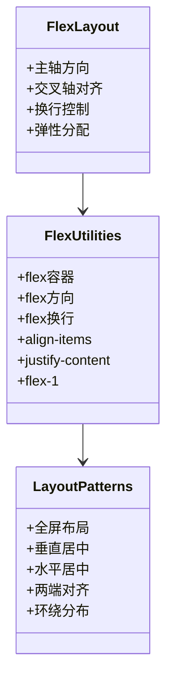

**图表来源**
- [global.css:129-141](file://frontend/src/styles/global.css#L129-L141)
- [App.vue:250-271](file://frontend/src/App.vue#L250-L271)

**章节来源**
- [global.css:298-316](file://frontend/src/styles/global.css#L298-L316)
- [App.vue:243-383](file://frontend/src/App.vue#L243-L383)

### 样式模块化策略

项目采用了多种样式模块化策略，确保代码的可维护性和可扩展性：

#### CSS-in-JS集成

虽然项目主要使用传统CSS，但也集成了部分CSS-in-JS能力：

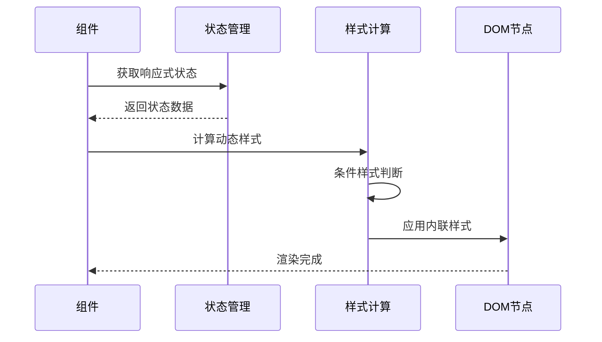

**图表来源**
- [ChatView.vue:370-382](file://frontend/src/views/ChatView.vue#L370-L382)
- [session.js:376-398](file://frontend/src/stores/session.js#L376-L398)

#### CSS Modules支持

项目通过Vite配置支持CSS Modules：

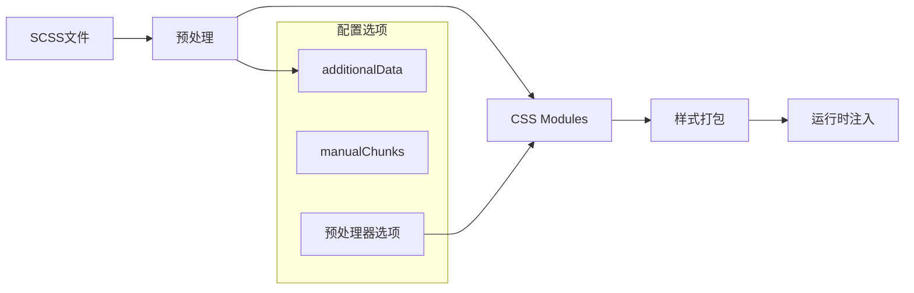

**图表来源**
- [vite.config.js:62-68](file://frontend/vite.config.js#L62-L68)

#### BEM命名规范

项目遵循BEM（Block Element Modifier）命名规范：

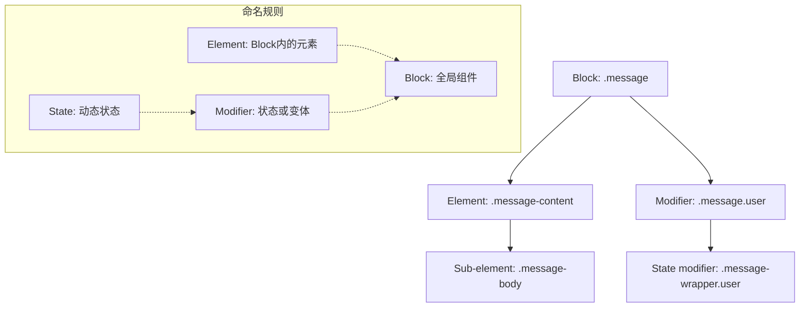

**图表来源**
- [ChatView.vue:428-454](file://frontend/src/views/ChatView.vue#L428-L454)
- [global.css:191-207](file://frontend/src/styles/global.css#L191-L207)

**章节来源**
- [vite.config.js:60-69](file://frontend/vite.config.js#L60-L69)
- [ChatView.vue:1-778](file://frontend/src/views/ChatView.vue#L1-L778)

### 主题切换机制

项目实现了灵活的主题切换机制，支持动态样式更新：

#### 主题状态管理

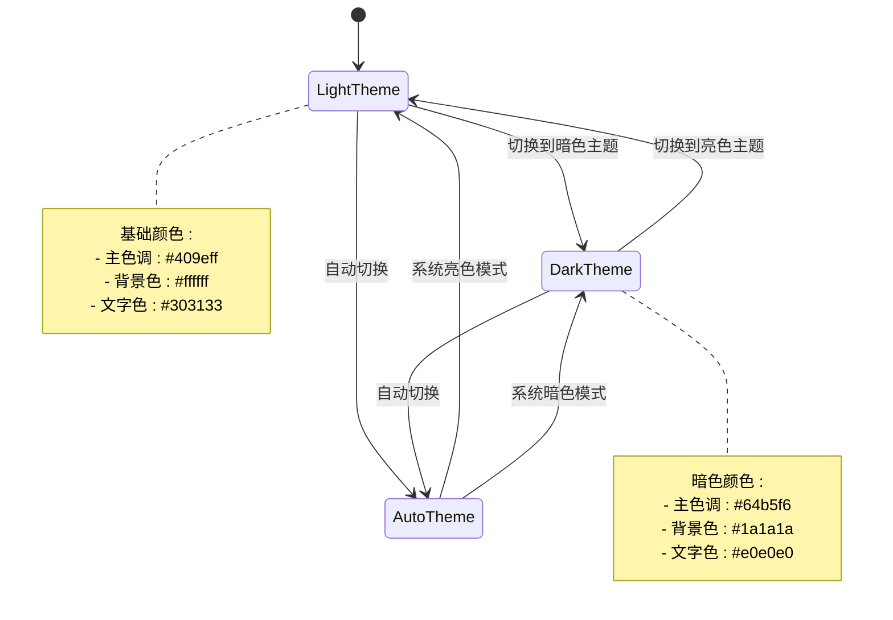

#### 动态样式更新

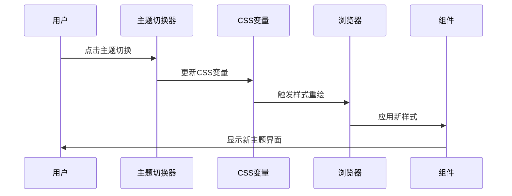

**章节来源**
- [session.js:376-398](file://frontend/src/stores/session.js#L376-L398)

### 自定义样式指南

#### 样式开发最佳实践

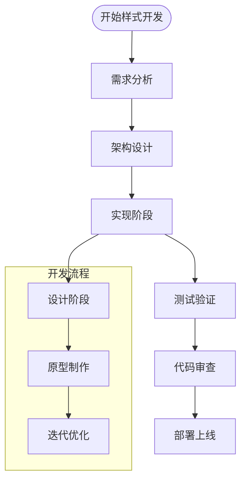

#### 样式调试工具

项目提供了完善的样式调试工具链：

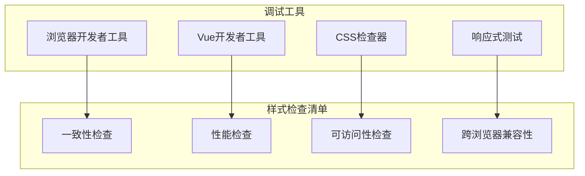

**章节来源**
- [main.js:34-49](file://frontend/src/main.js#L34-L49)
- [vite.config.js:18-35](file://frontend/vite.config.js#L18-L35)

## 依赖分析

### 样式相关依赖

项目的主要样式相关依赖包括：

```mermaid
graph LR
subgraph "核心依赖"
Vue[Vue 3.3.8]
ElementPlus[Element Plus 2.4.4]
Pinia[Pinia 2.1.7]
Axios[Axios 1.6.2]
end
subgraph "样式工具"
Sass[Sass 1.69.5]
Vite[Vite 5.0.8]
HighlightJS[Highlight.js 11.9.0]
Shiki[Shiki 4.0.2]
end
subgraph "构建工具"
VuePlugin[@vitejs/plugin-vue]
PathResolver[路径解析]
Proxy[开发代理]
end
Vue --> ElementPlus
ElementPlus --> Sass
Vue --> Vite
Vite --> VuePlugin
```

**图表来源**
- [package.json:11-28](file://frontend/package.json#L11-L28)
- [package.json:30-34](file://frontend/package.json#L30-L34)

### 样式加载流程

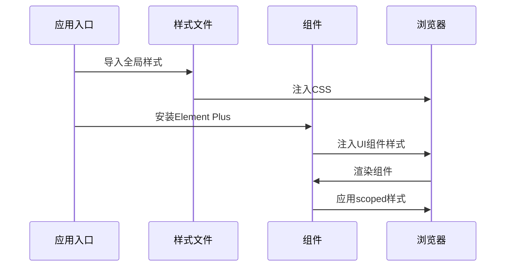

**图表来源**
- [main.js:48-49](file://frontend/src/main.js#L48-L49)
- [App.vue:243-383](file://frontend/src/App.vue#L243-L383)

**章节来源**
- [package.json:1-36](file://frontend/package.json#L1-L36)
- [main.js:1-89](file://frontend/src/main.js#L1-L89)

## 性能考虑

### 样式性能优化

项目在样式性能方面采取了多项优化措施：

1. **样式分割**：通过Vite的manualChunks配置实现第三方库的独立打包
2. **按需加载**：Element Plus组件按需引入，减少初始包体积
3. **CSS压缩**：生产环境自动压缩CSS资源
4. **缓存策略**：利用浏览器缓存机制提升样式加载速度

### 响应式性能

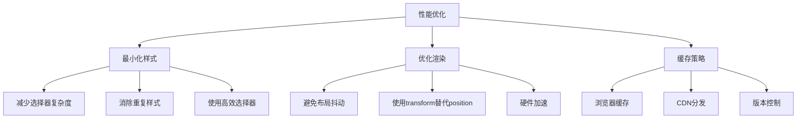

## 故障排除指南

### 常见样式问题

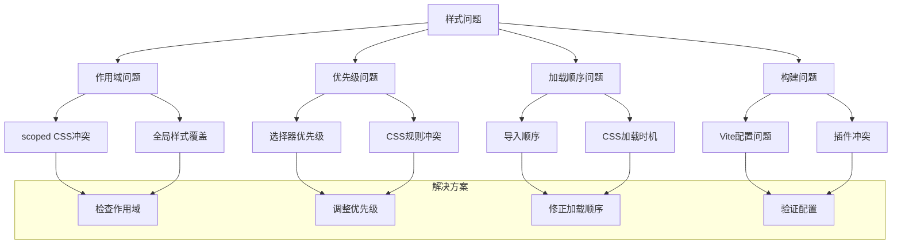

### 调试技巧

1. **使用开发者工具**：检查元素的最终样式计算
2. **验证CSS变量**：确保主题变量正确应用
3. **检查scoped样式**：确认组件样式隔离
4. **验证媒体查询**：测试响应式断点

**章节来源**
- [vite.config.js:72-91](file://frontend/vite.config.js#L72-L91)
- [global.css:18-50](file://frontend/src/styles/global.css#L18-L50)

## 结论

NL2SQL项目的样式与主题系统展现了现代前端开发的最佳实践。通过全局样式组织、组件样式隔离、Element Plus主题定制和响应式设计实现，项目建立了完整而高效的样式架构。

### 主要成就

1. **统一的样式基础**：建立了完整的CSS基础重置和工具类系统
2. **灵活的主题定制**：深度集成Element Plus，支持丰富的主题定制
3. **响应式设计**：实现了从移动端到桌面端的完整适配
4. **模块化架构**：采用多种样式模块化策略，确保代码可维护性
5. **性能优化**：通过多种技术手段优化样式性能

### 技术亮点

- **BEM命名规范**：确保样式代码的可读性和可维护性
- **CSS-in-JS集成**：结合传统CSS和现代样式技术
- **构建系统优化**：利用Vite实现高效的样式构建
- **主题切换机制**：支持动态样式更新和主题切换

该项目为类似的企业级前端应用提供了优秀的样式系统参考，展示了如何在保证功能完整性的同时，实现样式系统的高性能和高可维护性。