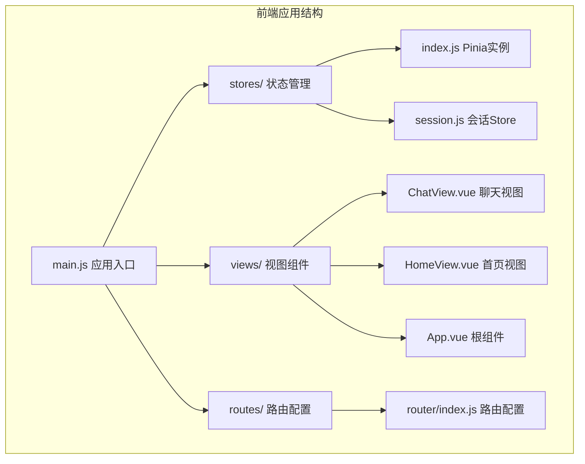
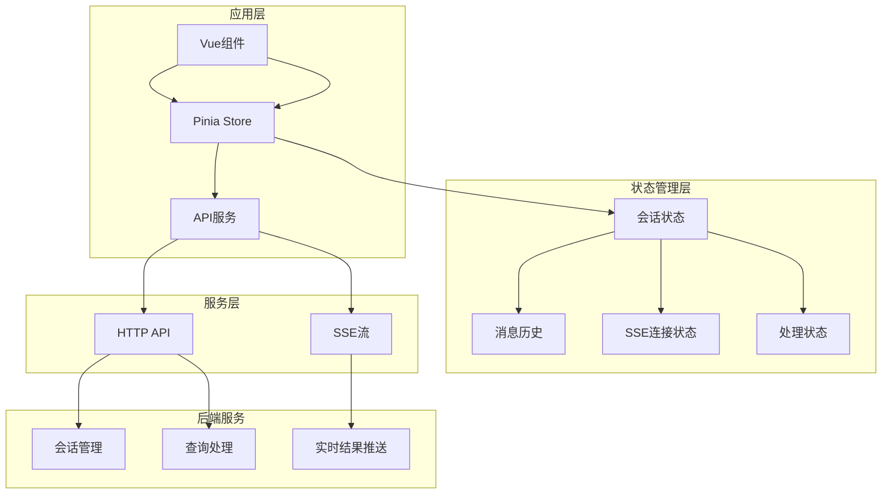
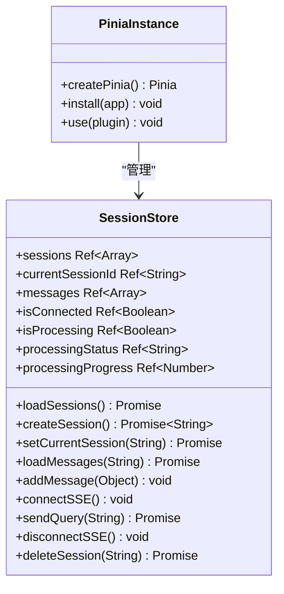
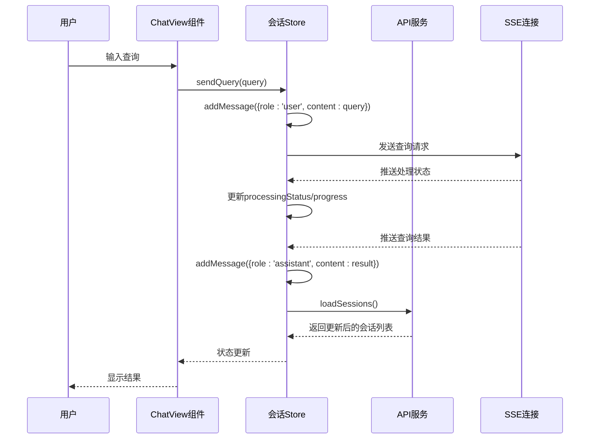
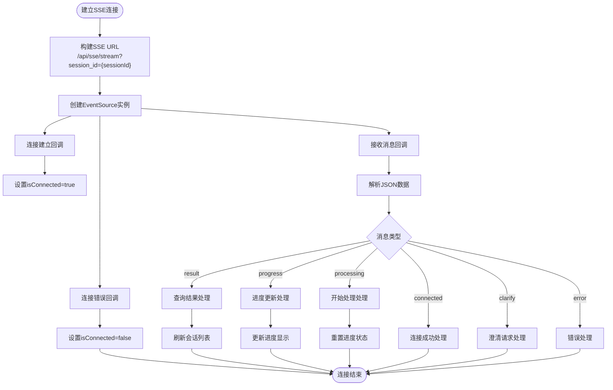
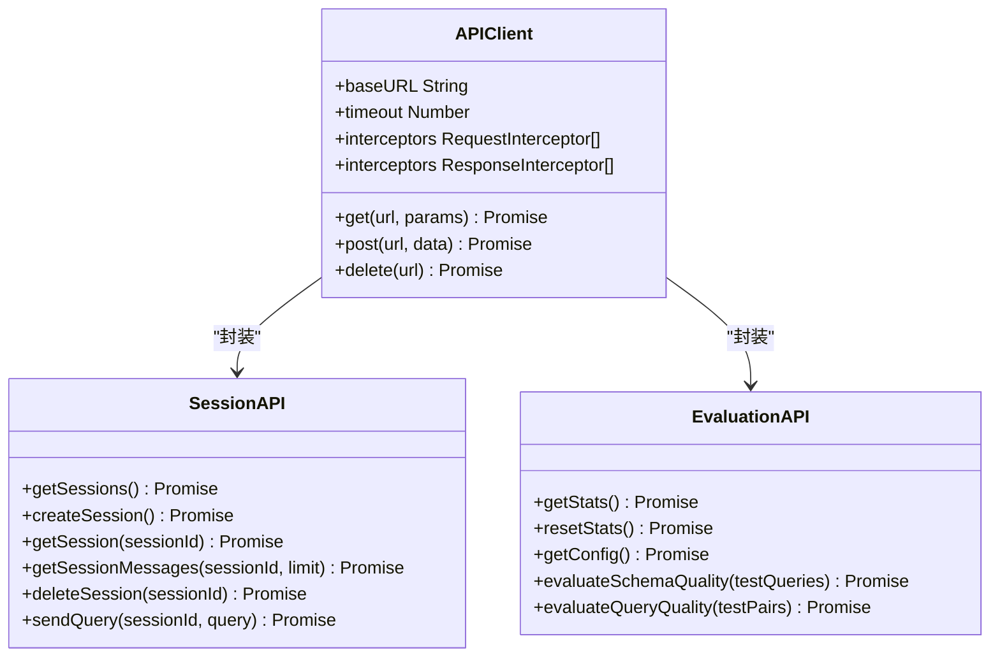
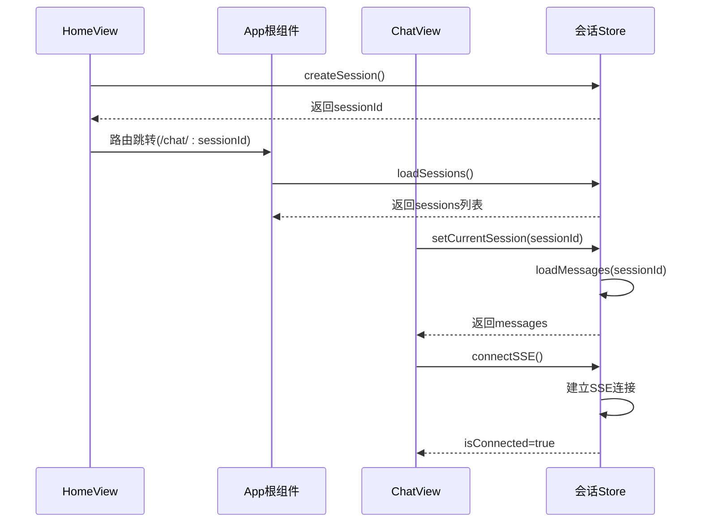

# 状态管理

<cite>
**本文档引用的文件**
- [frontend/src/stores/index.js](file://frontend/src/stores/index.js)
- [frontend/src/stores/session.js](file://frontend/src/stores/session.js)
- [frontend/src/main.js](file://frontend/src/main.js)
- [frontend/src/utils/api.js](file://frontend/src/utils/api.js)
- [frontend/src/views/ChatView.vue](file://frontend/src/views/ChatView.vue)
- [frontend/src/views/HomeView.vue](file://frontend/src/views/HomeView.vue)
- [frontend/src/App.vue](file://frontend/src/App.vue)
- [frontend/src/router/index.js](file://frontend/src/router/index.js)
- [frontend/package.json](file://frontend/package.json)
- [frontend/vite.config.js](file://frontend/vite.config.js)
</cite>

## 目录
1. [简介](#简介)
2. [项目结构](#项目结构)
3. [核心组件](#核心组件)
4. [架构概览](#架构概览)
5. [详细组件分析](#详细组件分析)
6. [依赖关系分析](#依赖关系分析)
7. [性能考虑](#性能考虑)
8. [故障排除指南](#故障排除指南)
9. [结论](#结论)

## 简介

NL2SQL状态管理系统基于Vue 3和Pinia构建，为自然语言数据查询应用提供了完整的状态管理解决方案。该系统实现了会话状态管理、实时数据同步、错误处理和状态持久化等功能，支持多用户交互场景下的复杂状态流转。

系统采用现代化的前端架构，结合Server-Sent Events (SSE) 实现实时通信，通过响应式状态管理确保UI与后端数据的同步一致性。状态管理采用组合式API设计，提供了清晰的类型定义和完善的错误处理机制。

## 项目结构

NL2SQL前端项目采用模块化的文件组织结构，状态管理相关的核心文件分布如下：



**图表来源**
- [frontend/src/main.js:1-89](file://frontend/src/main.js#L1-L89)
- [frontend/src/stores/index.js:1-30](file://frontend/src/stores/index.js#L1-L30)
- [frontend/src/stores/session.js:1-400](file://frontend/src/stores/session.js#L1-L400)

**章节来源**
- [frontend/src/main.js:1-89](file://frontend/src/main.js#L1-L89)
- [frontend/src/stores/index.js:1-30](file://frontend/src/stores/index.js#L1-L30)
- [frontend/src/stores/session.js:1-400](file://frontend/src/stores/session.js#L1-L400)

## 核心组件

### Pinia状态管理入口

系统通过独立的Pinia实例管理全局状态，该实例在应用启动时被创建并注入到Vue应用中。

### 会话状态管理Store

会话Store是状态管理系统的核心，负责管理用户会话、消息历史、SSE连接等关键状态。Store采用组合式API设计，提供了完整的状态定义和动作方法。

**章节来源**
- [frontend/src/stores/index.js:1-30](file://frontend/src/stores/index.js#L1-L30)
- [frontend/src/stores/session.js:1-400](file://frontend/src/stores/session.js#L1-L400)

## 架构概览

NL2SQL状态管理系统的整体架构采用分层设计，确保了良好的可维护性和扩展性：



**图表来源**
- [frontend/src/stores/session.js:33-399](file://frontend/src/stores/session.js#L33-L399)
- [frontend/src/utils/api.js:1-303](file://frontend/src/utils/api.js#L1-L303)

系统架构的关键特点：
- **响应式状态管理**：使用Vue 3的响应式API确保状态变更的自动更新
- **异步状态处理**：通过Promise和async/await处理异步操作
- **实时数据同步**：利用SSE实现实时消息推送和状态更新
- **错误边界处理**：在各个层级提供完善的错误处理机制

## 详细组件分析

### Pinia实例创建

Pinia实例作为状态管理的核心容器，负责协调各个Store之间的状态同步和数据流管理。



**图表来源**
- [frontend/src/stores/index.js:23-29](file://frontend/src/stores/index.js#L23-L29)
- [frontend/src/stores/session.js:33-399](file://frontend/src/stores/session.js#L33-L399)

### 会话状态管理

会话Store实现了完整的会话生命周期管理，包括会话创建、切换、删除和消息管理等功能。

#### 状态定义

会话Store包含以下核心状态：

| 状态名称 | 类型 | 描述 | 默认值 |
|---------|------|------|--------|
| sessions | Ref<Array> | 会话列表 | [] |
| currentSessionId | Ref<String> | 当前会话ID | null |
| messages | Ref<Array> | 消息历史 | [] |
| isConnected | Ref<Boolean> | SSE连接状态 | false |
| isProcessing | Ref<Boolean> | 处理状态 | false |
| processingStatus | Ref<String> | 处理状态文本 | '' |
| processingProgress | Ref<Number> | 处理进度百分比 | 0 |

#### 动作方法

会话Store提供了以下主要动作方法：



**图表来源**
- [frontend/src/stores/session.js:301-330](file://frontend/src/stores/session.js#L301-L330)
- [frontend/src/views/ChatView.vue:196-214](file://frontend/src/views/ChatView.vue#L196-L214)

#### SSE连接管理

系统通过Server-Sent Events实现与后端的实时通信，支持多种消息类型的处理：



**图表来源**
- [frontend/src/stores/session.js:185-221](file://frontend/src/stores/session.js#L185-L221)
- [frontend/src/stores/session.js:227-295](file://frontend/src/stores/session.js#L227-L295)

**章节来源**
- [frontend/src/stores/session.js:33-399](file://frontend/src/stores/session.js#L33-L399)

### API服务集成

API服务模块封装了所有与后端的HTTP通信，提供了统一的请求/响应处理机制：



**图表来源**
- [frontend/src/utils/api.js:25-34](file://frontend/src/utils/api.js#L25-L34)
- [frontend/src/utils/api.js:151-195](file://frontend/src/utils/api.js#L151-L195)

**章节来源**
- [frontend/src/utils/api.js:1-303](file://frontend/src/utils/api.js#L1-L303)

### 组件状态集成

多个Vue组件通过组合式API使用会话Store，实现了状态的响应式绑定：



**图表来源**
- [frontend/src/views/HomeView.vue:153-163](file://frontend/src/views/HomeView.vue#L153-L163)
- [frontend/src/App.vue:237-240](file://frontend/src/App.vue#L237-L240)
- [frontend/src/views/ChatView.vue:333-345](file://frontend/src/views/ChatView.vue#L333-L345)

**章节来源**
- [frontend/src/views/HomeView.vue:1-318](file://frontend/src/views/HomeView.vue#L1-L318)
- [frontend/src/App.vue:1-384](file://frontend/src/App.vue#L1-L384)
- [frontend/src/views/ChatView.vue:1-778](file://frontend/src/views/ChatView.vue#L1-L778)

## 依赖关系分析

NL2SQL状态管理系统涉及多个关键依赖项，形成了完整的技术栈：

```mermaid
graph TB
subgraph "核心依赖"
A[vue@^3.3.8] --> B[Vue 3 Composition API]
C[pinia@^2.1.7] --> D[状态管理库]
E[axios@^1.6.2] --> F[HTTP客户端]
G[uuid@^13.0.0] --> H[唯一标识符生成]
end
subgraph "UI组件库"
I[element-plus@^2.4.4] --> J[Element Plus]
K[@element-plus/icons-vue] --> L[图标组件]
end
subgraph "开发工具"
M[vite@^5.0.8] --> N[Vite构建工具]
O[@vitejs/plugin-vue] --> P[Vue插件]
end
subgraph "工具库"
Q[dayjs@^1.11.10] --> R[日期处理]
S[marked@^11.1.0] --> T[Markdown解析]
U[mermaid@^11.14.0] --> V[图表渲染]
end
A --> C
A --> I
C --> E
E --> F
```

**图表来源**
- [frontend/package.json:11-28](file://frontend/package.json#L11-L28)
- [frontend/package.json:30-34](file://frontend/package.json#L30-L34)

系统依赖的特点：
- **现代化技术栈**：采用Vue 3最新特性和Pinia作为官方状态管理解决方案
- **模块化设计**：每个依赖都有明确的功能定位和职责划分
- **版本兼容性**：确保各依赖项之间的版本兼容性和稳定性
- **开发体验**：集成Vite提供快速开发和热重载功能

**章节来源**
- [frontend/package.json:1-36](file://frontend/package.json#L1-L36)

## 性能考虑

NL2SQL状态管理系统在性能方面采用了多项优化策略：

### 状态更新优化

1. **响应式状态管理**：使用Vue 3的响应式API确保只有相关组件才会重新渲染
2. **计算属性缓存**：通过computed属性避免重复计算
3. **深度监听优化**：在watch中使用深拷贝选项避免不必要的性能开销

### 异步操作优化

1. **并发控制**：通过isProcessing状态避免重复提交请求
2. **错误恢复**：提供完整的错误处理和重试机制
3. **资源清理**：及时清理SSE连接和定时器

### 内存管理

1. **状态清理**：在组件卸载时自动清理相关状态
2. **连接管理**：避免SSE连接泄漏和内存占用
3. **数据结构优化**：使用高效的数组和对象结构存储状态

## 故障排除指南

### 常见问题及解决方案

#### SSE连接问题

**症状**：SSE连接无法建立或频繁断开
**原因分析**：
- 网络连接不稳定
- 后端服务异常
- 跨域配置问题

**解决方案**：
1. 检查网络连接状态
2. 验证后端服务可用性
3. 确认CORS配置正确

#### 状态同步问题

**症状**：UI状态与后端状态不一致
**原因分析**：
- 异步操作竞态条件
- 状态更新时机不当
- 错误处理不完整

**解决方案**：
1. 使用状态锁机制防止竞态
2. 确保状态更新的原子性
3. 完善错误回滚机制

#### 性能问题

**症状**：应用响应缓慢或内存占用过高
**原因分析**：
- 状态树过大
- 不必要的响应式监听
- 内存泄漏

**解决方案**：
1. 优化状态结构，减少嵌套层次
2. 移除不必要的watch监听
3. 及时清理定时器和事件监听器

**章节来源**
- [frontend/src/stores/session.js:185-221](file://frontend/src/stores/session.js#L185-L221)
- [frontend/src/stores/session.js:335-341](file://frontend/src/stores/session.js#L335-L341)

## 结论

NL2SQL状态管理系统展现了现代前端应用的最佳实践，通过Pinia和Vue 3的组合实现了高效、可维护的状态管理。系统的设计充分考虑了实时通信、错误处理、性能优化等多个方面，为复杂的业务场景提供了可靠的解决方案。

### 主要优势

1. **架构清晰**：分层设计确保了良好的可维护性
2. **实时性强**：SSE技术提供了优秀的用户体验
3. **扩展性好**：模块化设计便于功能扩展
4. **性能优秀**：响应式状态管理和优化策略确保了高性能

### 技术亮点

1. **现代化技术栈**：采用Vue 3最新特性和Pinia官方推荐方案
2. **完整的错误处理**：从API层到UI层的全链路错误处理
3. **实时数据同步**：通过SSE实现与后端的实时通信
4. **响应式UI**：自动化的状态驱动界面更新

该系统为自然语言数据查询应用提供了坚实的技术基础，其设计理念和实现方案可以作为类似项目的参考模板。