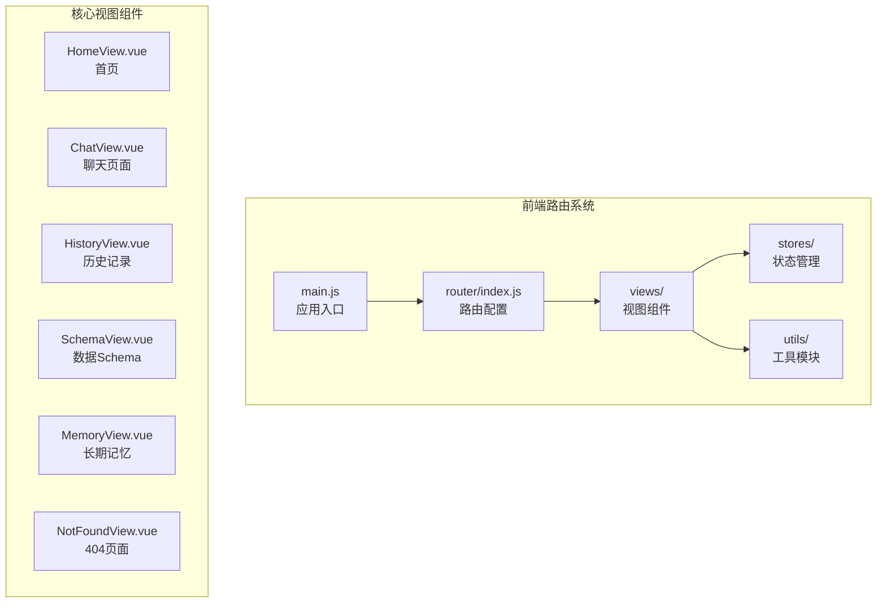
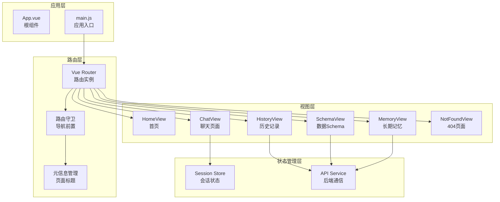
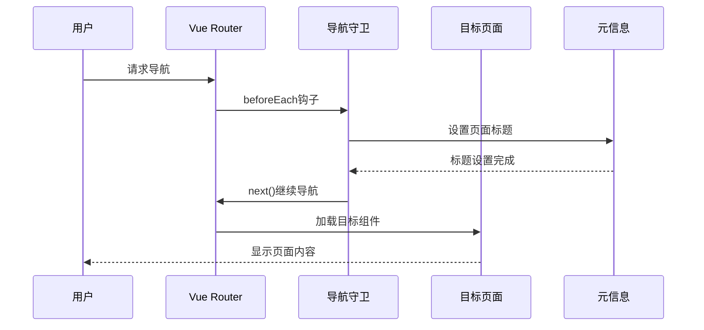
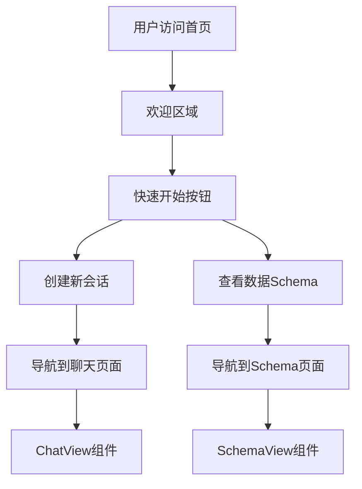
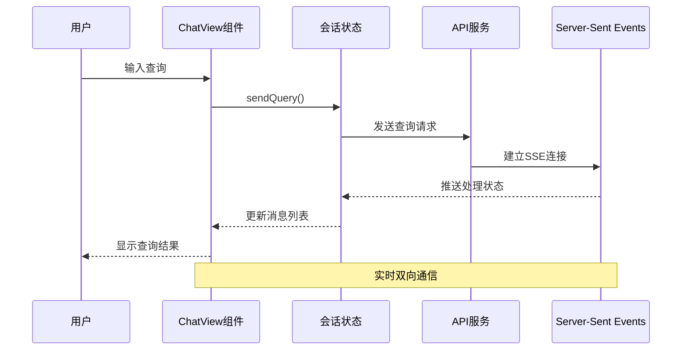
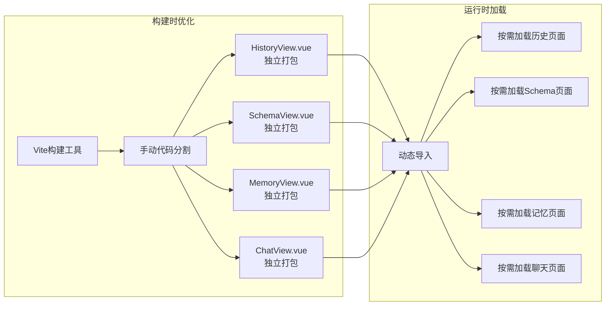
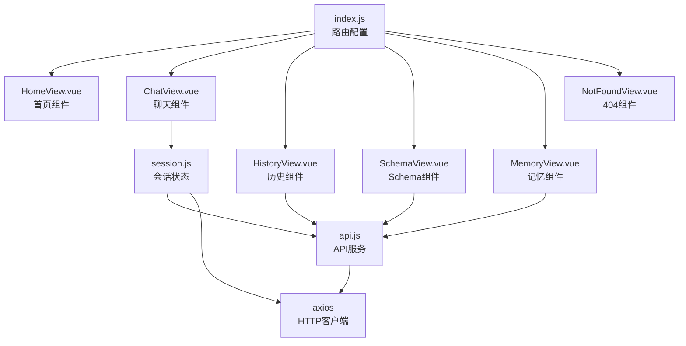
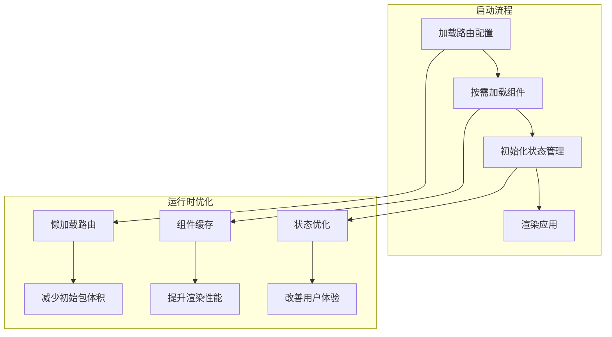

# 路由系统

<cite>
**本文档引用的文件**
- [frontend/src/router/index.js](file://frontend/src/router/index.js)
- [frontend/src/main.js](file://frontend/src/main.js)
- [frontend/src/views/HomeView.vue](file://frontend/src/views/HomeView.vue)
- [frontend/src/views/ChatView.vue](file://frontend/src/views/ChatView.vue)
- [frontend/src/views/HistoryView.vue](file://frontend/src/views/HistoryView.vue)
- [frontend/src/views/NotFoundView.vue](file://frontend/src/views/NotFoundView.vue)
- [frontend/src/views/SchemaView.vue](file://frontend/src/views/SchemaView.vue)
- [frontend/src/views/MemoryView.vue](file://frontend/src/views/MemoryView.vue)
- [frontend/src/stores/session.js](file://frontend/src/stores/session.js)
- [frontend/src/utils/api.js](file://frontend/src/utils/api.js)
- [frontend/package.json](file://frontend/package.json)
- [frontend/vite.config.js](file://frontend/vite.config.js)
</cite>

## 目录
1. [简介](#简介)
2. [项目结构](#项目结构)
3. [核心组件](#核心组件)
4. [架构概览](#架构概览)
5. [详细组件分析](#详细组件分析)
6. [依赖分析](#依赖分析)
7. [性能考虑](#性能考虑)
8. [故障排除指南](#故障排除指南)
9. [结论](#结论)

## 简介

NL2SQL路由系统是基于Vue Router 4.2.5构建的前端路由管理框架，负责管理自然语言数据查询工具的页面导航和状态流转。该系统采用现代前端架构设计，实现了完整的单页应用(SPA)路由功能，包括静态路由、动态路由参数、路由守卫和懒加载策略。

系统的核心目标是为用户提供流畅的自然语言查询体验，通过精心设计的路由结构实现页面间的无缝切换，同时确保良好的性能表现和用户体验。

## 项目结构

前端路由系统主要位于`frontend/src/router/`目录下，配合视图组件和状态管理模块共同工作：



**图表来源**
- [frontend/src/router/index.js:1-157](file://frontend/src/router/index.js#L1-L157)
- [frontend/src/main.js:1-89](file://frontend/src/main.js#L1-L89)

**章节来源**
- [frontend/src/router/index.js:1-157](file://frontend/src/router/index.js#L1-L157)
- [frontend/src/main.js:1-89](file://frontend/src/main.js#L1-L89)

## 核心组件

### 路由配置核心

路由系统的核心配置位于`frontend/src/router/index.js`文件中，采用模块化设计，清晰分离了各个功能模块：

#### 路由定义结构
- **静态路由**: 首页、Schema查看、长期记忆管理等不需要特殊权限的页面
- **动态路由**: 聊天页面，支持会话ID参数
- **嵌套路由**: 通过命名路由实现页面间的导航关联

#### 路由元信息管理
每个路由都配置了元信息(meta)，用于：
- 页面标题设置
- 权限验证标识
- 页面状态管理

**章节来源**
- [frontend/src/router/index.js:34-109](file://frontend/src/router/index.js#L34-L109)

### 视图组件映射关系

系统包含以下核心视图组件及其路由映射：

| 路由路径 | 组件名称 | 路由名称 | 动态参数 | 元信息 |
|---------|----------|----------|----------|--------|
| `/` | HomeView | home | 无 | requiresSession: false |
| `/chat/:sessionId?` | ChatView | chat | sessionId | requiresSession: true |
| `/history` | HistoryView | history | 无 | requiresSession: false |
| `/schema` | SchemaView | schema | 无 | requiresSession: false |
| `/memory` | MemoryView | memory | 无 | requiresSession: false |
| `/evaluation` | EvaluationView | evaluation | 无 | requiresSession: false |
| `/:pathMatch(.*)*` | NotFoundView | not-found | 通配符 | 无 |

**章节来源**
- [frontend/src/router/index.js:34-109](file://frontend/src/router/index.js#L34-L109)

## 架构概览

NL2SQL路由系统采用分层架构设计，实现了清晰的关注点分离：



**图表来源**
- [frontend/src/main.js:55-89](file://frontend/src/main.js#L55-L89)
- [frontend/src/router/index.js:118-157](file://frontend/src/router/index.js#L118-L157)

## 详细组件分析

### 路由配置与守卫机制

#### 全局前置守卫实现

路由系统实现了全局前置守卫，用于统一处理页面标题设置和导航逻辑：



**图表来源**
- [frontend/src/router/index.js:142-150](file://frontend/src/router/index.js#L142-L150)

#### 路由元信息管理

每个路由都配置了元信息，用于控制页面行为和状态：

| 元信息键 | 类型 | 描述 | 示例值 |
|---------|------|------|--------|
| title | string | 页面标题 | '首页', '对话', '查询历史' |
| requiresSession | boolean | 是否需要会话 | true, false |
| icon | string | 页面图标 | 'ChatDotRound', 'DataLine' |

**章节来源**
- [frontend/src/router/index.js:43-107](file://frontend/src/router/index.js#L43-L107)

### 视图组件映射关系

#### 首页组件 (HomeView)

首页作为应用的主要入口，提供了快速开始功能：



**图表来源**
- [frontend/src/views/HomeView.vue:153-187](file://frontend/src/views/HomeView.vue#L153-L187)

#### 聊天页面组件 (ChatView)

聊天页面是系统的核心交互组件，支持实时对话和会话管理：



**图表来源**
- [frontend/src/views/ChatView.vue:196-345](file://frontend/src/views/ChatView.vue#L196-L345)
- [frontend/src/stores/session.js:297-330](file://frontend/src/stores/session.js#L297-L330)

**章节来源**
- [frontend/src/views/HomeView.vue:153-187](file://frontend/src/views/HomeView.vue#L153-L187)
- [frontend/src/views/ChatView.vue:196-345](file://frontend/src/views/ChatView.vue#L196-L345)

### 路由懒加载策略

#### 代码分割实现

系统采用了智能的懒加载策略，通过动态导入实现代码分割：



**图表来源**
- [frontend/vite.config.js:77-89](file://frontend/vite.config.js#L77-L89)
- [frontend/src/router/index.js:63-64](file://frontend/src/router/index.js#L63-L64)

#### 性能优化策略

系统通过以下方式优化加载性能：

1. **第三方库分离**: 将Element Plus、ECharts等大型库独立打包
2. **业务组件懒加载**: 非关键页面采用动态导入
3. **手动代码分割**: 针对大组件进行专门优化
4. **缓存策略**: 利用浏览器缓存机制

**章节来源**
- [frontend/vite.config.js:77-89](file://frontend/vite.config.js#L77-L89)
- [frontend/src/router/index.js:63-64](file://frontend/src/router/index.js#L63-L64)

## 依赖分析

### 外部依赖关系

```mermaid
graph TB
subgraph "Vue生态"
Vue[Vue 3.3.8<br/>核心框架]
VueRouter[Vue Router 4.2.5<br/>路由管理]
Pinia[Pinia 2.1.7<br/>状态管理]
end
subgraph "UI组件库"
ElementPlus[Element Plus 2.4.4<br/>UI组件]
Icons[Element Plus Icons<br/>图标系统]
end
subgraph "工具库"
Axios[Axios 1.6.2<br/>HTTP客户端]
DayJS[DayJS 1.11.10<br/>日期处理]
UUID[UUID 13.0.0<br/>ID生成]
end
subgraph "构建工具"
Vite[Vite 5.0.8<br/>开发服务器]
VuePlugin[@vitejs/plugin-vue<br/>Vue支持]
end
Vue --> VueRouter
Vue --> Pinia
Vue --> ElementPlus
ElementPlus --> Icons
Vue --> Axios
Vue --> DayJS
Vue --> UUID
Vite --> VuePlugin
Vite --> Vue
```

**图表来源**
- [frontend/package.json:11-28](file://frontend/package.json#L11-L28)

### 内部模块依赖

系统内部模块之间的依赖关系清晰明确：



**图表来源**
- [frontend/src/router/index.js:21-24](file://frontend/src/router/index.js#L21-L24)
- [frontend/src/stores/session.js:15-22](file://frontend/src/stores/session.js#L15-L22)

**章节来源**
- [frontend/package.json:11-28](file://frontend/package.json#L11-L28)
- [frontend/src/router/index.js:21-24](file://frontend/src/router/index.js#L21-L24)

## 性能考虑

### 加载性能优化

系统在多个层面实现了性能优化：

#### 代码分割策略
- **按需加载**: 非关键页面采用动态导入
- **手动分割**: 大型组件独立打包
- **第三方库分离**: 减少重复打包

#### 缓存策略
- **浏览器缓存**: 利用HTTP缓存机制
- **组件缓存**: Vue组件级别的缓存优化
- **状态缓存**: Pinia状态持久化

#### 网络优化
- **请求合并**: 合理的API调用策略
- **错误重试**: 智能的错误处理机制
- **超时控制**: 合理的请求超时设置

### 运行时性能



**图表来源**
- [frontend/vite.config.js:77-89](file://frontend/vite.config.js#L77-L89)

## 故障排除指南

### 常见问题及解决方案

#### 路由导航问题

**问题**: 路由无法正确导航
**原因**: 路由配置错误或组件导入问题
**解决方案**: 
1. 检查路由路径配置
2. 验证组件导入路径
3. 确认路由名称唯一性

#### 会话管理问题

**问题**: 聊天页面无法正常加载会话
**原因**: 会话ID参数缺失或API调用失败
**解决方案**:
1. 检查路由参数传递
2. 验证API接口可用性
3. 确认会话状态管理正确

#### 性能问题

**问题**: 页面加载缓慢
**原因**: 资源过大或网络延迟
**解决方案**:
1. 检查代码分割配置
2. 优化图片和资源文件
3. 实施缓存策略

#### 开发环境问题

**问题**: 开发服务器无法正常工作
**原因**: 代理配置或端口冲突
**解决方案**:
1. 检查Vite配置
2. 验证代理设置
3. 确认端口可用性

**章节来源**
- [frontend/src/router/index.js:142-150](file://frontend/src/router/index.js#L142-L150)
- [frontend/src/stores/session.js:301-330](file://frontend/src/stores/session.js#L301-L330)

## 结论

NL2SQL路由系统展现了现代前端架构的最佳实践，通过精心设计的路由配置、智能的懒加载策略和完善的错误处理机制，为用户提供了流畅的自然语言数据查询体验。

系统的主要优势包括：

1. **清晰的架构设计**: 分层架构确保了代码的可维护性和可扩展性
2. **优秀的性能表现**: 通过代码分割和缓存策略实现了快速加载
3. **完善的错误处理**: 全面的异常处理和用户友好的错误提示
4. **灵活的扩展能力**: 模块化的组件设计便于功能扩展

未来可以在以下方面进一步优化：
- 实现更精细的权限控制机制
- 增强路由守卫的复杂场景处理
- 优化移动端的路由体验
- 实施更高级的性能监控和分析