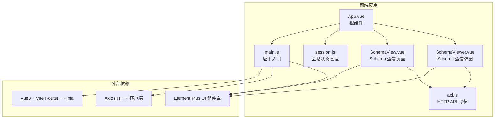
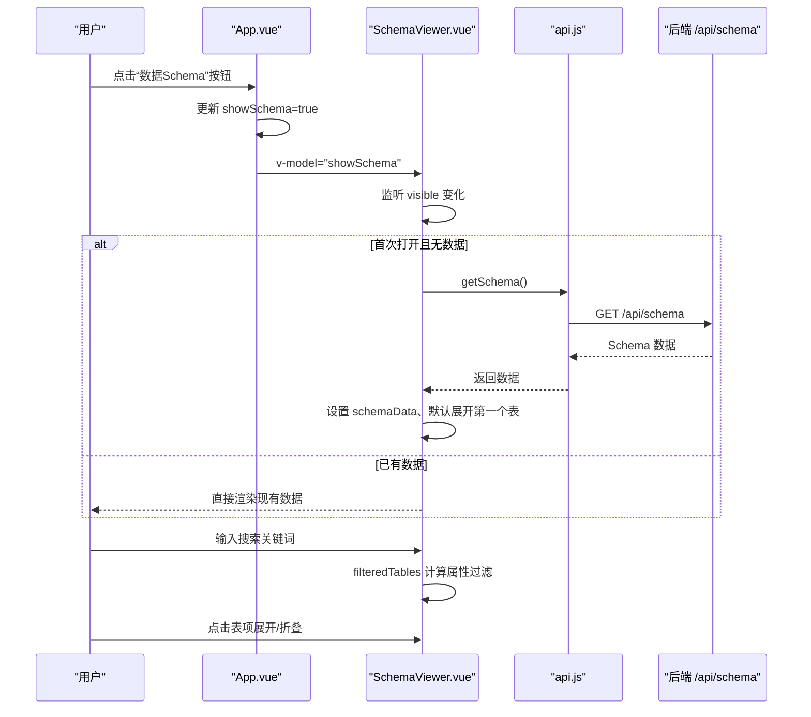
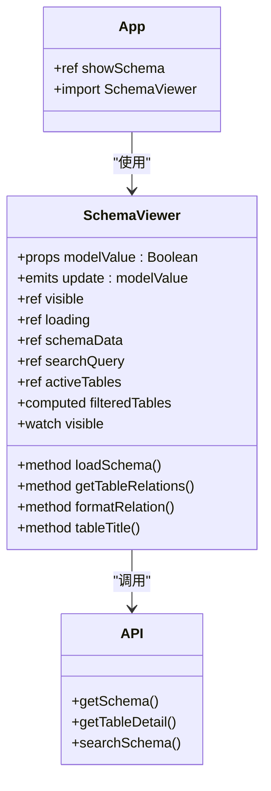

# UI 组件

<cite>
**本文引用的文件**
- [SchemaViewer.vue](file://frontend/src/components/SchemaViewer.vue)
- [SchemaView.vue](file://frontend/src/views/SchemaView.vue)
- [App.vue](file://frontend/src/App.vue)
- [api.js](file://frontend/src/utils/api.js)
- [session.js](file://frontend/src/stores/session.js)
- [main.js](file://frontend/src/main.js)
- [package.json](file://frontend/package.json)
</cite>

## 目录
1. [简介](#简介)
2. [项目结构](#项目结构)
3. [核心组件](#核心组件)
4. [架构总览](#架构总览)
5. [组件详细分析](#组件详细分析)
6. [依赖关系分析](#依赖关系分析)
7. [性能考量](#性能考量)
8. [故障排查指南](#故障排查指南)
9. [结论](#结论)
10. [附录](#附录)

## 简介
本文件为 NL2SQL 前端工程中的可复用 UI 组件“SchemaViewer”提供系统化的组件文档。重点涵盖：
- 数据展示逻辑与交互行为
- Props 接口、事件系统、插槽使用
- 样式定制与主题扩展策略
- 可扩展性设计（主题、样式覆盖、功能扩展）
- 最佳实践（性能优化、无障碍访问、响应式设计）
- 测试策略与调试方法

SchemaViewer 是一个以弹窗形式展示数据 Schema 的组件，支持搜索、懒加载、折叠展示表结构、字段与关系信息等能力。它与后端 API 通过统一的 axios 客户端进行通信，并在根组件中被集成使用。

## 项目结构
前端采用 Vue3 + Vite + Element Plus + Pinia 架构，组件位于 src/components，页面位于 src/views，状态管理位于 src/stores，工具类位于 src/utils。

图表来源
- [App.vue:117-118](file://frontend/src/App.vue#L117-L118)
- [SchemaViewer.vue:103](file://frontend/src/components/SchemaViewer.vue#L103)
- [SchemaView.vue:162](file://frontend/src/views/SchemaView.vue#L162)
- [main.js:37-42](file://frontend/src/main.js#L37-L42)

章节来源
- [package.json:11-28](file://frontend/package.json#L11-L28)
- [main.js:55-89](file://frontend/src/main.js#L55-L89)

## 核心组件
SchemaViewer 组件的核心职责：
- 以弹窗形式展示数据 Schema
- 支持按表名、中文名、描述、字段名/中文名进行搜索过滤
- 懒加载：首次打开弹窗时才拉取 Schema 数据
- 折叠展示表结构，支持展开默认第一个表
- 展示字段列表、主键标识、类型标签、描述
- 展示表间关系（from/to 表、关系类型、描述）

章节来源
- [SchemaViewer.vue:6-86](file://frontend/src/components/SchemaViewer.vue#L6-L86)
- [SchemaViewer.vue:112-123](file://frontend/src/components/SchemaViewer.vue#L112-L123)
- [SchemaViewer.vue:130-147](file://frontend/src/components/SchemaViewer.vue#L130-L147)
- [SchemaViewer.vue:157-182](file://frontend/src/components/SchemaViewer.vue#L157-L182)
- [SchemaViewer.vue:191-208](file://frontend/src/components/SchemaViewer.vue#L191-L208)
- [SchemaViewer.vue:215-230](file://frontend/src/components/SchemaViewer.vue#L215-L230)
- [SchemaViewer.vue:237-242](file://frontend/src/components/SchemaViewer.vue#L237-L242)
- [SchemaViewer.vue:252-256](file://frontend/src/components/SchemaViewer.vue#L252-L256)

## 架构总览
SchemaViewer 的调用链路与数据流如下：

图表来源
- [App.vue:54-56](file://frontend/src/App.vue#L54-L56)
- [App.vue:80-81](file://frontend/src/App.vue#L80-L81)
- [SchemaViewer.vue:252-256](file://frontend/src/components/SchemaViewer.vue#L252-L256)
- [SchemaViewer.vue:191-208](file://frontend/src/components/SchemaViewer.vue#L191-L208)
- [api.js:118-120](file://frontend/src/utils/api.js#L118-L120)

## 组件详细分析

### 组件 API 设计
- Props
  - modelValue: Boolean，控制弹窗显示/隐藏（双向绑定）
- Emits
  - update:modelValue: 用于同步弹窗状态
- 插槽
  - 未使用具名/作用域插槽；通过模板结构与 scoped 样式实现内容定制
- 计算属性
  - filteredTables: 基于搜索关键词过滤表集合
- 方法
  - loadSchema(): 拉取 Schema 数据
  - getTableRelations(tableName): 获取某表的关联关系
  - formatRelation(relation): 格式化关系显示
  - tableTitle(table): 生成表标题（优先中文名）
- 监听器
  - watch(visible): 首次打开时懒加载数据

章节来源
- [SchemaViewer.vue:112-123](file://frontend/src/components/SchemaViewer.vue#L112-L123)
- [SchemaViewer.vue:130-147](file://frontend/src/components/SchemaViewer.vue#L130-L147)
- [SchemaViewer.vue:157-182](file://frontend/src/components/SchemaViewer.vue#L157-L182)
- [SchemaViewer.vue:191-208](file://frontend/src/components/SchemaViewer.vue#L191-L208)
- [SchemaViewer.vue:215-230](file://frontend/src/components/SchemaViewer.vue#L215-L230)
- [SchemaViewer.vue:237-242](file://frontend/src/components/SchemaViewer.vue#L237-L242)
- [SchemaViewer.vue:252-256](file://frontend/src/components/SchemaViewer.vue#L252-L256)

### 数据模型与展示逻辑
- 数据结构
  - schemaData: 包含 tables、relationships、metrics、dimensions
  - tables: 每个表包含 name/name_cn/description/fields
  - fields: 每个字段包含 name/name_cn/type/description/is_primary
  - relationships: 每条关系包含 from/to/type/description
- 展示逻辑
  - 表标题：优先显示中文名+英文名，否则仅英文名
  - 字段列：字段名加代码样式，主键字段带危险色标签
  - 关系展示：按表名过滤，格式化为“from → to”
  - 搜索范围：表名、中文名、描述、字段名/中文名
  - 懒加载：首次打开弹窗时触发加载

章节来源
- [SchemaViewer.vue:138-143](file://frontend/src/components/SchemaViewer.vue#L138-L143)
- [SchemaViewer.vue:45-68](file://frontend/src/components/SchemaViewer.vue#L45-L68)
- [SchemaViewer.vue:71-81](file://frontend/src/components/SchemaViewer.vue#L71-L81)
- [SchemaViewer.vue:157-182](file://frontend/src/components/SchemaViewer.vue#L157-L182)
- [SchemaViewer.vue:215-230](file://frontend/src/components/SchemaViewer.vue#L215-L230)
- [SchemaViewer.vue:237-242](file://frontend/src/components/SchemaViewer.vue#L237-L242)

### 交互行为与用户体验
- 弹窗控制：通过 v-model 实现双向绑定，点击遮罩不关闭
- 搜索：支持清空、实时过滤
- 折叠：默认展开第一个表，支持逐表展开/折叠
- 加载态：Skeleton 骨架屏，空态 Empty 提示
- 关系可视化：关系以标签形式展示，便于快速理解表间联系

章节来源
- [SchemaViewer.vue:6-11](file://frontend/src/components/SchemaViewer.vue#L6-L11)
- [SchemaViewer.vue:13-20](file://frontend/src/components/SchemaViewer.vue#L13-L20)
- [SchemaViewer.vue:25](file://frontend/src/components/SchemaViewer.vue#L25)
- [SchemaViewer.vue:28](file://frontend/src/components/SchemaViewer.vue#L28)
- [SchemaViewer.vue:32-83](file://frontend/src/components/SchemaViewer.vue#L32-L83)

### 样式定制与主题扩展
- 组件内样式：scoped，包含搜索框、内容区域、表描述、字段标签、关系标签、代码块等样式
- 全局样式：Element Plus 样式在入口统一引入
- 主题扩展建议
  - 使用 CSS 变量覆盖 Element Plus 主题变量
  - 通过深度选择器覆盖组件内部样式（如 :deep(.el-table)）
  - 为组件增加额外的 class 属性以便父级覆盖
  - 为关键节点提供 data-testid 或 aria-* 属性便于测试与无障碍

章节来源
- [SchemaViewer.vue:259-316](file://frontend/src/components/SchemaViewer.vue#L259-L316)
- [main.js:39-40](file://frontend/src/main.js#L39-L40)

### 可扩展性设计
- 功能扩展
  - 增加更多筛选条件（字段类型、关系类型）
  - 支持导出 Schema 为 PDF/Markdown
  - 增加“复制字段名/表名”的快捷操作
- 样式扩展
  - 提供更多尺寸/密度变体（size 属性）
  - 支持暗色模式切换
- 事件扩展
  - 触发展开/折叠回调，便于埋点统计
  - 触发搜索词变更回调，便于搜索日志

章节来源
- [SchemaViewer.vue:45](file://frontend/src/components/SchemaViewer.vue#L45)
- [SchemaViewer.vue:157-182](file://frontend/src/components/SchemaViewer.vue#L157-L182)

### 与后端 API 的集成
- Schema 获取：GET /api/schema
- 表详情：GET /api/schema/tables/{tableName}
- Schema 搜索：GET /api/schema/search?q=...&limit=...

章节来源
- [api.js:118-141](file://frontend/src/utils/api.js#L118-L141)

### 与根组件的集成
- 根组件在侧边栏工具栏提供“数据Schema”按钮
- 通过 v-model 控制弹窗显示
- 未显式传入其他 props，保持最小接口

章节来源
- [App.vue:54-56](file://frontend/src/App.vue#L54-L56)
- [App.vue:80-81](file://frontend/src/App.vue#L80-L81)

## 依赖关系分析

图表来源
- [SchemaViewer.vue:112-123](file://frontend/src/components/SchemaViewer.vue#L112-L123)
- [SchemaViewer.vue:191-208](file://frontend/src/components/SchemaViewer.vue#L191-L208)
- [api.js:118-141](file://frontend/src/utils/api.js#L118-L141)
- [App.vue:80-81](file://frontend/src/App.vue#L80-L81)

章节来源
- [SchemaViewer.vue:98-103](file://frontend/src/components/SchemaViewer.vue#L98-L103)
- [api.js:14-15](file://frontend/src/utils/api.js#L14-L15)
- [main.js:37-42](file://frontend/src/main.js#L37-L42)

## 性能考量
- 懒加载：首次打开弹窗才请求数据，减少初始负载
- 计算属性：filteredTables 基于搜索关键词计算，避免重复渲染
- 列表渲染：使用 Element Plus 的 el-table 和 el-collapse，具备虚拟滚动能力（需在大数据场景下验证）
- 图标与骨架屏：使用 Element Plus 图标与 Skeleton，提升加载体验
- 建议
  - 对超大 Schema，考虑分页或分批加载
  - 对搜索词频繁变化的场景，可加入防抖
  - 对关系较多的表，考虑折叠展示或分页

章节来源
- [SchemaViewer.vue:25](file://frontend/src/components/SchemaViewer.vue#L25)
- [SchemaViewer.vue:157-182](file://frontend/src/components/SchemaViewer.vue#L157-L182)
- [SchemaViewer.vue:252-256](file://frontend/src/components/SchemaViewer.vue#L252-L256)

## 故障排查指南
- 常见问题
  - 弹窗无法打开：检查 v-model 绑定与父组件状态
  - 数据不显示：检查 API 返回结构是否符合 schemaData 预期
  - 搜索无效：检查搜索关键词大小写与字段映射
  - 关系显示异常：检查 relationships 数据格式
- 调试方法
  - 在 loadSchema 中添加日志，确认 API 调用与返回
  - 在 watch(visible) 中添加日志，确认懒加载触发
  - 使用浏览器开发者工具检查网络请求与响应
  - 在组件中临时输出 schemaData，定位数据结构问题
- 错误处理
  - API 层已统一拦截错误，组件层可补充本地错误提示
  - 对空数据场景，使用 Empty 组件提示

章节来源
- [SchemaViewer.vue:191-208](file://frontend/src/components/SchemaViewer.vue#L191-L208)
- [SchemaViewer.vue:252-256](file://frontend/src/components/SchemaViewer.vue#L252-L256)
- [api.js:67-88](file://frontend/src/utils/api.js#L67-L88)

## 结论
SchemaViewer 组件以简洁的 Props 接口与清晰的数据流实现了 Schema 的弹窗展示，具备懒加载、搜索过滤、折叠展示等实用特性。其设计遵循单一职责与最小接口原则，易于扩展与维护。结合 Element Plus 的组件生态与 axios 的统一拦截，组件在可用性与可维护性方面表现良好。建议后续在大数据场景下引入分页/防抖与更丰富的交互反馈，以进一步提升用户体验。

## 附录

### 组件使用最佳实践
- 性能优化
  - 首屏不强制加载，仅在用户需要时触发
  - 对搜索词变化进行节流/防抖
  - 大数据量时考虑分页或虚拟滚动
- 无障碍访问
  - 为搜索框、表格、按钮添加合适的 aria-label
  - 为键盘用户提供 Tab 导航与 Enter 触发
  - 为加载状态提供屏幕阅读器友好的提示
- 响应式设计
  - 弹窗宽度固定，配合内容区域滚动
  - 表格列宽适配移动端，必要时支持横向滚动
- 样式与主题
  - 使用 CSS 变量与深度选择器进行主题覆盖
  - 为关键节点提供 data-testid，便于自动化测试

### 测试策略
- 单元测试
  - 测试计算属性 filteredTables 的过滤逻辑
  - 测试方法 loadSchema 的错误处理
  - 测试 watch(visible) 的懒加载行为
- 集成测试
  - 模拟 API 返回，验证弹窗渲染与交互
  - 验证搜索、折叠、关系展示的正确性
- 端到端测试
  - 端到端验证从点击按钮到弹窗出现、数据加载、交互反馈的完整流程

### 与页面 SchemaView 的对比
- SchemaViewer：弹窗、懒加载、搜索、折叠
- SchemaView：完整页面、标签页、统计信息、网格卡片布局
- 适用场景：SchemaViewer 适合快速查阅与搜索，SchemaView 适合全面浏览与导出

章节来源
- [SchemaView.vue:1-322](file://frontend/src/views/SchemaView.vue#L1-L322)