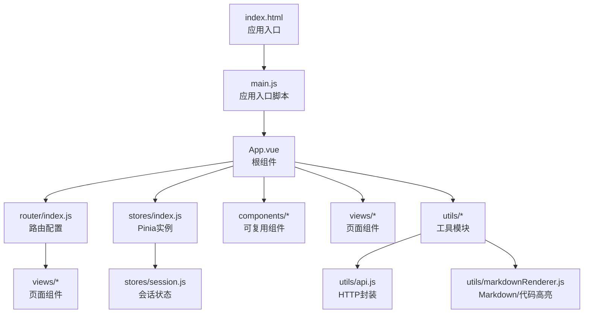
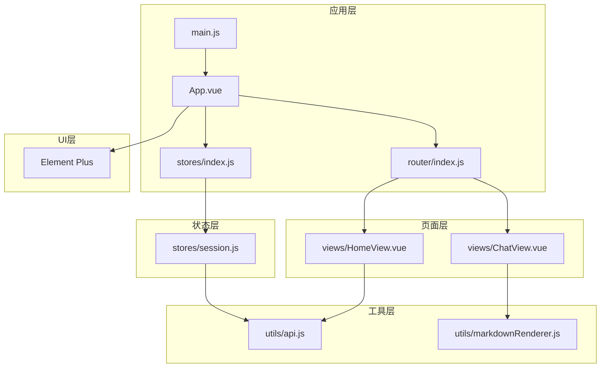
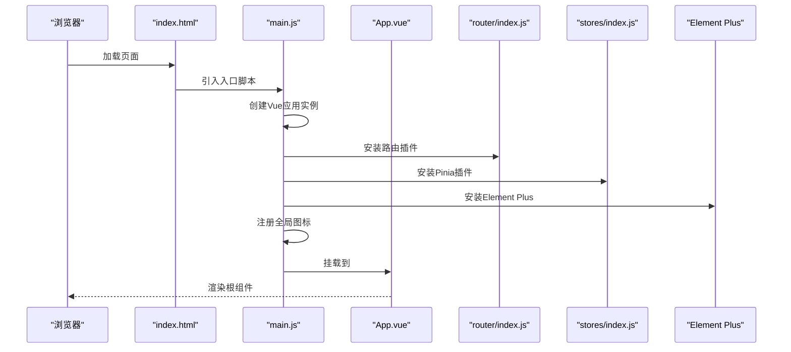
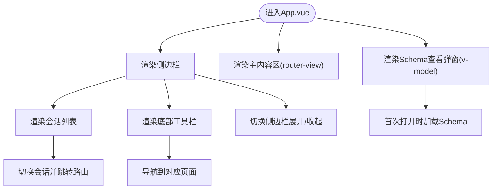
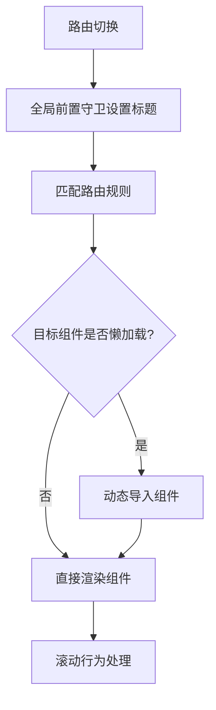
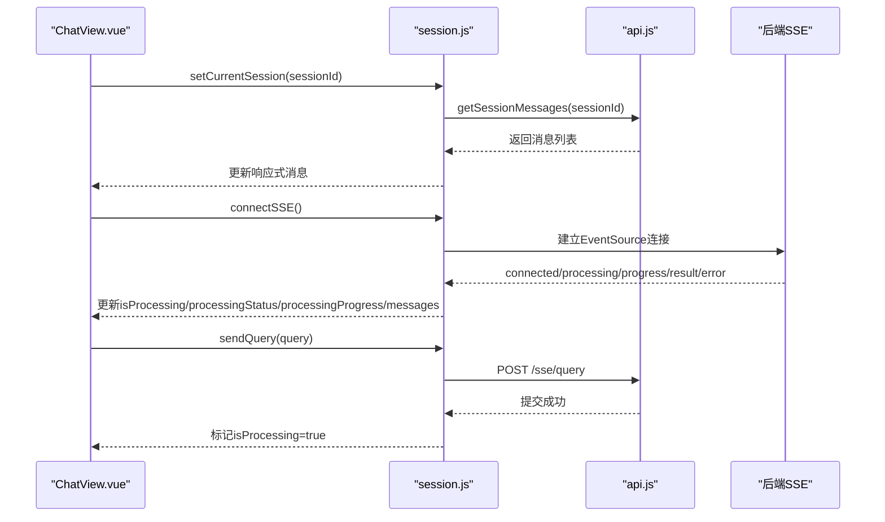
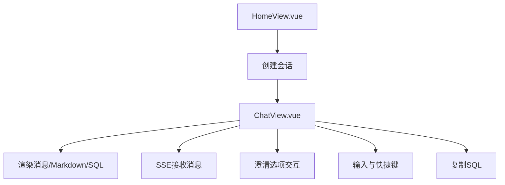
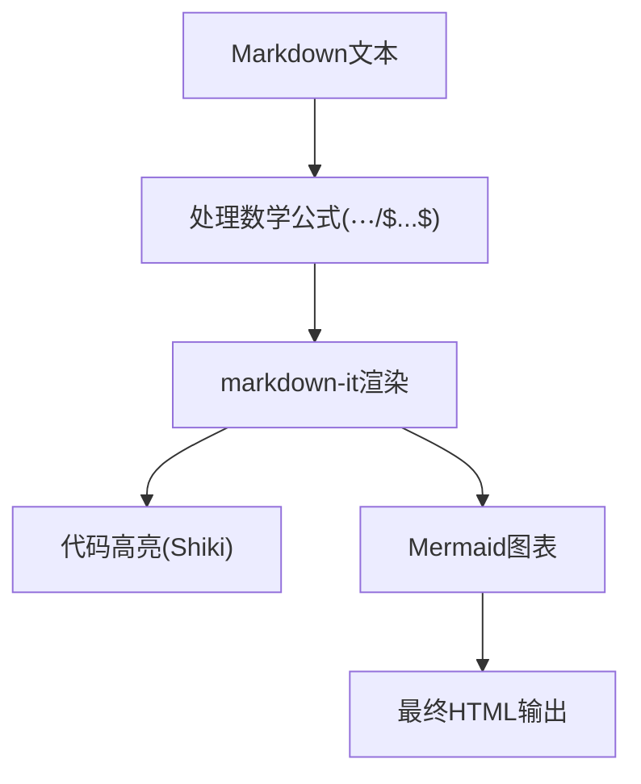
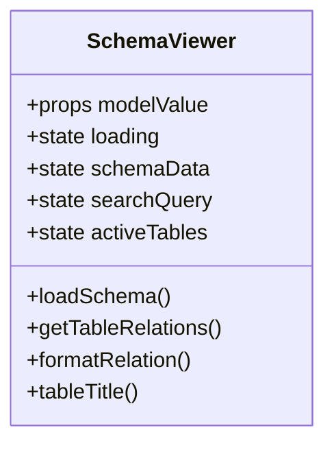
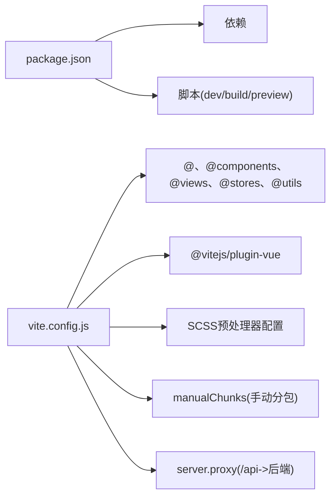

# Vue3 应用结构

<cite>
**本文引用的文件**
- [package.json](file://frontend/package.json)
- [vite.config.js](file://frontend/vite.config.js)
- [main.js](file://frontend/src/main.js)
- [App.vue](file://frontend/src/App.vue)
- [router/index.js](file://frontend/src/router/index.js)
- [stores/index.js](file://frontend/src/stores/index.js)
- [stores/session.js](file://frontend/src/stores/session.js)
- [views/HomeView.vue](file://frontend/src/views/HomeView.vue)
- [views/ChatView.vue](file://frontend/src/views/ChatView.vue)
- [utils/api.js](file://frontend/src/utils/api.js)
- [utils/markdownRenderer.js](file://frontend/src/utils/markdownRenderer.js)
- [components/SchemaViewer.vue](file://frontend/src/components/SchemaViewer.vue)
- [styles/global.css](file://frontend/src/styles/global.css)
- [index.html](file://frontend/index.html)
</cite>

## 目录
1. [简介](#简介)
2. [项目结构](#项目结构)
3. [核心组件](#核心组件)
4. [架构总览](#架构总览)
5. [详细组件分析](#详细组件分析)
6. [依赖分析](#依赖分析)
7. [性能考虑](#性能考虑)
8. [故障排查指南](#故障排查指南)
9. [结论](#结论)
10. [附录](#附录)

## 简介
本文件面向 NL2SQL Vue3 前端应用，系统性梳理其启动流程、根组件设计、路由配置策略、模块化设计原则、Vite 构建配置与优化策略、以及性能优化最佳实践。文档同时覆盖开发环境配置、热重载机制与调试工具使用方法，帮助开发者快速理解并高效维护该应用。

## 项目结构
前端采用典型的 Vue3 单页应用（SPA）结构，主要目录与职责如下：
- src：源代码目录
  - components：可复用组件（如 SchemaViewer）
  - router：路由配置（history 模式）
  - stores：状态管理（Pinia）
  - utils：工具模块（API、Markdown 渲染）
  - views：页面组件（HomeView、ChatView 等）
  - styles：全局样式
  - App.vue：根组件
  - main.js：应用入口
- public：静态资源（本项目未见）
- index.html：应用入口 HTML
- vite.config.js：Vite 构建配置
- package.json：依赖与脚本

**图表来源**
- [index.html:1-33](file://frontend/index.html#L1-L33)
- [main.js:1-89](file://frontend/src/main.js#L1-L89)
- [App.vue:1-384](file://frontend/src/App.vue#L1-L384)
- [router/index.js:1-157](file://frontend/src/router/index.js#L1-L157)
- [stores/index.js:1-30](file://frontend/src/stores/index.js#L1-L30)
- [stores/session.js:1-443](file://frontend/src/stores/session.js#L1-L443)
- [utils/api.js:1-320](file://frontend/src/utils/api.js#L1-L320)
- [utils/markdownRenderer.js:1-258](file://frontend/src/utils/markdownRenderer.js#L1-L258)
- [components/SchemaViewer.vue:1-317](file://frontend/src/components/SchemaViewer.vue#L1-L317)

**章节来源**
- [index.html:1-33](file://frontend/index.html#L1-L33)
- [main.js:1-89](file://frontend/src/main.js#L1-L89)
- [App.vue:1-384](file://frontend/src/App.vue#L1-L384)
- [router/index.js:1-157](file://frontend/src/router/index.js#L1-L157)
- [stores/index.js:1-30](file://frontend/src/stores/index.js#L1-L30)
- [stores/session.js:1-443](file://frontend/src/stores/session.js#L1-L443)
- [utils/api.js:1-320](file://frontend/src/utils/api.js#L1-L320)
- [utils/markdownRenderer.js:1-258](file://frontend/src/utils/markdownRenderer.js#L1-L258)
- [components/SchemaViewer.vue:1-317](file://frontend/src/components/SchemaViewer.vue#L1-L317)

## 核心组件
- 应用入口与插件安装
  - main.js 负责创建 Vue 应用实例、安装路由、状态管理、UI 组件库、注册全局图标、导入全局样式，并挂载到 DOM。
- 根组件与布局
  - App.vue 提供侧边栏（会话列表、历史会话、工具按钮）、主内容区（router-view）与 Schema 查看弹窗，配合 Element Plus 实现交互。
- 路由系统
  - router/index.js 定义多页面路由（首页、聊天、历史、Schema、内存、评估、404），使用 history 模式与滚动行为配置；全局前置守卫设置页面标题。
- 状态管理
  - stores/index.js 创建 Pinia 实例；stores/session.js 定义会话 Store，管理会话列表、当前会话、消息、SSE 连接与处理状态。
- 页面组件
  - HomeView.vue：欢迎页与快速开始入口；ChatView.vue：对话界面，支持 Markdown 渲染、SQL 高亮、澄清交互、SSE 推送。
- 工具模块
  - utils/api.js：基于 axios 的 API 封装，统一请求/响应拦截与错误处理；提供 Schema、会话、查询历史、评估等接口。
  - utils/markdownRenderer.js：集成 markdown-it、Shiki、Mermaid、KaTeX，实现 Markdown、代码高亮、图表与数学公式渲染。
- 可复用组件
  - components/SchemaViewer.vue：弹窗式 Schema 查看器，支持搜索、折叠、字段与关系展示。
- 全局样式
  - styles/global.css：基础重置、滚动条、通用工具类、Element Plus 自定义样式与动画。

**章节来源**
- [main.js:1-89](file://frontend/src/main.js#L1-L89)
- [App.vue:1-384](file://frontend/src/App.vue#L1-L384)
- [router/index.js:1-157](file://frontend/src/router/index.js#L1-L157)
- [stores/index.js:1-30](file://frontend/src/stores/index.js#L1-L30)
- [stores/session.js:1-443](file://frontend/src/stores/session.js#L1-L443)
- [views/HomeView.vue:1-318](file://frontend/src/views/HomeView.vue#L1-L318)
- [views/ChatView.vue:1-835](file://frontend/src/views/ChatView.vue#L1-L835)
- [utils/api.js:1-320](file://frontend/src/utils/api.js#L1-L320)
- [utils/markdownRenderer.js:1-258](file://frontend/src/utils/markdownRenderer.js#L1-L258)
- [components/SchemaViewer.vue:1-317](file://frontend/src/components/SchemaViewer.vue#L1-L317)
- [styles/global.css:1-317](file://frontend/src/styles/global.css#L1-L317)

## 架构总览
应用采用“入口脚本 -> 根组件 -> 路由 -> 页面组件 -> 工具模块”的分层架构，状态管理集中于 Pinia，UI 采用 Element Plus，数据交互通过 axios 封装的 API 模块，富文本与代码高亮通过独立工具模块实现。

**图表来源**
- [main.js:1-89](file://frontend/src/main.js#L1-L89)
- [App.vue:1-384](file://frontend/src/App.vue#L1-L384)
- [router/index.js:1-157](file://frontend/src/router/index.js#L1-L157)
- [stores/index.js:1-30](file://frontend/src/stores/index.js#L1-L30)
- [stores/session.js:1-443](file://frontend/src/stores/session.js#L1-L443)
- [views/HomeView.vue:1-318](file://frontend/src/views/HomeView.vue#L1-L318)
- [views/ChatView.vue:1-835](file://frontend/src/views/ChatView.vue#L1-L835)
- [utils/api.js:1-320](file://frontend/src/utils/api.js#L1-L320)
- [utils/markdownRenderer.js:1-258](file://frontend/src/utils/markdownRenderer.js#L1-L258)

## 详细组件分析

### 启动流程与入口脚本
- 创建应用实例并安装插件（路由、状态管理、UI 组件库）
- 注册全局图标组件，便于在任意组件中直接使用
- 导入全局样式，保证统一风格
- 挂载到 DOM 元素 #app

**图表来源**
- [index.html:1-33](file://frontend/index.html#L1-L33)
- [main.js:1-89](file://frontend/src/main.js#L1-L89)
- [App.vue:1-384](file://frontend/src/App.vue#L1-L384)
- [router/index.js:1-157](file://frontend/src/router/index.js#L1-L157)
- [stores/index.js:1-30](file://frontend/src/stores/index.js#L1-L30)

**章节来源**
- [index.html:1-33](file://frontend/index.html#L1-L33)
- [main.js:1-89](file://frontend/src/main.js#L1-L89)

### 根组件设计与布局
- 侧边栏：Logo、新建会话、历史会话列表、底部工具栏（Schema、记忆、评估、设置、侧边栏开关）
- 主内容区：router-view，承载当前路由对应的页面
- Schema 查看弹窗：通过 v-model 控制显示，按需加载 Schema 数据

**图表来源**
- [App.vue:1-384](file://frontend/src/App.vue#L1-L384)
- [components/SchemaViewer.vue:1-317](file://frontend/src/components/SchemaViewer.vue#L1-L317)

**章节来源**
- [App.vue:1-384](file://frontend/src/App.vue#L1-L384)
- [components/SchemaViewer.vue:1-317](file://frontend/src/components/SchemaViewer.vue#L1-L317)

### 路由配置策略
- 路由模式：HTML5 History 模式，URL 更美观
- 路由规则：首页、聊天（带会话参数）、历史、Schema、内存、评估、404
- 懒加载：历史、Schema、内存、评估页面按需加载，减少首屏体积
- 全局守卫：设置页面标题，增强用户体验
- 滚动行为：返回顶部或恢复滚动位置

**图表来源**
- [router/index.js:1-157](file://frontend/src/router/index.js#L1-L157)

**章节来源**
- [router/index.js:1-157](file://frontend/src/router/index.js#L1-L157)

### 状态管理与会话流
- Pinia 实例：stores/index.js 创建并导出
- 会话 Store：stores/session.js
  - State：会话列表、当前会话 ID、消息列表、SSE 连接、连接状态、处理状态与进度
  - Getters：当前会话、消息数量
  - Actions：加载会话、创建会话、设置当前会话、加载消息、添加消息、连接/断开 SSE、发送查询、发送澄清回答、删除会话
- SSE 处理：根据消息类型（connected/processing/progress/result/error）更新状态与消息列表，刷新会话列表

**图表来源**
- [stores/session.js:1-443](file://frontend/src/stores/session.js#L1-L443)
- [utils/api.js:1-320](file://frontend/src/utils/api.js#L1-L320)
- [views/ChatView.vue:1-835](file://frontend/src/views/ChatView.vue#L1-L835)

**章节来源**
- [stores/index.js:1-30](file://frontend/src/stores/index.js#L1-L30)
- [stores/session.js:1-443](file://frontend/src/stores/session.js#L1-L443)
- [utils/api.js:1-320](file://frontend/src/utils/api.js#L1-L320)
- [views/ChatView.vue:1-835](file://frontend/src/views/ChatView.vue#L1-L835)

### 页面组件与交互
- HomeView.vue：欢迎页、功能特性、使用示例；创建会话并跳转聊天页
- ChatView.vue：消息列表、Markdown 渲染、SQL 代码高亮、澄清交互、SSE 处理、输入与快捷键、复制 SQL、自动滚动

**图表来源**
- [views/HomeView.vue:1-318](file://frontend/src/views/HomeView.vue#L1-L318)
- [views/ChatView.vue:1-835](file://frontend/src/views/ChatView.vue#L1-L835)
- [utils/markdownRenderer.js:1-258](file://frontend/src/utils/markdownRenderer.js#L1-L258)

**章节来源**
- [views/HomeView.vue:1-318](file://frontend/src/views/HomeView.vue#L1-L318)
- [views/ChatView.vue:1-835](file://frontend/src/views/ChatView.vue#L1-L835)
- [utils/markdownRenderer.js:1-258](file://frontend/src/utils/markdownRenderer.js#L1-L258)

### 工具模块与富文本渲染
- utils/api.js：axios 实例封装，统一请求/响应拦截与错误处理；提供 Schema、会话、查询历史、评估等 API
- utils/markdownRenderer.js：集成 markdown-it、Shiki、Mermaid、KaTeX，支持 Markdown、代码高亮、图表与数学公式渲染

**图表来源**
- [utils/markdownRenderer.js:1-258](file://frontend/src/utils/markdownRenderer.js#L1-L258)

**章节来源**
- [utils/api.js:1-320](file://frontend/src/utils/api.js#L1-L320)
- [utils/markdownRenderer.js:1-258](file://frontend/src/utils/markdownRenderer.js#L1-L258)

### 可复用组件
- components/SchemaViewer.vue：弹窗式 Schema 查看器，支持搜索、折叠、字段与关系展示；首次打开时加载数据并默认展开首个表

**图表来源**
- [components/SchemaViewer.vue:1-317](file://frontend/src/components/SchemaViewer.vue#L1-L317)

**章节来源**
- [components/SchemaViewer.vue:1-317](file://frontend/src/components/SchemaViewer.vue#L1-L317)

## 依赖分析
- 依赖与脚本
  - package.json 定义了 Vue3、Vue Router、Pinia、Element Plus、axios、markdown-it、mermaid、katex、shiki 等核心依赖，以及 Vite、@vitejs/plugin-vue、sass 等开发依赖与脚本命令（dev/build/preview）。
- 路径别名与插件
  - vite.config.js 配置了 @、@components、@views、@stores、@utils 等路径别名，启用 @vitejs/plugin-vue，SCSS 自动导入 Element Plus 变量，构建时手动分包（element-plus、echarts、vendor）。
- 开发服务器与代理
  - server.port、server.open、server.proxy 将 /api 代理至后端服务，解决跨域问题。

**图表来源**
- [package.json:1-36](file://frontend/package.json#L1-L36)
- [vite.config.js:1-93](file://frontend/vite.config.js#L1-L93)

**章节来源**
- [package.json:1-36](file://frontend/package.json#L1-L36)
- [vite.config.js:1-93](file://frontend/vite.config.js#L1-L93)

## 性能考虑
- 代码分割与懒加载
  - 路由层面：历史、Schema、内存、评估页面采用动态导入实现懒加载，降低首屏体积。
  - 构建层面：vite.config.js 使用 manualChunks 将 element-plus、echarts/vue-echarts、vue、vue-router、pinia、axios 等第三方库分别打包，提升缓存命中率。
- 资源优化
  - 生产环境 sourcemap 默认关闭，减少产物体积与泄露风险。
  - CSS 预处理器配置自动导入 Element Plus 变量，减少重复引入。
- 运行时优化
  - ChatView.vue 使用 computed 与 watch 优化渲染与滚动行为；长消息支持折叠与展开；SSE 连接按需建立与断开。
  - markdownRenderer.js 异步初始化 Shiki，失败时降级备用高亮，保证可用性。

**章节来源**
- [router/index.js:60-95](file://frontend/src/router/index.js#L60-L95)
- [vite.config.js:71-91](file://frontend/vite.config.js#L71-L91)
- [views/ChatView.vue:1-835](file://frontend/src/views/ChatView.vue#L1-L835)
- [utils/markdownRenderer.js:1-258](file://frontend/src/utils/markdownRenderer.js#L1-L258)

## 故障排查指南
- 跨域与代理
  - 确认 vite.config.js 中 server.proxy 将 /api 代理到后端服务地址；若后端端口变更，需同步修改。
- SSE 连接
  - ChatView.vue 在组件卸载时断开 SSE；若出现连接异常，检查 sessionStore.connectSSE 与 handleSSEMessage 的错误分支。
- API 错误处理
  - utils/api.js 的响应拦截器统一处理 4xx/5xx、网络错误与请求配置错误，错误信息会打印到控制台；页面可通过 Element Plus 消息提示用户。
- Markdown/代码高亮
  - 若 Shiki 初始化失败，将降级为简单高亮；若 Mermaid 渲染失败，会在容器内显示错误提示。

**章节来源**
- [vite.config.js:18-35](file://frontend/vite.config.js#L18-L35)
- [views/ChatView.vue:360-364](file://frontend/src/views/ChatView.vue#L360-L364)
- [utils/api.js:67-88](file://frontend/src/utils/api.js#L67-L88)
- [utils/markdownRenderer.js:51-65](file://frontend/src/utils/markdownRenderer.js#L51-L65)

## 结论
NL2SQL Vue3 前端应用遵循清晰的分层架构与模块化设计：入口脚本负责应用初始化与插件安装，根组件提供统一布局，路由系统支持多页面与懒加载，状态管理集中于 Pinia，工具模块封装 API 与富文本渲染。Vite 配置在开发与生产两端均提供了良好的工程化支持，结合代码分割与手动分包策略，有效提升了应用性能与可维护性。建议在后续迭代中持续关注路由守卫与状态管理的边界划分、SSE 错误恢复策略与富文本渲染的稳定性。

## 附录
- 开发环境配置
  - 启动：npm run dev（默认端口 5173，自动打开浏览器）
  - 预览：npm run preview（生产构建预览）
  - 构建：npm run build（输出至 dist）
- 热重载机制
  - Vite 基于 ES 模块的 HMR，在修改组件、路由、状态或工具模块后自动刷新页面，无需手动刷新。
- 调试工具
  - 浏览器开发者工具：检查网络面板（SSE 与 API 请求）、控制台错误日志、Elements 面板验证样式与布局。
  - Vue DevTools：查看组件树、状态与路由信息，辅助定位问题。

**章节来源**
- [package.json:6-10](file://frontend/package.json#L6-L10)
- [vite.config.js:18-35](file://frontend/vite.config.js#L18-L35)