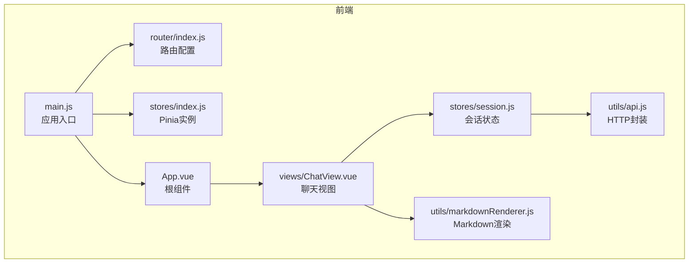
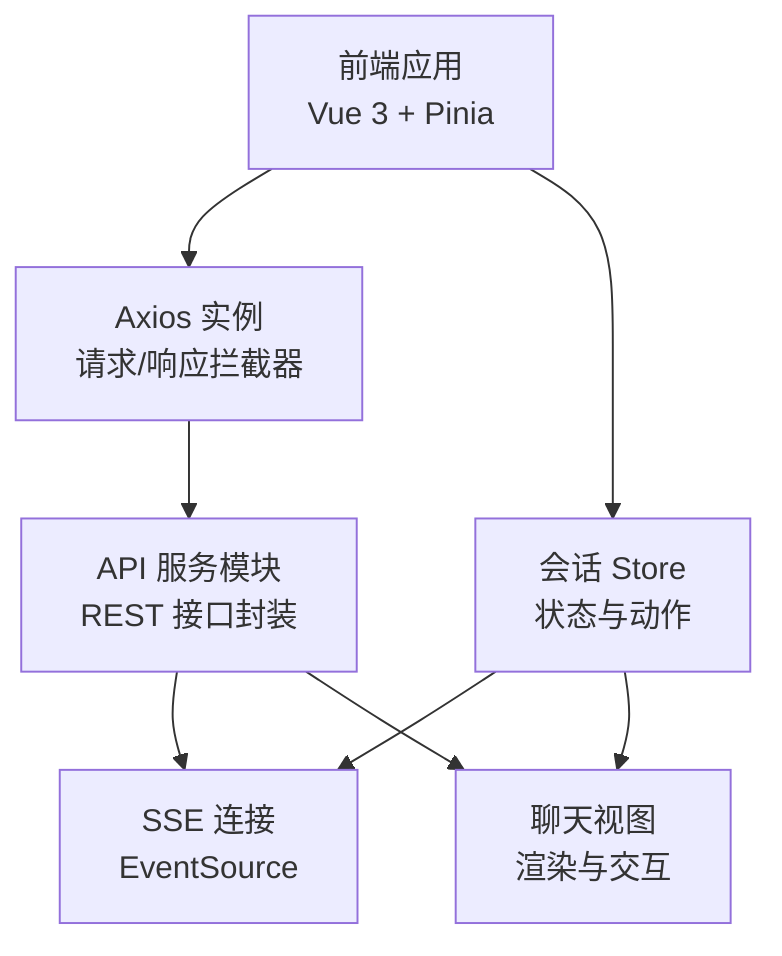
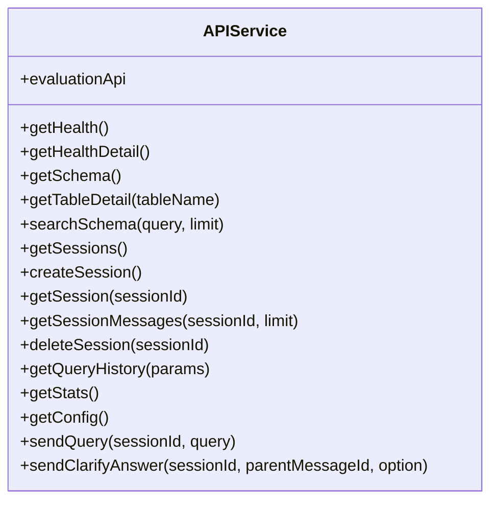
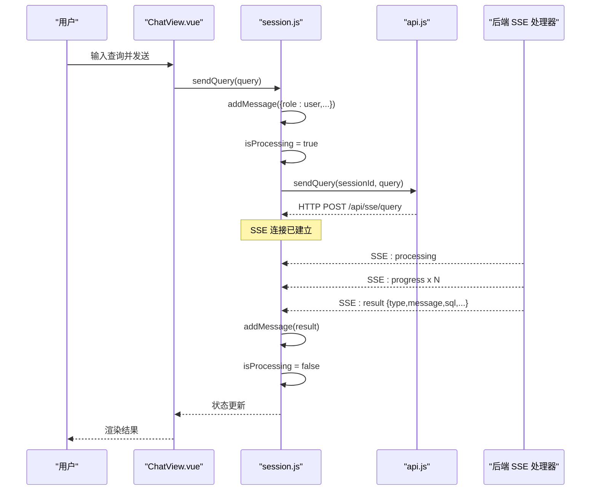
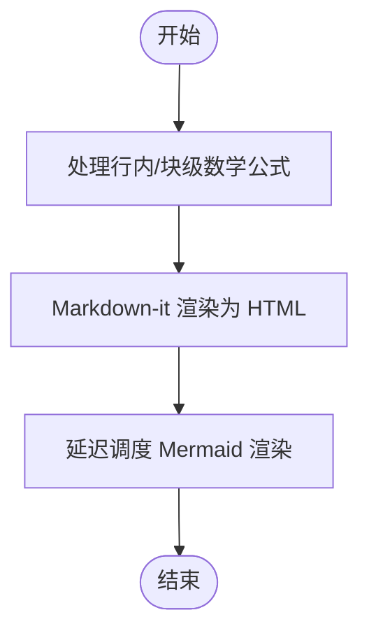
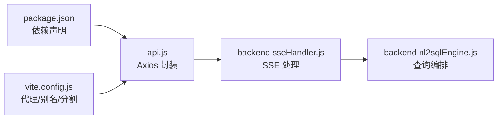

# 前端 API 集成

<cite>
**本文档引用的文件**
- [api.js](file://frontend/src/utils/api.js)
- [markdownRenderer.js](file://frontend/src/utils/markdownRenderer.js)
- [session.js](file://frontend/src/stores/session.js)
- [main.js](file://frontend/src/main.js)
- [App.vue](file://frontend/src/App.vue)
- [ChatView.vue](file://frontend/src/views/ChatView.vue)
- [router/index.js](file://frontend/src/router/index.js)
- [stores/index.js](file://frontend/src/stores/index.js)
- [vite.config.js](file://frontend/vite.config.js)
- [package.json](file://frontend/package.json)
- [sseHandler.js](file://backend/src/core/sseHandler.js)
- [nl2sqlEngine.js](file://backend/src/core/nl2sqlEngine.js)
</cite>

## 目录
1. [简介](#简介)
2. [项目结构](#项目结构)
3. [核心组件](#核心组件)
4. [架构总览](#架构总览)
5. [详细组件分析](#详细组件分析)
6. [依赖关系分析](#依赖关系分析)
7. [性能考量](#性能考量)
8. [故障排查指南](#故障排查指南)
9. [结论](#结论)
10. [附录](#附录)

## 简介
本文件面向 NL2SQL 前端 API 集成，系统性阐述以下主题：
- HTTP 请求封装设计：Axios 配置、请求/响应拦截器、REST API 方法封装
- SSE 流式通信集成：连接建立、消息类型处理、错误与断线恢复策略
- Markdown 渲染器：Markdown-it、Mermaid、KaTeX、Shiki 的集成与使用
- 前端数据缓存策略：会话状态、消息历史、SSE 连接状态的管理
- API 集成最佳实践：错误处理、超时控制、并发请求管理、用户体验优化

## 项目结构
前端采用 Vue 3 + Pinia + Element Plus 技术栈，核心模块分布如下：
- utils：通用工具层（API 封装、Markdown 渲染）
- stores：状态管理层（会话 Store）
- views：页面视图（聊天、历史、Schema、记忆、评估等）
- router：路由配置
- main.js：应用入口，安装插件并挂载应用
- vite.config.js：开发服务器、代理、路径别名、代码分割

**图表来源**
- [main.js:55-89](file://frontend/src/main.js#L55-L89)
- [router/index.js:118-157](file://frontend/src/router/index.js#L118-L157)
- [stores/index.js:23-30](file://frontend/src/stores/index.js#L23-L30)
- [stores/session.js:33-443](file://frontend/src/stores/session.js#L33-L443)
- [utils/api.js:25-320](file://frontend/src/utils/api.js#L25-L320)
- [utils/markdownRenderer.js:74-258](file://frontend/src/utils/markdownRenderer.js#L74-L258)
- [views/ChatView.vue:151-800](file://frontend/src/views/ChatView.vue#L151-L800)
- [App.vue:85-384](file://frontend/src/App.vue#L85-L384)

**章节来源**
- [main.js:55-89](file://frontend/src/main.js#L55-L89)
- [router/index.js:34-157](file://frontend/src/router/index.js#L34-L157)
- [stores/index.js:23-30](file://frontend/src/stores/index.js#L23-L30)
- [vite.config.js:17-93](file://frontend/vite.config.js#L17-L93)

## 核心组件
- HTTP 封装与拦截器
  - Axios 实例配置：baseURL、timeout、headers
  - 请求拦截器：可扩展鉴权头
  - 响应拦截器：统一封装错误处理
  - REST API 方法：健康检查、Schema、会话、查询历史、统计、配置、SSE 提交流程、评估接口
- SSE 连接与消息处理
  - 连接建立：EventSource，URL 携带 session_id
  - 消息类型：connected、processing、progress、result、error
  - 交互：sendQuery、sendClarifyAnswer（批次 B）
- Markdown 渲染器
  - Markdown-it：解析与高亮入口
  - Mermaid：图表渲染初始化与延迟执行
  - KaTeX：行内/块级数学公式渲染
  - Shiki：代码高亮（异步懒加载）
- 状态管理
  - Pinia Store：会话列表、当前会话、消息历史、SSE 连接、处理状态与进度
  - 生命周期：组件挂载/卸载时连接/断开 SSE
- 路由与入口
  - 路由守卫：页面标题设置
  - 应用入口：安装路由、Pinia、Element Plus，注册全局图标

**章节来源**
- [utils/api.js:25-320](file://frontend/src/utils/api.js#L25-L320)
- [stores/session.js:185-443](file://frontend/src/stores/session.js#L185-L443)
- [utils/markdownRenderer.js:74-258](file://frontend/src/utils/markdownRenderer.js#L74-L258)
- [views/ChatView.vue:151-800](file://frontend/src/views/ChatView.vue#L151-L800)
- [router/index.js:142-157](file://frontend/src/router/index.js#L142-L157)
- [main.js:55-89](file://frontend/src/main.js#L55-L89)

## 架构总览
前端通过 Axios 与后端 REST 接口通信，同时通过 SSE 与后端流式交互。SSE 事件驱动 UI 更新，Pinia Store 统一管理状态。

**图表来源**
- [utils/api.js:25-320](file://frontend/src/utils/api.js#L25-L320)
- [stores/session.js:185-443](file://frontend/src/stores/session.js#L185-L443)
- [views/ChatView.vue:151-800](file://frontend/src/views/ChatView.vue#L151-L800)

## 详细组件分析

### HTTP 请求封装与拦截器
- Axios 实例
  - baseURL：统一前缀 /api
  - timeout：30 秒
  - headers：application/json
- 请求拦截器
  - 可扩展添加认证头（示例注释）
- 响应拦截器
  - 成功：返回 response.data
  - 失败：区分服务端错误、网络错误、请求配置错误，统一 Promise.reject
- REST API 方法
  - 健康检查：getHealth、getHealthDetail
  - Schema：getSchema、getTableDetail、searchSchema
  - 会话：getSessions、createSession、getSession、getSessionMessages、deleteSession
  - 查询历史：getQueryHistory
  - 统计与配置：getStats、getConfig
  - SSE：sendQuery、sendClarifyAnswer
  - 评估：evaluationApi 对象封装

**图表来源**
- [utils/api.js:98-320](file://frontend/src/utils/api.js#L98-L320)

**章节来源**
- [utils/api.js:25-88](file://frontend/src/utils/api.js#L25-L88)
- [utils/api.js:98-320](file://frontend/src/utils/api.js#L98-L320)

### SSE 流式通信集成
- 连接建立
  - URL：/api/sse/stream?session_id=...
  - EventSource onopen/onmessage/onerror
- 消息类型处理
  - connected：连接成功
  - processing：开始处理
  - progress：进度更新（message、stage、progress）
  - result：结果（兼容 clarification、message/explanation、sql/data/verificationWarning）
  - error：错误消息
- 交互动作
  - sendQuery：添加用户消息，标记 isProcessing，调用 HTTP POST /api/sse/query
  - sendClarifyAnswer：批次 B，提交澄清回答，parent_message_id 来自上次 message_id
- 断线与清理
  - disconnectSSE：关闭连接，重置状态
  - 组件卸载时断开连接

**图表来源**
- [stores/session.js:310-339](file://frontend/src/stores/session.js#L310-L339)
- [utils/api.js:246-268](file://frontend/src/utils/api.js#L246-L268)
- [backend/src/core/sseHandler.js:258-410](file://backend/src/core/sseHandler.js#L258-L410)

**章节来源**
- [stores/session.js:185-383](file://frontend/src/stores/session.js#L185-L383)
- [stores/session.js:310-372](file://frontend/src/stores/session.js#L310-L372)
- [utils/api.js:246-268](file://frontend/src/utils/api.js#L246-L268)
- [backend/src/core/sseHandler.js:49-120](file://backend/src/core/sseHandler.js#L49-L120)

### Markdown 渲染器实现原理与使用
- 初始化
  - Mermaid：initialize（安全级别、主题、图表配置）
  - Shiki：异步懒加载，languages/sql/themes
- 渲染流程
  - renderMarkdown：先处理行内/块级数学公式，再用 Markdown-it 渲染，延迟渲染 Mermaid
  - renderSQL/highlightCode：基于 Shiki 的 SQL/任意语言高亮
- 使用场景
  - ChatView 中将消息内容通过 renderMarkdown 渲染为 HTML
  - SQL 代码块通过 renderSQL 渲染高亮

**图表来源**
- [utils/markdownRenderer.js:124-196](file://frontend/src/utils/markdownRenderer.js#L124-L196)
- [utils/markdownRenderer.js:156-170](file://frontend/src/utils/markdownRenderer.js#L156-L170)

**章节来源**
- [utils/markdownRenderer.js:24-68](file://frontend/src/utils/markdownRenderer.js#L24-L68)
- [utils/markdownRenderer.js:74-100](file://frontend/src/utils/markdownRenderer.js#L74-L100)
- [utils/markdownRenderer.js:124-196](file://frontend/src/utils/markdownRenderer.js#L124-L196)
- [views/ChatView.vue:286-301](file://frontend/src/views/ChatView.vue#L286-L301)

### 前端数据缓存策略
- 会话与消息
  - Pinia Store：sessions、currentSessionId、messages
  - 生命周期：组件挂载加载会话列表；切换会话加载消息历史
- SSE 连接状态
  - isConnected、isProcessing、processingStatus、processingProgress
  - connectSSE/disconnectSSE 管理连接
- 本地存储与内存缓存
  - 本地存储：示例注释中可扩展 token 等（当前未启用）
  - 内存缓存：Pinia Store 作为主要缓存载体
- 缓存失效
  - 删除会话时同步清理 Store 状态与连接
  - 组件卸载时断开 SSE，避免内存泄漏

**章节来源**
- [stores/session.js:42-77](file://frontend/src/stores/session.js#L42-L77)
- [stores/session.js:103-171](file://frontend/src/stores/session.js#L103-L171)
- [stores/session.js:389-412](file://frontend/src/stores/session.js#L389-L412)
- [views/ChatView.vue:361-364](file://frontend/src/views/ChatView.vue#L361-L364)

### API 集成最佳实践
- 错误处理
  - Axios 响应拦截器统一捕获服务端错误、网络错误、请求配置错误
  - Store 中对 sendQuery/sendClarifyAnswer 失败进行 UI 反馈
- 超时控制
  - Axios timeout 默认 30 秒，可根据场景调整
- 并发请求管理
  - SSE 连接状态 isProcessing 互斥，避免并发处理
  - hasActiveConnection（后端）用于前置校验
- 用户体验
  - 进度条与打字动画反馈
  - 消息自动滚动到底部
  - 澄清选项交互与防重复点击

**章节来源**
- [utils/api.js:72-87](file://frontend/src/utils/api.js#L72-L87)
- [stores/session.js:310-339](file://frontend/src/stores/session.js#L310-L339)
- [backend/src/core/sseHandler.js:258-410](file://backend/src/core/sseHandler.js#L258-L410)
- [views/ChatView.vue:414-420](file://frontend/src/views/ChatView.vue#L414-L420)

## 依赖关系分析
- 前端依赖
  - Vue 3、Pinia、Element Plus、Axios、markdown-it、mermaid、katex、shiki、uuid
- 构建与开发
  - Vite：开发服务器、代理 /api -> http://localhost:3000、路径别名、代码分割
- 后端 SSE
  - 后端 SSEHandler 管理连接、广播消息、进度回调、错误推送

**图表来源**
- [package.json:11-28](file://frontend/package.json#L11-L28)
- [vite.config.js:24-35](file://frontend/vite.config.js#L24-L35)
- [utils/api.js:25-34](file://frontend/src/utils/api.js#L25-L34)
- [backend/src/core/sseHandler.js:49-120](file://backend/src/core/sseHandler.js#L49-L120)
- [backend/src/core/nl2sqlEngine.js:121-200](file://backend/src/core/nl2sqlEngine.js#L121-L200)

**章节来源**
- [package.json:11-28](file://frontend/package.json#L11-L28)
- [vite.config.js:24-35](file://frontend/vite.config.js#L24-L35)

## 性能考量
- 代码分割：第三方库手动分包，减少首屏体积
- 渲染优化：Markdown-it 预处理数学公式，Mermaid 延迟渲染
- SSE：按需连接，避免重复连接；进度事件节流式广播
- 状态管理：Pinia 响应式更新，避免不必要的重渲染

## 故障排查指南
- Axios 错误
  - 检查响应拦截器错误分支，定位服务端错误、网络错误、请求配置错误
- SSE 连接问题
  - 检查 /api/sse/stream URL 与 session_id 参数
  - 查看 onerror 日志，确认连接状态 isConnected
- 渲染异常
  - Markdown 渲染失败时，Mermaid 渲染会捕获错误并提示
  - Shiki 初始化失败时使用备用高亮
- 路由与会话
  - 路由守卫设置页面标题
  - 删除会话后断开 SSE，避免残留连接

**章节来源**
- [utils/api.js:72-87](file://frontend/src/utils/api.js#L72-L87)
- [stores/session.js:194-221](file://frontend/src/stores/session.js#L194-L221)
- [utils/markdownRenderer.js:160-170](file://frontend/src/utils/markdownRenderer.js#L160-L170)
- [router/index.js:142-150](file://frontend/src/router/index.js#L142-L150)

## 结论
本文档系统梳理了 NL2SQL 前端 API 集成的关键实现：Axios 封装与拦截器、SSE 流式通信、Markdown 渲染器、状态管理与缓存策略，并提供了最佳实践与故障排查建议。整体架构清晰、职责分离明确，具备良好的可维护性与扩展性。

## 附录
- 开发服务器与代理
  - 端口：5173，自动打开浏览器
  - 代理：/api -> http://localhost:3000
- 路径别名
  - @、@components、@views、@stores、@utils
- 代码分割
  - element-plus、echarts、vendor 独立打包

**章节来源**
- [vite.config.js:18-51](file://frontend/vite.config.js#L18-L51)
- [vite.config.js:72-91](file://frontend/vite.config.js#L72-L91)