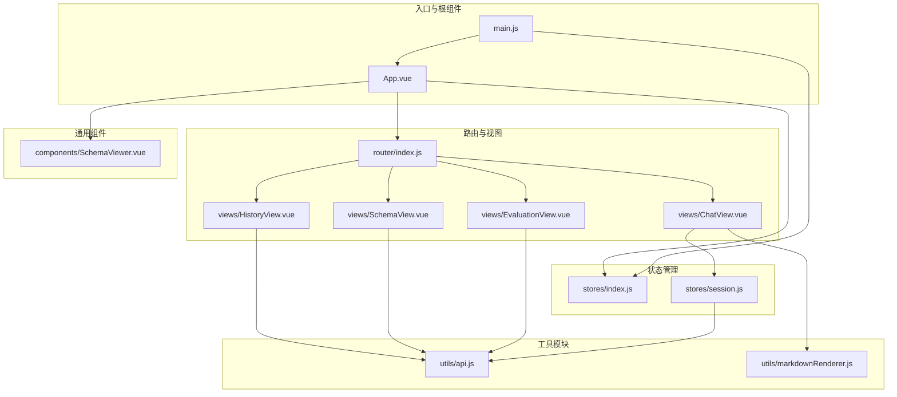
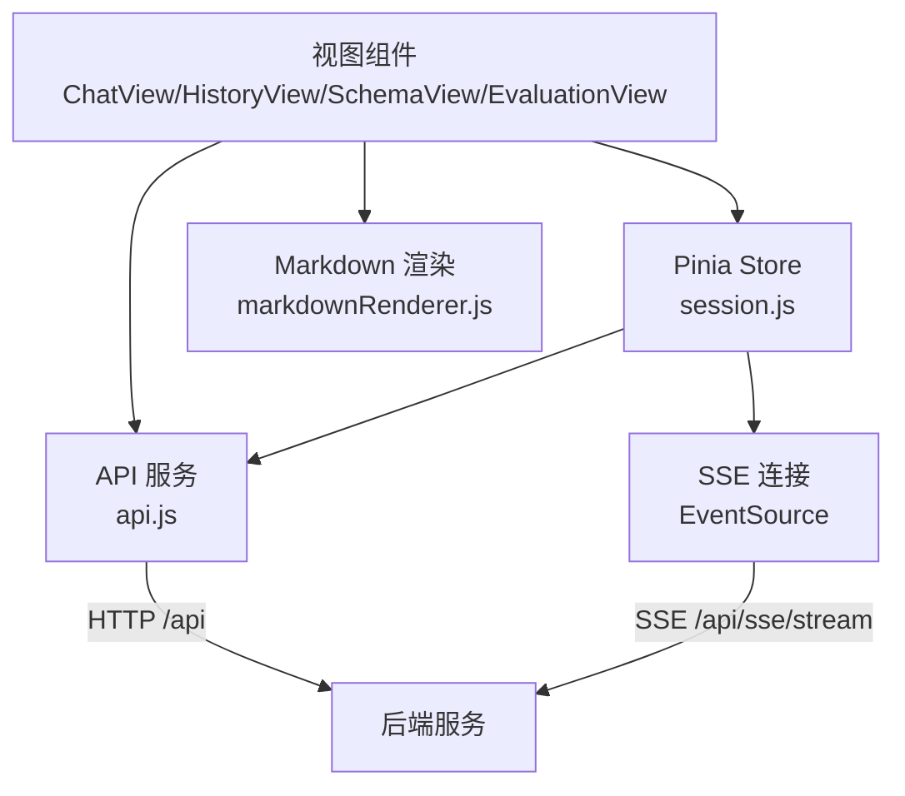
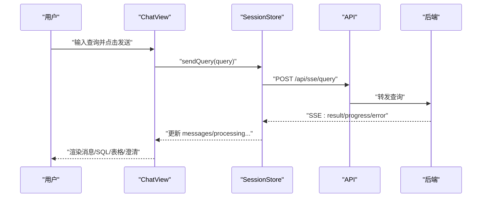
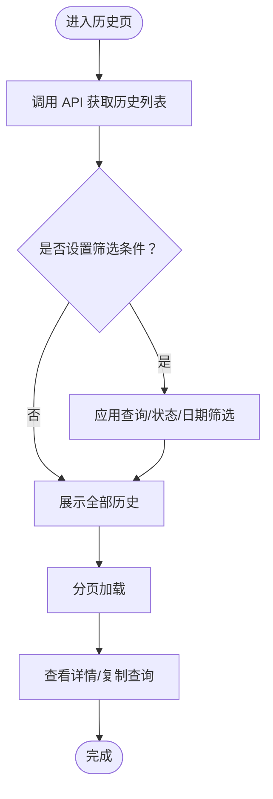
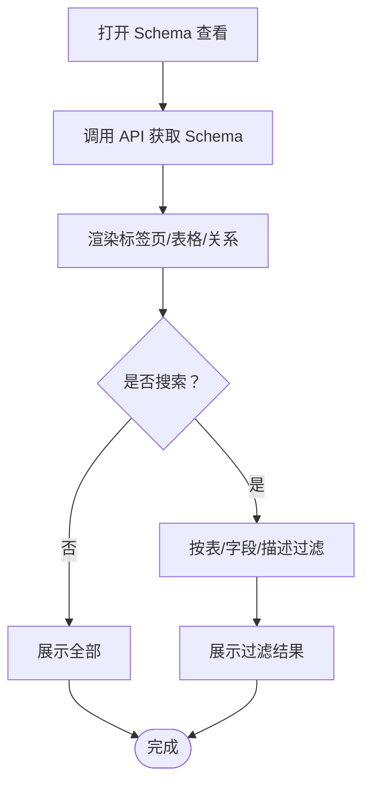
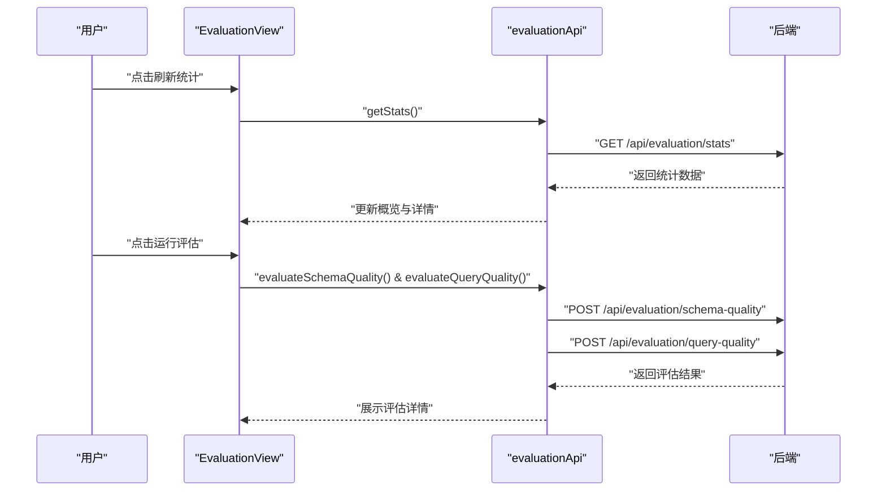
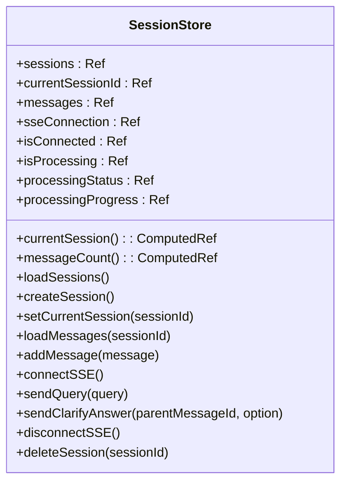
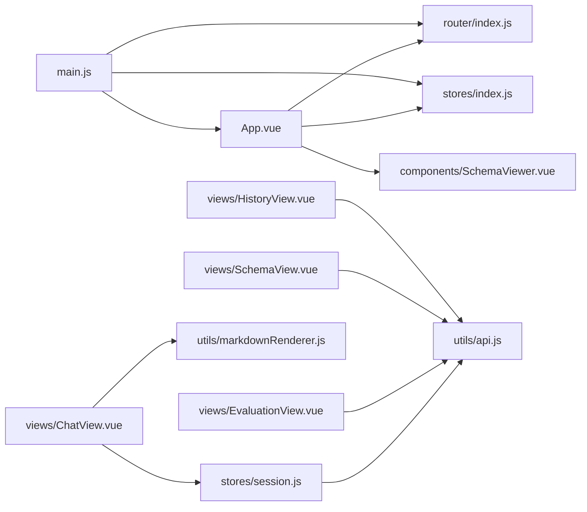

# 前端系统架构

<cite>
**本文档引用的文件**
- [main.js](file://frontend/src/main.js)
- [App.vue](file://frontend/src/App.vue)
- [router/index.js](file://frontend/src/router/index.js)
- [stores/index.js](file://frontend/src/stores/index.js)
- [stores/session.js](file://frontend/src/stores/session.js)
- [utils/api.js](file://frontend/src/utils/api.js)
- [utils/markdownRenderer.js](file://frontend/src/utils/markdownRenderer.js)
- [views/ChatView.vue](file://frontend/src/views/ChatView.vue)
- [views/HistoryView.vue](file://frontend/src/views/HistoryView.vue)
- [views/SchemaView.vue](file://frontend/src/views/SchemaView.vue)
- [views/EvaluationView.vue](file://frontend/src/views/EvaluationView.vue)
- [components/SchemaViewer.vue](file://frontend/src/components/SchemaViewer.vue)
- [package.json](file://frontend/package.json)
- [vite.config.js](file://frontend/vite.config.js)
</cite>

## 目录
1. [简介](#简介)
2. [项目结构](#项目结构)
3. [核心组件](#核心组件)
4. [架构总览](#架构总览)
5. [详细组件分析](#详细组件分析)
6. [依赖分析](#依赖分析)
7. [性能考虑](#性能考虑)
8. [故障排查指南](#故障排查指南)
9. [结论](#结论)
10. [附录](#附录)

## 简介
本文件面向 NL2SQL 前端系统的技术文档，围绕 Vue3 应用的整体架构、组件层次、状态管理、路由配置、前后端集成、性能优化与最佳实践进行系统化梳理。重点覆盖：
- 视图组件：聊天界面、Schema 查看、历史记录、评估统计等页面的交互逻辑与数据流
- Pinia 状态管理：会话状态、全局状态的管理策略与 SSE 连接处理
- API 集成：HTTP 请求封装、错误处理、SSE 推送、数据缓存策略
- 性能优化：组件懒加载、资源拆分、构建优化、渲染优化
- 开发最佳实践与调试技巧

## 项目结构
前端采用 Vue3 + Vite + Element Plus + Pinia 技术栈，采用“按功能分层”的组织方式：
- 入口与根组件：main.js、App.vue
- 路由：router/index.js
- 状态管理：stores/index.js、stores/session.js
- 视图页面：views 下各页面组件
- 工具模块：utils 下 API 封装与 Markdown 渲染
- 组件：components 下通用组件（如 SchemaViewer）
- 构建与依赖：package.json、vite.config.js

**图表来源**
- [main.js:1-89](file://frontend/src/main.js#L1-L89)
- [App.vue:1-384](file://frontend/src/App.vue#L1-L384)
- [router/index.js:1-157](file://frontend/src/router/index.js#L1-L157)
- [stores/index.js:1-30](file://frontend/src/stores/index.js#L1-L30)
- [stores/session.js:1-443](file://frontend/src/stores/session.js#L1-L443)
- [utils/api.js:1-320](file://frontend/src/utils/api.js#L1-L320)
- [utils/markdownRenderer.js:1-258](file://frontend/src/utils/markdownRenderer.js#L1-L258)
- [views/ChatView.vue:1-835](file://frontend/src/views/ChatView.vue#L1-L835)
- [views/HistoryView.vue:1-441](file://frontend/src/views/HistoryView.vue#L1-L441)
- [views/SchemaView.vue:1-322](file://frontend/src/views/SchemaView.vue#L1-L322)
- [views/EvaluationView.vue:1-699](file://frontend/src/views/EvaluationView.vue#L1-L699)
- [components/SchemaViewer.vue:1-317](file://frontend/src/components/SchemaViewer.vue#L1-L317)

**章节来源**
- [main.js:1-89](file://frontend/src/main.js#L1-L89)
- [router/index.js:1-157](file://frontend/src/router/index.js#L1-L157)
- [package.json:1-36](file://frontend/package.json#L1-L36)
- [vite.config.js:1-93](file://frontend/vite.config.js#L1-L93)

## 核心组件
- 应用入口与插件安装：在入口文件中创建 Vue 应用实例，安装路由、Pinia、Element Plus，并注册全局图标组件，最后挂载到 DOM。
- 根组件布局：侧边栏（会话列表、历史会话、工具按钮）、主内容区（router-view）以及 Schema 查看弹窗。
- 路由系统：定义首页、聊天、历史、Schema、记忆、评估、404 等路由；使用 History 模式与滚动行为；全局前置守卫设置页面标题。
- 状态管理：Pinia 实例集中管理；会话 Store 管理会话列表、消息、SSE 连接、处理状态与进度。
- API 服务：Axios 实例封装，统一请求/响应拦截，暴露 REST API 与 SSE 相关接口。
- Markdown 渲染：集成 markdown-it、Mermaid、KaTeX、Shiki，支持数学公式、Mermaid 图表与代码高亮。
- 视图组件：聊天页（消息渲染、SQL 展示、澄清交互、SSE 推送）、历史页（筛选、分页、详情）、Schema 页（多标签展示）、评估页（统计概览、质量评估）。
- 通用组件：SchemaViewer（弹窗式 Schema 查看，支持搜索与折叠）。

**章节来源**
- [main.js:1-89](file://frontend/src/main.js#L1-L89)
- [App.vue:1-384](file://frontend/src/App.vue#L1-L384)
- [router/index.js:1-157](file://frontend/src/router/index.js#L1-L157)
- [stores/index.js:1-30](file://frontend/src/stores/index.js#L1-L30)
- [stores/session.js:1-443](file://frontend/src/stores/session.js#L1-L443)
- [utils/api.js:1-320](file://frontend/src/utils/api.js#L1-L320)
- [utils/markdownRenderer.js:1-258](file://frontend/src/utils/markdownRenderer.js#L1-L258)
- [views/ChatView.vue:1-835](file://frontend/src/views/ChatView.vue#L1-L835)
- [views/HistoryView.vue:1-441](file://frontend/src/views/HistoryView.vue#L1-L441)
- [views/SchemaView.vue:1-322](file://frontend/src/views/SchemaView.vue#L1-L322)
- [views/EvaluationView.vue:1-699](file://frontend/src/views/EvaluationView.vue#L1-L699)
- [components/SchemaViewer.vue:1-317](file://frontend/src/components/SchemaViewer.vue#L1-L317)

## 架构总览
前端采用“单页应用 + 组件化 + 状态集中管理”的架构模式：
- 视图层：各页面组件负责 UI 与交互，通过 Composition API 与响应式状态驱动。
- 状态层：Pinia Store 集中管理会话、消息、SSE 连接、处理状态与进度。
- 服务层：API 模块封装 HTTP 与 SSE，统一错误处理与拦截。
- 工具层：Markdown 渲染器提供富文本、图表与代码高亮能力。
- 路由层：Vue Router 提供页面导航、懒加载与守卫。

**图表来源**
- [stores/session.js:185-304](file://frontend/src/stores/session.js#L185-L304)
- [utils/api.js:246-268](file://frontend/src/utils/api.js#L246-L268)
- [views/ChatView.vue:370-382](file://frontend/src/views/ChatView.vue#L370-L382)

**章节来源**
- [stores/session.js:1-443](file://frontend/src/stores/session.js#L1-L443)
- [utils/api.js:1-320](file://frontend/src/utils/api.js#L1-L320)
- [views/ChatView.vue:1-835](file://frontend/src/views/ChatView.vue#L1-L835)

## 详细组件分析

### 聊天界面（ChatView）
- 交互逻辑
  - 输入框支持 Enter 发送、Shift+Enter 换行；禁用状态下不可发送。
  - 发送消息通过会话 Store 的 sendQuery 触发 HTTP POST，并通过 SSE 推送实时结果。
  - 支持澄清（clarification）场景：用户选择澄清选项后，调用 sendClarifyAnswer，后端基于 message_id 恢复分解流程。
  - 消息渲染：Markdown 内容经 markdown-it 渲染，SQL 使用 Shiki 高亮，数据表格展示。
  - 处理状态：显示进度条与打字动画，处理完成后自动滚动到底部。
- 数据流
  - Store 管理 messages、isProcessing、processingStatus、processingProgress。
  - SSE 连接在组件挂载时建立，卸载时断开。
- 关键实现路径
  - 发送消息与澄清：[views/ChatView.vue:217-329](file://frontend/src/views/ChatView.vue#L217-L329)
  - 初始化会话与 SSE：[views/ChatView.vue:370-382](file://frontend/src/views/ChatView.vue#L370-L382)
  - Markdown 渲染与 SQL 高亮：[utils/markdownRenderer.js:181-220](file://frontend/src/utils/markdownRenderer.js#L181-L220)

**图表来源**
- [views/ChatView.vue:217-329](file://frontend/src/views/ChatView.vue#L217-L329)
- [stores/session.js:310-339](file://frontend/src/stores/session.js#L310-L339)
- [utils/api.js:246-251](file://frontend/src/utils/api.js#L246-L251)

**章节来源**
- [views/ChatView.vue:1-835](file://frontend/src/views/ChatView.vue#L1-L835)
- [stores/session.js:1-443](file://frontend/src/stores/session.js#L1-L443)
- [utils/markdownRenderer.js:1-258](file://frontend/src/utils/markdownRenderer.js#L1-L258)

### 历史记录（HistoryView）
- 功能要点
  - 支持按查询内容、状态、日期范围筛选；分页加载；查看详情弹窗。
  - 使用 dayjs 格式化时间；支持复制查询内容。
- 数据流
  - 通过 API.getQueryHistory 获取历史列表与总数；分页参数由组件内部维护。
- 关键实现路径
  - 加载历史与分页：[views/HistoryView.vue:226-289](file://frontend/src/views/HistoryView.vue#L226-L289)
  - 筛选逻辑：[views/HistoryView.vue:190-217](file://frontend/src/views/HistoryView.vue#L190-L217)

**图表来源**
- [views/HistoryView.vue:226-289](file://frontend/src/views/HistoryView.vue#L226-L289)
- [utils/api.js:206-208](file://frontend/src/utils/api.js#L206-L208)

**章节来源**
- [views/HistoryView.vue:1-441](file://frontend/src/views/HistoryView.vue#L1-L441)
- [utils/api.js:1-320](file://frontend/src/utils/api.js#L1-L320)

### Schema 查看（SchemaView 与 SchemaViewer）
- 功能要点
  - SchemaView：完整展示表结构、指标、维度、表关系，支持统计信息与标签页切换。
  - SchemaViewer：弹窗式查看，支持搜索表名/字段、折叠展开、显示关联关系。
- 数据流
  - 通过 API.getSchema 获取 Schema 数据；组件内部维护搜索与展开状态。
- 关键实现路径
  - 加载 Schema：[views/SchemaView.vue:185-192](file://frontend/src/views/SchemaView.vue#L185-L192)
  - 弹窗搜索与过滤：[components/SchemaViewer.vue:157-182](file://frontend/src/components/SchemaViewer.vue#L157-L182)

**图表来源**
- [views/SchemaView.vue:185-192](file://frontend/src/views/SchemaView.vue#L185-L192)
- [components/SchemaViewer.vue:157-182](file://frontend/src/components/SchemaViewer.vue#L157-L182)
- [utils/api.js:118-120](file://frontend/src/utils/api.js#L118-L120)

**章节来源**
- [views/SchemaView.vue:1-322](file://frontend/src/views/SchemaView.vue#L1-L322)
- [components/SchemaViewer.vue:1-317](file://frontend/src/components/SchemaViewer.vue#L1-L317)
- [utils/api.js:1-320](file://frontend/src/utils/api.js#L1-L320)

### 评估统计（EvaluationView）
- 功能要点
  - 展示向量检索命中率、查询历史命中率、长期记忆命中率等概览。
  - 支持刷新统计、重置数据、并行执行 Schema 与查询相似度评估。
- 数据流
  - 通过 evaluationApi.getStats 获取运行时统计；evaluationApi.resetStats 重置数据；evaluationApi.evaluateSchemaQuality 与 evaluateQueryQuality 执行评估。
- 关键实现路径
  - 刷新与重置：[views/EvaluationView.vue:417-461](file://frontend/src/views/EvaluationView.vue#L417-L461)
  - 并行评估：[views/EvaluationView.vue:472-491](file://frontend/src/views/EvaluationView.vue#L472-L491)

**图表来源**
- [views/EvaluationView.vue:417-491](file://frontend/src/views/EvaluationView.vue#L417-L491)
- [utils/api.js:282-318](file://frontend/src/utils/api.js#L282-L318)

**章节来源**
- [views/EvaluationView.vue:1-699](file://frontend/src/views/EvaluationView.vue#L1-L699)
- [utils/api.js:277-319](file://frontend/src/utils/api.js#L277-L319)

### 根组件与侧边栏（App.vue）
- 功能要点
  - 侧边栏包含新建会话、历史会话列表、工具按钮（Schema、记忆、评估、设置、展开/收起）。
  - 会话列表与当前会话状态来自 Pinia；支持删除会话与跳转页面。
  - 通过 SchemaViewer 弹窗展示 Schema。
- 关键实现路径
  - 会话管理与路由跳转：[App.vue:176-228](file://frontend/src/App.vue#L176-L228)
  - 侧边栏工具按钮与弹窗控制：[App.vue:52-81](file://frontend/src/App.vue#L52-L81)

**章节来源**
- [App.vue:1-384](file://frontend/src/App.vue#L1-L384)

### 路由配置（router/index.js）
- 路由规则
  - 首页、聊天（带会话参数）、历史、Schema、记忆、评估、404。
  - 历史、Schema、记忆、评估使用懒加载按需加载。
- 全局守卫
  - 设置页面标题；保持滚动位置。
- 关键实现路径
  - 路由定义与懒加载：[router/index.js:34-109](file://frontend/src/router/index.js#L34-L109)
  - 全局前置守卫：[router/index.js:142-150](file://frontend/src/router/index.js#L142-L150)

**章节来源**
- [router/index.js:1-157](file://frontend/src/router/index.js#L1-L157)

### 状态管理（stores/session.js）
- 状态
  - sessions、currentSessionId、messages、sseConnection、isConnected、isProcessing、processingStatus、processingProgress。
- 计算属性
  - currentSession、messageCount。
- 方法
  - loadSessions、createSession、setCurrentSession、loadMessages、addMessage、connectSSE、sendQuery、sendClarifyAnswer、disconnectSSE、deleteSession。
- SSE 处理
  - 建立连接、解析消息类型（connected/processing/progress/result/error）、更新处理状态与消息列表。
- 关键实现路径
  - SSE 连接与消息处理：[stores/session.js:185-304](file://frontend/src/stores/session.js#L185-L304)
  - 发送查询与澄清：[stores/session.js:310-372](file://frontend/src/stores/session.js#L310-L372)

**图表来源**
- [stores/session.js:33-442](file://frontend/src/stores/session.js#L33-L442)

**章节来源**
- [stores/session.js:1-443](file://frontend/src/stores/session.js#L1-L443)

### API 封装（utils/api.js）
- Axios 实例
  - baseURL: /api；timeout: 30s；统一请求/响应拦截。
- 接口分类
  - 健康检查、Schema、会话、查询历史、统计、配置、SSE 查询与澄清回答。
- 关键实现路径
  - Axios 实例与拦截器：[utils/api.js:25-88](file://frontend/src/utils/api.js#L25-L88)
  - SSE 查询与澄清回答：[utils/api.js:246-268](file://frontend/src/utils/api.js#L246-L268)

**章节来源**
- [utils/api.js:1-320](file://frontend/src/utils/api.js#L1-L320)

### Markdown 渲染（utils/markdownRenderer.js）
- 能力
  - markdown-it 解析；Mermaid 图表渲染；KaTeX 数学公式；Shiki 代码高亮。
- 关键实现路径
  - 初始化与渲染：[utils/markdownRenderer.js:24-196](file://frontend/src/utils/markdownRenderer.js#L24-L196)

**章节来源**
- [utils/markdownRenderer.js:1-258](file://frontend/src/utils/markdownRenderer.js#L1-L258)

## 依赖分析
- 依赖关系
  - main.js 依赖 App.vue、router、stores、Element Plus。
  - App.vue 依赖路由、会话 Store、SchemaViewer。
  - 各视图组件依赖 API 服务与 Store。
  - Store 依赖 API 服务与 UUID。
  - ChatView 依赖 Markdown 渲染器。
- 代码耦合
  - 视图组件与 Store 通过组合式 API 解耦；API 服务集中封装，降低视图组件对 HTTP 的直接依赖。
- 外部依赖
  - Vue3、Vue Router、Pinia、Element Plus、Axios、markdown-it、Mermaid、KaTeX、Shiki、uuid、dayjs、echarts、vue-echarts。

**图表来源**
- [main.js:1-89](file://frontend/src/main.js#L1-L89)
- [App.vue:1-384](file://frontend/src/App.vue#L1-L384)
- [router/index.js:1-157](file://frontend/src/router/index.js#L1-L157)
- [stores/index.js:1-30](file://frontend/src/stores/index.js#L1-L30)
- [stores/session.js:1-443](file://frontend/src/stores/session.js#L1-L443)
- [utils/api.js:1-320](file://frontend/src/utils/api.js#L1-L320)
- [utils/markdownRenderer.js:1-258](file://frontend/src/utils/markdownRenderer.js#L1-L258)
- [views/ChatView.vue:1-835](file://frontend/src/views/ChatView.vue#L1-L835)
- [views/HistoryView.vue:1-441](file://frontend/src/views/HistoryView.vue#L1-L441)
- [views/SchemaView.vue:1-322](file://frontend/src/views/SchemaView.vue#L1-L322)
- [views/EvaluationView.vue:1-699](file://frontend/src/views/EvaluationView.vue#L1-L699)
- [components/SchemaViewer.vue:1-317](file://frontend/src/components/SchemaViewer.vue#L1-L317)

**章节来源**
- [package.json:1-36](file://frontend/package.json#L1-L36)

## 性能考虑
- 组件懒加载
  - 路由中对历史、Schema、记忆、评估页面使用动态导入，减少首屏体积。
- 资源拆分与代码分割
  - Vite 配置 manualChunks 将 Element Plus、ECharts、Vue 生态库独立打包，提升缓存命中率。
- 构建优化
  - 生产环境关闭 sourcemap；启用 Rollup 输出优化。
- 渲染优化
  - ChatView 使用虚拟滚动与自动滚动；Markdown 渲染延迟触发 Mermaid 图表；长消息支持折叠。
- 网络优化
  - Axios 统一超时与拦截器；SSE 连接复用与断线处理；API 返回数据结构标准化。

**章节来源**
- [router/index.js:63-74](file://frontend/src/router/index.js#L63-L74)
- [vite.config.js:72-91](file://frontend/vite.config.js#L72-L91)
- [views/ChatView.vue:334-341](file://frontend/src/views/ChatView.vue#L334-L341)
- [utils/api.js:25-34](file://frontend/src/utils/api.js#L25-L34)

## 故障排查指南
- SSE 连接问题
  - 确认后端 SSE 地址与会话 ID 正确；检查 readyState；关注 onerror 与连接状态 isConnected。
  - 参考：[stores/session.js:185-221](file://frontend/src/stores/session.js#L185-L221)
- API 调用失败
  - 检查 baseURL 与代理配置；确认响应拦截器返回的数据结构；查看控制台错误日志。
  - 参考：[utils/api.js:25-88](file://frontend/src/utils/api.js#L25-L88)
- 聊天消息不显示
  - 确认 messages 是否更新；检查 isProcessing 状态；验证 Markdown 渲染与 SQL 高亮。
  - 参考：[views/ChatView.vue:286-301](file://frontend/src/views/ChatView.vue#L286-L301)
- 评估页面无数据
  - 确认后端评估开关与统计接口；检查 evaluationApi.getStats 返回结构。
  - 参考：[views/EvaluationView.vue:417-434](file://frontend/src/views/EvaluationView.vue#L417-L434)
- Schema 查看空白
  - 确认 API.getSchema 返回数据；检查 SchemaViewer 的加载与过滤逻辑。
  - 参考：[components/SchemaViewer.vue:191-208](file://frontend/src/components/SchemaViewer.vue#L191-L208)

**章节来源**
- [stores/session.js:185-221](file://frontend/src/stores/session.js#L185-L221)
- [utils/api.js:25-88](file://frontend/src/utils/api.js#L25-L88)
- [views/ChatView.vue:286-301](file://frontend/src/views/ChatView.vue#L286-L301)
- [views/EvaluationView.vue:417-434](file://frontend/src/views/EvaluationView.vue#L417-L434)
- [components/SchemaViewer.vue:191-208](file://frontend/src/components/SchemaViewer.vue#L191-L208)

## 结论
NL2SQL 前端系统采用现代化 Vue3 技术栈，结合 Pinia 状态管理与 Element Plus UI 组件库，实现了清晰的组件层次与稳定的前后端集成。通过路由懒加载、资源拆分与渲染优化，系统具备良好的性能表现。会话与 SSE 的集成使得聊天交互具备实时性与可扩展性；评估与历史页面提供了完善的可观测性与可追溯性。建议后续持续完善错误监控、埋点与国际化支持，进一步提升用户体验与可维护性。

## 附录
- 开发与构建
  - 开发：npm run dev（Vite 开发服务器，端口 5173，代理到后端 3000）
  - 构建：npm run build（输出 dist，手动 chunks 拆分）
  - 预览：npm run preview
- 路径别名
  - @ 指向 src；@components 指向 src/components；@views 指向 src/views；@stores 指向 src/stores；@utils 指向 src/utils
- 依赖版本
  - Vue3、Vue Router、Pinia、Element Plus、Axios、markdown-it、Mermaid、KaTeX、Shiki、uuid、dayjs、echarts、vue-echarts

**章节来源**
- [package.json:1-36](file://frontend/package.json#L1-L36)
- [vite.config.js:17-51](file://frontend/vite.config.js#L17-L51)