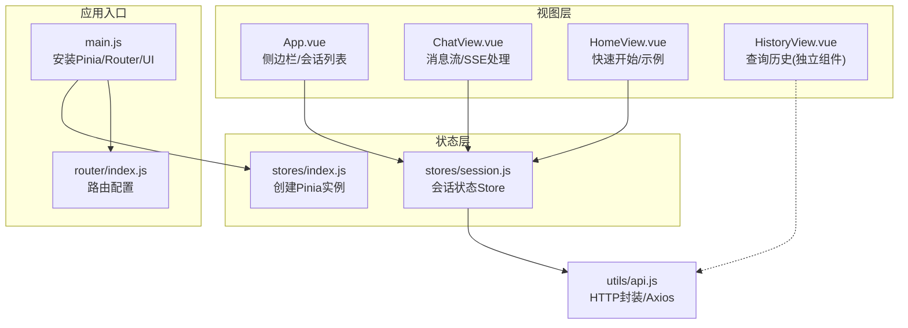
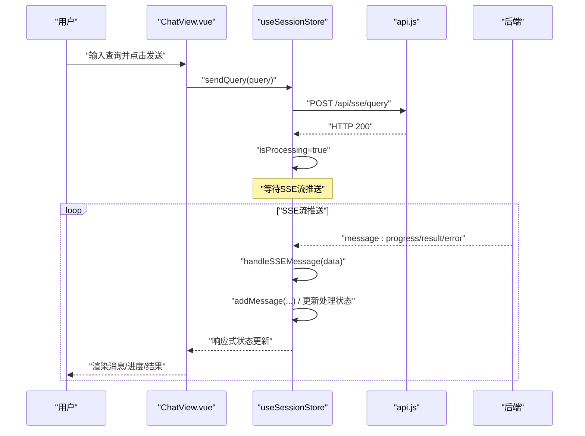
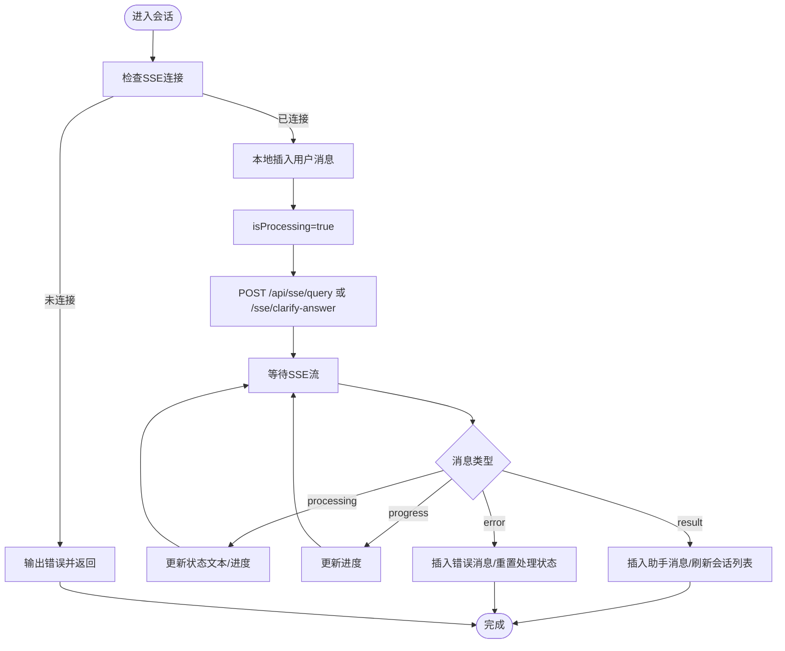
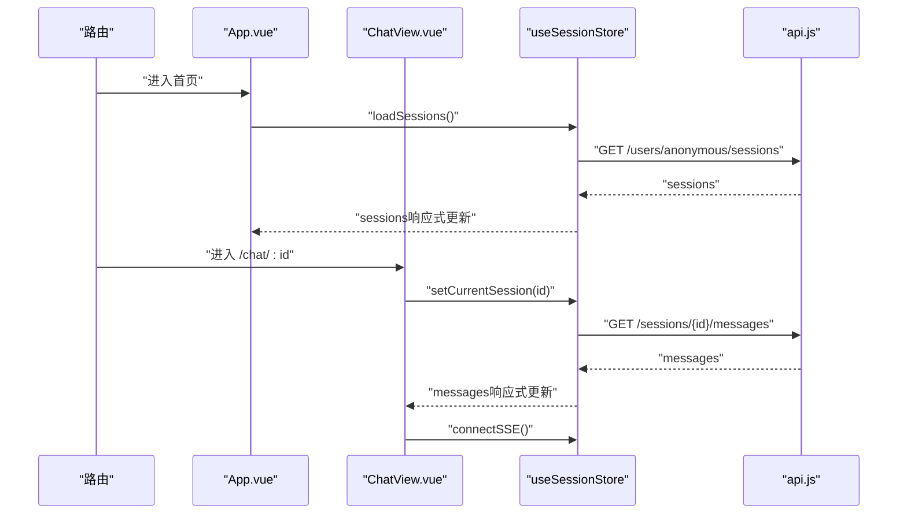
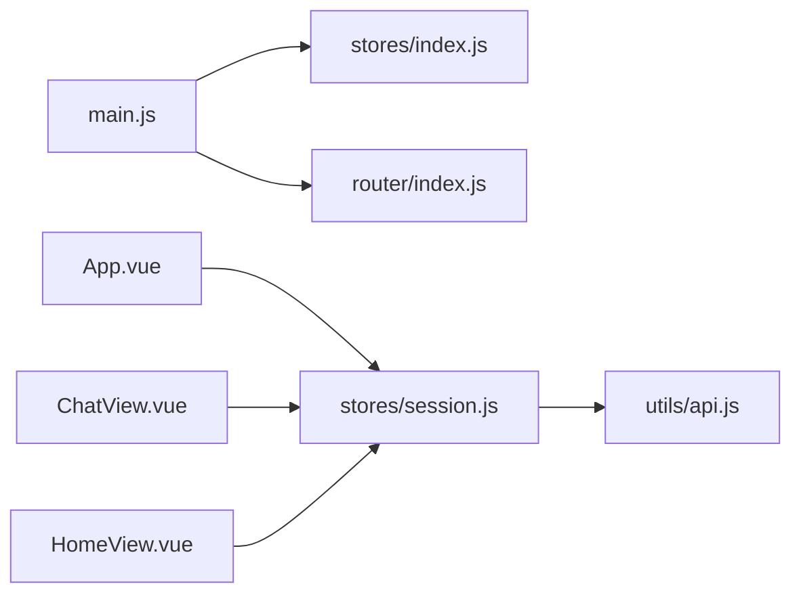

# 状态管理

<cite>
**本文引用的文件**
- [frontend/src/stores/index.js](file://frontend/src/stores/index.js)
- [frontend/src/stores/session.js](file://frontend/src/stores/session.js)
- [frontend/src/main.js](file://frontend/src/main.js)
- [frontend/src/utils/api.js](file://frontend/src/utils/api.js)
- [frontend/src/views/ChatView.vue](file://frontend/src/views/ChatView.vue)
- [frontend/src/App.vue](file://frontend/src/App.vue)
- [frontend/src/router/index.js](file://frontend/src/router/index.js)
- [frontend/package.json](file://frontend/package.json)
</cite>

## 目录
1. [简介](#简介)
2. [项目结构](#项目结构)
3. [核心组件](#核心组件)
4. [架构总览](#架构总览)
5. [详细组件分析](#详细组件分析)
6. [依赖关系分析](#依赖关系分析)
7. [性能考量](#性能考量)
8. [故障排查指南](#故障排查指南)
9. [结论](#结论)
10. [附录](#附录)

## 简介
本文件面向 NL2SQL 前端的 Pinia 状态管理，系统性梳理其设计模式与实现策略，重点覆盖：
- 状态定义与计算属性（Getters）的使用
- 动作（Actions）的组织与异步处理
- 会话状态管理：用户会话、消息历史、当前查询状态的持久化与同步
- 全局状态与组件局部状态的边界划分原则
- 最佳实践：状态结构设计、异步操作处理、状态调试技巧
- 状态持久化策略与跨页面状态同步方案

## 项目结构
前端采用 Vue 3 + Pinia + Vue Router 的组合，状态管理集中于 stores 目录，会话状态由 session store 统一维护；组件通过 Composition API 的 useSessionStore 访问状态与动作。

**图表来源**
- [frontend/src/main.js:1-89](file://frontend/src/main.js#L1-L89)
- [frontend/src/router/index.js:1-157](file://frontend/src/router/index.js#L1-L157)
- [frontend/src/stores/index.js:1-30](file://frontend/src/stores/index.js#L1-L30)
- [frontend/src/stores/session.js:1-443](file://frontend/src/stores/session.js#L1-L443)
- [frontend/src/utils/api.js:1-320](file://frontend/src/utils/api.js#L1-L320)
- [frontend/src/views/ChatView.vue:1-835](file://frontend/src/views/ChatView.vue#L1-L835)
- [frontend/src/App.vue:1-384](file://frontend/src/App.vue#L1-L384)

**章节来源**
- [frontend/src/main.js:1-89](file://frontend/src/main.js#L1-L89)
- [frontend/src/router/index.js:1-157](file://frontend/src/router/index.js#L1-L157)
- [frontend/src/stores/index.js:1-30](file://frontend/src/stores/index.js#L1-L30)
- [frontend/src/stores/session.js:1-443](file://frontend/src/stores/session.js#L1-L443)
- [frontend/src/utils/api.js:1-320](file://frontend/src/utils/api.js#L1-L320)
- [frontend/src/views/ChatView.vue:1-835](file://frontend/src/views/ChatView.vue#L1-L835)
- [frontend/src/App.vue:1-384](file://frontend/src/App.vue#L1-L384)

## 核心组件
- Pinia 实例创建与导出：在 stores/index.js 中创建并导出全局 Pinia 实例，供 main.js 安装。
- 会话状态 Store：在 stores/session.js 中定义 useSessionStore，集中管理会话列表、当前会话、消息历史、SSE 连接与处理状态。
- 视图组件集成：App.vue、ChatView.vue、HomeView.vue 等通过 useSessionStore 访问状态与动作，实现跨页面状态同步与交互。

关键要点
- 使用 ref 定义响应式状态（如 sessions、currentSessionId、messages、isConnected、isProcessing、processingStatus、processingProgress）。
- 使用 computed 定义派生状态（currentSession、messageCount），保证视图层的响应式更新。
- 使用 defineStore 的函数式写法返回状态、计算属性与动作，便于类型推断与 Tree-shaking。

**章节来源**
- [frontend/src/stores/index.js:1-30](file://frontend/src/stores/index.js#L1-L30)
- [frontend/src/stores/session.js:33-442](file://frontend/src/stores/session.js#L33-L442)

## 架构总览
Pinia 状态管理在 NL2SQL 前端的职责边界清晰：全局状态仅存放“会话”相关数据与流程控制，组件局部状态仅存放“UI 临时态”。路由与组件通过 Store 的动作完成与后端的交互，SSE 推送驱动状态变更，形成“请求-流式响应-状态更新”的闭环。

**图表来源**
- [frontend/src/views/ChatView.vue:217-235](file://frontend/src/views/ChatView.vue#L217-L235)
- [frontend/src/stores/session.js:310-339](file://frontend/src/stores/session.js#L310-L339)
- [frontend/src/utils/api.js:246-251](file://frontend/src/utils/api.js#L246-L251)

## 详细组件分析

### 会话状态 Store（session.js）
- 状态（State）
  - sessions：会话列表
  - currentSessionId：当前会话标识
  - messages：当前会话消息历史
  - sseConnection：EventSource 实例
  - isConnected：SSE 连接状态
  - isProcessing：是否正在处理请求
  - processingStatus：处理状态文本
  - processingProgress：处理进度百分比
- 计算属性（Getters）
  - currentSession：根据 currentSessionId 返回当前会话
  - messageCount：消息数量
- 动作（Actions）
  - loadSessions：拉取会话列表
  - createSession：创建新会话并设为当前
  - setCurrentSession：切换当前会话并加载消息
  - loadMessages：按会话 ID 拉取消息
  - addMessage：向当前会话追加消息
  - connectSSE/disconnectSSE：建立/断开 SSE 连接
  - sendQuery/sendClarifyAnswer：发送查询/澄清回答
  - deleteSession：删除会话并清理当前状态

实现要点
- SSE 连接与消息处理集中在 handleSSEMessage，按消息类型更新 processingStatus/processingProgress 与 messages。
- sendQuery 与 sendClarifyAnswer 均会本地立即插入用户消息，提升交互体验。
- setCurrentSession 会触发 loadMessages，确保消息历史与路由参数一致。
- deleteSession 会清理当前会话与 SSE 连接，避免状态残留。

**图表来源**
- [frontend/src/stores/session.js:185-304](file://frontend/src/stores/session.js#L185-L304)
- [frontend/src/stores/session.js:310-372](file://frontend/src/stores/session.js#L310-L372)

**章节来源**
- [frontend/src/stores/session.js:33-442](file://frontend/src/stores/session.js#L33-L442)

### 视图组件与状态绑定
- App.vue
  - 通过 useSessionStore 获取 sessions/currentSessionId，渲染侧边栏会话列表与当前激活态
  - 提供创建/切换/删除会话的动作入口
- ChatView.vue
  - 通过 useSessionStore 获取 messages/isProcessing/processingStatus/processingProgress
  - 监听路由参数变化，初始化会话并连接 SSE
  - 监听消息变化与处理状态变化，自动滚动到底部
  - 支持澄清回答的二次提交，兼容 message.id 缺失的回退逻辑
- HomeView.vue
  - 通过 useSessionStore 创建新会话并跳转到聊天页
- HistoryView.vue
  - 独立组件，不依赖会话 Store，直接调用 api.getQueryHistory

**图表来源**
- [frontend/src/App.vue:237-240](file://frontend/src/App.vue#L237-L240)
- [frontend/src/views/ChatView.vue:370-382](file://frontend/src/views/ChatView.vue#L370-L382)
- [frontend/src/stores/session.js:103-171](file://frontend/src/stores/session.js#L103-L171)
- [frontend/src/utils/api.js:151-186](file://frontend/src/utils/api.js#L151-L186)

**章节来源**
- [frontend/src/App.vue:134-240](file://frontend/src/App.vue#L134-L240)
- [frontend/src/views/ChatView.vue:194-420](file://frontend/src/views/ChatView.vue#L194-L420)
- [frontend/src/views/HomeView.vue:142-187](file://frontend/src/views/HomeView.vue#L142-L187)
- [frontend/src/views/HistoryView.vue:226-297](file://frontend/src/views/HistoryView.vue#L226-L297)

### API 服务与错误处理
- api.js 封装 axios，统一设置 baseURL、超时与请求/响应拦截器
- 对后端错误进行统一处理，便于在 Store 中捕获并转化为用户可见的错误消息
- SSE 相关接口通过 HTTP POST 提交查询，后续通过 SSE 流推送结果

最佳实践
- 在 Store 的 Actions 中捕获 API 异常，避免异常冒泡到组件层
- 对 SSE 错误进行状态重置（如 isProcessing=false），保证 UI 一致性

**章节来源**
- [frontend/src/utils/api.js:25-88](file://frontend/src/utils/api.js#L25-L88)
- [frontend/src/utils/api.js:246-268](file://frontend/src/utils/api.js#L246-L268)
- [frontend/src/stores/session.js:109-111](file://frontend/src/stores/session.js#L109-L111)
- [frontend/src/stores/session.js:330-338](file://frontend/src/stores/session.js#L330-L338)

## 依赖关系分析
- main.js 安装 Pinia 与 Router，并注册全局 UI 组件
- App.vue、ChatView.vue、HomeView.vue 等组件均依赖 useSessionStore
- session.js 依赖 api.js 进行 HTTP 通信
- router/index.js 定义路由与滚动行为，配合组件完成跨页面状态同步

**图表来源**
- [frontend/src/main.js:30-69](file://frontend/src/main.js#L30-L69)
- [frontend/src/App.vue:116-138](file://frontend/src/App.vue#L116-L138)
- [frontend/src/views/ChatView.vue:169-193](file://frontend/src/views/ChatView.vue#L169-L193)
- [frontend/src/views/HomeView.vue:120-143](file://frontend/src/views/HomeView.vue#L120-L143)
- [frontend/src/stores/session.js:15-22](file://frontend/src/stores/session.js#L15-L22)
- [frontend/src/utils/api.js:14-15](file://frontend/src/utils/api.js#L14-L15)

**章节来源**
- [frontend/src/main.js:1-89](file://frontend/src/main.js#L1-L89)
- [frontend/src/router/index.js:1-157](file://frontend/src/router/index.js#L1-L157)
- [frontend/src/stores/session.js:15-22](file://frontend/src/stores/session.js#L15-L22)
- [frontend/src/utils/api.js:14-15](file://frontend/src/utils/api.js#L14-L15)

## 性能考量
- 响应式粒度：将消息列表与处理状态拆分为多个 ref，避免无关状态导致的重渲染
- 计算属性：通过 computed(currentSession/messageCount) 减少重复计算
- SSE 流式更新：仅在必要时更新 messages 与处理状态，避免全量刷新
- 组件监听：ChatView 对 messages 与 isProcessing 的监听使用深比较与必要的 nextTick，减少抖动
- 路由切换：App.vue 在切换会话时调用 setCurrentSession 并 push 路由，确保状态与 URL 同步

[本节为通用指导，不直接分析具体文件]

## 故障排查指南
常见问题与定位思路
- SSE 未连接
  - 现象：发送查询无响应或报错
  - 排查：确认 ChatView 在初始化时调用 connectSSE；检查 sessionStore.sseConnection 与 isConnected 状态
  - 参考：[frontend/src/views/ChatView.vue:370-382](file://frontend/src/views/ChatView.vue#L370-L382)，[frontend/src/stores/session.js:185-221](file://frontend/src/stores/session.js#L185-L221)
- 消息不显示或不更新
  - 现象：用户消息已插入，但助手消息未出现
  - 排查：确认 SSE 流是否推送 result 类型消息；检查 handleSSEMessage 的分支逻辑
  - 参考：[frontend/src/stores/session.js:227-304](file://frontend/src/stores/session.js#L227-L304)
- 会话切换无效
  - 现象：点击侧边栏切换会话，URL 变化但消息未更新
  - 排查：确认 App.vue 调用 setCurrentSession 并 push 路由；ChatView 监听路由参数变化重新初始化
  - 参考：[frontend/src/App.vue:192-200](file://frontend/src/App.vue#L192-L200)，[frontend/src/views/ChatView.vue:391-398](file://frontend/src/views/ChatView.vue#L391-L398)
- 删除会话后状态残留
  - 现象：删除当前会话后，页面仍显示旧消息
  - 排查：确认 deleteSession 清理 currentSessionId 与 messages，并断开 SSE
  - 参考：[frontend/src/stores/session.js:389-412](file://frontend/src/stores/session.js#L389-L412)

**章节来源**
- [frontend/src/views/ChatView.vue:370-398](file://frontend/src/views/ChatView.vue#L370-L398)
- [frontend/src/stores/session.js:185-221](file://frontend/src/stores/session.js#L185-L221)
- [frontend/src/stores/session.js:227-304](file://frontend/src/stores/session.js#L227-L304)
- [frontend/src/App.vue:192-200](file://frontend/src/App.vue#L192-L200)
- [frontend/src/stores/session.js:389-412](file://frontend/src/stores/session.js#L389-L412)

## 结论
NL2SQL 前端采用 Pinia 实现会话状态的集中管理，通过 Store 的状态、计算属性与动作，将“会话列表、当前会话、消息历史、SSE 连接与处理状态”统一抽象，配合组件的响应式绑定与路由同步，实现了良好的用户体验与可维护性。建议在后续迭代中进一步引入持久化策略（如本地存储）与调试工具（如 Pinia Devtools），以增强跨页面状态一致性与可观测性。

[本节为总结性内容，不直接分析具体文件]

## 附录

### 状态管理最佳实践清单
- 状态结构设计
  - 将“会话相关”与“UI 临时态”分离：会话相关放 Store，输入框、展开状态等放组件局部状态
  - 使用 ref 定义可变状态，computed 定义派生状态
- 异步操作处理
  - 在 Actions 中统一调用 API，捕获错误并更新处理状态
  - SSE 流式响应通过 handleSSEMessage 分支处理，避免 UI 卡顿
- 跨页面状态同步
  - 路由参数与 Store 状态双向绑定：路由变化时初始化会话并加载消息
  - 会话切换时断开旧 SSE，建立新连接
- 调试技巧
  - 使用浏览器开发者工具观察 Store 状态变化
  - 在关键动作前后打印日志，定位异步流程问题

[本节为通用指导，不直接分析具体文件]