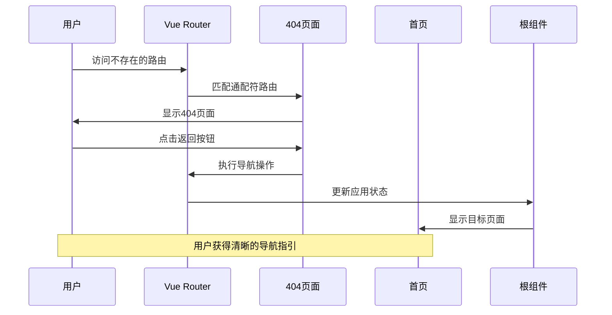
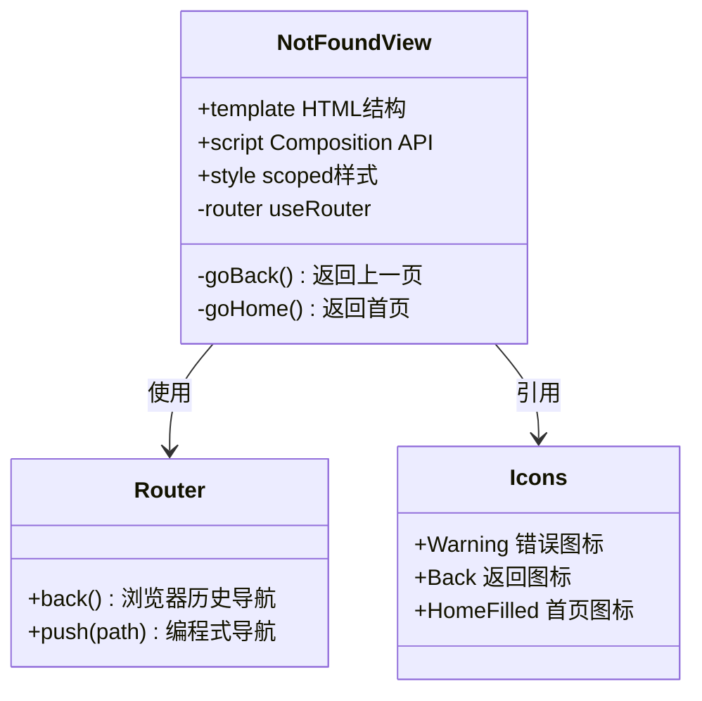
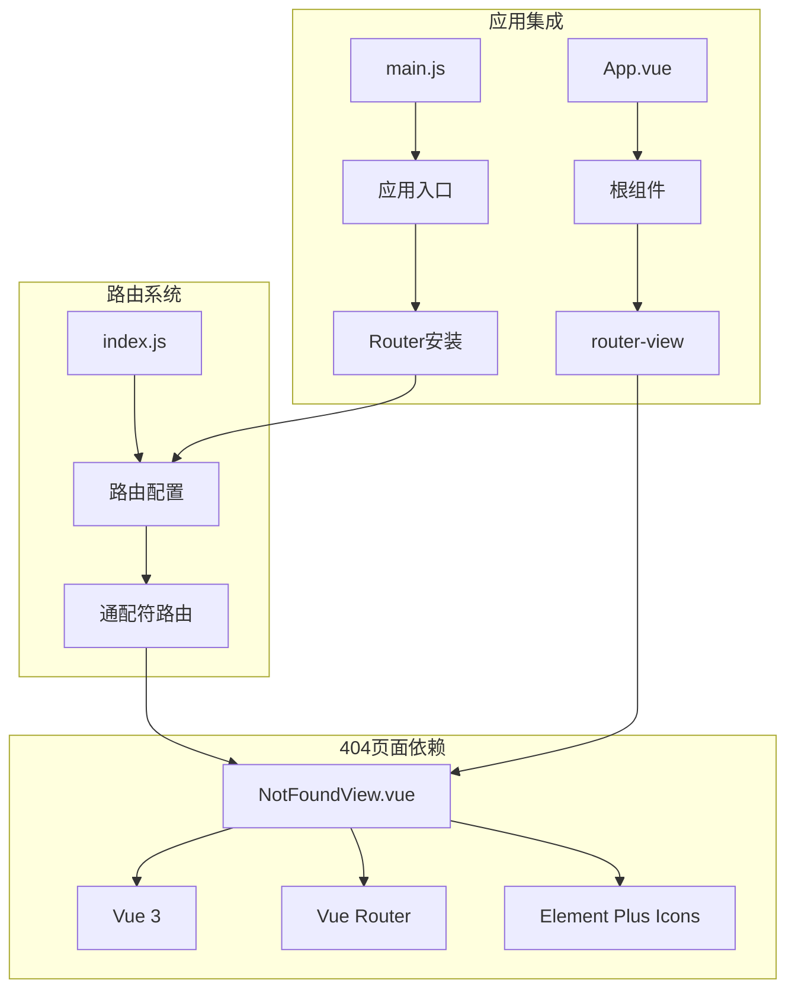

# 404 页面

<cite>
**本文档引用的文件**
- [frontend/src/views/NotFoundView.vue](file://frontend/src/views/NotFoundView.vue)
- [frontend/src/router/index.js](file://frontend/src/router/index.js)
- [frontend/src/App.vue](file://frontend/src/App.vue)
- [frontend/src/main.js](file://frontend/src/main.js)
- [frontend/vite.config.js](file://frontend/vite.config.js)
- [frontend/package.json](file://frontend/package.json)
- [frontend/src/views/HomeView.vue](file://frontend/src/views/HomeView.vue)
- [frontend/src/views/ChatView.vue](file://frontend/src/views/ChatView.vue)
- [frontend/src/utils/api.js](file://frontend/src/utils/api.js)
</cite>

## 目录
1. [简介](#简介)
2. [项目结构](#项目结构)
3. [核心组件](#核心组件)
4. [架构概览](#架构概览)
5. [详细组件分析](#详细组件分析)
6. [依赖关系分析](#依赖关系分析)
7. [性能考虑](#性能考虑)
8. [故障排除指南](#故障排除指南)
9. [结论](#结论)

## 简介

NL2SQL 项目的 404 页面组件是一个专门处理路由错误和资源不存在情况的用户界面组件。该组件采用 Vue 3 Composition API 构建，集成了 Element Plus UI 组件库，提供了直观的错误页面设计和良好的用户体验。

404 页面的主要功能包括：
- 显示友好的错误提示信息
- 提供返回上一页和返回首页的导航选项
- 展示醒目的错误标识和视觉设计
- 支持用户快速回到正确的页面路径

## 项目结构

NL2SQL 项目采用前后端分离的架构设计，404 页面作为前端路由系统的一部分，位于以下目录结构中：

```mermaid
graph TB
subgraph "前端项目结构"
A[frontend/] --> B[src/]
A --> C[vite.config.js]
A --> D[package.json]
B --> E[views/]
B --> F[router/]
B --> G[components/]
B --> H[stores/]
B --> I[utils/]
E --> J[NotFoundView.vue]
E --> K[HomeView.vue]
E --> L[ChatView.vue]
F --> M[index.js]
G --> N[SchemaViewer.vue]
H --> O[session.js]
I --> P[api.js]
end
subgraph "路由系统"
Q[路由配置] --> R[/:pathMatch(.*)*]
R --> S[NotFoundView.vue]
end
```

**图表来源**
- [frontend/src/views/NotFoundView.vue:1-131](file://frontend/src/views/NotFoundView.vue#L1-L131)
- [frontend/src/router/index.js:101-108](file://frontend/src/router/index.js#L101-L108)

**章节来源**
- [frontend/src/views/NotFoundView.vue:1-131](file://frontend/src/views/NotFoundView.vue#L1-L131)
- [frontend/src/router/index.js:1-157](file://frontend/src/router/index.js#L1-157)

## 核心组件

404 页面的核心组件是一个独立的 Vue 单文件组件，具有以下关键特性：

### 组件结构
- **模板部分**：包含错误图标、错误代码、错误标题、描述信息和导航按钮
- **脚本部分**：使用 Composition API，包含路由管理和导航逻辑
- **样式部分**：采用 scoped 样式，确保组件样式隔离

### 视觉设计
- **错误标识**：使用警告图标和大号数字 "404"
- **颜色方案**：采用渐变色彩设计，提供专业的视觉体验
- **布局设计**：居中布局，响应式设计适配不同屏幕尺寸

**章节来源**
- [frontend/src/views/NotFoundView.vue:6-31](file://frontend/src/views/NotFoundView.vue#L6-L31)
- [frontend/src/views/NotFoundView.vue:73-131](file://frontend/src/views/NotFoundView.vue#L73-L131)

## 架构概览

404 页面在整个 NL2SQL 应用中的架构位置如下：



**图表来源**
- [frontend/src/router/index.js:101-108](file://frontend/src/router/index.js#L101-L108)
- [frontend/src/views/NotFoundView.vue:58-70](file://frontend/src/views/NotFoundView.vue#L58-L70)

### 路由配置机制

404 页面通过 Vue Router 的通配符路由实现：

```mermaid
flowchart TD
A[用户访问 URL] --> B{路由匹配}
B --> |匹配到已定义路由| C[正常页面显示]
B --> |未匹配到路由| D[通配符路由匹配]
D --> E[NotFoundView.vue]
E --> F[显示404页面]
F --> G{用户操作}
G --> |返回上一页| H[router.back()]
G --> |返回首页| I[router.push('/')]
H --> J[浏览器历史导航]
I --> K[首页显示]
```

**图表来源**
- [frontend/src/router/index.js:101-108](file://frontend/src/router/index.js#L101-L108)
- [frontend/src/views/NotFoundView.vue:58-70](file://frontend/src/views/NotFoundView.vue#L58-L70)

**章节来源**
- [frontend/src/router/index.js:101-108](file://frontend/src/router/index.js#L101-L108)
- [frontend/src/views/NotFoundView.vue:58-70](file://frontend/src/views/NotFoundView.vue#L58-L70)

## 详细组件分析

### NotFoundView 组件详解

#### 组件架构


**图表来源**
- [frontend/src/views/NotFoundView.vue:33-71](file://frontend/src/views/NotFoundView.vue#L33-L71)

#### 核心功能实现

##### 导航功能
组件提供了两种主要的导航方式：

1. **返回上一页**：使用 `router.back()` 方法
2. **返回首页**：使用 `router.push('/')` 方法

##### 图标系统
- **错误图标**：使用 Warning 图标突出错误状态
- **返回图标**：使用 Back 图标表示导航操作
- **首页图标**：使用 HomeFilled 图标指向主页

**章节来源**
- [frontend/src/views/NotFoundView.vue:42-45](file://frontend/src/views/NotFoundView.vue#L42-L45)
- [frontend/src/views/NotFoundView.vue:58-70](file://frontend/src/views/NotFoundView.vue#L58-L70)

### 路由系统集成

#### 通配符路由配置
404 页面通过特殊的路由配置实现：

```mermaid
graph LR
A[路由配置] --> B[/:pathMatch(.*)*]
B --> C[通配符匹配]
C --> D[NotFoundView.vue]
E[有效路由] --> F[/, /chat/:sessionId, /history, /schema]
F --> G[正常页面]
D --> H[错误页面]
H --> I[用户导航]
```

**图表来源**
- [frontend/src/router/index.js:101-108](file://frontend/src/router/index.js#L101-L108)

#### 路由守卫集成
全局路由守卫为 404 页面提供标题设置功能：

**章节来源**
- [frontend/src/router/index.js:142-150](file://frontend/src/router/index.js#L142-L150)

### 用户体验设计

#### 错误信息设计
- **错误代码**：大号字体显示 "404"
- **错误标题**：中文提示 "页面不存在"
- **描述信息**：友好地解释页面不存在的原因

#### 导航选项设计
- **返回上一页**：使用浏览器历史记录
- **返回首页**：提供直接的主页导航
- **按钮设计**：Element Plus 风格的按钮组件

**章节来源**
- [frontend/src/views/NotFoundView.vue:14-28](file://frontend/src/views/NotFoundView.vue#L14-L28)

## 依赖关系分析

### 外部依赖

#### Vue 生态系统
- **Vue 3**：核心框架，使用 Composition API
- **Vue Router 4**：路由管理系统
- **Element Plus**：UI 组件库

#### 开发工具
- **Vite**：构建工具和开发服务器
- **ESLint**：代码质量检查
- **TypeScript**：类型安全（通过 JSDoc）

### 内部依赖关系



**图表来源**
- [frontend/src/views/NotFoundView.vue:42-45](file://frontend/src/views/NotFoundView.vue#L42-L45)
- [frontend/src/router/index.js:14-15](file://frontend/src/router/index.js#L14-L15)
- [frontend/src/main.js:28-31](file://frontend/src/main.js#L28-L31)

**章节来源**
- [frontend/src/views/NotFoundView.vue:42-45](file://frontend/src/views/NotFoundView.vue#L42-L45)
- [frontend/src/router/index.js:14-15](file://frontend/src/router/index.js#L14-L15)
- [frontend/src/main.js:28-31](file://frontend/src/main.js#L28-L31)

## 性能考虑

### 加载性能
- **懒加载**：404 页面采用动态导入，仅在需要时加载
- **代码分割**：与其他页面组件分离，减少初始加载时间
- **缓存策略**：利用浏览器缓存机制

### 用户体验性能
- **即时响应**：路由切换快速流畅
- **内存管理**：组件卸载时清理相关资源
- **渲染优化**：使用 Vue 3 的响应式系统

## 故障排除指南

### 常见问题诊断

#### 404 页面不显示
1. **检查路由配置**：确认通配符路由正确配置
2. **验证组件导入**：确保组件路径正确
3. **检查路由守卫**：确认全局守卫不影响 404 页面

#### 导航功能失效
1. **检查路由器实例**：确认 `useRouter` 正确导入
2. **验证方法绑定**：确认事件处理器正确绑定
3. **测试浏览器兼容性**：确保 `history.back()` 可用

#### 样式问题
1. **scoped 样式冲突**：检查样式隔离设置
2. **CSS 优先级**：确认样式覆盖规则
3. **主题变量**：验证 Element Plus 主题配置

### 调试技巧

#### 开发环境调试
- **Vue DevTools**：检查组件状态和 props
- **浏览器开发者工具**：监控网络请求和路由变化
- **控制台日志**：添加必要的调试信息

#### 性能监控
- **路由性能**：使用 Vue Router 的导航分析工具
- **组件渲染**：监控组件的渲染时间和更新频率
- **内存使用**：定期检查内存泄漏情况

**章节来源**
- [frontend/src/views/NotFoundView.vue:58-70](file://frontend/src/views/NotFoundView.vue#L58-L70)
- [frontend/src/router/index.js:142-150](file://frontend/src/router/index.js#L142-L150)

## 结论

NL2SQL 项目的 404 页面组件展现了现代前端开发的最佳实践：

### 设计优势
- **简洁直观**：清晰的错误信息和导航选项
- **响应式设计**：适配各种设备和屏幕尺寸
- **用户体验**：提供明确的解决方案和返回路径

### 技术实现
- **模块化架构**：独立的组件设计，易于维护和扩展
- **最佳实践**：遵循 Vue 3 和现代前端开发规范
- **性能优化**：合理的加载策略和资源管理

### 扩展可能性
该 404 页面组件为未来的功能扩展提供了良好的基础，可以根据业务需求添加更多的用户引导和帮助功能。