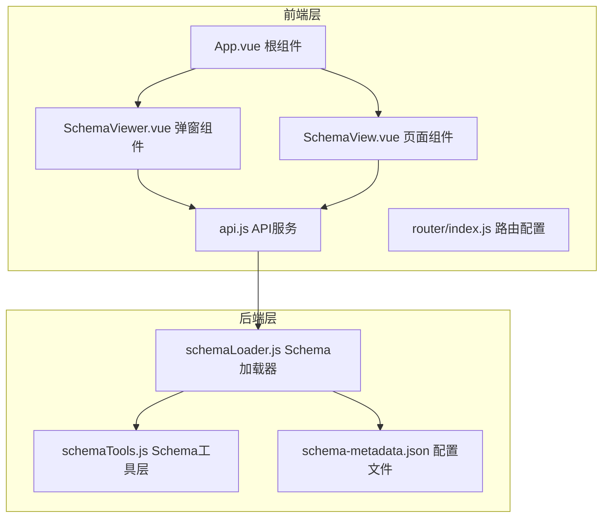
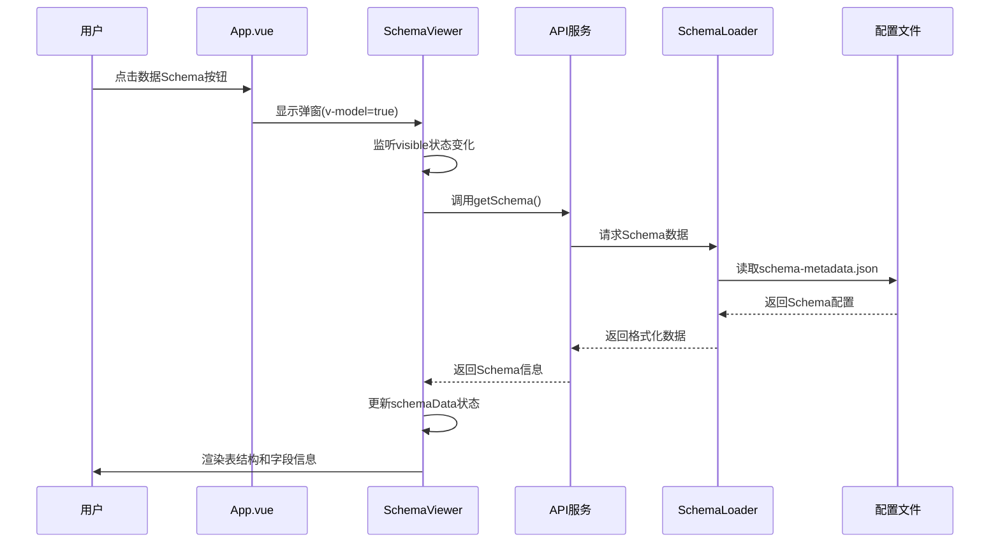
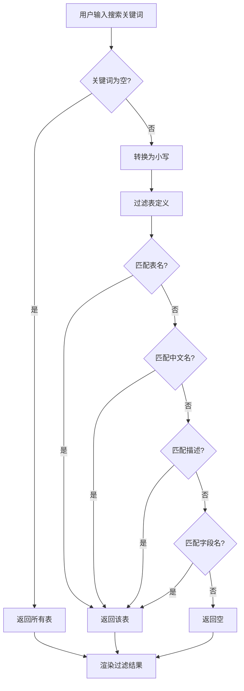
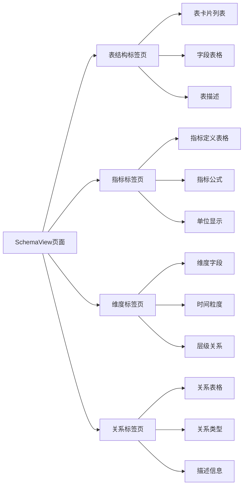
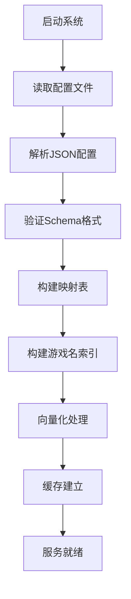
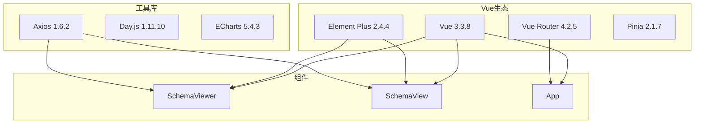
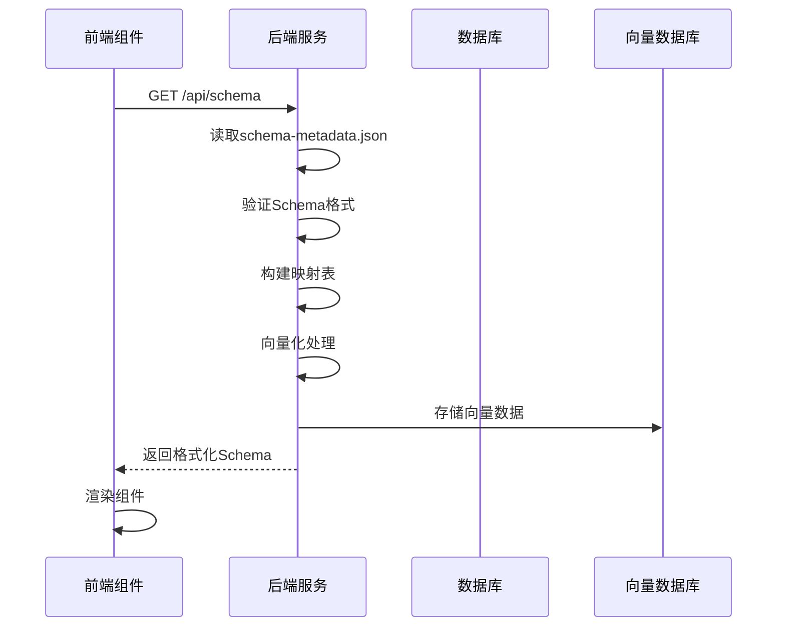

# Schema 查看

<cite>
**本文档引用的文件**
- [SchemaViewer.vue](file://frontend/src/components/SchemaViewer.vue)
- [SchemaView.vue](file://frontend/src/views/SchemaView.vue)
- [api.js](file://frontend/src/utils/api.js)
- [App.vue](file://frontend/src/App.vue)
- [index.js](file://frontend/src/router/index.js)
- [schemaLoader.js](file://backend/src/core/schemaLoader.js)
- [schemaTools.js](file://backend/src/core/schemaTools.js)
- [schema-metadata.json](file://backend/config/schema-metadata.json)
- [schema-metadata.example.json](file://backend/config/schema-metadata.example.json)
</cite>

## 目录
1. [简介](#简介)
2. [项目结构](#项目结构)
3. [核心组件](#核心组件)
4. [架构概览](#架构概览)
5. [详细组件分析](#详细组件分析)
6. [依赖分析](#依赖分析)
7. [性能考虑](#性能考虑)
8. [故障排除指南](#故障排除指南)
9. [结论](#结论)
10. [附录](#附录)

## 简介
NL2SQL Schema 查看组件是一个强大的数据库 Schema 可视化工具，为用户提供直观、交互式的数据库结构探索体验。该组件支持两种展示模式：弹窗模式（SchemaViewer）和完整页面模式（SchemaView），能够清晰地展示表结构、字段信息、关系图谱以及业务指标和维度。

该系统的核心价值在于：
- **多维度数据展示**：同时支持表结构、指标、维度、关系等多种数据类型的可视化
- **智能搜索过滤**：提供全文搜索能力，支持表名、字段名、描述的智能匹配
- **实时数据同步**：通过 API 实时获取最新 Schema 信息，确保数据准确性
- **交互式导航**：支持折叠展开、标签页切换、搜索过滤等丰富的交互功能
- **缓存策略**：采用智能缓存机制，平衡数据新鲜度和性能表现

## 项目结构
NL2SQL 项目采用前后端分离架构，Schema 查看功能分布在前端和后端两个层面：

**图表来源**
- [App.vue:1-384](file://frontend/src/App.vue#L1-L384)
- [SchemaViewer.vue:1-317](file://frontend/src/components/SchemaViewer.vue#L1-L317)
- [SchemaView.vue:1-322](file://frontend/src/views/SchemaView.vue#L1-L322)
- [api.js:1-320](file://frontend/src/utils/api.js#L1-L320)
- [schemaLoader.js:1-1261](file://backend/src/core/schemaLoader.js#L1-L1261)

**章节来源**
- [App.vue:1-384](file://frontend/src/App.vue#L1-L384)
- [SchemaViewer.vue:1-317](file://frontend/src/components/SchemaViewer.vue#L1-L317)
- [SchemaView.vue:1-322](file://frontend/src/views/SchemaView.vue#L1-L322)
- [api.js:1-320](file://frontend/src/utils/api.js#L1-L320)
- [schemaLoader.js:1-1261](file://backend/src/core/schemaLoader.js#L1-L1261)

## 核心组件
Schema 查看系统包含三个核心组件，每个组件都有独特的功能定位：

### SchemaViewer 弹窗组件
- **功能定位**：轻量级弹窗模式，适合快速查看和临时浏览
- **特点**：模态对话框形式，支持搜索过滤，懒加载数据
- **适用场景**：聊天界面中快速查看 Schema 详情，临时查阅使用

### SchemaView 页面组件  
- **功能定位**：完整页面模式，提供最全面的 Schema 展示
- **特点**：标签页分层展示，支持统计信息，网格布局
- **适用场景**：专门的 Schema 浏览页面，深度探索使用

### API 服务层
- **功能定位**：统一的后端 API 访问接口
- **特点**：封装 HTTP 请求，统一错误处理，支持多种 Schema 查询
- **适用场景**：前后端数据交互，Schema 信息获取

**章节来源**
- [SchemaViewer.vue:1-317](file://frontend/src/components/SchemaViewer.vue#L1-L317)
- [SchemaView.vue:1-322](file://frontend/src/views/SchemaView.vue#L1-L322)
- [api.js:118-141](file://frontend/src/utils/api.js#L118-L141)

## 架构概览
Schema 查看系统的整体架构采用分层设计，确保了良好的可维护性和扩展性：

**图表来源**
- [App.vue:54-81](file://frontend/src/App.vue#L54-L81)
- [SchemaViewer.vue:252-256](file://frontend/src/components/SchemaViewer.vue#L252-L256)
- [api.js:118-120](file://frontend/src/utils/api.js#L118-L120)
- [schemaLoader.js:75-131](file://backend/src/core/schemaLoader.js#L75-L131)

系统架构的关键特性：
- **响应式数据流**：Vue 3 Composition API 实现双向数据绑定
- **懒加载机制**：弹窗打开时才加载数据，提升性能
- **统一错误处理**：前端统一捕获和处理 API 错误
- **配置驱动**：Schema 信息来源于 JSON 配置文件

**章节来源**
- [App.vue:85-241](file://frontend/src/App.vue#L85-L241)
- [SchemaViewer.vue:89-257](file://frontend/src/components/SchemaViewer.vue#L89-L257)
- [schemaLoader.js:1-1261](file://backend/src/core/schemaLoader.js#L1-L1261)

## 详细组件分析

### SchemaViewer 组件分析

SchemaViewer 是一个功能完备的弹窗式 Schema 查看组件，具有以下核心特性：

#### 数据结构设计
组件内部维护着完整的 Schema 数据结构：
- **tables**: 表定义数组，包含表名、中文名、描述、字段列表
- **relationships**: 表关系定义，支持主键、外键等关系类型
- **metrics**: 业务指标定义，包含指标名称、定义、单位等
- **dimensions**: 维度定义，支持时间粒度、层级关系等

#### 搜索过滤机制
组件实现了智能的全文搜索功能：

**图表来源**
- [SchemaViewer.vue:157-182](file://frontend/src/components/SchemaViewer.vue#L157-L182)

#### 交互式导航功能
- **折叠面板**：每个表以折叠面板形式展示，支持展开/收起
- **标签页**：页面级组件支持多标签页切换（表结构、指标、维度、关系）
- **加载状态**：骨架屏加载效果，提升用户体验
- **空状态**：无数据时的友好提示

#### 样式定制选项
组件提供了丰富的样式定制能力：
- **颜色主题**：Element Plus 组件风格
- **字体设置**：代码字体、标签字体的统一样式
- **间距控制**：合理的间距和边距设计
- **响应式布局**：适配不同屏幕尺寸

**章节来源**
- [SchemaViewer.vue:1-317](file://frontend/src/components/SchemaViewer.vue#L1-L317)

### SchemaView 页面组件分析

SchemaView 提供了完整的 Schema 浏览体验，具有以下特色功能：

#### 多标签页架构
页面采用标签页分层展示不同类型的 Schema 信息：

**图表来源**
- [SchemaView.vue:21-144](file://frontend/src/views/SchemaView.vue#L21-L144)

#### 统计信息展示
页面顶部提供实时的 Schema 统计信息：
- **表数量统计**：显示数据库中表的总数
- **指标数量统计**：显示预定义业务指标的数量
- **维度数量统计**：显示维度定义的数量

#### 网格布局设计
表结构标签页采用响应式网格布局：
- **自适应列数**：根据屏幕宽度自动调整列数
- **卡片式设计**：每个表以独立卡片形式展示
- **悬停效果**：提供良好的交互反馈

**章节来源**
- [SchemaView.vue:1-322](file://frontend/src/views/SchemaView.vue#L1-L322)

### API 服务层分析

API 服务层提供了统一的后端接口访问能力：

#### 接口定义
- **getSchema()**: 获取完整 Schema 信息
- **getTableDetail()**: 获取指定表的详细信息  
- **searchSchema()**: 搜索 Schema 信息
- **健康检查接口**: 系统健康状态监控

#### 错误处理机制
API 服务实现了完善的错误处理：
- **请求拦截器**：统一添加请求头和认证信息
- **响应拦截器**：统一处理响应数据和错误
- **网络错误处理**：区分网络连接失败和服务器错误

#### 配置管理
- **基础 URL**: `/api` 前缀统一管理
- **超时设置**: 30 秒请求超时
- **内容类型**: JSON 格式请求

**章节来源**
- [api.js:1-320](file://frontend/src/utils/api.js#L1-L320)

### 后端 Schema 加载器分析

后端 Schema 加载器是整个系统的核心数据引擎：

#### 数据加载流程

**图表来源**
- [schemaLoader.js:75-131](file://backend/src/core/schemaLoader.js#L75-L131)

#### 缓存策略
- **内存缓存**: Schema 数据存储在内存中
- **时间戳管理**: 缓存过期时间控制
- **智能刷新**: 支持强制刷新和自动过期检测

#### 搜索算法
- **语义搜索**: 基于向量相似度的智能搜索
- **关键词匹配**: 传统关键词匹配算法
- **混合排序**: 结合语义和关键词的综合排序

**章节来源**
- [schemaLoader.js:1-1261](file://backend/src/core/schemaLoader.js#L1-L1261)

## 依赖分析

### 前端依赖关系

**图表来源**
- [frontend/package.json:11-29](file://frontend/package.json#L11-L29)

### 后端依赖关系
后端系统依赖于多种技术栈：
- **Node.js**: 运行时环境
- **文件系统**: JSON 配置文件读取
- **向量存储**: LanceDB 向量数据库
- **LLM 服务**: OpenAI Embedding 服务

### 数据流分析

**图表来源**
- [schemaLoader.js:89-131](file://backend/src/core/schemaLoader.js#L89-L131)
- [api.js:118-120](file://frontend/src/utils/api.js#L118-L120)

**章节来源**
- [frontend/package.json:1-36](file://frontend/package.json#L1-L36)
- [schemaLoader.js:1-1261](file://backend/src/core/schemaLoader.js#L1-L1261)

## 性能考虑

### 缓存优化策略
- **内存缓存**: Schema 数据驻留在内存中，避免重复读取
- **智能过期**: 支持配置缓存过期时间
- **懒加载**: 弹窗组件仅在需要时加载数据

### 向量化搜索优化
- **增量更新**: 向量数据采用增量更新策略
- **智能过滤**: 基于上下文的智能过滤和排序
- **回退机制**: 向量化失败时自动回退到关键词匹配

### 前端渲染优化
- **虚拟滚动**: 大数据量时采用虚拟滚动技术
- **组件懒加载**: 路由级别的组件懒加载
- **响应式设计**: 适配不同设备和屏幕尺寸

## 故障排除指南

### 常见问题及解决方案

#### Schema 数据加载失败
**症状**: Schema 查看页面显示空白或加载失败
**可能原因**:
- 配置文件不存在或格式错误
- 后端服务未启动
- 网络连接问题

**解决步骤**:
1. 检查 `schema-metadata.json` 文件是否存在
2. 验证 JSON 格式是否正确
3. 确认后端服务正常运行
4. 检查网络连接状态

#### 搜索功能异常
**症状**: 搜索框无法正常工作
**可能原因**:
- 搜索关键词为空
- Schema 数据未正确加载
- 前端组件状态异常

**解决步骤**:
1. 确认 Schema 数据已加载完成
2. 检查搜索关键词格式
3. 刷新页面重新加载数据

#### 性能问题
**症状**: 页面加载缓慢或响应迟钝
**可能原因**:
- 数据量过大
- 缓存失效
- 网络延迟

**解决步骤**:
1. 检查缓存状态
2. 优化搜索条件
3. 考虑分页加载

**章节来源**
- [schemaLoader.js:140-164](file://backend/src/core/schemaLoader.js#L140-L164)
- [api.js:72-88](file://frontend/src/utils/api.js#L72-L88)

## 结论
NL2SQL Schema 查看组件是一个设计精良、功能完备的数据库 Schema 可视化工具。它通过前后端协同工作，为用户提供了直观、高效的数据库结构探索体验。

### 主要优势
- **多模式展示**: 弹窗和页面两种模式满足不同使用场景
- **智能搜索**: 支持全文搜索和语义匹配
- **实时同步**: 数据实时更新，确保准确性
- **性能优化**: 多层次缓存和懒加载机制
- **扩展性强**: 模块化设计便于功能扩展

### 技术亮点
- **响应式架构**: Vue 3 Composition API 实现
- **向量化搜索**: 基于 AI 的智能搜索能力
- **配置驱动**: JSON 配置文件管理 Schema
- **统一接口**: API 服务层提供标准化接口

该组件为 NL2SQL 系统提供了坚实的数据基础，是整个自然语言转 SQL 系统的重要组成部分。

## 附录

### 配置选项
- **缓存配置**: 可配置缓存过期时间和刷新策略
- **搜索配置**: 可调整搜索算法和匹配规则
- **样式配置**: 支持主题定制和样式覆盖

### 扩展方法
- **自定义字段**: 支持添加自定义字段和属性
- **关系扩展**: 支持复杂关系类型的定义
- **指标扩展**: 支持业务指标的自定义定义

### 最佳实践
- **数据更新**: 定期更新 Schema 配置文件
- **性能监控**: 监控缓存命中率和加载性能
- **用户体验**: 提供清晰的加载状态和错误提示