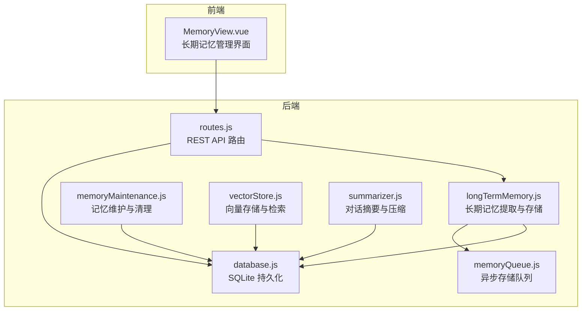
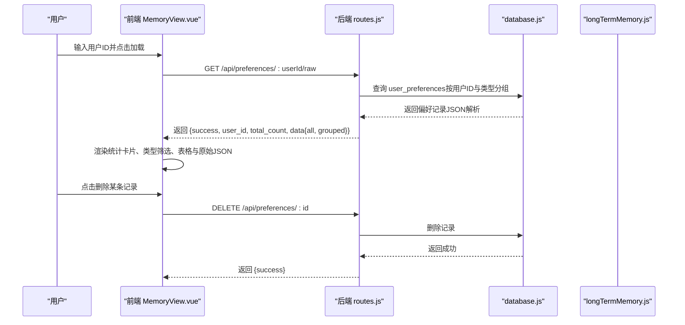
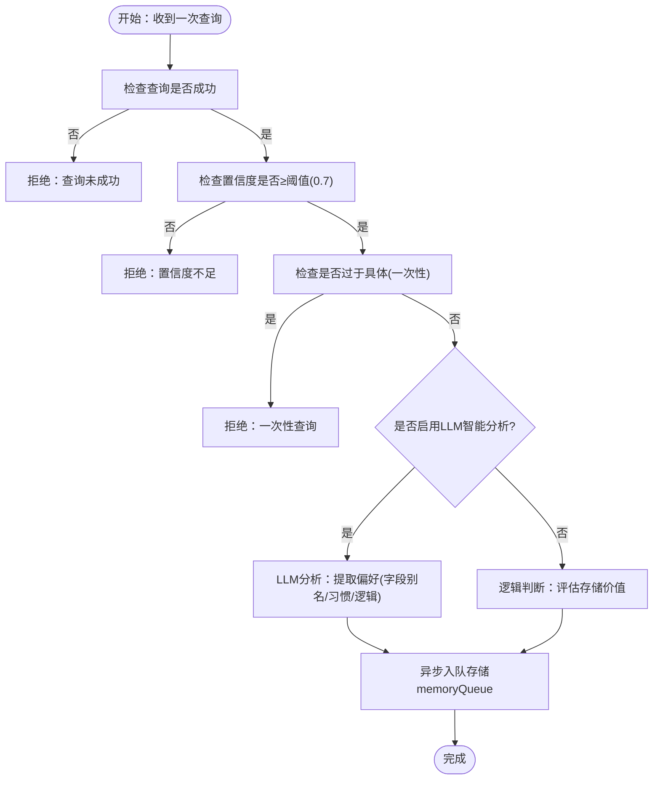
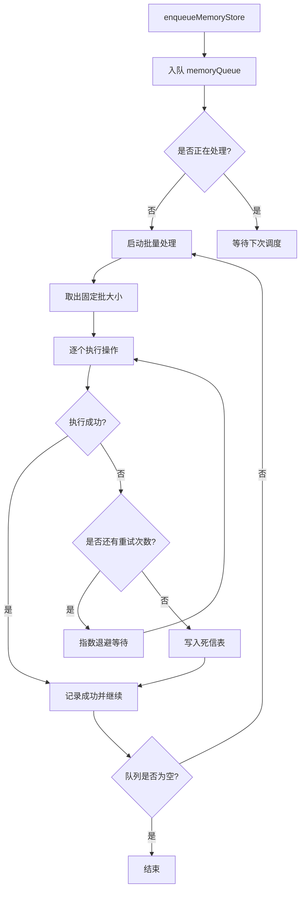
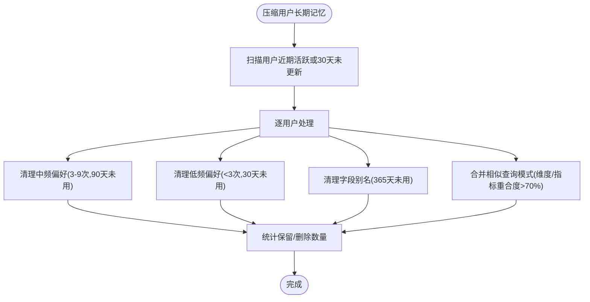
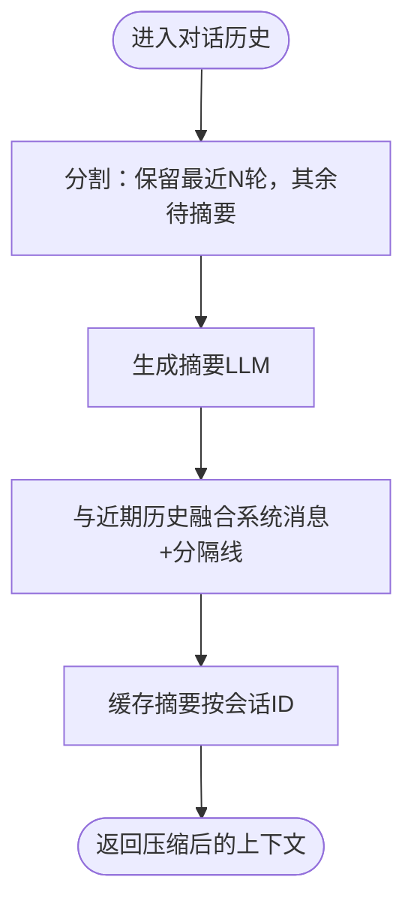
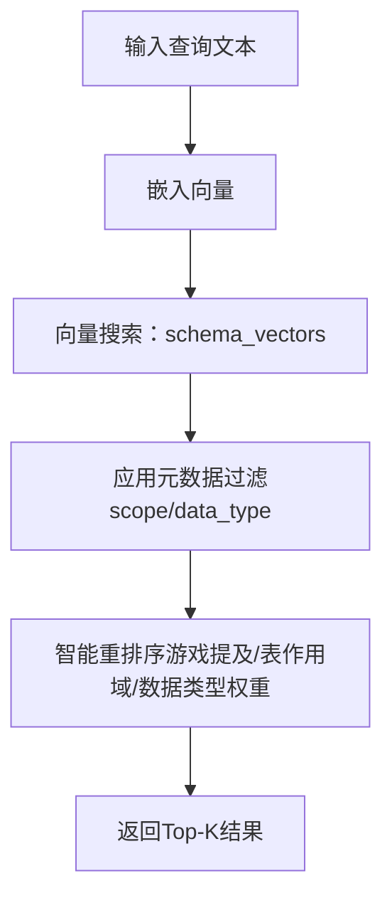
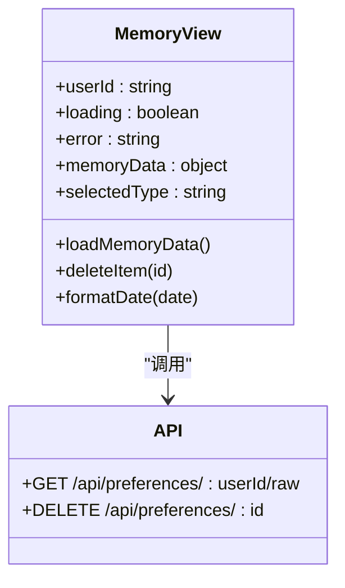
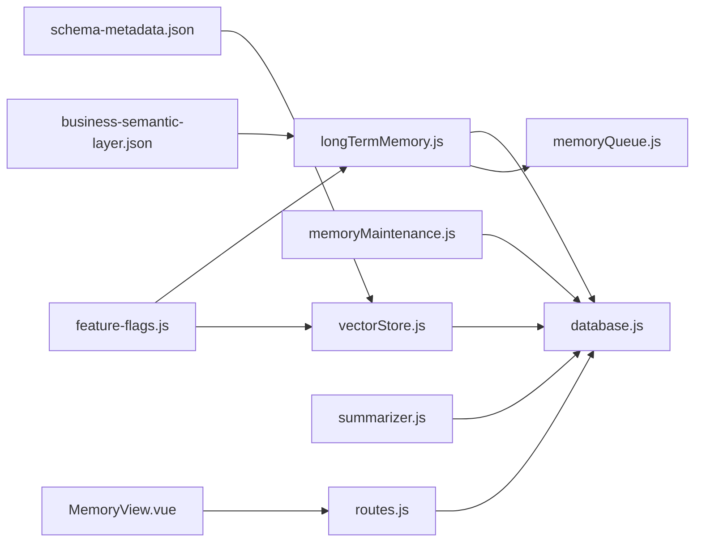

# 内存管理

<cite>
**本文引用的文件**
- [MemoryView.vue](file://frontend/src/views/MemoryView.vue)
- [routes.js](file://backend/src/core/routes.js)
- [database.js](file://backend/src/core/database.js)
- [longTermMemory.js](file://backend/src/memory/longTermMemory.js)
- [memoryQueue.js](file://backend/src/memory/memoryQueue.js)
- [memoryMaintenance.js](file://backend/src/memory/memoryMaintenance.js)
- [vectorStore.js](file://backend/src/memory/vectorStore.js)
- [summarizer.js](file://backend/src/memory/summarizer.js)
- [business-semantic-layer.json](file://backend/config/business-semantic-layer.json)
- [schema-metadata.json](file://backend/config/schema-metadata.json)
- [feature-flags.js](file://backend/config/feature-flags.js)
</cite>

## 目录
1. [简介](#简介)
2. [项目结构](#项目结构)
3. [核心组件](#核心组件)
4. [架构总览](#架构总览)
5. [详细组件分析](#详细组件分析)
6. [依赖关系分析](#依赖关系分析)
7. [性能考量](#性能考量)
8. [故障排查指南](#故障排查指南)
9. [结论](#结论)
10. [附录](#附录)

## 简介
本文件面向 NL2SQL 的“内存管理”能力，系统性阐述长期记忆、短期记忆（对话摘要）、向量检索与存储、记忆维护与清理、以及前端可视化管理界面的设计与使用方法。重点覆盖：
- 长期记忆：用户偏好（字段别名、查询模式、常用指标/维度）的提取、存储、分类与展示
- 短期记忆：对话摘要与压缩，减少上下文长度，提升推理效率
- 向量记忆：Schema 与查询历史的向量存储与语义检索
- 可视化管理：前端“长期记忆管理”页面，支持用户ID筛选、按类型查看、原始数据JSON查看与删除
- 维护与清理：分级保留策略、相似模式合并、健康报告
- 更新机制与隐私策略：异步存储队列、失败重试与死信、清理规则与隐私保护
- 数据导出与备份：通过 API 获取原始数据，结合数据库文件进行备份

## 项目结构
NL2SQL 的内存管理横跨前后端：
- 前端：Vue 单页应用，提供“长期记忆管理”可视化界面
- 后端：Node.js + Express，提供 REST API；SQLite 持久化；内存模块负责偏好提取、摘要、向量存储与维护

图表来源
- [MemoryView.vue:1-511](file://frontend/src/views/MemoryView.vue#L1-L511)
- [routes.js:464-561](file://backend/src/core/routes.js#L464-L561)
- [database.js:39-200](file://backend/src/core/database.js#L39-L200)
- [longTermMemory.js:1-120](file://backend/src/memory/longTermMemory.js#L1-L120)
- [memoryQueue.js:1-120](file://backend/src/memory/memoryQueue.js#L1-L120)
- [memoryMaintenance.js:1-120](file://backend/src/memory/memoryMaintenance.js#L1-L120)
- [vectorStore.js:1-120](file://backend/src/memory/vectorStore.js#L1-L120)
- [summarizer.js:1-120](file://backend/src/memory/summarizer.js#L1-L120)

章节来源
- [MemoryView.vue:1-511](file://frontend/src/views/MemoryView.vue#L1-L511)
- [routes.js:464-561](file://backend/src/core/routes.js#L464-L561)
- [database.js:39-200](file://backend/src/core/database.js#L39-L200)

## 核心组件
- 长期记忆模块（Layer 2）：从成功且高置信度的查询中提取字段别名、查询模式、常用指标/维度偏好，支持 LLM 智能分析与逻辑判断双路径
- 异步记忆存储队列：指数退避重试、失败持久化（死信）、队列长度保护、指标导出
- 记忆维护与清理：分级保留策略（高频/中频/低频/字段别名）、相似模式合并、用户与系统健康报告
- 对话摘要与压缩：长对话自动摘要、保留近期对话、缓存与增量更新
- 向量存储与检索：Schema 与查询历史向量表、智能搜索与重排序
- 前端可视化管理：用户ID筛选、类型分组、表格展示、原始 JSON 查看与删除

章节来源
- [longTermMemory.js:1-120](file://backend/src/memory/longTermMemory.js#L1-L120)
- [memoryQueue.js:1-120](file://backend/src/memory/memoryQueue.js#L1-L120)
- [memoryMaintenance.js:1-120](file://backend/src/memory/memoryMaintenance.js#L1-L120)
- [summarizer.js:1-120](file://backend/src/memory/summarizer.js#L1-L120)
- [vectorStore.js:1-120](file://backend/src/memory/vectorStore.js#L1-L120)
- [MemoryView.vue:1-120](file://frontend/src/views/MemoryView.vue#L1-L120)

## 架构总览
下面的序列图展示了“用户在前端查看长期记忆”的典型流程，包括 API 调用、后端处理与数据库交互。

图表来源
- [MemoryView.vue:212-243](file://frontend/src/views/MemoryView.vue#L212-L243)
- [routes.js:464-561](file://backend/src/core/routes.js#L464-L561)
- [database.js:837-880](file://backend/src/core/database.js#L837-L880)
- [longTermMemory.js:299-486](file://backend/src/memory/longTermMemory.js#L299-L486)

## 详细组件分析

### 长期记忆：提取、存储与展示
- 提取策略
  - 成功且置信度≥阈值（默认0.7）的查询才考虑存储
  - 排除过于具体的一次性查询（如包含绝对时间范围、简单维度+指标组合等）
  - 高价值模板（维度≥2且指标≥1）或高频模式（7天内≥2次）才存储
  - LLM 智能分析：优先提取字段别名、分析习惯、通用过滤逻辑等，区分个人偏好与通用知识
- 存储类型
  - 字段别名（field_alias）：用户术语↔Schema字段映射，支持伪字段与值映射
  - 查询模式（query_pattern）：维度+指标+时间范围+过滤器模板
  - 常用指标（metric_preference）、常用维度（dimension_preference）
- 展示与管理
  - 前端按类型分组展示，支持删除单条记录
  - 支持查看原始 JSON，便于审计与调试

图表来源
- [longTermMemory.js:299-486](file://backend/src/memory/longTermMemory.js#L299-L486)
- [memoryQueue.js:66-102](file://backend/src/memory/memoryQueue.js#L66-L102)

章节来源
- [longTermMemory.js:299-486](file://backend/src/memory/longTermMemory.js#L299-L486)
- [MemoryView.vue:58-187](file://frontend/src/views/MemoryView.vue#L58-L187)

### 异步记忆存储队列：可靠性与可观测性
- 批量处理：固定批大小与处理间隔，避免阻塞主流程
- 指数退避重试：最大重试次数与回退因子，失败持久化到死信表
- 队列长度保护：超过上限直接走死信，防止 OOM
- 指标导出：入队/成功/重试/死信/拒绝满队列等指标，便于运维观测

图表来源
- [memoryQueue.js:107-215](file://backend/src/memory/memoryQueue.js#L107-L215)

章节来源
- [memoryQueue.js:1-293](file://backend/src/memory/memoryQueue.js#L1-L293)

### 记忆维护与清理：分级保留与相似模式合并
- 分级保留策略
  - 高频（≥10次）：永久保留
  - 中频（3-9次）：90天未用清理（跳过置顶）
  - 低频（<3次）：30天未用清理（跳过置顶）
  - 字段别名：365天未用清理（用户习惯相对稳定）
- 相似模式合并：维度/指标重合度>70%且时间范围类型一致时合并，提升可读性与减少冗余
- 健康报告：系统级统计、按类型统计、预估清理量、最后清理时间

图表来源
- [memoryMaintenance.js:69-195](file://backend/src/memory/memoryMaintenance.js#L69-L195)
- [memoryMaintenance.js:207-251](file://backend/src/memory/memoryMaintenance.js#L207-L251)

章节来源
- [memoryMaintenance.js:1-421](file://backend/src/memory/memoryMaintenance.js#L1-L421)

### 对话摘要与压缩：减少上下文长度
- 触发条件：对话轮数≥阈值或 Token 数超过阈值（约 60% 的 10k 预算）
- 分割：保留最近若干轮对话，其余历史压缩为摘要
- 摘要生成：使用 LLM 将历史压缩为关键信息摘要，控制长度
- 缓存：按会话ID缓存摘要，避免重复生成；达到更新间隔才刷新
- 增量更新：新增对话与现有摘要融合，保持一致性

图表来源
- [summarizer.js:264-331](file://backend/src/memory/summarizer.js#L264-L331)
- [summarizer.js:450-504](file://backend/src/memory/summarizer.js#L450-L504)

章节来源
- [summarizer.js:1-530](file://backend/src/memory/summarizer.js#L1-L530)

### 向量存储与检索：Schema 与查询历史
- 向量存储
  - Schema 向量表：表/字段描述向量化，支持按 scope、数据类型过滤
  - 查询历史向量表：用户自然语言查询向量化，支持相似查询检索
- 智能搜索
  - Schema 搜索：根据查询向量检索相似 Schema，结合游戏提及、表作用域子类型、数据类型等进行重排序
  - 查询历史搜索：基于向量相似度召回历史查询
- 元数据增强
  - 计算查询重要性评分（基于维度/指标/筛选器/置信度/上下文复杂度）
  - 查询类型分类（定义/解释、对比、趋势、澄清、跟进、新话题）

图表来源
- [vectorStore.js:454-578](file://backend/src/memory/vectorStore.js#L454-L578)

章节来源
- [vectorStore.js:1-928](file://backend/src/memory/vectorStore.js#L1-L928)

### 前端可视化管理界面：长期记忆管理
- 用户ID筛选：输入匿名或其他用户ID，点击加载
- 统计卡片：总记录数、字段别名、查询模式、常用指标、常用维度
- 类型筛选：按字段别名/查询模式/常用指标/常用维度切换表格
- 表格展示：字段别名（用户术语、映射类型、目标值、使用次数、创建时间）、查询模式（模式名称、维度、指标、使用次数）、常用指标/维度（名称、使用次数）
- 原始数据查看：JSON 格式展示，便于审计
- 删除操作：确认后调用删除 API，刷新数据

图表来源
- [MemoryView.vue:1-254](file://frontend/src/views/MemoryView.vue#L1-L254)
- [routes.js:464-561](file://backend/src/core/routes.js#L464-L561)

章节来源
- [MemoryView.vue:1-511](file://frontend/src/views/MemoryView.vue#L1-L511)
- [routes.js:464-561](file://backend/src/core/routes.js#L464-L561)

## 依赖关系分析
- 组件耦合
  - 长期记忆模块依赖数据库与队列模块，确保存储可靠性
  - 记忆维护模块依赖数据库，提供清理与合并能力
  - 向量存储模块依赖 LanceDB 文件系统，提供语义检索
  - 前端依赖后端 REST API，实现可视化管理
- 外部依赖
  - SQLite：本地轻量数据库，存储会话、消息、查询历史与用户偏好
  - LanceDB：向量数据库，提供 schema_vectors 与 query_vectors
  - LLM 服务：用于智能分析与摘要生成
- 配置与开关
  - 业务语义层配置：将业务概念映射到物理表/字段
  - Schema 元数据：表与字段的详细定义
  - 功能开关：控制不同 Phase 的功能启用与回滚

图表来源
- [longTermMemory.js:1-120](file://backend/src/memory/longTermMemory.js#L1-L120)
- [memoryQueue.js:1-120](file://backend/src/memory/memoryQueue.js#L1-L120)
- [memoryMaintenance.js:1-120](file://backend/src/memory/memoryMaintenance.js#L1-L120)
- [vectorStore.js:1-120](file://backend/src/memory/vectorStore.js#L1-L120)
- [summarizer.js:1-120](file://backend/src/memory/summarizer.js#L1-L120)
- [MemoryView.vue:1-120](file://frontend/src/views/MemoryView.vue#L1-L120)
- [routes.js:464-561](file://backend/src/core/routes.js#L464-L561)
- [database.js:39-200](file://backend/src/core/database.js#L39-L200)
- [business-semantic-layer.json:1-189](file://backend/config/business-semantic-layer.json#L1-L189)
- [schema-metadata.json:1-800](file://backend/config/schema-metadata.json#L1-L800)
- [feature-flags.js:1-294](file://backend/config/feature-flags.js#L1-L294)

章节来源
- [business-semantic-layer.json:1-189](file://backend/config/business-semantic-layer.json#L1-L189)
- [schema-metadata.json:1-800](file://backend/config/schema-metadata.json#L1-L800)
- [feature-flags.js:1-294](file://backend/config/feature-flags.js#L1-L294)

## 性能考量
- 异步存储与批处理：通过队列与批处理降低主流程阻塞，提高吞吐
- 指数退避与死信：在瞬时故障场景下保证最终一致性，避免雪崩
- 向量检索：Top-K 搜索与应用层过滤相结合，兼顾性能与准确性
- 对话摘要：在 Token 阈值触发时才压缩，避免不必要的 LLM 调用
- 数据库索引：user_preferences、query_history 等表建立必要索引，加速查询与统计

## 故障排查指南
- 队列异常
  - 现象：队列积压、处理延迟
  - 排查：检查队列状态与指标（入队/成功/重试/死信/拒绝满队列），确认回退策略与批大小
  - 处理：清理队列、检查死信表、定位失败原因
- 记忆未生效
  - 现象：用户偏好未出现
  - 排查：确认查询是否成功、置信度是否达标、是否被判定为一次性查询、LLM 是否启用
  - 处理：调整阈值、检查 LLM 提示词、确认存储队列是否正常
- 向量检索异常
  - 现象：向量表未初始化或查询为空
  - 排查：检查 LanceDB 初始化日志、表是否存在、向量维度与路径配置
  - 处理：重新初始化、补齐向量数据、验证过滤条件
- 健康报告与清理
  - 现象：偏好被清理过多
  - 排查：查看清理规则与 TTL 配置、高频/中频/低频阈值
  - 处理：调整保留策略、置顶重要偏好、定期合并相似模式

章节来源
- [memoryQueue.js:1-293](file://backend/src/memory/memoryQueue.js#L1-L293)
- [longTermMemory.js:1-120](file://backend/src/memory/longTermMemory.js#L1-L120)
- [vectorStore.js:1-120](file://backend/src/memory/vectorStore.js#L1-L120)
- [memoryMaintenance.js:1-120](file://backend/src/memory/memoryMaintenance.js#L1-L120)

## 结论
NL2SQL 的内存管理通过“长期记忆 + 短期记忆 + 向量记忆”的协同，实现了：
- 个性化偏好与查询模式的持续积累与智能管理
- 高效稳定的异步存储与可观测性保障
- 健壮的记忆维护与清理策略，确保系统长期可用
- 前端可视化界面，帮助用户直观查看与管理自己的记忆

建议在生产环境中：
- 合理配置阈值与清理策略，平衡个性化与资源占用
- 监控队列指标与健康报告，及时发现与处置异常
- 定期备份 SQLite 数据库文件，确保数据安全
- 在需要时启用业务语义层与功能开关，逐步引入新能力

## 附录

### API 定义与使用
- 获取用户原始记忆数据（分组展示）
  - 方法：GET
  - 路径：/api/preferences/:userId/raw
  - 查询参数：无
  - 响应：包含 all 与 grouped 的偏好数据
- 删除单条偏好记录
  - 方法：DELETE
  - 路径：/api/preferences/:id
  - 响应：{ success }
- 获取用户记忆统计
  - 方法：GET
  - 路径：/api/preferences/:userId/stats
  - 响应：按类型统计与总数

章节来源
- [routes.js:464-561](file://backend/src/core/routes.js#L464-L561)
- [routes.js:521-545](file://backend/src/core/routes.js#L521-L545)

### 数据模型概览
- user_preferences 表：存储用户偏好与常用模式，支持按类型与使用次数排序
- sessions/messages/query_history：会话与查询历史的持久化
- system_logs：系统运行日志

章节来源
- [database.js:39-200](file://backend/src/core/database.js#L39-L200)
- [database.js:837-880](file://backend/src/core/database.js#L837-L880)

### 配置与开关
- 业务语义层配置：将业务概念映射到物理表/字段，辅助长期记忆提取
- Schema 元数据：提供表与字段的详细定义，支撑向量检索与智能搜索
- 功能开关：控制不同 Phase 的功能启用与回滚，便于灰度发布与快速回滚

章节来源
- [business-semantic-layer.json:1-189](file://backend/config/business-semantic-layer.json#L1-L189)
- [schema-metadata.json:1-800](file://backend/config/schema-metadata.json#L1-L800)
- [feature-flags.js:1-294](file://backend/config/feature-flags.js#L1-L294)