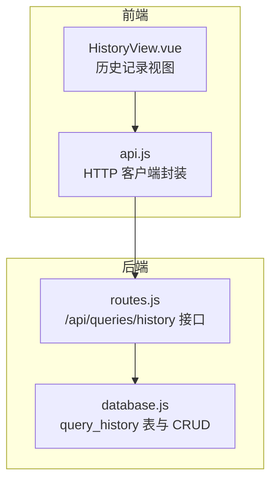
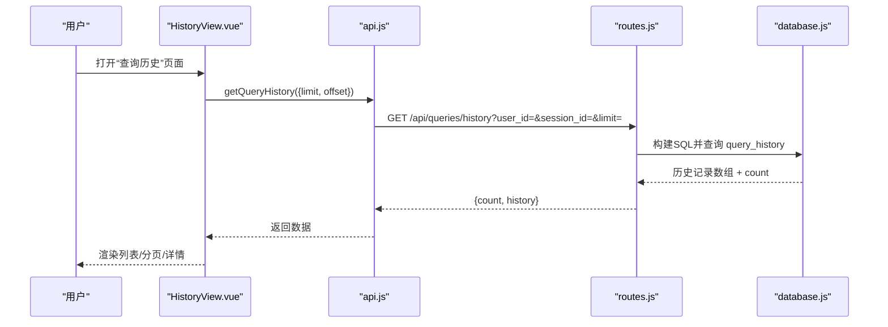
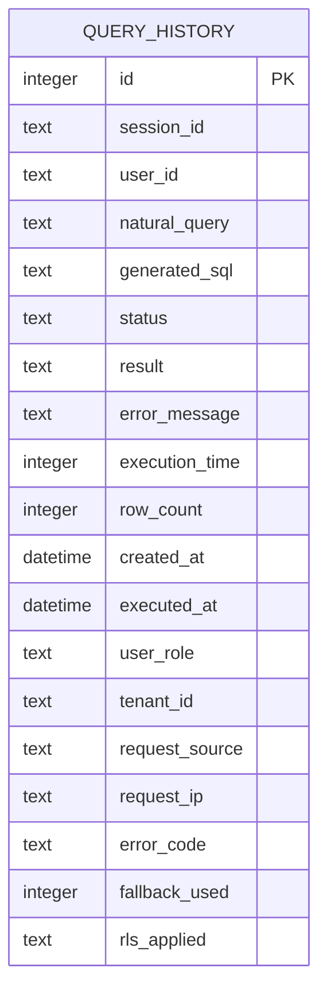
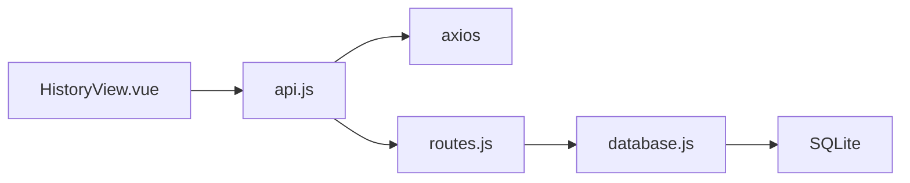

# 历史记录

<cite>
**本文引用的文件**
- [HistoryView.vue](file://frontend/src/views/HistoryView.vue)
- [api.js](file://frontend/src/utils/api.js)
- [routes.js](file://backend/src/core/routes.js)
- [database.js](file://backend/src/core/database.js)
- [test-query-history.js](file://backend/test/phase1/test-query-history.js)
- [test-auditMigration.js](file://backend/test/phase3/test-auditMigration.js)
</cite>

## 目录
1. [简介](#简介)
2. [项目结构](#项目结构)
3. [核心组件](#核心组件)
4. [架构总览](#架构总览)
5. [详细组件分析](#详细组件分析)
6. [依赖关系分析](#依赖关系分析)
7. [性能考虑](#性能考虑)
8. [故障排查指南](#故障排查指南)
9. [结论](#结论)
10. [附录](#附录)

## 简介
本文件面向 NL2SQL 历史记录组件，系统性阐述查询历史的管理与展示能力，覆盖历史列表、时间线展示、查询详情查看等核心特性；详解历史记录的数据结构与存储机制（本地缓存与服务器同步策略）、用户浏览与管理方式（搜索过滤、分页、批量操作、删除清理）、导出与分享机制及隐私保护措施，并提供性能优化与大数据量处理方案。

## 项目结构
前端采用 Vue 单文件组件，后端基于 Node.js + SQLite 的轻量架构。历史记录功能由前端视图组件负责交互与展示，后端路由与数据库模块负责数据持久化与检索。

图表来源
- [HistoryView.vue:1-441](file://frontend/src/views/HistoryView.vue#L1-L441)
- [api.js:1-320](file://frontend/src/utils/api.js#L1-L320)
- [routes.js:405-452](file://backend/src/core/routes.js#L405-L452)
- [database.js:94-150](file://backend/src/core/database.js#L94-L150)

章节来源
- [HistoryView.vue:1-441](file://frontend/src/views/HistoryView.vue#L1-L441)
- [api.js:1-320](file://frontend/src/utils/api.js#L1-L320)
- [routes.js:405-452](file://backend/src/core/routes.js#L405-L452)
- [database.js:94-150](file://backend/src/core/database.js#L94-L150)

## 核心组件
- 前端历史视图组件：提供历史列表、筛选、分页、详情弹窗、复制查询等交互。
- API 客户端：封装 axios，统一请求/响应拦截与错误处理。
- 后端路由：提供 /api/queries/history 接口，支持按用户、会话、limit 筛选。
- 数据库模块：维护 query_history 表结构与索引，提供创建、成功/失败标记等操作。

章节来源
- [HistoryView.vue:138-298](file://frontend/src/views/HistoryView.vue#L138-L298)
- [api.js:198-208](file://frontend/src/utils/api.js#L198-L208)
- [routes.js:405-452](file://backend/src/core/routes.js#L405-L452)
- [database.js:1038-1144](file://backend/src/core/database.js#L1038-L1144)

## 架构总览
历史记录的端到端流程如下：前端发起历史查询请求，后端根据筛选条件构建 SQL 并返回结果，前端渲染列表与详情。

图表来源
- [HistoryView.vue:226-243](file://frontend/src/views/HistoryView.vue#L226-L243)
- [api.js:206-208](file://frontend/src/utils/api.js#L206-L208)
- [routes.js:415-451](file://backend/src/core/routes.js#L415-L451)
- [database.js:1038-1144](file://backend/src/core/database.js#L1038-L1144)

## 详细组件分析

### 前端组件：HistoryView.vue
- 功能要点
  - 列表渲染：查询内容、时间、状态、执行信息（耗时/行数）。
  - 筛选：按查询内容（模糊）、状态（成功/失败）、日期范围。
  - 分页：支持切换每页条数与页码。
  - 详情弹窗：展示自然语言查询、生成 SQL、状态、错误信息、执行时间、行数、创建时间。
  - 操作：查看详情、复制查询。
- 数据流
  - 通过 api.getQueryHistory 获取分页数据，computed 进行本地筛选，再渲染列表。
  - 详情弹窗绑定当前选中项。
- 性能与体验
  - 骨架屏与空状态提示提升加载体验。
  - 本地筛选减少不必要的网络请求。

章节来源
- [HistoryView.vue:14-134](file://frontend/src/views/HistoryView.vue#L14-L134)
- [HistoryView.vue:187-217](file://frontend/src/views/HistoryView.vue#L187-L217)
- [HistoryView.vue:226-297](file://frontend/src/views/HistoryView.vue#L226-L297)

### API 客户端：api.js
- 功能要点
  - axios 实例封装，统一 base URL、超时、请求/响应拦截。
  - getQueryHistory 包装 /api/queries/history GET 请求。
- 错误处理
  - 响应拦截器统一处理 4xx/5xx、网络错误、请求配置错误。

章节来源
- [api.js:25-88](file://frontend/src/utils/api.js#L25-L88)
- [api.js:206-208](file://frontend/src/utils/api.js#L206-L208)

### 后端路由：routes.js
- /api/queries/history
  - 支持查询参数：user_id、session_id、limit。
  - 构造动态 SQL，按 created_at 降序返回历史记录与总数。
  - 异常统一返回 500 与错误信息。

章节来源
- [routes.js:405-452](file://backend/src/core/routes.js#L405-L452)

### 数据库：query_history 表与操作
- 表结构（关键字段）
  - 标识与归属：id、session_id、user_id。
  - 查询与结果：natural_query、generated_sql、status、result、error_message。
  - 执行统计：execution_time、row_count、created_at、executed_at。
  - 审计与安全：user_role、tenant_id、request_source、request_ip、error_code、fallback_used、rls_applied。
  - 外键：session_id 引用 sessions(id)，ON DELETE SET NULL。
- 索引
  - idx_query_history_user_id、idx_query_history_session_id、idx_query_history_created_at、idx_query_history_status。
  - tenant_id 索引在迁移过程中创建。
- 关键操作
  - createQueryHistory：创建记录并写入审计字段。
  - markQueryHistorySuccess：成功标记，写入生成 SQL、耗时、行数、结果摘要、RLS 信息、回退标记。
  - markQueryHistoryFailure：失败标记，写入错误信息、错误码、耗时、回退标记。
  - ensureQueryHistoryColumns：幂等迁移，补齐审计字段与索引。

章节来源
- [database.js:94-150](file://backend/src/core/database.js#L94-L150)
- [database.js:1038-1144](file://backend/src/core/database.js#L1038-L1144)
- [database.js:1390-1391](file://backend/src/core/database.js#L1390-L1391)
- [test-auditMigration.js:39-147](file://backend/test/phase3/test-auditMigration.js#L39-L147)
- [test-auditMigration.js:149-201](file://backend/test/phase3/test-auditMigration.js#L149-L201)

### 历史记录数据模型

图表来源
- [database.js:94-150](file://backend/src/core/database.js#L94-L150)

## 依赖关系分析
- 前端依赖
  - HistoryView.vue 依赖 api.js 进行数据获取。
  - api.js 依赖 axios 进行 HTTP 通信。
- 后端依赖
  - routes.js 依赖 database.js 进行数据访问。
  - database.js 依赖 SQLite 与 PRAGMA 索引管理。
- 外部依赖
  - Element Plus 组件库用于 UI 呈现与交互。
  - dayjs 用于时间格式化。

图表来源
- [HistoryView.vue:148-156](file://frontend/src/views/HistoryView.vue#L148-L156)
- [api.js:14-15](file://frontend/src/utils/api.js#L14-L15)
- [routes.js:415-451](file://backend/src/core/routes.js#L415-L451)
- [database.js:247-293](file://backend/src/core/database.js#L247-L293)

章节来源
- [HistoryView.vue:148-156](file://frontend/src/views/HistoryView.vue#L148-L156)
- [api.js:14-15](file://frontend/src/utils/api.js#L14-L15)
- [routes.js:415-451](file://backend/src/core/routes.js#L415-L451)
- [database.js:247-293](file://backend/src/core/database.js#L247-L293)

## 性能考虑
- 查询性能
  - 已建立多处索引：user_id、session_id、created_at、status，有助于按用户、按会话、按时间排序与筛选。
  - 排序与限制：按 created_at DESC 限制返回数量，避免全表扫描。
- 前端性能
  - 本地筛选与分页：减少网络往返，提升交互流畅度。
  - 骨架屏与空状态：改善长列表加载体验。
- 数据体积控制
  - result 字段仅写入可序列化的“结果摘要”，避免完整结果集导致存储膨胀。
  - 错误信息与结果均进行长度截断，防止超长文本影响性能。
- 大数据量处理
  - 建议：结合业务需求增加 tenant_id 索引（迁移脚本已验证），并考虑按租户维度分页与缓存。
  - 后端可引入游标分页或基于 created_at 的增量拉取策略，降低大偏移量场景的开销。

章节来源
- [database.js:142-150](file://backend/src/core/database.js#L142-L150)
- [database.js:1085-1140](file://backend/src/core/database.js#L1085-L1140)
- [test-auditMigration.js:113-116](file://backend/test/phase3/test-auditMigration.js#L113-L116)

## 故障排查指南
- 前端常见问题
  - 加载失败：检查 /api/queries/history 是否可达，确认响应拦截器错误处理逻辑。
  - 筛选无效：确认筛选参数传递与 computed 过滤逻辑。
- 后端常见问题
  - SQL 报错：核对动态拼接 SQL 的 where 条件与 limit 参数。
  - 数据库连接：确认 SQLite 文件路径与权限，foreign_keys 是否启用。
- 测试验证
  - 单测覆盖成功/失败状态写入与字段完整性，可作为回归验证基线。
  - 审计迁移单测验证新增审计字段与索引的幂等性。

章节来源
- [api.js:67-88](file://frontend/src/utils/api.js#L67-L88)
- [routes.js:415-451](file://backend/src/core/routes.js#L415-L451)
- [database.js:275-282](file://backend/src/core/database.js#L275-L282)
- [test-query-history.js:23-76](file://backend/test/phase1/test-query-history.js#L23-L76)
- [test-auditMigration.js:89-125](file://backend/test/phase3/test-auditMigration.js#L89-L125)

## 结论
历史记录组件在前端提供了直观的列表与详情展示，在后端通过 SQLite 与索引保障了查询效率。通过审计字段与迁移机制，系统具备良好的扩展性与兼容性。建议在生产环境中结合租户维度与增量拉取策略进一步优化大数据量场景下的性能与稳定性。

## 附录

### 历史记录数据结构与存储机制
- 表结构与字段含义见“数据模型”与“数据库：query_history 表与操作”章节。
- 审计字段（user_role、tenant_id、request_source、request_ip、error_code、fallback_used、rls_applied）用于合规与可观测性，迁移脚本确保历史数据的兼容性。

章节来源
- [database.js:94-150](file://backend/src/core/database.js#L94-L150)
- [test-auditMigration.js:93-116](file://backend/test/phase3/test-auditMigration.js#L93-L116)

### 用户浏览与管理
- 浏览：分页加载、时间线展示（按创建时间倒序）。
- 筛选：按查询内容、状态、日期范围进行本地筛选。
- 操作：查看详情、复制查询。
- 批量与删除：当前实现未包含批量删除与清空功能，如需扩展可在后端新增批量接口并在前端补充选择与确认流程。

章节来源
- [HistoryView.vue:14-87](file://frontend/src/views/HistoryView.vue#L14-L87)
- [HistoryView.vue:187-297](file://frontend/src/views/HistoryView.vue#L187-L297)

### 导出与分享机制
- 当前实现未包含导出与分享功能。若需要，可在前端增加导出按钮，后端提供 CSV/JSON 导出接口，并在导出前进行脱敏处理（如隐藏敏感字段、对结果进行采样）。

章节来源
- [HistoryView.vue:68-73](file://frontend/src/views/HistoryView.vue#L68-L73)

### 隐私保护措施
- 审计字段：记录请求来源、IP、租户等信息，便于审计与合规。
- 数据截断：错误信息与结果摘要进行长度限制，避免敏感数据泄露。
- 建议：对导出数据进行脱敏与最小化授权，遵循最小可用原则。

章节来源
- [database.js:1085-1140](file://backend/src/core/database.js#L1085-L1140)
- [test-auditMigration.js:149-201](file://backend/test/phase3/test-auditMigration.js#L149-L201)