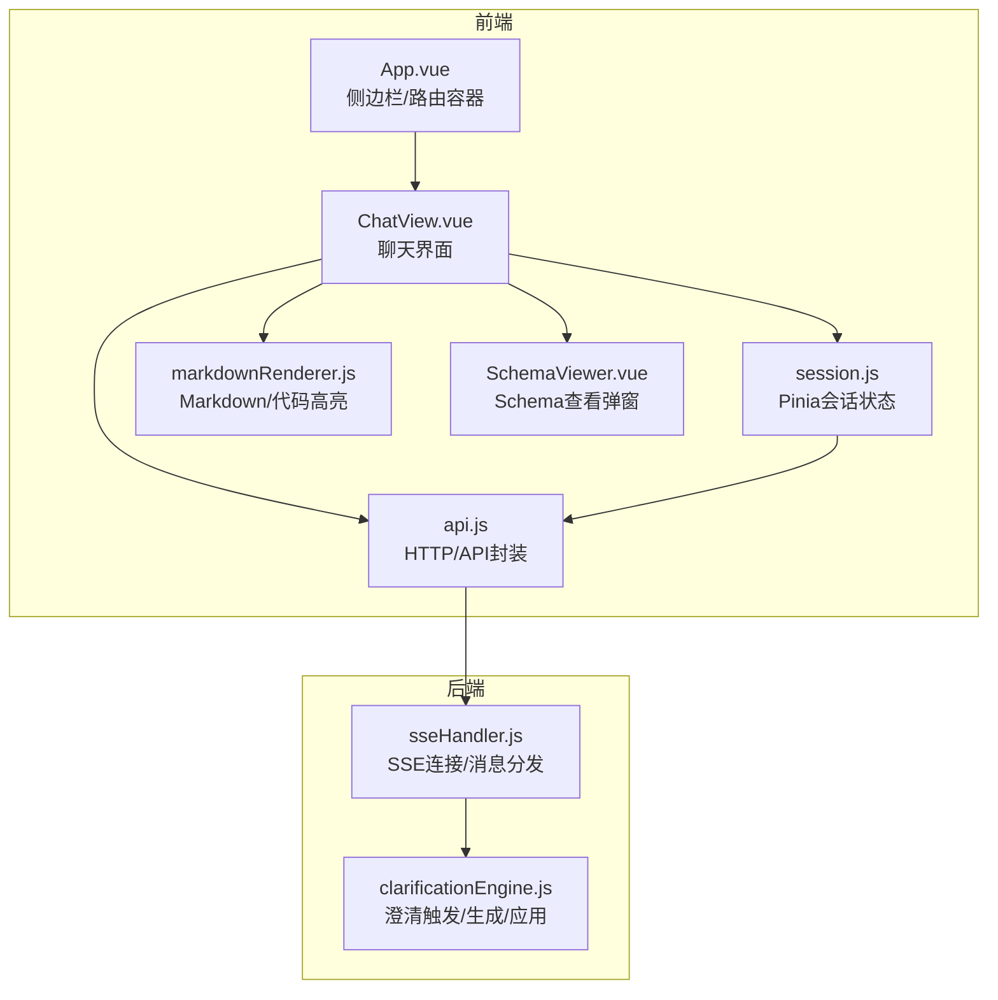
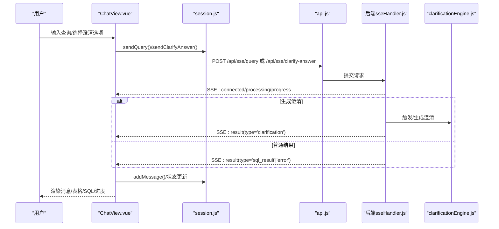
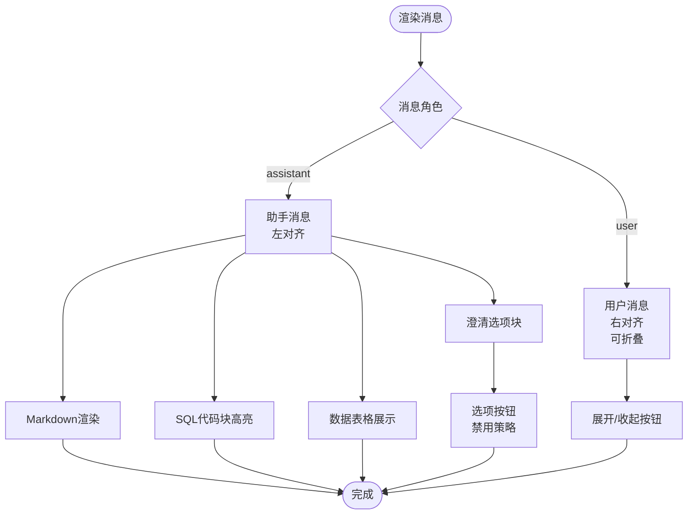
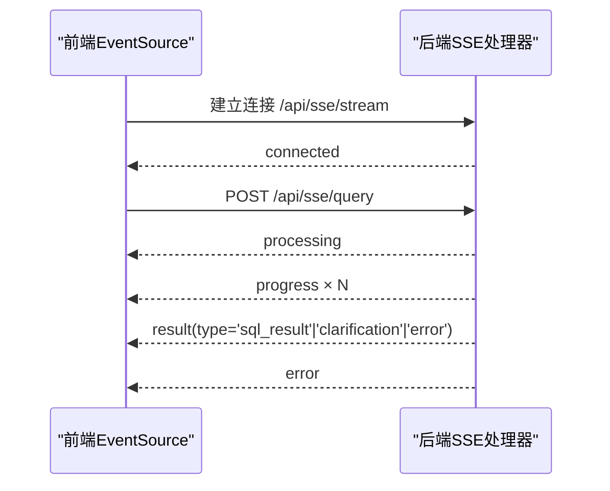
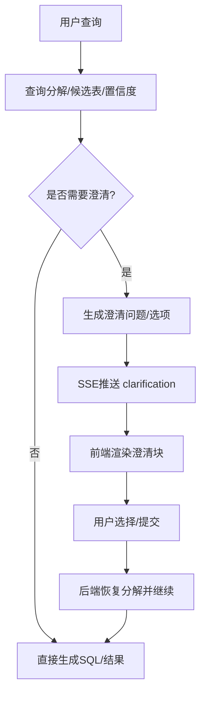
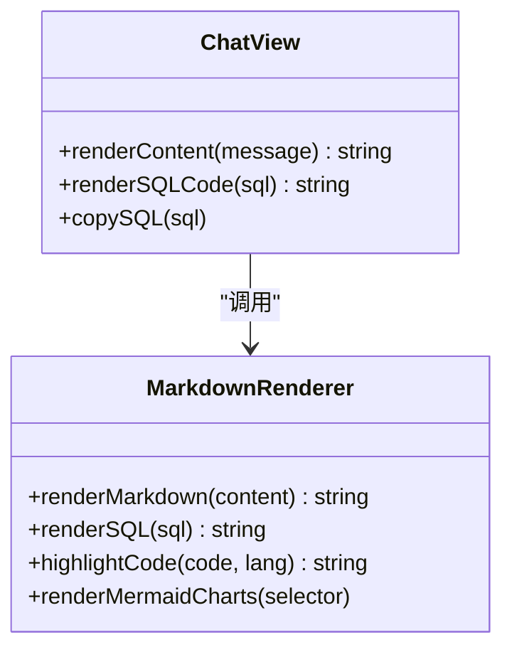
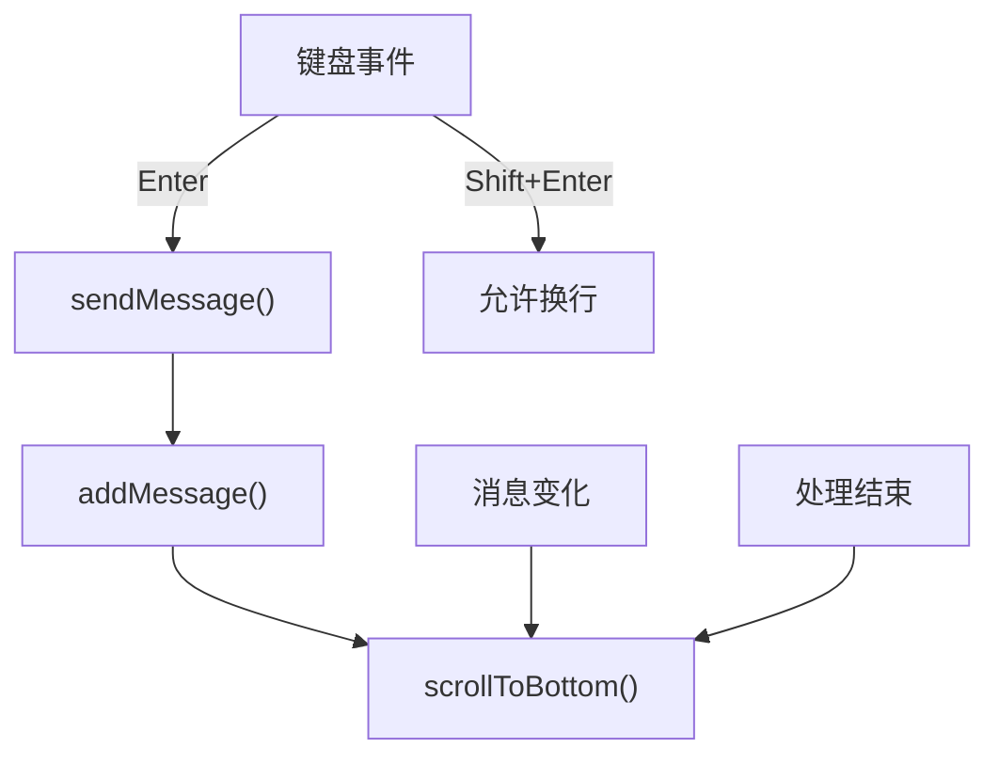
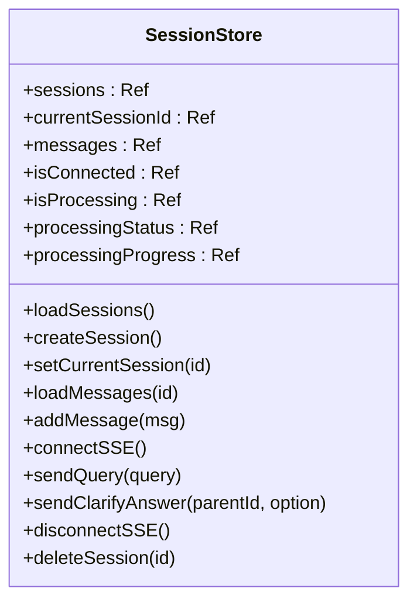
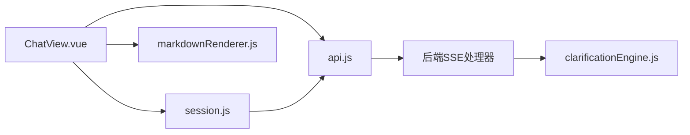

# 聊天界面

<cite>
**本文引用的文件**
- [ChatView.vue](file://frontend/src/views/ChatView.vue)
- [session.js](file://frontend/src/stores/session.js)
- [markdownRenderer.js](file://frontend/src/utils/markdownRenderer.js)
- [api.js](file://frontend/src/utils/api.js)
- [sseHandler.js](file://backend/src/core/sseHandler.js)
- [clarificationEngine.js](file://backend/src/core/clarificationEngine.js)
- [App.vue](file://frontend/src/App.vue)
- [main.js](file://frontend/src/main.js)
- [SchemaViewer.vue](file://frontend/src/components/SchemaViewer.vue)
</cite>

## 目录
1. [简介](#简介)
2. [项目结构](#项目结构)
3. [核心组件](#核心组件)
4. [架构总览](#架构总览)
5. [详细组件分析](#详细组件分析)
6. [依赖分析](#依赖分析)
7. [性能考虑](#性能考虑)
8. [故障排查指南](#故障排查指南)
9. [结论](#结论)
10. [附录](#附录)

## 简介
本文件面向 NL2SQL 聊天界面组件，系统性梳理其功能实现与架构设计，重点覆盖：
- 消息列表渲染与用户/助手消息差异化展示
- Markdown 内容渲染、SQL 代码高亮、数据表格展示
- SSE 流式通信处理与后端澄清机制对接
- 消息折叠、自动滚动、键盘快捷键等体验优化
- 状态管理策略、事件处理与错误处理方案

## 项目结构
前端采用 Vue3 + Pinia + Element Plus 架构，聊天界面位于 views 层，状态管理集中于 stores，工具函数封装在 utils，组件化拆分清晰。

**图表来源**
- [App.vue:1-83](file://frontend/src/App.vue#L1-L83)
- [ChatView.vue:1-149](file://frontend/src/views/ChatView.vue#L1-L149)
- [session.js:1-443](file://frontend/src/stores/session.js#L1-L443)
- [api.js:1-320](file://frontend/src/utils/api.js#L1-L320)
- [markdownRenderer.js:1-258](file://frontend/src/utils/markdownRenderer.js#L1-L258)
- [SchemaViewer.vue:1-317](file://frontend/src/components/SchemaViewer.vue#L1-L317)
- [sseHandler.js:1-688](file://backend/src/core/sseHandler.js#L1-L688)
- [clarificationEngine.js:1-559](file://backend/src/core/clarificationEngine.js#L1-L559)

**章节来源**
- [main.js:1-89](file://frontend/src/main.js#L1-L89)
- [App.vue:1-384](file://frontend/src/App.vue#L1-L384)

## 核心组件
- ChatView.vue：聊天界面主体，负责消息渲染、SSE 交互、澄清选项处理、折叠/滚动/快捷键等。
- session.js：Pinia Store，维护会话列表、当前会话、消息历史、SSE 连接与处理状态。
- markdownRenderer.js：Markdown 渲染、Mermaid 图表、KaTeX 数学公式、SQL/Shiki 代码高亮。
- api.js：Axios 封装，提供会话、Schema、SSE 查询与澄清回答等 API。
- sseHandler.js：后端 SSE 处理器，负责连接管理、进度/结果/错误事件推送、澄清回答恢复。
- clarificationEngine.js：澄清引擎，触发条件判断、问题生成、用户回答应用。

**章节来源**
- [ChatView.vue:151-420](file://frontend/src/views/ChatView.vue#L151-L420)
- [session.js:33-442](file://frontend/src/stores/session.js#L33-L442)
- [markdownRenderer.js:1-258](file://frontend/src/utils/markdownRenderer.js#L1-L258)
- [api.js:1-320](file://frontend/src/utils/api.js#L1-L320)
- [sseHandler.js:1-688](file://backend/src/core/sseHandler.js#L1-L688)
- [clarificationEngine.js:1-559](file://backend/src/core/clarificationEngine.js#L1-L559)

## 架构总览
前后端通过 SSE 实现流式通信，前端通过 HTTP POST 提交查询，后端通过 SSE 推送 processing/progress/result/error 等事件。澄清机制通过“澄清消息 + 选项 + 父消息ID”闭环，后端在澄清问题生成与恢复阶段利用澄清引擎与数据库消息持久化。

**图表来源**
- [ChatView.vue:214-372](file://frontend/src/views/ChatView.vue#L214-L372)
- [session.js:310-372](file://frontend/src/stores/session.js#L310-L372)
- [api.js:246-268](file://frontend/src/utils/api.js#L246-L268)
- [sseHandler.js:258-410](file://backend/src/core/sseHandler.js#L258-L410)
- [clarificationEngine.js:196-272](file://backend/src/core/clarificationEngine.js#L196-L272)

## 详细组件分析

### 消息列表渲染与差异化展示
- 用户消息：右对齐，内容可折叠，长文本显示“展开/收起”按钮，折叠态使用渐隐遮罩。
- 助手消息：左对齐，支持 Markdown 渲染、SQL 代码块高亮、数据表格展示、澄清选项块。
- 澄清选项：当消息类型为 clarification 时，显示解释语句与一组可选按钮，按钮禁用策略防止重复提交。
- 处理状态指示器：显示打字动画或进度条，结合后端 processing/progress 事件。

**图表来源**
- [ChatView.vue:17-96](file://frontend/src/views/ChatView.vue#L17-L96)
- [markdownRenderer.js:181-220](file://frontend/src/utils/markdownRenderer.js#L181-L220)

**章节来源**
- [ChatView.vue:17-119](file://frontend/src/views/ChatView.vue#L17-L119)

### SSE 流式通信处理
- 前端：通过 EventSource 建立 /api/sse/stream?session_id=... 连接，监听 onmessage/onerror/onopen，解析 JSON 数据，分发到 store 的 handleSSEMessage。
- 后端：连接建立后广播 connected；处理查询时广播 processing/progress；最终广播 result 或 error；支持多标签页连接映射与广播。
- 事件类型与负载：
  - connected：连接成功
  - processing：开始处理
  - progress：进度更新（含 message/stage/progress）
  - result：结果（type 可为 clarification/sql_result/error；metadata 包含 sql/data/explanation 等）
  - error：错误消息

**图表来源**
- [session.js:185-221](file://frontend/src/stores/session.js#L185-L221)
- [sseHandler.js:49-120](file://backend/src/core/sseHandler.js#L49-L120)
- [sseHandler.js:324-410](file://backend/src/core/sseHandler.js#L324-L410)

**章节来源**
- [session.js:185-304](file://frontend/src/stores/session.js#L185-L304)
- [sseHandler.js:258-410](file://backend/src/core/sseHandler.js#L258-L410)

### 澄清机制实现原理
- 触发条件：后端根据查询分解、候选表与置信度，判定是否需要澄清，选择最高优先级触发器。
- 生成澄清：基于触发器构建 Prompt，调用 LLM 生成问题、选项与默认推荐，并附解释说明。
- 前端呈现：当 result.type='clarification' 时，渲染澄清块，包含解释语句与选项按钮。
- 回答处理：前端将用户选择通过 sendClarifyAnswer(parent_message_id, option) 提交，后端据此恢复分解并继续生成，避免脱离原始需求。
- 兼容降级：若父消息缺失或 metadata 不完整，后端自动降级为普通查询处理。

**图表来源**
- [clarificationEngine.js:196-272](file://backend/src/core/clarificationEngine.js#L196-L272)
- [clarificationEngine.js:388-428](file://backend/src/core/clarificationEngine.js#L388-L428)
- [ChatView.vue:315-329](file://frontend/src/views/ChatView.vue#L315-L329)
- [session.js:349-372](file://frontend/src/stores/session.js#L349-L372)
- [sseHandler.js:511-615](file://backend/src/core/sseHandler.js#L511-L615)

**章节来源**
- [clarificationEngine.js:196-428](file://backend/src/core/clarificationEngine.js#L196-L428)
- [ChatView.vue:77-94](file://frontend/src/views/ChatView.vue#L77-L94)
- [session.js:255-287](file://frontend/src/stores/session.js#L255-L287)

### Markdown 渲染、SQL 高亮与数据表格
- Markdown 渲染：使用 markdown-it，支持链接、换行、高亮回调；对 mermaid/math 特殊处理；渲染完成后异步运行 mermaid。
- SQL 高亮：使用 Shiki，异步初始化，失败时回退简单高亮；支持复制 SQL。
- 数据表格：根据 metadata.data.rows/columns 渲染 Element Plus 表格，支持列宽与溢出提示。
- 数学公式：支持行内 $...$ 与块级 $$...$$，使用 KaTeX 渲染。

**图表来源**
- [markdownRenderer.js:181-246](file://frontend/src/utils/markdownRenderer.js#L181-L246)
- [ChatView.vue:286-313](file://frontend/src/views/ChatView.vue#L286-L313)

**章节来源**
- [markdownRenderer.js:1-258](file://frontend/src/utils/markdownRenderer.js#L1-L258)
- [ChatView.vue:41-75](file://frontend/src/views/ChatView.vue#L41-L75)

### 消息折叠、自动滚动与键盘快捷键
- 消息折叠：超过阈值长度的用户消息可折叠，点击按钮切换展开/收起，使用 Set 记录展开状态。
- 自动滚动：组件挂载、消息变化、处理状态结束时均触发滚动到底部，保证用户看到最新消息。
- 快捷键：Enter 发送，Shift+Enter 换行；输入框禁用时阻止默认行为。

**图表来源**
- [ChatView.vue:241-250](file://frontend/src/views/ChatView.vue#L241-L250)
- [ChatView.vue:334-341](file://frontend/src/views/ChatView.vue#L334-L341)
- [ChatView.vue:407-419](file://frontend/src/views/ChatView.vue#L407-L419)

**章节来源**
- [ChatView.vue:257-280](file://frontend/src/views/ChatView.vue#L257-L280)
- [ChatView.vue:334-341](file://frontend/src/views/ChatView.vue#L334-L341)

### 状态管理策略与事件处理
- Pinia Store：
  - State：sessions/currentSessionId/messages/sseConnection/isConnected/isProcessing/processingStatus/processingProgress
  - Getters：currentSession/messageCount
  - Actions：loadSessions/createSession/setCurrentSession/loadMessages/addMessage/connectSSE/sendQuery/sendClarifyAnswer/disconnectSSE/deleteSession
- 事件处理：
  - SSE 连接建立后，store 维护 isConnected；onmessage 解析后调用 handleSSEMessage 分发不同类型事件。
  - sendQuery/sendClarifyAnswer 前端本地插入用户消息，提升交互连贯性。
  - 错误处理：捕获 HTTP/SSE 错误，插入 error 类型消息并重置处理状态。

**图表来源**
- [session.js:33-442](file://frontend/src/stores/session.js#L33-L442)

**章节来源**
- [session.js:33-442](file://frontend/src/stores/session.js#L33-L442)

### 错误处理方案
- 前端：
  - Axios 响应拦截统一处理 4xx/5xx 与网络错误，返回标准化错误对象。
  - SSE 连接失败/断开：记录日志，isConnected=false；onerror 时断开连接。
  - 处理失败：isProcessing=false，插入 error 消息。
- 后端：
  - SSE 连接校验、查询互斥锁、澄清父消息校验；异常时广播 error 事件并清理状态。

**章节来源**
- [api.js:67-88](file://frontend/src/utils/api.js#L67-L88)
- [session.js:194-221](file://frontend/src/stores/session.js#L194-L221)
- [session.js:309-339](file://frontend/src/stores/session.js#L309-L339)
- [sseHandler.js:258-410](file://backend/src/core/sseHandler.js#L258-L410)

## 依赖分析
- 组件耦合：
  - ChatView 依赖 session.js（状态）、api.js（HTTP）、markdownRenderer.js（渲染）。
  - session.js 依赖 api.js（HTTP）、后端 SSE。
  - 后端 sseHandler.js 依赖 clarificationEngine.js（澄清逻辑）。
- 外部依赖：
  - Element Plus（UI）、markdown-it/Shiki/Mermaid/KaTeX（渲染）、Axios（HTTP）、Pinia（状态）。

**图表来源**
- [ChatView.vue:169-171](file://frontend/src/views/ChatView.vue#L169-L171)
- [session.js:22-22](file://frontend/src/stores/session.js#L22-L22)
- [api.js:14-15](file://frontend/src/utils/api.js#L14-L15)
- [sseHandler.js:19-26](file://backend/src/core/sseHandler.js#L19-L26)
- [clarificationEngine.js:14-15](file://backend/src/core/clarificationEngine.js#L14-L15)

**章节来源**
- [ChatView.vue:160-171](file://frontend/src/views/ChatView.vue#L160-L171)
- [session.js:15-22](file://frontend/src/stores/session.js#L15-L22)
- [api.js:14-34](file://frontend/src/utils/api.js#L14-L34)
- [sseHandler.js:19-26](file://backend/src/core/sseHandler.js#L19-L26)

## 性能考虑
- 渲染性能：
  - 长文本折叠减少 DOM 高度，避免大段内容导致重排。
  - Markdown 渲染与 Mermaid 异步执行，避免阻塞主线程。
- 通信性能：
  - SSE 无缓冲推送，降低延迟；后端连接映射支持多标签页。
  - 前端 watch 深度监听仅在消息数组变化时触发滚动，避免频繁重绘。
- 资源加载：
  - Shiki 按需初始化，失败回退，保证可用性。

[本节为通用建议，无需特定文件引用]

## 故障排查指南
- 无法接收 SSE：
  - 检查 /api/sse/stream 是否返回 connected；确认 sessionId 有效。
  - 查看浏览器 Network 面板 SSE 连接状态与 onerror。
- 澄清无效或重复：
  - 确认前端已正确传递 parent_message_id；后端需存在完整 metadata 的父澄清消息。
  - 检查 sendClarifyAnswer 是否被禁用（isProcessing 或已回答）。
- 渲染异常：
  - Markdown/SQL/表格渲染失败时，检查后端 result.payload 结构与字段完整性。
  - 确保 Shiki 初始化成功，必要时刷新页面重试。
- 键盘快捷键无效：
  - 确认输入框处于焦点；Shift+Enter 为换行，Enter 为发送。

**章节来源**
- [session.js:185-221](file://frontend/src/stores/session.js#L185-L221)
- [ChatView.vue:315-329](file://frontend/src/views/ChatView.vue#L315-L329)
- [markdownRenderer.js:203-220](file://frontend/src/utils/markdownRenderer.js#L203-L220)

## 结论
该聊天界面通过清晰的组件职责划分与 Pinia 状态管理，实现了稳定的消息渲染、SSE 流式交互与后端澄清机制的无缝衔接。前端在用户体验层面提供了折叠、滚动、快捷键等优化，后端在澄清与错误处理方面具备完善的降级与广播能力。整体架构具备良好的扩展性与可维护性。

[本节为总结，无需特定文件引用]

## 附录
- 交互流程参考：发送查询/澄清回答的端到端时序图已在“架构总览”与“详细组件分析”中给出。
- 代码片段路径示例（不展示具体代码内容）：
  - [ChatView.vue: 消息渲染与事件绑定:17-149](file://frontend/src/views/ChatView.vue#L17-L149)
  - [session.js: SSE 连接与消息分发:185-304](file://frontend/src/stores/session.js#L185-L304)
  - [api.js: SSE 查询与澄清回答接口:246-268](file://frontend/src/utils/api.js#L246-L268)
  - [markdownRenderer.js: Markdown/SQL/表格渲染:181-246](file://frontend/src/utils/markdownRenderer.js#L181-L246)
  - [sseHandler.js: 后端SSE处理与澄清恢复:258-615](file://backend/src/core/sseHandler.js#L258-L615)
  - [clarificationEngine.js: 澄清触发/生成/应用:196-428](file://backend/src/core/clarificationEngine.js#L196-L428)