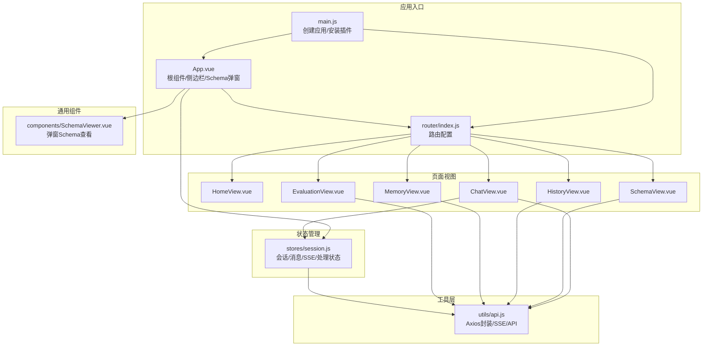
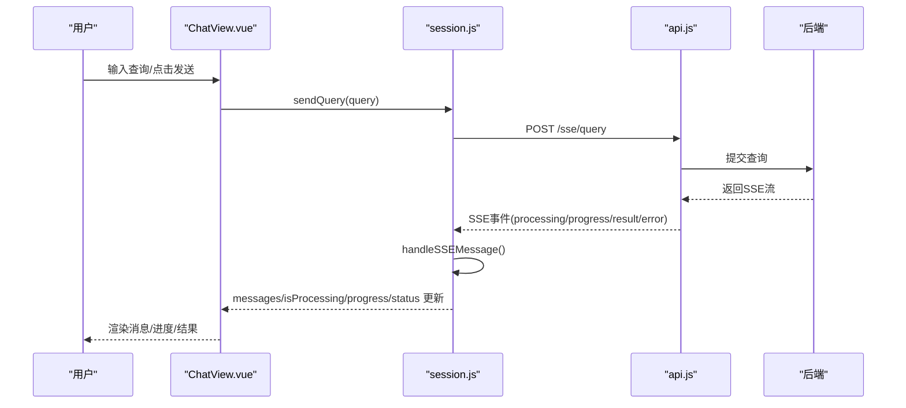
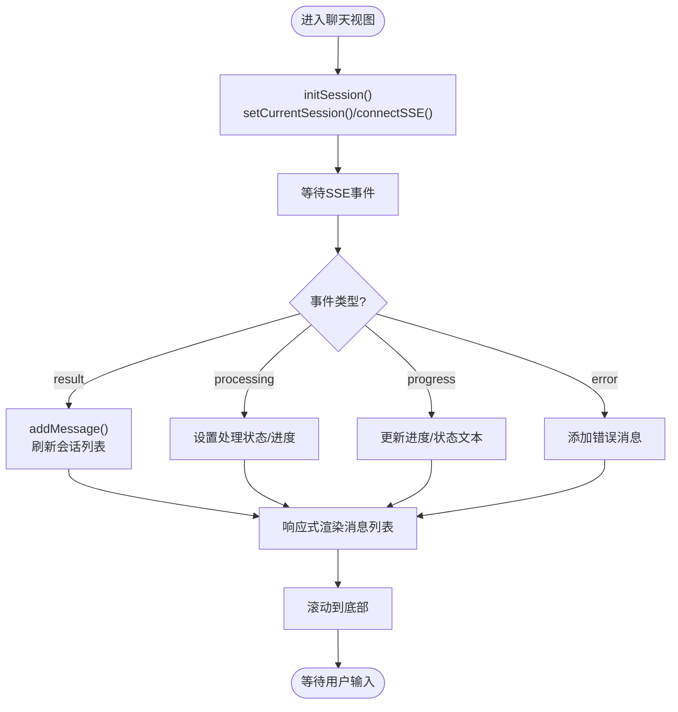
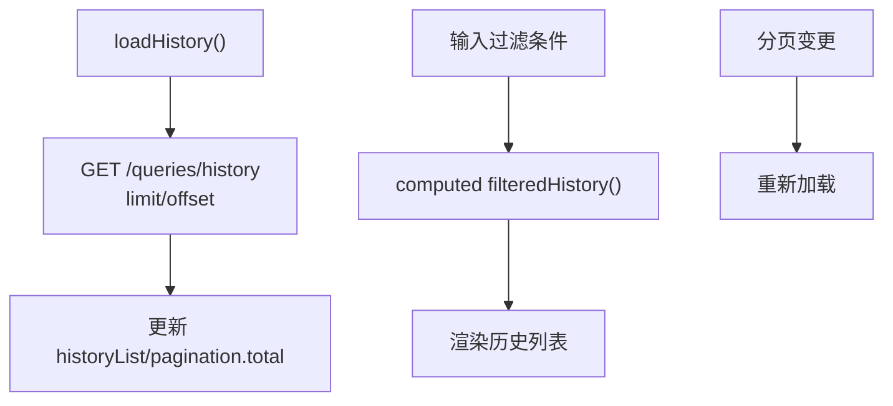
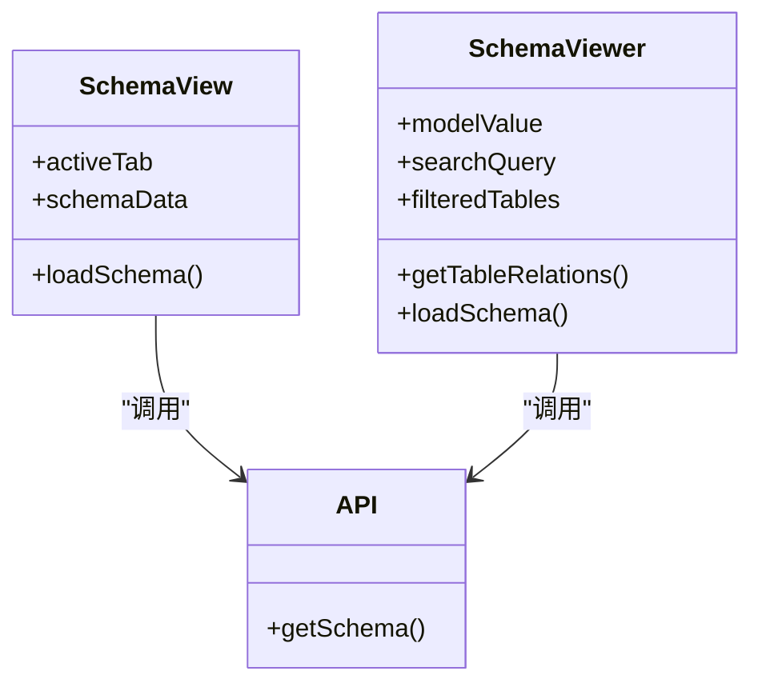
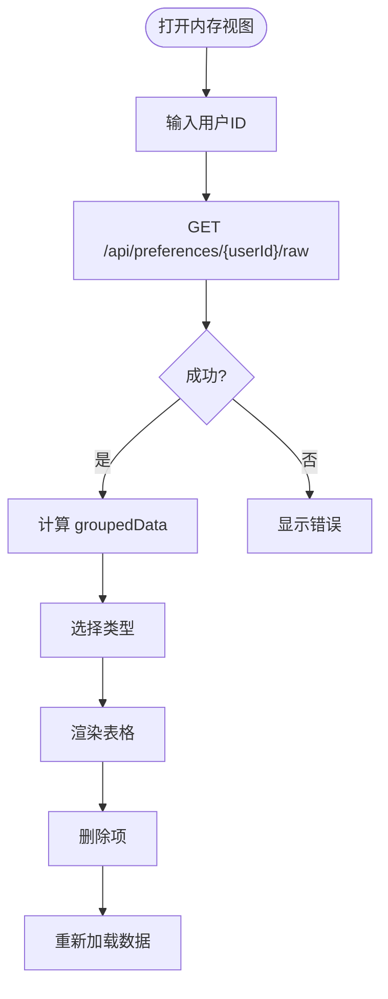
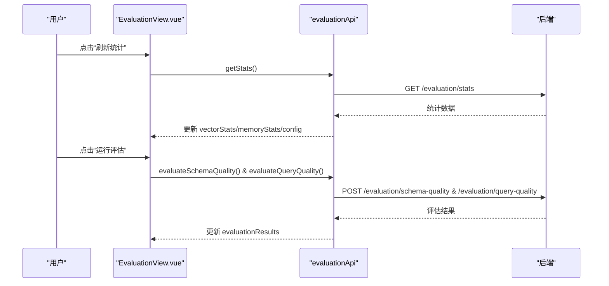
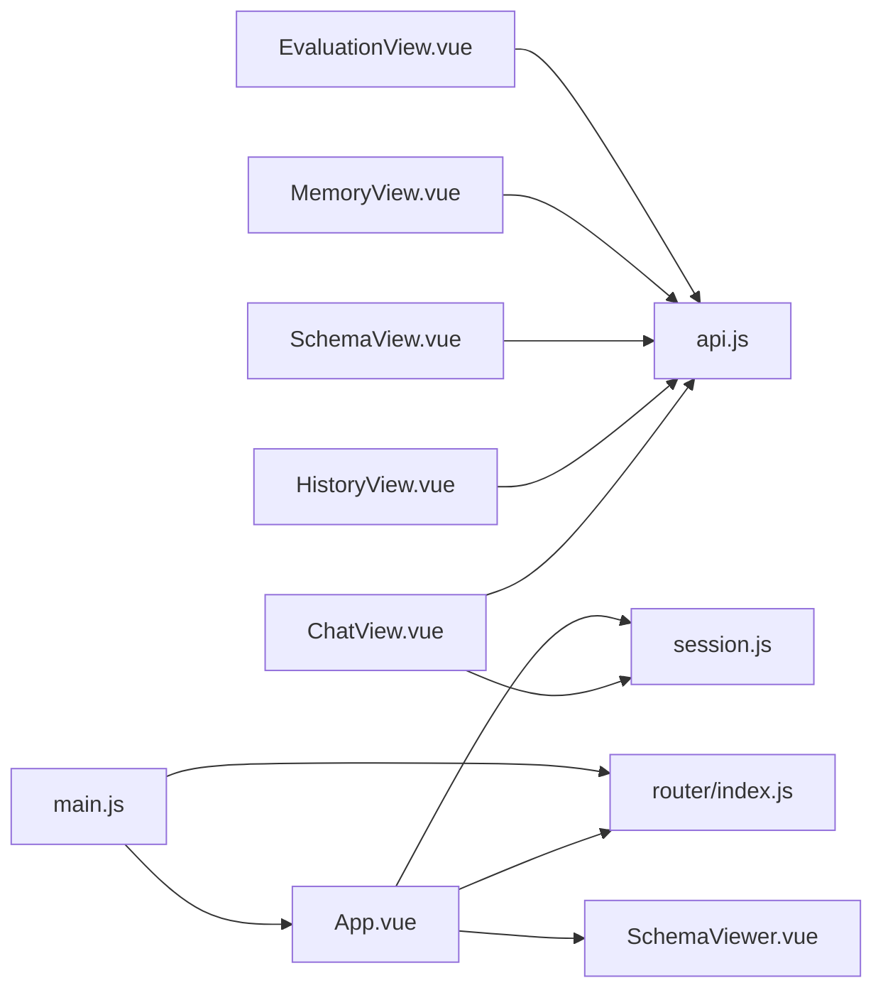

# 视图组件

<cite>
**本文档引用的文件**
- [ChatView.vue](file://frontend/src/views/ChatView.vue)
- [HistoryView.vue](file://frontend/src/views/HistoryView.vue)
- [MemoryView.vue](file://frontend/src/views/MemoryView.vue)
- [EvaluationView.vue](file://frontend/src/views/EvaluationView.vue)
- [SchemaView.vue](file://frontend/src/views/SchemaView.vue)
- [HomeView.vue](file://frontend/src/views/HomeView.vue)
- [session.js](file://frontend/src/stores/session.js)
- [api.js](file://frontend/src/utils/api.js)
- [SchemaViewer.vue](file://frontend/src/components/SchemaViewer.vue)
- [router/index.js](file://frontend/src/router/index.js)
- [App.vue](file://frontend/src/App.vue)
- [main.js](file://frontend/src/main.js)
</cite>

## 目录
1. [简介](#简介)
2. [项目结构](#项目结构)
3. [核心组件](#核心组件)
4. [架构总览](#架构总览)
5. [详细组件分析](#详细组件分析)
6. [依赖关系分析](#依赖关系分析)
7. [性能考量](#性能考量)
8. [故障排查指南](#故障排查指南)
9. [结论](#结论)
10. [附录](#附录)

## 简介
本文件面向 NL2SQL 前端视图组件，系统性梳理聊天界面、Schema 查看、历史记录、内存管理、评估统计等页面的设计理念与实现逻辑。重点阐述：
- 各视图组件的状态管理、数据绑定与事件处理机制
- 组件间通信方式（父子、兄弟、跨层级）
- 数据流与 SSE 推送机制
- 可复用策略与扩展建议

## 项目结构
前端采用 Vue3 + Composition API + Pinia + Element Plus + Vue Router 的技术栈。根组件负责侧边栏与主内容区布局；路由定义页面级视图；状态管理集中于 Pinia Store；API 服务封装 HTTP 与 SSE 交互。

**图表来源**
- [main.js:1-89](file://frontend/src/main.js#L1-L89)
- [router/index.js:1-157](file://frontend/src/router/index.js#L1-L157)
- [App.vue:1-384](file://frontend/src/App.vue#L1-L384)
- [session.js:1-443](file://frontend/src/stores/session.js#L1-L443)
- [api.js:1-320](file://frontend/src/utils/api.js#L1-L320)

**章节来源**
- [main.js:1-89](file://frontend/src/main.js#L1-L89)
- [router/index.js:1-157](file://frontend/src/router/index.js#L1-L157)
- [App.vue:1-384](file://frontend/src/App.vue#L1-L384)

## 核心组件
- 聊天视图：支持自然语言查询、SSE 实时流式响应、澄清选项、长内容折叠、SQL 复制与结果表格展示。
- 历史视图：查询历史列表、筛选、分页、详情弹窗、复制查询。
- Schema 视图：按标签页展示表结构、指标、维度、表关系，支持统计信息。
- 内存视图：长期记忆数据的统计卡片、类型筛选、表格展示、原始 JSON 查看与删除。
- 评估视图：运行时统计概览、向量检索距离分布、记忆类型命中率、Schema/查询质量评估。
- 首页视图：快速开始、功能特性、使用示例。
- 根组件：侧边栏会话列表、Schema 弹窗、页面跳转与会话管理。

**章节来源**
- [ChatView.vue:1-835](file://frontend/src/views/ChatView.vue#L1-L835)
- [HistoryView.vue:1-441](file://frontend/src/views/HistoryView.vue#L1-L441)
- [SchemaView.vue:1-322](file://frontend/src/views/SchemaView.vue#L1-L322)
- [MemoryView.vue:1-511](file://frontend/src/views/MemoryView.vue#L1-L511)
- [EvaluationView.vue:1-699](file://frontend/src/views/EvaluationView.vue#L1-L699)
- [HomeView.vue:1-318](file://frontend/src/views/HomeView.vue#L1-L318)
- [App.vue:1-384](file://frontend/src/App.vue#L1-L384)

## 架构总览
视图组件围绕“状态驱动 + 事件驱动”的模式组织：
- 状态驱动：Pinia Store 统一管理会话、消息、SSE 连接与处理状态。
- 事件驱动：用户交互触发 Store Action，Store 通过 API 与后端通信，SSE 推送实时消息，Store 更新状态，视图响应式渲染。
- 组件通信：根组件通过 props/v-model 与弹窗组件通信；路由驱动页面切换；Store 作为跨层级共享状态中心。

**图表来源**
- [ChatView.vue:217-235](file://frontend/src/views/ChatView.vue#L217-L235)
- [session.js:310-339](file://frontend/src/stores/session.js#L310-L339)
- [api.js:246-251](file://frontend/src/utils/api.js#L246-L251)
- [session.js:227-304](file://frontend/src/stores/session.js#L227-L304)

## 详细组件分析

### 聊天视图（ChatView）
- 设计理念：以消息为中心的对话式体验，支持澄清流程、长内容折叠、SQL 高亮与复制、结果表格展示。
- 状态管理：
  - 通过 computed 从 Store 读取 messages、isProcessing、processingStatus、processingProgress。
  - 本地维护 expandedMessages、answeredClarifications 集合，避免重复点击。
- 数据绑定与事件：
  - 输入框双向绑定 inputMessage；键盘事件处理 Enter/Shift+Enter。
  - 滚动到底部：mounted/watch 监听消息变化与处理状态变化。
  - 澄清选项：answerClarification 根据 message.id 调用 sendClarifyAnswer 或回退 sendQuery。
- SSE 交互：
  - initSession 时根据路由 sessionId 设置当前会话并 connectSSE。
  - onUnmounted 断开连接，避免资源泄漏。
- 复杂度与性能：
  - 消息列表渲染使用 v-for，长内容折叠通过 Set 维护展开状态，避免不必要的重渲染。
  - Markdown/SQL 渲染通过外部工具函数，减少模板复杂度。

**图表来源**
- [ChatView.vue:370-382](file://frontend/src/views/ChatView.vue#L370-L382)
- [session.js:185-221](file://frontend/src/stores/session.js#L185-L221)
- [session.js:227-304](file://frontend/src/stores/session.js#L227-L304)

**章节来源**
- [ChatView.vue:1-835](file://frontend/src/views/ChatView.vue#L1-L835)
- [session.js:1-443](file://frontend/src/stores/session.js#L1-L443)

### 历史视图（HistoryView）
- 设计理念：提供查询历史的检索、筛选、分页与详情查看，便于审计与复用。
- 状态管理：
  - loading、historyList、filter、pagination、detailVisible、selectedItem。
- 数据绑定与事件：
  - 过滤：query/status/dateRange 三条件联动过滤。
  - 分页：size-change/current-change 触发重新加载。
  - 详情：viewDetail 打开弹窗，copyQuery 复制查询内容。
- 性能与可用性：
  - Skeleton/Empty 状态提升加载体验。
  - 日期范围使用 dayjs 精确到日边界。

**图表来源**
- [HistoryView.vue:226-243](file://frontend/src/views/HistoryView.vue#L226-L243)
- [HistoryView.vue:190-217](file://frontend/src/views/HistoryView.vue#L190-L217)

**章节来源**
- [HistoryView.vue:1-441](file://frontend/src/views/HistoryView.vue#L1-L441)
- [api.js:206-208](file://frontend/src/utils/api.js#L206-L208)

### Schema 视图（SchemaView）与 Schema 弹窗（SchemaViewer）
- 设计理念：以标签页形式呈现表结构、指标、维度、关系，支持统计信息与滚动浏览。
- 共享数据源：
  - 二者均通过 api.getSchema() 获取统一数据结构（tables/relationships/metrics/dimensions）。
- 交互差异：
  - SchemaView 为独立页面，适合深度浏览。
  - SchemaViewer 为弹窗组件，支持搜索、折叠、关联关系展示，适合嵌入式使用。
- 状态与事件：
  - SchemaViewer 通过 v-model 控制显示/隐藏，首次打开时加载数据。
  - 过滤：搜索关键词在表名/中文名/描述/字段名中匹配。

**图表来源**
- [SchemaView.vue:168-192](file://frontend/src/views/SchemaView.vue#L168-L192)
- [SchemaViewer.vue:129-133](file://frontend/src/components/SchemaViewer.vue#L129-L133)
- [SchemaViewer.vue:157-182](file://frontend/src/components/SchemaViewer.vue#L157-L182)
- [api.js:118-120](file://frontend/src/utils/api.js#L118-L120)

**章节来源**
- [SchemaView.vue:1-322](file://frontend/src/views/SchemaView.vue#L1-L322)
- [SchemaViewer.vue:1-317](file://frontend/src/components/SchemaViewer.vue#L1-L317)
- [api.js:118-120](file://frontend/src/utils/api.js#L118-L120)

### 内存视图（MemoryView）
- 设计理念：长期记忆的可视化管理，支持按类型筛选、删除、原始数据查看。
- 状态管理：
  - userId、loading、error、memoryData、selectedType。
  - groupedData 通过计算属性从 memoryData.data.grouped 派生。
- 交互：
  - 用户ID输入与“加载数据”按钮触发 axios GET /api/preferences/{userId}/raw。
  - 删除：调用 DELETE /api/preferences/{id}，删除成功后重新加载。
- 可视化：
  - 统计卡片展示各类别数量。
  - 类型筛选按钮切换表格内容。
  - JSON 查看器展示原始数据。

**图表来源**
- [MemoryView.vue:212-228](file://frontend/src/views/MemoryView.vue#L212-L228)
- [MemoryView.vue:230-243](file://frontend/src/views/MemoryView.vue#L230-L243)

**章节来源**
- [MemoryView.vue:1-511](file://frontend/src/views/MemoryView.vue#L1-L511)

### 评估视图（EvaluationView）
- 设计理念：系统评估的可视化面板，包含运行时统计与质量评估。
- 状态管理：
  - loading、config、vectorStats、memoryStats、evaluationResults。
- 交互：
  - 刷新统计：GET /evaluation/stats。
  - 重置统计：POST /evaluation/stats/reset。
  - 运行评估：并行执行 /evaluation/schema-quality 与 /evaluation/query-quality。
- 可视化：
  - 统计概览卡片、距离分布条形图、记忆类型命中率进度条。
  - 评估结果表格，按精度/召回/F1/误差着色。

**图表来源**
- [EvaluationView.vue:417-434](file://frontend/src/views/EvaluationView.vue#L417-L434)
- [EvaluationView.vue:466-491](file://frontend/src/views/EvaluationView.vue#L466-L491)
- [api.js:282-318](file://frontend/src/utils/api.js#L282-L318)

**章节来源**
- [EvaluationView.vue:1-699](file://frontend/src/views/EvaluationView.vue#L1-L699)
- [api.js:277-318](file://frontend/src/utils/api.js#L277-L318)

### 首页视图（HomeView）
- 设计理念：引导用户快速开始，提供功能特性与示例。
- 交互：
  - 开始对话：调用 sessionStore.createSession() 并跳转到 /chat/{sessionId}。
  - 查看 Schema：跳转到 /schema。
  - 使用示例：创建会话并跳转，示例文本可在后续页面使用。

**章节来源**
- [HomeView.vue:1-318](file://frontend/src/views/HomeView.vue#L1-L318)
- [session.js:118-138](file://frontend/src/stores/session.js#L118-L138)

## 依赖关系分析
- 组件耦合：
  - ChatView 与 Session Store 强耦合，依赖其消息、SSE、处理状态。
  - 其余视图主要依赖 utils/api.js 的 REST 接口。
- 外部依赖：
  - Element Plus 提供 UI 组件与图标。
  - dayjs 用于时间格式化。
  - axios 用于 HTTP 与 SSE。
- 路由与导航：
  - router/index.js 定义页面路由与标题设置。
  - App.vue 通过 router-view 展示当前视图。

**图表来源**
- [router/index.js:34-109](file://frontend/src/router/index.js#L34-L109)
- [App.vue:134-138](file://frontend/src/App.vue#L134-L138)
- [main.js:28-69](file://frontend/src/main.js#L28-L69)

**章节来源**
- [router/index.js:1-157](file://frontend/src/router/index.js#L1-L157)
- [App.vue:1-384](file://frontend/src/App.vue#L1-L384)
- [main.js:1-89](file://frontend/src/main.js#L1-L89)

## 性能考量
- 渲染优化：
  - ChatView 使用 v-for 渲染消息，长内容折叠避免大 DOM。
  - HistoryView 使用 Skeleton/Empty 提升加载体验。
- 状态更新：
  - Store 使用 ref/computed，避免深层监听导致的性能问题。
- 网络与 SSE：
  - ChatView 在 onUnmounted 显式断开 SSE，防止内存泄漏。
  - API 层统一错误处理，避免未捕获异常影响性能。
- 分页与搜索：
  - HistoryView 分页与过滤在前端计算，建议后端分页以降低前端压力。

[本节为通用指导，不直接分析具体文件]

## 故障排查指南
- 聊天无响应：
  - 检查 SSE 连接状态（isConnected），确认 connectSSE 已调用且 readyState 为 OPEN。
  - 查看后端 SSE 流是否正常推送（processing/progress/result/error）。
- 澄清选项无法点击：
  - 确认 answeredClarifications 集合未包含当前消息ID。
  - 检查 sendClarifyAnswer 是否正确传入 parentMessageId。
- 历史记录为空：
  - 确认分页参数 limit/offset 正确，后端接口支持分页。
  - 检查过滤条件是否过于严格。
- Schema 弹窗不显示：
  - 确认 v-model 绑定正确，首次打开时会触发 loadSchema。
- 评估功能不可用：
  - 检查后端 EVALUATION_ENABLED 配置，前端会在未启用时显示提示。

**章节来源**
- [session.js:377-383](file://frontend/src/stores/session.js#L377-L383)
- [ChatView.vue:361-364](file://frontend/src/views/ChatView.vue#L361-L364)
- [api.js:72-87](file://frontend/src/utils/api.js#L72-L87)

## 结论
NL2SQL 前端视图组件围绕清晰的状态管理与事件驱动模型构建，实现了从自然语言到 SQL 的流畅对话体验，同时提供了 Schema 查看、历史审计、长期记忆与系统评估等辅助能力。通过 Pinia Store 与 API 封装，组件间通信简洁高效，具备良好的可维护性与扩展性。

[本节为总结性内容，不直接分析具体文件]

## 附录
- 组件复用策略：
  - 将通用 UI（如按钮、输入框、表格）抽象为可复用的组合式函数或工具函数。
  - 将数据加载逻辑抽取为可复用的 Hook（如 useList/useDetail），减少重复代码。
- 自定义扩展方法：
  - 在 api.js 中新增接口时，同步在相应视图中调用并处理 loading/error。
  - 在 App.vue 中扩展侧边栏导航，注意路由 meta.title 的一致性。
  - 在 ChatView 中扩展消息类型（如图表/富文本），通过 metadata 扩展渲染逻辑。

[本节为通用指导，不直接分析具体文件]