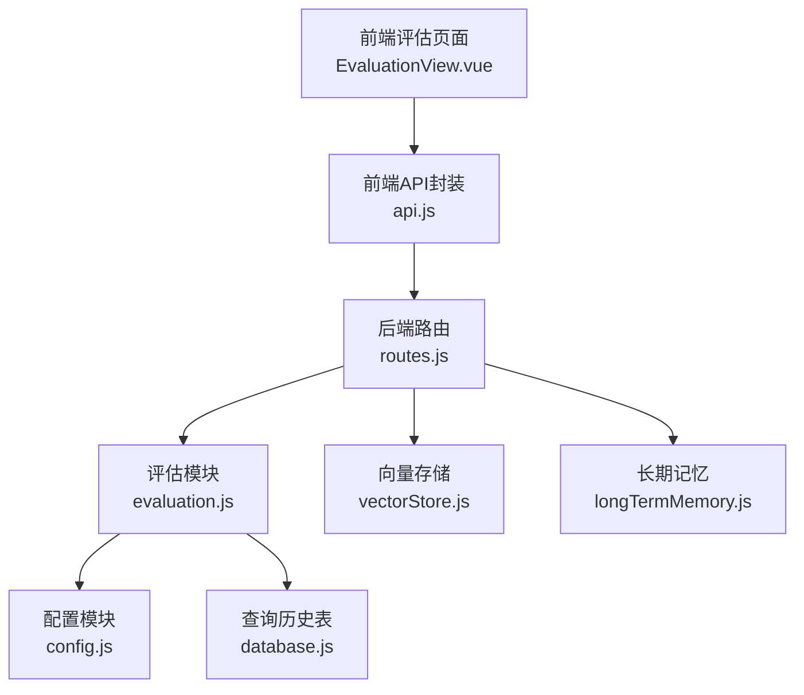
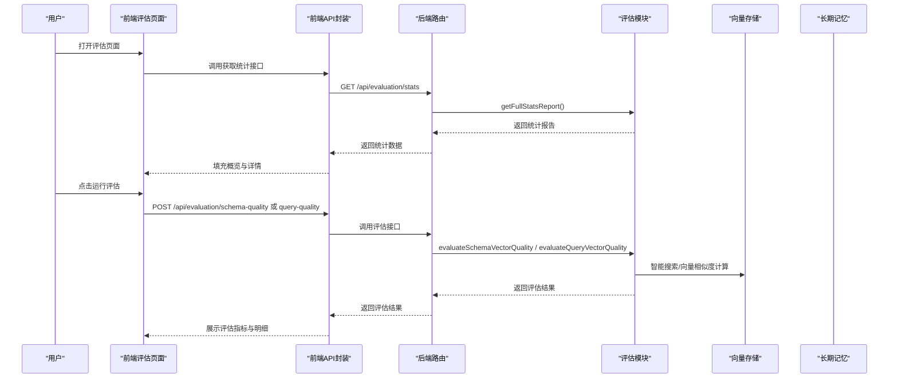
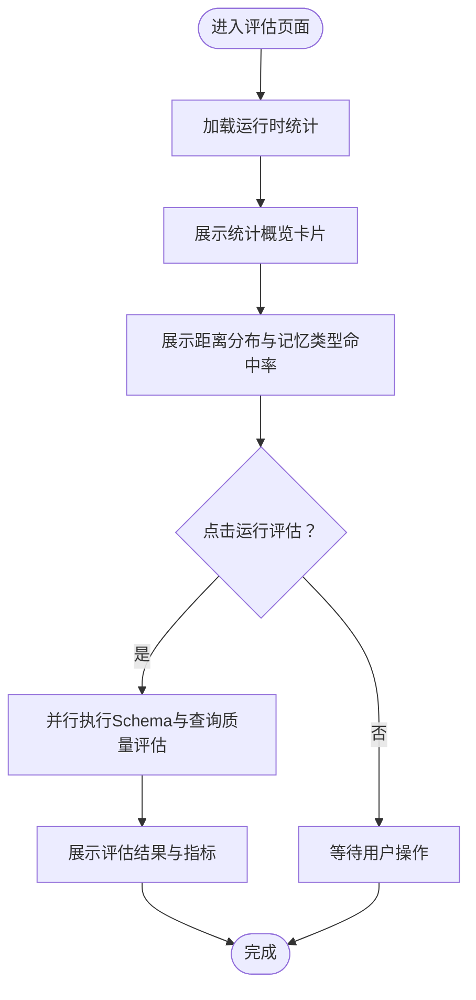
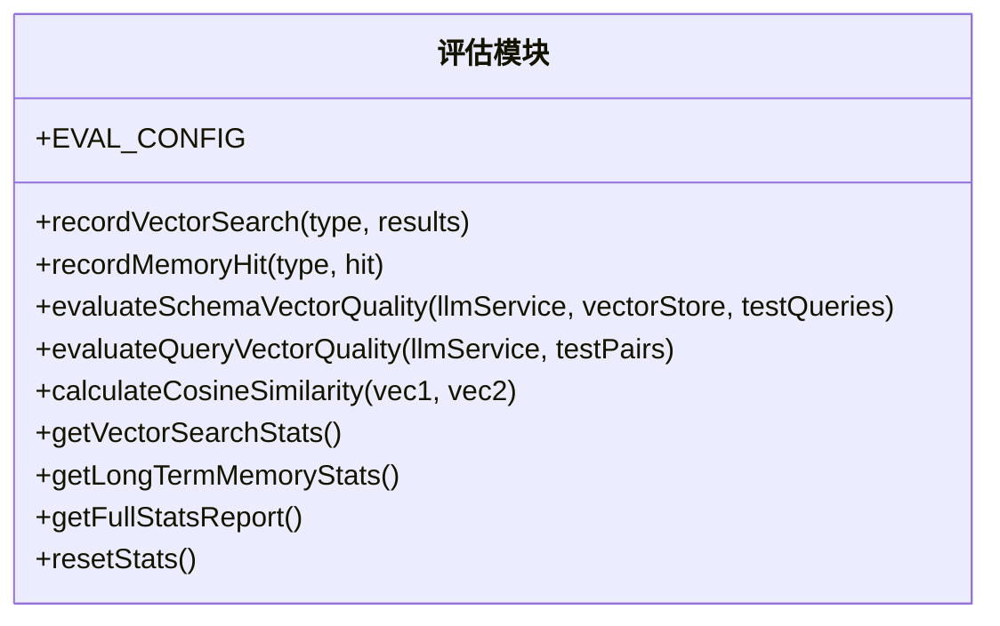
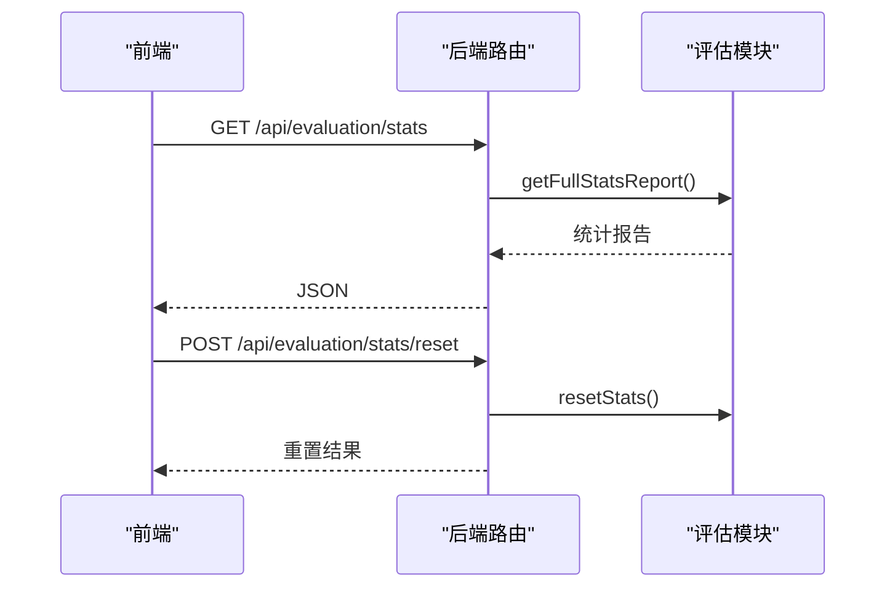
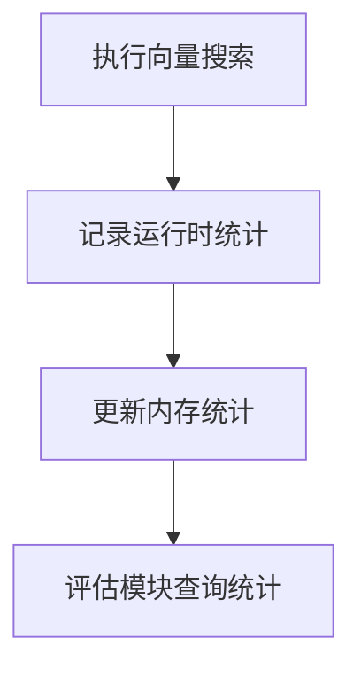
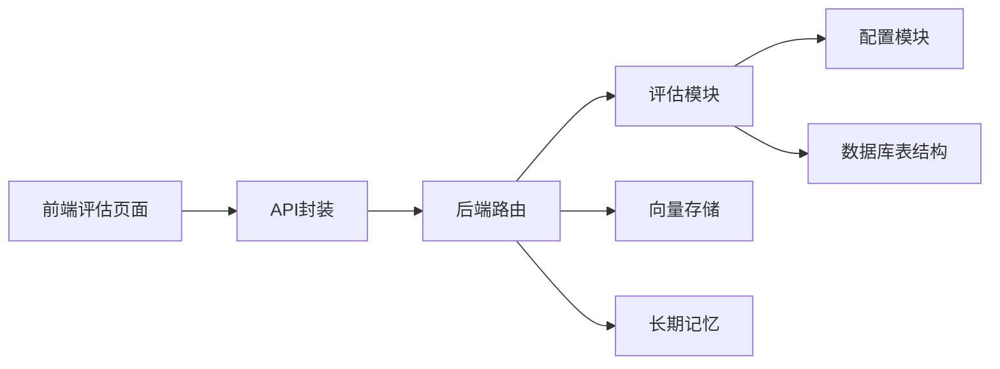

# 评估统计

<cite>
**本文档引用的文件**
- [EvaluationView.vue](file://frontend/src/views/EvaluationView.vue)
- [api.js](file://frontend/src/utils/api.js)
- [routes.js](file://backend/src/core/routes.js)
- [evaluation.js](file://backend/src/utils/evaluation.js)
- [config.js](file://backend/src/core/config.js)
- [vectorStore.js](file://backend/src/memory/vectorStore.js)
- [longTermMemory.js](file://backend/src/memory/longTermMemory.js)
- [database.js](file://backend/src/core/database.js)
</cite>

## 目录
1. [简介](#简介)
2. [项目结构](#项目结构)
3. [核心组件](#核心组件)
4. [架构总览](#架构总览)
5. [详细组件分析](#详细组件分析)
6. [依赖关系分析](#依赖关系分析)
7. [性能考虑](#性能考虑)
8. [故障排查指南](#故障排查指南)
9. [结论](#结论)
10. [附录](#附录)

## 简介
本文件面向 NL2SQL 评估统计组件，聚焦系统性能监控与统计分析界面，涵盖向量化质量评估、历史记忆命中率统计、实时运行时统计与历史趋势分析。文档详细说明前端可视化组件的实现与配置、后端评估与统计接口、数据来源与计算方法，并提供评估指标的含义与解读建议，以及自定义报表与导出使用的指导。

## 项目结构
评估统计功能由前后端协同实现：
- 前端：Vue 单页应用，提供评估页面、统计卡片、质量评估面板与交互控制。
- 后端：Express 路由提供评估统计接口、质量评估接口与配置查询接口；评估模块负责运行时统计与质量评估算法；向量存储与长期记忆模块负责记录命中统计。

**图表来源**
- [EvaluationView.vue:1-699](file://frontend/src/views/EvaluationView.vue#L1-L699)
- [api.js:270-320](file://frontend/src/utils/api.js#L270-L320)
- [routes.js:720-858](file://backend/src/core/routes.js#L720-L858)
- [evaluation.js:1-488](file://backend/src/utils/evaluation.js#L1-L488)
- [vectorStore.js:382-578](file://backend/src/memory/vectorStore.js#L382-L578)
- [longTermMemory.js:1-200](file://backend/src/memory/longTermMemory.js#L1-L200)
- [database.js:95-150](file://backend/src/core/database.js#L95-L150)

**章节来源**
- [EvaluationView.vue:1-699](file://frontend/src/views/EvaluationView.vue#L1-L699)
- [api.js:270-320](file://frontend/src/utils/api.js#L270-L320)
- [routes.js:720-858](file://backend/src/core/routes.js#L720-L858)

## 核心组件
- 前端评估页面组件：提供统计概览卡片、向量检索距离分布、记忆类型命中率、向量化质量评估面板与运行/重置控制。
- 后端评估模块：提供运行时统计记录、向量化质量评估算法、统计查询与重置接口。
- 后端路由：暴露评估统计、质量评估与配置查询接口。
- 向量存储与长期记忆：在检索与记忆命中发生时记录运行时统计，供前端展示。

**章节来源**
- [EvaluationView.vue:27-299](file://frontend/src/views/EvaluationView.vue#L27-L299)
- [evaluation.js:34-429](file://backend/src/utils/evaluation.js#L34-L429)
- [routes.js:720-858](file://backend/src/core/routes.js#L720-L858)
- [vectorStore.js:430-439](file://backend/src/memory/vectorStore.js#L430-L439)
- [longTermMemory.js:1-200](file://backend/src/memory/longTermMemory.js#L1-L200)

## 架构总览
评估统计的端到端流程如下：

**图表来源**
- [EvaluationView.vue:414-491](file://frontend/src/views/EvaluationView.vue#L414-L491)
- [api.js:277-319](file://frontend/src/utils/api.js#L277-L319)
- [routes.js:724-843](file://backend/src/core/routes.js#L724-L843)
- [evaluation.js:158-334](file://backend/src/utils/evaluation.js#L158-L334)
- [vectorStore.js:442-578](file://backend/src/memory/vectorStore.js#L442-L578)

## 详细组件分析

### 前端评估页面（EvaluationView.vue）
- 统计概览：展示 Schema 检索命中率、查询历史命中率、长期记忆总体命中率与距离分布。
- 详情统计：向量检索距离分布（极近/较近/中等/较远）与记忆类型命中率（字段别名、查询模式、指标偏好、维度偏好）。
- 质量评估：Schema 向量化质量评估（准确率、平均精确率、平均召回率、平均 F1 分数、Top1 命中）与查询相似度评估（平均误差、高相似度对、测试对总数）。
- 交互控制：刷新统计、重置统计数据、运行评估（并行执行 Schema 与查询质量评估）。

**图表来源**
- [EvaluationView.vue:414-491](file://frontend/src/views/EvaluationView.vue#L414-L491)

**章节来源**
- [EvaluationView.vue:27-299](file://frontend/src/views/EvaluationView.vue#L27-L299)

### 后端评估模块（evaluation.js）
- 配置：支持开关评估功能与运行时统计记录，包含相似度与质量评估阈值。
- 运行时统计：记录向量检索（Schema/查询）命中与距离分布、长期记忆命中（总体与按类型）。
- 质量评估：
  - Schema 向量化质量：计算精确率、召回率、F1 分数，统计 Top1 命中与整体准确率。
  - 查询相似度评估：计算余弦相似度、平均误差、高/中/低相似度对数量。
- 统计查询与重置：提供完整统计报告、重置运行时统计。

**图表来源**
- [evaluation.js:19-487](file://backend/src/utils/evaluation.js#L19-L487)

**章节来源**
- [evaluation.js:19-487](file://backend/src/utils/evaluation.js#L19-L487)

### 后端路由（routes.js）
- 评估统计接口：GET /api/evaluation/stats 返回完整统计报告；POST /api/evaluation/stats/reset 重置统计。
- 质量评估接口：POST /api/evaluation/schema-quality 与 /api/evaluation/query-quality 执行评估。
- 配置接口：GET /api/evaluation/config 返回评估配置。
- 服务统计接口：GET /api/stats 返回今日查询统计（成功/失败/平均执行时间等）。

**图表来源**
- [routes.js:724-762](file://backend/src/core/routes.js#L724-L762)

**章节来源**
- [routes.js:720-858](file://backend/src/core/routes.js#L720-L858)

### 向量存储与长期记忆（vectorStore.js、longTermMemory.js）
- 向量存储：在搜索完成后记录运行时统计（Schema/查询命中与距离分布）。
- 长期记忆：在记忆命中发生时记录总体与按类型命中统计，供评估模块查询。

**图表来源**
- [vectorStore.js:430-439](file://backend/src/memory/vectorStore.js#L430-L439)
- [evaluation.js:344-407](file://backend/src/utils/evaluation.js#L344-L407)

**章节来源**
- [vectorStore.js:382-578](file://backend/src/memory/vectorStore.js#L382-L578)
- [longTermMemory.js:1-200](file://backend/src/memory/longTermMemory.js#L1-L200)
- [evaluation.js:344-407](file://backend/src/utils/evaluation.js#L344-L407)

## 依赖关系分析
- 前端依赖后端 API，通过 axios 封装统一调用。
- 后端路由依赖评估模块进行统计与评估，依赖向量存储与长期记忆模块获取运行时统计。
- 评估模块依赖配置模块与日志模块，依赖数据库表结构进行服务统计。

**图表来源**
- [api.js:277-319](file://frontend/src/utils/api.js#L277-L319)
- [routes.js:724-843](file://backend/src/core/routes.js#L724-L843)
- [evaluation.js:12-13](file://backend/src/utils/evaluation.js#L12-L13)
- [config.js:380-396](file://backend/src/core/config.js#L380-L396)
- [database.js:95-150](file://backend/src/core/database.js#L95-L150)

**章节来源**
- [api.js:277-319](file://frontend/src/utils/api.js#L277-L319)
- [routes.js:724-843](file://backend/src/core/routes.js#L724-L843)
- [evaluation.js:12-13](file://backend/src/utils/evaluation.js#L12-L13)
- [config.js:380-396](file://backend/src/core/config.js#L380-L396)
- [database.js:95-150](file://backend/src/core/database.js#L95-L150)

## 性能考虑
- 前端渲染：使用 Element Plus 的进度条与表格组件，避免大数据量时的过度重绘；建议在大规模数据场景下采用虚拟滚动与分页。
- 后端评估：质量评估使用并行计算（Schema 与查询评估并行），减少用户等待时间；评估阈值与相似度计算需平衡精度与性能。
- 运行时统计：统计记录采用轻量级内存存储，失败不影响主流程；建议结合持久化存储进行历史趋势分析。
- 向量搜索：智能搜索在应用层进行后过滤与优先级排序，注意过滤条件与排序成本。

[本节为通用性能建议，不直接分析具体文件]

## 故障排查指南
- 评估功能未启用：前端显示配置提示，后端路由返回“评估功能未启用”错误。检查后端环境变量 EVALUATION_ENABLED。
- 网络连接失败：前端 API 封装统一处理网络错误，检查代理与跨域配置。
- 评估接口报错：查看后端日志与错误响应，确认评估阈值与测试数据格式。
- 统计数据为空：确认 EVALUATION_TRACK_STATS 已启用，确保向量搜索与记忆命中流程正常触发统计记录。

**章节来源**
- [EvaluationView.vue:17-25](file://frontend/src/views/EvaluationView.vue#L17-L25)
- [routes.js:774-780](file://backend/src/core/routes.js#L774-L780)
- [api.js:72-87](file://frontend/src/utils/api.js#L72-L87)
- [config.js:384-387](file://backend/src/core/config.js#L384-L387)

## 结论
评估统计组件通过前后端协作，实现了对向量化质量与长期记忆命中率的可视化监控与质量评估。前端提供直观的统计卡片与评估面板，后端提供可配置的评估阈值与运行时统计记录。建议在生产环境中结合持久化存储与历史趋势分析，进一步完善评估体系。

[本节为总结性内容，不直接分析具体文件]

## 附录

### 关键指标与解读
- Schema 检索命中率：衡量向量检索在 Schema 层面的准确性，命中率越高表示检索效果越好。
- 查询历史命中率：衡量查询历史向量在相似度评估中的召回能力，反映历史查询的可复用性。
- 长期记忆命中率：衡量长期记忆在不同偏好类型上的命中情况，帮助识别用户偏好与系统学习效果。
- 向量检索距离分布：距离越小表示相似度越高，分布越集中在较小距离表明向量质量较好。
- Schema 向量化质量评估：准确率、精确率、召回率、F1 分数与 Top1 命中用于综合评价模型质量。
- 查询相似度评估：平均误差与高/中/低相似度对数量用于衡量查询向量化的一致性与稳定性。

**章节来源**
- [EvaluationView.vue:32-55](file://frontend/src/views/EvaluationView.vue#L32-L55)
- [evaluation.js:158-334](file://backend/src/utils/evaluation.js#L158-L334)

### 自定义报表与导出使用指南
- 自定义测试数据：在前端评估页面点击“运行评估”，后端将使用传入的测试查询与测试对进行评估；若未传入，将使用默认测试集。
- 导出建议：当前实现未提供直接导出功能，可在前端将评估结果与统计卡片截图或复制数据；如需自动化导出，可在前端增加导出按钮并调用浏览器下载 API，或在后端扩展导出接口（例如将评估结果转换为 CSV/Excel）。

**章节来源**
- [EvaluationView.vue:466-491](file://frontend/src/views/EvaluationView.vue#L466-L491)
- [routes.js:764-843](file://backend/src/core/routes.js#L764-L843)