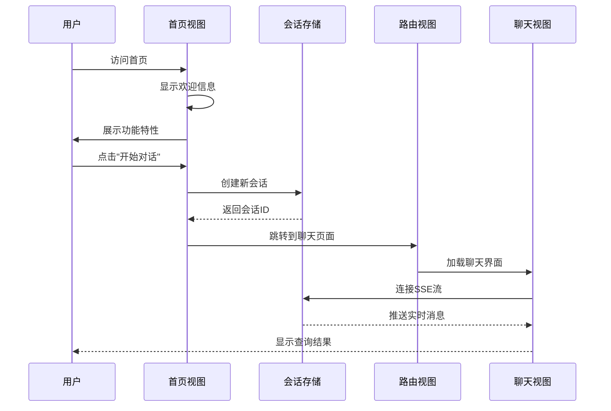
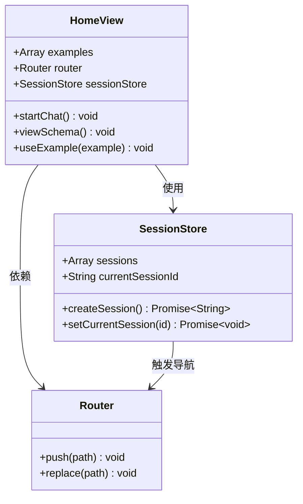
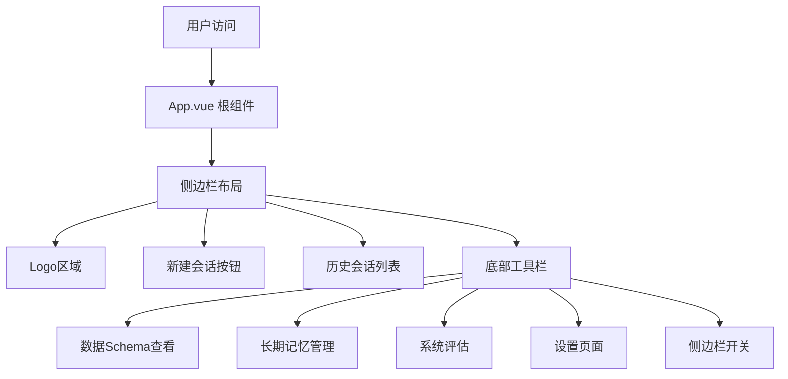
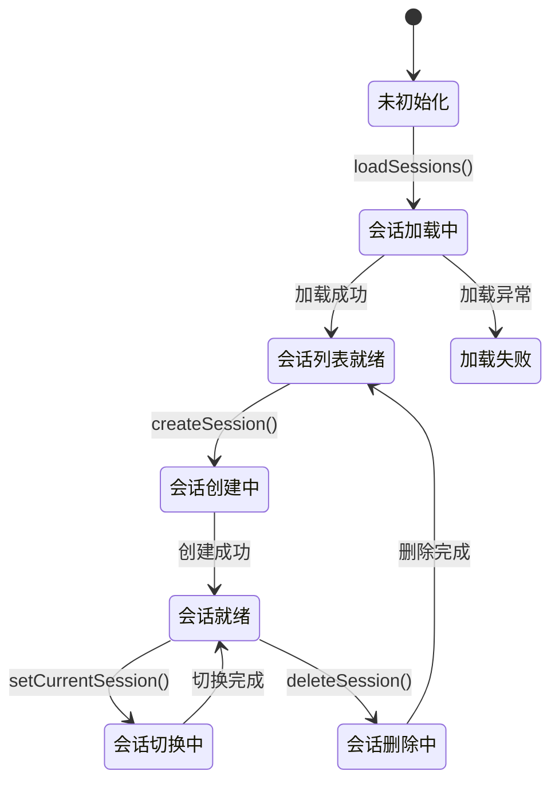
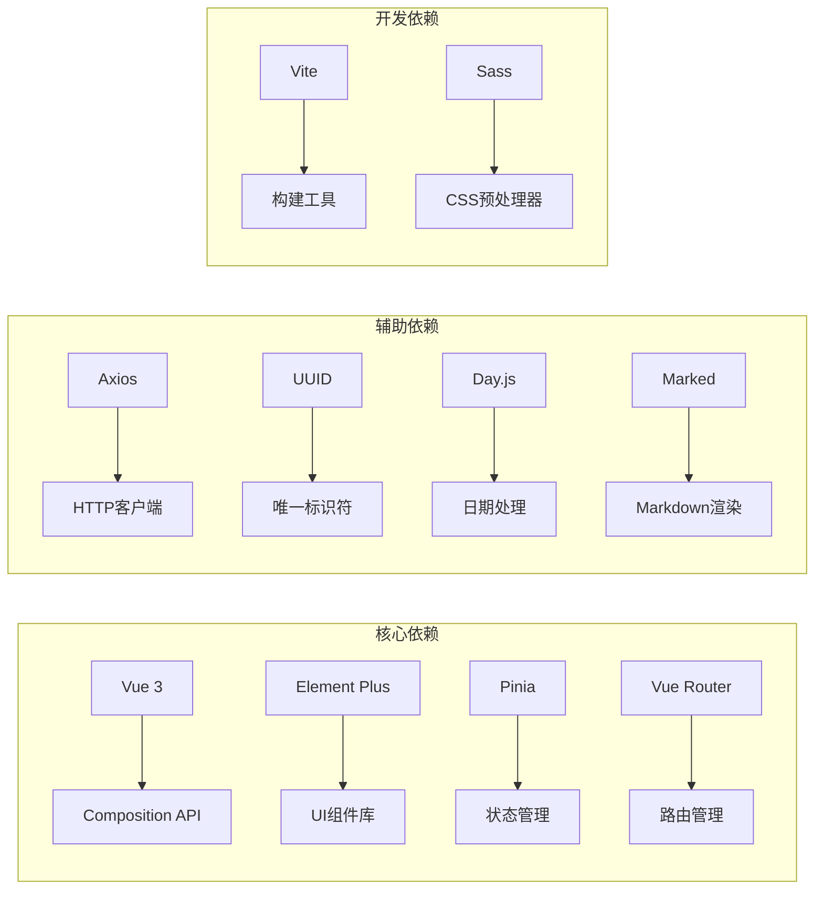
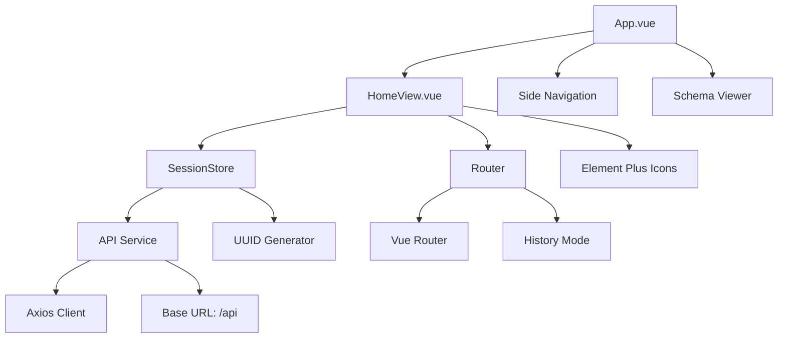

# 首页导航

<cite>
**本文档引用的文件**
- [HomeView.vue](file://frontend/src/views/HomeView.vue)
- [App.vue](file://frontend/src/App.vue)
- [main.js](file://frontend/src/main.js)
- [router/index.js](file://frontend/src/router/index.js)
- [stores/session.js](file://frontend/src/stores/session.js)
- [utils/api.js](file://frontend/src/utils/api.js)
- [components/SchemaViewer.vue](file://frontend/src/components/SchemaViewer.vue)
- [views/ChatView.vue](file://frontend/src/views/ChatView.vue)
- [styles/global.css](file://frontend/src/styles/global.css)
- [views/HistoryView.vue](file://frontend/src/views/HistoryView.vue)
- [views/SchemaView.vue](file://frontend/src/views/SchemaView.vue)
- [views/MemoryView.vue](file://frontend/src/views/MemoryView.vue)
- [views/EvaluationView.vue](file://frontend/src/views/EvaluationView.vue)
- [vite.config.js](file://frontend/vite.config.js)
</cite>

## 目录
1. [简介](#简介)
2. [项目结构](#项目结构)
3. [核心组件](#核心组件)
4. [架构概览](#架构概览)
5. [详细组件分析](#详细组件分析)
6. [依赖分析](#依赖分析)
7. [性能考虑](#性能考虑)
8. [故障排除指南](#故障排除指南)
9. [结论](#结论)
10. [附录](#附录)

## 简介

NL2SQL 首页导航组件是整个自然语言数据查询系统的核心入口点，为用户提供直观、高效的导航体验。该组件不仅展示了系统的功能特性，更重要的是提供了无缝的用户体验，让用户能够快速开始数据查询之旅。

首页导航组件采用现代化的设计理念，结合响应式布局和丰富的交互功能，为不同类型的用户需求提供个性化的访问路径。通过精心设计的布局和导航机制，用户可以在最短时间内找到所需的功能模块，实现从概念到实际查询的快速转化。

## 项目结构

NL2SQL 项目采用前后端分离的架构设计，前端部分基于 Vue 3 和 Element Plus 构建，形成了清晰的模块化组织结构：

```mermaid
graph TB
subgraph "前端应用结构"
A[main.js 应用入口] --> B[App.vue 根组件]
B --> C[router/index.js 路由配置]
B --> D[stores/ 状态管理]
B --> E[views/ 视图组件]
B --> F[components/ 通用组件]
B --> G[utils/ 工具函数]
B --> H[styles/ 样式文件]
end
subgraph "路由系统"
C --> I[HomeView.vue 首页]
C --> J[ChatView.vue 聊天界面]
C --> K[HistoryView.vue 历史记录]
C --> L[SchemaView.vue 数据Schema]
C --> M[MemoryView.vue 长期记忆]
C --> N[EvaluationView.vue 系统评估]
end
subgraph "状态管理"
D --> O[session.js 会话状态]
D --> P[其他store]
end
```

**图表来源**
- [main.js:1-89](file://frontend/src/main.js#L1-L89)
- [router/index.js:1-157](file://frontend/src/router/index.js#L1-L157)
- [App.vue:1-384](file://frontend/src/App.vue#L1-L384)

**章节来源**
- [main.js:1-89](file://frontend/src/main.js#L1-L89)
- [router/index.js:1-157](file://frontend/src/router/index.js#L1-L157)
- [App.vue:1-384](file://frontend/src/App.vue#L1-L384)

## 核心组件

首页导航组件作为系统的第一个接触点，承担着多重重要职责：

### 主要功能特性

1. **欢迎信息展示** - 通过醒目的标题和副标题传达系统价值主张
2. **快速开始入口** - 提供"开始对话"和"查看数据Schema"两大核心功能入口
3. **功能特性展示** - 通过网格布局展示四大核心功能特点
4. **使用示例** - 提供真实场景的查询示例，降低用户学习成本
5. **响应式设计** - 适配不同屏幕尺寸和设备类型

### 设计特色

- **现代化视觉设计** - 使用 Element Plus 图标库和渐变色彩方案
- **流畅的交互体验** - 悬停效果、过渡动画和即时反馈
- **语义化布局** - 清晰的层次结构和视觉引导
- **无障碍友好** - 良好的对比度和可访问性设计

**章节来源**
- [HomeView.vue:1-318](file://frontend/src/views/HomeView.vue#L1-L318)

## 架构概览

NL2SQL 首页导航组件在整个系统架构中扮演着关键的入口角色，通过精心设计的组件层次和数据流实现高效的用户交互：

**图表来源**
- [HomeView.vue:153-163](file://frontend/src/views/HomeView.vue#L153-L163)
- [stores/session.js:118-138](file://frontend/src/stores/session.js#L118-L138)
- [router/index.js:34-49](file://frontend/src/router/index.js#L34-L49)

### 数据流架构

首页组件通过以下数据流实现完整的功能：

1. **用户交互层** - 处理用户点击和输入事件
2. **状态管理层** - 管理会话状态和应用状态
3. **路由控制层** - 管理页面导航和路由跳转
4. **API 通信层** - 处理与后端服务的数据交换

**章节来源**
- [HomeView.vue:95-188](file://frontend/src/views/HomeView.vue#L95-L188)
- [stores/session.js:33-442](file://frontend/src/stores/session.js#L33-L442)

## 详细组件分析

### 首页视图组件 (HomeView.vue)

首页视图组件是整个导航系统的核心，采用了现代化的单文件组件架构：

#### 组件结构分析

**图表来源**
- [HomeView.vue:95-188](file://frontend/src/views/HomeView.vue#L95-L188)
- [stores/session.js:33-442](file://frontend/src/stores/session.js#L33-L442)

#### 核心功能实现

**快速开始功能**：
- 开始对话按钮：创建新会话并跳转到聊天页面
- 查看数据Schema按钮：直接进入数据结构查看界面

**功能特性展示**：
- 四大核心功能通过卡片网格布局展示
- 每个功能特性配有相应的图标和详细说明
- 响应式设计确保在移动设备上的良好显示效果

**使用示例系统**：
- 提供四个真实的业务场景示例
- 点击示例可直接创建会话并开始查询
- 减少用户的学习曲线和认知负担

**章节来源**
- [HomeView.vue:153-187](file://frontend/src/views/HomeView.vue#L153-L187)

### 根组件集成 (App.vue)

根组件作为应用的布局框架，为首页导航提供了完整的上下文环境：

#### 侧边栏导航系统

**图表来源**
- [App.vue:11-82](file://frontend/src/App.vue#L11-L82)

#### 会话管理系统

根组件集成了完整的会话管理功能：

- **会话列表**：显示用户的历史会话记录
- **会话切换**：支持在不同会话间快速切换
- **会话删除**：提供会话清理和管理功能
- **侧边栏控制**：支持侧边栏的展开和收起

**章节来源**
- [App.vue:176-228](file://frontend/src/App.vue#L176-L228)

### 状态管理集成

首页导航组件与 Pinia 状态管理系统的深度集成：

#### 会话状态管理

**图表来源**
- [stores/session.js:103-138](file://frontend/src/stores/session.js#L103-L138)

#### API 通信层

首页组件通过统一的 API 服务层与后端进行数据交换：

- **会话管理**：创建、获取、删除会话
- **消息处理**：获取会话历史和消息列表
- **Schema 查询**：获取数据结构信息
- **查询执行**：发送查询请求并接收结果

**章节来源**
- [utils/api.js:150-195](file://frontend/src/utils/api.js#L150-L195)

### 路由系统集成

首页导航与 Vue Router 的紧密集成确保了流畅的用户体验：

#### 路由配置分析

| 路由路径 | 组件名称 | 功能描述 | 会话要求 |
|---------|----------|----------|----------|
| `/` | HomeView | 首页导航 | 否 |
| `/chat/:sessionId?` | ChatView | 聊天界面 | 是 |
| `/history` | HistoryView | 查询历史 | 否 |
| `/schema` | SchemaView | 数据Schema | 否 |
| `/memory` | MemoryView | 长期记忆 | 否 |
| `/evaluation` | EvaluationView | 系统评估 | 否 |

**章节来源**
- [router/index.js:34-109](file://frontend/src/router/index.js#L34-L109)

## 依赖分析

### 技术栈依赖

NL2SQL 首页导航组件基于现代前端技术栈构建，具有清晰的依赖关系：

**图表来源**
- [package.json:11-35](file://frontend/package.json#L11-L35)

### 组件间依赖关系

首页导航组件与其他系统组件的依赖关系：

**图表来源**
- [HomeView.vue:104-120](file://frontend/src/views/HomeView.vue#L104-L120)
- [stores/session.js:15-22](file://frontend/src/stores/session.js#L15-L22)
- [utils/api.js:25-34](file://frontend/src/utils/api.js#L25-L34)

**章节来源**
- [package.json:11-35](file://frontend/package.json#L11-L35)

## 性能考虑

### 响应式设计优化

首页导航组件采用了多项性能优化策略：

#### 移动端适配

- **弹性布局**：使用 CSS Grid 和 Flexbox 实现自适应布局
- **媒体查询**：针对不同屏幕尺寸优化显示效果
- **触摸友好的交互**：按钮大小和间距符合移动端操作习惯

#### 性能优化措施

- **懒加载组件**：非首页组件采用动态导入
- **资源分割**：通过 Vite 的代码分割功能优化加载性能
- **缓存策略**：合理利用浏览器缓存机制

**章节来源**
- [styles/global.css:304-317](file://frontend/src/styles/global.css#L304-L317)
- [vite.config.js:72-91](file://frontend/vite.config.js#L72-L91)

### 交互性能优化

- **防抖处理**：输入框和搜索功能的防抖机制
- **虚拟滚动**：大量数据时的滚动性能优化
- **渐进式加载**：大数据量时的分批加载策略

## 故障排除指南

### 常见问题及解决方案

#### 会话创建失败

**问题表现**：点击"开始对话"按钮后出现错误提示

**可能原因**：
1. 后端服务不可用
2. 网络连接异常
3. 会话存储服务故障

**解决方案**：
1. 检查后端服务状态
2. 验证网络连接稳定性
3. 查看浏览器开发者工具的错误日志

#### Schema 数据加载失败

**问题表现**：点击"查看数据Schema"后无法显示数据

**可能原因**：
1. API 服务未正确配置
2. 权限不足
3. 数据库连接问题

**解决方案**：
1. 验证 API 端点可用性
2. 检查用户权限设置
3. 确认数据库连接状态

#### 路由跳转异常

**问题表现**：页面跳转后显示 404 或空白页面

**可能原因**：
1. 路由配置错误
2. 会话ID无效
3. 前端构建问题

**解决方案**：
1. 检查路由配置文件
2. 验证会话ID的有效性
3. 重新构建前端应用

**章节来源**
- [HomeView.vue:159-162](file://frontend/src/views/HomeView.vue#L159-L162)
- [utils/api.js:72-87](file://frontend/src/utils/api.js#L72-L87)

## 结论

NL2SQL 首页导航组件通过精心设计的架构和丰富的功能特性，为用户提供了直观、高效的导航体验。该组件不仅实现了基本的页面导航功能，更重要的是通过智能化的设计和优化，显著提升了用户的整体使用体验。

### 核心优势

1. **直观的用户界面**：清晰的功能分区和视觉层次
2. **流畅的交互体验**：响应式的布局和即时的反馈机制
3. **强大的功能集成**：与会话管理、状态管理和路由系统的深度集成
4. **良好的可扩展性**：模块化的架构设计便于功能扩展和维护

### 技术亮点

- 基于 Vue 3 Composition API 的现代化开发模式
- 与 Element Plus 生态系统的完美融合
- 通过 Pinia 实现的状态管理最佳实践
- 采用 Vite 的高性能构建工具链

该首页导航组件为 NL2SQL 系统的成功奠定了坚实的基础，为后续的功能扩展和性能优化提供了良好的平台支撑。

## 附录

### 开发者指南

#### 代码规范

- 遵循 Vue 3 单文件组件的命名约定
- 使用语义化的组件命名和文件组织
- 保持代码注释的完整性和准确性

#### 扩展建议

1. **个性化推荐**：基于用户历史行为提供功能推荐
2. **快捷键支持**：为常用操作添加键盘快捷键
3. **多语言支持**：实现国际化功能以服务全球用户
4. **主题定制**：提供更多的视觉定制选项

#### 测试策略

- 单元测试：覆盖核心业务逻辑和边界条件
- 集成测试：验证组件间的协作和数据流
- 端到端测试：模拟完整的用户操作流程
- 性能测试：监控页面加载和交互响应时间