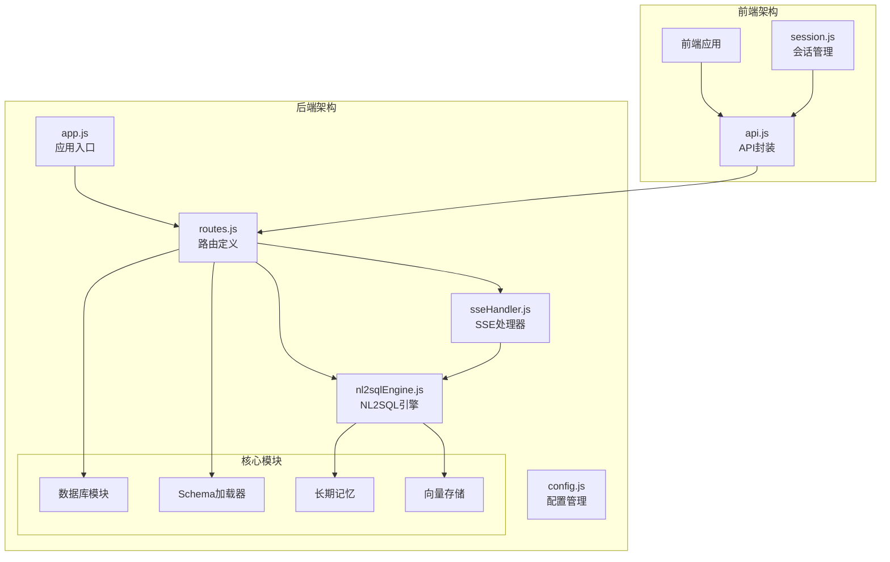
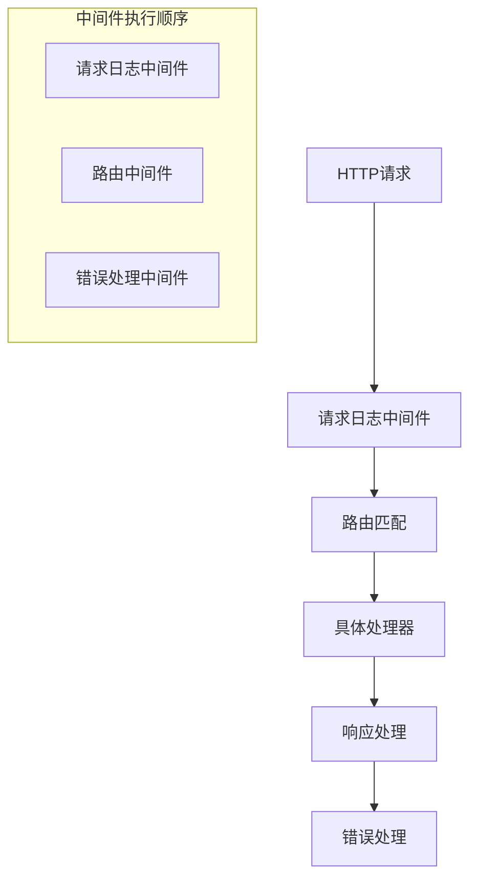
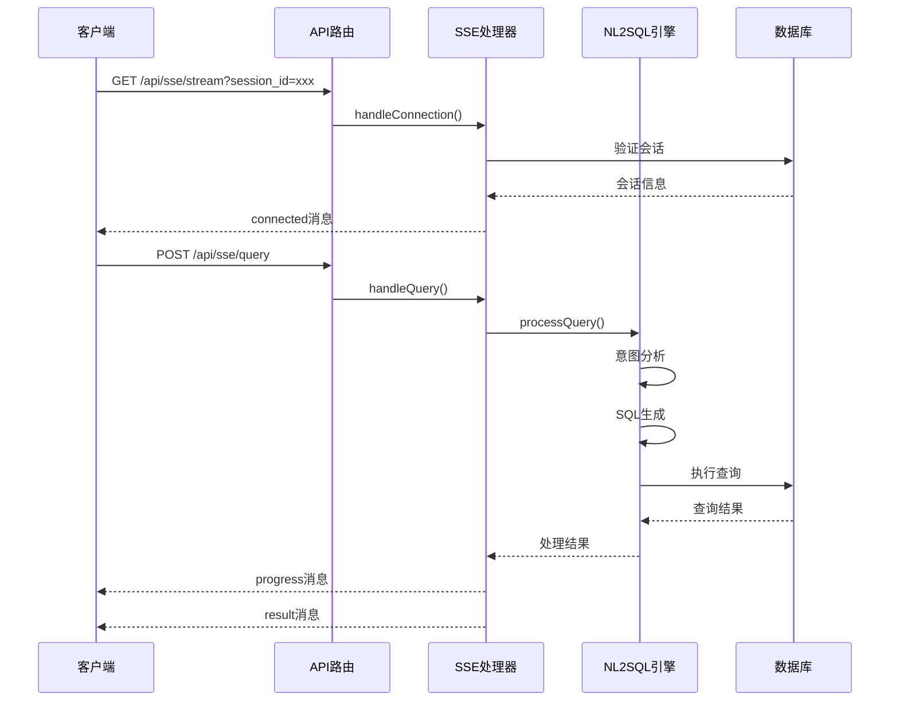
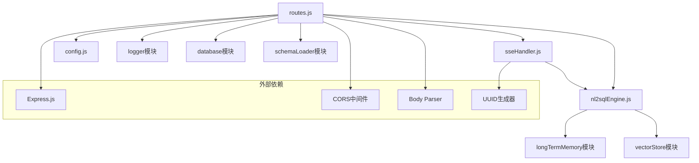

# API 接口路由

<cite>
**本文档引用的文件**
- [routes.js](file://backend/src/core/routes.js)
- [app.js](file://backend/src/app.js)
- [sseHandler.js](file://backend/src/core/sseHandler.js)
- [nl2sqlEngine.js](file://backend/src/core/nl2sqlEngine.js)
- [config.js](file://backend/src/core/config.js)
- [api.js](file://frontend/src/utils/api.js)
- [session.js](file://frontend/src/stores/session.js)
</cite>

## 目录
1. [简介](#简介)
2. [项目结构](#项目结构)
3. [核心组件](#核心组件)
4. [架构概览](#架构概览)
5. [详细组件分析](#详细组件分析)
6. [依赖关系分析](#依赖关系分析)
7. [性能考虑](#性能考虑)
8. [故障排除指南](#故障排除指南)
9. [结论](#结论)

## 简介

NL2SQL API 接口路由系统基于 Express.js 构建，提供了完整的自然语言到 SQL 查询转换服务。该系统采用 RESTful API 设计模式，结合 Server-Sent Events (SSE) 实现实时通信，为用户提供流畅的查询体验。

系统主要功能包括：
- 健康检查和状态监控
- Schema 元数据查询和管理
- 会话管理和消息历史
- 查询历史记录
- 用户偏好和长期记忆
- 实时查询处理和结果推送
- 评估和统计功能

## 项目结构

后端采用模块化架构，核心路由集中在 `backend/src/core/routes.js` 文件中，通过 Express.js 的路由系统组织各种 API 端点。



**图表来源**
- [app.js:1-238](file://backend/src/app.js#L1-L238)
- [routes.js:1-1037](file://backend/src/core/routes.js#L1-L1037)

**章节来源**
- [app.js:1-238](file://backend/src/app.js#L1-L238)
- [routes.js:1-1037](file://backend/src/core/routes.js#L1-L1037)

## 核心组件

### 路由系统架构

系统采用 Express.js 的路由中间件模式，通过统一的路由处理器管理所有 API 端点。路由系统包含以下核心组件：

1. **请求日志中间件** - 记录所有 API 请求的详细信息
2. **健康检查接口** - 提供服务状态监控
3. **Schema 管理接口** - 处理数据结构元信息
4. **会话管理接口** - 管理会话生命周期
5. **查询历史接口** - 管理查询记录
6. **用户偏好接口** - 处理长期记忆和用户习惯
7. **SSE 实时通信** - 提供流式消息推送
8. **全局错误处理** - 统一错误响应格式

### 中间件链设计



**图表来源**
- [routes.js:46-54](file://backend/src/core/routes.js#L46-L54)

**章节来源**
- [routes.js:42-54](file://backend/src/core/routes.js#L42-L54)

## 架构概览

### API 路由层次结构

系统采用分层路由设计，所有 API 端点都挂载在 `/api` 前缀下：

```mermaid
graph TD
API[/api] --> Health[健康检查]
API --> Schema[Schema管理]
API --> Sessions[会话管理]
API --> Queries[查询历史]
API --> Preferences[用户偏好]
API --> Evaluation[评估功能]
API --> Stats[统计信息]
API --> Config[配置信息]
API --> SSE[SSE实时通信]
Health --> HealthDetail[详细健康检查]
Schema --> SchemaTables[表详情]
Schema --> SchemaSearch[Schema搜索]
Sessions --> SessionMessages[消息历史]
Preferences --> PreferenceTemplates[查询模板]
SSE --> SSEStream[SSE流]
SSE --> SSEQuery[查询提交]
```

**图表来源**
- [routes.js:57-137](file://backend/src/core/routes.js#L57-L137)
- [routes.js:140-250](file://backend/src/core/routes.js#L140-L250)
- [routes.js:252-398](file://backend/src/core/routes.js#L252-L398)

### SSE 实时通信架构



**图表来源**
- [routes.js:948-1002](file://backend/src/core/routes.js#L948-L1002)
- [sseHandler.js:43-112](file://backend/src/core/sseHandler.js#L43-L112)

**章节来源**
- [routes.js:948-1002](file://backend/src/core/routes.js#L948-L1002)
- [sseHandler.js:43-112](file://backend/src/core/sseHandler.js#L43-L112)

## 详细组件分析

### 健康检查接口

健康检查接口提供服务状态监控，包含基本健康检查和详细健康检查两个端点。

#### 基本健康检查
- **端点**: `GET /api/health`
- **功能**: 返回服务基本状态信息
- **响应**: 包含状态、时间戳、版本、运行时间和内存使用情况

#### 详细健康检查
- **端点**: `GET /api/health/detail`
- **功能**: 返回各组件详细状态
- **响应**: 包含数据库、LLM API、Schema加载和SSE连接状态

**章节来源**
- [routes.js:60-137](file://backend/src/core/routes.js#L60-L137)

### Schema 管理接口

Schema 管理接口提供数据结构元信息的查询和管理功能。

#### Schema 查询
- **端点**: `GET /api/schema`
- **参数**: `type` (tables|metrics|dimensions)
- **功能**: 返回完整的Schema信息或按类型筛选

#### 表详情查询
- **端点**: `GET /api/schema/tables/:tableName`
- **参数**: `tableName` (路径参数)
- **功能**: 返回指定表的详细信息和关联表

#### Schema 搜索
- **端点**: `GET /api/schema/search`
- **参数**: `q` (搜索关键词), `limit` (结果数量)
- **功能**: 搜索相关的表定义

**章节来源**
- [routes.js:143-250](file://backend/src/core/routes.js#L143-L250)

### 会话管理接口

会话管理接口提供会话生命周期的完整管理。

#### 会话创建
- **端点**: `POST /api/sessions`
- **请求体**: `user_id`, `title`
- **功能**: 创建新会话并返回会话信息

#### 会话查询
- **端点**: `GET /api/sessions/:sessionId`
- **参数**: `sessionId` (路径参数)
- **功能**: 获取会话详细信息

#### 会话删除
- **端点**: `DELETE /api/sessions/:sessionId`
- **参数**: `sessionId` (路径参数)
- **功能**: 删除指定会话

#### 消息历史
- **端点**: `GET /api/sessions/:sessionId/messages`
- **参数**: `limit` (消息数量限制)
- **功能**: 获取会话消息历史

#### 用户会话列表
- **端点**: `GET /api/users/:userId/sessions`
- **参数**: `userId` (路径参数), `limit` (会话数量限制)
- **功能**: 获取用户的所有会话

**章节来源**
- [routes.js:256-398](file://backend/src/core/routes.js#L256-L398)

### 查询历史接口

查询历史接口提供查询记录的查询和管理功能。

#### 查询历史查询
- **端点**: `GET /api/queries/history`
- **参数**: `user_id`, `session_id`, `limit`
- **功能**: 获取查询历史记录

**章节来源**
- [routes.js:404-450](file://backend/src/core/routes.js#L404-L450)

### 用户偏好接口

用户偏好接口处理长期记忆和用户习惯的学习与管理。

#### 偏好查询
- **端点**: `GET /api/preferences/:userId`
- **参数**: `type` (偏好类型), `limit` (数量限制)
- **功能**: 获取用户偏好列表

#### 偏好删除
- **端点**: `DELETE /api/preferences/:preferenceId`
- **参数**: `preferenceId` (路径参数)
- **功能**: 删除指定偏好

#### 查询模板管理
- **端点**: `POST /api/preferences/:userId/templates`
- **参数**: `userId` (路径参数)
- **请求体**: 模板信息
- **功能**: 保存查询模板

#### 字段别名学习
- **端点**: `POST /api/preferences/:userId/learn-alias`
- **参数**: `userId` (路径参数)
- **请求体**: 别名学习信息
- **功能**: 手动学习字段别名

**章节来源**
- [routes.js:545-716](file://backend/src/core/routes.js#L545-L716)

### 评估接口

评估接口提供系统性能和质量的评估功能。

#### 运行时统计
- **端点**: `GET /api/evaluation/stats`
- **功能**: 获取运行时统计报告

#### 统计数据重置
- **端点**: `POST /api/evaluation/stats/reset`
- **功能**: 重置统计数据

#### Schema 质量评估
- **端点**: `POST /api/evaluation/schema-quality`
- **请求体**: 测试查询
- **功能**: 执行Schema向量化质量评估

#### 查询质量评估
- **端点**: `POST /api/evaluation/query-quality`
- **请求体**: 测试对
- **功能**: 执行查询历史向量化质量评估

#### 评估配置查询
- **端点**: `GET /api/evaluation/config`
- **功能**: 获取评估配置

**章节来源**
- [routes.js:722-856](file://backend/src/core/routes.js#L722-L856)

### 统计信息接口

统计信息接口提供系统运行状态的统计信息。

#### 系统统计
- **端点**: `GET /api/stats`
- **功能**: 获取服务统计信息，包括连接数、查询统计、Schema信息等

**章节来源**
- [routes.js:862-913](file://backend/src/core/routes.js#L862-L913)

### 配置接口

配置接口提供系统配置信息的查询。

#### 配置查询
- **端点**: `GET /api/config`
- **功能**: 获取公开配置信息（不包含敏感信息）

**章节来源**
- [routes.js:919-942](file://backend/src/core/routes.js#L919-L942)

### SSE 实时通信接口

SSE 接口提供实时查询处理和结果推送功能。

#### SSE 连接
- **端点**: `GET /api/sse/stream`
- **参数**: `session_id` (必需), `user_id` (可选)
- **功能**: 建立Server-Sent Events连接

#### 查询提交
- **端点**: `POST /api/sse/query`
- **请求体**: `session_id`, `query`
- **功能**: 通过HTTP POST发送查询请求，结果通过SSE推送

**章节来源**
- [routes.js:948-1002](file://backend/src/core/routes.js#L948-L1002)

## 依赖关系分析

### 核心依赖关系



**图表来源**
- [routes.js:16-30](file://backend/src/core/routes.js#L16-L30)
- [app.js:22-50](file://backend/src/app.js#L22-L50)

### 错误处理机制

系统采用多层次的错误处理策略：

1. **路由级错误处理**: 捕获所有未处理的路由错误
2. **全局错误处理**: 统一处理所有异常
3. **SSE错误处理**: 特定处理SSE连接和消息发送错误
4. **业务逻辑错误**: NL2SQL引擎的结构化错误处理

**章节来源**
- [routes.js:1008-1030](file://backend/src/core/routes.js#L1008-L1030)
- [sseHandler.js:145-153](file://backend/src/core/sseHandler.js#L145-L153)

## 性能考虑

### 连接管理

SSE 连接管理系统支持多标签页连接和连接池管理：

- **连接映射**: 使用 Map 结构管理会话ID到连接列表的映射
- **并发处理**: 每个会话支持多个并发连接
- **连接清理**: 自动清理断开的连接和过期连接

### 查询处理优化

NL2SQL 引擎采用多种优化策略：

- **意图识别**: 使用LLM进行智能意图分析
- **实体解析**: 支持游戏名、渠道名等实体的自动解析
- **长期记忆**: 利用用户偏好和历史查询优化
- **向量检索**: 基于语义相似性的Schema检索

### 安全配置

系统提供全面的安全配置选项：

- **表白名单**: 控制可访问的数据库表
- **查询限制**: 限制单次查询返回的行数和执行时间
- **关键字过滤**: 防止危险SQL操作
- **敏感字段脱敏**: 自动脱敏敏感数据

## 故障排除指南

### 常见问题诊断

#### SSE 连接问题
- **症状**: 客户端无法建立SSE连接
- **排查**: 检查会话ID有效性、网络连接、服务器日志
- **解决方案**: 确保会话存在且有效，检查防火墙设置

#### 查询处理失败
- **症状**: 查询无响应或返回错误
- **排查**: 检查LLM API配置、数据库连接、查询超时设置
- **解决方案**: 验证API密钥和数据库连接，调整超时参数

#### 性能问题
- **症状**: 响应缓慢或内存占用过高
- **排查**: 检查查询复杂度、连接数、向量数据库性能
- **解决方案**: 优化查询、限制并发连接、调整缓存策略

### 日志分析

系统提供详细的日志记录，包括：

- **请求日志**: 记录所有API请求的详细信息
- **错误日志**: 记录所有错误和异常
- **性能日志**: 记录查询执行时间和资源使用情况
- **SSE日志**: 记录SSE连接和消息传输状态

**章节来源**
- [routes.js:1012-1030](file://backend/src/core/routes.js#L1012-L1030)

## 结论

NL2SQL API 接口路由系统展现了现代Web服务的最佳实践，通过合理的架构设计和丰富的功能实现，为用户提供了一个强大而易用的自然语言查询平台。

### 主要优势

1. **模块化设计**: 清晰的模块分离和职责划分
2. **实时通信**: 基于SSE的高效实时消息推送
3. **扩展性**: 支持插件化和配置驱动的扩展
4. **安全性**: 全面的安全配置和访问控制
5. **可观测性**: 详细的日志记录和监控能力

### 技术特色

- **Express.js 路由系统**: 灵活的路由定义和中间件链
- **SSE 实时通信**: 流式消息推送和状态同步
- **NL2SQL 引擎**: 智能的自然语言到SQL转换
- **长期记忆**: 基于用户偏好的学习和优化
- **向量检索**: 基于语义相似性的Schema查询

该系统为构建企业级的自然语言查询服务提供了完整的解决方案，具有良好的可维护性和扩展性。