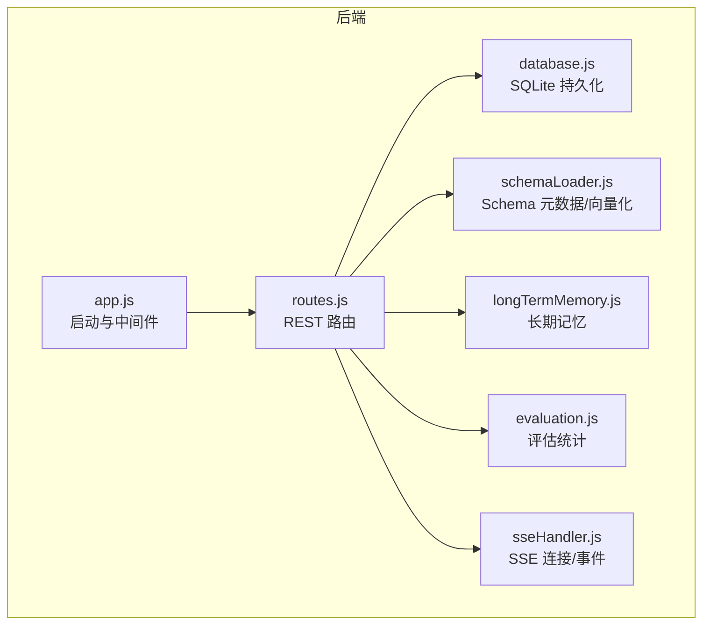
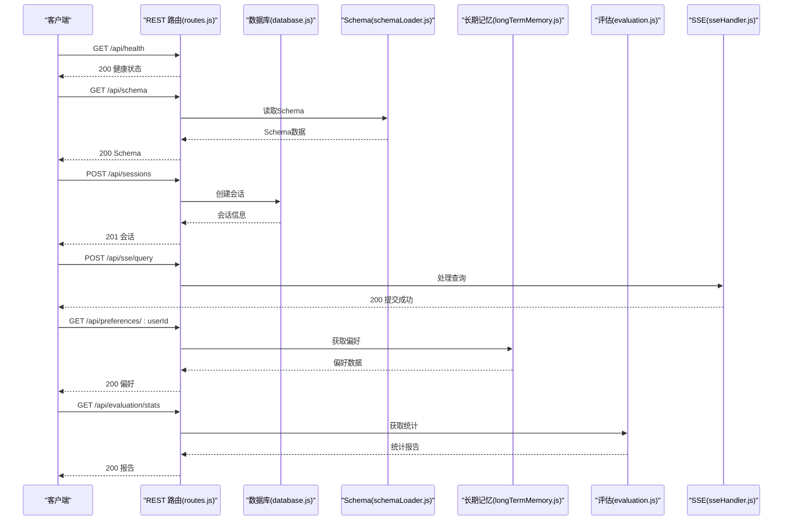
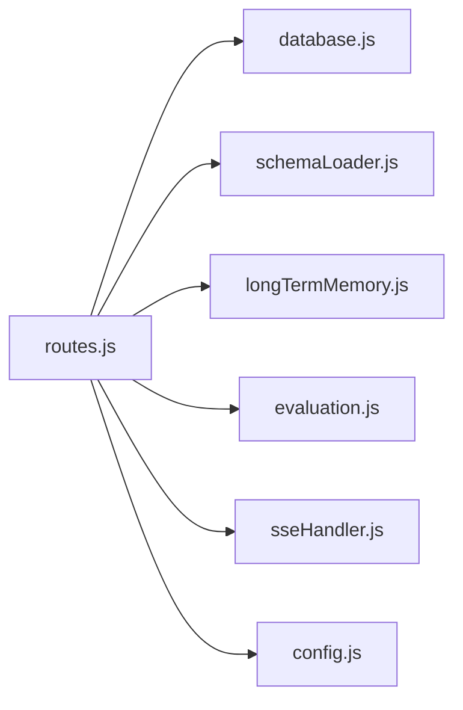

# REST API 接口

<cite>
**本文引用的文件**
- [app.js](file://backend/src/app.js)
- [routes.js](file://backend/src/core/routes.js)
- [database.js](file://backend/src/core/database.js)
- [schemaLoader.js](file://backend/src/core/schemaLoader.js)
- [longTermMemory.js](file://backend/src/memory/longTermMemory.js)
- [evaluation.js](file://backend/src/utils/evaluation.js)
- [config.js](file://backend/src/core/config.js)
- [sseHandler.js](file://backend/src/core/sseHandler.js)
- [api.js](file://frontend/src/utils/api.js)
- [schema-metadata.example.json](file://backend/config/schema-metadata.example.json)
</cite>

## 目录
1. [简介](#简介)
2. [项目结构](#项目结构)
3. [核心组件](#核心组件)
4. [架构总览](#架构总览)
5. [详细组件分析](#详细组件分析)
6. [依赖关系分析](#依赖关系分析)
7. [性能考虑](#性能考虑)
8. [故障排查指南](#故障排查指南)
9. [结论](#结论)
10. [附录](#附录)

## 简介
本文件面向 NL2SQL 服务的 REST API 接口，系统性梳理所有 HTTP 端点，覆盖健康检查、Schema 查询、会话管理、查询历史、用户偏好（长期记忆）、评估统计、配置与 SSE 流式接口。文档包含：
- 每个端点的 HTTP 方法、URL 模式、请求参数、请求体格式与响应结构
- 错误码与状态码说明
- 认证机制、参数校验与数据格式要求
- 客户端集成指南与最佳实践

## 项目结构
后端采用 Express 框架，路由挂载在 /api 前缀下，核心模块包括：
- 路由层：集中定义 REST API
- 数据层：SQLite 会话/消息/历史/偏好持久化
- Schema 层：Schema 元数据加载与向量化检索
- 长期记忆：用户偏好抽取与存储
- 评估：向量化质量与记忆命中率统计
- SSE：流式查询处理与事件推送

图表来源
- [app.js:78-80](file://backend/src/app.js#L78-L80)
- [routes.js:35-36](file://backend/src/core/routes.js#L35-L36)

章节来源
- [app.js:56-80](file://backend/src/app.js#L56-L80)
- [routes.js:16-36](file://backend/src/core/routes.js#L16-L36)

## 核心组件
- 健康检查：/api/health、/api/health/detail
- Schema：/api/schema、/api/schema/tables/:tableName、/api/schema/search
- 会话：/api/sessions、/api/sessions/:sessionId、/api/sessions/:sessionId/messages、/api/users/:userId/sessions
- 查询历史：/api/queries/history
- 用户偏好（长期记忆）：/api/preferences/:userId、/api/preferences/:userId/raw、/api/preferences/:userId/stats、/api/preferences/:userId/templates、/api/preferences/:userId/learn-alias、/api/preferences/:preferenceId
- 评估：/api/evaluation/stats、/api/evaluation/stats/reset、/api/evaluation/schema-quality、/api/evaluation/query-quality、/api/evaluation/config
- 统计：/api/stats
- 配置：/api/config
- SSE：/api/sse/stream、/api/sse/query

章节来源
- [routes.js:57-137](file://backend/src/core/routes.js#L57-L137)
- [routes.js:140-250](file://backend/src/core/routes.js#L140-L250)
- [routes.js:254-398](file://backend/src/core/routes.js#L254-L398)
- [routes.js:400-450](file://backend/src/core/routes.js#L400-L450)
- [routes.js:452-664](file://backend/src/core/routes.js#L452-L664)
- [routes.js:718-803](file://backend/src/core/routes.js#L718-L803)
- [routes.js:858-942](file://backend/src/core/routes.js#L858-L942)
- [routes.js:944-1002](file://backend/src/core/routes.js#L944-L1002)

## 架构总览
后端通过 Express 提供 REST API，SSE 用于流式查询结果推送。数据库采用 SQLite，Schema 元数据来自 JSON 配置并通过向量存储辅助检索。长期记忆模块从查询意图中抽取用户偏好并持久化。

图表来源
- [routes.js:72-94](file://backend/src/core/routes.js#L72-L94)
- [routes.js:150-186](file://backend/src/core/routes.js#L150-L186)
- [routes.js:266-290](file://backend/src/core/routes.js#L266-L290)
- [routes.js:972-1002](file://backend/src/core/routes.js#L972-L1002)
- [routes.js:553-592](file://backend/src/core/routes.js#L553-L592)
- [routes.js:726-740](file://backend/src/core/routes.js#L726-L740)

## 详细组件分析

### 健康检查接口
- GET /api/health
  - 响应字段：status、timestamp、version、uptime、memory.used、memory.total
  - 状态码：200
- GET /api/health/detail
  - 响应字段：status、timestamp、components.database、components.llm、components.schema、components.sse
  - 状态码：200 或 503（任一组件异常）

章节来源
- [routes.js:72-94](file://backend/src/core/routes.js#L72-L94)
- [routes.js:100-137](file://backend/src/core/routes.js#L100-L137)

### Schema 查询接口
- GET /api/schema
  - 查询参数：type（可选，tables|metrics|dimensions）
  - 响应：type=tables 返回 tables；type=metrics 返回 metrics；type=dimensions 返回 dimensions；默认返回完整 Schema
  - 状态码：200
- GET /api/schema/tables/:tableName
  - 路径参数：tableName
  - 响应：table、relatedTables
  - 状态码：200 或 404（表不存在）
- GET /api/schema/search
  - 查询参数：q（关键词，必填）、limit（默认5）
  - 响应：query、count、tables
  - 状态码：200 或 400（缺少 q）、500（搜索失败）

章节来源
- [routes.js:150-186](file://backend/src/core/routes.js#L150-L186)
- [routes.js:192-215](file://backend/src/core/routes.js#L192-L215)
- [routes.js:225-250](file://backend/src/core/routes.js#L225-L250)

### 会话管理接口
- POST /api/sessions
  - 请求体：user_id（可选）、title（可选）
  - 响应：新建会话信息（包含 id、user_id、title）
  - 状态码：201 或 500
- GET /api/sessions/:sessionId
  - 响应：会话信息
  - 状态码：200 或 404
- DELETE /api/sessions/:sessionId
  - 响应：success、message
  - 状态码：200 或 404、500
- GET /api/sessions/:sessionId/messages
  - 查询参数：limit（默认50）
  - 响应：session_id、count、messages
  - 状态码：200 或 500
- GET /api/users/:userId/sessions
  - 查询参数：limit（默认20）
  - 响应：user_id、count、sessions
  - 状态码：200 或 500

章节来源
- [routes.js:266-290](file://backend/src/core/routes.js#L266-L290)
- [routes.js:296-314](file://backend/src/core/routes.js#L296-L314)
- [routes.js:320-345](file://backend/src/core/routes.js#L320-L345)
- [routes.js:354-373](file://backend/src/core/routes.js#L354-L373)
- [routes.js:379-398](file://backend/src/core/routes.js#L379-L398)

### 查询历史接口
- GET /api/queries/history
  - 查询参数：user_id（可选）、session_id（可选）、limit（默认20）
  - 响应：count、history
  - 状态码：200 或 500

章节来源
- [routes.js:413-450](file://backend/src/core/routes.js#L413-L450)

### 用户偏好（长期记忆）接口
- GET /api/preferences/:userId/raw
  - 查询参数：type（可选）
  - 响应：success、user_id、total_count、data.all、data.grouped
  - 状态码：200 或 500
- GET /api/preferences/:userId/stats
  - 响应：success、user_id、data
  - 状态码：200 或 500
- GET /api/preferences/:userId
  - 查询参数：type（可选，query_pattern|field_alias|metric_preference|dimension_preference）、limit（默认50）
  - 响应：success、user_id、data
  - 状态码：200 或 500
- POST /api/preferences/:userId/templates
  - 请求体：name（必填）、dimensions、metrics、default_time_range
  - 响应：success、message、data
  - 状态码：200 或 400、500
- DELETE /api/preferences/:preferenceId
  - 响应：success、message 或 404、error
  - 状态码：200 或 404、500
- POST /api/preferences/:userId/learn-alias
  - 请求体：user_term（必填）、schema_field（必填）、field_type（默认 metric）
  - 响应：success、message、data 或 400、500
  - 状态码：200 或 400、500

章节来源
- [routes.js:461-517](file://backend/src/core/routes.js#L461-L517)
- [routes.js:524-543](file://backend/src/core/routes.js#L524-L543)
- [routes.js:553-592](file://backend/src/core/routes.js#L553-L592)
- [routes.js:606-633](file://backend/src/core/routes.js#L606-L633)
- [routes.js:639-664](file://backend/src/core/routes.js#L639-L664)
- [routes.js:677-716](file://backend/src/core/routes.js#L677-L716)

### 评估接口
- GET /api/evaluation/stats
  - 响应：success、data（统计报告）
  - 状态码：200 或 500
- POST /api/evaluation/stats/reset
  - 响应：success、message
  - 状态码：200 或 500
- POST /api/evaluation/schema-quality
  - 请求体：testQueries（可选，数组）
  - 响应：success、data 或 403（未启用）、500
  - 状态码：200 或 403、500
- POST /api/evaluation/query-quality
  - 请求体：testPairs（可选，数组）
  - 响应：success、data 或 403、500
  - 状态码：200 或 403、500
- GET /api/evaluation/config
  - 响应：success、data（配置）
  - 状态码：200

章节来源
- [routes.js:726-740](file://backend/src/core/routes.js#L726-L740)
- [routes.js:746-760](file://backend/src/core/routes.js#L746-L760)
- [routes.js:771-803](file://backend/src/core/routes.js#L771-L803)
- [routes.js:814-841](file://backend/src/core/routes.js#L814-L841)
- [routes.js:847-856](file://backend/src/core/routes.js#L847-L856)

### 统计信息接口
- GET /api/stats
  - 响应：timestamp、connections.sse、queries.today.*、schema.*、system.*
  - 状态码：200 或 500

章节来源
- [routes.js:866-913](file://backend/src/core/routes.js#L866-L913)

### 配置接口
- GET /api/config
  - 响应：version、llm.*、security.*、features.*
  - 状态码：200

章节来源
- [routes.js:924-942](file://backend/src/core/routes.js#L924-L942)

### SSE 接口
- GET /api/sse/stream
  - 查询参数：session_id（必填）、user_id（可选）
  - 响应：SSE 连接，事件类型：connected、processing、progress、result、error
  - 状态码：200 或 400、404
- POST /api/sse/query
  - 请求体：session_id（必填）、query（必填）
  - 响应：success、message
  - 状态码：200 或 400、500

章节来源
- [routes.js:957-959](file://backend/src/core/routes.js#L957-L959)
- [routes.js:972-1002](file://backend/src/core/routes.js#L972-L1002)

## 依赖关系分析
- 路由依赖：routes.js 依赖 database.js、schemaLoader.js、longTermMemory.js、evaluation.js、sseHandler.js、config.js
- 数据库：database.js 提供 SQLite 表结构与 CRUD 操作
- Schema：schemaLoader.js 负责加载 JSON 元数据、构建映射、向量化与检索
- 长期记忆：longTermMemory.js 从意图中抽取偏好并持久化
- 评估：evaluation.js 提供向量化质量评估与运行时统计
- SSE：sseHandler.js 管理连接、广播消息、进度回调

图表来源
- [routes.js:24-29](file://backend/src/core/routes.js#L24-L29)
- [app.js:40-50](file://backend/src/app.js#L40-L50)

章节来源
- [routes.js:24-29](file://backend/src/core/routes.js#L24-L29)
- [app.js:40-50](file://backend/src/app.js#L40-L50)

## 性能考虑
- 请求体大小限制：body-parser.json({ limit: '10mb' })
- 查询行数限制：config.security.maxQueryRows（默认1000）
- 查询超时：config.security.queryTimeout（默认30000ms）
- 向量检索：Schema 与查询历史向量化，支持智能搜索与重排序
- SSE：Nginx 缓冲禁用（X-Accel-Buffering: no），保证实时推送
- 数据库索引：为 sessions、messages、query_history、user_preferences 建立索引，提升查询性能

章节来源
- [app.js:69](file://backend/src/app.js#L69)
- [config.js:150-157](file://backend/src/core/config.js#L150-L157)
- [database.js:59-165](file://backend/src/core/database.js#L59-L165)
- [sseHandler.js:69](file://backend/src/core/sseHandler.js#L69)

## 故障排查指南
- 400 错误
  - 缺少必要参数（如 session_id、query、q）
  - 请求体为空或格式错误
- 404 错误
  - 会话不存在
  - 表不存在
- 500 错误
  - 数据库操作失败
  - 搜索/评估过程异常
  - 服务器内部错误
- 健康检查
  - /api/health.detail 返回 error 时，检查数据库、LLM 配置、Schema 加载、SSE 连接数
- SSE
  - 连接未建立或会话不存在会导致 400/404
  - 正在处理其他请求时会提示“正在处理其他请求，请稍候”

章节来源
- [routes.js:976-982](file://backend/src/core/routes.js#L976-L982)
- [routes.js:59-94](file://backend/src/core/routes.js#L59-L94)
- [routes.js:100-137](file://backend/src/core/routes.js#L100-L137)
- [routes.js:972-1002](file://backend/src/core/routes.js#L972-L1002)

## 结论
NL2SQL REST API 提供了从健康检查、Schema 查询、会话管理、查询历史、用户偏好到评估统计与 SSE 流式处理的完整能力。通过 SQLite 持久化与向量检索增强，系统在易用性与性能之间取得平衡。建议在生产环境配置白名单、限制行数与超时、启用评估统计，并结合前端 SDK 进行集成。

## 附录

### 认证机制
- 未内置认证中间件，建议在网关或反向代理层添加鉴权（如 JWT、API Key）
- 前端示例中未携带 Authorization 头，可在 axios 拦截器中添加

章节来源
- [api.js:44-57](file://frontend/src/utils/api.js#L44-L57)

### 参数验证与数据格式
- 所有查询参数与请求体均在路由层进行基本校验（必填、类型、范围）
- 数据库操作使用参数化查询，防止 SQL 注入
- 响应统一为 JSON，错误响应包含 error 字段

章节来源
- [routes.js:229-233](file://backend/src/core/routes.js#L229-L233)
- [database.js:361-424](file://backend/src/core/database.js#L361-L424)

### 客户端集成指南
- 基础 URL：/api
- 超时：30000ms
- 建议流程：
  1) 健康检查：GET /api/health
  2) 获取 Schema：GET /api/schema
  3) 创建会话：POST /api/sessions
  4) 发送查询：POST /api/sse/query（SSE 推送结果）
  5) 获取历史：GET /api/queries/history
  6) 获取偏好：GET /api/preferences/:userId
  7) 评估统计：GET /api/evaluation/stats

章节来源
- [api.js:25-34](file://frontend/src/utils/api.js#L25-L34)
- [api.js:98-108](file://frontend/src/utils/api.js#L98-L108)
- [api.js:118-141](file://frontend/src/utils/api.js#L118-L141)
- [api.js:160-195](file://frontend/src/utils/api.js#L160-L195)
- [api.js:206-208](file://frontend/src/utils/api.js#L206-L208)
- [api.js:260-302](file://frontend/src/utils/api.js#L260-L302)

### Schema 元数据示例
- 示例文件包含 tables、relationships、metrics、dimensions 等字段
- 字段支持 name、name_cn、type、description、aggregations、time_granularity 等

章节来源
- [schema-metadata.example.json:1-328](file://backend/config/schema-metadata.example.json#L1-L328)