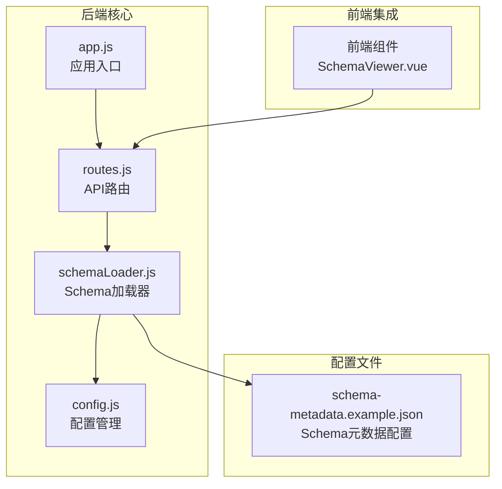
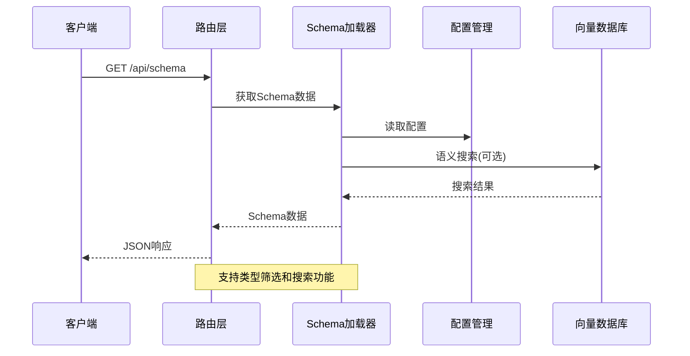
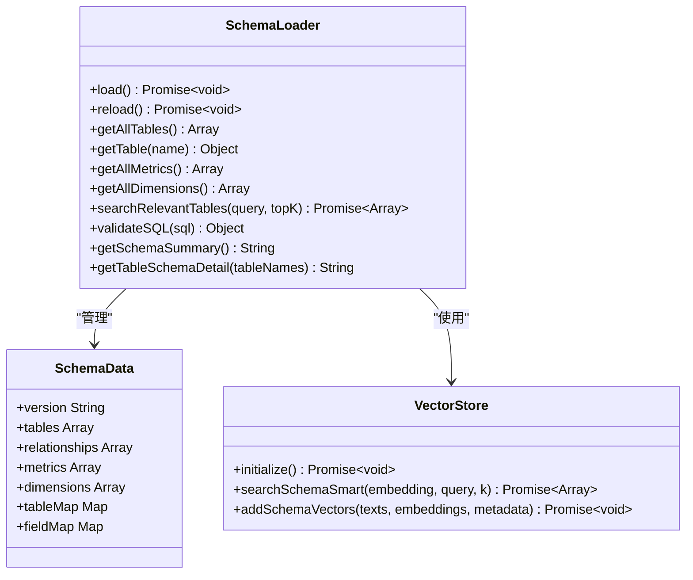
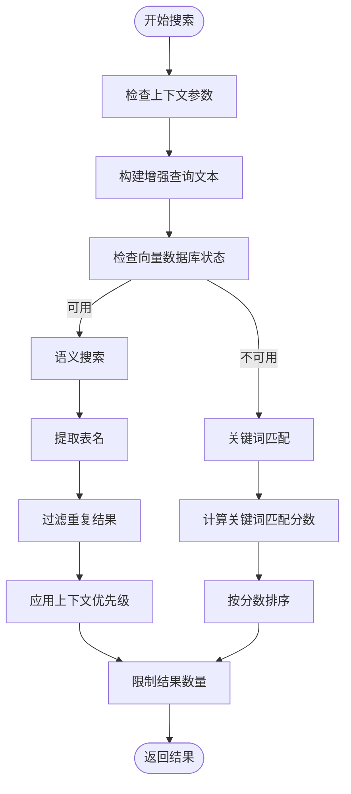
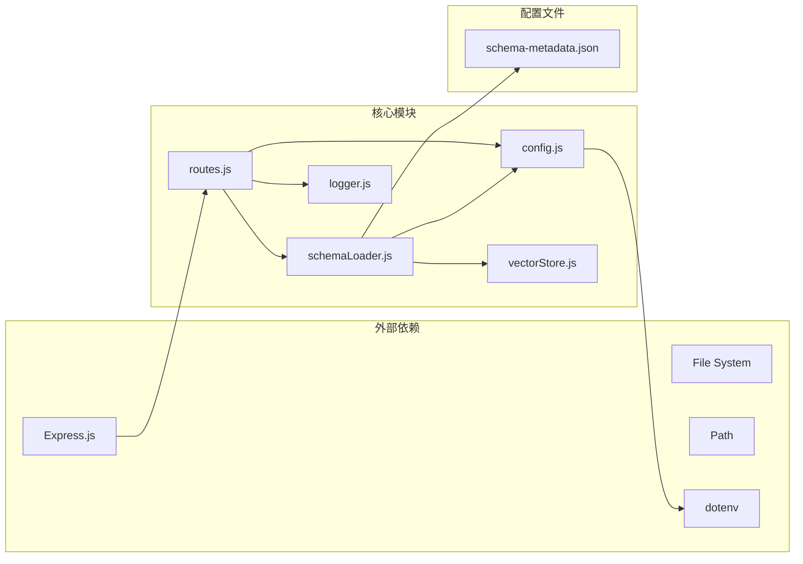

# Schema 管理接口

<cite>
**本文档引用的文件**
- [routes.js](file://backend/src/core/routes.js)
- [schemaLoader.js](file://backend/src/core/schemaLoader.js)
- [schema-metadata.example.json](file://backend/config/schema-metadata.example.json)
- [app.js](file://backend/src/app.js)
- [config.js](file://backend/src/core/config.js)
</cite>

## 目录
1. [简介](#简介)
2. [项目结构](#项目结构)
3. [核心组件](#核心组件)
4. [架构概览](#架构概览)
5. [详细组件分析](#详细组件分析)
6. [依赖分析](#依赖分析)
7. [性能考虑](#性能考虑)
8. [故障排除指南](#故障排除指南)
9. [结论](#结论)

## 简介

Schema 管理接口是 NL2SQL 系统中的核心功能模块，负责提供数据表结构的元数据管理和查询服务。该接口支持获取完整的 Schema 信息、按类型筛选、获取指定表详情以及 Schema 搜索等功能，为自然语言到 SQL 的转换提供了准确的数据结构支撑。

## 项目结构

NL2SQL 项目的 Schema 管理功能主要分布在以下核心文件中：



**图表来源**
- [app.js:78-80](file://backend/src/app.js#L78-L80)
- [routes.js:23-24](file://backend/src/core/routes.js#L23-L24)
- [schemaLoader.js:15-26](file://backend/src/core/schemaLoader.js#L15-L26)

**章节来源**
- [app.js:78-80](file://backend/src/app.js#L78-L80)
- [routes.js:140-186](file://backend/src/core/routes.js#L140-L186)

## 核心组件

### Schema 元数据结构

Schema 系统采用标准化的 JSON 配置格式，包含以下核心组成部分：

#### 表定义 (Tables)
- **name**: 表的英文名称
- **name_cn**: 表的中文名称
- **description**: 表的功能描述
- **fields**: 字段数组，包含字段定义

#### 字段定义 (Fields)
- **name**: 字段的英文名称
- **name_cn**: 字段的中文名称
- **type**: 字段的数据类型
- **description**: 字段的功能描述
- **is_primary**: 是否为主键
- **foreign_key**: 外键关联
- **aggregations**: 支持的聚合函数
- **time_granularity**: 支持的时间粒度

#### 关系定义 (Relationships)
- **from**: 源表字段
- **to**: 目标表字段
- **type**: 关系类型 (MANY_TO_ONE)
- **description**: 关系描述

#### 指标定义 (Metrics)
- **name**: 指标的英文名称
- **name_cn**: 指标的中文名称
- **definition**: 指标的计算定义
- **description**: 指标的业务含义
- **unit**: 指标的单位

#### 维度定义 (Dimensions)
- **name**: 维度的英文名称
- **name_cn**: 维度的中文名称
- **fields**: 维度包含的字段数组
- **granularities**: 支持的时间粒度
- **hierarchy**: 层级关系

**章节来源**
- [schema-metadata.example.json:1-328](file://backend/config/schema-metadata.example.json#L1-L328)

### Schema 类型说明

Schema 系统定义了三种核心类型，每种类型服务于不同的业务场景：

#### Tables 类型
- **用途**: 提供完整的数据库表结构信息
- **包含内容**: 所有表的定义、字段详情、关系映射
- **适用场景**: 全面了解数据库结构、表间关联关系

#### Metrics 类型
- **用途**: 提供预定义的业务指标定义
- **包含内容**: 指标名称、计算公式、业务含义、单位
- **适用场景**: 业务指标查询、数据分析、报表生成

#### Dimensions 类型
- **用途**: 提供维度建模信息
- **包含内容**: 维度字段、层级关系、时间粒度
- **适用场景**: 维度分析、层次化查询、多维报表

**章节来源**
- [routes.js:155-185](file://backend/src/core/routes.js#L155-L185)

## 架构概览

Schema 管理接口采用分层架构设计，确保了良好的可维护性和扩展性：



**图表来源**
- [routes.js:143-186](file://backend/src/core/routes.js#L143-L186)
- [schemaLoader.js:567-657](file://backend/src/core/schemaLoader.js#L567-L657)

## 详细组件分析

### API 端点详解

#### 获取完整 Schema 接口

**端点**: `GET /api/schema`

**功能**: 返回完整的 Schema 元数据信息

**查询参数**:
- `type`: 类型筛选参数，可选值
  - `tables`: 仅返回表定义
  - `metrics`: 仅返回指标定义
  - `dimensions`: 仅返回维度定义

**响应结构**:
```json
{
  "version": "1.0",
  "tables": [...],
  "metrics": [...],
  "dimensions": [...]
}
```

**错误处理**:
- 成功: 返回 200 状态码
- 参数错误: 返回 400 状态码

**章节来源**
- [routes.js:143-186](file://backend/src/core/routes.js#L143-L186)

#### 获取指定表详情接口

**端点**: `GET /api/schema/tables/:tableName`

**功能**: 返回指定表的详细信息和关联表

**路径参数**:
- `tableName`: 表的名称（支持英文名或中文名）

**响应结构**:
```json
{
  "table": {
    "name": "sales_order",
    "name_cn": "销售订单表",
    "description": "记录所有销售订单的主表",
    "fields": [...]
  },
  "relatedTables": ["users", "region", "products"]
}
```

**错误处理**:
- 表存在: 返回 200 状态码
- 表不存在: 返回 404 状态码，包含错误信息

**章节来源**
- [routes.js:188-215](file://backend/src/core/routes.js#L188-L215)

#### Schema 搜索接口

**端点**: `GET /api/schema/search`

**功能**: 基于关键词搜索相关的表

**查询参数**:
- `q`: 搜索关键词（必填）
- `limit`: 返回结果数量限制，默认 5

**响应结构**:
```json
{
  "query": "销售订单",
  "count": 3,
  "tables": [
    {
      "name": "sales_order",
      "name_cn": "销售订单表",
      "description": "记录所有销售订单的主表",
      "fields": [...]
    }
  ]
}
```

**错误处理**:
- 成功: 返回 200 状态码
- 缺少关键词: 返回 400 状态码
- 搜索失败: 返回 500 状态码

**章节来源**
- [routes.js:217-250](file://backend/src/core/routes.js#L217-L250)

### Schema 加载器组件

Schema 加载器是整个系统的核心组件，负责处理 Schema 元数据的加载、验证和查询：



**图表来源**
- [schemaLoader.js:36-51](file://backend/src/core/schemaLoader.js#L36-L51)
- [schemaLoader.js:1043-1071](file://backend/src/core/schemaLoader.js#L1043-L1071)

**章节来源**
- [schemaLoader.js:69-122](file://backend/src/core/schemaLoader.js#L69-L122)
- [schemaLoader.js:437-477](file://backend/src/core/schemaLoader.js#L437-L477)

### 搜索算法实现

Schema 搜索功能采用了混合算法，结合了语义搜索和关键词匹配：



**图表来源**
- [schemaLoader.js:567-657](file://backend/src/core/schemaLoader.js#L567-L657)

**章节来源**
- [schemaLoader.js:567-714](file://backend/src/core/schemaLoader.js#L567-L714)

## 依赖分析

Schema 管理接口的依赖关系展现了清晰的模块化设计：



**图表来源**
- [routes.js:17-29](file://backend/src/core/routes.js#L17-L29)
- [schemaLoader.js:15-26](file://backend/src/core/schemaLoader.js#L15-L26)

**章节来源**
- [routes.js:17-29](file://backend/src/core/routes.js#L17-L29)
- [schemaLoader.js:15-26](file://backend/src/core/schemaLoader.js#L15-L26)

## 性能考虑

### 缓存机制

Schema 系统实现了智能缓存机制，确保高性能的查询体验：

- **缓存启用**: 通过配置项 `enableCache` 控制
- **缓存过期**: 默认 1 小时过期时间
- **缓存检查**: `isCacheExpired()` 方法检查缓存有效性
- **重新加载**: `reload()` 方法支持动态重新加载

### 向量搜索优化

为了提升搜索性能，系统集成了向量数据库：

- **批量处理**: Embedding 向量分批获取，批次大小为 20
- **智能过滤**: 支持基于域标签和数据类型的过滤
- **优先级排序**: 根据上下文信息调整结果优先级

### 内存管理

- **映射优化**: 使用 Map 结构实现 O(1) 查找性能
- **字段索引**: 构建表名和字段名的双向映射
- **内存清理**: 定期清理过期缓存和临时数据

## 故障排除指南

### 常见错误及解决方案

#### Schema 文件加载失败
**症状**: 服务启动时报错，提示 Schema 配置文件不存在
**原因**: 配置文件路径不正确或文件缺失
**解决方案**:
1. 检查 `SCHEMA_CONFIG_PATH` 环境变量
2. 确认配置文件存在且格式正确
3. 验证文件权限设置

#### 表不存在错误
**症状**: 访问 `/api/schema/tables/:tableName` 返回 404 错误
**原因**: 表名拼写错误或表不存在
**解决方案**:
1. 检查表名是否正确
2. 确认表名支持中文和英文两种形式
3. 使用完整 Schema 接口验证表是否存在

#### 搜索功能异常
**症状**: `/api/schema/search` 接口返回 500 错误
**原因**: 向量数据库初始化失败或 LLM API 配置错误
**解决方案**:
1. 检查向量数据库配置
2. 验证 LLM API 密钥和基础 URL
3. 确认网络连接正常

### 调试技巧

#### 启用详细日志
- 设置 `LOG_LEVEL=debug` 获取详细调试信息
- 检查 `./logs/app.log` 文件获取错误详情

#### 验证配置
使用健康检查接口验证系统状态：
```bash
curl http://localhost:3000/api/health/detail
```

**章节来源**
- [routes.js:99-137](file://backend/src/core/routes.js#L99-L137)
- [config.js:366-388](file://backend/src/core/config.js#L366-L388)

## 结论

Schema 管理接口为 NL2SQL 系统提供了强大的数据结构支撑，通过标准化的元数据管理和智能搜索功能，有效提升了自然语言到 SQL 转换的准确性和效率。系统采用模块化设计，具有良好的可扩展性和维护性，能够适应不同规模和复杂度的业务需求。

通过合理的配置管理和性能优化策略，Schema 管理接口能够在保证功能完整性的同时，提供稳定的性能表现，为整个 NL2SQL 系统奠定坚实的数据基础。