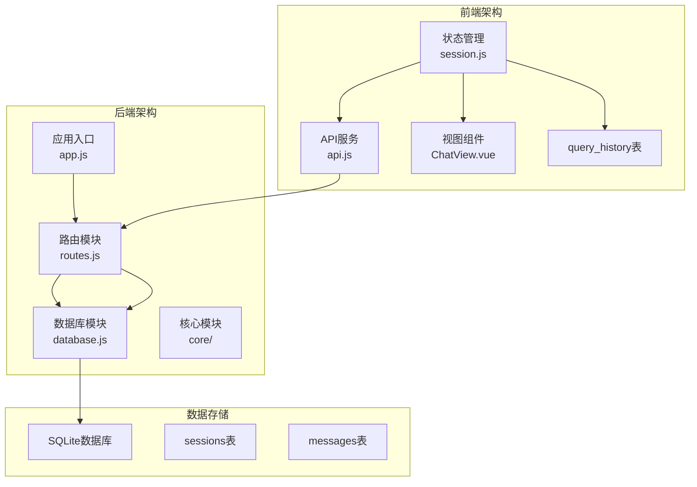
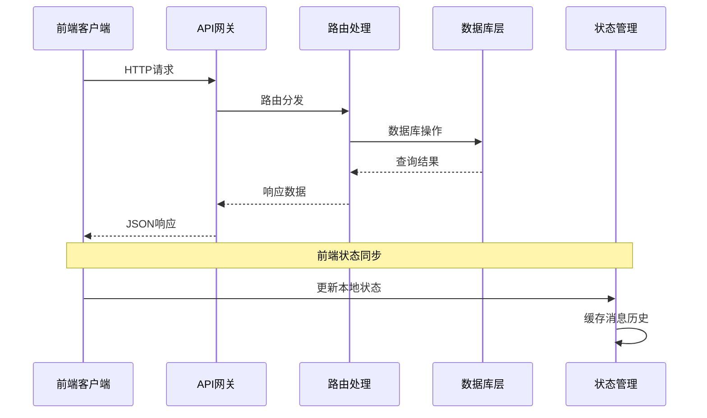
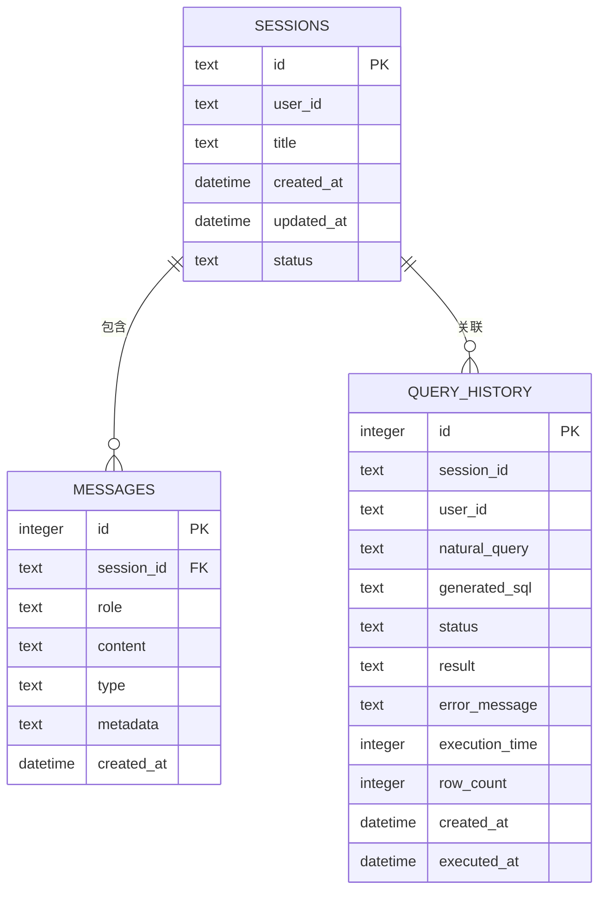
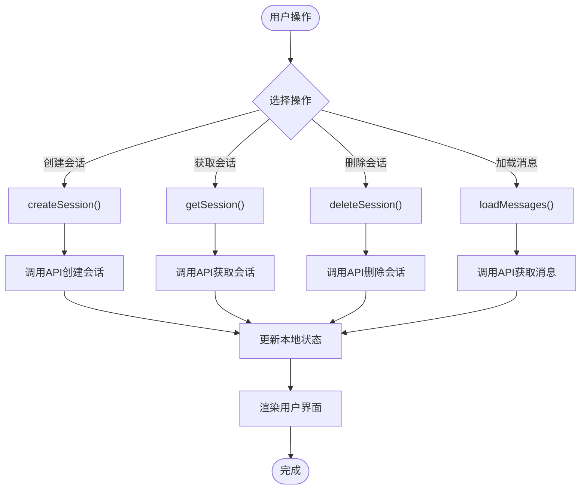
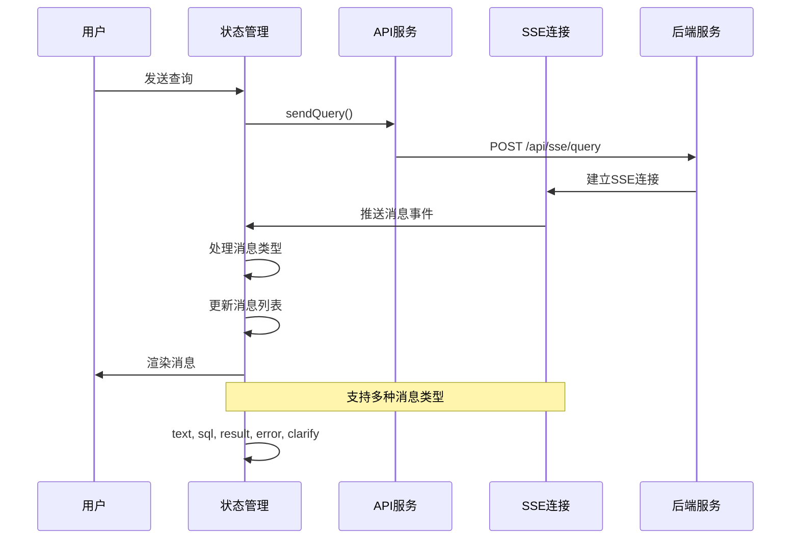
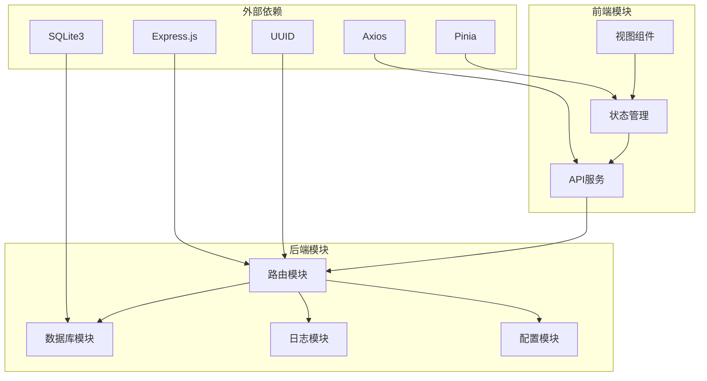

# 会话管理接口

<cite>
**本文档引用的文件**
- [routes.js](file://backend/src/core/routes.js)
- [database.js](file://backend/src/core/database.js)
- [session.js](file://frontend/src/stores/session.js)
- [api.js](file://frontend/src/utils/api.js)
- [ChatView.vue](file://frontend/src/views/ChatView.vue)
- [HistoryView.vue](file://frontend/src/views/HistoryView.vue)
- [package.json](file://backend/package.json)
</cite>

## 目录
1. [简介](#简介)
2. [项目结构](#项目结构)
3. [核心组件](#核心组件)
4. [架构概览](#架构概览)
5. [详细组件分析](#详细组件分析)
6. [依赖关系分析](#依赖关系分析)
7. [性能考虑](#性能考虑)
8. [故障排除指南](#故障排除指南)
9. [结论](#结论)

## 简介

会话管理接口是NL2SQL系统中的核心功能模块，负责管理用户与系统的对话会话。该模块提供了完整的RESTful API接口，支持会话的创建、查询、删除以及消息历史管理等功能。系统采用前后端分离架构，后端使用Node.js + Express提供API服务，前端使用Vue.js构建用户界面。

## 项目结构

NL2SQL项目的会话管理功能分布在以下关键位置：



**图表来源**
- [routes.js:1-1037](file://backend/src/core/routes.js#L1-L1037)
- [database.js:1-850](file://backend/src/core/database.js#L1-L850)

**章节来源**
- [routes.js:1-1037](file://backend/src/core/routes.js#L1-L1037)
- [package.json:1-28](file://backend/package.json#L1-L28)

## 核心组件

### 后端路由组件

后端通过Express框架提供RESTful API接口，主要包含以下会话管理端点：

- **POST /api/sessions** - 创建新会话
- **GET /api/sessions/:sessionId** - 获取会话信息  
- **DELETE /api/sessions/:sessionId** - 删除会话
- **GET /api/sessions/:sessionId/messages** - 获取会话消息历史
- **GET /api/users/:userId/sessions** - 获取用户会话列表

### 前端状态管理组件

前端使用Pinia状态管理库维护会话状态，包括：
- 会话列表管理
- 当前会话状态
- 消息历史缓存
- SSE连接管理

### 数据库组件

系统使用SQLite作为数据存储，包含三个核心表：
- **sessions表** - 存储会话基本信息
- **messages表** - 存储会话消息历史
- **query_history表** - 存储查询历史记录

**章节来源**
- [routes.js:252-398](file://backend/src/core/routes.js#L252-L398)
- [database.js:447-596](file://backend/src/core/database.js#L447-L596)

## 架构概览

会话管理系统的整体架构采用分层设计：



**图表来源**
- [routes.js:266-398](file://backend/src/core/routes.js#L266-L398)
- [session.js:103-171](file://frontend/src/stores/session.js#L103-L171)

## 详细组件分析

### 会话数据模型

会话管理系统的核心数据结构如下：



**图表来源**
- [database.js:44-134](file://backend/src/core/database.js#L44-L134)

#### 会话状态管理

会话具有以下状态：
- **active** - 活跃状态，可正常进行对话
- **archived** - 归档状态，不可修改但可查看
- **deleted** - 删除状态，物理删除

#### 消息类型系统

消息支持多种类型：
- **text** - 文本消息
- **sql** - SQL代码消息
- **result** - 查询结果消息
- **error** - 错误消息
- **clarify** - 需要澄清的消息

**章节来源**
- [database.js:44-134](file://backend/src/core/database.js#L44-L134)

### API端点详细说明

#### 创建会话接口

**端点**: `POST /api/sessions`

**请求体**:
```json
{
  "user_id": "用户ID",
  "title": "会话标题（可选）"
}
```

**响应**:
```json
{
  "id": "会话ID",
  "user_id": "用户ID",
  "title": "会话标题",
  "created_at": "创建时间",
  "updated_at": "更新时间",
  "status": "active"
}
```

**章节来源**
- [routes.js:266-290](file://backend/src/core/routes.js#L266-L290)
- [database.js:458-466](file://backend/src/core/database.js#L458-L466)

#### 获取会话信息接口

**端点**: `GET /api/sessions/:sessionId`

**路径参数**:
- `sessionId` - 会话唯一标识符

**响应**:
```json
{
  "id": "会话ID",
  "user_id": "用户ID",
  "title": "会话标题",
  "created_at": "创建时间",
  "updated_at": "更新时间",
  "status": "active"
}
```

**章节来源**
- [routes.js:296-314](file://backend/src/core/routes.js#L296-L314)
- [database.js:473-476](file://backend/src/core/database.js#L473-L476)

#### 删除会话接口

**端点**: `DELETE /api/sessions/:sessionId`

**响应**:
```json
{
  "success": true,
  "message": "会话已删除"
}
```

**章节来源**
- [routes.js:320-345](file://backend/src/core/routes.js#L320-L345)
- [database.js:521-540](file://backend/src/core/database.js#L521-L540)

#### 获取会话消息历史接口

**端点**: `GET /api/sessions/:sessionId/messages`

**查询参数**:
- `limit` - 返回消息数量限制（默认50）

**响应**:
```json
{
  "session_id": "会话ID",
  "count": 10,
  "messages": [
    {
      "id": 1,
      "session_id": "会话ID",
      "role": "user",
      "content": "查询内容",
      "type": "text",
      "metadata": null,
      "created_at": "2024-01-01T00:00:00Z"
    }
  ]
}
```

**章节来源**
- [routes.js:354-373](file://backend/src/core/routes.js#L354-L373)
- [database.js:582-596](file://backend/src/core/database.js#L582-L596)

#### 获取用户会话列表接口

**端点**: `GET /api/users/:userId/sessions`

**路径参数**:
- `userId` - 用户唯一标识符

**查询参数**:
- `limit` - 返回会话数量限制（默认20）

**响应**:
```json
{
  "user_id": "用户ID",
  "count": 5,
  "sessions": [
    {
      "id": "会话ID",
      "user_id": "用户ID",
      "title": "会话标题",
      "created_at": "创建时间",
      "updated_at": "更新时间",
      "status": "active"
    }
  ]
}
```

**章节来源**
- [routes.js:379-398](file://backend/src/core/routes.js#L379-L398)
- [database.js:484-492](file://backend/src/core/database.js#L484-L492)

### 前端集成组件

#### 会话状态管理

前端使用Pinia管理会话状态，提供以下核心功能：



**图表来源**
- [session.js:118-171](file://frontend/src/stores/session.js#L118-L171)
- [api.js:160-195](file://frontend/src/utils/api.js#L160-L195)

#### 消息处理流程

前端通过SSE（Server-Sent Events）实现实时消息推送：



**图表来源**
- [session.js:185-295](file://frontend/src/stores/session.js#L185-L295)
- [ChatView.vue:196-214](file://frontend/src/views/ChatView.vue#L196-L214)

**章节来源**
- [session.js:1-400](file://frontend/src/stores/session.js#L1-L400)
- [api.js:147-251](file://frontend/src/utils/api.js#L147-L251)

## 依赖关系分析

会话管理系统的依赖关系如下：



**图表来源**
- [package.json:10-20](file://backend/package.json#L10-L20)
- [routes.js:16-30](file://backend/src/core/routes.js#L16-L30)

### 核心依赖说明

- **Express.js**: 提供Web服务器和路由功能
- **SQLite3**: 轻量级数据库，无需额外服务
- **UUID**: 生成会话唯一标识符
- **Axios**: 前端HTTP客户端
- **Pinia**: Vue.js状态管理库

**章节来源**
- [package.json:10-20](file://backend/package.json#L10-L20)

## 性能考虑

### 数据库优化

系统采用以下数据库优化策略：

1. **索引优化**: 为常用查询字段创建索引
   - `sessions`: user_id, status, updated_at
   - `messages`: session_id, created_at
   - `query_history`: user_id, session_id, created_at, status

2. **事务处理**: 使用事务保证数据一致性
3. **参数化查询**: 防止SQL注入攻击
4. **连接池管理**: 合理管理数据库连接

### 前端性能优化

1. **状态缓存**: 前端缓存会话和消息数据
2. **懒加载**: 按需加载会话历史
3. **虚拟滚动**: 大量消息时使用虚拟滚动
4. **SSE连接复用**: 复用SSE连接减少资源消耗

## 故障排除指南

### 常见问题及解决方案

#### 会话创建失败

**症状**: 创建会话返回500错误

**可能原因**:
1. 数据库连接异常
2. UUID生成失败
3. 数据库表结构问题

**解决步骤**:
1. 检查数据库连接状态
2. 验证数据库表结构
3. 查看后端日志

#### 会话查询失败

**症状**: 获取会话信息返回404

**可能原因**:
1. 会话ID不存在
2. 会话状态为非active
3. 数据库连接问题

**解决步骤**:
1. 验证会话ID格式
2. 检查会话状态
3. 重新创建会话

#### 消息获取异常

**症状**: 获取消息历史为空

**可能原因**:
1. 会话ID错误
2. 消息数量超过限制
3. 数据库查询异常

**解决步骤**:
1. 确认会话ID正确性
2. 增加limit参数
3. 检查数据库状态

**章节来源**
- [routes.js:284-344](file://backend/src/core/routes.js#L284-L344)
- [database.js:200-261](file://backend/src/core/database.js#L200-L261)

## 结论

NL2SQL系统的会话管理接口提供了完整的对话会话生命周期管理功能。通过RESTful API设计和前后端分离架构，系统实现了高效、可靠的会话管理能力。

### 主要特性总结

1. **完整的会话生命周期**: 支持创建、查询、更新、删除会话
2. **消息历史管理**: 提供完整的对话历史记录和查询
3. **实时消息推送**: 通过SSE实现实时消息传输
4. **状态管理**: 前后端协同的状态管理机制
5. **数据持久化**: 基于SQLite的可靠数据存储

### 技术优势

- **轻量级架构**: 使用SQLite无需额外数据库服务
- **实时通信**: SSE提供高效的实时消息推送
- **状态同步**: 前后端状态管理确保用户体验一致性
- **扩展性**: 模块化设计便于功能扩展

该会话管理接口为NL2SQL系统提供了坚实的基础，支持自然语言到SQL的转换功能，为用户提供流畅的对话式数据分析体验。