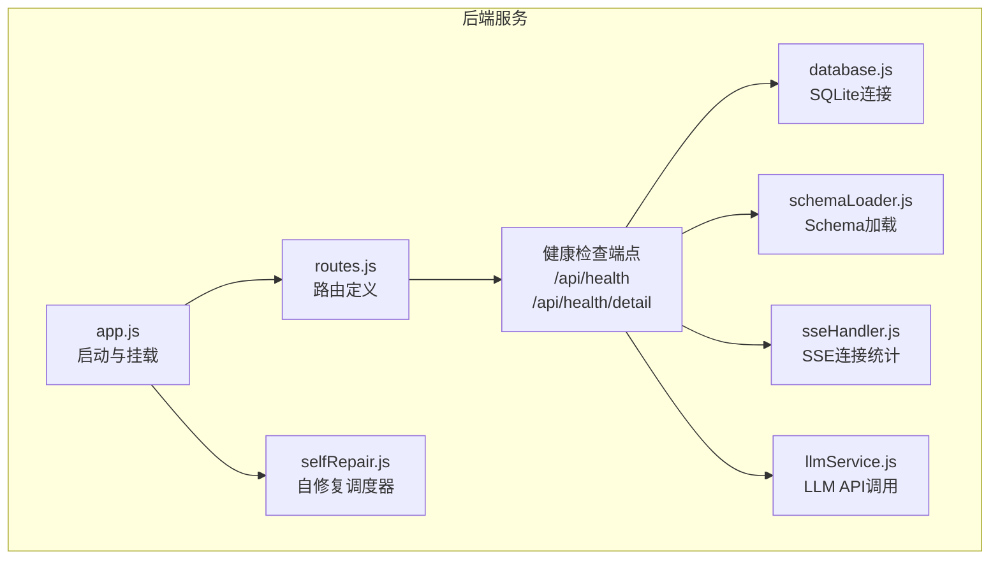
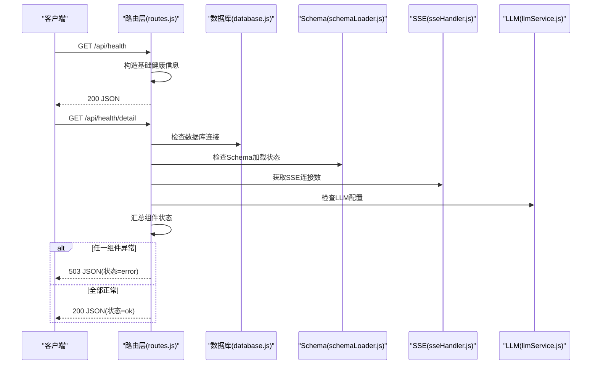
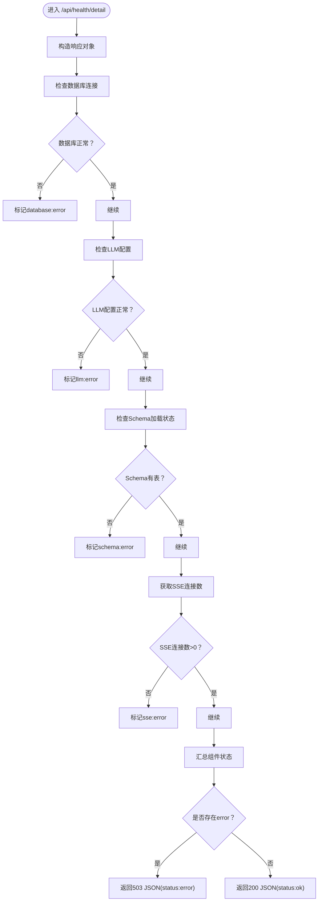
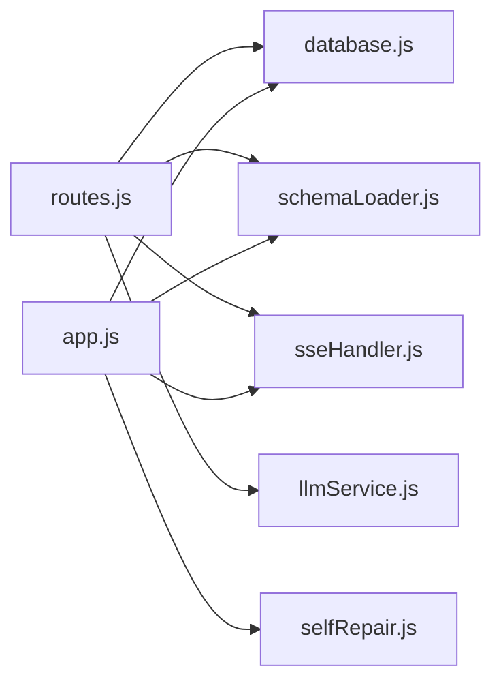

# 健康检查接口

<cite>
**本文档引用的文件**
- [routes.js](file://backend/src/core/routes.js)
- [app.js](file://backend/src/app.js)
- [schemaLoader.js](file://backend/src/core/schemaLoader.js)
- [sseHandler.js](file://backend/src/core/sseHandler.js)
- [database.js](file://backend/src/core/database.js)
- [llmService.js](file://backend/src/core/llmService.js)
- [selfRepair.js](file://backend/src/core/selfRepair.js)
- [config.js](file://backend/src/core/config.js)
</cite>

## 目录
1. [简介](#简介)
2. [项目结构](#项目结构)
3. [核心组件](#核心组件)
4. [架构总览](#架构总览)
5. [详细组件分析](#详细组件分析)
6. [依赖关系分析](#依赖关系分析)
7. [性能考量](#性能考量)
8. [故障排查指南](#故障排查指南)
9. [结论](#结论)

## 简介
本文档面向运维与开发人员，系统性说明 NL2SQL 服务的健康检查 API 接口，重点覆盖：
- /api/health：基础健康检查，返回服务运行状态与基本指标
- /api/health/detail：详细健康检查，包含数据库、LLM API、Schema 加载、SSE 连接等组件状态

文档将解释各组件状态判定逻辑、响应格式、请求/响应示例以及监控价值与故障排查方法。

## 项目结构
后端采用 Express 框架，路由集中于 core/routes.js，健康检查接口在此处定义并通过 app.js 挂载到 /api 前缀下。各组件状态由对应模块提供状态信息，如数据库连接、Schema 加载、SSE 连接数等。

图表来源
- [app.js:78-80](file://backend/src/app.js#L78-L80)
- [routes.js:72-137](file://backend/src/core/routes.js#L72-L137)
- [database.js:200-261](file://backend/src/core/database.js#L200-L261)
- [schemaLoader.js:69-122](file://backend/src/core/schemaLoader.js#L69-L122)
- [sseHandler.js:291-297](file://backend/src/core/sseHandler.js#L291-L297)
- [llmService.js:222-299](file://backend/src/core/llmService.js#L222-L299)
- [selfRepair.js:60-125](file://backend/src/core/selfRepair.js#L60-L125)

章节来源
- [app.js:78-80](file://backend/src/app.js#L78-L80)
- [routes.js:72-137](file://backend/src/core/routes.js#L72-L137)

## 核心组件
- 健康检查端点
  - GET /api/health：返回服务基础状态、时间戳、版本、运行时长与内存使用
  - GET /api/health/detail：返回各组件状态（数据库、LLM API、Schema、SSE）
- 组件状态来源
  - 数据库：通过 database.js 的连接初始化与查询能力判断
  - LLM API：通过 llmService.js 的 API 调用配置与可用性判断
  - Schema：通过 schemaLoader.js 的加载状态与表数量判断
  - SSE：通过 sseHandler.js 的连接计数判断

章节来源
- [routes.js:72-137](file://backend/src/core/routes.js#L72-L137)
- [database.js:200-261](file://backend/src/core/database.js#L200-L261)
- [schemaLoader.js:69-122](file://backend/src/core/schemaLoader.js#L69-L122)
- [sseHandler.js:291-297](file://backend/src/core/sseHandler.js#L291-L297)
- [llmService.js:222-299](file://backend/src/core/llmService.js#L222-L299)

## 架构总览
健康检查接口位于路由层，调用各子系统状态信息，最终统一返回给客户端。详细健康检查还会根据组件状态汇总整体健康状态。

图表来源
- [routes.js:72-137](file://backend/src/core/routes.js#L72-L137)
- [database.js:200-261](file://backend/src/core/database.js#L200-L261)
- [schemaLoader.js:69-122](file://backend/src/core/schemaLoader.js#L69-L122)
- [sseHandler.js:291-297](file://backend/src/core/sseHandler.js#L291-L297)
- [llmService.js:222-299](file://backend/src/core/llmService.js#L222-L299)

## 详细组件分析

### 健康检查端点定义与行为
- /api/health
  - 方法：GET
  - 响应字段
    - status：固定为 ok
    - timestamp：ISO 时间字符串
    - version：服务版本
    - uptime：进程运行时间（秒）
    - memory：对象
      - used：已用内存（MB）
      - total：总内存（MB）
  - 响应示例（成功）
    - {
        "status": "ok",
        "timestamp": "2025-01-01T00:00:00.000Z",
        "version": "1.0.0",
        "uptime": 1234.56,
        "memory": {
          "used": 128,
          "total": 512
        }
      }
- /api/health/detail
  - 方法：GET
  - 响应字段
    - status：ok 或 error
    - timestamp：ISO 时间字符串
    - components：对象
      - database：{
          status: "ok|error",
          message: "SQLite连接正常"
        }
      - llm：{
          status: "ok|error",
          message: "LLM API配置正常"
        }
      - schema：{
          status: "ok|error",
          tables: 数字（表数量）
        }
      - sse：{
          status: "ok|error",
          connections: 数字（SSE连接数）
        }
  - 响应示例（成功）
    - {
        "status": "ok",
        "timestamp": "2025-01-01T00:00:00.000Z",
        "components": {
          "database": {"status":"ok","message":"SQLite连接正常"},
          "llm": {"status":"ok","message":"LLM API配置正常"},
          "schema": {"status":"ok","tables":10},
          "sse": {"status":"ok","connections":3}
        }
      }
  - 响应示例（失败）
    - {
        "status": "error",
        "timestamp": "2025-01-01T00:00:00.000Z",
        "components": {
          "database": {"status":"ok","message":"SQLite连接正常"},
          "llm": {"status":"error","message":"LLM API密钥未配置"},
          "schema": {"status":"ok","tables":10},
          "sse": {"status":"ok","connections":3}
        }
      }

章节来源
- [routes.js:72-137](file://backend/src/core/routes.js#L72-L137)

### 组件状态判定逻辑
- 数据库（database）
  - 判定依据：数据库模块初始化成功且可执行查询
  - 实现参考：database.js 的 initialize 与 query 方法
- LLM API（llmService）
  - 判定依据：路由层健康检查仅检查配置可用性（密钥与基础URL存在），不实际调用 API
  - 实现参考：llmService.js 的 chat/getEmbedding 配置读取
- Schema（schemaLoader）
  - 判定依据：Schema 加载成功且表数量 > 0
  - 实现参考：schemaLoader.js 的 load 与 getAllTables
- SSE（sseHandler）
  - 判定依据：SSE 连接计数
  - 实现参考：sseHandler.js 的 getConnectionCount

章节来源
- [routes.js:106-126](file://backend/src/core/routes.js#L106-L126)
- [database.js:200-261](file://backend/src/core/database.js#L200-L261)
- [schemaLoader.js:69-122](file://backend/src/core/schemaLoader.js#L69-L122)
- [sseHandler.js:291-297](file://backend/src/core/sseHandler.js#L291-L297)
- [llmService.js:222-299](file://backend/src/core/llmService.js#L222-L299)

### 详细健康检查流程图

图表来源
- [routes.js:100-137](file://backend/src/core/routes.js#L100-L137)

## 依赖关系分析
- 路由层依赖
  - database.js：用于数据库连接可用性判断
  - schemaLoader.js：用于 Schema 加载状态与表数量
  - sseHandler.js：用于 SSE 连接统计
  - llmService.js：用于 LLM 配置可用性判断
- 启动流程
  - app.js 在启动时初始化数据库、向量库、Schema 加载与自修复调度器，随后挂载路由

图表来源
- [routes.js:24-27](file://backend/src/core/routes.js#L24-L27)
- [app.js:44-50](file://backend/src/app.js#L44-L50)

章节来源
- [routes.js:24-27](file://backend/src/core/routes.js#L24-L27)
- [app.js:44-50](file://backend/src/app.js#L44-L50)

## 性能考量
- 健康检查本身为轻量级操作，不涉及复杂计算或外部 I/O，通常响应时间极短
- 详细健康检查会读取连接数与表数量，属于 O(1) 或 O(n)（n 为表数量）级别的操作，通常不会成为瓶颈
- 若部署在高并发场景，建议结合负载均衡与探针配置，避免过于频繁的健康检查造成压力

## 故障排查指南
- /api/health 返回 200，但 /api/health/detail 返回 503
  - 检查数据库连接：确认数据库初始化成功且可查询
  - 检查 Schema 加载：确认 Schema 文件存在且加载成功
  - 检查 LLM 配置：确认 LLM API 密钥与基础 URL 已正确配置
  - 检查 SSE 连接：确认有活跃连接或至少有一个连接
- 常见错误与定位
  - 数据库异常：查看数据库初始化日志与连接错误
  - Schema 异常：确认 Schema 配置文件路径与格式正确
  - LLM 异常：确认 API 密钥有效、网络可达、超时配置合理
  - SSE 异常：确认有客户端连接，或检查连接建立与关闭流程
- 监控建议
  - 将健康检查纳入监控告警，关注 status 字段变化
  - 结合自修复调度器的日志，定期分析系统健康趋势
  - 关注内存使用与连接数，避免资源耗尽

章节来源
- [routes.js:106-137](file://backend/src/core/routes.js#L106-L137)
- [selfRepair.js:169-310](file://backend/src/core/selfRepair.js#L169-L310)

## 结论
健康检查接口为 NL2SQL 服务提供了快速、统一的运行状态观测手段。基础健康检查适合快速确认服务可用性，详细健康检查则能帮助定位具体组件问题。结合自修复调度器与日志系统，可实现持续的系统健康监控与自动化维护。