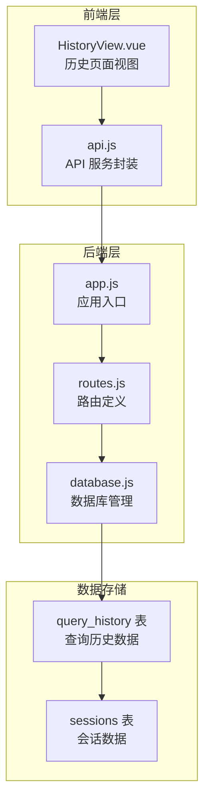
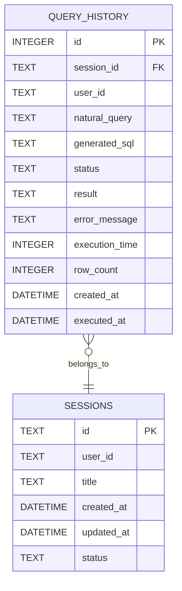
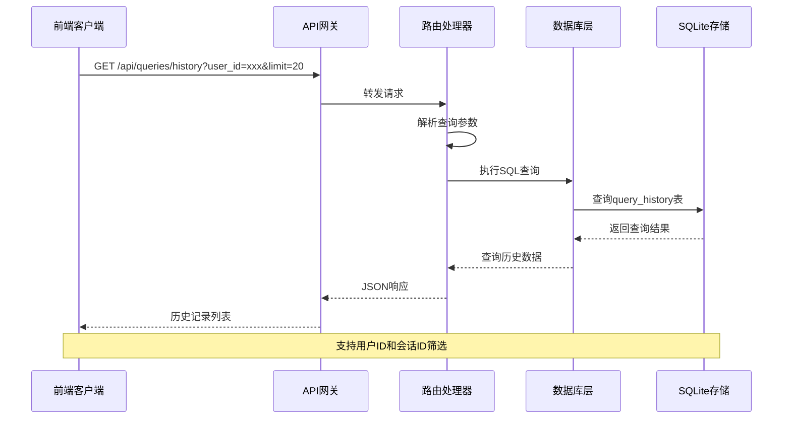
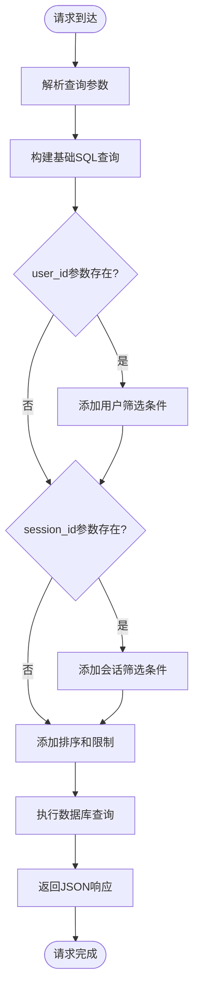
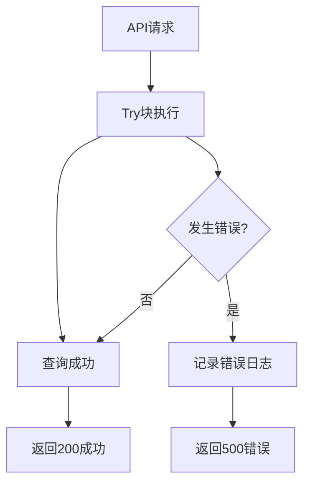
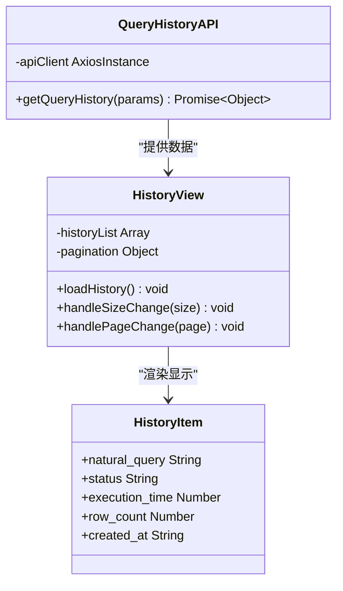
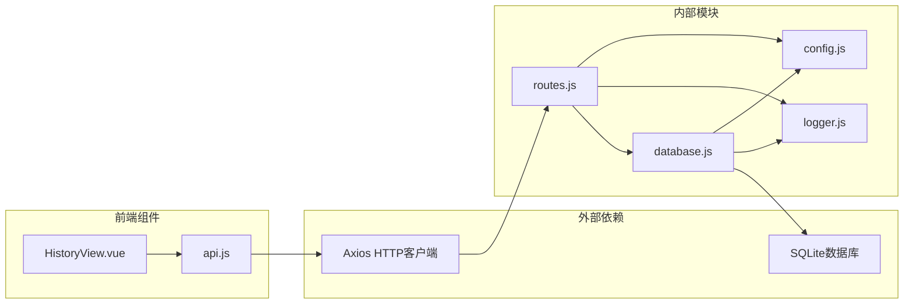

# 查询历史接口

<cite>
**本文档引用的文件**
- [routes.js](file://backend/src/core/routes.js)
- [database.js](file://backend/src/core/database.js)
- [app.js](file://backend/src/app.js)
- [HistoryView.vue](file://frontend/src/views/HistoryView.vue)
- [api.js](file://frontend/src/utils/api.js)
</cite>

## 目录
1. [简介](#简介)
2. [项目结构](#项目结构)
3. [核心组件](#核心组件)
4. [架构概览](#架构概览)
5. [详细组件分析](#详细组件分析)
6. [依赖关系分析](#依赖关系分析)
7. [性能考虑](#性能考虑)
8. [故障排除指南](#故障排除指南)
9. [结论](#结论)

## 简介

查询历史接口是 NL2SQL 系统中的重要功能模块，用于管理和查询用户的查询历史记录。该接口提供了按用户 ID 和会话 ID 筛选、分页查询等功能，支持数据分析和用户行为追踪。

NL2SQL 是一个基于自然语言转换为 SQL 的智能系统，查询历史接口作为其核心功能之一，帮助用户回顾历史查询、进行数据分析和优化查询体验。

## 项目结构

NL2SQL 项目采用前后端分离的架构设计，查询历史功能分布在后端 API 层和前端展示层：



**图表来源**
- [app.js:1-238](file://backend/src/app.js#L1-L238)
- [routes.js:400-450](file://backend/src/core/routes.js#L400-L450)
- [database.js:94-135](file://backend/src/core/database.js#L94-L135)

**章节来源**
- [app.js:78-80](file://backend/src/app.js#L78-L80)
- [routes.js:400-450](file://backend/src/core/routes.js#L400-L450)

## 核心组件

### 查询历史数据模型

查询历史接口基于 SQLite 数据库存储，核心数据结构如下：

| 字段名 | 数据类型 | 描述 | 索引 |
|--------|----------|------|------|
| id | INTEGER | 查询记录唯一标识 | 主键 |
| session_id | TEXT | 所属会话ID | 外键 |
| user_id | TEXT | 用户标识 | 索引 |
| natural_query | TEXT | 用户的自然语言查询 | - |
| generated_sql | TEXT | 生成的SQL语句 | - |
| status | TEXT | 查询执行状态 | 索引 |
| result | TEXT | 查询执行结果（JSON格式） | - |
| error_message | TEXT | 错误信息（如果失败） | - |
| execution_time | INTEGER | 执行耗时（毫秒） | - |
| row_count | INTEGER | 返回行数 | - |
| created_at | DATETIME | 查询创建时间 | 索引 |
| executed_at | DATETIME | 查询执行时间 | - |

### 查询历史表结构



**图表来源**
- [database.js:98-125](file://backend/src/core/database.js#L98-L125)

**章节来源**
- [database.js:98-135](file://backend/src/core/database.js#L98-L135)

## 架构概览

查询历史接口采用典型的三层架构设计：



**图表来源**
- [routes.js:413-450](file://backend/src/core/routes.js#L413-L450)
- [database.js:361-380](file://backend/src/core/database.js#L361-L380)

## 详细组件分析

### API 端点定义

查询历史接口在路由模块中定义为：

- **端点**: `GET /api/queries/history`
- **功能**: 获取查询历史记录
- **参数**: 支持用户筛选、会话筛选和分页控制

### 查询参数详解

| 参数名 | 类型 | 必需 | 默认值 | 描述 |
|--------|------|------|--------|------|
| user_id | String | 否 | - | 用户ID筛选条件 |
| session_id | String | 否 | - | 会话ID筛选条件 |
| limit | Number | 否 | 20 | 返回记录数量限制 |

### SQL 查询构建逻辑



**图表来源**
- [routes.js:413-450](file://backend/src/core/routes.js#L413-L450)

### 响应数据结构

成功的查询历史响应包含以下字段：

```javascript
{
  "count": 5,                    // 实际返回的记录数量
  "history": [                  // 查询历史记录数组
    {
      "id": 1,
      "session_id": "abc-123",
      "user_id": "user001",
      "natural_query": "查询销售额",
      "generated_sql": "SELECT SUM(amount) FROM sales",
      "status": "success",
      "result": "{\"data\": []}",
      "error_message": null,
      "execution_time": 150,
      "row_count": 1,
      "created_at": "2024-01-15T10:30:00Z",
      "executed_at": "2024-01-15T10:30:00Z"
    }
  ]
}
```

### 错误处理机制

查询历史接口实现了完善的错误处理：



**图表来源**
- [routes.js:444-449](file://backend/src/core/routes.js#L444-L449)

**章节来源**
- [routes.js:404-450](file://backend/src/core/routes.js#L404-L450)

### 前端集成实现

前端通过专门的 API 服务封装查询历史功能：



**图表来源**
- [api.js:206-208](file://frontend/src/utils/api.js#L206-L208)
- [HistoryView.vue:226-243](file://frontend/src/views/HistoryView.vue#L226-L243)

**章节来源**
- [api.js:206-208](file://frontend/src/utils/api.js#L206-L208)
- [HistoryView.vue:226-243](file://frontend/src/views/HistoryView.vue#L226-L243)

## 依赖关系分析

查询历史接口涉及多个组件的协作：



**图表来源**
- [app.js:48-49](file://backend/src/app.js#L48-L49)
- [routes.js:17-30](file://backend/src/core/routes.js#L17-L30)

**章节来源**
- [app.js:48-49](file://backend/src/app.js#L48-L49)
- [routes.js:17-30](file://backend/src/core/routes.js#L17-L30)

## 性能考虑

### 数据库索引优化

查询历史接口通过合理的索引设计确保查询性能：

| 索引名称 | 字段 | 作用 | 性能影响 |
|----------|------|------|----------|
| idx_query_history_user_id | user_id | 按用户查询 | O(log N) |
| idx_query_history_session_id | session_id | 按会话查询 | O(log N) |
| idx_query_history_created_at | created_at | 按时间排序 | O(log N) |
| idx_query_history_status | status | 按状态筛选 | O(log N) |

### 查询优化建议

1. **合理使用筛选条件**: 同时使用 user_id 和 session_id 可以显著减少扫描范围
2. **限制返回数量**: 默认 limit=20，避免一次性返回大量数据
3. **索引利用**: 确保查询条件能够有效利用现有索引
4. **分页策略**: 前端实现分页加载，避免全量数据传输

### 缓存策略

虽然查询历史接口本身不实现缓存，但可以通过以下方式优化：

- **短期缓存**: 对热门用户的查询历史进行短期缓存
- **结果集缓存**: 对复杂筛选条件的结果进行缓存
- **预加载策略**: 在用户进入历史页面时预加载部分数据

## 故障排除指南

### 常见错误及解决方案

| 错误类型 | 错误码 | 描述 | 解决方案 |
|----------|--------|------|----------|
| 数据库连接失败 | 500 | SQLite连接异常 | 检查数据库文件权限和路径 |
| SQL语法错误 | 500 | 查询语句执行失败 | 验证查询参数和SQL构造逻辑 |
| 参数验证失败 | 400 | 缺少必需参数 | 确保提供有效的查询参数 |
| 未找到数据 | 200 | 查询结果为空 | 检查筛选条件是否过于严格 |

### 调试技巧

1. **启用详细日志**: 在开发环境中查看详细的请求和响应日志
2. **参数验证**: 确保所有查询参数都经过适当的验证和清理
3. **数据库监控**: 监控查询执行时间和索引使用情况
4. **性能分析**: 使用数据库分析工具识别慢查询

**章节来源**
- [routes.js:444-449](file://backend/src/core/routes.js#L444-L449)

## 结论

查询历史接口作为 NL2SQL 系统的重要组成部分，提供了完整的查询历史管理功能。通过合理的数据模型设计、完善的错误处理机制和前端友好的交互界面，该接口能够满足用户对查询历史的管理需求。

主要优势包括：
- **灵活的筛选能力**: 支持按用户 ID 和会话 ID 精确筛选
- **高效的性能表现**: 通过索引优化确保查询响应速度
- **良好的扩展性**: 易于添加新的筛选条件和功能特性
- **完整的错误处理**: 提供清晰的错误信息和恢复机制

未来可以考虑的改进方向：
- 添加更多筛选选项（如时间范围、状态筛选）
- 实现查询历史的导出功能
- 增加查询历史的统计分析功能
- 优化大数据量场景下的查询性能